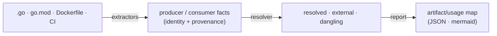

# assay

Deterministic **artifact/usage graph** of a codebase. assay reads source, build, and CI
signals and *derives* the graph of producible/consumable artifacts — Go modules and
symbols, container images, binaries — and the edges between them. The derived graph **is**
the architecture/seam map: because it comes from reality rather than prose, it cannot
silently drift.

Its distinctive value is the **cross-repo build edge** — an image or module produced in one
repo and consumed in another, a seam that lives in a `Dockerfile FROM` or a CI workflow and
never appears in any single `.go` file. Think of it as the deterministic version of "seam
discovery": same input, identical output, every time.



## Install

```bash
go install github.com/agentic-research/assay@latest
```

Or build from source (requires [Task](https://taskfile.dev)):

```bash
task build    # -> bin/assay
```

## Usage

```bash
# derive the graph for one repo (a mono-repo is just "one scan root")
assay map .

# multi-repo: edges that cross repos resolve into a single graph
assay map ./repo-a ./repo-b ./repo-c

# formats
assay map .            --format mermaid --group repo   # repo→repo dependency graph (default)
assay map ./a ./b      --format json                   # machine-readable map for tooling
assay map .            --format md                      # human markdown report
```

`--group repo` draws the repo-level dependency graph; `--group artifact` emits one node per
artifact.

### Example (real, generated)

`assay map` over the ecosystem derives — deterministically, not by hand:

```
x-ray  --4 artifacts-->  mache
mache  --3 artifacts-->  ley-line-open
```

That is the repo-dependency graph, *generated from code* (`go.mod` requires + Dockerfile
`FROM` + CI image refs), so it can't drift from reality.

## Using assay in your CI

The point of a *deterministic* graph is that CI can **fail when the dependency graph
drifts** — a new undeclared seam (import, `FROM`, CI image, crate dep) shows up as a diff
until you regenerate and commit the snapshot. This repo dogfoods exactly this; copy the
pattern (the canonical reference is this repo's [`Taskfile.yml`](Taskfile.yml) +
[`.github/workflows/assay-map.yml`](.github/workflows/assay-map.yml)).

**1. Install** — `go install github.com/agentic-research/assay@latest`

**2. Add Taskfile targets** (single source — CI and hooks *invoke* these, never re-implement):

```yaml
  map:        # regenerate the committed snapshot
    cmds:
      - assay map . --format md > docs/dependency-graph.md
  map:check:  # drift gate — fails if the graph changed
    cmds:
      - assay map . --format md > docs/dependency-graph.md
      - git diff --exit-code -- docs/dependency-graph.md
```

**3. Commit a baseline** — `task map && git add docs/dependency-graph.md && git commit`.

**4. Add the workflow** (`.github/workflows/assay-map.yml`) — it just calls the target:

```yaml
name: assay-map
on: [push, pull_request]
jobs:
  drift:
    runs-on: ubuntu-latest
    steps:
      - uses: actions/checkout@v4
      - uses: actions/setup-go@v5
        with: { go-version-file: go.mod }
      - run: go install github.com/agentic-research/assay@latest
      - uses: go-task/setup-task@v1
      - run: task map:check        # fails the build if the graph drifted
```

**5. (optional) Catch it before push** — invoke the same target from a `pre-push` hook so a
drift fails locally first (see this repo's `.githooks/pre-push` + `task hooks:install`).

> **Scope:** in-CI runs scan the single checked-out repo (`assay map .`). The cross-repo
> graph (`assay map ./a ./b`) needs multiple checkouts in the job — a fine next step, but
> the single-repo drift gate is the high-value default.

## How it works

- **Extractors** (`internal/extract/*`) — each deterministically parses one source kind and
  emits typed producer/consumer facts *with provenance (file, line)*. They never match
  edges. v1: `gomod`, `dockerfile`, `ci` (GitHub Actions), `gocode`.
- **Resolver** (`internal/resolve`) — joins consumer references to producer ids by a
  version-stripped **global identity**, into three computed buckets: **resolved** (producer
  in a scanned root — the cross-root edge), **external** (a real outside-world dependency),
  **dangling** (a producer nothing consumes — dead-surface candidate). "External vs
  internal" is *computed* from whether a scanned root produces the id, never configured.
- **Report** (`internal/report`) — emits the resolved graph as JSON or mermaid/markdown.

"Repo" is not a first-class concept — it's just a scan root. Mono-repo and multi-repo are
the same engine; global identity makes repo boundaries invisible.

The `gocode` extractor prefers [mache](https://github.com/agentic-research/mache)'s
canonical `v_defs`/`v_refs` symbol views (read from a `.db` via pure-Go
`modernc.org/sqlite` — mache need not be running) and falls back to in-tree tree-sitter.

## Packages

| Package | Role |
|---------|------|
| `internal/artifact/` | Vocabulary: `Identity` (canonical key), `Artifact`, `Producer`, `Consumer`, `Edge`, `Kind` |
| `internal/extract/` | `Extractor` interface + `Registry`; sub-extractors `gomod`, `dockerfile`, `ci`, `gocode` |
| `internal/resolve/` | Identity matching → resolved / external / dangling buckets |
| `internal/report/` | Emit the map as JSON / mermaid / markdown |
| `internal/code/` | Tree-sitter Go extraction (the `gocode` fallback backend) |
| `cmd/` | Cobra CLI: `map` (derive + emit), `version` |

## Status & non-goals

v1 derives the graph (four extractors + resolver + `assay map`) and has been run over the
real ecosystem. **Parked / non-goals** (deliberately not built): the old documentation-
coverage set operations (`|Code ∩ Docs| / |Code|`), semantic / HDC matching, HTML/DOM
extraction, a Rust rewrite, and the `assay drift` grading fallback (deferred to v2).

Design rationale lives in [`docs/superpowers/specs/`](docs/superpowers/specs/) and the
decision records in [`docs/decisions/`](docs/decisions/).

## Development

```bash
task check    # fmt + vet + lint + test
task test     # go test -race -v ./...
```

## License

Apache 2.0
