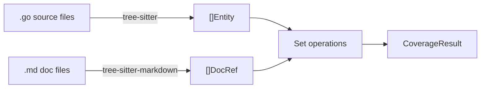

# assay

Documentation coverage verifier. Treats docs as claims about code and verifies them against tree-sitter-extracted entities.



## Install

```bash
go install github.com/agentic-research/assay@latest
```

Or build from source:

```bash
task build    # -> bin/assay
```

## Usage

```bash
# Verify docs coverage for a project
assay verify --source ./path/to/code --docs ./path/to/docs

# Auto-detect docs/ or doc/ directory
assay verify --source .

# Require minimum coverage (exits non-zero if below)
assay verify --threshold 0.8

# JSON output
assay verify --format json

# Fuzzy matching (Jaccard similarity on camelCase-split tokens)
assay verify --fuzzy 0.6

# Only exported entities (default: true)
assay verify --exported-only=false

# Show all matched entities
assay verify -v
```

### Example output

```
assay: documentation coverage report
====================================

Source: 3 packages, 42 exported entities
Docs:   2 files, 28 code references

Coverage:  24/42 (57.1%)
Staleness: 3/28 (10.7%)

Uncovered (18):
  function   NewParser                      internal/code/extract.go
  method     Parser.Reset                   internal/code/extract.go
  ...

Stale (3):
  `OldFunc`  docs/api.md:45
  ...
```

## How it works

**Entities** are extracted from Go source using tree-sitter queries (functions, methods, types, constants, variables). **DocRefs** are extracted from markdown files via tree-sitter-markdown (backtick code spans and headings).

Coverage is the intersection: `|Code ∩ Docs| / |Code|`

Matching supports:
- Exact name matching
- Fuzzy matching via camelCase-split Jaccard similarity
- Trigram matching
- Doc comment bridging (entity doc comments that reference other entities)

## Development

Requires [Task](https://taskfile.dev) runner.

```bash
task test     # go test -race -v ./...
task lint     # golangci-lint run ./...
task fmt      # gofumpt -w -extra .
task check    # fmt + vet + lint + test
```

## License

Apache 2.0
