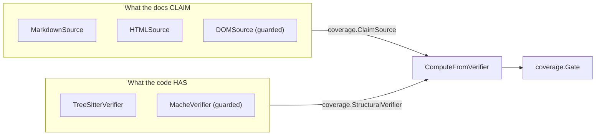

# assay — architecture

> **One job:** derive a codebase's **artifact/usage graph** from source, build, and CI
> signals — deterministically — so the architecture/seam map *is generated from reality*
> and cannot silently drift. `code → docs` (derive), not `docs → code` (grade).

This is the internal/component view. For the *generated* cross-repo dependency graph see
[`dependency-graph.md`](dependency-graph.md); for the rationale see the
[design spec](superpowers/specs/2026-06-22-assay-artifact-usage-graph-design.md) and the
[decision records](decisions/).

## The pipeline

```mermaid
graph LR
  subgraph sources["Sources (per scan root)"]
    s1["go.mod"]; s2["Cargo.toml"]; s3["Dockerfile"]
    s4["GitHub Actions"]; s5["wrangler.toml"]; s6["*.capnp const"]; s7["Go source"]
  end
  sources --> ext["Extractors\n(one per format)"]
  ext --> reg["Registry\n(gather facts across N roots)"]
  reg --> res["Resolver\n(match by global identity)"]
  res --> buckets["resolved · external · dangling"]
  buckets --> g["Graph"]
  g --> rep["Report\n(JSON · mermaid · md)"]
  rep --> cli["cmd: assay map"]
```

## Layers

| Layer | Package | Responsibility |
|-------|---------|----------------|
| **Vocabulary** | `internal/artifact` | `Identity` (kind + canonical, version-stripped key), `Artifact`, `Producer`, `Consumer`, `Edge`, `Kind`. The repo-agnostic core — resolution keys on identity, not location. |
| **Extractors** | `internal/extract` + sub-pkgs | The `Extractor` interface (`Name`/`Available`/`Extract`) + a `Registry` that gathers facts across all roots and records unavailable extractors instead of failing. Each sub-extractor parses **one** source kind and emits typed producer/consumer facts **with provenance (file, line)** — it never matches edges. |
| **Resolver** | `internal/resolve` | A single global pass joining consumer refs to producer ids by kind+identity → three **computed** buckets: **resolved** (producer in a scanned root — the cross-root edge), **external** (a real outside-world dep no scanned root produces), **dangling** (a producer nothing consumes). |
| **Graph** | `internal/graph` | In-memory artifact/edge graph + deterministic serialization. |
| **Report** | `internal/report` | Renders the graph as JSON, mermaid, or markdown. |
| **CLI** | `cmd` | `assay map <root...>` (derive + emit), `version`. |

## The seven v1 extractors

| Extractor | Reads | Emits |
|-----------|-------|-------|
| `extract/gomod` | `go.mod` | module producer; `require`/`replace` (incl. commented) consumers |
| `extract/cargo` | `Cargo.toml` (+ workspace members) | crate producer; path/git/registry dep consumers |
| `extract/dockerfile` | `Dockerfile` | build-target producers; `FROM` / `COPY --from` image consumers (stage-alias aware) |
| `extract/ci` | `.github/workflows/*.yml` | published-image producers (`${{ github.* }}` interpolated); pull/run consumers |
| `extract/wrangler` | `wrangler.toml` | worker producer; Cloudflare service-binding consumers |
| `extract/capnp` | `*.capnp` **const data** | service / container-image facts from declared bundles + bindings (schema-only files → no facts) |
| `extract/gocode` | Go source / mache `.db` | Go package/symbol producers + import consumers (prefers mache's `v_defs`/`v_refs`; tree-sitter fallback) |

## The verify pipeline: two swappable seams

`assay map` derives the artifact graph. `assay verify` answers a different question —
*do the docs still describe the code?* — and it is a join between two independently
swappable sides, each behind one interface:

```mermaid
graph LR
  subgraph claims["What the docs CLAIM"]
    ms["MarkdownSource"]; hs["HTMLSource"]; ds["DOMSource (guarded)"]
  end
  subgraph truth["What the code HAS"]
    tsv["TreeSitterVerifier"]; mv["MacheVerifier (guarded)"]
  end
  claims -->|"coverage.ClaimSource"| join["ComputeFromVerifier"]
  truth -->|"coverage.StructuralVerifier"| join
  join --> gate["coverage.Gate"]
```

| Side | Interface | Contract |
|------|-----------|----------|
| Docs | `coverage.ClaimSource` | `Claims() ([]DocRef, error)` — yields claim-references with provenance, independent of source format |
| Code | `coverage.StructuralVerifier` | `Name()` / `Available()` / `Entities()` — yields the constructs the code genuinely has |

### Claim sources

| Source | Constructor | Status |
|--------|-------------|--------|
| `MarkdownSource` | `NewMarkdownSource` | **Real, default.** `MarkdownSource.Claims` walks the tree and extracts code references from every markdown file. |
| `HTMLSource` | `NewHTMLSource` | **Real, opt-in** via `--html-docs`. `HTMLSource.Claims` delegates to `ExtractHTMLDir`, which walks a rendered docs site; `ExtractHTMLFile` handles one file and `ExtractHTMLSource` parses a byte buffer, keying on code and heading elements. |
| `DOMSource` | `NewDOMSource` | **Guarded seam.** Live-DOM capture over CDP is not wired, so `DOMSource.Available` is false and `DOMSource.Claims` returns `ErrDOMCaptureUnavailable` rather than an empty set that would read as "the page claims nothing". |

### Structural verifiers

| Verifier | Constructor | Status |
|----------|-------------|--------|
| `TreeSitterVerifier` | `NewTreeSitterVerifier` | **Real, default.** Constructed with a source root and an exported-only flag. `TreeSitterVerifier.Entities` extracts documentable constructs; `TreeSitterVerifier.Name` reports `"tree-sitter"` and `TreeSitterVerifier.Available` is always true — tree-sitter is linked into the binary. |
| `MacheVerifier` | `NewMacheVerifier` | **Guarded seam,** selectable via `--verifier=mache --mache-db`. `MacheVerifier.Available` requires *both* `mache` on PATH and a configured leyline-parsed `.db`; `Entities` returns `ErrMacheBackendUnavailable` rather than a fabricated set. |

**Why the guarded backends return errors instead of empty results.** An empty claim set and
an empty entity set are both *meaningful* values in a coverage join — they mean "the docs
assert nothing" and "the code contains nothing". A backend that cannot run must not emit
either, because both would silently invert the gate's verdict. Every unwired backend
therefore fails loudly and `Available()` reports false so callers can fall back.

## Invariants (what makes the number trustworthy)

- **Deterministic.** Same input → byte-identical output. (The whole point vs. an LLM exploring.)
- **Repo is not first-class.** A "repo" is just a scan root; mono-repo and multi-repo are the same engine — identity makes repo boundaries invisible.
- **No fabrication.** Unmatched references are **external**, never forced. No cross-kind / name-only matching, no hand-maintained name→kind tables. If an edge can't be derived from declared data, the tool says so (e.g. a manifest referencing an artifact by a local tag that matches no published identity surfaces as external — a *true* finding).
- **Derive, don't grade.** The map is generated from reality; a `drift` grading fallback against hand-written docs is deferred (v2).

## CI / drift gate

`task ci` (non-mutating) is the single source of truth: `fmt:check + vet + lint + test + map:check`. Both the [`assay-map` workflow](../.github/workflows/assay-map.yml) and the [`.githooks/pre-push`](../.githooks/pre-push) hook **invoke it** (never re-implement). `map:check` regenerates the graph and fails on any diff vs the committed [`dependency-graph.md`](dependency-graph.md) — so a new undeclared seam can't reach `main`. `task check` (dev) regenerates the snapshot so a graph change rides in the same commit. See [`CLAUDE.md`](../CLAUDE.md) for the full target list.

## Parked / non-goals

Semantic/HDC matching, a TS/npm extractor (the TS repos have no cross-repo npm edges), a Rust rewrite, and edges encoded *purely in code* (hardcoded socket paths with no structured declaration). Static **HTML extraction** was also listed here and is now RETAINED as a real opt-in claim source (see "The verify pipeline" above); what remains parked is *live-DOM* capture, which ships as a guarded seam. Doc-coverage set operations were also listed here; they are now RETAINED as the `assay verify` build gate (see CLAUDE.md "The doc gate") — what was set aside was doc coverage as a *product*, not as a *gate*. The rest were evaluated and deliberately set aside — see the spec's "Non-goals" section.
