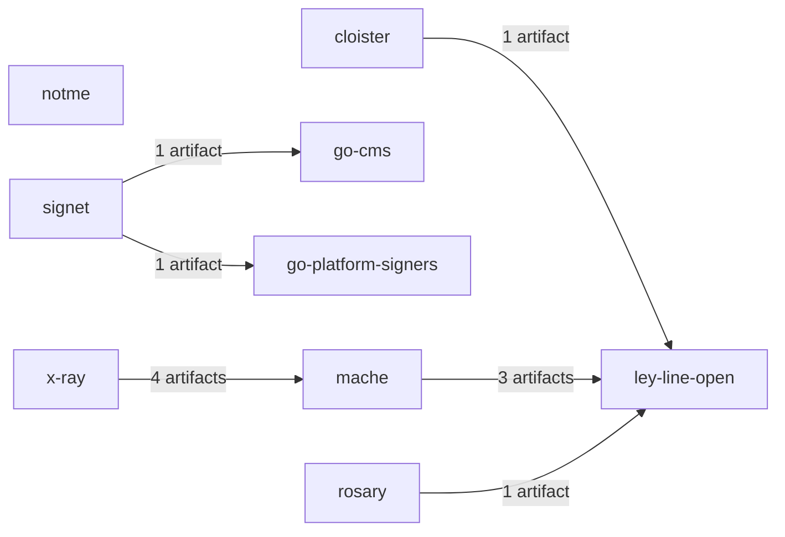

# assay map

- Resolved edges: 43
- External dependencies: 3333
- Dangling producers: 8287

## Graph

## External dependencies

- `agent-client-protocol` (cargo_crate) — /home/runner/work/_temp/ecosystem/rosary/Cargo.toml:48
- `anyhow` (cargo_crate) — /home/runner/work/_temp/ecosystem/ley-line-open/rs/ll-core/core/Cargo.toml:8
- `anyhow` (cargo_crate) — /home/runner/work/_temp/ecosystem/ley-line-open/rs/ll-core/schema/Cargo.toml:8
- `anyhow` (cargo_crate) — /home/runner/work/_temp/ecosystem/ley-line-open/rs/ll-open/chat-embed/Cargo.toml:17
- `anyhow` (cargo_crate) — /home/runner/work/_temp/ecosystem/ley-line-open/rs/ll-open/cli-lib/Cargo.toml:63
- `anyhow` (cargo_crate) — /home/runner/work/_temp/ecosystem/ley-line-open/rs/ll-open/cli/Cargo.toml:19
- `anyhow` (cargo_crate) — /home/runner/work/_temp/ecosystem/ley-line-open/rs/ll-open/fs/Cargo.toml:27
- `anyhow` (cargo_crate) — /home/runner/work/_temp/ecosystem/ley-line-open/rs/ll-open/hdc/Cargo.toml:8
- `anyhow` (cargo_crate) — /home/runner/work/_temp/ecosystem/ley-line-open/rs/ll-open/lsp/Cargo.toml:13
- `anyhow` (cargo_crate) — /home/runner/work/_temp/ecosystem/ley-line-open/rs/ll-open/sheaf/Cargo.toml:24
- `anyhow` (cargo_crate) — /home/runner/work/_temp/ecosystem/ley-line-open/rs/ll-open/text-search/Cargo.toml:28
- `anyhow` (cargo_crate) — /home/runner/work/_temp/ecosystem/ley-line-open/rs/ll-open/ts/Cargo.toml:44
- `anyhow` (cargo_crate) — /home/runner/work/_temp/ecosystem/ley-line-open/rs/ll-open/vcs/Cargo.toml:10
- `anyhow` (cargo_crate) — /home/runner/work/_temp/ecosystem/ley-line-open/rs/tools/compat-gen/Cargo.toml:19
- `anyhow` (cargo_crate) — /home/runner/work/_temp/ecosystem/ley-line-open/rs/tools/server-json-gen/Cargo.toml:19
- `anyhow` (cargo_crate) — /home/runner/work/_temp/ecosystem/rosary/Cargo.toml:31
- `anyhow` (cargo_crate) — /home/runner/work/_temp/ecosystem/rosary/crates/bdr/Cargo.toml:12
- `assert_cmd` (cargo_crate) — /home/runner/work/_temp/ecosystem/rosary/Cargo.toml:81
- `async-trait` (cargo_crate) — /home/runner/work/_temp/ecosystem/ley-line-open/rs/ll-open/fs/Cargo.toml:41
- `async-trait` (cargo_crate) — /home/runner/work/_temp/ecosystem/rosary/Cargo.toml:49
- `axum` (cargo_crate) — /home/runner/work/_temp/ecosystem/cloister/rs/crates/sign/Cargo.toml:94
- `axum` (cargo_crate) — /home/runner/work/_temp/ecosystem/ley-line-open/rs/ll-open/cli-lib/Cargo.toml:70
- `axum` (cargo_crate) — /home/runner/work/_temp/ecosystem/rosary/Cargo.toml:54
- `base64` (cargo_crate) — /home/runner/work/_temp/ecosystem/cloister/rs/crates/sign/Cargo.toml:117
- `base64` (cargo_crate) — /home/runner/work/_temp/ecosystem/ley-line-open/rs/ll-open/cli-lib/Cargo.toml:71
- `base64` (cargo_crate) — /home/runner/work/_temp/ecosystem/rosary/Cargo.toml:63
- `base64` (cargo_crate) — /home/runner/work/_temp/ecosystem/rosary/crates/crypto/Cargo.toml:14
- `base64ct` (cargo_crate) — /home/runner/work/_temp/ecosystem/cloister/rs/crates/sign/Cargo.toml:100
- `blake3` (cargo_crate) — /home/runner/work/_temp/ecosystem/cloister/rs/crates/cas/Cargo.toml:30
- `blake3` (cargo_crate) — /home/runner/work/_temp/ecosystem/ley-line-open/rs/ll-core/core/Cargo.toml:14
- `blake3` (cargo_crate) — /home/runner/work/_temp/ecosystem/ley-line-open/rs/ll-core/schema-capnp/Cargo.toml:19
- `blake3` (cargo_crate) — /home/runner/work/_temp/ecosystem/ley-line-open/rs/ll-open/cas-ffi/Cargo.toml:25
- `blake3` (cargo_crate) — /home/runner/work/_temp/ecosystem/ley-line-open/rs/ll-open/cli-lib/Cargo.toml:41
- `blake3` (cargo_crate) — /home/runner/work/_temp/ecosystem/ley-line-open/rs/ll-open/fs/Cargo.toml:32
- `blake3` (cargo_crate) — /home/runner/work/_temp/ecosystem/ley-line-open/rs/ll-open/hdc/Cargo.toml:9
- `bytemuck` (cargo_crate) — /home/runner/work/_temp/ecosystem/ley-line-open/rs/ll-core/core/Cargo.toml:10
- `bytemuck` (cargo_crate) — /home/runner/work/_temp/ecosystem/ley-line-open/rs/ll-open/cli-lib/Cargo.toml:66
- `bytemuck` (cargo_crate) — /home/runner/work/_temp/ecosystem/ley-line-open/rs/ll-open/fs/Cargo.toml:29
- `bytes` (cargo_crate) — /home/runner/work/_temp/ecosystem/notme/proxy/Cargo.toml:18
- `capnp` (cargo_crate) — /home/runner/work/_temp/ecosystem/cloister/tools/schema-bridge/Cargo.toml:29
- `capnp` (cargo_crate) — /home/runner/work/_temp/ecosystem/ley-line-open/rs/ll-core/public-schema/Cargo.toml:7
- `capnp` (cargo_crate) — /home/runner/work/_temp/ecosystem/ley-line-open/rs/ll-core/schema-capnp/Cargo.toml:13
- `capnp` (cargo_crate) — /home/runner/work/_temp/ecosystem/ley-line-open/rs/ll-open/cli-lib/Cargo.toml:39
- `capnp` (cargo_crate) — /home/runner/work/_temp/ecosystem/ley-line-open/rs/ll-open/lsp/Cargo.toml:16
- `capnp` (cargo_crate) — /home/runner/work/_temp/ecosystem/notme/packages/schema-bridge/Cargo.toml:18
- `capnp` (cargo_crate) — /home/runner/work/_temp/ecosystem/rosary/Cargo.toml:68
- `capnp-futures` (cargo_crate) — /home/runner/work/_temp/ecosystem/rosary/Cargo.toml:69
- `capnp-json` (cargo_crate) — /home/runner/work/_temp/ecosystem/ley-line-open/rs/ll-core/public-schema/Cargo.toml:13
- `capnp-json` (cargo_crate) — /home/runner/work/_temp/ecosystem/ley-line-open/rs/ll-open/cli-lib/Cargo.toml:40
- `capnpc` (cargo_crate) — /home/runner/work/_temp/ecosystem/ley-line-open/rs/ll-core/public-schema/Cargo.toml:16
- `capnpc` (cargo_crate) — /home/runner/work/_temp/ecosystem/ley-line-open/rs/ll-core/schema-capnp/Cargo.toml:28
- `capnpc` (cargo_crate) — /home/runner/work/_temp/ecosystem/rosary/Cargo.toml:77
- `chacha20poly1305` (cargo_crate) — /home/runner/work/_temp/ecosystem/rosary/crates/crypto/Cargo.toml:9
- `chrono` (cargo_crate) — /home/runner/work/_temp/ecosystem/rosary/Cargo.toml:32
- `clap` (cargo_crate) — /home/runner/work/_temp/ecosystem/cloister/rs/crates/sign/Cargo.toml:101
- `clap` (cargo_crate) — /home/runner/work/_temp/ecosystem/ley-line-open/rs/ll-open/chat-embed/Cargo.toml:15
- `clap` (cargo_crate) — /home/runner/work/_temp/ecosystem/ley-line-open/rs/ll-open/cli-lib/Cargo.toml:62
- `clap` (cargo_crate) — /home/runner/work/_temp/ecosystem/ley-line-open/rs/ll-open/cli/Cargo.toml:18
- `clap` (cargo_crate) — /home/runner/work/_temp/ecosystem/rosary/Cargo.toml:27
- `cms` (cargo_crate) — /home/runner/work/_temp/ecosystem/cloister/rs/crates/sign/Cargo.toml:67
- `cms` (cargo_crate) — /home/runner/work/_temp/ecosystem/ley-line-open/rs/ll-open/sign/Cargo.toml:10
- `cms` (cargo_crate) — /home/runner/work/_temp/ecosystem/signet/rs/crates/sign/Cargo.toml:18
- `const-oid` (cargo_crate) — /home/runner/work/_temp/ecosystem/cloister/rs/crates/sign/Cargo.toml:71
- `const-oid` (cargo_crate) — /home/runner/work/_temp/ecosystem/ley-line-open/rs/ll-open/sign/Cargo.toml:14
- `const-oid` (cargo_crate) — /home/runner/work/_temp/ecosystem/signet/rs/crates/sign/Cargo.toml:22
- `criterion` (cargo_crate) — /home/runner/work/_temp/ecosystem/ley-line-open/rs/ll-open/hdc/Cargo.toml:14
- `crossbeam-queue` (cargo_crate) — /home/runner/work/_temp/ecosystem/ley-line-open/rs/ll-open/fs/Cargo.toml:40
- `der` (cargo_crate) — /home/runner/work/_temp/ecosystem/cloister/rs/crates/sign/Cargo.toml:68
- `der` (cargo_crate) — /home/runner/work/_temp/ecosystem/ley-line-open/rs/ll-open/sign/Cargo.toml:11
- `der` (cargo_crate) — /home/runner/work/_temp/ecosystem/signet/rs/crates/sign/Cargo.toml:19
- `dirs` (cargo_crate) — /home/runner/work/_temp/ecosystem/ley-line-open/rs/ll-open/cli-lib/Cargo.toml:72
- `dirs` (cargo_crate) — /home/runner/work/_temp/ecosystem/ley-line-open/rs/ll-open/cli/Cargo.toml:20
- `dirs-next` (cargo_crate) — /home/runner/work/_temp/ecosystem/rosary/Cargo.toml:35
- `ed25519-dalek` (cargo_crate) — /home/runner/work/_temp/ecosystem/cloister/rs/crates/sign/Cargo.toml:72
- `ed25519-dalek` (cargo_crate) — /home/runner/work/_temp/ecosystem/ley-line-open/rs/ll-open/sign/Cargo.toml:15
- `ed25519-dalek` (cargo_crate) — /home/runner/work/_temp/ecosystem/rosary/Cargo.toml:62
- `ed25519-dalek` (cargo_crate) — /home/runner/work/_temp/ecosystem/signet/rs/crates/sign/Cargo.toml:23
- `env_logger` (cargo_crate) — /home/runner/work/_temp/ecosystem/ley-line-open/rs/ll-open/chat-embed/Cargo.toml:18
- `env_logger` (cargo_crate) — /home/runner/work/_temp/ecosystem/ley-line-open/rs/ll-open/cli/Cargo.toml:21
- `fastembed` (cargo_crate) — /home/runner/work/_temp/ecosystem/ley-line-open/rs/ll-open/chat-embed/Cargo.toml:13
- `fastembed` (cargo_crate) — /home/runner/work/_temp/ecosystem/ley-line-open/rs/ll-open/cli-lib/Cargo.toml:60
- `fuser` (cargo_crate) — /home/runner/work/_temp/ecosystem/ley-line-open/rs/ll-open/fs/Cargo.toml:33
- `futures` (cargo_crate) — /home/runner/work/_temp/ecosystem/ley-line-open/rs/ll-open/vcs/Cargo.toml:16
- `hex` (cargo_crate) — /home/runner/work/_temp/ecosystem/cloister/rs/crates/sign/Cargo.toml:116
- `hex` (cargo_crate) — /home/runner/work/_temp/ecosystem/ley-line-open/rs/ll-core/schema-capnp/Cargo.toml:25
- `hex` (cargo_crate) — /home/runner/work/_temp/ecosystem/ley-line-open/rs/ll-open/cli-lib/Cargo.toml:46
- `hex` (cargo_crate) — /home/runner/work/_temp/ecosystem/ley-line-open/rs/ll-open/sign/Cargo.toml:23
- `hex` (cargo_crate) — /home/runner/work/_temp/ecosystem/ley-line-open/rs/ll-open/vcs/Cargo.toml:11
- `hex` (cargo_crate) — /home/runner/work/_temp/ecosystem/rosary/Cargo.toml:61
- `hex` (cargo_crate) — /home/runner/work/_temp/ecosystem/rosary/crates/bdr/Cargo.toml:15
- `hex` (cargo_crate) — /home/runner/work/_temp/ecosystem/signet/rs/crates/sign/Cargo.toml:30
- `hmac` (cargo_crate) — /home/runner/work/_temp/ecosystem/rosary/Cargo.toml:56
- `http-body-util` (cargo_crate) — /home/runner/work/_temp/ecosystem/notme/proxy/Cargo.toml:12
- `hyper` (cargo_crate) — /home/runner/work/_temp/ecosystem/notme/proxy/Cargo.toml:10
- `hyper-rustls` (cargo_crate) — /home/runner/work/_temp/ecosystem/notme/proxy/Cargo.toml:16
- `hyper-util` (cargo_crate) — /home/runner/work/_temp/ecosystem/notme/proxy/Cargo.toml:11
- `indoc` (cargo_crate) — /home/runner/work/_temp/ecosystem/cloister/tools/schema-bridge/Cargo.toml:33
- `jj-lib` (cargo_crate) — /home/runner/work/_temp/ecosystem/ley-line-open/rs/ll-open/vcs/Cargo.toml:9
- `jsonwebtoken` (cargo_crate) — /home/runner/work/_temp/ecosystem/rosary/Cargo.toml:65
- `keyring` (cargo_crate) — /home/runner/work/_temp/ecosystem/cloister/rs/crates/sign/Cargo.toml:87
- `libc` (cargo_crate) — /home/runner/work/_temp/ecosystem/cloister/rs/crates/sign/Cargo.toml:76
- `libc` (cargo_crate) — /home/runner/work/_temp/ecosystem/ley-line-open/rs/ll-open/cli-lib/Cargo.toml:82
- `libc` (cargo_crate) — /home/runner/work/_temp/ecosystem/ley-line-open/rs/ll-open/cli/Cargo.toml:22
- `libc` (cargo_crate) — /home/runner/work/_temp/ecosystem/ley-line-open/rs/ll-open/fs/Cargo.toml:34
- `libc` (cargo_crate) — /home/runner/work/_temp/ecosystem/ley-line-open/rs/ll-open/sign/Cargo.toml:19
- `libc` (cargo_crate) — /home/runner/work/_temp/ecosystem/rosary/Cargo.toml:52
- `log` (cargo_crate) — /home/runner/work/_temp/ecosystem/cloister/rs/crates/sign/Cargo.toml:75
- `log` (cargo_crate) — /home/runner/work/_temp/ecosystem/ley-line-open/rs/ll-open/chat-embed/Cargo.toml:19
- `log` (cargo_crate) — /home/runner/work/_temp/ecosystem/ley-line-open/rs/ll-open/cli-lib/Cargo.toml:64
- `log` (cargo_crate) — /home/runner/work/_temp/ecosystem/ley-line-open/rs/ll-open/fs/Cargo.toml:35
- `log` (cargo_crate) — /home/runner/work/_temp/ecosystem/ley-line-open/rs/ll-open/hdc/Cargo.toml:10
- `log` (cargo_crate) — /home/runner/work/_temp/ecosystem/ley-line-open/rs/ll-open/lsp/Cargo.toml:15
- `log` (cargo_crate) — /home/runner/work/_temp/ecosystem/ley-line-open/rs/ll-open/sign/Cargo.toml:18
- `log` (cargo_crate) — /home/runner/work/_temp/ecosystem/ley-line-open/rs/ll-open/vcs/Cargo.toml:19
- `log` (cargo_crate) — /home/runner/work/_temp/ecosystem/signet/rs/crates/sign/Cargo.toml:26
- `lsp-types` (cargo_crate) — /home/runner/work/_temp/ecosystem/ley-line-open/rs/ll-open/lsp/Cargo.toml:10
- `memmap2` (cargo_crate) — /home/runner/work/_temp/ecosystem/ley-line-open/rs/ll-core/core/Cargo.toml:9
- `memmap2` (cargo_crate) — /home/runner/work/_temp/ecosystem/ley-line-open/rs/ll-open/cli-lib/Cargo.toml:65
- `memmap2` (cargo_crate) — /home/runner/work/_temp/ecosystem/ley-line-open/rs/ll-open/fs/Cargo.toml:28
- `nalgebra` (cargo_crate) — /home/runner/work/_temp/ecosystem/ley-line-open/rs/ll-open/sheaf/Cargo.toml:17
- `nalgebra-sparse` (cargo_crate) — /home/runner/work/_temp/ecosystem/ley-line-open/rs/ll-open/sheaf/Cargo.toml:19
- `nfsserve` (cargo_crate) — /home/runner/work/_temp/ecosystem/ley-line-open/rs/ll-open/fs/Cargo.toml:39
- `nono` (cargo_crate) — /home/runner/work/_temp/ecosystem/cloister/rs/crates/sign/Cargo.toml:93
- `openai-harmony` (cargo_crate) — /home/runner/work/_temp/ecosystem/rosary/crates/bdr/Cargo.toml:9
- `openssl` (cargo_crate) — /home/runner/work/_temp/ecosystem/rosary/Cargo.toml:74
- `owo-colors` (cargo_crate) — /home/runner/work/_temp/ecosystem/rosary/Cargo.toml:64
- `pollster` (cargo_crate) — /home/runner/work/_temp/ecosystem/ley-line-open/rs/ll-open/vcs/Cargo.toml:20
- `predicates` (cargo_crate) — /home/runner/work/_temp/ecosystem/rosary/Cargo.toml:82
- `pretty_assertions` (cargo_crate) — /home/runner/work/_temp/ecosystem/rosary/crates/bdr/Cargo.toml:18
- `r2d2` (cargo_crate) — /home/runner/work/_temp/ecosystem/ley-line-open/rs/ll-open/cli-lib/Cargo.toml:53
- `r2d2_sqlite` (cargo_crate) — /home/runner/work/_temp/ecosystem/ley-line-open/rs/ll-open/cli-lib/Cargo.toml:54
- `rand` (cargo_crate) — /home/runner/work/_temp/ecosystem/cloister/rs/crates/sign/Cargo.toml:115
- `rand` (cargo_crate) — /home/runner/work/_temp/ecosystem/ley-line-open/rs/ll-open/cli-lib/Cargo.toml:45
- `rand` (cargo_crate) — /home/runner/work/_temp/ecosystem/ley-line-open/rs/ll-open/sign/Cargo.toml:22
- `rand` (cargo_crate) — /home/runner/work/_temp/ecosystem/rosary/Cargo.toml:84
- `rand` (cargo_crate) — /home/runner/work/_temp/ecosystem/rosary/crates/crypto/Cargo.toml:15
- `rand` (cargo_crate) — /home/runner/work/_temp/ecosystem/signet/rs/crates/sign/Cargo.toml:29
- `rayon` (cargo_crate) — /home/runner/work/_temp/ecosystem/ley-line-open/rs/ll-open/cli-lib/Cargo.toml:74
- `reqwest` (cargo_crate) — /home/runner/work/_temp/ecosystem/cloister/rs/crates/sign/Cargo.toml:119
- `reqwest` (cargo_crate) — /home/runner/work/_temp/ecosystem/rosary/Cargo.toml:38
- `rusqlite` (cargo_crate) — /home/runner/work/_temp/ecosystem/ley-line-open/rs/ll-core/schema/Cargo.toml:7
- `rusqlite` (cargo_crate) — /home/runner/work/_temp/ecosystem/ley-line-open/rs/ll-open/chat-embed/Cargo.toml:14
- `rusqlite` (cargo_crate) — /home/runner/work/_temp/ecosystem/ley-line-open/rs/ll-open/cli-lib/Cargo.toml:48
- `rusqlite` (cargo_crate) — /home/runner/work/_temp/ecosystem/ley-line-open/rs/ll-open/fs/Cargo.toml:36
- `rusqlite` (cargo_crate) — /home/runner/work/_temp/ecosystem/ley-line-open/rs/ll-open/hdc/Cargo.toml:7
- `rusqlite` (cargo_crate) — /home/runner/work/_temp/ecosystem/ley-line-open/rs/ll-open/lsp/Cargo.toml:9
- `rusqlite` (cargo_crate) — /home/runner/work/_temp/ecosystem/ley-line-open/rs/ll-open/ts/Cargo.toml:42
- `rusqlite` (cargo_crate) — /home/runner/work/_temp/ecosystem/ley-line-open/rs/ll-open/vcs/Cargo.toml:23
- `rusqlite` (cargo_crate) — /home/runner/work/_temp/ecosystem/rosary/Cargo.toml:67
- `rustls` (cargo_crate) — /home/runner/work/_temp/ecosystem/notme/proxy/Cargo.toml:13
- `rustls-pemfile` (cargo_crate) — /home/runner/work/_temp/ecosystem/notme/proxy/Cargo.toml:14
- `serde` (cargo_crate) — /home/runner/work/_temp/ecosystem/cloister/rs/crates/sign/Cargo.toml:98
- `serde` (cargo_crate) — /home/runner/work/_temp/ecosystem/ley-line-open/rs/ll-core/core/Cargo.toml:11
- `serde` (cargo_crate) — /home/runner/work/_temp/ecosystem/ley-line-open/rs/ll-core/schema-capnp/Cargo.toml:22
- `serde` (cargo_crate) — /home/runner/work/_temp/ecosystem/ley-line-open/rs/ll-open/cli-lib/Cargo.toml:67
- `serde` (cargo_crate) — /home/runner/work/_temp/ecosystem/ley-line-open/rs/ll-open/fs/Cargo.toml:37
- `serde` (cargo_crate) — /home/runner/work/_temp/ecosystem/ley-line-open/rs/ll-open/lsp/Cargo.toml:11
- `serde` (cargo_crate) — /home/runner/work/_temp/ecosystem/ley-line-open/rs/ll-open/sheaf/Cargo.toml:20
- `serde` (cargo_crate) — /home/runner/work/_temp/ecosystem/ley-line-open/rs/ll-open/text-search/Cargo.toml:55
- `serde` (cargo_crate) — /home/runner/work/_temp/ecosystem/ley-line-open/rs/ll-open/vcs/Cargo.toml:17
- `serde` (cargo_crate) — /home/runner/work/_temp/ecosystem/ley-line-open/rs/tools/compat-gen/Cargo.toml:17
- `serde` (cargo_crate) — /home/runner/work/_temp/ecosystem/ley-line-open/rs/tools/server-json-gen/Cargo.toml:17
- `serde` (cargo_crate) — /home/runner/work/_temp/ecosystem/rosary/Cargo.toml:28
- `serde` (cargo_crate) — /home/runner/work/_temp/ecosystem/rosary/crates/bdr/Cargo.toml:10
- `serde` (cargo_crate) — /home/runner/work/_temp/ecosystem/rosary/crates/crypto/Cargo.toml:12
- `serde_json` (cargo_crate) — /home/runner/work/_temp/ecosystem/cloister/rs/crates/sign/Cargo.toml:99
- `serde_json` (cargo_crate) — /home/runner/work/_temp/ecosystem/ley-line-open/rs/ll-core/schema-capnp/Cargo.toml:23
- `serde_json` (cargo_crate) — /home/runner/work/_temp/ecosystem/ley-line-open/rs/ll-open/chat-embed/Cargo.toml:16
- `serde_json` (cargo_crate) — /home/runner/work/_temp/ecosystem/ley-line-open/rs/ll-open/cli-lib/Cargo.toml:68
- `serde_json` (cargo_crate) — /home/runner/work/_temp/ecosystem/ley-line-open/rs/ll-open/fs/Cargo.toml:38
- `serde_json` (cargo_crate) — /home/runner/work/_temp/ecosystem/ley-line-open/rs/ll-open/lsp/Cargo.toml:12
- `serde_json` (cargo_crate) — /home/runner/work/_temp/ecosystem/ley-line-open/rs/ll-open/text-search/Cargo.toml:50
- `serde_json` (cargo_crate) — /home/runner/work/_temp/ecosystem/ley-line-open/rs/ll-open/ts/Cargo.toml:43
- `serde_json` (cargo_crate) — /home/runner/work/_temp/ecosystem/ley-line-open/rs/ll-open/vcs/Cargo.toml:18
- `serde_json` (cargo_crate) — /home/runner/work/_temp/ecosystem/ley-line-open/rs/tools/compat-gen/Cargo.toml:18
- `serde_json` (cargo_crate) — /home/runner/work/_temp/ecosystem/ley-line-open/rs/tools/server-json-gen/Cargo.toml:18
- `serde_json` (cargo_crate) — /home/runner/work/_temp/ecosystem/rosary/Cargo.toml:29
- `serde_json` (cargo_crate) — /home/runner/work/_temp/ecosystem/rosary/crates/bdr/Cargo.toml:11
- `serde_json` (cargo_crate) — /home/runner/work/_temp/ecosystem/rosary/crates/crypto/Cargo.toml:13
- `serial_test` (cargo_crate) — /home/runner/work/_temp/ecosystem/cloister/rs/crates/sign/Cargo.toml:126
- `sha2` (cargo_crate) — /home/runner/work/_temp/ecosystem/cloister/rs/crates/sign/Cargo.toml:73
- `sha2` (cargo_crate) — /home/runner/work/_temp/ecosystem/ley-line-open/rs/ll-open/sheaf/Cargo.toml:18
- `sha2` (cargo_crate) — /home/runner/work/_temp/ecosystem/ley-line-open/rs/ll-open/sign/Cargo.toml:16
- `sha2` (cargo_crate) — /home/runner/work/_temp/ecosystem/rosary/Cargo.toml:57
- `sha2` (cargo_crate) — /home/runner/work/_temp/ecosystem/rosary/crates/bdr/Cargo.toml:14
- `sha2` (cargo_crate) — /home/runner/work/_temp/ecosystem/rosary/crates/crypto/Cargo.toml:10
- `sha2` (cargo_crate) — /home/runner/work/_temp/ecosystem/signet/rs/crates/sign/Cargo.toml:24
- `shellexpand` (cargo_crate) — /home/runner/work/_temp/ecosystem/rosary/Cargo.toml:34
- `socket2` (cargo_crate) — /home/runner/work/_temp/ecosystem/rosary/Cargo.toml:66
- `spki` (cargo_crate) — /home/runner/work/_temp/ecosystem/cloister/rs/crates/sign/Cargo.toml:70
- `spki` (cargo_crate) — /home/runner/work/_temp/ecosystem/ley-line-open/rs/ll-open/sign/Cargo.toml:13
- `spki` (cargo_crate) — /home/runner/work/_temp/ecosystem/signet/rs/crates/sign/Cargo.toml:21
- `sqlite-vec` (cargo_crate) — /home/runner/work/_temp/ecosystem/ley-line-open/rs/ll-open/cli-lib/Cargo.toml:55
- `sqlx-core` (cargo_crate) — /home/runner/work/_temp/ecosystem/rosary/Cargo.toml:36
- `sqlx-mysql` (cargo_crate) — /home/runner/work/_temp/ecosystem/rosary/Cargo.toml:37
- `subtle` (cargo_crate) — /home/runner/work/_temp/ecosystem/ley-line-open/rs/ll-open/cli-lib/Cargo.toml:44
- `tempfile` (cargo_crate) — /home/runner/work/_temp/ecosystem/cloister/rs/crates/sign/Cargo.toml:121
- `tempfile` (cargo_crate) — /home/runner/work/_temp/ecosystem/ley-line-open/rs/ll-core/core/Cargo.toml:21
- `tempfile` (cargo_crate) — /home/runner/work/_temp/ecosystem/ley-line-open/rs/ll-open/cli-lib/Cargo.toml:75
- `tempfile` (cargo_crate) — /home/runner/work/_temp/ecosystem/ley-line-open/rs/ll-open/fs/Cargo.toml:53
- `tempfile` (cargo_crate) — /home/runner/work/_temp/ecosystem/ley-line-open/rs/ll-open/hdc/Cargo.toml:13
- `tempfile` (cargo_crate) — /home/runner/work/_temp/ecosystem/ley-line-open/rs/ll-open/lsp/Cargo.toml:19
- `tempfile` (cargo_crate) — /home/runner/work/_temp/ecosystem/ley-line-open/rs/ll-open/text-search/Cargo.toml:54
- `tempfile` (cargo_crate) — /home/runner/work/_temp/ecosystem/ley-line-open/rs/ll-open/vcs/Cargo.toml:21
- `tempfile` (cargo_crate) — /home/runner/work/_temp/ecosystem/rosary/Cargo.toml:80
- `thiserror` (cargo_crate) — /home/runner/work/_temp/ecosystem/cloister/rs/crates/sign/Cargo.toml:74
- `thiserror` (cargo_crate) — /home/runner/work/_temp/ecosystem/cloister/tools/schema-bridge/Cargo.toml:30
- `thiserror` (cargo_crate) — /home/runner/work/_temp/ecosystem/ley-line-open/rs/ll-open/sheaf/Cargo.toml:21
- `thiserror` (cargo_crate) — /home/runner/work/_temp/ecosystem/ley-line-open/rs/ll-open/sign/Cargo.toml:17
- `thiserror` (cargo_crate) — /home/runner/work/_temp/ecosystem/ley-line-open/rs/ll-open/text-search/Cargo.toml:29
- `thiserror` (cargo_crate) — /home/runner/work/_temp/ecosystem/notme/packages/schema-bridge/Cargo.toml:19
- `thiserror` (cargo_crate) — /home/runner/work/_temp/ecosystem/rosary/crates/bdr/Cargo.toml:13
- `thiserror` (cargo_crate) — /home/runner/work/_temp/ecosystem/rosary/crates/crypto/Cargo.toml:11
- `thiserror` (cargo_crate) — /home/runner/work/_temp/ecosystem/signet/rs/crates/sign/Cargo.toml:25
- `tokio` (cargo_crate) — /home/runner/work/_temp/ecosystem/cloister/rs/crates/sign/Cargo.toml:95
- `tokio` (cargo_crate) — /home/runner/work/_temp/ecosystem/ley-line-open/rs/ll-open/cli-lib/Cargo.toml:69
- `tokio` (cargo_crate) — /home/runner/work/_temp/ecosystem/ley-line-open/rs/ll-open/cli/Cargo.toml:23
- `tokio` (cargo_crate) — /home/runner/work/_temp/ecosystem/ley-line-open/rs/ll-open/fs/Cargo.toml:42
- `tokio` (cargo_crate) — /home/runner/work/_temp/ecosystem/ley-line-open/rs/ll-open/lsp/Cargo.toml:14
- `tokio` (cargo_crate) — /home/runner/work/_temp/ecosystem/ley-line-open/rs/ll-open/vcs/Cargo.toml:22
- `tokio` (cargo_crate) — /home/runner/work/_temp/ecosystem/notme/proxy/Cargo.toml:9
- `tokio` (cargo_crate) — /home/runner/work/_temp/ecosystem/rosary/Cargo.toml:30
- `tokio-rustls` (cargo_crate) — /home/runner/work/_temp/ecosystem/notme/proxy/Cargo.toml:15
- `tokio-util` (cargo_crate) — /home/runner/work/_temp/ecosystem/rosary/Cargo.toml:50
- `toml` (cargo_crate) — /home/runner/work/_temp/ecosystem/ley-line-open/rs/ll-open/ts/Cargo.toml:48
- `toml` (cargo_crate) — /home/runner/work/_temp/ecosystem/rosary/Cargo.toml:33
- `tower` (cargo_crate) — /home/runner/work/_temp/ecosystem/cloister/rs/crates/sign/Cargo.toml:96
- `tower` (cargo_crate) — /home/runner/work/_temp/ecosystem/ley-line-open/rs/ll-open/cli-lib/Cargo.toml:99
- `tower` (cargo_crate) — /home/runner/work/_temp/ecosystem/rosary/Cargo.toml:83
- `tower-http` (cargo_crate) — /home/runner/work/_temp/ecosystem/cloister/rs/crates/sign/Cargo.toml:97
- `tracing` (cargo_crate) — /home/runner/work/_temp/ecosystem/cloister/rs/crates/sign/Cargo.toml:102
- `tracing-subscriber` (cargo_crate) — /home/runner/work/_temp/ecosystem/cloister/rs/crates/sign/Cargo.toml:103
- `tree-sitter` (cargo_crate) — /home/runner/work/_temp/ecosystem/ley-line-open/rs/ll-open/cli-lib/Cargo.toml:61
- `tree-sitter` (cargo_crate) — /home/runner/work/_temp/ecosystem/ley-line-open/rs/ll-open/fs/Cargo.toml:43
- `tree-sitter` (cargo_crate) — /home/runner/work/_temp/ecosystem/ley-line-open/rs/ll-open/ts/Cargo.toml:30
- `tree-sitter-elixir` (cargo_crate) — /home/runner/work/_temp/ecosystem/ley-line-open/rs/ll-open/fs/Cargo.toml:49
- `tree-sitter-elixir` (cargo_crate) — /home/runner/work/_temp/ecosystem/ley-line-open/rs/ll-open/ts/Cargo.toml:37
- `tree-sitter-go` (cargo_crate) — /home/runner/work/_temp/ecosystem/ley-line-open/rs/ll-open/fs/Cargo.toml:44
- `tree-sitter-go` (cargo_crate) — /home/runner/work/_temp/ecosystem/ley-line-open/rs/ll-open/ts/Cargo.toml:35
- `tree-sitter-hcl` (cargo_crate) — /home/runner/work/_temp/ecosystem/ley-line-open/rs/ll-open/ts/Cargo.toml:38
- `tree-sitter-html` (cargo_crate) — /home/runner/work/_temp/ecosystem/ley-line-open/rs/ll-open/ts/Cargo.toml:31
- `tree-sitter-javascript` (cargo_crate) — /home/runner/work/_temp/ecosystem/ley-line-open/rs/ll-open/fs/Cargo.toml:46
- `tree-sitter-json` (cargo_crate) — /home/runner/work/_temp/ecosystem/ley-line-open/rs/ll-open/ts/Cargo.toml:33
- `tree-sitter-md` (cargo_crate) — /home/runner/work/_temp/ecosystem/ley-line-open/rs/ll-open/ts/Cargo.toml:32
- `tree-sitter-proto` (cargo_crate) — /home/runner/work/_temp/ecosystem/ley-line-open/rs/ll-open/ts/Cargo.toml:40
- `tree-sitter-python` (cargo_crate) — /home/runner/work/_temp/ecosystem/ley-line-open/rs/ll-open/fs/Cargo.toml:45
- `tree-sitter-python` (cargo_crate) — /home/runner/work/_temp/ecosystem/ley-line-open/rs/ll-open/ts/Cargo.toml:36
- `tree-sitter-rust` (cargo_crate) — /home/runner/work/_temp/ecosystem/ley-line-open/rs/ll-open/fs/Cargo.toml:48
- `tree-sitter-rust` (cargo_crate) — /home/runner/work/_temp/ecosystem/ley-line-open/rs/ll-open/ts/Cargo.toml:39
- `tree-sitter-typescript` (cargo_crate) — /home/runner/work/_temp/ecosystem/ley-line-open/rs/ll-open/fs/Cargo.toml:47
- `tree-sitter-yaml` (cargo_crate) — /home/runner/work/_temp/ecosystem/ley-line-open/rs/ll-open/ts/Cargo.toml:34
- `tungstenite` (cargo_crate) — /home/runner/work/_temp/ecosystem/rosary/Cargo.toml:51
- `uuid` (cargo_crate) — /home/runner/work/_temp/ecosystem/ley-line-open/rs/ll-open/text-search/Cargo.toml:49
- `uuid` (cargo_crate) — /home/runner/work/_temp/ecosystem/rosary/Cargo.toml:55
- `uv-normalize` (cargo_crate) — /home/runner/work/_temp/ecosystem/ley-line-open/rs/ll-open/ts/Cargo.toml:47
- `uv-pep440` (cargo_crate) — /home/runner/work/_temp/ecosystem/ley-line-open/rs/ll-open/ts/Cargo.toml:46
- `uv-pep508` (cargo_crate) — /home/runner/work/_temp/ecosystem/ley-line-open/rs/ll-open/ts/Cargo.toml:45
- `webpki-roots` (cargo_crate) — /home/runner/work/_temp/ecosystem/notme/proxy/Cargo.toml:17
- `which` (cargo_crate) — /home/runner/work/_temp/ecosystem/ley-line-open/rs/ll-open/cli-lib/Cargo.toml:73
- `witchcraft` (cargo_crate) — /home/runner/work/_temp/ecosystem/ley-line-open/rs/ll-open/text-search/Cargo.toml:48
- `x509-cert` (cargo_crate) — /home/runner/work/_temp/ecosystem/cloister/rs/crates/sign/Cargo.toml:69
- `x509-cert` (cargo_crate) — /home/runner/work/_temp/ecosystem/ley-line-open/rs/ll-open/sign/Cargo.toml:12
- `x509-cert` (cargo_crate) — /home/runner/work/_temp/ecosystem/signet/rs/crates/sign/Cargo.toml:20
- `zeroize` (cargo_crate) — /home/runner/work/_temp/ecosystem/cloister/rs/crates/sign/Cargo.toml:88
- `-` (cli_binary) — .github/workflows/oidc-signing.yml:61
- `EOF` (cli_binary) — .github/workflows/oidc-signing.yml:56
- `apt-get` (cli_binary) — .github/workflows/ci.yml:25
- `apt-get` (cli_binary) — .github/workflows/ci.yml:42
- `apt-get` (cli_binary) — .github/workflows/ci.yml:70
- `apt-get` (cli_binary) — .github/workflows/ci.yml:111
- `apt-get` (cli_binary) — .github/workflows/cloister-schema-go.yml:55
- `apt-get` (cli_binary) — .github/workflows/generated-drift.yml:80
- `apt-get` (cli_binary) — .github/workflows/leyline-schema-go.yml:56
- `apt-get` (cli_binary) — .github/workflows/openssl.yml:24
- `apt-get` (cli_binary) — .github/workflows/release.yml:56
- `apt-get` (cli_binary) — .github/workflows/release.yml:119
- `apt-get` (cli_binary) — .github/workflows/rust-release.yml:49
- `audience:` (cli_binary) — .github/workflows/oidc-signing.yml:65
- `awk` (cli_binary) — .github/workflows/release.yml:79
- `break` (cli_binary) — .github/workflows/oidc-signing.yml:80
- `brew` (cli_binary) — .github/workflows/release.yml:67
- `brew` (cli_binary) — .github/workflows/release.yml:127
- `build_asset` (cli_binary) — .github/workflows/release.yml:100
- `capnp` (cli_binary) — .github/workflows/cloister-schema-go.yml:57
- `capnp` (cli_binary) — .github/workflows/generated-drift.yml:82
- `capnp` (cli_binary) — .github/workflows/leyline-schema-go.yml:63
- `capnp` (cli_binary) — .github/workflows/release.yml:130
- `cargo` (cli_binary) — .github/workflows/ci.yml:210
- `cargo` (cli_binary) — .github/workflows/release.yml:90
- `cargo` (cli_binary) — .github/workflows/release.yml:137
- `cargo` (cli_binary) — .github/workflows/rust-ci.yml:23
- `cargo` (cli_binary) — .github/workflows/rust-release.yml:55
- `cbindgen` (cli_binary) — .github/workflows/rust-release.yml:111
- `certificate_validity:` (cli_binary) — .github/workflows/oidc-signing.yml:66
- `chmod` (cli_binary) — .github/workflows/openssl.yml:35
- `chmod` (cli_binary) — .github/workflows/release.yml:97
- `chmod` (cli_binary) — .github/workflows/release.yml:118
- `chmod` (cli_binary) — .github/workflows/release.yml:146
- `chmod` (cli_binary) — .github/workflows/release.yml:156
- `chmod` (cli_binary) — .github/workflows/signet-resign.yml:104
- `codesign` (cli_binary) — .github/workflows/release.yml:105
- `codesign` (cli_binary) — .github/workflows/release.yml:112
- `config:` (cli_binary) — .github/workflows/oidc-signing.yml:62
- `content` (cli_binary) — .github/workflows/release.yml:262
- `corepack` (cli_binary) — .github/workflows/ci.yml:24
- `corepack` (cli_binary) — .github/workflows/ci.yml:45
- `cosign` (cli_binary) — .github/workflows/release.yml:149
- `cosign` (cli_binary) — .github/workflows/release.yml:166
- `cosign` (cli_binary) — .github/workflows/release.yml:200
- `curl` (cli_binary) — .github/workflows/ci.yml:53
- `curl` (cli_binary) — .github/workflows/release.yml:153
- `curl` (cli_binary) — .github/workflows/release.yml:245
- `def` (cli_binary) — .github/workflows/release.yml:265
- `docker` (cli_binary) — .github/workflows/release.yml:166
- `enabled:` (cli_binary) — .github/workflows/oidc-signing.yml:67
- `file` (cli_binary) — .github/workflows/release.yml:147
- `gh` (cli_binary) — .github/workflows/ci.yml:54
- `gh` (cli_binary) — .github/workflows/release.yml:34
- `gh` (cli_binary) — .github/workflows/release.yml:54
- `gh` (cli_binary) — .github/workflows/release.yml:148
- `git` (cli_binary) — .github/workflows/assay-ecosystem.yml:49
- `git` (cli_binary) — .github/workflows/ci.yml:49
- `git` (cli_binary) — .github/workflows/release.yml:278
- `git` (cli_binary) — .github/workflows/signet-resign.yml:122
- `global` (cli_binary) — .github/workflows/release.yml:266
- `go` (cli_binary) — .github/workflows/assay-ecosystem.yml:38
- `go` (cli_binary) — .github/workflows/cache-roundtrip.yml:54
- `go` (cli_binary) — .github/workflows/ci.yml:29
- `go` (cli_binary) — .github/workflows/ci.yml:31
- `go` (cli_binary) — .github/workflows/ci.yml:54
- `go` (cli_binary) — .github/workflows/ci.yml:58
- `go` (cli_binary) — .github/workflows/cloister-schema-go.yml:63
- `go` (cli_binary) — .github/workflows/find-smells.yml:55
- `go` (cli_binary) — .github/workflows/integration.yml:52
- `go` (cli_binary) — .github/workflows/leyline-schema-go.yml:69
- `go` (cli_binary) — .github/workflows/openssl.yml:30
- `go` (cli_binary) — .github/workflows/release.yml:55
- `go` (cli_binary) — .github/workflows/release.yml:95
- `golangci-lint` (cli_binary) — .github/workflows/ci.yml:54
- `gosec` (cli_binary) — .github/workflows/ci.yml:113
- `gosec` (cli_binary) — .github/workflows/ci.yml:180
- `govulncheck` (cli_binary) — .github/workflows/ci.yml:119
- `grep` (cli_binary) — .github/workflows/ci.yml:50
- `grep` (cli_binary) — .github/workflows/lfs-guard.yml:57
- `i` (cli_binary) — .github/workflows/release.yml:264
- `import` (cli_binary) — .github/workflows/release.yml:260
- `issuer_url:` (cli_binary) — .github/workflows/oidc-signing.yml:64
- `make` (cli_binary) — .github/workflows/ci.yml:33
- `name:` (cli_binary) — .github/workflows/oidc-signing.yml:63
- `npm` (cli_binary) — .github/workflows/ci.yml:35
- `openssl` (cli_binary) — .github/workflows/oidc-signing.yml:41
- `openssl` (cli_binary) — .github/workflows/openssl.yml:26
- `pip` (cli_binary) — .github/workflows/ci.yml:37
- `pip3` (cli_binary) — .github/workflows/release.yml:234
- `pkg-config` (cli_binary) — .github/workflows/release.yml:131
- `pnpm` (cli_binary) — .github/workflows/ci.yml:56
- `pnpm` (cli_binary) — .github/workflows/generated-drift.yml:86
- `providers:` (cli_binary) — .github/workflows/oidc-signing.yml:60
- `python3` (cli_binary) — .github/workflows/release.yml:259
- `regen.sh` (cli_binary) — .github/workflows/cloister-schema-go.yml:68
- `regen.sh` (cli_binary) — .github/workflows/leyline-schema-go.yml:74
- `result` (cli_binary) — .github/workflows/release.yml:267
- `rsry` (cli_binary) — .github/workflows/release.yml:101
- `sed` (cli_binary) — .github/workflows/openssl.yml:50
- `sed` (cli_binary) — .github/workflows/release.yml:256
- `sha256sum` (cli_binary) — .github/workflows/release.yml:78
- `sha256sum` (cli_binary) — .github/workflows/release.yml:138
- `sha256sum` (cli_binary) — .github/workflows/release.yml:168
- `sha256sum` (cli_binary) — .github/workflows/release.yml:246
- `sha256sum` (cli_binary) — .github/workflows/rust-release.yml:134
- `shas` (cli_binary) — .github/workflows/release.yml:263
- `shasum` (cli_binary) — .github/workflows/release.yml:129
- `signet` (cli_binary) — .github/workflows/ci.yml:70
- `signet` (cli_binary) — .github/workflows/oidc-signing.yml:74
- `signet-git` (cli_binary) — .github/workflows/ci.yml:71
- `sleep` (cli_binary) — .github/workflows/oidc-signing.yml:86
- `task` (cli_binary) — .github/workflows/assay-ecosystem.yml:57
- `task` (cli_binary) — .github/workflows/assay-map.yml:39
- `task` (cli_binary) — .github/workflows/cache-roundtrip.yml:59
- `task` (cli_binary) — .github/workflows/ci.yml:40
- `task` (cli_binary) — .github/workflows/ci.yml:51
- `task` (cli_binary) — .github/workflows/ci.yml:57
- `task` (cli_binary) — .github/workflows/ci.yml:61
- `task` (cli_binary) — .github/workflows/ci.yml:63
- `task` (cli_binary) — .github/workflows/ci.yml:119
- `task` (cli_binary) — .github/workflows/e2e-fresh.yml:61
- `task` (cli_binary) — .github/workflows/find-smells.yml:61
- `task` (cli_binary) — .github/workflows/generated-drift.yml:97
- `task` (cli_binary) — .github/workflows/integration.yml:55
- `task` (cli_binary) — .github/workflows/oidc-signing.yml:34
- `task` (cli_binary) — .github/workflows/release.yml:256
- `task` (cli_binary) — .github/workflows/signet-resign.yml:83
- `test_cms_headers.sh` (cli_binary) — .github/workflows/openssl.yml:36
- `test_openssl_verify.sh` (cli_binary) — .github/workflows/openssl.yml:42
- `test_sig1_http_integration.sh` (cli_binary) — .github/workflows/ci.yml:83
- `uv` (cli_binary) — .github/workflows/interlace-spec-drift.yml:112
- `wc` (cli_binary) — .github/workflows/rust-release.yml:88
- `with` (cli_binary) — .github/workflows/release.yml:261
- `zero` (cli_binary) — .github/workflows/ci.yml:78
- `zero-linux-musl-x64` (cli_binary) — .github/workflows/ci.yml:87
- `zig` (cli_binary) — .github/workflows/ci.yml:86
- `zig` (cli_binary) — .github/workflows/release.yml:96
- `{` (cli_binary) — .github/workflows/oidc-signing.yml:46
- `}` (cli_binary) — .github/workflows/oidc-signing.yml:55
- `}` (cli_binary) — .github/workflows/release.yml:98
- `cgr.dev/chainguard/static` (container_image) — image.Dockerfile:43
- `cloister:0.1.0` (container_image) — /home/runner/work/_temp/ecosystem/cloister/cluster.capnp:31
- `docker.io/library/alpine` (container_image) — demo/http-auth/Dockerfile:18
- `docker.io/library/debian` (container_image) — Dockerfile:55
- `docker.io/library/debian` (container_image) — Dockerfile.release:5
- `docker.io/library/golang` (container_image) — Dockerfile:1
- `docker.io/library/golang` (container_image) — Dockerfile:33
- `docker.io/library/golang` (container_image) — demo/http-auth/Dockerfile:2
- `docker.io/library/golang` (container_image) — scripts/testing/Dockerfile.test:3
- `docker.io/library/golang` (container_image) — scripts/testing/Dockerfile.test:19
- `docker.io/library/golang` (container_image) — scripts/testing/docker/Dockerfile:1
- `docker.io/library/rust` (container_image) — Dockerfile:10
- `docker.io/library/ubuntu` (container_image) — Dockerfile.release:19
- `docker.io/library/ubuntu` (container_image) — e2e.Dockerfile:15
- `gcr.io/distroless/static-debian12` (container_image) — Dockerfile:10
- `gcr.io/distroless/static-debian12` (container_image) — image.Dockerfile:32
- `mache:0.8.0` (container_image) — /home/runner/work/_temp/ecosystem/cloister/cluster.capnp:68
- `notme:0.1.0` (container_image) — /home/runner/work/_temp/ecosystem/cloister/cluster.capnp:50
- `rosary:0.2.0` (container_image) — /home/runner/work/_temp/ecosystem/cloister/cluster.capnp:86
- `C` (go_module) — internal/leyline/client.go:27
- `C` (go_module) — internal/treesitter/elixir/binding.go:5
- `C` (go_module) — touchid/touchid_signer.go:72
- `al.essio.dev/pkg/shellescape` (go_module) — /home/runner/work/_temp/ecosystem/signet/go.mod:28
- `archive/zip` (go_module) — internal/materialize/materialize.go:4
- `bufio` (go_module) — cmd/agentd/main.go:4
- `bufio` (go_module) — cmd/pack.go:4
- `bufio` (go_module) — cmd/serve_registry.go:4
- `bufio` (go_module) — internal/embeddings/leyline.go:4
- `bufio` (go_module) — internal/extract/capnp/parse.go:4
- `bufio` (go_module) — internal/extract/gocode/treesitter.go:4
- `bufio` (go_module) — internal/ingest/git.go:4
- `bufio` (go_module) — internal/ingest/gitignore.go:4
- `bufio` (go_module) — internal/leyline/socket.go:13
- `bufio` (go_module) — internal/materialize/json.go:4
- `bufio` (go_module) — tools/coverage-gate/main.go:58
- `bytes` (go_module) — cmd/bench/render_zones.go:11
- `bytes` (go_module) — cmd/cache_ast.go:41
- `bytes` (go_module) — cmd/cache_oci.go:40
- `bytes` (go_module) — cmd/replay/main.go:18
- `bytes` (go_module) — cmd/signet/auth_login.go:4
- `bytes` (go_module) — cmd/signet/authority_exchange.go:4
- `bytes` (go_module) — cmd/webarena/main.go:4
- `bytes` (go_module) — demo/http-auth/client/main.go:4
- `bytes` (go_module) — internal/api/edges.go:4
- `bytes` (go_module) — internal/api/snapshot.go:4
- `bytes` (go_module) — internal/cartographer/cairn.go:17
- `bytes` (go_module) — internal/cartographer/ollama.go:4
- `bytes` (go_module) — internal/cartographer/progressive.go:4
- `bytes` (go_module) — internal/cartographer/tropical.go:4
- `bytes` (go_module) — internal/cfbrowser/client.go:4
- `bytes` (go_module) — internal/embeddings/leyline.go:5
- `bytes` (go_module) — internal/extract/capnp/parse.go:5
- `bytes` (go_module) — internal/extract/dockerfile/dockerfile.go:23
- `bytes` (go_module) — internal/graph/arena_writer.go:4
- `bytes` (go_module) — internal/graph/memstore_refsdb.go:4
- `bytes` (go_module) — internal/graph/sqlite_graph_refs.go:4
- `bytes` (go_module) — internal/ingest/engine_filter.go:4
- `bytes` (go_module) — internal/ingest/git.go:5
- `bytes` (go_module) — internal/ingest/sitter_walker.go:4
- `bytes` (go_module) — internal/mache/crop.go:4
- `bytes` (go_module) — internal/navigator/model.go:4
- `bytes` (go_module) — internal/template/render.go:14
- `bytes` (go_module) — internal/writeback/format.go:4
- `bytes` (go_module) — internal/writeback/splice.go:4
- `bytes` (go_module) — pkg/cms/signer.go:26
- `bytes` (go_module) — pkg/cms/verifier.go:35
- `bytes` (go_module) — tools/fuzz-gen/main.go:4
- `bytes` (go_module) — tools/server-json-gen/main.go:28
- `capnproto.org/go/capnp/v3` (go_module) — /home/runner/work/_temp/ecosystem/cloister/clients/go/cloister-schema/go.mod:5
- `capnproto.org/go/capnp/v3` (go_module) — /home/runner/work/_temp/ecosystem/ley-line-open/clients/go/leyline-schema/go.mod:5
- `capnproto.org/go/capnp/v3` (go_module) — /home/runner/work/_temp/ecosystem/mache/go.mod:6
- `capnproto.org/go/capnp/v3` (go_module) — /home/runner/work/_temp/ecosystem/notme/gen/go/go.mod:6
- `capnproto.org/go/capnp/v3` (go_module) — clients/go/cloister-schema/wire/cloister.capnp.go:6
- `capnproto.org/go/capnp/v3` (go_module) — clients/go/leyline-schema/ast/ast.capnp.go:6
- `capnproto.org/go/capnp/v3` (go_module) — clients/go/leyline-schema/binding/binding.capnp.go:6
- `capnproto.org/go/capnp/v3` (go_module) — clients/go/leyline-schema/cache/cache.capnp.go:6
- `capnproto.org/go/capnp/v3` (go_module) — clients/go/leyline-schema/common/common.capnp.go:6
- `capnproto.org/go/capnp/v3` (go_module) — clients/go/leyline-schema/daemon/daemon.capnp.go:6
- `capnproto.org/go/capnp/v3` (go_module) — clients/go/leyline-schema/head/head.capnp.go:6
- `capnproto.org/go/capnp/v3` (go_module) — clients/go/leyline-schema/source/source.capnp.go:6
- `capnproto.org/go/capnp/v3` (go_module) — cmd/cache.go:31
- `capnproto.org/go/capnp/v3` (go_module) — gen/go/identity.capnp.go:6
- `capnproto.org/go/capnp/v3` (go_module) — internal/lsp/binding_log.go:22
- `capnproto.org/go/capnp/v3/encoding/text` (go_module) — clients/go/cloister-schema/wire/cloister.capnp.go:7
- `capnproto.org/go/capnp/v3/encoding/text` (go_module) — clients/go/leyline-schema/ast/ast.capnp.go:7
- `capnproto.org/go/capnp/v3/encoding/text` (go_module) — clients/go/leyline-schema/binding/binding.capnp.go:7
- `capnproto.org/go/capnp/v3/encoding/text` (go_module) — clients/go/leyline-schema/cache/cache.capnp.go:7
- `capnproto.org/go/capnp/v3/encoding/text` (go_module) — clients/go/leyline-schema/common/common.capnp.go:7
- `capnproto.org/go/capnp/v3/encoding/text` (go_module) — clients/go/leyline-schema/daemon/daemon.capnp.go:7
- `capnproto.org/go/capnp/v3/encoding/text` (go_module) — clients/go/leyline-schema/head/head.capnp.go:7
- `capnproto.org/go/capnp/v3/encoding/text` (go_module) — clients/go/leyline-schema/source/source.capnp.go:7
- `capnproto.org/go/capnp/v3/encoding/text` (go_module) — gen/go/identity.capnp.go:7
- `capnproto.org/go/capnp/v3/schemas` (go_module) — clients/go/cloister-schema/wire/cloister.capnp.go:8
- `capnproto.org/go/capnp/v3/schemas` (go_module) — clients/go/leyline-schema/ast/ast.capnp.go:8
- `capnproto.org/go/capnp/v3/schemas` (go_module) — clients/go/leyline-schema/binding/binding.capnp.go:8
- `capnproto.org/go/capnp/v3/schemas` (go_module) — clients/go/leyline-schema/cache/cache.capnp.go:8
- `capnproto.org/go/capnp/v3/schemas` (go_module) — clients/go/leyline-schema/common/common.capnp.go:8
- `capnproto.org/go/capnp/v3/schemas` (go_module) — clients/go/leyline-schema/daemon/daemon.capnp.go:8
- `capnproto.org/go/capnp/v3/schemas` (go_module) — clients/go/leyline-schema/head/head.capnp.go:8
- `capnproto.org/go/capnp/v3/schemas` (go_module) — clients/go/leyline-schema/source/source.capnp.go:8
- `capnproto.org/go/capnp/v3/schemas` (go_module) — gen/go/identity.capnp.go:8
- `cloud.google.com/go` (go_module) — /home/runner/work/_temp/ecosystem/x-ray/go.mod:16
- `cloud.google.com/go/auth` (go_module) — /home/runner/work/_temp/ecosystem/x-ray/go.mod:17
- `cloud.google.com/go/compute/metadata` (go_module) — /home/runner/work/_temp/ecosystem/x-ray/go.mod:18
- `container/list` (go_module) — pkg/collections/lru.go:4
- `context` (go_module) — cmd/agentd/main.go:5
- `context` (go_module) — cmd/album/main.go:6
- `context` (go_module) — cmd/bench/compare_zones.go:18
- `context` (go_module) — cmd/bench/integration_bench.go:4
- `context` (go_module) — cmd/bench/main.go:4
- `context` (go_module) — cmd/bench/render_zones.go:12
- `context` (go_module) — cmd/bench/unit_bench.go:4
- `context` (go_module) — cmd/build.go:4
- `context` (go_module) — cmd/cache.go:22
- `context` (go_module) — cmd/cache_oci.go:41
- `context` (go_module) — cmd/gate/main.go:4
- `context` (go_module) — cmd/infer.go:4
- `context` (go_module) — cmd/mount_extractor.go:4
- `context` (go_module) — cmd/mount_inference.go:4
- `context` (go_module) — cmd/replay/main.go:19
- `context` (go_module) — cmd/serve.go:4
- `context` (go_module) — cmd/serve_architecture.go:4
- `context` (go_module) — cmd/serve_diagram.go:4
- `context` (go_module) — cmd/serve_find_smells.go:4
- `context` (go_module) — cmd/serve_handler_find_callees.go:4
- `context` (go_module) — cmd/serve_handler_find_callers.go:4
- `context` (go_module) — cmd/serve_handler_find_definition.go:4
- `context` (go_module) — cmd/serve_handler_get_communities.go:4
- `context` (go_module) — cmd/serve_handler_get_overview.go:4
- `context` (go_module) — cmd/serve_handler_get_sheaf_status.go:4
- `context` (go_module) — cmd/serve_handler_list_directory.go:4
- `context` (go_module) — cmd/serve_handler_read_file.go:4
- `context` (go_module) — cmd/serve_handler_search.go:4
- `context` (go_module) — cmd/serve_handler_semantic_search.go:4
- `context` (go_module) — cmd/serve_hosted.go:4
- `context` (go_module) — cmd/serve_impact.go:4
- `context` (go_module) — cmd/serve_lsp.go:4
- `context` (go_module) — cmd/serve_registry.go:5
- `context` (go_module) — cmd/serve_resolve_ref.go:4
- `context` (go_module) — cmd/serve_write.go:4
- `context` (go_module) — cmd/sheaf_subscribe.go:4
- `context` (go_module) — cmd/signet/auth_login.go:5
- `context` (go_module) — cmd/signet/authority.go:4
- `context` (go_module) — cmd/signet/authority_identity.go:4
- `context` (go_module) — cmd/signet/authority_oidc.go:4
- `context` (go_module) — cmd/signet/authority_pubkey.go:4
- `context` (go_module) — cmd/signet/authority_register.go:4
- `context` (go_module) — cmd/sigstore-kms-signet/main.go:16
- `context` (go_module) — cmd/warm/main.go:15
- `context` (go_module) — cmd/webarena/main.go:5
- `context` (go_module) — demo/http-auth/client/main.go:5
- `context` (go_module) — demo/http-auth/server-with-middleware/main.go:5
- `context` (go_module) — demo/http-auth/server/main.go:4
- `context` (go_module) — gen/go/verify/grpc.go:4
- `context` (go_module) — gen/go/verify/middleware.go:4
- `context` (go_module) — internal/api/browser_backend.go:3
- `context` (go_module) — internal/api/capture.go:4
- `context` (go_module) — internal/api/doer.go:4
- `context` (go_module) — internal/api/interfaces.go:4
- `context` (go_module) — internal/api/partial.go:4
- `context` (go_module) — internal/api/planner.go:4
- `context` (go_module) — internal/api/session.go:4
- `context` (go_module) — internal/api/snapshot.go:5
- `context` (go_module) — internal/api/voice.go:4
- `context` (go_module) — internal/api/websocket.go:4
- `context` (go_module) — internal/ax/ax.go:11
- `context` (go_module) — internal/cartographer/agent.go:4
- `context` (go_module) — internal/cartographer/cairn.go:18
- `context` (go_module) — internal/cartographer/ollama.go:5
- `context` (go_module) — internal/cartographer/progressive.go:5
- `context` (go_module) — internal/cartographer/tropical.go:5
- `context` (go_module) — internal/cdp/capture.go:4
- `context` (go_module) — internal/cdp/proxy.go:4
- `context` (go_module) — internal/cfbrowser/client.go:5
- `context` (go_module) — internal/code/extract.go:4
- `context` (go_module) — internal/docs/extract.go:4
- `context` (go_module) — internal/extract/gocode/treesitter.go:5
- `context` (go_module) — internal/graph/sqlite_graph_scan.go:4
- `context` (go_module) — internal/graph/store.go:12
- `context` (go_module) — internal/graph/store_local.go:4
- `context` (go_module) — internal/ingest/engine_treesitter.go:4
- `context` (go_module) — internal/iterm/bridge.go:4
- `context` (go_module) — internal/iterm/client.go:11
- `context` (go_module) — internal/leyline/provenance.go:4
- `context` (go_module) — internal/leyline/sheaf_subscriber.go:4
- `context` (go_module) — internal/linter/linter.go:4
- `context` (go_module) — internal/navigator/agent.go:4
- `context` (go_module) — internal/navigator/gemini_live.go:4
- `context` (go_module) — internal/navigator/model.go:5
- `context` (go_module) — internal/navigator/tool.go:4
- `context` (go_module) — internal/navigator/tools.go:4
- `context` (go_module) — internal/navigator/tools_simplified.go:4
- `context` (go_module) — internal/writeback/format.go:5
- `context` (go_module) — internal/writeback/validate.go:4
- `context` (go_module) — pkg/agent/api/v1/agent_grpc.pb.go:10
- `context` (go_module) — pkg/agent/client.go:4
- `context` (go_module) — pkg/agent/server.go:4
- `context` (go_module) — pkg/crypto/epr/proof.go:4
- `context` (go_module) — pkg/http/middleware/interfaces.go:4
- `context` (go_module) — pkg/http/middleware/memory.go:4
- `context` (go_module) — pkg/http/middleware/options.go:4
- `context` (go_module) — pkg/http/middleware/redis.go:7
- `context` (go_module) — pkg/http/middleware/signet.go:7
- `context` (go_module) — pkg/oidc/cloudflare.go:4
- `context` (go_module) — pkg/oidc/config.go:4
- `context` (go_module) — pkg/oidc/github.go:4
- `context` (go_module) — pkg/oidc/provider.go:4
- `context` (go_module) — pkg/policy/checker.go:4
- `context` (go_module) — pkg/policy/evaluator.go:10
- `context` (go_module) — pkg/revocation/cabundle/cache.go:4
- `context` (go_module) — pkg/revocation/cabundle/file_storage.go:4
- `context` (go_module) — pkg/revocation/cabundle/https_fetcher.go:4
- `context` (go_module) — pkg/revocation/cabundle/storage.go:4
- `context` (go_module) — pkg/revocation/checker.go:4
- `context` (go_module) — pkg/revocation/types.go:5
- `context` (go_module) — pkg/revocation/types/types.go:4
- `context` (go_module) — pkg/sigid/provider.go:4
- `context` (go_module) — tools/fuzz-gen/main.go:5
- `crypto` (go_module) — cmd/signet/authority_identity.go:5
- `crypto` (go_module) — cmd/signet/authority_register.go:5
- `crypto` (go_module) — cmd/signet/sign.go:4
- `crypto` (go_module) — cmd/sigstore-kms-signet/main.go:17
- `crypto` (go_module) — pkcs11/pkcs11_signer.go:6
- `crypto` (go_module) — pkg/attest/x509/bridge.go:4
- `crypto` (go_module) — pkg/attest/x509/localca.go:4
- `crypto` (go_module) — pkg/cli/keystore/secure.go:4
- `crypto` (go_module) — pkg/cms/signer.go:27
- `crypto` (go_module) — pkg/crypto/algorithm/ed25519.go:4
- `crypto` (go_module) — pkg/crypto/algorithm/mldsa.go:4
- `crypto` (go_module) — pkg/crypto/algorithm/registry.go:4
- `crypto` (go_module) — pkg/crypto/epr/proof.go:5
- `crypto` (go_module) — pkg/crypto/keys/factory.go:6
- `crypto` (go_module) — pkg/crypto/keys/factory_pkcs11.go:6
- `crypto` (go_module) — pkg/crypto/keys/factory_touchid.go:6
- `crypto` (go_module) — pkg/crypto/keys/signer.go:4
- `crypto` (go_module) — pkg/crypto/keys/zeroize.go:4
- `crypto` (go_module) — pkg/http/middleware/interfaces.go:5
- `crypto` (go_module) — pkg/http/middleware/memory.go:5
- `crypto` (go_module) — pkg/http/middleware/options.go:5
- `crypto` (go_module) — pkg/http/middleware/redis.go:8
- `crypto` (go_module) — pkg/http/middleware/signet.go:8
- `crypto` (go_module) — pkg/revocation/checker.go:5
- `crypto` (go_module) — pkg/sigid/identity.go:4
- `crypto` (go_module) — touchid/touchid_signer.go:75
- `crypto/aes` (go_module) — cmd/signet/authority_oidc.go:5
- `crypto/cipher` (go_module) — cmd/signet/authority_oidc.go:6
- `crypto/ecdsa` (go_module) — cmd/signet/auth_login.go:6
- `crypto/ecdsa` (go_module) — cmd/signet/authority_identity.go:6
- `crypto/ecdsa` (go_module) — cmd/signet/verify.go:4
- `crypto/ecdsa` (go_module) — pkcs11/pkcs11_signer.go:7
- `crypto/ecdsa` (go_module) — pkg/attest/x509/localca.go:5
- `crypto/ecdsa` (go_module) — pkg/crypto/cose/cose.go:6
- `crypto/ecdsa` (go_module) — touchid/touchid_signer.go:76
- `crypto/ed25519` (go_module) — cmd/cms-test-tool/main.go:6
- `crypto/ed25519` (go_module) — cmd/signet-git/bridge.go:4
- `crypto/ed25519` (go_module) — cmd/signet-proxy/main.go:18
- `crypto/ed25519` (go_module) — cmd/signet/authority_exchange.go:5
- `crypto/ed25519` (go_module) — cmd/signet/authority_identity.go:7
- `crypto/ed25519` (go_module) — cmd/signet/authority_pubkey.go:5
- `crypto/ed25519` (go_module) — cmd/signet/authority_setup_resign.go:4
- `crypto/ed25519` (go_module) — cmd/sigstore-kms-signet/main.go:18
- `crypto/ed25519` (go_module) — demo/http-auth/client/main.go:6
- `crypto/ed25519` (go_module) — demo/http-auth/server-with-middleware/main.go:6
- `crypto/ed25519` (go_module) — demo/http-auth/server/main.go:5
- `crypto/ed25519` (go_module) — pkg/attest/x509/localca.go:6
- `crypto/ed25519` (go_module) — pkg/authflow/deps.go:4
- `crypto/ed25519` (go_module) — pkg/cli/keystore/secure.go:5
- `crypto/ed25519` (go_module) — pkg/cms/signer.go:28
- `crypto/ed25519` (go_module) — pkg/cms/verifier.go:36
- `crypto/ed25519` (go_module) — pkg/crypto/algorithm/ed25519.go:5
- `crypto/ed25519` (go_module) — pkg/crypto/cose/cose.go:7
- `crypto/ed25519` (go_module) — pkg/crypto/epr/canonical.go:15
- `crypto/ed25519` (go_module) — pkg/crypto/keys/signer.go:5
- `crypto/ed25519` (go_module) — pkg/crypto/keys/zeroize.go:5
- `crypto/ed25519` (go_module) — pkg/git/identity.go:4
- `crypto/ed25519` (go_module) — pkg/git/sign.go:4
- `crypto/ed25519` (go_module) — pkg/http/middleware/redis.go:9
- `crypto/ed25519` (go_module) — pkg/policy/bundle.go:11
- `crypto/ed25519` (go_module) — pkg/policy/checker.go:5
- `crypto/ed25519` (go_module) — pkg/policy/compiler.go:4
- `crypto/ed25519` (go_module) — pkg/sigid/providers/cell/provider.go:5
- `crypto/elliptic` (go_module) — cmd/signet/auth_login.go:7
- `crypto/elliptic` (go_module) — cmd/signet/verify.go:5
- `crypto/elliptic` (go_module) — pkcs11/curves.go:6
- `crypto/elliptic` (go_module) — pkcs11/pkcs11_signer.go:8
- `crypto/elliptic` (go_module) — touchid/touchid_signer.go:77
- `crypto/hmac` (go_module) — pkg/revocation/cabundle/file_storage.go:5
- `crypto/hmac` (go_module) — pkg/sigid/providers/basic/provider.go:5
- `crypto/hmac` (go_module) — pkg/sigid/providers/cell/provider.go:6
- `crypto/rand` (go_module) — cmd/cms-test-tool/main.go:7
- `crypto/rand` (go_module) — cmd/signet-git/bridge.go:5
- `crypto/rand` (go_module) — cmd/signet/auth_login.go:8
- `crypto/rand` (go_module) — cmd/signet/authority_exchange.go:6
- `crypto/rand` (go_module) — cmd/signet/authority_oidc.go:7
- `crypto/rand` (go_module) — cmd/signet/authority_setup_resign.go:5
- `crypto/rand` (go_module) — cmd/signet/sign.go:5
- `crypto/rand` (go_module) — demo/http-auth/server-with-middleware/main.go:7
- `crypto/rand` (go_module) — demo/http-auth/server/main.go:6
- `crypto/rand` (go_module) — pkg/agent/socket.go:4
- `crypto/rand` (go_module) — pkg/attest/x509/bridge.go:5
- `crypto/rand` (go_module) — pkg/attest/x509/localca.go:7
- `crypto/rand` (go_module) — pkg/cli/keystore/secure.go:6
- `crypto/rand` (go_module) — pkg/crypto/algorithm/ed25519.go:6
- `crypto/rand` (go_module) — pkg/crypto/cose/cose.go:8
- `crypto/rand` (go_module) — pkg/crypto/epr/proof.go:6
- `crypto/rand` (go_module) — pkg/crypto/keys/signer.go:6
- `crypto/rand` (go_module) — pkg/signet/token.go:4
- `crypto/rsa` (go_module) — pkcs11/pkcs11_signer.go:9
- `crypto/sha1` (go_module) — internal/report/mermaid.go:4
- `crypto/sha1` (go_module) — internal/report/mermaid_repo.go:4
- `crypto/sha1` (go_module) — pkg/attest/x509/localca.go:8
- `crypto/sha1` (go_module) — pkg/git/sign.go:5
- `crypto/sha256` (go_module) — cmd/agent.go:4
- `crypto/sha256` (go_module) — cmd/mount.go:4
- `crypto/sha256` (go_module) — cmd/signet/auth_login.go:9
- `crypto/sha256` (go_module) — cmd/signet/authority_oidc.go:8
- `crypto/sha256` (go_module) — demo/http-auth/client/main.go:7
- `crypto/sha256` (go_module) — demo/http-auth/server-with-middleware/main.go:8
- `crypto/sha256` (go_module) — demo/http-auth/server/main.go:7
- `crypto/sha256` (go_module) — internal/api/schemacache.go:20
- `crypto/sha256` (go_module) — internal/cartographer/tropical.go:6
- `crypto/sha256` (go_module) — internal/graph/store_local.go:5
- `crypto/sha256` (go_module) — internal/ingest/engine_treesitter.go:5
- `crypto/sha256` (go_module) — internal/leyline/sheaf.go:10
- `crypto/sha256` (go_module) — pkg/cms/verifier.go:37
- `crypto/sha256` (go_module) — pkg/crypto/algorithm/ed25519.go:7
- `crypto/sha256` (go_module) — pkg/crypto/keys/signer.go:7
- `crypto/sha256` (go_module) — pkg/http/middleware/signet.go:9
- `crypto/sha256` (go_module) — pkg/oidc/cloudflare.go:5
- `crypto/sha256` (go_module) — pkg/oidc/github.go:5
- `crypto/sha256` (go_module) — pkg/revocation/cabundle/file_storage.go:6
- `crypto/sha256` (go_module) — pkg/sigid/identity.go:5
- `crypto/sha256` (go_module) — pkg/sigid/providers/basic/provider.go:6
- `crypto/sha256` (go_module) — pkg/sigid/providers/cell/provider.go:7
- `crypto/sha256` (go_module) — pkg/sigid/providers/cert/provider.go:10
- `crypto/sha256` (go_module) — pkg/signet/capability.go:4
- `crypto/sha256` (go_module) — pkg/signet/token.go:5
- `crypto/sha512` (go_module) — pkg/cms/verifier.go:38
- `crypto/subtle` (go_module) — cmd/sigstore-kms-signet/main.go:19
- `crypto/subtle` (go_module) — internal/control/control.go:4
- `crypto/subtle` (go_module) — pkg/cms/verifier.go:39
- `crypto/subtle` (go_module) — pkg/crypto/epr/canonical.go:16
- `crypto/subtle` (go_module) — pkg/signet/capability.go:5
- `crypto/subtle` (go_module) — pkg/signet/sig1.go:4
- `crypto/tls` (go_module) — gen/go/verify/middleware.go:5
- `crypto/x509` (go_module) — cmd/cms-test-tool/main.go:8
- `crypto/x509` (go_module) — cmd/signet-git/bridge.go:6
- `crypto/x509` (go_module) — cmd/signet/auth_login.go:10
- `crypto/x509` (go_module) — cmd/signet/authority_exchange.go:7
- `crypto/x509` (go_module) — cmd/signet/authority_identity.go:8
- `crypto/x509` (go_module) — cmd/signet/authority_pubkey.go:6
- `crypto/x509` (go_module) — cmd/signet/authority_register.go:6
- `crypto/x509` (go_module) — cmd/signet/authority_setup_resign.go:6
- `crypto/x509` (go_module) — cmd/signet/verify.go:6
- `crypto/x509` (go_module) — gen/go/verify/identity.go:19
- `crypto/x509` (go_module) — gen/go/verify/middleware.go:6
- `crypto/x509` (go_module) — pkg/attest/x509/bridge.go:6
- `crypto/x509` (go_module) — pkg/attest/x509/localca.go:9
- `crypto/x509` (go_module) — pkg/cms/signer.go:29
- `crypto/x509` (go_module) — pkg/cms/verifier.go:40
- `crypto/x509` (go_module) — pkg/git/identity.go:5
- `crypto/x509` (go_module) — pkg/git/sign.go:6
- `crypto/x509` (go_module) — pkg/git/verify.go:4
- `crypto/x509` (go_module) — pkg/sigid/identity.go:6
- `crypto/x509` (go_module) — pkg/sigid/providers/cert/provider.go:11
- `crypto/x509` (go_module) — touchid/touchid_signer.go:78
- `crypto/x509/pkix` (go_module) — cmd/cms-test-tool/main.go:9
- `crypto/x509/pkix` (go_module) — cmd/signet-git/bridge.go:7
- `crypto/x509/pkix` (go_module) — cmd/signet/authority_identity.go:9
- `crypto/x509/pkix` (go_module) — pkg/attest/x509/bridge.go:7
- `crypto/x509/pkix` (go_module) — pkg/attest/x509/localca.go:10
- `crypto/x509/pkix` (go_module) — pkg/cms/signer.go:30
- `crypto/x509/pkix` (go_module) — pkg/cms/verifier.go:41
- `database/sql` (go_module) — cmd/build_meta.go:4
- `database/sql` (go_module) — cmd/cache.go:23
- `database/sql` (go_module) — cmd/cache_ast.go:42
- `database/sql` (go_module) — cmd/call_extractor_ast.go:4
- `database/sql` (go_module) — cmd/find_smells_cli.go:4
- `database/sql` (go_module) — cmd/leyline.go:4
- `database/sql` (go_module) — cmd/serve_handler_search.go:5
- `database/sql` (go_module) — cmd/serve_registry.go:6
- `database/sql` (go_module) — cmd/smell_findings.go:4
- `database/sql` (go_module) — cmd/smell_refs_views.go:4
- `database/sql` (go_module) — ext/boltdb/boltdb.go:7
- `database/sql` (go_module) — graph/sqlite.go:4
- `database/sql` (go_module) — internal/extract/gocode/mache.go:4
- `database/sql` (go_module) — internal/graph/memstore.go:4
- `database/sql` (go_module) — internal/graph/memstore_refsdb.go:5
- `database/sql` (go_module) — internal/graph/nodes_table_reader.go:4
- `database/sql` (go_module) — internal/graph/sqlite_graph.go:4
- `database/sql` (go_module) — internal/graph/sqlite_graph_callees.go:4
- `database/sql` (go_module) — internal/graph/sqlite_graph_refs.go:5
- `database/sql` (go_module) — internal/graph/sqlite_graph_scan.go:5
- `database/sql` (go_module) — internal/graph/sqlite_resolver.go:4
- `database/sql` (go_module) — internal/graph/writable_graph.go:4
- `database/sql` (go_module) — internal/ingest/ast_walker.go:4
- `database/sql` (go_module) — internal/ingest/ast_walker_nodes.go:4
- `database/sql` (go_module) — internal/ingest/sqlite_loader.go:4
- `database/sql` (go_module) — internal/ingest/sqlite_writer.go:4
- `database/sql` (go_module) — internal/materialize/json.go:5
- `database/sql` (go_module) — internal/materialize/materialize.go:5
- `database/sql` (go_module) — internal/refsvtab/refs_module.go:4
- `database/sql` (go_module) — tools/gen-lsp-fixture/main.go:21
- `database/sql` (go_module) — tools/mcp-fetch/main.go:11
- `database/sql` (go_module) — tools/notion-fetch/main.go:16
- `embed` (go_module) — cmd/schemas.go:4
- `embed` (go_module) — cmd/smell_rules.go:4
- `embed` (go_module) — cmd/smell_sarif.go:4
- `embed` (go_module) — internal/buildinfo/buildinfo.go:25
- `encoding/asn1` (go_module) — cmd/signet/authority_identity.go:10
- `encoding/asn1` (go_module) — cmd/signet/verify.go:7
- `encoding/asn1` (go_module) — gen/go/verify/identity.go:20
- `encoding/asn1` (go_module) — pkcs11/pkcs11_signer.go:10
- `encoding/asn1` (go_module) — pkg/attest/x509/bridge.go:8
- `encoding/asn1` (go_module) — pkg/cms/internal/asn1util.go:4
- `encoding/asn1` (go_module) — pkg/cms/signer.go:31
- `encoding/asn1` (go_module) — pkg/cms/verifier.go:42
- `encoding/asn1` (go_module) — pkg/sigid/providers/cert/provider.go:12
- `encoding/base64` (go_module) — cmd/cache_ast.go:43
- `encoding/base64` (go_module) — cmd/signet/auth_login.go:11
- `encoding/base64` (go_module) — cmd/signet/authority_exchange.go:8
- `encoding/base64` (go_module) — cmd/signet/authority_oidc.go:9
- `encoding/base64` (go_module) — cmd/signet/authority_pubkey.go:7
- `encoding/base64` (go_module) — demo/http-auth/client/main.go:8
- `encoding/base64` (go_module) — demo/http-auth/main.go:4
- `encoding/base64` (go_module) — demo/http-auth/server-with-middleware/main.go:9
- `encoding/base64` (go_module) — demo/http-auth/server/main.go:8
- `encoding/base64` (go_module) — internal/api/partial.go:5
- `encoding/base64` (go_module) — internal/api/snapshot.go:6
- `encoding/base64` (go_module) — internal/cartographer/ollama.go:6
- `encoding/base64` (go_module) — pkg/git/verify.go:5
- `encoding/base64` (go_module) — pkg/http/header/parser.go:4
- `encoding/base64` (go_module) — pkg/http/middleware/options.go:6
- `encoding/base64` (go_module) — pkg/signet/sig1.go:5
- `encoding/binary` (go_module) — internal/graph/arena.go:4
- `encoding/binary` (go_module) — internal/graph/arena_writer.go:5
- `encoding/binary` (go_module) — pkg/revocation/cabundle/file_storage.go:7
- `encoding/hex` (go_module) — cmd/agent.go:5
- `encoding/hex` (go_module) — cmd/cache.go:24
- `encoding/hex` (go_module) — cmd/cache_oci.go:42
- `encoding/hex` (go_module) — cmd/signet-proxy/main.go:19
- `encoding/hex` (go_module) — cmd/signet/authority_setup_resign.go:7
- `encoding/hex` (go_module) — cmd/sigstore-kms-signet/main.go:20
- `encoding/hex` (go_module) — demo/http-auth/server-with-middleware/main.go:10
- `encoding/hex` (go_module) — demo/http-auth/server/main.go:9
- `encoding/hex` (go_module) — internal/api/schemacache.go:21
- `encoding/hex` (go_module) — internal/cartographer/tropical.go:7
- `encoding/hex` (go_module) — internal/graph/store_local.go:6
- `encoding/hex` (go_module) — internal/ingest/engine_treesitter.go:6
- `encoding/hex` (go_module) — internal/leyline/sheaf.go:11
- `encoding/hex` (go_module) — internal/report/mermaid.go:5
- `encoding/hex` (go_module) — internal/report/mermaid_repo.go:5
- `encoding/hex` (go_module) — pkg/agent/socket.go:5
- `encoding/hex` (go_module) — pkg/cli/keystore/secure.go:7
- `encoding/hex` (go_module) — pkg/git/sign.go:7
- `encoding/hex` (go_module) — pkg/http/middleware/memory.go:6
- `encoding/hex` (go_module) — pkg/http/middleware/redis.go:10
- `encoding/hex` (go_module) — pkg/http/middleware/signet.go:10
- `encoding/hex` (go_module) — pkg/oidc/cloudflare.go:6
- `encoding/hex` (go_module) — pkg/oidc/github.go:6
- `encoding/hex` (go_module) — pkg/revocation/cabundle/file_storage.go:8
- `encoding/hex` (go_module) — pkg/sigid/identity.go:7
- `encoding/hex` (go_module) — pkg/sigid/providers/basic/provider.go:7
- `encoding/hex` (go_module) — pkg/sigid/providers/cell/provider.go:8
- `encoding/hex` (go_module) — pkg/sigid/providers/cert/provider.go:13
- `encoding/json` (go_module) — clients/go/leyline-schema/daemon/wire/events.go:19
- `encoding/json` (go_module) — cmd/agent.go:6
- `encoding/json` (go_module) — cmd/album/main.go:7
- `encoding/json` (go_module) — cmd/analyze-replay/main.go:14
- `encoding/json` (go_module) — cmd/bench/compare_zones.go:19
- `encoding/json` (go_module) — cmd/bench/integration_bench.go:5
- `encoding/json` (go_module) — cmd/bench/main.go:5
- `encoding/json` (go_module) — cmd/bench/render_zones.go:13
- `encoding/json` (go_module) — cmd/bench/unit_bench.go:5
- `encoding/json` (go_module) — cmd/cache_ast.go:44
- `encoding/json` (go_module) — cmd/cache_oci.go:43
- `encoding/json` (go_module) — cmd/capture-testdata/main.go:15
- `encoding/json` (go_module) — cmd/config.go:4
- `encoding/json` (go_module) — cmd/diag/main.go:20
- `encoding/json` (go_module) — cmd/dump_prompt/main.go:4
- `encoding/json` (go_module) — cmd/find_smells_cli.go:5
- `encoding/json` (go_module) — cmd/gate/main.go:5
- `encoding/json` (go_module) — cmd/golden/main.go:15
- `encoding/json` (go_module) — cmd/init.go:4
- `encoding/json` (go_module) — cmd/leyline.go:5
- `encoding/json` (go_module) — cmd/mount.go:5
- `encoding/json` (go_module) — cmd/replay/main.go:20
- `encoding/json` (go_module) — cmd/schemas.go:5
- `encoding/json` (go_module) — cmd/serve_architecture.go:5
- `encoding/json` (go_module) — cmd/serve_handler_find_callees.go:5
- `encoding/json` (go_module) — cmd/serve_handler_find_callers.go:5
- `encoding/json` (go_module) — cmd/serve_handler_find_definition.go:5
- `encoding/json` (go_module) — cmd/serve_handler_get_communities.go:5
- `encoding/json` (go_module) — cmd/serve_handler_get_overview.go:5
- `encoding/json` (go_module) — cmd/serve_handler_get_sheaf_status.go:5
- `encoding/json` (go_module) — cmd/serve_handler_list_directory.go:5
- `encoding/json` (go_module) — cmd/serve_handler_read_file.go:5
- `encoding/json` (go_module) — cmd/serve_handler_search.go:6
- `encoding/json` (go_module) — cmd/serve_handler_semantic_search.go:5
- `encoding/json` (go_module) — cmd/serve_impact.go:5
- `encoding/json` (go_module) — cmd/serve_lsp.go:5
- `encoding/json` (go_module) — cmd/serve_resolve_ref.go:5
- `encoding/json` (go_module) — cmd/serve_write.go:5
- `encoding/json` (go_module) — cmd/signet/auth_login.go:12
- `encoding/json` (go_module) — cmd/signet/auth_status.go:4
- `encoding/json` (go_module) — cmd/signet/authority_config.go:4
- `encoding/json` (go_module) — cmd/signet/authority_exchange.go:9
- `encoding/json` (go_module) — cmd/signet/authority_oidc.go:10
- `encoding/json` (go_module) — cmd/signet/authority_register.go:7
- `encoding/json` (go_module) — cmd/signet/ca_bundle_server.go:4
- `encoding/json` (go_module) — cmd/smell_findings.go:5
- `encoding/json` (go_module) — cmd/smell_ratchet.go:4
- `encoding/json` (go_module) — cmd/smell_rules.go:5
- `encoding/json` (go_module) — cmd/validate-bench/main.go:15
- `encoding/json` (go_module) — cmd/warm/main.go:16
- `encoding/json` (go_module) — cmd/webarena/eval.go:4
- `encoding/json` (go_module) — cmd/webarena/main.go:6
- `encoding/json` (go_module) — demo/http-auth/client/main.go:9
- `encoding/json` (go_module) — demo/http-auth/main.go:5
- `encoding/json` (go_module) — demo/http-auth/server-with-middleware/main.go:11
- `encoding/json` (go_module) — demo/http-auth/server/main.go:10
- `encoding/json` (go_module) — graph/sqlite.go:5
- `encoding/json` (go_module) — internal/api/messages.go:4
- `encoding/json` (go_module) — internal/api/partial.go:6
- `encoding/json` (go_module) — internal/api/planner.go:5
- `encoding/json` (go_module) — internal/api/schemacache.go:22
- `encoding/json` (go_module) — internal/api/shell.go:4
- `encoding/json` (go_module) — internal/api/snapshot.go:7
- `encoding/json` (go_module) — internal/api/voice.go:5
- `encoding/json` (go_module) — internal/api/websocket.go:5
- `encoding/json` (go_module) — internal/ax/ax.go:12
- `encoding/json` (go_module) — internal/cartographer/cairn.go:19
- `encoding/json` (go_module) — internal/cartographer/ollama.go:7
- `encoding/json` (go_module) — internal/cartographer/progressive.go:6
- `encoding/json` (go_module) — internal/cartographer/tropical.go:8
- `encoding/json` (go_module) — internal/cdp/capture.go:5
- `encoding/json` (go_module) — internal/cdp/proxy.go:5
- `encoding/json` (go_module) — internal/cfbrowser/client.go:6
- `encoding/json` (go_module) — internal/coverage/report.go:4
- `encoding/json` (go_module) — internal/graph/memstore_callees.go:4
- `encoding/json` (go_module) — internal/graph/nodes_table_reader.go:5
- `encoding/json` (go_module) — internal/graph/sqlite_graph.go:5
- `encoding/json` (go_module) — internal/graph/sqlite_graph_callees.go:5
- `encoding/json` (go_module) — internal/graph/sqlite_resolver.go:5
- `encoding/json` (go_module) — internal/graph/store_local.go:7
- `encoding/json` (go_module) — internal/guardrails/outputnorm.go:4
- `encoding/json` (go_module) — internal/ingest/engine_ingest.go:4
- `encoding/json` (go_module) — internal/ingest/engine_walk.go:4
- `encoding/json` (go_module) — internal/ingest/sqlite_loader.go:5
- `encoding/json` (go_module) — internal/ingest/sqlite_writer.go:5
- `encoding/json` (go_module) — internal/leyline/client.go:30
- `encoding/json` (go_module) — internal/leyline/socket.go:14
- `encoding/json` (go_module) — internal/mache/engine.go:4
- `encoding/json` (go_module) — internal/materialize/json.go:6
- `encoding/json` (go_module) — internal/navigator/model.go:6
- `encoding/json` (go_module) — internal/nfsmount/graphfs.go:7
- `encoding/json` (go_module) — internal/report/json.go:4
- `encoding/json` (go_module) — internal/template/render.go:15
- `encoding/json` (go_module) — internal/testfixtures/registry.go:16
- `encoding/json` (go_module) — pkg/cli/config/config.go:4
- `encoding/json` (go_module) — pkg/cluster/cluster.go:10
- `encoding/json` (go_module) — pkg/http/middleware/errors.go:4
- `encoding/json` (go_module) — pkg/http/middleware/redis.go:11
- `encoding/json` (go_module) — pkg/oidc/config.go:5
- `encoding/json` (go_module) — pkg/revocation/cabundle/https_fetcher.go:5
- `encoding/json` (go_module) — tools/fuzz-gen/main.go:6
- `encoding/json` (go_module) — tools/gen-lsp-fixture/main.go:22
- `encoding/json` (go_module) — tools/mcp-fetch/main.go:12
- `encoding/json` (go_module) — tools/notion-fetch/main.go:17
- `encoding/json` (go_module) — tools/server-json-gen/main.go:29
- `encoding/json` (go_module) — tools/sheaf-subscribe-probe/main.go:16
- `encoding/pem` (go_module) — cmd/cms-test-tool/main.go:10
- `encoding/pem` (go_module) — cmd/signet-git/bridge.go:8
- `encoding/pem` (go_module) — cmd/signet/auth_login.go:13
- `encoding/pem` (go_module) — cmd/signet/authority_exchange.go:10
- `encoding/pem` (go_module) — cmd/signet/authority_identity.go:11
- `encoding/pem` (go_module) — cmd/signet/authority_oidc.go:11
- `encoding/pem` (go_module) — cmd/signet/authority_pubkey.go:8
- `encoding/pem` (go_module) — cmd/signet/authority_register.go:8
- `encoding/pem` (go_module) — cmd/signet/authority_setup_resign.go:8
- `encoding/pem` (go_module) — cmd/signet/verify.go:8
- `encoding/pem` (go_module) — pkg/attest/x509/localca.go:11
- `encoding/pem` (go_module) — pkg/cli/keystore/secure.go:8
- `encoding/pem` (go_module) — pkg/git/identity.go:6
- `encoding/pem` (go_module) — pkg/git/sign.go:8
- `encoding/pem` (go_module) — pkg/git/verify.go:6
- `encoding/xml` (go_module) — cmd/daemon_agent.go:4
- `errors` (go_module) — cmd/cache_ast.go:45
- `errors` (go_module) — cmd/cache_oci.go:44
- `errors` (go_module) — cmd/config.go:5
- `errors` (go_module) — cmd/serve.go:5
- `errors` (go_module) — cmd/serve_lsp.go:6
- `errors` (go_module) — cmd/signet/authority_oidc.go:12
- `errors` (go_module) — cmd/signet/authority_pubkey.go:9
- `errors` (go_module) — cmd/signet/authority_register.go:9
- `errors` (go_module) — cmd/smell_refs_views.go:5
- `errors` (go_module) — internal/extract/capnp/capnp.go:31
- `errors` (go_module) — internal/extract/cargo/cargo.go:22
- `errors` (go_module) — internal/extract/gocode/mache.go:5
- `errors` (go_module) — internal/extract/gomod/gomod.go:19
- `errors` (go_module) — internal/extract/wrangler/wrangler.go:20
- `errors` (go_module) — internal/graph/graph.go:4
- `errors` (go_module) — internal/graph/memstore.go:5
- `errors` (go_module) — internal/lsp/binding_log.go:15
- `errors` (go_module) — internal/navigator/tools.go:5
- `errors` (go_module) — internal/testfixtures/curate.go:16
- `errors` (go_module) — pkg/attest/x509/bridge.go:9
- `errors` (go_module) — pkg/attest/x509/localca.go:12
- `errors` (go_module) — pkg/cli/config/config.go:5
- `errors` (go_module) — pkg/cli/keystore/secure.go:9
- `errors` (go_module) — pkg/crypto/keys/signer.go:8
- `errors` (go_module) — pkg/errors/errors.go:53
- `errors` (go_module) — pkg/http/header/parser.go:5
- `errors` (go_module) — pkg/http/middleware/errors.go:5
- `errors` (go_module) — pkg/revocation/cabundle/file_storage.go:9
- `errors` (go_module) — pkg/revocation/cabundle/storage.go:5
- `errors` (go_module) — pkg/revocation/checker.go:6
- `errors` (go_module) — pkg/revocation/types.go:6
- `errors` (go_module) — pkg/signet/signet.go:16
- `errors` (go_module) — pkg/signet/token.go:6
- `errors` (go_module) — tools/fuzz-gen/subject/parser.go:4
- `errors` (go_module) — tools/fuzz-gen/tasks/task_1771121798/parser.go:4
- `example.com/quux` (go_module) — rs/ll-open/cli-lib/tests/fixtures/topology/handcrafted/go/grouped.go:8
- `flag` (go_module) — cmd/agentd/main.go:6
- `flag` (go_module) — cmd/analyze-replay/main.go:15
- `flag` (go_module) — cmd/bench/main.go:6
- `flag` (go_module) — cmd/capture-testdata/main.go:16
- `flag` (go_module) — cmd/cms-test-tool/main.go:11
- `flag` (go_module) — cmd/diag/main.go:21
- `flag` (go_module) — cmd/golden/main.go:16
- `flag` (go_module) — cmd/replay/main.go:21
- `flag` (go_module) — cmd/signet-proxy/main.go:20
- `flag` (go_module) — tools/coverage-gate/main.go:59
- `flag` (go_module) — tools/fixtures-rebaseline/main.go:33
- `flag` (go_module) — tools/fixtures-snapshot/main.go:29
- `flag` (go_module) — tools/fuzz-gen/main.go:7
- `flag` (go_module) — tools/gen-lsp-fixture/main.go:23
- `flag` (go_module) — tools/mcp-fetch/main.go:13
- `flag` (go_module) — tools/notion-fetch/main.go:18
- `fmt` (go_module) — clients/go/leyline-schema/daemon/wire/events.go:20
- `fmt` (go_module) — cmd/agent.go:7
- `fmt` (go_module) — cmd/agentd/main.go:7
- `fmt` (go_module) — cmd/album/main.go:8
- `fmt` (go_module) — cmd/analyze-replay/main.go:16
- `fmt` (go_module) — cmd/bench/compare_zones.go:20
- `fmt` (go_module) — cmd/bench/integration_bench.go:6
- `fmt` (go_module) — cmd/bench/main.go:7
- `fmt` (go_module) — cmd/bench/render_zones.go:14
- `fmt` (go_module) — cmd/bench/unit_bench.go:6
- `fmt` (go_module) — cmd/build.go:5
- `fmt` (go_module) — cmd/cache.go:25
- `fmt` (go_module) — cmd/cache_ast.go:46
- `fmt` (go_module) — cmd/cache_oci.go:45
- `fmt` (go_module) — cmd/capture-testdata/main.go:17
- `fmt` (go_module) — cmd/cms-test-tool/main.go:12
- `fmt` (go_module) — cmd/config.go:6
- `fmt` (go_module) — cmd/daemon_agent.go:5
- `fmt` (go_module) — cmd/diag/main.go:22
- `fmt` (go_module) — cmd/dump_prompt/main.go:5
- `fmt` (go_module) — cmd/find_smells_cli.go:6
- `fmt` (go_module) — cmd/gate/main.go:6
- `fmt` (go_module) — cmd/golden/main.go:17
- `fmt` (go_module) — cmd/infer.go:5
- `fmt` (go_module) — cmd/init.go:5
- `fmt` (go_module) — cmd/kind_filter.go:4
- `fmt` (go_module) — cmd/leyline.go:6
- `fmt` (go_module) — cmd/map.go:4
- `fmt` (go_module) — cmd/mount.go:6
- `fmt` (go_module) — cmd/mount_commands.go:4
- `fmt` (go_module) — cmd/mount_control.go:4
- `fmt` (go_module) — cmd/mount_inference.go:5
- `fmt` (go_module) — cmd/mount_nfs.go:4
- `fmt` (go_module) — cmd/pack.go:5
- `fmt` (go_module) — cmd/replay/main.go:22
- `fmt` (go_module) — cmd/root.go:4
- `fmt` (go_module) — cmd/schemas.go:6
- `fmt` (go_module) — cmd/serve.go:6
- `fmt` (go_module) — cmd/serve_architecture.go:6
- `fmt` (go_module) — cmd/serve_diagram.go:5
- `fmt` (go_module) — cmd/serve_find_smells.go:5
- `fmt` (go_module) — cmd/serve_find_smells_load.go:4
- `fmt` (go_module) — cmd/serve_handler_find_callees.go:6
- `fmt` (go_module) — cmd/serve_handler_find_callers.go:6
- `fmt` (go_module) — cmd/serve_handler_find_definition.go:6
- `fmt` (go_module) — cmd/serve_handler_get_communities.go:6
- `fmt` (go_module) — cmd/serve_handler_get_overview.go:6
- `fmt` (go_module) — cmd/serve_handler_get_sheaf_status.go:6
- `fmt` (go_module) — cmd/serve_handler_list_directory.go:6
- `fmt` (go_module) — cmd/serve_handler_read_file.go:6
- `fmt` (go_module) — cmd/serve_handler_search.go:7
- `fmt` (go_module) — cmd/serve_hosted.go:5
- `fmt` (go_module) — cmd/serve_impact.go:6
- `fmt` (go_module) — cmd/serve_lsp.go:7
- `fmt` (go_module) — cmd/serve_registry.go:7
- `fmt` (go_module) — cmd/serve_repo.go:4
- `fmt` (go_module) — cmd/serve_resolve_ref.go:6
- `fmt` (go_module) — cmd/serve_write.go:6
- `fmt` (go_module) — cmd/signet-agent-test/main.go:7
- `fmt` (go_module) — cmd/signet-agent/main.go:4
- `fmt` (go_module) — cmd/signet-git/bridge.go:9
- `fmt` (go_module) — cmd/signet-git/main.go:4
- `fmt` (go_module) — cmd/signet-proxy/main.go:21
- `fmt` (go_module) — cmd/signet/auth_daemon.go:4
- `fmt` (go_module) — cmd/signet/auth_login.go:14
- `fmt` (go_module) — cmd/signet/auth_register.go:4
- `fmt` (go_module) — cmd/signet/auth_status.go:5
- `fmt` (go_module) — cmd/signet/authority.go:5
- `fmt` (go_module) — cmd/signet/authority_config.go:5
- `fmt` (go_module) — cmd/signet/authority_exchange.go:11
- `fmt` (go_module) — cmd/signet/authority_identity.go:12
- `fmt` (go_module) — cmd/signet/authority_oidc.go:13
- `fmt` (go_module) — cmd/signet/authority_pubkey.go:10
- `fmt` (go_module) — cmd/signet/authority_register.go:10
- `fmt` (go_module) — cmd/signet/authority_setup_resign.go:9
- `fmt` (go_module) — cmd/signet/ca_bundle_server.go:5
- `fmt` (go_module) — cmd/signet/root.go:4
- `fmt` (go_module) — cmd/signet/sign.go:6
- `fmt` (go_module) — cmd/signet/verify.go:9
- `fmt` (go_module) — cmd/sigstore-kms-signet/main.go:21
- `fmt` (go_module) — cmd/smell_findings.go:6
- `fmt` (go_module) — cmd/smell_ratchet.go:5
- `fmt` (go_module) — cmd/smell_refs_views.go:6
- `fmt` (go_module) — cmd/smell_rules.go:6
- `fmt` (go_module) — cmd/uds_graph.go:4
- `fmt` (go_module) — cmd/utils.go:4
- `fmt` (go_module) — cmd/validate-bench/main.go:16
- `fmt` (go_module) — cmd/verify.go:4
- `fmt` (go_module) — cmd/version.go:4
- `fmt` (go_module) — cmd/warm/main.go:17
- `fmt` (go_module) — cmd/webarena/eval.go:5
- `fmt` (go_module) — cmd/webarena/main.go:7
- `fmt` (go_module) — config/config.go:4
- `fmt` (go_module) — demo/http-auth/client/main.go:10
- `fmt` (go_module) — demo/http-auth/main.go:6
- `fmt` (go_module) — demo/http-auth/server-with-middleware/main.go:12
- `fmt` (go_module) — demo/http-auth/server/main.go:11
- `fmt` (go_module) — ext/boltdb/boltdb.go:8
- `fmt` (go_module) — gen/go/verify/grpc.go:5
- `fmt` (go_module) — gen/go/verify/identity.go:21
- `fmt` (go_module) — gen/go/verify/middleware.go:7
- `fmt` (go_module) — internal/api/doer.go:5
- `fmt` (go_module) — internal/api/edges.go:5
- `fmt` (go_module) — internal/api/partial.go:7
- `fmt` (go_module) — internal/api/planner.go:6
- `fmt` (go_module) — internal/api/shell.go:5
- `fmt` (go_module) — internal/api/snapshot.go:8
- `fmt` (go_module) — internal/api/voice.go:6
- `fmt` (go_module) — internal/api/websocket.go:6
- `fmt` (go_module) — internal/audio/audio.go:7
- `fmt` (go_module) — internal/ax/ax.go:13
- `fmt` (go_module) — internal/cartographer/agent.go:5
- `fmt` (go_module) — internal/cartographer/cairn.go:20
- `fmt` (go_module) — internal/cartographer/ollama.go:8
- `fmt` (go_module) — internal/cartographer/progressive.go:7
- `fmt` (go_module) — internal/cartographer/tropical.go:9
- `fmt` (go_module) — internal/cartographer/tropical_centroid.go:4
- `fmt` (go_module) — internal/cdp/capture.go:6
- `fmt` (go_module) — internal/cdp/proxy.go:6
- `fmt` (go_module) — internal/cfbrowser/client.go:7
- `fmt` (go_module) — internal/config/config.go:4
- `fmt` (go_module) — internal/control/control.go:5
- `fmt` (go_module) — internal/coverage/report.go:5
- `fmt` (go_module) — internal/embeddings/leyline.go:6
- `fmt` (go_module) — internal/extract/cargo/manifest.go:4
- `fmt` (go_module) — internal/extract/ci/ci.go:26
- `fmt` (go_module) — internal/extract/dockerfile/dockerfile.go:24
- `fmt` (go_module) — internal/extract/gocode/mache.go:6
- `fmt` (go_module) — internal/extract/wrangler/manifest.go:4
- `fmt` (go_module) — internal/focus/focus.go:4
- `fmt` (go_module) — internal/graph/arena.go:5
- `fmt` (go_module) — internal/graph/arena_writer.go:6
- `fmt` (go_module) — internal/graph/composite.go:4
- `fmt` (go_module) — internal/graph/memstore_callees.go:5
- `fmt` (go_module) — internal/graph/memstore_refsdb.go:6
- `fmt` (go_module) — internal/graph/nodes_table_reader.go:6
- `fmt` (go_module) — internal/graph/quotient.go:4
- `fmt` (go_module) — internal/graph/sqlite_graph.go:6
- `fmt` (go_module) — internal/graph/sqlite_graph_callees.go:6
- `fmt` (go_module) — internal/graph/sqlite_graph_refs.go:6
- `fmt` (go_module) — internal/graph/sqlite_graph_scan.go:6
- `fmt` (go_module) — internal/graph/sqlite_resolver.go:6
- `fmt` (go_module) — internal/graph/store_local.go:8
- `fmt` (go_module) — internal/graph/writable_graph.go:5
- `fmt` (go_module) — internal/guardrails/completeness.go:4
- `fmt` (go_module) — internal/guardrails/dedup.go:4
- `fmt` (go_module) — internal/guardrails/outputnorm.go:5
- `fmt` (go_module) — internal/guardrails/pagination.go:4
- `fmt` (go_module) — internal/guardrails/refvalidation.go:4
- `fmt` (go_module) — internal/ingest/ast_walker.go:5
- `fmt` (go_module) — internal/ingest/ast_walker_calls.go:4
- `fmt` (go_module) — internal/ingest/ast_walker_extract.go:4
- `fmt` (go_module) — internal/ingest/ast_walker_selector.go:4
- `fmt` (go_module) — internal/ingest/engine_diagram.go:4
- `fmt` (go_module) — internal/ingest/engine_filter.go:5
- `fmt` (go_module) — internal/ingest/engine_ingest.go:5
- `fmt` (go_module) — internal/ingest/engine_records.go:4
- `fmt` (go_module) — internal/ingest/engine_sqlite.go:4
- `fmt` (go_module) — internal/ingest/engine_treesitter.go:7
- `fmt` (go_module) — internal/ingest/engine_walk.go:5
- `fmt` (go_module) — internal/ingest/git.go:6
- `fmt` (go_module) — internal/ingest/json_walker.go:4
- `fmt` (go_module) — internal/ingest/sitter_walker.go:5
- `fmt` (go_module) — internal/ingest/sqlite_loader.go:6
- `fmt` (go_module) — internal/ingest/sqlite_writer.go:6
- `fmt` (go_module) — internal/interactions/graph.go:25
- `fmt` (go_module) — internal/iterm/bridge.go:5
- `fmt` (go_module) — internal/iterm/client.go:12
- `fmt` (go_module) — internal/iterm/schema.go:4
- `fmt` (go_module) — internal/lattice/greedy.go:4
- `fmt` (go_module) — internal/lattice/infer.go:4
- `fmt` (go_module) — internal/lattice/project.go:4
- `fmt` (go_module) — internal/lattice/project_ast.go:4
- `fmt` (go_module) — internal/leyline/client.go:31
- `fmt` (go_module) — internal/leyline/semantic.go:10
- `fmt` (go_module) — internal/leyline/sheaf.go:12
- `fmt` (go_module) — internal/leyline/sheaf_subscriber.go:5
- `fmt` (go_module) — internal/leyline/socket.go:15
- `fmt` (go_module) — internal/leyline/version_check.go:4
- `fmt` (go_module) — internal/lint/tool_preflight.go:44
- `fmt` (go_module) — internal/linter/linter.go:5
- `fmt` (go_module) — internal/lsp/binding_log.go:16
- `fmt` (go_module) — internal/mache/crop.go:5
- `fmt` (go_module) — internal/mache/engine.go:5
- `fmt` (go_module) — internal/materialize/json.go:7
- `fmt` (go_module) — internal/materialize/materialize.go:6
- `fmt` (go_module) — internal/navigator/agent.go:5
- `fmt` (go_module) — internal/navigator/gemini_live.go:5
- `fmt` (go_module) — internal/navigator/grammar.go:4
- `fmt` (go_module) — internal/navigator/model.go:7
- `fmt` (go_module) — internal/navigator/navfs.go:4
- `fmt` (go_module) — internal/navigator/projection.go:4
- `fmt` (go_module) — internal/navigator/tool.go:5
- `fmt` (go_module) — internal/navigator/tools.go:6
- `fmt` (go_module) — internal/navigator/tools_simplified.go:5
- `fmt` (go_module) — internal/nfsmount/file.go:4
- `fmt` (go_module) — internal/nfsmount/graphfs.go:8
- `fmt` (go_module) — internal/nfsmount/server.go:4
- `fmt` (go_module) — internal/refsvtab/refs_module.go:5
- `fmt` (go_module) — internal/report/mermaid.go:6
- `fmt` (go_module) — internal/report/mermaid_repo.go:6
- `fmt` (go_module) — internal/template/render.go:16
- `fmt` (go_module) — internal/testfixtures/baseline.go:16
- `fmt` (go_module) — internal/testfixtures/curate.go:17
- `fmt` (go_module) — internal/testfixtures/registry.go:17
- `fmt` (go_module) — internal/writeback/splice.go:5
- `fmt` (go_module) — internal/writeback/validate.go:5
- `fmt` (go_module) — pkcs11/pkcs11_signer.go:11
- `fmt` (go_module) — pkg/agent/client.go:5
- `fmt` (go_module) — pkg/agent/socket.go:6
- `fmt` (go_module) — pkg/attest/x509/localca.go:13
- `fmt` (go_module) — pkg/authflow/registry.go:4
- `fmt` (go_module) — pkg/cli/config/config.go:6
- `fmt` (go_module) — pkg/cli/keystore/secure.go:10
- `fmt` (go_module) — pkg/cli/styles/styles.go:4
- `fmt` (go_module) — pkg/cms/errors.go:5
- `fmt` (go_module) — pkg/cms/signer.go:32
- `fmt` (go_module) — pkg/cms/verifier.go:43
- `fmt` (go_module) — pkg/crypto/algorithm/ed25519.go:8
- `fmt` (go_module) — pkg/crypto/algorithm/mldsa.go:5
- `fmt` (go_module) — pkg/crypto/algorithm/registry.go:5
- `fmt` (go_module) — pkg/crypto/cose/cose.go:9
- `fmt` (go_module) — pkg/crypto/epr/canonical.go:17
- `fmt` (go_module) — pkg/crypto/epr/proof.go:7
- `fmt` (go_module) — pkg/crypto/keys/config.go:4
- `fmt` (go_module) — pkg/crypto/keys/factory.go:7
- `fmt` (go_module) — pkg/crypto/keys/factory_pkcs11.go:7
- `fmt` (go_module) — pkg/crypto/keys/factory_touchid.go:7
- `fmt` (go_module) — pkg/errors/errors.go:54
- `fmt` (go_module) — pkg/errors/generic.go:3
- `fmt` (go_module) — pkg/git/identity.go:7
- `fmt` (go_module) — pkg/git/sign.go:9
- `fmt` (go_module) — pkg/git/verify.go:7
- `fmt` (go_module) — pkg/http/header/parser.go:6
- `fmt` (go_module) — pkg/http/middleware/memory.go:7
- `fmt` (go_module) — pkg/http/middleware/options.go:7
- `fmt` (go_module) — pkg/http/middleware/redis.go:12
- `fmt` (go_module) — pkg/http/middleware/signet.go:11
- `fmt` (go_module) — pkg/lifecycle/securevalue.go:7
- `fmt` (go_module) — pkg/oidc/cloudflare.go:7
- `fmt` (go_module) — pkg/oidc/config.go:6
- `fmt` (go_module) — pkg/oidc/github.go:7
- `fmt` (go_module) — pkg/oidc/provider.go:5
- `fmt` (go_module) — pkg/policy/bundle.go:12
- `fmt` (go_module) — pkg/policy/checker.go:6
- `fmt` (go_module) — pkg/policy/compiler.go:5
- `fmt` (go_module) — pkg/policy/evaluator.go:11
- `fmt` (go_module) — pkg/revocation/cabundle/file_storage.go:10
- `fmt` (go_module) — pkg/revocation/cabundle/https_fetcher.go:6
- `fmt` (go_module) — pkg/revocation/canonical.go:4
- `fmt` (go_module) — pkg/revocation/checker.go:7
- `fmt` (go_module) — pkg/sigid/identity.go:8
- `fmt` (go_module) — pkg/sigid/providers/basic/provider.go:8
- `fmt` (go_module) — pkg/sigid/providers/cell/provider.go:9
- `fmt` (go_module) — pkg/sigid/providers/cert/provider.go:14
- `fmt` (go_module) — pkg/sigid/token_ext.go:4
- `fmt` (go_module) — pkg/signet/sig1.go:6
- `fmt` (go_module) — pkg/signet/signet.go:17
- `fmt` (go_module) — pkg/signet/token.go:7
- `fmt` (go_module) — rs/ll-open/cli-lib/tests/fixtures/topology/handcrafted/go/grouped.go:6
- `fmt` (go_module) — tests/fixtures/sample-repo/main.go:3
- `fmt` (go_module) — tests/fixtures/sample-repo/util.go:3
- `fmt` (go_module) — tools/coverage-gate/main.go:60
- `fmt` (go_module) — tools/fixtures-rebaseline/main.go:34
- `fmt` (go_module) — tools/fixtures-snapshot/main.go:30
- `fmt` (go_module) — tools/fuzz-gen/main.go:8
- `fmt` (go_module) — tools/gate-preflight/main.go:22
- `fmt` (go_module) — tools/gen-lsp-fixture/main.go:24
- `fmt` (go_module) — tools/mcp-fetch/main.go:14
- `fmt` (go_module) — tools/notion-fetch/main.go:19
- `fmt` (go_module) — tools/server-json-gen/main.go:30
- `fmt` (go_module) — tools/sheaf-subscribe-probe/main.go:17
- `fmt` (go_module) — touchid/touchid_signer.go:79
- `github.com/BurntSushi/toml` (go_module) — /home/runner/work/_temp/ecosystem/mache/go.mod:7
- `github.com/BurntSushi/toml` (go_module) — cmd/cache.go:32
- `github.com/BurntSushi/toml` (go_module) — internal/testfixtures/baseline.go:23
- `github.com/BurntSushi/toml` (go_module) — internal/testfixtures/registry.go:24
- `github.com/BurntSushi/toml` (go_module) — tools/fixtures-snapshot/main.go:37
- `github.com/Masterminds/semver` (go_module) — /home/runner/work/_temp/ecosystem/mache/go.mod:30
- `github.com/Masterminds/semver/v3` (go_module) — /home/runner/work/_temp/ecosystem/mache/go.mod:30
- `github.com/RoaringBitmap/roaring` (go_module) — /home/runner/work/_temp/ecosystem/mache/go.mod:8
- `github.com/RoaringBitmap/roaring` (go_module) — /home/runner/work/_temp/ecosystem/x-ray/go.mod:19
- `github.com/RoaringBitmap/roaring` (go_module) — internal/graph/memstore.go:11
- `github.com/RoaringBitmap/roaring` (go_module) — internal/graph/memstore_refsdb.go:10
- `github.com/RoaringBitmap/roaring` (go_module) — internal/graph/memstore_write.go:9
- `github.com/RoaringBitmap/roaring` (go_module) — internal/graph/sqlite_graph.go:14
- `github.com/RoaringBitmap/roaring` (go_module) — internal/graph/sqlite_graph_refs.go:10
- `github.com/RoaringBitmap/roaring` (go_module) — internal/lattice/closure.go:3
- `github.com/RoaringBitmap/roaring` (go_module) — internal/lattice/context.go:8
- `github.com/RoaringBitmap/roaring` (go_module) — internal/lattice/project.go:8
- `github.com/RoaringBitmap/roaring` (go_module) — internal/lattice/project_ast.go:8
- `github.com/RoaringBitmap/roaring` (go_module) — internal/refsvtab/refs_module.go:9
- `github.com/agentic-research/assay/cmd` (go_module) — main.go:3
- `github.com/agentic-research/assay/internal/artifact` (go_module) — internal/extract/capnp/capnp.go:37
- `github.com/agentic-research/assay/internal/artifact` (go_module) — internal/extract/capnp/emit.go:3
- `github.com/agentic-research/assay/internal/artifact` (go_module) — internal/extract/cargo/cargo.go:27
- `github.com/agentic-research/assay/internal/artifact` (go_module) — internal/extract/cargo/manifest.go:9
- `github.com/agentic-research/assay/internal/artifact` (go_module) — internal/extract/ci/ci.go:32
- `github.com/agentic-research/assay/internal/artifact` (go_module) — internal/extract/ci/walk.go:6
- `github.com/agentic-research/assay/internal/artifact` (go_module) — internal/extract/dockerfile/dockerfile.go:34
- `github.com/agentic-research/assay/internal/artifact` (go_module) — internal/extract/extractor.go:14
- `github.com/agentic-research/assay/internal/artifact` (go_module) — internal/extract/gocode/gocode.go:22
- `github.com/agentic-research/assay/internal/artifact` (go_module) — internal/extract/gocode/mache.go:11
- `github.com/agentic-research/assay/internal/artifact` (go_module) — internal/extract/gocode/treesitter.go:15
- `github.com/agentic-research/assay/internal/artifact` (go_module) — internal/extract/gomod/gomod.go:27
- `github.com/agentic-research/assay/internal/artifact` (go_module) — internal/extract/registry.go:3
- `github.com/agentic-research/assay/internal/artifact` (go_module) — internal/extract/wrangler/manifest.go:9
- `github.com/agentic-research/assay/internal/artifact` (go_module) — internal/extract/wrangler/wrangler.go:25
- `github.com/agentic-research/assay/internal/artifact` (go_module) — internal/report/json.go:8
- `github.com/agentic-research/assay/internal/artifact` (go_module) — internal/report/mermaid.go:11
- `github.com/agentic-research/assay/internal/artifact` (go_module) — internal/report/report.go:19
- `github.com/agentic-research/assay/internal/artifact` (go_module) — internal/resolve/buckets.go:4
- `github.com/agentic-research/assay/internal/artifact` (go_module) — internal/resolve/resolve.go:17
- `github.com/agentic-research/assay/internal/code` (go_module) — cmd/verify.go:10
- `github.com/agentic-research/assay/internal/code` (go_module) — internal/extract/gocode/treesitter.go:16
- `github.com/agentic-research/assay/internal/coverage` (go_module) — cmd/verify.go:11
- `github.com/agentic-research/assay/internal/coverage` (go_module) — internal/code/extract.go:14
- `github.com/agentic-research/assay/internal/coverage` (go_module) — internal/docs/extract.go:13
- `github.com/agentic-research/assay/internal/docs` (go_module) — cmd/verify.go:12
- `github.com/agentic-research/assay/internal/extract` (go_module) — cmd/map.go:10
- `github.com/agentic-research/assay/internal/extract` (go_module) — internal/extract/capnp/capnp.go:38
- `github.com/agentic-research/assay/internal/extract` (go_module) — internal/extract/cargo/cargo.go:28
- `github.com/agentic-research/assay/internal/extract` (go_module) — internal/extract/dockerfile/dockerfile.go:35
- `github.com/agentic-research/assay/internal/extract` (go_module) — internal/extract/gocode/gocode.go:23
- `github.com/agentic-research/assay/internal/extract` (go_module) — internal/extract/gomod/gomod.go:28
- `github.com/agentic-research/assay/internal/extract` (go_module) — internal/extract/wrangler/wrangler.go:26
- `github.com/agentic-research/assay/internal/extract` (go_module) — internal/report/report.go:20
- `github.com/agentic-research/assay/internal/extract` (go_module) — internal/resolve/resolve.go:18
- `github.com/agentic-research/assay/internal/extract/capnp` (go_module) — cmd/map.go:11
- `github.com/agentic-research/assay/internal/extract/cargo` (go_module) — cmd/map.go:12
- `github.com/agentic-research/assay/internal/extract/ci` (go_module) — cmd/map.go:13
- `github.com/agentic-research/assay/internal/extract/dockerfile` (go_module) — cmd/map.go:14
- `github.com/agentic-research/assay/internal/extract/gocode` (go_module) — cmd/map.go:15
- `github.com/agentic-research/assay/internal/extract/gomod` (go_module) — cmd/map.go:16
- `github.com/agentic-research/assay/internal/extract/wrangler` (go_module) — cmd/map.go:17
- `github.com/agentic-research/assay/internal/report` (go_module) — cmd/map.go:18
- `github.com/agentic-research/assay/internal/resolve` (go_module) — cmd/map.go:19
- `github.com/agentic-research/assay/internal/resolve` (go_module) — internal/report/mermaid.go:12
- `github.com/agentic-research/assay/internal/resolve` (go_module) — internal/report/report.go:21
- `github.com/agentic-research/go-cms/pkg/cms` (go_module) — cmd/cms-test-tool/main.go:19
- `github.com/agentic-research/go-cms/pkg/cms` (go_module) — cmd/signet/sign.go:12
- `github.com/agentic-research/go-cms/pkg/cms` (go_module) — pkg/git/sign.go:14
- `github.com/agentic-research/go-cms/pkg/cms` (go_module) — pkg/git/verify.go:11
- `github.com/agentic-research/go-cms/pkg/cms/internal` (go_module) — pkg/cms/signer.go:37
- `github.com/agentic-research/go-cms/pkg/cms/internal` (go_module) — pkg/cms/verifier.go:47
- `github.com/agentic-research/go-platform-signers/pkcs11` (go_module) — pkg/crypto/keys/factory_pkcs11.go:13
- `github.com/agentic-research/go-platform-signers/touchid` (go_module) — pkg/crypto/keys/factory_touchid.go:10
- `github.com/agentic-research/ley-line-open/clients/go/leyline-schema/binding` (go_module) — internal/lsp/binding_log.go:23
- `github.com/agentic-research/ley-line-open/clients/go/leyline-schema/cache` (go_module) — cmd/cache.go:33
- `github.com/agentic-research/ley-line-open/clients/go/leyline-schema/common` (go_module) — clients/go/leyline-schema/ast/ast.capnp.go:9
- `github.com/agentic-research/ley-line-open/clients/go/leyline-schema/common` (go_module) — clients/go/leyline-schema/binding/binding.capnp.go:9
- `github.com/agentic-research/ley-line-open/clients/go/leyline-schema/common` (go_module) — clients/go/leyline-schema/cache/cache.capnp.go:9
- `github.com/agentic-research/ley-line-open/clients/go/leyline-schema/common` (go_module) — clients/go/leyline-schema/head/head.capnp.go:9
- `github.com/agentic-research/ley-line-open/clients/go/leyline-schema/common` (go_module) — clients/go/leyline-schema/source/source.capnp.go:9
- `github.com/agentic-research/mache/api` (go_module) — cmd/build.go:11
- `github.com/agentic-research/mache/api` (go_module) — cmd/config.go:14
- `github.com/agentic-research/mache/api` (go_module) — cmd/infer.go:12
- `github.com/agentic-research/mache/api` (go_module) — cmd/leyline.go:10
- `github.com/agentic-research/mache/api` (go_module) — cmd/mount.go:14
- `github.com/agentic-research/mache/api` (go_module) — cmd/mount_control.go:12
- `github.com/agentic-research/mache/api` (go_module) — cmd/mount_inference.go:10
- `github.com/agentic-research/mache/api` (go_module) — cmd/mount_nfs.go:13
- `github.com/agentic-research/mache/api` (go_module) — cmd/pack.go:13
- `github.com/agentic-research/mache/api` (go_module) — cmd/schemas.go:9
- `github.com/agentic-research/mache/api` (go_module) — cmd/serve.go:17
- `github.com/agentic-research/mache/api` (go_module) — cmd/serve_registry.go:16
- `github.com/agentic-research/mache/api` (go_module) — internal/graph/sqlite_graph.go:15
- `github.com/agentic-research/mache/api` (go_module) — internal/graph/sqlite_graph_schema.go:6
- `github.com/agentic-research/mache/api` (go_module) — internal/graph/writable_graph.go:9
- `github.com/agentic-research/mache/api` (go_module) — internal/ingest/engine.go:11
- `github.com/agentic-research/mache/api` (go_module) — internal/ingest/engine_walk.go:14
- `github.com/agentic-research/mache/api` (go_module) — internal/ingest/engine_walkers.go:6
- `github.com/agentic-research/mache/api` (go_module) — internal/lattice/greedy.go:9
- `github.com/agentic-research/mache/api` (go_module) — internal/lattice/infer.go:9
- `github.com/agentic-research/mache/api` (go_module) — internal/lattice/project.go:9
- `github.com/agentic-research/mache/api` (go_module) — internal/lattice/project_ast.go:9
- `github.com/agentic-research/mache/api` (go_module) — internal/mache/engine.go:14
- `github.com/agentic-research/mache/api` (go_module) — internal/nfsmount/graphfs.go:19
- `github.com/agentic-research/mache/api` (go_module) — internal/testfixtures/registry.go:26
- `github.com/agentic-research/mache/api` (go_module) — mount/mount.go:9
- `github.com/agentic-research/mache/cmd` (go_module) — main.go:3
- `github.com/agentic-research/mache/graph` (go_module) — cmd/bench/integration_bench.go:13
- `github.com/agentic-research/mache/graph` (go_module) — cmd/bench/main.go:14
- `github.com/agentic-research/mache/graph` (go_module) — cmd/diag/main.go:28
- `github.com/agentic-research/mache/graph` (go_module) — cmd/dump_prompt/main.go:8
- `github.com/agentic-research/mache/graph` (go_module) — cmd/replay/main.go:31
- `github.com/agentic-research/mache/graph` (go_module) — internal/api/interfaces.go:6
- `github.com/agentic-research/mache/graph` (go_module) — internal/api/schemacache.go:36
- `github.com/agentic-research/mache/graph` (go_module) — internal/api/session.go:7
- `github.com/agentic-research/mache/graph` (go_module) — internal/api/websocket.go:16
- `github.com/agentic-research/mache/graph` (go_module) — internal/focus/focus.go:8
- `github.com/agentic-research/mache/graph` (go_module) — internal/interactions/graph.go:31
- `github.com/agentic-research/mache/graph` (go_module) — internal/iterm/bridge.go:13
- `github.com/agentic-research/mache/graph` (go_module) — internal/iterm/schema.go:8
- `github.com/agentic-research/mache/graph` (go_module) — internal/mache/engine.go:15
- `github.com/agentic-research/mache/graph` (go_module) — internal/navigator/agent.go:14
- `github.com/agentic-research/mache/graph` (go_module) — internal/navigator/navfs.go:9
- `github.com/agentic-research/mache/graph` (go_module) — internal/navigator/tools.go:11
- `github.com/agentic-research/mache/graph` (go_module) — mount/mount.go:10
- `github.com/agentic-research/mache/internal/buildinfo` (go_module) — cmd/mount.go:15
- `github.com/agentic-research/mache/internal/buildinfo` (go_module) — tools/server-json-gen/main.go:34
- `github.com/agentic-research/mache/internal/control` (go_module) — cmd/mount_control.go:13
- `github.com/agentic-research/mache/internal/control` (go_module) — internal/graph/arena_writer.go:12
- `github.com/agentic-research/mache/internal/graph` (go_module) — cmd/call_extractor_ast.go:7
- `github.com/agentic-research/mache/internal/graph` (go_module) — cmd/kind_filter.go:8
- `github.com/agentic-research/mache/internal/graph` (go_module) — cmd/mount.go:16
- `github.com/agentic-research/mache/internal/graph` (go_module) — cmd/mount_control.go:14
- `github.com/agentic-research/mache/internal/graph` (go_module) — cmd/mount_extractor.go:7
- `github.com/agentic-research/mache/internal/graph` (go_module) — cmd/mount_nfs.go:14
- `github.com/agentic-research/mache/internal/graph` (go_module) — cmd/pack.go:14
- `github.com/agentic-research/mache/internal/graph` (go_module) — cmd/serve.go:18
- `github.com/agentic-research/mache/internal/graph` (go_module) — cmd/serve_architecture.go:13
- `github.com/agentic-research/mache/internal/graph` (go_module) — cmd/serve_diagram.go:8
- `github.com/agentic-research/mache/internal/graph` (go_module) — cmd/serve_find_smells.go:10
- `github.com/agentic-research/mache/internal/graph` (go_module) — cmd/serve_handler_find_callees.go:9
- `github.com/agentic-research/mache/internal/graph` (go_module) — cmd/serve_handler_find_callers.go:8
- `github.com/agentic-research/mache/internal/graph` (go_module) — cmd/serve_handler_find_definition.go:9
- `github.com/agentic-research/mache/internal/graph` (go_module) — cmd/serve_handler_get_communities.go:11
- `github.com/agentic-research/mache/internal/graph` (go_module) — cmd/serve_handler_get_overview.go:9
- `github.com/agentic-research/mache/internal/graph` (go_module) — cmd/serve_handler_list_directory.go:10
- `github.com/agentic-research/mache/internal/graph` (go_module) — cmd/serve_handler_read_file.go:10
- `github.com/agentic-research/mache/internal/graph` (go_module) — cmd/serve_handler_search.go:10
- `github.com/agentic-research/mache/internal/graph` (go_module) — cmd/serve_handler_semantic_search.go:7
- `github.com/agentic-research/mache/internal/graph` (go_module) — cmd/serve_handlers.go:4
- `github.com/agentic-research/mache/internal/graph` (go_module) — cmd/serve_impact.go:10
- `github.com/agentic-research/mache/internal/graph` (go_module) — cmd/serve_lsp.go:14
- `github.com/agentic-research/mache/internal/graph` (go_module) — cmd/serve_mount_annotate.go:4
- `github.com/agentic-research/mache/internal/graph` (go_module) — cmd/serve_registry.go:17
- `github.com/agentic-research/mache/internal/graph` (go_module) — cmd/serve_resolve_ref.go:11
- `github.com/agentic-research/mache/internal/graph` (go_module) — cmd/serve_write.go:10
- `github.com/agentic-research/mache/internal/graph` (go_module) — cmd/sheaf_subscribe.go:10
- `github.com/agentic-research/mache/internal/graph` (go_module) — cmd/uds_graph.go:8
- `github.com/agentic-research/mache/internal/graph` (go_module) — graph/graph.go:9
- `github.com/agentic-research/mache/internal/graph` (go_module) — internal/ingest/ast_walker_calls.go:9
- `github.com/agentic-research/mache/internal/graph` (go_module) — internal/ingest/engine.go:12
- `github.com/agentic-research/mache/internal/graph` (go_module) — internal/ingest/engine_diagram.go:7
- `github.com/agentic-research/mache/internal/graph` (go_module) — internal/ingest/engine_ingest.go:11
- `github.com/agentic-research/mache/internal/graph` (go_module) — internal/ingest/engine_refs.go:3
- `github.com/agentic-research/mache/internal/graph` (go_module) — internal/ingest/engine_sqlite.go:10
- `github.com/agentic-research/mache/internal/graph` (go_module) — internal/ingest/engine_treesitter.go:18
- `github.com/agentic-research/mache/internal/graph` (go_module) — internal/ingest/engine_walk.go:15
- `github.com/agentic-research/mache/internal/graph` (go_module) — internal/ingest/sitter_walker.go:9
- `github.com/agentic-research/mache/internal/graph` (go_module) — internal/ingest/sqlite_writer.go:13
- `github.com/agentic-research/mache/internal/graph` (go_module) — internal/leyline/sheaf.go:15
- `github.com/agentic-research/mache/internal/graph` (go_module) — internal/leyline/trigger.go:8
- `github.com/agentic-research/mache/internal/graph` (go_module) — internal/materialize/json.go:11
- `github.com/agentic-research/mache/internal/graph` (go_module) — internal/nfsmount/file.go:9
- `github.com/agentic-research/mache/internal/graph` (go_module) — internal/nfsmount/graphfs.go:20
- `github.com/agentic-research/mache/internal/graph` (go_module) — internal/testfixtures/registry.go:27
- `github.com/agentic-research/mache/internal/graph` (go_module) — internal/vfs/callees.go:6
- `github.com/agentic-research/mache/internal/graph` (go_module) — internal/vfs/callers.go:7
- `github.com/agentic-research/mache/internal/graph` (go_module) — internal/vfs/context.go:7
- `github.com/agentic-research/mache/internal/graph` (go_module) — internal/vfs/diagnostics.go:6
- `github.com/agentic-research/mache/internal/graph` (go_module) — internal/vfs/location.go:7
- `github.com/agentic-research/mache/internal/graph` (go_module) — internal/vfs/prompt.go:3
- `github.com/agentic-research/mache/internal/graph` (go_module) — internal/vfs/resolver.go:6
- `github.com/agentic-research/mache/internal/graph` (go_module) — internal/vfs/schema.go:3
- `github.com/agentic-research/mache/internal/graph` (go_module) — internal/vfs/types.go:7
- `github.com/agentic-research/mache/internal/graph` (go_module) — internal/writeback/splice.go:9
- `github.com/agentic-research/mache/internal/ingest` (go_module) — cmd/build.go:12
- `github.com/agentic-research/mache/internal/ingest` (go_module) — cmd/build_meta.go:11
- `github.com/agentic-research/mache/internal/ingest` (go_module) — cmd/call_extractor_ast.go:8
- `github.com/agentic-research/mache/internal/ingest` (go_module) — cmd/infer.go:13
- `github.com/agentic-research/mache/internal/ingest` (go_module) — cmd/mount.go:17
- `github.com/agentic-research/mache/internal/ingest` (go_module) — cmd/mount_extractor.go:8
- `github.com/agentic-research/mache/internal/ingest` (go_module) — cmd/mount_nfs.go:15
- `github.com/agentic-research/mache/internal/ingest` (go_module) — cmd/serve.go:19
- `github.com/agentic-research/mache/internal/ingest` (go_module) — cmd/utils.go:9
- `github.com/agentic-research/mache/internal/ingest` (go_module) — ingest/ingest.go:9
- `github.com/agentic-research/mache/internal/ingest` (go_module) — internal/lattice/infer.go:10
- `github.com/agentic-research/mache/internal/ingest` (go_module) — internal/testfixtures/registry.go:28
- `github.com/agentic-research/mache/internal/lang` (go_module) — cmd/build.go:13
- `github.com/agentic-research/mache/internal/lang` (go_module) — cmd/build_meta.go:12
- `github.com/agentic-research/mache/internal/lang` (go_module) — cmd/config.go:15
- `github.com/agentic-research/mache/internal/lang` (go_module) — cmd/infer.go:14
- `github.com/agentic-research/mache/internal/lang` (go_module) — cmd/mount.go:18
- `github.com/agentic-research/mache/internal/lang` (go_module) — cmd/mount_extractor.go:9
- `github.com/agentic-research/mache/internal/lang` (go_module) — cmd/schemas.go:10
- `github.com/agentic-research/mache/internal/lang` (go_module) — cmd/serve_resolve_ref.go:12
- `github.com/agentic-research/mache/internal/lang` (go_module) — internal/ingest/engine_walkers.go:7
- `github.com/agentic-research/mache/internal/lang` (go_module) — internal/ingest/sitter_flatten.go:6
- `github.com/agentic-research/mache/internal/lang` (go_module) — internal/ingest/watcher.go:12
- `github.com/agentic-research/mache/internal/lang` (go_module) — internal/linter/linter.go:8
- `github.com/agentic-research/mache/internal/lang` (go_module) — internal/testfixtures/curate.go:24
- `github.com/agentic-research/mache/internal/lang` (go_module) — internal/writeback/validate.go:9
- `github.com/agentic-research/mache/internal/lattice` (go_module) — cmd/build.go:14
- `github.com/agentic-research/mache/internal/lattice` (go_module) — cmd/infer.go:15
- `github.com/agentic-research/mache/internal/lattice` (go_module) — cmd/mount.go:19
- `github.com/agentic-research/mache/internal/lattice` (go_module) — cmd/mount_inference.go:11
- `github.com/agentic-research/mache/internal/leyline` (go_module) — cmd/build.go:15
- `github.com/agentic-research/mache/internal/leyline` (go_module) — cmd/mount.go:20
- `github.com/agentic-research/mache/internal/leyline` (go_module) — cmd/serve.go:20
- `github.com/agentic-research/mache/internal/leyline` (go_module) — cmd/serve_handler_get_communities.go:12
- `github.com/agentic-research/mache/internal/leyline` (go_module) — cmd/serve_handler_get_sheaf_status.go:8
- `github.com/agentic-research/mache/internal/leyline` (go_module) — cmd/serve_handler_read_file.go:11
- `github.com/agentic-research/mache/internal/leyline` (go_module) — cmd/serve_handler_semantic_search.go:8
- `github.com/agentic-research/mache/internal/leyline` (go_module) — cmd/serve_lsp.go:15
- `github.com/agentic-research/mache/internal/leyline` (go_module) — cmd/serve_registry.go:18
- `github.com/agentic-research/mache/internal/leyline` (go_module) — cmd/sheaf_subscribe.go:11
- `github.com/agentic-research/mache/internal/leyline` (go_module) — cmd/uds_graph.go:9
- `github.com/agentic-research/mache/internal/leyline` (go_module) — tools/sheaf-subscribe-probe/main.go:21
- `github.com/agentic-research/mache/internal/lint` (go_module) — tools/gate-preflight/main.go:25
- `github.com/agentic-research/mache/internal/linter` (go_module) — cmd/mount_nfs.go:16
- `github.com/agentic-research/mache/internal/lsp` (go_module) — cmd/serve_lsp.go:16
- `github.com/agentic-research/mache/internal/lsp` (go_module) — cmd/smell_refs_views.go:9
- `github.com/agentic-research/mache/internal/materialize` (go_module) — cmd/mount.go:21
- `github.com/agentic-research/mache/internal/materialize` (go_module) — materialize/mat.go:9
- `github.com/agentic-research/mache/internal/mcpregistry` (go_module) — tools/server-json-gen/main.go:35
- `github.com/agentic-research/mache/internal/nfsmount` (go_module) — cmd/mount_commands.go:12
- `github.com/agentic-research/mache/internal/nfsmount` (go_module) — cmd/mount_control.go:15
- `github.com/agentic-research/mache/internal/nfsmount` (go_module) — cmd/mount_nfs.go:17
- `github.com/agentic-research/mache/internal/nfsmount` (go_module) — mount/mount.go:11
- `github.com/agentic-research/mache/internal/refsvtab` (go_module) — internal/graph/memstore_refsdb.go:11
- `github.com/agentic-research/mache/internal/refsvtab` (go_module) — internal/graph/sqlite_graph.go:16
- `github.com/agentic-research/mache/internal/template` (go_module) — cmd/mount.go:22
- `github.com/agentic-research/mache/internal/template` (go_module) — cmd/mount_control.go:16
- `github.com/agentic-research/mache/internal/template` (go_module) — cmd/pack.go:15
- `github.com/agentic-research/mache/internal/template` (go_module) — cmd/serve.go:21
- `github.com/agentic-research/mache/internal/template` (go_module) — cmd/smell_sarif.go:7
- `github.com/agentic-research/mache/internal/template` (go_module) — internal/ingest/engine.go:13
- `github.com/agentic-research/mache/internal/template` (go_module) — internal/testfixtures/registry.go:29
- `github.com/agentic-research/mache/internal/testfixtures` (go_module) — tools/fixtures-rebaseline/main.go:43
- `github.com/agentic-research/mache/internal/testfixtures` (go_module) — tools/fixtures-snapshot/main.go:39
- `github.com/agentic-research/mache/internal/treesitter/elixir` (go_module) — internal/lang/lang.go:41
- `github.com/agentic-research/mache/internal/vfs` (go_module) — internal/nfsmount/graphfs.go:21
- `github.com/agentic-research/mache/internal/writeback` (go_module) — cmd/mount_nfs.go:18
- `github.com/agentic-research/mache/internal/writeback` (go_module) — cmd/serve_write.go:11
- `github.com/agentic-research/mache/internal/writeback` (go_module) — validate/validate.go:14
- `github.com/agentic-research/mache/mount` (go_module) — internal/api/websocket.go:17
- `github.com/agentic-research/signet/pkg/agent` (go_module) — cmd/signet-agent-test/main.go:18
- `github.com/agentic-research/signet/pkg/agent` (go_module) — cmd/signet-agent/main.go:15
- `github.com/agentic-research/signet/pkg/agent/api/v1` (go_module) — cmd/signet-agent-test/main.go:19
- `github.com/agentic-research/signet/pkg/agent/api/v1` (go_module) — cmd/signet-agent/main.go:16
- `github.com/agentic-research/signet/pkg/agent/api/v1` (go_module) — pkg/agent/client.go:11
- `github.com/agentic-research/signet/pkg/agent/api/v1` (go_module) — pkg/agent/server.go:10
- `github.com/agentic-research/signet/pkg/attest/x509` (go_module) — cmd/signet-git/bridge.go:16
- `github.com/agentic-research/signet/pkg/attest/x509` (go_module) — cmd/signet/authority_identity.go:18
- `github.com/agentic-research/signet/pkg/attest/x509` (go_module) — cmd/signet/sign.go:13
- `github.com/agentic-research/signet/pkg/attest/x509` (go_module) — pkg/authflow/deps.go:7
- `github.com/agentic-research/signet/pkg/attest/x509` (go_module) — pkg/git/sign.go:15
- `github.com/agentic-research/signet/pkg/attest/x509` (go_module) — pkg/git/verify.go:12
- `github.com/agentic-research/signet/pkg/cli/config` (go_module) — cmd/signet-git/main.go:10
- `github.com/agentic-research/signet/pkg/cli/config` (go_module) — cmd/signet/root.go:7
- `github.com/agentic-research/signet/pkg/cli/config` (go_module) — cmd/sigstore-kms-signet/main.go:26
- `github.com/agentic-research/signet/pkg/cli/config` (go_module) — pkg/git/identity.go:11
- `github.com/agentic-research/signet/pkg/cli/config` (go_module) — pkg/git/sign.go:16
- `github.com/agentic-research/signet/pkg/cli/config` (go_module) — pkg/git/verify.go:13
- `github.com/agentic-research/signet/pkg/cli/keystore` (go_module) — cmd/signet-git/bridge.go:17
- `github.com/agentic-research/signet/pkg/cli/keystore` (go_module) — cmd/signet-git/main.go:11
- `github.com/agentic-research/signet/pkg/cli/keystore` (go_module) — cmd/signet/authority_pubkey.go:18
- `github.com/agentic-research/signet/pkg/cli/keystore` (go_module) — cmd/signet/sign.go:14
- `github.com/agentic-research/signet/pkg/cli/keystore` (go_module) — cmd/sigstore-kms-signet/main.go:27
- `github.com/agentic-research/signet/pkg/cli/keystore` (go_module) — pkg/git/identity.go:12
- `github.com/agentic-research/signet/pkg/cli/keystore` (go_module) — pkg/git/verify.go:14
- `github.com/agentic-research/signet/pkg/cli/styles` (go_module) — cmd/signet-git/main.go:12
- `github.com/agentic-research/signet/pkg/cli/styles` (go_module) — cmd/signet/auth_daemon.go:13
- `github.com/agentic-research/signet/pkg/cli/styles` (go_module) — cmd/signet/auth_login.go:27
- `github.com/agentic-research/signet/pkg/cli/styles` (go_module) — cmd/signet/auth_register.go:8
- `github.com/agentic-research/signet/pkg/cli/styles` (go_module) — cmd/signet/auth_status.go:10
- `github.com/agentic-research/signet/pkg/cli/styles` (go_module) — cmd/signet/authority.go:15
- `github.com/agentic-research/signet/pkg/cli/styles` (go_module) — cmd/signet/authority_exchange.go:19
- `github.com/agentic-research/signet/pkg/cli/styles` (go_module) — cmd/signet/authority_setup_resign.go:15
- `github.com/agentic-research/signet/pkg/cli/styles` (go_module) — cmd/signet/root.go:8
- `github.com/agentic-research/signet/pkg/cli/styles` (go_module) — cmd/signet/sign.go:15
- `github.com/agentic-research/signet/pkg/cli/styles` (go_module) — cmd/signet/verify.go:14
- `github.com/agentic-research/signet/pkg/collections` (go_module) — cmd/signet/authority_oidc.go:23
- `github.com/agentic-research/signet/pkg/crypto/algorithm` (go_module) — cmd/signet/sign.go:16
- `github.com/agentic-research/signet/pkg/crypto/algorithm` (go_module) — pkg/cli/keystore/secure.go:15
- `github.com/agentic-research/signet/pkg/crypto/algorithm` (go_module) — pkg/crypto/epr/proof.go:10
- `github.com/agentic-research/signet/pkg/crypto/algorithm` (go_module) — pkg/crypto/keys/config.go:7
- `github.com/agentic-research/signet/pkg/crypto/algorithm` (go_module) — pkg/crypto/keys/factory.go:9
- `github.com/agentic-research/signet/pkg/crypto/algorithm` (go_module) — pkg/crypto/keys/factory_pkcs11.go:14
- `github.com/agentic-research/signet/pkg/crypto/algorithm` (go_module) — pkg/crypto/keys/factory_touchid.go:11
- `github.com/agentic-research/signet/pkg/crypto/algorithm` (go_module) — pkg/crypto/keys/signer.go:12
- `github.com/agentic-research/signet/pkg/crypto/algorithm` (go_module) — pkg/crypto/keys/zeroize.go:8
- `github.com/agentic-research/signet/pkg/crypto/algorithm` (go_module) — pkg/git/sign.go:17
- `github.com/agentic-research/signet/pkg/crypto/algorithm` (go_module) — pkg/http/middleware/redis.go:15
- `github.com/agentic-research/signet/pkg/crypto/algorithm` (go_module) — pkg/revocation/checker.go:10
- `github.com/agentic-research/signet/pkg/crypto/cose` (go_module) — demo/http-auth/client/main.go:17
- `github.com/agentic-research/signet/pkg/crypto/cose` (go_module) — demo/http-auth/server/main.go:18
- `github.com/agentic-research/signet/pkg/crypto/cose` (go_module) — pkg/signet/sig1.go:9
- `github.com/agentic-research/signet/pkg/crypto/epr` (go_module) — demo/http-auth/client/main.go:18
- `github.com/agentic-research/signet/pkg/crypto/epr` (go_module) — demo/http-auth/server-with-middleware/main.go:17
- `github.com/agentic-research/signet/pkg/crypto/epr` (go_module) — demo/http-auth/server/main.go:19
- `github.com/agentic-research/signet/pkg/crypto/epr` (go_module) — pkg/http/middleware/signet.go:16
- `github.com/agentic-research/signet/pkg/crypto/keys` (go_module) — cmd/signet-git/bridge.go:18
- `github.com/agentic-research/signet/pkg/crypto/keys` (go_module) — cmd/signet/auth_login.go:28
- `github.com/agentic-research/signet/pkg/crypto/keys` (go_module) — cmd/signet/auth_register.go:9
- `github.com/agentic-research/signet/pkg/crypto/keys` (go_module) — cmd/signet/authority_identity.go:19
- `github.com/agentic-research/signet/pkg/crypto/keys` (go_module) — cmd/signet/authority_setup_resign.go:16
- `github.com/agentic-research/signet/pkg/crypto/keys` (go_module) — cmd/signet/sign.go:17
- `github.com/agentic-research/signet/pkg/crypto/keys` (go_module) — cmd/sigstore-kms-signet/main.go:28
- `github.com/agentic-research/signet/pkg/crypto/keys` (go_module) — pkg/attest/x509/localca.go:18
- `github.com/agentic-research/signet/pkg/crypto/keys` (go_module) — pkg/cli/keystore/secure.go:16
- `github.com/agentic-research/signet/pkg/crypto/keys` (go_module) — pkg/crypto/epr/proof.go:11
- `github.com/agentic-research/signet/pkg/crypto/keys` (go_module) — pkg/git/identity.go:13
- `github.com/agentic-research/signet/pkg/crypto/keys` (go_module) — pkg/git/sign.go:18
- `github.com/agentic-research/signet/pkg/crypto/keys` (go_module) — pkg/git/verify.go:15
- `github.com/agentic-research/signet/pkg/crypto/keys` (go_module) — pkg/http/header/parser.go:12
- `github.com/agentic-research/signet/pkg/crypto/keys` (go_module) — pkg/revocation/checker.go:11
- `github.com/agentic-research/signet/pkg/errors` (go_module) — pkg/crypto/epr/proof.go:12
- `github.com/agentic-research/signet/pkg/git` (go_module) — cmd/signet-git/main.go:13
- `github.com/agentic-research/signet/pkg/http/header` (go_module) — demo/http-auth/main.go:12
- `github.com/agentic-research/signet/pkg/http/header` (go_module) — demo/http-auth/server/main.go:20
- `github.com/agentic-research/signet/pkg/http/header` (go_module) — pkg/http/middleware/interfaces.go:9
- `github.com/agentic-research/signet/pkg/http/header` (go_module) — pkg/http/middleware/options.go:11
- `github.com/agentic-research/signet/pkg/http/header` (go_module) — pkg/http/middleware/signet.go:17
- `github.com/agentic-research/signet/pkg/http/middleware` (go_module) — cmd/signet-proxy/main.go:30
- `github.com/agentic-research/signet/pkg/http/middleware` (go_module) — demo/http-auth/server-with-middleware/main.go:18
- `github.com/agentic-research/signet/pkg/lifecycle` (go_module) — pkg/cli/keystore/secure.go:17
- `github.com/agentic-research/signet/pkg/lifecycle` (go_module) — pkg/git/sign.go:19
- `github.com/agentic-research/signet/pkg/lifecycle` (go_module) — pkg/git/verify.go:16
- `github.com/agentic-research/signet/pkg/lifecycle` (go_module) — pkg/policy/compiler.go:9
- `github.com/agentic-research/signet/pkg/oidc` (go_module) — cmd/signet/authority.go:16
- `github.com/agentic-research/signet/pkg/oidc` (go_module) — cmd/signet/authority_identity.go:20
- `github.com/agentic-research/signet/pkg/oidc` (go_module) — cmd/signet/authority_oidc.go:24
- `github.com/agentic-research/signet/pkg/oidc` (go_module) — pkg/authflow/deps.go:8
- `github.com/agentic-research/signet/pkg/policy` (go_module) — cmd/signet/authority_identity.go:21
- `github.com/agentic-research/signet/pkg/policy` (go_module) — cmd/signet/authority_oidc.go:25
- `github.com/agentic-research/signet/pkg/policy` (go_module) — pkg/authflow/deps.go:9
- `github.com/agentic-research/signet/pkg/policy` (go_module) — pkg/sigid/providers/cell/provider.go:15
- `github.com/agentic-research/signet/pkg/policy` (go_module) — pkg/sigid/token_ext.go:6
- `github.com/agentic-research/signet/pkg/revocation` (go_module) — pkg/http/middleware/options.go:12
- `github.com/agentic-research/signet/pkg/revocation` (go_module) — pkg/http/middleware/signet.go:18
- `github.com/agentic-research/signet/pkg/revocation/cabundle` (go_module) — pkg/revocation/checker.go:12
- `github.com/agentic-research/signet/pkg/revocation/types` (go_module) — cmd/signet/ca_bundle_server.go:9
- `github.com/agentic-research/signet/pkg/revocation/types` (go_module) — pkg/policy/checker.go:11
- `github.com/agentic-research/signet/pkg/revocation/types` (go_module) — pkg/revocation/cabundle/cache.go:8
- `github.com/agentic-research/signet/pkg/revocation/types` (go_module) — pkg/revocation/cabundle/file_storage.go:15
- `github.com/agentic-research/signet/pkg/revocation/types` (go_module) — pkg/revocation/cabundle/https_fetcher.go:10
- `github.com/agentic-research/signet/pkg/revocation/types` (go_module) — pkg/revocation/cabundle/storage.go:8
- `github.com/agentic-research/signet/pkg/revocation/types` (go_module) — pkg/revocation/canonical.go:8
- `github.com/agentic-research/signet/pkg/revocation/types` (go_module) — pkg/revocation/checker.go:13
- `github.com/agentic-research/signet/pkg/sigid` (go_module) — cmd/signet/authority_identity.go:22
- `github.com/agentic-research/signet/pkg/sigid` (go_module) — cmd/signet/verify.go:15
- `github.com/agentic-research/signet/pkg/sigid` (go_module) — pkg/sigid/providers/basic/provider.go:12
- `github.com/agentic-research/signet/pkg/sigid` (go_module) — pkg/sigid/providers/cell/provider.go:16
- `github.com/agentic-research/signet/pkg/sigid` (go_module) — pkg/sigid/providers/cert/provider.go:17
- `github.com/agentic-research/signet/pkg/signet` (go_module) — demo/http-auth/client/main.go:19
- `github.com/agentic-research/signet/pkg/signet` (go_module) — demo/http-auth/server-with-middleware/main.go:19
- `github.com/agentic-research/signet/pkg/signet` (go_module) — demo/http-auth/server/main.go:21
- `github.com/agentic-research/signet/pkg/signet` (go_module) — pkg/attest/x509/localca.go:19
- `github.com/agentic-research/signet/pkg/signet` (go_module) — pkg/http/middleware/interfaces.go:10
- `github.com/agentic-research/signet/pkg/signet` (go_module) — pkg/http/middleware/redis.go:16
- `github.com/agentic-research/signet/pkg/signet` (go_module) — pkg/http/middleware/signet.go:19
- `github.com/agentic-research/signet/pkg/signet` (go_module) — pkg/revocation/checker.go:14
- `github.com/agentic-research/signet/pkg/signet` (go_module) — pkg/revocation/types.go:8
- `github.com/agentic-research/signet/pkg/signet` (go_module) — pkg/sigid/provider.go:7
- `github.com/agentic-research/signet/pkg/signet` (go_module) — pkg/sigid/providers/basic/provider.go:13
- `github.com/agentic-research/signet/pkg/signet` (go_module) — pkg/sigid/providers/cell/provider.go:17
- `github.com/agentic-research/signet/pkg/signet` (go_module) — pkg/sigid/token_ext.go:7
- `github.com/agentic-research/x-ray/internal/api` (go_module) — cmd/agentd/main.go:18
- `github.com/agentic-research/x-ray/internal/api` (go_module) — cmd/warm/main.go:24
- `github.com/agentic-research/x-ray/internal/api` (go_module) — internal/cfbrowser/client.go:13
- `github.com/agentic-research/x-ray/internal/audio` (go_module) — cmd/agentd/main.go:19
- `github.com/agentic-research/x-ray/internal/cartographer` (go_module) — cmd/agentd/main.go:20
- `github.com/agentic-research/x-ray/internal/cartographer` (go_module) — cmd/album/main.go:14
- `github.com/agentic-research/x-ray/internal/cartographer` (go_module) — cmd/bench/compare_zones.go:26
- `github.com/agentic-research/x-ray/internal/cartographer` (go_module) — cmd/bench/main.go:16
- `github.com/agentic-research/x-ray/internal/cartographer` (go_module) — cmd/bench/render_zones.go:24
- `github.com/agentic-research/x-ray/internal/cartographer` (go_module) — cmd/gate/main.go:12
- `github.com/agentic-research/x-ray/internal/cartographer` (go_module) — cmd/replay/main.go:32
- `github.com/agentic-research/x-ray/internal/cartographer` (go_module) — internal/api/snapshot.go:16
- `github.com/agentic-research/x-ray/internal/cdp` (go_module) — internal/api/capture.go:10
- `github.com/agentic-research/x-ray/internal/cdp` (go_module) — internal/api/websocket.go:18
- `github.com/agentic-research/x-ray/internal/cfbrowser` (go_module) — cmd/agentd/main.go:21
- `github.com/agentic-research/x-ray/internal/config` (go_module) — cmd/agentd/main.go:22
- `github.com/agentic-research/x-ray/internal/config` (go_module) — cmd/bench/main.go:17
- `github.com/agentic-research/x-ray/internal/config` (go_module) — cmd/gate/main.go:13
- `github.com/agentic-research/x-ray/internal/config` (go_module) — cmd/replay/main.go:33
- `github.com/agentic-research/x-ray/internal/config` (go_module) — cmd/warm/main.go:25
- `github.com/agentic-research/x-ray/internal/config` (go_module) — internal/api/capture.go:11
- `github.com/agentic-research/x-ray/internal/config` (go_module) — internal/api/doer.go:13
- `github.com/agentic-research/x-ray/internal/config` (go_module) — internal/api/websocket.go:19
- `github.com/agentic-research/x-ray/internal/config` (go_module) — internal/cartographer/ollama.go:13
- `github.com/agentic-research/x-ray/internal/config` (go_module) — internal/navigator/agent.go:15
- `github.com/agentic-research/x-ray/internal/config` (go_module) — internal/navigator/model.go:16
- `github.com/agentic-research/x-ray/internal/focus` (go_module) — internal/api/websocket.go:20
- `github.com/agentic-research/x-ray/internal/guardrails` (go_module) — internal/api/doer.go:14
- `github.com/agentic-research/x-ray/internal/guardrails` (go_module) — internal/api/planner.go:13
- `github.com/agentic-research/x-ray/internal/interactions` (go_module) — internal/api/session.go:8
- `github.com/agentic-research/x-ray/internal/interactions` (go_module) — internal/api/websocket.go:21
- `github.com/agentic-research/x-ray/internal/iterm` (go_module) — cmd/agentd/main.go:23
- `github.com/agentic-research/x-ray/internal/mache` (go_module) — cmd/bench/integration_bench.go:15
- `github.com/agentic-research/x-ray/internal/mache` (go_module) — cmd/bench/main.go:18
- `github.com/agentic-research/x-ray/internal/mache` (go_module) — cmd/replay/main.go:34
- `github.com/agentic-research/x-ray/internal/mache` (go_module) — cmd/warm/main.go:26
- `github.com/agentic-research/x-ray/internal/mache` (go_module) — internal/api/capture.go:12
- `github.com/agentic-research/x-ray/internal/mache` (go_module) — internal/api/doer.go:15
- `github.com/agentic-research/x-ray/internal/mache` (go_module) — internal/api/partial.go:10
- `github.com/agentic-research/x-ray/internal/mache` (go_module) — internal/api/schemacache.go:37
- `github.com/agentic-research/x-ray/internal/mache` (go_module) — internal/api/session.go:9
- `github.com/agentic-research/x-ray/internal/mache` (go_module) — internal/api/snapshot.go:17
- `github.com/agentic-research/x-ray/internal/mache` (go_module) — internal/api/websocket.go:22
- `github.com/agentic-research/x-ray/internal/mache` (go_module) — internal/navigator/agent.go:16
- `github.com/agentic-research/x-ray/internal/mache` (go_module) — internal/navigator/projection.go:8
- `github.com/agentic-research/x-ray/internal/navigator` (go_module) — cmd/agentd/main.go:24
- `github.com/agentic-research/x-ray/internal/navigator` (go_module) — cmd/bench/integration_bench.go:16
- `github.com/agentic-research/x-ray/internal/navigator` (go_module) — cmd/bench/main.go:19
- `github.com/agentic-research/x-ray/internal/navigator` (go_module) — cmd/dump_prompt/main.go:9
- `github.com/agentic-research/x-ray/internal/navigator` (go_module) — cmd/replay/main.go:35
- `github.com/agentic-research/x-ray/internal/navigator` (go_module) — internal/api/doer.go:16
- `github.com/agentic-research/x-ray/internal/navigator` (go_module) — internal/api/interfaces.go:7
- `github.com/agentic-research/x-ray/internal/navigator` (go_module) — internal/api/messages.go:6
- `github.com/agentic-research/x-ray/internal/navigator` (go_module) — internal/api/planner.go:14
- `github.com/agentic-research/x-ray/internal/navigator` (go_module) — internal/api/websocket.go:23
- `github.com/agext/levenshtein` (go_module) — /home/runner/work/_temp/ecosystem/assay/go.mod:17
- `github.com/agext/levenshtein` (go_module) — /home/runner/work/_temp/ecosystem/mache/go.mod:31
- `github.com/apparentlymart/go-textseg` (go_module) — /home/runner/work/_temp/ecosystem/mache/go.mod:32
- `github.com/apparentlymart/go-textseg/v15` (go_module) — /home/runner/work/_temp/ecosystem/mache/go.mod:32
- `github.com/aymanbagabas/go-osc52` (go_module) — /home/runner/work/_temp/ecosystem/signet/go.mod:29
- `github.com/aymanbagabas/go-osc52/v2` (go_module) — /home/runner/work/_temp/ecosystem/signet/go.mod:29
- `github.com/bits-and-blooms/bitset` (go_module) — /home/runner/work/_temp/ecosystem/mache/go.mod:33
- `github.com/bits-and-blooms/bitset` (go_module) — /home/runner/work/_temp/ecosystem/x-ray/go.mod:20
- `github.com/charmbracelet/colorprofile` (go_module) — /home/runner/work/_temp/ecosystem/signet/go.mod:30
- `github.com/charmbracelet/lipgloss` (go_module) — /home/runner/work/_temp/ecosystem/signet/go.mod:8
- `github.com/charmbracelet/lipgloss` (go_module) — pkg/cli/styles/styles.go:7
- `github.com/charmbracelet/x` (go_module) — /home/runner/work/_temp/ecosystem/signet/go.mod:31
- `github.com/charmbracelet/x` (go_module) — /home/runner/work/_temp/ecosystem/signet/go.mod:32
- `github.com/charmbracelet/x` (go_module) — /home/runner/work/_temp/ecosystem/signet/go.mod:33
- `github.com/charmbracelet/x/ansi` (go_module) — /home/runner/work/_temp/ecosystem/signet/go.mod:31
- `github.com/charmbracelet/x/cellbuf` (go_module) — /home/runner/work/_temp/ecosystem/signet/go.mod:32
- `github.com/charmbracelet/x/term` (go_module) — /home/runner/work/_temp/ecosystem/signet/go.mod:33
- `github.com/cloudflare/circl` (go_module) — /home/runner/work/_temp/ecosystem/signet/go.mod:9
- `github.com/cloudflare/circl/sign/mldsa/mldsa44` (go_module) — pkg/crypto/algorithm/mldsa.go:8
- `github.com/cloudflare/circl/sign/mldsa/mldsa44` (go_module) — pkg/http/middleware/redis.go:17
- `github.com/colega/zeropool` (go_module) — /home/runner/work/_temp/ecosystem/cloister/clients/go/cloister-schema/go.mod:8
- `github.com/colega/zeropool` (go_module) — /home/runner/work/_temp/ecosystem/ley-line-open/clients/go/leyline-schema/go.mod:8
- `github.com/colega/zeropool` (go_module) — /home/runner/work/_temp/ecosystem/mache/go.mod:34
- `github.com/colega/zeropool` (go_module) — /home/runner/work/_temp/ecosystem/notme/gen/go/go.mod:11
- `github.com/containerd/typeurl` (go_module) — /home/runner/work/_temp/ecosystem/assay/go.mod:18
- `github.com/containerd/typeurl/v2` (go_module) — /home/runner/work/_temp/ecosystem/assay/go.mod:18
- `github.com/coreos/go-oidc` (go_module) — /home/runner/work/_temp/ecosystem/signet/go.mod:10
- `github.com/coreos/go-oidc/v3` (go_module) — /home/runner/work/_temp/ecosystem/signet/go.mod:10
- `github.com/coreos/go-oidc/v3/oidc` (go_module) — cmd/signet/authority_oidc.go:20
- `github.com/coreos/go-oidc/v3/oidc` (go_module) — pkg/oidc/provider.go:9
- `github.com/danieljoos/wincred` (go_module) — /home/runner/work/_temp/ecosystem/signet/go.mod:34
- `github.com/davecgh/go-spew` (go_module) — /home/runner/work/_temp/ecosystem/assay/go.mod:19
- `github.com/davecgh/go-spew` (go_module) — /home/runner/work/_temp/ecosystem/mache/go.mod:35
- `github.com/davecgh/go-spew` (go_module) — /home/runner/work/_temp/ecosystem/signet/go.mod:35
- `github.com/docker/go-units` (go_module) — /home/runner/work/_temp/ecosystem/assay/go.mod:20
- `github.com/dominikbraun/graph` (go_module) — /home/runner/work/_temp/ecosystem/mache/go.mod:36
- `github.com/dustin/go-humanize` (go_module) — /home/runner/work/_temp/ecosystem/assay/go.mod:21
- `github.com/dustin/go-humanize` (go_module) — /home/runner/work/_temp/ecosystem/mache/ext/boltdb/go.mod:11
- `github.com/dustin/go-humanize` (go_module) — /home/runner/work/_temp/ecosystem/mache/go.mod:37
- `github.com/dustin/go-humanize` (go_module) — /home/runner/work/_temp/ecosystem/x-ray/go.mod:21
- `github.com/elliotchance/orderedmap` (go_module) — /home/runner/work/_temp/ecosystem/mache/go.mod:38
- `github.com/elliotchance/orderedmap/v3` (go_module) — /home/runner/work/_temp/ecosystem/mache/go.mod:38
- `github.com/fatih/color` (go_module) — /home/runner/work/_temp/ecosystem/mache/go.mod:39
- `github.com/foo/bar` (go_module) — rs/ll-open/cli-lib/tests/fixtures/topology/handcrafted/go/grouped.go:7
- `github.com/foo/bar` (go_module) — rs/ll-open/cli-lib/tests/fixtures/topology/handcrafted/go/main.go:3
- `github.com/fsnotify/fsnotify` (go_module) — /home/runner/work/_temp/ecosystem/mache/go.mod:10
- `github.com/fsnotify/fsnotify` (go_module) — internal/ingest/watcher.go:13
- `github.com/fxamacker/cbor` (go_module) — /home/runner/work/_temp/ecosystem/signet/go.mod:11
- `github.com/fxamacker/cbor/v2` (go_module) — /home/runner/work/_temp/ecosystem/signet/go.mod:11
- `github.com/fxamacker/cbor/v2` (go_module) — pkg/policy/bundle.go:14
- `github.com/fxamacker/cbor/v2` (go_module) — pkg/revocation/canonical.go:6
- `github.com/fxamacker/cbor/v2` (go_module) — pkg/sigid/providers/cell/provider.go:18
- `github.com/fxamacker/cbor/v2` (go_module) — pkg/sigid/token_ext.go:8
- `github.com/fxamacker/cbor/v2` (go_module) — pkg/signet/capability.go:8
- `github.com/fxamacker/cbor/v2` (go_module) — pkg/signet/token.go:10
- `github.com/go-git/go-billy` (go_module) — /home/runner/work/_temp/ecosystem/mache/go.mod:11
- `github.com/go-git/go-billy` (go_module) — /home/runner/work/_temp/ecosystem/x-ray/go.mod:22
- `github.com/go-git/go-billy/v5` (go_module) — /home/runner/work/_temp/ecosystem/mache/go.mod:11
- `github.com/go-git/go-billy/v5` (go_module) — /home/runner/work/_temp/ecosystem/x-ray/go.mod:22
- `github.com/go-git/go-billy/v5` (go_module) — internal/nfsmount/file.go:7
- `github.com/go-git/go-billy/v5` (go_module) — internal/nfsmount/graphfs.go:16
- `github.com/go-git/go-billy/v5` (go_module) — internal/nfsmount/server.go:9
- `github.com/go-git/go-billy/v5/helper/chroot` (go_module) — internal/nfsmount/graphfs.go:17
- `github.com/go-jose/go-jose` (go_module) — /home/runner/work/_temp/ecosystem/signet/go.mod:36
- `github.com/go-jose/go-jose/v4` (go_module) — /home/runner/work/_temp/ecosystem/signet/go.mod:36
- `github.com/go-task/task` (go_module) — /home/runner/work/_temp/ecosystem/mache/go.mod:12
- `github.com/go-task/task/v3` (go_module) — /home/runner/work/_temp/ecosystem/mache/go.mod:12
- `github.com/go-task/task/v3/taskfile/ast` (go_module) — internal/lint/tool_preflight.go:50
- `github.com/godbus/dbus` (go_module) — /home/runner/work/_temp/ecosystem/signet/go.mod:37
- `github.com/godbus/dbus/v5` (go_module) — /home/runner/work/_temp/ecosystem/signet/go.mod:37
- `github.com/golang/groupcache` (go_module) — /home/runner/work/_temp/ecosystem/x-ray/go.mod:23
- `github.com/google/go-cmp` (go_module) — /home/runner/work/_temp/ecosystem/mache/go.mod:40
- `github.com/google/go-cmp` (go_module) — /home/runner/work/_temp/ecosystem/x-ray/go.mod:24
- `github.com/google/go-containerregistry` (go_module) — /home/runner/work/_temp/ecosystem/signet/go.mod:38
- `github.com/google/jsonschema-go` (go_module) — /home/runner/work/_temp/ecosystem/mache/go.mod:41
- `github.com/google/s2a-go` (go_module) — /home/runner/work/_temp/ecosystem/x-ray/go.mod:25
- `github.com/google/uuid` (go_module) — /home/runner/work/_temp/ecosystem/assay/go.mod:22
- `github.com/google/uuid` (go_module) — /home/runner/work/_temp/ecosystem/mache/ext/boltdb/go.mod:12
- `github.com/google/uuid` (go_module) — /home/runner/work/_temp/ecosystem/mache/go.mod:42
- `github.com/google/uuid` (go_module) — /home/runner/work/_temp/ecosystem/x-ray/go.mod:26
- `github.com/googleapis/enterprise-certificate-proxy` (go_module) — /home/runner/work/_temp/ecosystem/x-ray/go.mod:27
- `github.com/gorilla/websocket` (go_module) — /home/runner/work/_temp/ecosystem/x-ray/go.mod:7
- `github.com/gorilla/websocket` (go_module) — internal/api/capture.go:13
- `github.com/gorilla/websocket` (go_module) — internal/api/partial.go:11
- `github.com/gorilla/websocket` (go_module) — internal/api/shell.go:8
- `github.com/gorilla/websocket` (go_module) — internal/api/snapshot.go:18
- `github.com/gorilla/websocket` (go_module) — internal/api/voice.go:15
- `github.com/gorilla/websocket` (go_module) — internal/api/websocket.go:24
- `github.com/gorilla/websocket` (go_module) — internal/iterm/client.go:21
- `github.com/hashicorp/golang-lru` (go_module) — /home/runner/work/_temp/ecosystem/mache/go.mod:43
- `github.com/hashicorp/golang-lru` (go_module) — /home/runner/work/_temp/ecosystem/x-ray/go.mod:28
- `github.com/hashicorp/golang-lru/v2` (go_module) — /home/runner/work/_temp/ecosystem/mache/go.mod:43
- `github.com/hashicorp/golang-lru/v2` (go_module) — /home/runner/work/_temp/ecosystem/x-ray/go.mod:28
- `github.com/hashicorp/hcl` (go_module) — /home/runner/work/_temp/ecosystem/mache/go.mod:13
- `github.com/hashicorp/hcl/v2` (go_module) — /home/runner/work/_temp/ecosystem/mache/go.mod:13
- `github.com/hashicorp/hcl/v2/hclwrite` (go_module) — internal/writeback/format.go:10
- `github.com/inconshreveable/mousetrap` (go_module) — /home/runner/work/_temp/ecosystem/assay/go.mod:23
- `github.com/inconshreveable/mousetrap` (go_module) — /home/runner/work/_temp/ecosystem/mache/go.mod:44
- `github.com/inconshreveable/mousetrap` (go_module) — /home/runner/work/_temp/ecosystem/signet/go.mod:39
- `github.com/joho/godotenv` (go_module) — /home/runner/work/_temp/ecosystem/x-ray/go.mod:8
- `github.com/joho/godotenv` (go_module) — internal/config/config.go:10
- `github.com/klauspost/cpuid` (go_module) — /home/runner/work/_temp/ecosystem/mache/go.mod:45
- `github.com/klauspost/cpuid/v2` (go_module) — /home/runner/work/_temp/ecosystem/mache/go.mod:45
- `github.com/lucasb-eyer/go-colorful` (go_module) — /home/runner/work/_temp/ecosystem/signet/go.mod:40
- `github.com/mark3labs/mcp-go` (go_module) — /home/runner/work/_temp/ecosystem/mache/go.mod:14
- `github.com/mark3labs/mcp-go/mcp` (go_module) — cmd/kind_filter.go:9
- `github.com/mark3labs/mcp-go/mcp` (go_module) — cmd/serve_architecture.go:14
- `github.com/mark3labs/mcp-go/mcp` (go_module) — cmd/serve_diagram.go:9
- `github.com/mark3labs/mcp-go/mcp` (go_module) — cmd/serve_find_smells.go:11
- `github.com/mark3labs/mcp-go/mcp` (go_module) — cmd/serve_handler_find_callees.go:10
- `github.com/mark3labs/mcp-go/mcp` (go_module) — cmd/serve_handler_find_callers.go:9
- `github.com/mark3labs/mcp-go/mcp` (go_module) — cmd/serve_handler_find_definition.go:10
- `github.com/mark3labs/mcp-go/mcp` (go_module) — cmd/serve_handler_get_communities.go:13
- `github.com/mark3labs/mcp-go/mcp` (go_module) — cmd/serve_handler_get_overview.go:10
- `github.com/mark3labs/mcp-go/mcp` (go_module) — cmd/serve_handler_get_sheaf_status.go:9
- `github.com/mark3labs/mcp-go/mcp` (go_module) — cmd/serve_handler_list_directory.go:11
- `github.com/mark3labs/mcp-go/mcp` (go_module) — cmd/serve_handler_read_file.go:12
- `github.com/mark3labs/mcp-go/mcp` (go_module) — cmd/serve_handler_search.go:11
- `github.com/mark3labs/mcp-go/mcp` (go_module) — cmd/serve_handler_semantic_search.go:9
- `github.com/mark3labs/mcp-go/mcp` (go_module) — cmd/serve_handlers.go:5
- `github.com/mark3labs/mcp-go/mcp` (go_module) — cmd/serve_impact.go:11
- `github.com/mark3labs/mcp-go/mcp` (go_module) — cmd/serve_lsp.go:17
- `github.com/mark3labs/mcp-go/mcp` (go_module) — cmd/serve_registry.go:19
- `github.com/mark3labs/mcp-go/mcp` (go_module) — cmd/serve_resolve_ref.go:13
- `github.com/mark3labs/mcp-go/mcp` (go_module) — cmd/serve_write.go:12
- `github.com/mark3labs/mcp-go/server` (go_module) — cmd/serve.go:22
- `github.com/mark3labs/mcp-go/server` (go_module) — cmd/serve_architecture.go:15
- `github.com/mark3labs/mcp-go/server` (go_module) — cmd/serve_diagram.go:10
- `github.com/mark3labs/mcp-go/server` (go_module) — cmd/serve_find_smells.go:12
- `github.com/mark3labs/mcp-go/server` (go_module) — cmd/serve_handler_find_callees.go:11
- `github.com/mark3labs/mcp-go/server` (go_module) — cmd/serve_handler_find_callers.go:10
- `github.com/mark3labs/mcp-go/server` (go_module) — cmd/serve_handler_find_definition.go:11
- `github.com/mark3labs/mcp-go/server` (go_module) — cmd/serve_handler_get_communities.go:14
- `github.com/mark3labs/mcp-go/server` (go_module) — cmd/serve_handler_get_overview.go:11
- `github.com/mark3labs/mcp-go/server` (go_module) — cmd/serve_handler_get_sheaf_status.go:10
- `github.com/mark3labs/mcp-go/server` (go_module) — cmd/serve_handler_list_directory.go:12
- `github.com/mark3labs/mcp-go/server` (go_module) — cmd/serve_handler_read_file.go:13
- `github.com/mark3labs/mcp-go/server` (go_module) — cmd/serve_handler_search.go:12
- `github.com/mark3labs/mcp-go/server` (go_module) — cmd/serve_handler_semantic_search.go:10
- `github.com/mark3labs/mcp-go/server` (go_module) — cmd/serve_handlers.go:6
- `github.com/mark3labs/mcp-go/server` (go_module) — cmd/serve_impact.go:12
- `github.com/mark3labs/mcp-go/server` (go_module) — cmd/serve_lsp.go:18
- `github.com/mark3labs/mcp-go/server` (go_module) — cmd/serve_registry.go:20
- `github.com/mark3labs/mcp-go/server` (go_module) — cmd/serve_resolve_ref.go:14
- `github.com/mark3labs/mcp-go/server` (go_module) — cmd/serve_write.go:13
- `github.com/mattn/go-colorable` (go_module) — /home/runner/work/_temp/ecosystem/mache/go.mod:46
- `github.com/mattn/go-isatty` (go_module) — /home/runner/work/_temp/ecosystem/assay/go.mod:24
- `github.com/mattn/go-isatty` (go_module) — /home/runner/work/_temp/ecosystem/mache/ext/boltdb/go.mod:13
- `github.com/mattn/go-isatty` (go_module) — /home/runner/work/_temp/ecosystem/mache/go.mod:47
- `github.com/mattn/go-isatty` (go_module) — /home/runner/work/_temp/ecosystem/signet/go.mod:41
- `github.com/mattn/go-isatty` (go_module) — /home/runner/work/_temp/ecosystem/x-ray/go.mod:29
- `github.com/mattn/go-runewidth` (go_module) — /home/runner/work/_temp/ecosystem/signet/go.mod:42
- `github.com/miekg/pkcs11` (go_module) — /home/runner/work/_temp/ecosystem/go-platform-signers/go.mod:5
- `github.com/miekg/pkcs11` (go_module) — /home/runner/work/_temp/ecosystem/signet/go.mod:43
- `github.com/miekg/pkcs11` (go_module) — pkcs11/pkcs11_signer.go:15
- `github.com/mitchellh/go-wordwrap` (go_module) — /home/runner/work/_temp/ecosystem/mache/go.mod:48
- `github.com/moby/buildkit` (go_module) — /home/runner/work/_temp/ecosystem/assay/go.mod:6
- `github.com/moby/buildkit/frontend/dockerfile/instructions` (go_module) — internal/extract/dockerfile/dockerfile.go:30
- `github.com/moby/buildkit/frontend/dockerfile/parser` (go_module) — internal/extract/dockerfile/dockerfile.go:31
- `github.com/moby/buildkit/frontend/dockerfile/shell` (go_module) — internal/extract/dockerfile/dockerfile.go:32
- `github.com/moby/docker-image-spec` (go_module) — /home/runner/work/_temp/ecosystem/assay/go.mod:25
- `github.com/mschoch/smat` (go_module) — /home/runner/work/_temp/ecosystem/mache/go.mod:49
- `github.com/mschoch/smat` (go_module) — /home/runner/work/_temp/ecosystem/x-ray/go.mod:30
- `github.com/muesli/termenv` (go_module) — /home/runner/work/_temp/ecosystem/signet/go.mod:12
- `github.com/muesli/termenv` (go_module) — pkg/cli/styles/styles.go:8
- `github.com/ncruces/go-strftime` (go_module) — /home/runner/work/_temp/ecosystem/assay/go.mod:26
- `github.com/ncruces/go-strftime` (go_module) — /home/runner/work/_temp/ecosystem/mache/ext/boltdb/go.mod:14
- `github.com/ncruces/go-strftime` (go_module) — /home/runner/work/_temp/ecosystem/mache/go.mod:50
- `github.com/ncruces/go-strftime` (go_module) — /home/runner/work/_temp/ecosystem/x-ray/go.mod:31
- `github.com/ohler55/ojg` (go_module) — /home/runner/work/_temp/ecosystem/mache/go.mod:15
- `github.com/ohler55/ojg/jp` (go_module) — internal/ingest/json_walker.go:6
- `github.com/opencontainers/go-digest` (go_module) — /home/runner/work/_temp/ecosystem/assay/go.mod:27
- `github.com/opencontainers/go-digest` (go_module) — /home/runner/work/_temp/ecosystem/signet/go.mod:44
- `github.com/opencontainers/image-spec` (go_module) — /home/runner/work/_temp/ecosystem/assay/go.mod:28
- `github.com/pelletier/go-toml` (go_module) — /home/runner/work/_temp/ecosystem/assay/go.mod:7
- `github.com/pelletier/go-toml/v2` (go_module) — /home/runner/work/_temp/ecosystem/assay/go.mod:7
- `github.com/pelletier/go-toml/v2/unstable` (go_module) — internal/extract/cargo/manifest.go:7
- `github.com/pelletier/go-toml/v2/unstable` (go_module) — internal/extract/wrangler/manifest.go:7
- `github.com/pkg/errors` (go_module) — /home/runner/work/_temp/ecosystem/assay/go.mod:29
- `github.com/planetscale/vtprotobuf` (go_module) — /home/runner/work/_temp/ecosystem/assay/go.mod:30
- `github.com/pmezard/go-difflib` (go_module) — /home/runner/work/_temp/ecosystem/assay/go.mod:31
- `github.com/pmezard/go-difflib` (go_module) — /home/runner/work/_temp/ecosystem/mache/go.mod:51
- `github.com/pmezard/go-difflib` (go_module) — /home/runner/work/_temp/ecosystem/signet/go.mod:45
- `github.com/rasky/go-xdr` (go_module) — /home/runner/work/_temp/ecosystem/mache/go.mod:52
- `github.com/rasky/go-xdr` (go_module) — /home/runner/work/_temp/ecosystem/x-ray/go.mod:32
- `github.com/remyoudompheng/bigfft` (go_module) — /home/runner/work/_temp/ecosystem/assay/go.mod:32
- `github.com/remyoudompheng/bigfft` (go_module) — /home/runner/work/_temp/ecosystem/mache/ext/boltdb/go.mod:15
- `github.com/remyoudompheng/bigfft` (go_module) — /home/runner/work/_temp/ecosystem/mache/go.mod:53
- `github.com/remyoudompheng/bigfft` (go_module) — /home/runner/work/_temp/ecosystem/x-ray/go.mod:33
- `github.com/rivo/uniseg` (go_module) — /home/runner/work/_temp/ecosystem/signet/go.mod:46
- `github.com/santhosh-tekuri/jsonschema` (go_module) — /home/runner/work/_temp/ecosystem/mache/go.mod:54
- `github.com/santhosh-tekuri/jsonschema/v6` (go_module) — /home/runner/work/_temp/ecosystem/mache/go.mod:54
- `github.com/secure-systems-lab/go-securesystemslib` (go_module) — /home/runner/work/_temp/ecosystem/signet/go.mod:47
- `github.com/sigstore/protobuf-specs` (go_module) — /home/runner/work/_temp/ecosystem/signet/go.mod:48
- `github.com/sigstore/sigstore` (go_module) — /home/runner/work/_temp/ecosystem/signet/go.mod:13
- `github.com/sigstore/sigstore/pkg/signature` (go_module) — cmd/sigstore-kms-signet/main.go:29
- `github.com/sigstore/sigstore/pkg/signature/kms/cliplugin/handler` (go_module) — cmd/sigstore-kms-signet/main.go:30
- `github.com/smacker/go-tree-sitter` (go_module) — /home/runner/work/_temp/ecosystem/assay/go.mod:8
- `github.com/smacker/go-tree-sitter` (go_module) — /home/runner/work/_temp/ecosystem/mache/go.mod:16
- `github.com/smacker/go-tree-sitter` (go_module) — cmd/build.go:16
- `github.com/smacker/go-tree-sitter` (go_module) — cmd/infer.go:16
- `github.com/smacker/go-tree-sitter` (go_module) — cmd/mount_extractor.go:10
- `github.com/smacker/go-tree-sitter` (go_module) — cmd/mount_inference.go:12
- `github.com/smacker/go-tree-sitter` (go_module) — internal/code/extract.go:11
- `github.com/smacker/go-tree-sitter` (go_module) — internal/docs/extract.go:10
- `github.com/smacker/go-tree-sitter` (go_module) — internal/extract/gocode/treesitter.go:12
- `github.com/smacker/go-tree-sitter` (go_module) — internal/ingest/address_refs.go:7
- `github.com/smacker/go-tree-sitter` (go_module) — internal/ingest/engine.go:14
- `github.com/smacker/go-tree-sitter` (go_module) — internal/ingest/engine_extract.go:7
- `github.com/smacker/go-tree-sitter` (go_module) — internal/ingest/engine_treesitter.go:19
- `github.com/smacker/go-tree-sitter` (go_module) — internal/ingest/engine_walkers.go:8
- `github.com/smacker/go-tree-sitter` (go_module) — internal/ingest/parent_match.go:6
- `github.com/smacker/go-tree-sitter` (go_module) — internal/ingest/sitter_flatten.go:4
- `github.com/smacker/go-tree-sitter` (go_module) — internal/ingest/sitter_walker.go:10
- `github.com/smacker/go-tree-sitter` (go_module) — internal/lang/lang.go:12
- `github.com/smacker/go-tree-sitter` (go_module) — internal/lattice/infer.go:11
- `github.com/smacker/go-tree-sitter` (go_module) — internal/linter/linter.go:9
- `github.com/smacker/go-tree-sitter` (go_module) — internal/treesitter/elixir/binding.go:10
- `github.com/smacker/go-tree-sitter` (go_module) — internal/writeback/validate.go:7
- `github.com/smacker/go-tree-sitter/bash` (go_module) — internal/lang/lang.go:13
- `github.com/smacker/go-tree-sitter/c` (go_module) — internal/lang/lang.go:14
- `github.com/smacker/go-tree-sitter/cpp` (go_module) — internal/lang/lang.go:15
- `github.com/smacker/go-tree-sitter/csharp` (go_module) — internal/lang/lang.go:16
- `github.com/smacker/go-tree-sitter/css` (go_module) — internal/lang/lang.go:17
- `github.com/smacker/go-tree-sitter/cue` (go_module) — internal/lang/lang.go:18
- `github.com/smacker/go-tree-sitter/dockerfile` (go_module) — internal/lang/lang.go:19
- `github.com/smacker/go-tree-sitter/golang` (go_module) — internal/code/extract.go:12
- `github.com/smacker/go-tree-sitter/golang` (go_module) — internal/extract/gocode/treesitter.go:13
- `github.com/smacker/go-tree-sitter/golang` (go_module) — internal/lang/lang.go:20
- `github.com/smacker/go-tree-sitter/groovy` (go_module) — internal/lang/lang.go:21
- `github.com/smacker/go-tree-sitter/hcl` (go_module) — internal/lang/lang.go:22
- `github.com/smacker/go-tree-sitter/html` (go_module) — internal/lang/lang.go:23
- `github.com/smacker/go-tree-sitter/java` (go_module) — internal/lang/lang.go:24
- `github.com/smacker/go-tree-sitter/javascript` (go_module) — internal/lang/lang.go:25
- `github.com/smacker/go-tree-sitter/kotlin` (go_module) — internal/lang/lang.go:26
- `github.com/smacker/go-tree-sitter/lua` (go_module) — internal/lang/lang.go:27
- `github.com/smacker/go-tree-sitter/markdown` (go_module) — internal/docs/extract.go:11
- `github.com/smacker/go-tree-sitter/markdown/tree-sitter-markdown` (go_module) — internal/lang/lang.go:28
- `github.com/smacker/go-tree-sitter/php` (go_module) — internal/lang/lang.go:29
- `github.com/smacker/go-tree-sitter/protobuf` (go_module) — internal/lang/lang.go:30
- `github.com/smacker/go-tree-sitter/python` (go_module) — internal/lang/lang.go:31
- `github.com/smacker/go-tree-sitter/ruby` (go_module) — internal/lang/lang.go:32
- `github.com/smacker/go-tree-sitter/rust` (go_module) — internal/lang/lang.go:33
- `github.com/smacker/go-tree-sitter/scala` (go_module) — internal/lang/lang.go:34
- `github.com/smacker/go-tree-sitter/sql` (go_module) — internal/lang/lang.go:35
- `github.com/smacker/go-tree-sitter/swift` (go_module) — internal/lang/lang.go:36
- `github.com/smacker/go-tree-sitter/toml` (go_module) — internal/lang/lang.go:37
- `github.com/smacker/go-tree-sitter/typescript/typescript` (go_module) — internal/lang/lang.go:38
- `github.com/smacker/go-tree-sitter/yaml` (go_module) — internal/lang/lang.go:39
- `github.com/spf13/cast` (go_module) — /home/runner/work/_temp/ecosystem/mache/go.mod:55
- `github.com/spf13/cobra` (go_module) — /home/runner/work/_temp/ecosystem/assay/go.mod:9
- `github.com/spf13/cobra` (go_module) — /home/runner/work/_temp/ecosystem/mache/go.mod:17
- `github.com/spf13/cobra` (go_module) — /home/runner/work/_temp/ecosystem/signet/go.mod:14
- `github.com/spf13/cobra` (go_module) — cmd/agent.go:16
- `github.com/spf13/cobra` (go_module) — cmd/build.go:17
- `github.com/spf13/cobra` (go_module) — cmd/cache.go:34
- `github.com/spf13/cobra` (go_module) — cmd/find_smells_cli.go:12
- `github.com/spf13/cobra` (go_module) — cmd/init.go:9
- `github.com/spf13/cobra` (go_module) — cmd/map.go:8
- `github.com/spf13/cobra` (go_module) — cmd/mount.go:23
- `github.com/spf13/cobra` (go_module) — cmd/mount_commands.go:13
- `github.com/spf13/cobra` (go_module) — cmd/pack.go:16
- `github.com/spf13/cobra` (go_module) — cmd/root.go:7
- `github.com/spf13/cobra` (go_module) — cmd/serve.go:23
- `github.com/spf13/cobra` (go_module) — cmd/signet-git/bridge.go:14
- `github.com/spf13/cobra` (go_module) — cmd/signet-git/main.go:8
- `github.com/spf13/cobra` (go_module) — cmd/signet/auth.go:4
- `github.com/spf13/cobra` (go_module) — cmd/signet/auth_daemon.go:14
- `github.com/spf13/cobra` (go_module) — cmd/signet/auth_login.go:29
- `github.com/spf13/cobra` (go_module) — cmd/signet/auth_register.go:10
- `github.com/spf13/cobra` (go_module) — cmd/signet/auth_status.go:11
- `github.com/spf13/cobra` (go_module) — cmd/signet/authority.go:13
- `github.com/spf13/cobra` (go_module) — cmd/signet/authority_exchange.go:20
- `github.com/spf13/cobra` (go_module) — cmd/signet/authority_pubkey.go:16
- `github.com/spf13/cobra` (go_module) — cmd/signet/authority_setup_resign.go:17
- `github.com/spf13/cobra` (go_module) — cmd/signet/ca_bundle_server.go:10
- `github.com/spf13/cobra` (go_module) — cmd/signet/root.go:9
- `github.com/spf13/cobra` (go_module) — cmd/signet/sign.go:10
- `github.com/spf13/cobra` (go_module) — cmd/signet/verify.go:16
- `github.com/spf13/cobra` (go_module) — cmd/verify.go:8
- `github.com/spf13/cobra` (go_module) — cmd/version.go:6
- `github.com/spf13/pflag` (go_module) — /home/runner/work/_temp/ecosystem/assay/go.mod:33
- `github.com/spf13/pflag` (go_module) — /home/runner/work/_temp/ecosystem/mache/go.mod:56
- `github.com/spf13/pflag` (go_module) — /home/runner/work/_temp/ecosystem/signet/go.mod:49
- `github.com/stretchr/testify` (go_module) — /home/runner/work/_temp/ecosystem/assay/go.mod:10
- `github.com/stretchr/testify` (go_module) — /home/runner/work/_temp/ecosystem/mache/go.mod:18
- `github.com/stretchr/testify` (go_module) — /home/runner/work/_temp/ecosystem/signet/go.mod:15
- `github.com/tmc/it2` (go_module) — /home/runner/work/_temp/ecosystem/x-ray/go.mod:9
- `github.com/tmc/it2/proto` (go_module) — internal/iterm/bridge.go:14
- `github.com/tmc/it2/proto` (go_module) — internal/iterm/client.go:22
- `github.com/tonistiigi/go-csvvalue` (go_module) — /home/runner/work/_temp/ecosystem/assay/go.mod:34
- `github.com/veraison/go-cose` (go_module) — /home/runner/work/_temp/ecosystem/signet/go.mod:16
- `github.com/veraison/go-cose` (go_module) — pkg/crypto/cose/cose.go:12
- `github.com/willscott/go-nfs` (go_module) — /home/runner/work/_temp/ecosystem/mache/go.mod:19
- `github.com/willscott/go-nfs` (go_module) — /home/runner/work/_temp/ecosystem/x-ray/go.mod:34
- `github.com/willscott/go-nfs` (go_module) — internal/nfsmount/server.go:10
- `github.com/willscott/go-nfs-client` (go_module) — /home/runner/work/_temp/ecosystem/mache/go.mod:57
- `github.com/willscott/go-nfs-client` (go_module) — /home/runner/work/_temp/ecosystem/x-ray/go.mod:35
- `github.com/willscott/go-nfs/helpers` (go_module) — internal/nfsmount/server.go:11
- `github.com/x448/float16` (go_module) — /home/runner/work/_temp/ecosystem/signet/go.mod:50
- `github.com/xo/terminfo` (go_module) — /home/runner/work/_temp/ecosystem/signet/go.mod:51
- `github.com/yosida95/uritemplate` (go_module) — /home/runner/work/_temp/ecosystem/mache/go.mod:58
- `github.com/yosida95/uritemplate/v3` (go_module) — /home/runner/work/_temp/ecosystem/mache/go.mod:58
- `github.com/zalando/go-keyring` (go_module) — /home/runner/work/_temp/ecosystem/signet/go.mod:17
- `github.com/zalando/go-keyring` (go_module) — pkg/cli/keystore/secure.go:18
- `github.com/zclconf/go-cty` (go_module) — /home/runner/work/_temp/ecosystem/mache/go.mod:59
- `github.com/zeebo/assert` (go_module) — /home/runner/work/_temp/ecosystem/mache/go.mod:60
- `github.com/zeebo/blake3` (go_module) — /home/runner/work/_temp/ecosystem/mache/go.mod:20
- `github.com/zeebo/blake3` (go_module) — cmd/cache.go:35
- `github.com/zeebo/blake3` (go_module) — cmd/cache_oci.go:52
- `github.com/zeebo/blake3` (go_module) — internal/graph/arena_writer.go:13
- `go.etcd.io/bbolt` (go_module) — /home/runner/work/_temp/ecosystem/mache/ext/boltdb/go.mod:6
- `go.etcd.io/bbolt` (go_module) — ext/boltdb/boltdb.go:11
- `go.opencensus.io` (go_module) — /home/runner/work/_temp/ecosystem/x-ray/go.mod:36
- `go.yaml.in/yaml/v3` (go_module) — /home/runner/work/_temp/ecosystem/mache/go.mod:21
- `go.yaml.in/yaml/v3` (go_module) — internal/lint/tool_preflight.go:51
- `golang.org/x/crypto` (go_module) — /home/runner/work/_temp/ecosystem/signet/go.mod:18
- `golang.org/x/crypto` (go_module) — /home/runner/work/_temp/ecosystem/x-ray/go.mod:37
- `golang.org/x/crypto/argon2` (go_module) — pkg/crypto/keys/signer.go:13
- `golang.org/x/exp` (go_module) — /home/runner/work/_temp/ecosystem/x-ray/go.mod:38
- `golang.org/x/mod` (go_module) — /home/runner/work/_temp/ecosystem/assay/go.mod:11
- `golang.org/x/mod` (go_module) — /home/runner/work/_temp/ecosystem/mache/go.mod:61
- `golang.org/x/mod/modfile` (go_module) — internal/extract/gomod/gomod.go:25
- `golang.org/x/net` (go_module) — /home/runner/work/_temp/ecosystem/notme/gen/go/go.mod:12
- `golang.org/x/net` (go_module) — /home/runner/work/_temp/ecosystem/signet/go.mod:52
- `golang.org/x/net` (go_module) — /home/runner/work/_temp/ecosystem/x-ray/go.mod:39
- `golang.org/x/oauth2` (go_module) — /home/runner/work/_temp/ecosystem/signet/go.mod:19
- `golang.org/x/oauth2` (go_module) — cmd/signet/authority_oidc.go:21
- `golang.org/x/sync` (go_module) — /home/runner/work/_temp/ecosystem/cloister/clients/go/cloister-schema/go.mod:9
- `golang.org/x/sync` (go_module) — /home/runner/work/_temp/ecosystem/ley-line-open/clients/go/leyline-schema/go.mod:9
- `golang.org/x/sync` (go_module) — /home/runner/work/_temp/ecosystem/mache/go.mod:62
- `golang.org/x/sync` (go_module) — /home/runner/work/_temp/ecosystem/notme/gen/go/go.mod:13
- `golang.org/x/sync` (go_module) — /home/runner/work/_temp/ecosystem/signet/go.mod:20
- `golang.org/x/sync/singleflight` (go_module) — pkg/policy/checker.go:12
- `golang.org/x/sync/singleflight` (go_module) — pkg/revocation/cabundle/cache.go:9
- `golang.org/x/sys` (go_module) — /home/runner/work/_temp/ecosystem/assay/go.mod:35
- `golang.org/x/sys` (go_module) — /home/runner/work/_temp/ecosystem/mache/ext/boltdb/go.mod:16
- `golang.org/x/sys` (go_module) — /home/runner/work/_temp/ecosystem/mache/go.mod:22
- `golang.org/x/sys` (go_module) — /home/runner/work/_temp/ecosystem/notme/gen/go/go.mod:14
- `golang.org/x/sys` (go_module) — /home/runner/work/_temp/ecosystem/signet/go.mod:53
- `golang.org/x/sys` (go_module) — /home/runner/work/_temp/ecosystem/x-ray/go.mod:40
- `golang.org/x/sys/unix` (go_module) — internal/control/control.go:12
- `golang.org/x/term` (go_module) — /home/runner/work/_temp/ecosystem/mache/go.mod:63
- `golang.org/x/term` (go_module) — /home/runner/work/_temp/ecosystem/signet/go.mod:54
- `golang.org/x/text` (go_module) — /home/runner/work/_temp/ecosystem/mache/go.mod:23
- `golang.org/x/text` (go_module) — /home/runner/work/_temp/ecosystem/notme/gen/go/go.mod:15
- `golang.org/x/text` (go_module) — /home/runner/work/_temp/ecosystem/signet/go.mod:55
- `golang.org/x/text` (go_module) — /home/runner/work/_temp/ecosystem/x-ray/go.mod:41
- `golang.org/x/text/cases` (go_module) — internal/template/render.go:23
- `golang.org/x/text/language` (go_module) — internal/template/render.go:24
- `golang.org/x/time` (go_module) — /home/runner/work/_temp/ecosystem/signet/go.mod:21
- `golang.org/x/time/rate` (go_module) — cmd/signet/authority_middleware.go:12
- `golang.org/x/tools` (go_module) — /home/runner/work/_temp/ecosystem/mache/go.mod:64
- `google.golang.org/genai` (go_module) — /home/runner/work/_temp/ecosystem/x-ray/go.mod:10
- `google.golang.org/genai` (go_module) — cmd/agentd/main.go:25
- `google.golang.org/genai` (go_module) — cmd/bench/main.go:20
- `google.golang.org/genai` (go_module) — cmd/dump_prompt/main.go:10
- `google.golang.org/genai` (go_module) — cmd/gate/main.go:14
- `google.golang.org/genai` (go_module) — cmd/replay/main.go:36
- `google.golang.org/genai` (go_module) — cmd/warm/main.go:27
- `google.golang.org/genai` (go_module) — internal/api/interfaces.go:8
- `google.golang.org/genai` (go_module) — internal/api/planner.go:15
- `google.golang.org/genai` (go_module) — internal/api/voice.go:16
- `google.golang.org/genai` (go_module) — internal/api/websocket.go:25
- `google.golang.org/genai` (go_module) — internal/cartographer/agent.go:10
- `google.golang.org/genai` (go_module) — internal/cartographer/prompt.go:3
- `google.golang.org/genai` (go_module) — internal/navigator/agent.go:17
- `google.golang.org/genai` (go_module) — internal/navigator/gemini_live.go:8
- `google.golang.org/genai` (go_module) — internal/navigator/model.go:17
- `google.golang.org/genai` (go_module) — internal/navigator/tool.go:8
- `google.golang.org/genai` (go_module) — internal/navigator/tools.go:12
- `google.golang.org/genai` (go_module) — internal/navigator/tools_simplified.go:9
- `google.golang.org/genproto/googleapis/api` (go_module) — /home/runner/work/_temp/ecosystem/signet/go.mod:56
- `google.golang.org/genproto/googleapis/rpc` (go_module) — /home/runner/work/_temp/ecosystem/notme/gen/go/go.mod:16
- `google.golang.org/genproto/googleapis/rpc` (go_module) — /home/runner/work/_temp/ecosystem/signet/go.mod:57
- `google.golang.org/genproto/googleapis/rpc` (go_module) — /home/runner/work/_temp/ecosystem/x-ray/go.mod:42
- `google.golang.org/grpc` (go_module) — /home/runner/work/_temp/ecosystem/notme/gen/go/go.mod:7
- `google.golang.org/grpc` (go_module) — /home/runner/work/_temp/ecosystem/signet/go.mod:22
- `google.golang.org/grpc` (go_module) — /home/runner/work/_temp/ecosystem/x-ray/go.mod:43
- `google.golang.org/grpc` (go_module) — cmd/signet-agent-test/main.go:15
- `google.golang.org/grpc` (go_module) — cmd/signet-agent/main.go:12
- `google.golang.org/grpc` (go_module) — gen/go/verify/grpc.go:7
- `google.golang.org/grpc` (go_module) — pkg/agent/api/v1/agent_grpc.pb.go:11
- `google.golang.org/grpc` (go_module) — pkg/agent/client.go:8
- `google.golang.org/grpc/codes` (go_module) — gen/go/verify/grpc.go:8
- `google.golang.org/grpc/codes` (go_module) — pkg/agent/api/v1/agent_grpc.pb.go:12
- `google.golang.org/grpc/codes` (go_module) — pkg/agent/server.go:6
- `google.golang.org/grpc/credentials` (go_module) — gen/go/verify/grpc.go:9
- `google.golang.org/grpc/credentials/insecure` (go_module) — pkg/agent/client.go:9
- `google.golang.org/grpc/keepalive` (go_module) — cmd/signet-agent-test/main.go:16
- `google.golang.org/grpc/keepalive` (go_module) — cmd/signet-agent/main.go:13
- `google.golang.org/grpc/peer` (go_module) — gen/go/verify/grpc.go:10
- `google.golang.org/grpc/status` (go_module) — gen/go/verify/grpc.go:11
- `google.golang.org/grpc/status` (go_module) — pkg/agent/api/v1/agent_grpc.pb.go:13
- `google.golang.org/grpc/status` (go_module) — pkg/agent/server.go:7
- `google.golang.org/protobuf` (go_module) — /home/runner/work/_temp/ecosystem/assay/go.mod:36
- `google.golang.org/protobuf` (go_module) — /home/runner/work/_temp/ecosystem/notme/gen/go/go.mod:17
- `google.golang.org/protobuf` (go_module) — /home/runner/work/_temp/ecosystem/signet/go.mod:23
- `google.golang.org/protobuf` (go_module) — /home/runner/work/_temp/ecosystem/x-ray/go.mod:11
- `google.golang.org/protobuf/proto` (go_module) — internal/iterm/client.go:23
- `google.golang.org/protobuf/reflect/protoreflect` (go_module) — pkg/agent/api/v1/agent.pb.go:10
- `google.golang.org/protobuf/runtime/protoimpl` (go_module) — pkg/agent/api/v1/agent.pb.go:11
- `google.golang.org/protobuf/types/known/emptypb` (go_module) — pkg/agent/api/v1/agent.pb.go:12
- `google.golang.org/protobuf/types/known/emptypb` (go_module) — pkg/agent/api/v1/agent_grpc.pb.go:14
- `google.golang.org/protobuf/types/known/emptypb` (go_module) — pkg/agent/server.go:8
- `gopkg.in/yaml.v3` (go_module) — /home/runner/work/_temp/ecosystem/assay/go.mod:12
- `gopkg.in/yaml.v3` (go_module) — /home/runner/work/_temp/ecosystem/mache/go.mod:65
- `gopkg.in/yaml.v3` (go_module) — /home/runner/work/_temp/ecosystem/signet/go.mod:24
- `gopkg.in/yaml.v3` (go_module) — /home/runner/work/_temp/ecosystem/x-ray/go.mod:12
- `gopkg.in/yaml.v3` (go_module) — internal/config/config.go:11
- `gopkg.in/yaml.v3` (go_module) — internal/extract/ci/ci.go:33
- `gopkg.in/yaml.v3` (go_module) — internal/extract/ci/parse.go:7
- `gopkg.in/yaml.v3` (go_module) — internal/extract/ci/walk.go:7
- `gopkg.in/yaml.v3` (go_module) — pkg/oidc/config.go:11
- `hash/fnv` (go_module) — internal/nfsmount/graphfs.go:9
- `html` (go_module) — cmd/signet/auth_login.go:15
- `image` (go_module) — cmd/bench/render_zones.go:15
- `image` (go_module) — cmd/replay/main.go:23
- `image` (go_module) — internal/api/colormap.go:4
- `image` (go_module) — internal/api/edges.go:6
- `image` (go_module) — internal/api/snapshot.go:9
- `image` (go_module) — internal/cartographer/cairn.go:21
- `image` (go_module) — internal/cartographer/cairn_features.go:33
- `image` (go_module) — internal/cartographer/progressive.go:8
- `image` (go_module) — internal/cartographer/tropical.go:10
- `image` (go_module) — internal/mache/crop.go:6
- `image/color` (go_module) — cmd/bench/render_zones.go:16
- `image/color` (go_module) — internal/api/colormap.go:5
- `image/color` (go_module) — internal/api/edges.go:7
- `image/draw` (go_module) — cmd/bench/render_zones.go:17
- `image/draw` (go_module) — internal/api/edges.go:8
- `image/draw` (go_module) — internal/mache/crop.go:7
- `image/jpeg` (go_module) — cmd/bench/render_zones.go:18
- `image/jpeg` (go_module) — internal/api/edges.go:9
- `image/jpeg` (go_module) — internal/api/snapshot.go:10
- `image/jpeg` (go_module) — internal/cartographer/cairn.go:22
- `image/jpeg` (go_module) — internal/cartographer/progressive.go:9
- `image/jpeg` (go_module) — internal/cartographer/tropical.go:11
- `image/jpeg` (go_module) — internal/mache/crop.go:8
- `image/png` (go_module) — cmd/bench/render_zones.go:19
- `image/png` (go_module) — cmd/replay/main.go:24
- `image/png` (go_module) — internal/api/edges.go:10
- `image/png` (go_module) — internal/api/snapshot.go:11
- `image/png` (go_module) — internal/cartographer/cairn.go:23
- `image/png` (go_module) — internal/cartographer/progressive.go:10
- `image/png` (go_module) — internal/cartographer/tropical.go:12
- `image/png` (go_module) — internal/mache/crop.go:9
- `io` (go_module) — cmd/agentd/main.go:8
- `io` (go_module) — cmd/cache.go:26
- `io` (go_module) — cmd/cache_oci.go:46
- `io` (go_module) — cmd/capture-testdata/main.go:18
- `io` (go_module) — cmd/cms-test-tool/main.go:13
- `io` (go_module) — cmd/config.go:7
- `io` (go_module) — cmd/daemon_agent.go:6
- `io` (go_module) — cmd/find_smells_cli.go:7
- `io` (go_module) — cmd/golden/main.go:18
- `io` (go_module) — cmd/init.go:6
- `io` (go_module) — cmd/map.go:5
- `io` (go_module) — cmd/mount.go:7
- `io` (go_module) — cmd/serve_handler_get_communities.go:7
- `io` (go_module) — cmd/signet/auth_login.go:16
- `io` (go_module) — cmd/signet/authority_exchange.go:12
- `io` (go_module) — cmd/signet/authority_pubkey.go:11
- `io` (go_module) — cmd/signet/authority_register.go:11
- `io` (go_module) — cmd/sigstore-kms-signet/main.go:22
- `io` (go_module) — cmd/smell_ratchet.go:6
- `io` (go_module) — cmd/smell_sarif.go:5
- `io` (go_module) — cmd/utils.go:5
- `io` (go_module) — cmd/webarena/main.go:8
- `io` (go_module) — demo/http-auth/client/main.go:11
- `io` (go_module) — gen/go/verify/middleware.go:8
- `io` (go_module) — internal/audio/audio.go:8
- `io` (go_module) — internal/cartographer/ollama.go:9
- `io` (go_module) — internal/cfbrowser/client.go:8
- `io` (go_module) — internal/coverage/report.go:6
- `io` (go_module) — internal/graph/arena.go:6
- `io` (go_module) — internal/graph/hotswap.go:4
- `io` (go_module) — internal/graph/store.go:13
- `io` (go_module) — internal/graph/store_local.go:9
- `io` (go_module) — internal/ingest/engine_filter.go:6
- `io` (go_module) — internal/leyline/socket.go:16
- `io` (go_module) — internal/lsp/binding_log.go:17
- `io` (go_module) — internal/materialize/materialize.go:7
- `io` (go_module) — internal/navigator/model.go:8
- `io` (go_module) — internal/nfsmount/file.go:5
- `io` (go_module) — internal/report/json.go:5
- `io` (go_module) — internal/report/mermaid.go:7
- `io` (go_module) — internal/report/mermaid_repo.go:7
- `io` (go_module) — internal/testfixtures/curate.go:18
- `io` (go_module) — pkcs11/pkcs11_signer.go:12
- `io` (go_module) — pkg/crypto/keys/signer.go:9
- `io` (go_module) — pkg/git/sign.go:10
- `io` (go_module) — pkg/git/verify.go:8
- `io` (go_module) — pkg/revocation/cabundle/https_fetcher.go:7
- `io` (go_module) — tools/coverage-gate/main.go:61
- `io` (go_module) — tools/mcp-fetch/main.go:15
- `io` (go_module) — tools/notion-fetch/main.go:20
- `io` (go_module) — touchid/touchid_signer.go:80
- `io/fs` (go_module) — cmd/serve_lsp.go:8
- `io/fs` (go_module) — cmd/signet/auth_daemon.go:5
- `io/fs` (go_module) — cmd/smell_rules.go:7
- `io/fs` (go_module) — graph/cache.go:4
- `io/fs` (go_module) — graph/sqlite.go:6
- `io/fs` (go_module) — internal/api/schemacache.go:23
- `io/fs` (go_module) — internal/code/extract.go:5
- `io/fs` (go_module) — internal/docs/extract.go:5
- `io/fs` (go_module) — internal/extract/capnp/capnp.go:32
- `io/fs` (go_module) — internal/extract/cargo/cargo.go:23
- `io/fs` (go_module) — internal/extract/dockerfile/dockerfile.go:25
- `io/fs` (go_module) — internal/extract/gocode/treesitter.go:6
- `io/fs` (go_module) — internal/extract/gomod/gomod.go:20
- `io/fs` (go_module) — internal/extract/wrangler/wrangler.go:21
- `io/fs` (go_module) — internal/graph/composite.go:5
- `io/fs` (go_module) — internal/graph/graph.go:5
- `io/fs` (go_module) — internal/graph/sqlite_graph.go:7
- `io/fs` (go_module) — internal/ingest/gitignore.go:5
- `io/fs` (go_module) — internal/interactions/graph.go:26
- `io/fs` (go_module) — internal/iterm/schema.go:5
- `io/fs` (go_module) — internal/mache/engine.go:6
- `io/fs` (go_module) — internal/testfixtures/curate.go:19
- `log` (go_module) — cmd/agent.go:8
- `log` (go_module) — cmd/agentd/main.go:9
- `log` (go_module) — cmd/album/main.go:9
- `log` (go_module) — cmd/bench/compare_zones.go:21
- `log` (go_module) — cmd/bench/integration_bench.go:7
- `log` (go_module) — cmd/bench/main.go:8
- `log` (go_module) — cmd/bench/render_zones.go:20
- `log` (go_module) — cmd/bench/unit_bench.go:7
- `log` (go_module) — cmd/build.go:6
- `log` (go_module) — cmd/build_meta.go:5
- `log` (go_module) — cmd/call_extractor_ast.go:5
- `log` (go_module) — cmd/capture-testdata/main.go:19
- `log` (go_module) — cmd/cms-test-tool/main.go:14
- `log` (go_module) — cmd/gate/main.go:7
- `log` (go_module) — cmd/infer.go:6
- `log` (go_module) — cmd/mount.go:8
- `log` (go_module) — cmd/mount_commands.go:5
- `log` (go_module) — cmd/mount_control.go:5
- `log` (go_module) — cmd/mount_inference.go:6
- `log` (go_module) — cmd/mount_nfs.go:5
- `log` (go_module) — cmd/replay/main.go:25
- `log` (go_module) — cmd/serve.go:7
- `log` (go_module) — cmd/serve_find_smells.go:6
- `log` (go_module) — cmd/serve_hosted.go:6
- `log` (go_module) — cmd/serve_lsp.go:9
- `log` (go_module) — cmd/serve_registry.go:8
- `log` (go_module) — cmd/serve_repo.go:5
- `log` (go_module) — cmd/sheaf_push_log.go:4
- `log` (go_module) — cmd/sheaf_subscribe.go:5
- `log` (go_module) — cmd/signet-agent-test/main.go:8
- `log` (go_module) — cmd/signet-agent/main.go:5
- `log` (go_module) — cmd/signet/ca_bundle_server.go:6
- `log` (go_module) — cmd/smell_rules_config.go:4
- `log` (go_module) — cmd/warm/main.go:18
- `log` (go_module) — cmd/webarena/main.go:9
- `log` (go_module) — demo/http-auth/main.go:7
- `log` (go_module) — demo/http-auth/server-with-middleware/main.go:13
- `log` (go_module) — demo/http-auth/server/main.go:12
- `log` (go_module) — graph/cache.go:5
- `log` (go_module) — internal/api/capture.go:5
- `log` (go_module) — internal/api/doer.go:6
- `log` (go_module) — internal/api/edges.go:11
- `log` (go_module) — internal/api/partial.go:8
- `log` (go_module) — internal/api/planner.go:7
- `log` (go_module) — internal/api/schemacache.go:24
- `log` (go_module) — internal/api/snapshot.go:12
- `log` (go_module) — internal/api/voice.go:7
- `log` (go_module) — internal/api/websocket.go:7
- `log` (go_module) — internal/cartographer/agent.go:6
- `log` (go_module) — internal/cartographer/cairn.go:24
- `log` (go_module) — internal/cartographer/cairn_sheaf.go:14
- `log` (go_module) — internal/cartographer/ollama.go:10
- `log` (go_module) — internal/cartographer/progressive.go:11
- `log` (go_module) — internal/cartographer/tropical.go:13
- `log` (go_module) — internal/cdp/capture.go:7
- `log` (go_module) — internal/cdp/proxy.go:7
- `log` (go_module) — internal/graph/arena_writer.go:7
- `log` (go_module) — internal/graph/memstore.go:6
- `log` (go_module) — internal/graph/nodes_table_reader.go:7
- `log` (go_module) — internal/graph/sheaf_invalidate.go:4
- `log` (go_module) — internal/graph/sqlite_graph_refs.go:7
- `log` (go_module) — internal/graph/sqlite_graph_scan.go:7
- `log` (go_module) — internal/guardrails/guardrails.go:9
- `log` (go_module) — internal/ingest/engine.go:4
- `log` (go_module) — internal/ingest/engine_sqlite.go:5
- `log` (go_module) — internal/ingest/engine_treesitter.go:8
- `log` (go_module) — internal/ingest/engine_walk.go:6
- `log` (go_module) — internal/ingest/sqlite_writer.go:7
- `log` (go_module) — internal/ingest/watcher.go:4
- `log` (go_module) — internal/iterm/bridge.go:6
- `log` (go_module) — internal/lattice/infer.go:5
- `log` (go_module) — internal/leyline/provenance.go:5
- `log` (go_module) — internal/leyline/socket.go:17
- `log` (go_module) — internal/leyline/trigger.go:6
- `log` (go_module) — internal/navigator/agent.go:6
- `log` (go_module) — internal/navigator/gemini_live.go:6
- `log` (go_module) — internal/navigator/model.go:9
- `log` (go_module) — tools/gen-lsp-fixture/main.go:25
- `log` (go_module) — tools/mcp-fetch/main.go:16
- `log` (go_module) — tools/notion-fetch/main.go:21
- `log/slog` (go_module) — cmd/signet-proxy/main.go:22
- `log/slog` (go_module) — cmd/signet/authority.go:6
- `log/slog` (go_module) — cmd/signet/authority_identity.go:13
- `log/slog` (go_module) — cmd/signet/authority_middleware.go:4
- `log/slog` (go_module) — cmd/signet/authority_oidc.go:14
- `log/slog` (go_module) — pkg/authflow/deps.go:5
- `log/slog` (go_module) — pkg/policy/checker.go:7
- `maps` (go_module) — internal/ingest/parent_match.go:4
- `maps` (go_module) — internal/template/render.go:17
- `math` (go_module) — clients/go/leyline-schema/daemon/daemon.capnp.go:9
- `math` (go_module) — cmd/bench/stats.go:4
- `math` (go_module) — internal/api/edges.go:12
- `math` (go_module) — internal/api/schemacache.go:25
- `math` (go_module) — internal/cartographer/cairn_bw32.go:10
- `math` (go_module) — internal/cartographer/cairn_curvature.go:24
- `math` (go_module) — internal/cartographer/cairn_e8.go:11
- `math` (go_module) — internal/cartographer/cairn_features.go:34
- `math` (go_module) — internal/cartographer/cairn_leech.go:7
- `math` (go_module) — internal/cartographer/cairn_m12.go:9
- `math` (go_module) — internal/cartographer/cairn_pipeline.go:6
- `math` (go_module) — internal/cartographer/cairn_sheaf.go:15
- `math` (go_module) — internal/cartographer/cairn_tetracode.go:9
- `math` (go_module) — internal/cartographer/cairn_turyn.go:19
- `math` (go_module) — internal/cartographer/fft.go:4
- `math` (go_module) — internal/cartographer/tropical.go:14
- `math` (go_module) — internal/cartographer/tropical_centroid.go:5
- `math` (go_module) — internal/cdp/capture.go:8
- `math` (go_module) — internal/graph/quotient.go:5
- `math` (go_module) — internal/lattice/greedy.go:5
- `math` (go_module) — internal/mache/engine.go:7
- `math` (go_module) — internal/navigator/agent.go:7
- `math/big` (go_module) — cmd/cms-test-tool/main.go:15
- `math/big` (go_module) — pkcs11/curves.go:7
- `math/big` (go_module) — pkcs11/pkcs11_signer.go:13
- `math/big` (go_module) — pkg/attest/x509/localca.go:14
- `math/big` (go_module) — pkg/cms/signer.go:33
- `math/big` (go_module) — pkg/cms/verifier.go:44
- `math/big` (go_module) — touchid/touchid_signer.go:81
- `math/bits` (go_module) — internal/cartographer/cairn_leech.go:8
- `math/cmplx` (go_module) — internal/cartographer/fft.go:5
- `math/rand` (go_module) — internal/lattice/infer.go:6
- `math/rand` (go_module) — tools/fuzz-gen/main.go:9
- `math/rand/v2` (go_module) — cmd/bench/stats.go:5
- `modernc.org/libc` (go_module) — /home/runner/work/_temp/ecosystem/assay/go.mod:37
- `modernc.org/libc` (go_module) — /home/runner/work/_temp/ecosystem/mache/ext/boltdb/go.mod:17
- `modernc.org/libc` (go_module) — /home/runner/work/_temp/ecosystem/mache/go.mod:66
- `modernc.org/libc` (go_module) — /home/runner/work/_temp/ecosystem/x-ray/go.mod:44
- `modernc.org/mathutil` (go_module) — /home/runner/work/_temp/ecosystem/assay/go.mod:38
- `modernc.org/mathutil` (go_module) — /home/runner/work/_temp/ecosystem/mache/ext/boltdb/go.mod:18
- `modernc.org/mathutil` (go_module) — /home/runner/work/_temp/ecosystem/mache/go.mod:67
- `modernc.org/mathutil` (go_module) — /home/runner/work/_temp/ecosystem/x-ray/go.mod:45
- `modernc.org/memory` (go_module) — /home/runner/work/_temp/ecosystem/assay/go.mod:39
- `modernc.org/memory` (go_module) — /home/runner/work/_temp/ecosystem/mache/ext/boltdb/go.mod:19
- `modernc.org/memory` (go_module) — /home/runner/work/_temp/ecosystem/mache/go.mod:68
- `modernc.org/memory` (go_module) — /home/runner/work/_temp/ecosystem/x-ray/go.mod:46
- `modernc.org/sqlite` (go_module) — /home/runner/work/_temp/ecosystem/assay/go.mod:13
- `modernc.org/sqlite` (go_module) — /home/runner/work/_temp/ecosystem/mache/ext/boltdb/go.mod:7
- `modernc.org/sqlite` (go_module) — /home/runner/work/_temp/ecosystem/mache/go.mod:24
- `modernc.org/sqlite` (go_module) — /home/runner/work/_temp/ecosystem/x-ray/go.mod:47
- `modernc.org/sqlite` (go_module) — cmd/build_meta.go:13
- `modernc.org/sqlite` (go_module) — cmd/cache.go:36
- `modernc.org/sqlite` (go_module) — cmd/find_smells_cli.go:13
- `modernc.org/sqlite` (go_module) — cmd/leyline.go:11
- `modernc.org/sqlite` (go_module) — ext/boltdb/boltdb.go:12
- `modernc.org/sqlite` (go_module) — graph/sqlite.go:10
- `modernc.org/sqlite` (go_module) — internal/extract/gocode/mache.go:9
- `modernc.org/sqlite` (go_module) — internal/graph/memstore_refsdb.go:12
- `modernc.org/sqlite` (go_module) — internal/graph/sqlite_graph.go:17
- `modernc.org/sqlite` (go_module) — internal/graph/sqlite_resolver.go:9
- `modernc.org/sqlite` (go_module) — internal/graph/writable_graph.go:10
- `modernc.org/sqlite` (go_module) — internal/ingest/ast_walker.go:10
- `modernc.org/sqlite` (go_module) — internal/ingest/sqlite_loader.go:8
- `modernc.org/sqlite` (go_module) — internal/ingest/sqlite_writer.go:14
- `modernc.org/sqlite` (go_module) — internal/materialize/json.go:12
- `modernc.org/sqlite` (go_module) — internal/materialize/materialize.go:10
- `modernc.org/sqlite` (go_module) — tools/gen-lsp-fixture/main.go:28
- `modernc.org/sqlite` (go_module) — tools/mcp-fetch/main.go:21
- `modernc.org/sqlite` (go_module) — tools/notion-fetch/main.go:26
- `modernc.org/sqlite/vtab` (go_module) — internal/refsvtab/refs_module.go:10
- `mvdan.cc/gofumpt` (go_module) — /home/runner/work/_temp/ecosystem/mache/go.mod:25
- `mvdan.cc/gofumpt/format` (go_module) — internal/writeback/format.go:11
- `mvdan.cc/sh/v3` (go_module) — /home/runner/work/_temp/ecosystem/mache/go.mod:26
- `mvdan.cc/sh/v3/syntax` (go_module) — internal/lint/tool_preflight.go:52
- `net` (go_module) — cmd/signet-agent-test/main.go:9
- `net` (go_module) — cmd/signet-agent/main.go:6
- `net` (go_module) — cmd/signet/auth_login.go:17
- `net` (go_module) — cmd/signet/authority_middleware.go:5
- `net` (go_module) — internal/iterm/client.go:13
- `net` (go_module) — internal/leyline/socket.go:18
- `net` (go_module) — internal/nfsmount/server.go:5
- `net` (go_module) — pkg/sigid/providers/cell/provider.go:10
- `net/http` (go_module) — cmd/agentd/main.go:10
- `net/http` (go_module) — cmd/cache_oci.go:47
- `net/http` (go_module) — cmd/capture-testdata/main.go:20
- `net/http` (go_module) — cmd/golden/main.go:19
- `net/http` (go_module) — cmd/serve.go:8
- `net/http` (go_module) — cmd/serve_hosted.go:7
- `net/http` (go_module) — cmd/signet-proxy/main.go:23
- `net/http` (go_module) — cmd/signet/auth_login.go:18
- `net/http` (go_module) — cmd/signet/authority.go:7
- `net/http` (go_module) — cmd/signet/authority_exchange.go:13
- `net/http` (go_module) — cmd/signet/authority_identity.go:14
- `net/http` (go_module) — cmd/signet/authority_middleware.go:6
- `net/http` (go_module) — cmd/signet/authority_oidc.go:15
- `net/http` (go_module) — cmd/signet/authority_pubkey.go:12
- `net/http` (go_module) — cmd/signet/authority_register.go:12
- `net/http` (go_module) — cmd/signet/ca_bundle_server.go:7
- `net/http` (go_module) — cmd/webarena/main.go:10
- `net/http` (go_module) — demo/http-auth/client/main.go:12
- `net/http` (go_module) — demo/http-auth/main.go:8
- `net/http` (go_module) — demo/http-auth/server-with-middleware/main.go:14
- `net/http` (go_module) — demo/http-auth/server/main.go:13
- `net/http` (go_module) — gen/go/verify/middleware.go:9
- `net/http` (go_module) — internal/api/planner.go:8
- `net/http` (go_module) — internal/api/voice.go:8
- `net/http` (go_module) — internal/api/websocket.go:8
- `net/http` (go_module) — internal/cartographer/ollama.go:11
- `net/http` (go_module) — internal/cfbrowser/client.go:9
- `net/http` (go_module) — internal/iterm/client.go:14
- `net/http` (go_module) — internal/leyline/socket.go:19
- `net/http` (go_module) — internal/navigator/model.go:10
- `net/http` (go_module) — pkg/authflow/flow.go:12
- `net/http` (go_module) — pkg/http/middleware/errors.go:6
- `net/http` (go_module) — pkg/http/middleware/interfaces.go:6
- `net/http` (go_module) — pkg/http/middleware/options.go:8
- `net/http` (go_module) — pkg/http/middleware/signet.go:12
- `net/http` (go_module) — pkg/revocation/cabundle/https_fetcher.go:8
- `net/http` (go_module) — pkg/sigid/provider.go:5
- `net/http` (go_module) — pkg/sigid/providers/basic/provider.go:9
- `net/http` (go_module) — pkg/sigid/providers/cell/provider.go:11
- `net/http` (go_module) — tools/mcp-fetch/main.go:17
- `net/http` (go_module) — tools/notion-fetch/main.go:22
- `net/http/cookiejar` (go_module) — cmd/webarena/main.go:11
- `net/http/httputil` (go_module) — cmd/signet-proxy/main.go:24
- `net/netip` (go_module) — cmd/signet/authority_middleware.go:7
- `net/url` (go_module) — cmd/cache_oci.go:48
- `net/url` (go_module) — cmd/serve_hosted.go:8
- `net/url` (go_module) — cmd/serve_registry.go:9
- `net/url` (go_module) — cmd/signet-proxy/main.go:25
- `net/url` (go_module) — cmd/signet/auth_login.go:19
- `net/url` (go_module) — cmd/signet/authority_exchange.go:14
- `net/url` (go_module) — cmd/webarena/main.go:12
- `net/url` (go_module) — internal/api/doer.go:7
- `net/url` (go_module) — internal/api/planner.go:9
- `net/url` (go_module) — internal/api/schemacache.go:26
- `net/url` (go_module) — pkg/attest/x509/bridge.go:10
- `net/url` (go_module) — pkg/attest/x509/localca.go:15
- `net/url` (go_module) — pkg/oidc/cloudflare.go:8
- `net/url` (go_module) — pkg/oidc/github.go:8
- `net/url` (go_module) — pkg/signet/signet.go:18
- `os` (go_module) — cmd/agent.go:9
- `os` (go_module) — cmd/agentd/main.go:11
- `os` (go_module) — cmd/album/main.go:10
- `os` (go_module) — cmd/analyze-replay/main.go:17
- `os` (go_module) — cmd/bench/compare_zones.go:22
- `os` (go_module) — cmd/bench/integration_bench.go:8
- `os` (go_module) — cmd/bench/main.go:9
- `os` (go_module) — cmd/bench/render_zones.go:21
- `os` (go_module) — cmd/bench/unit_bench.go:8
- `os` (go_module) — cmd/build.go:7
- `os` (go_module) — cmd/build_meta.go:6
- `os` (go_module) — cmd/cache.go:27
- `os` (go_module) — cmd/cms-test-tool/main.go:16
- `os` (go_module) — cmd/config.go:8
- `os` (go_module) — cmd/daemon_agent.go:7
- `os` (go_module) — cmd/diag/main.go:23
- `os` (go_module) — cmd/find_smells_cli.go:8
- `os` (go_module) — cmd/gate/main.go:8
- `os` (go_module) — cmd/golden/main.go:20
- `os` (go_module) — cmd/infer.go:7
- `os` (go_module) — cmd/init.go:7
- `os` (go_module) — cmd/map.go:6
- `os` (go_module) — cmd/mount.go:9
- `os` (go_module) — cmd/mount_commands.go:6
- `os` (go_module) — cmd/mount_control.go:6
- `os` (go_module) — cmd/mount_inference.go:7
- `os` (go_module) — cmd/mount_nfs.go:6
- `os` (go_module) — cmd/pack.go:6
- `os` (go_module) — cmd/replay/main.go:26
- `os` (go_module) — cmd/root.go:5
- `os` (go_module) — cmd/serve.go:9
- `os` (go_module) — cmd/serve_find_smells_load.go:5
- `os` (go_module) — cmd/serve_hosted.go:9
- `os` (go_module) — cmd/serve_registry.go:10
- `os` (go_module) — cmd/serve_repo.go:6
- `os` (go_module) — cmd/serve_resolve_ref.go:7
- `os` (go_module) — cmd/serve_write.go:7
- `os` (go_module) — cmd/sheaf_subscribe.go:6
- `os` (go_module) — cmd/signet-agent-test/main.go:10
- `os` (go_module) — cmd/signet-agent/main.go:7
- `os` (go_module) — cmd/signet-git/bridge.go:10
- `os` (go_module) — cmd/signet-git/main.go:5
- `os` (go_module) — cmd/signet-proxy/main.go:26
- `os` (go_module) — cmd/signet/auth_daemon.go:6
- `os` (go_module) — cmd/signet/auth_login.go:20
- `os` (go_module) — cmd/signet/auth_register.go:5
- `os` (go_module) — cmd/signet/auth_status.go:6
- `os` (go_module) — cmd/signet/authority.go:8
- `os` (go_module) — cmd/signet/authority_config.go:6
- `os` (go_module) — cmd/signet/authority_exchange.go:15
- `os` (go_module) — cmd/signet/authority_identity.go:15
- `os` (go_module) — cmd/signet/authority_oidc.go:16
- `os` (go_module) — cmd/signet/authority_setup_resign.go:10
- `os` (go_module) — cmd/signet/root.go:5
- `os` (go_module) — cmd/signet/sign.go:7
- `os` (go_module) — cmd/signet/verify.go:10
- `os` (go_module) — cmd/sigstore-kms-signet/main.go:23
- `os` (go_module) — cmd/smell_ratchet.go:7
- `os` (go_module) — cmd/smell_refs_views.go:7
- `os` (go_module) — cmd/smell_rules_config.go:5
- `os` (go_module) — cmd/uds_graph.go:5
- `os` (go_module) — cmd/utils.go:6
- `os` (go_module) — cmd/validate-bench/main.go:17
- `os` (go_module) — cmd/verify.go:5
- `os` (go_module) — cmd/warm/main.go:19
- `os` (go_module) — cmd/webarena/eval.go:6
- `os` (go_module) — cmd/webarena/main.go:13
- `os` (go_module) — demo/http-auth/client/main.go:13
- `os` (go_module) — demo/http-auth/server/main.go:14
- `os` (go_module) — ext/boltdb/boltdb.go:9
- `os` (go_module) — graph/cache.go:6
- `os` (go_module) — internal/api/doer.go:8
- `os` (go_module) — internal/api/edges.go:13
- `os` (go_module) — internal/api/schemacache.go:27
- `os` (go_module) — internal/api/snapshot.go:13
- `os` (go_module) — internal/api/websocket.go:9
- `os` (go_module) — internal/cartographer/cairn.go:25
- `os` (go_module) — internal/cartographer/cairn_sheaf.go:16
- `os` (go_module) — internal/cartographer/progressive.go:12
- `os` (go_module) — internal/code/extract.go:6
- `os` (go_module) — internal/config/config.go:5
- `os` (go_module) — internal/control/control.go:6
- `os` (go_module) — internal/docs/extract.go:6
- `os` (go_module) — internal/extract/capnp/capnp.go:33
- `os` (go_module) — internal/extract/cargo/cargo.go:24
- `os` (go_module) — internal/extract/ci/ci.go:27
- `os` (go_module) — internal/extract/dockerfile/dockerfile.go:26
- `os` (go_module) — internal/extract/gocode/mache.go:7
- `os` (go_module) — internal/extract/gocode/treesitter.go:7
- `os` (go_module) — internal/extract/gomod/gomod.go:21
- `os` (go_module) — internal/extract/wrangler/wrangler.go:22
- `os` (go_module) — internal/graph/arena.go:7
- `os` (go_module) — internal/graph/arena_writer.go:8
- `os` (go_module) — internal/graph/memstore_livegraph.go:4
- `os` (go_module) — internal/graph/memstore_refsdb.go:7
- `os` (go_module) — internal/graph/memstore_write.go:4
- `os` (go_module) — internal/graph/nodes_table_reader.go:8
- `os` (go_module) — internal/graph/sqlite_graph.go:8
- `os` (go_module) — internal/graph/sqlite_graph_callees.go:7
- `os` (go_module) — internal/graph/store_local.go:10
- `os` (go_module) — internal/guardrails/guardrails.go:10
- `os` (go_module) — internal/guardrails/outputnorm.go:6
- `os` (go_module) — internal/ingest/ast_walker.go:6
- `os` (go_module) — internal/ingest/engine.go:5
- `os` (go_module) — internal/ingest/engine_filter.go:7
- `os` (go_module) — internal/ingest/engine_ingest.go:6
- `os` (go_module) — internal/ingest/engine_sqlite.go:6
- `os` (go_module) — internal/ingest/engine_treesitter.go:9
- `os` (go_module) — internal/ingest/engine_walk.go:7
- `os` (go_module) — internal/ingest/gitignore.go:6
- `os` (go_module) — internal/ingest/sqlite_writer.go:8
- `os` (go_module) — internal/ingest/watcher.go:5
- `os` (go_module) — internal/iterm/bridge.go:7
- `os` (go_module) — internal/iterm/client.go:15
- `os` (go_module) — internal/leyline/procgroup_other.go:6
- `os` (go_module) — internal/leyline/procgroup_unix.go:6
- `os` (go_module) — internal/leyline/socket.go:20
- `os` (go_module) — internal/lint/tool_preflight.go:45
- `os` (go_module) — internal/lsp/binding_log.go:18
- `os` (go_module) — internal/materialize/json.go:8
- `os` (go_module) — internal/materialize/materialize.go:8
- `os` (go_module) — internal/navigator/agent.go:8
- `os` (go_module) — internal/nfsmount/graphfs.go:10
- `os` (go_module) — internal/testfixtures/baseline.go:17
- `os` (go_module) — internal/testfixtures/curate.go:20
- `os` (go_module) — internal/testfixtures/registry.go:18
- `os` (go_module) — internal/writeback/splice.go:6
- `os` (go_module) — pkg/agent/client.go:6
- `os` (go_module) — pkg/agent/socket.go:7
- `os` (go_module) — pkg/cli/config/config.go:7
- `os` (go_module) — pkg/cli/keystore/secure.go:11
- `os` (go_module) — pkg/cli/keystore/xdg.go:4
- `os` (go_module) — pkg/cli/styles/styles.go:5
- `os` (go_module) — pkg/git/identity.go:8
- `os` (go_module) — pkg/git/sign.go:11
- `os` (go_module) — pkg/git/verify.go:9
- `os` (go_module) — pkg/oidc/config.go:7
- `os` (go_module) — pkg/revocation/cabundle/file_storage.go:11
- `os` (go_module) — tools/coverage-gate/main.go:62
- `os` (go_module) — tools/fixtures-rebaseline/main.go:35
- `os` (go_module) — tools/fixtures-snapshot/main.go:31
- `os` (go_module) — tools/fuzz-gen/main.go:10
- `os` (go_module) — tools/gate-preflight/main.go:23
- `os` (go_module) — tools/gen-lsp-fixture/main.go:26
- `os` (go_module) — tools/mcp-fetch/main.go:18
- `os` (go_module) — tools/notion-fetch/main.go:23
- `os` (go_module) — tools/server-json-gen/main.go:31
- `os` (go_module) — tools/sheaf-subscribe-probe/main.go:18
- `os` (go_module) — validate/file.go:3
- `os/exec` (go_module) — cmd/agent.go:10
- `os/exec` (go_module) — cmd/agentd/main.go:12
- `os/exec` (go_module) — cmd/config.go:9
- `os/exec` (go_module) — cmd/daemon_agent.go:8
- `os/exec` (go_module) — cmd/serve.go:10
- `os/exec` (go_module) — cmd/serve_hosted.go:10
- `os/exec` (go_module) — cmd/serve_repo.go:7
- `os/exec` (go_module) — cmd/signet/auth_login.go:21
- `os/exec` (go_module) — cmd/signet/authority_setup_resign.go:11
- `os/exec` (go_module) — internal/audio/audio.go:9
- `os/exec` (go_module) — internal/ax/ax.go:14
- `os/exec` (go_module) — internal/embeddings/leyline.go:7
- `os/exec` (go_module) — internal/focus/focus.go:5
- `os/exec` (go_module) — internal/ingest/git.go:7
- `os/exec` (go_module) — internal/leyline/procgroup_other.go:7
- `os/exec` (go_module) — internal/leyline/procgroup_unix.go:7
- `os/exec` (go_module) — internal/leyline/provenance.go:6
- `os/exec` (go_module) — internal/leyline/socket.go:21
- `os/exec` (go_module) — internal/nfsmount/server.go:6
- `os/exec` (go_module) — internal/writeback/format.go:6
- `os/exec` (go_module) — tools/fixtures-rebaseline/main.go:36
- `os/exec` (go_module) — tools/fixtures-snapshot/main.go:32
- `os/exec` (go_module) — tools/fuzz-gen/main.go:11
- `os/signal` (go_module) — cmd/agentd/main.go:13
- `os/signal` (go_module) — cmd/mount_control.go:7
- `os/signal` (go_module) — cmd/mount_nfs.go:7
- `os/signal` (go_module) — cmd/serve.go:11
- `os/signal` (go_module) — cmd/signet-agent-test/main.go:11
- `os/signal` (go_module) — cmd/signet-agent/main.go:8
- `os/signal` (go_module) — cmd/signet/auth_daemon.go:7
- `os/signal` (go_module) — cmd/signet/authority.go:9
- `os/signal` (go_module) — cmd/webarena/main.go:14
- `path` (go_module) — graph/sqlite.go:7
- `path` (go_module) — internal/mache/engine.go:8
- `path` (go_module) — internal/navigator/navfs.go:5
- `path/filepath` (go_module) — cmd/agent.go:11
- `path/filepath` (go_module) — cmd/album/main.go:11
- `path/filepath` (go_module) — cmd/analyze-replay/main.go:18
- `path/filepath` (go_module) — cmd/bench/compare_zones.go:23
- `path/filepath` (go_module) — cmd/bench/render_zones.go:22
- `path/filepath` (go_module) — cmd/build.go:8
- `path/filepath` (go_module) — cmd/build_meta.go:7
- `path/filepath` (go_module) — cmd/cache.go:28
- `path/filepath` (go_module) — cmd/config.go:10
- `path/filepath` (go_module) — cmd/daemon_agent.go:9
- `path/filepath` (go_module) — cmd/diag/main.go:24
- `path/filepath` (go_module) — cmd/find_smells_cli.go:9
- `path/filepath` (go_module) — cmd/golden/main.go:21
- `path/filepath` (go_module) — cmd/infer.go:8
- `path/filepath` (go_module) — cmd/mount.go:10
- `path/filepath` (go_module) — cmd/mount_commands.go:7
- `path/filepath` (go_module) — cmd/mount_nfs.go:8
- `path/filepath` (go_module) — cmd/pack.go:7
- `path/filepath` (go_module) — cmd/serve.go:12
- `path/filepath` (go_module) — cmd/serve_architecture.go:7
- `path/filepath` (go_module) — cmd/serve_find_smells_load.go:6
- `path/filepath` (go_module) — cmd/serve_handler_find_callees.go:7
- `path/filepath` (go_module) — cmd/serve_handler_get_overview.go:7
- `path/filepath` (go_module) — cmd/serve_handler_list_directory.go:7
- `path/filepath` (go_module) — cmd/serve_handler_read_file.go:7
- `path/filepath` (go_module) — cmd/serve_hosted.go:11
- `path/filepath` (go_module) — cmd/serve_impact.go:7
- `path/filepath` (go_module) — cmd/serve_lsp.go:10
- `path/filepath` (go_module) — cmd/serve_registry.go:11
- `path/filepath` (go_module) — cmd/serve_repo.go:8
- `path/filepath` (go_module) — cmd/serve_resolve_ref.go:8
- `path/filepath` (go_module) — cmd/sheaf_subscribe.go:7
- `path/filepath` (go_module) — cmd/signet-git/bridge.go:11
- `path/filepath` (go_module) — cmd/signet-git/main.go:6
- `path/filepath` (go_module) — cmd/signet/auth_daemon.go:8
- `path/filepath` (go_module) — cmd/signet/auth_login.go:22
- `path/filepath` (go_module) — cmd/signet/auth_register.go:6
- `path/filepath` (go_module) — cmd/signet/auth_status.go:7
- `path/filepath` (go_module) — cmd/signet/authority_exchange.go:16
- `path/filepath` (go_module) — cmd/signet/verify.go:11
- `path/filepath` (go_module) — cmd/smell_rules_config.go:6
- `path/filepath` (go_module) — cmd/utils.go:7
- `path/filepath` (go_module) — cmd/verify.go:6
- `path/filepath` (go_module) — cmd/warm/main.go:20
- `path/filepath` (go_module) — cmd/webarena/eval.go:7
- `path/filepath` (go_module) — graph/cache.go:7
- `path/filepath` (go_module) — internal/api/schemacache.go:28
- `path/filepath` (go_module) — internal/code/extract.go:7
- `path/filepath` (go_module) — internal/config/config.go:6
- `path/filepath` (go_module) — internal/control/control.go:7
- `path/filepath` (go_module) — internal/docs/extract.go:7
- `path/filepath` (go_module) — internal/extract/capnp/capnp.go:34
- `path/filepath` (go_module) — internal/extract/cargo/cargo.go:25
- `path/filepath` (go_module) — internal/extract/ci/ci.go:28
- `path/filepath` (go_module) — internal/extract/dockerfile/dockerfile.go:27
- `path/filepath` (go_module) — internal/extract/gocode/treesitter.go:8
- `path/filepath` (go_module) — internal/extract/gomod/gomod.go:22
- `path/filepath` (go_module) — internal/extract/wrangler/wrangler.go:23
- `path/filepath` (go_module) — internal/graph/memstore_callees.go:6
- `path/filepath` (go_module) — internal/graph/memstore_write.go:5
- `path/filepath` (go_module) — internal/graph/sqlite_graph.go:9
- `path/filepath` (go_module) — internal/graph/sqlite_graph_callees.go:8
- `path/filepath` (go_module) — internal/graph/store_local.go:11
- `path/filepath` (go_module) — internal/graph/vdirpath.go:4
- `path/filepath` (go_module) — internal/ingest/ast_walker_calls.go:5
- `path/filepath` (go_module) — internal/ingest/ast_walker_extract.go:5
- `path/filepath` (go_module) — internal/ingest/engine.go:6
- `path/filepath` (go_module) — internal/ingest/engine_filter.go:8
- `path/filepath` (go_module) — internal/ingest/engine_ingest.go:7
- `path/filepath` (go_module) — internal/ingest/engine_treesitter.go:10
- `path/filepath` (go_module) — internal/ingest/engine_walk.go:8
- `path/filepath` (go_module) — internal/ingest/gitignore.go:7
- `path/filepath` (go_module) — internal/ingest/watcher.go:6
- `path/filepath` (go_module) — internal/iterm/client.go:16
- `path/filepath` (go_module) — internal/lang/lang.go:8
- `path/filepath` (go_module) — internal/leyline/socket.go:22
- `path/filepath` (go_module) — internal/lsp/binding_log.go:19
- `path/filepath` (go_module) — internal/materialize/json.go:9
- `path/filepath` (go_module) — internal/nfsmount/graphfs.go:11
- `path/filepath` (go_module) — internal/report/mermaid_repo.go:8
- `path/filepath` (go_module) — internal/testfixtures/baseline.go:18
- `path/filepath` (go_module) — internal/testfixtures/curate.go:21
- `path/filepath` (go_module) — internal/testfixtures/registry.go:19
- `path/filepath` (go_module) — internal/vfs/callers.go:4
- `path/filepath` (go_module) — internal/vfs/context.go:4
- `path/filepath` (go_module) — internal/vfs/location.go:4
- `path/filepath` (go_module) — internal/writeback/splice.go:7
- `path/filepath` (go_module) — pkg/agent/socket.go:8
- `path/filepath` (go_module) — pkg/cli/config/config.go:8
- `path/filepath` (go_module) — pkg/cli/keystore/secure.go:12
- `path/filepath` (go_module) — pkg/cli/keystore/xdg.go:5
- `path/filepath` (go_module) — pkg/crypto/keys/factory_pkcs11.go:8
- `path/filepath` (go_module) — pkg/git/identity.go:9
- `path/filepath` (go_module) — pkg/oidc/config.go:8
- `path/filepath` (go_module) — pkg/revocation/cabundle/file_storage.go:12
- `path/filepath` (go_module) — tools/fixtures-rebaseline/main.go:37
- `path/filepath` (go_module) — tools/fixtures-snapshot/main.go:33
- `path/filepath` (go_module) — tools/fuzz-gen/main.go:12
- `reflect` (go_module) — pkg/agent/api/v1/agent.pb.go:13
- `regexp` (go_module) — cmd/signet/authority_setup_resign.go:12
- `regexp` (go_module) — cmd/webarena/main.go:15
- `regexp` (go_module) — internal/api/schemacache.go:29
- `regexp` (go_module) — internal/cdp/capture.go:9
- `regexp` (go_module) — internal/extract/ci/parse.go:4
- `regexp` (go_module) — internal/graph/memstore_callees.go:7
- `regexp` (go_module) — internal/graph/sqlite_graph_scan.go:8
- `regexp` (go_module) — internal/guardrails/completeness.go:5
- `regexp` (go_module) — internal/guardrails/outputnorm.go:7
- `regexp` (go_module) — internal/guardrails/refvalidation.go:5
- `regexp` (go_module) — internal/ingest/ast_walker_selector.go:5
- `regexp` (go_module) — internal/iterm/ansi.go:3
- `regexp` (go_module) — internal/iterm/bridge.go:8
- `regexp` (go_module) — internal/lattice/context.go:4
- `regexp` (go_module) — internal/lint/tool_preflight.go:46
- `regexp` (go_module) — internal/mache/filter.go:4
- `regexp` (go_module) — internal/navigator/model.go:11
- `regexp` (go_module) — internal/navigator/projection.go:5
- `regexp` (go_module) — internal/navigator/tools.go:7
- `regexp` (go_module) — pkg/oidc/cloudflare.go:9
- `regexp` (go_module) — pkg/oidc/github.go:9
- `regexp` (go_module) — tools/fixtures-rebaseline/main.go:38
- `regexp` (go_module) — tools/fuzz-gen/main.go:13
- `runtime` (go_module) — cmd/config.go:11
- `runtime` (go_module) — cmd/daemon_agent.go:10
- `runtime` (go_module) — cmd/signet/auth_login.go:23
- `runtime` (go_module) — demo/http-auth/client/main.go:14
- `runtime` (go_module) — internal/ingest/engine_sqlite.go:7
- `runtime` (go_module) — internal/ingest/engine_treesitter.go:11
- `runtime` (go_module) — internal/leyline/client.go:32
- `runtime` (go_module) — internal/leyline/socket.go:23
- `runtime` (go_module) — internal/nfsmount/server.go:7
- `runtime` (go_module) — internal/testfixtures/registry.go:20
- `runtime` (go_module) — pkg/agent/socket.go:9
- `runtime` (go_module) — pkg/cli/config/config.go:9
- `runtime` (go_module) — pkg/crypto/algorithm/ed25519.go:9
- `runtime` (go_module) — pkg/crypto/algorithm/mldsa.go:6
- `runtime` (go_module) — tools/fixtures-rebaseline/main.go:39
- `runtime` (go_module) — tools/fixtures-snapshot/main.go:34
- `slices` (go_module) — cmd/serve_hosted.go:12
- `slices` (go_module) — graph/cache.go:8
- `slices` (go_module) — internal/ingest/watcher.go:7
- `slices` (go_module) — internal/leyline/provenance.go:7
- `slices` (go_module) — pkg/oidc/cloudflare.go:10
- `slices` (go_module) — pkg/policy/evaluator.go:12
- `sort` (go_module) — cmd/analyze-replay/main.go:19
- `sort` (go_module) — cmd/bench/stats.go:6
- `sort` (go_module) — cmd/infer.go:9
- `sort` (go_module) — cmd/kind_filter.go:5
- `sort` (go_module) — cmd/pack.go:8
- `sort` (go_module) — cmd/schemas.go:7
- `sort` (go_module) — cmd/serve_architecture.go:8
- `sort` (go_module) — cmd/serve_find_smells.go:7
- `sort` (go_module) — cmd/serve_find_smells_load.go:7
- `sort` (go_module) — cmd/serve_handler_get_communities.go:8
- `sort` (go_module) — cmd/smell_digest.go:4
- `sort` (go_module) — cmd/smell_ratchet.go:8
- `sort` (go_module) — cmd/smell_rules.go:8
- `sort` (go_module) — internal/api/colormap.go:6
- `sort` (go_module) — internal/api/schemacache.go:30
- `sort` (go_module) — internal/cartographer/cairn.go:26
- `sort` (go_module) — internal/cartographer/tropical.go:15
- `sort` (go_module) — internal/coverage/report.go:7
- `sort` (go_module) — internal/extract/ci/ci.go:29
- `sort` (go_module) — internal/extract/ci/walk.go:4
- `sort` (go_module) — internal/extract/gocode/treesitter.go:9
- `sort` (go_module) — internal/graph/community.go:4
- `sort` (go_module) — internal/graph/composite.go:6
- `sort` (go_module) — internal/graph/memstore_write.go:6
- `sort` (go_module) — internal/graph/quotient.go:6
- `sort` (go_module) — internal/graph/sqlite_graph_scan.go:9
- `sort` (go_module) — internal/graph/store_local.go:12
- `sort` (go_module) — internal/guardrails/pagination.go:5
- `sort` (go_module) — internal/ingest/engine_treesitter.go:12
- `sort` (go_module) — internal/ingest/gitignore.go:8
- `sort` (go_module) — internal/lang/lang.go:9
- `sort` (go_module) — internal/lattice/context.go:5
- `sort` (go_module) — internal/lattice/greedy.go:6
- `sort` (go_module) — internal/lattice/infer.go:7
- `sort` (go_module) — internal/lattice/project.go:5
- `sort` (go_module) — internal/lattice/project_ast.go:5
- `sort` (go_module) — internal/leyline/sheaf.go:13
- `sort` (go_module) — internal/lint/tool_preflight.go:47
- `sort` (go_module) — internal/mache/engine.go:9
- `sort` (go_module) — internal/navigator/agent.go:9
- `sort` (go_module) — internal/navigator/navfs.go:6
- `sort` (go_module) — internal/navigator/tools_simplified.go:6
- `sort` (go_module) — internal/report/json.go:6
- `sort` (go_module) — internal/report/mermaid.go:8
- `sort` (go_module) — internal/report/mermaid_repo.go:9
- `sort` (go_module) — internal/report/report.go:17
- `sort` (go_module) — internal/resolve/resolve.go:15
- `sort` (go_module) — pkg/cms/signer.go:34
- `sort` (go_module) — pkg/signet/capability.go:6
- `sort` (go_module) — tools/coverage-gate/main.go:63
- `sort` (go_module) — tools/server-json-gen/main.go:32
- `strconv` (go_module) — clients/go/cloister-schema/wire/cloister.capnp.go:9
- `strconv` (go_module) — cmd/bench/main.go:10
- `strconv` (go_module) — cmd/diag/main.go:25
- `strconv` (go_module) — cmd/replay/main.go:27
- `strconv` (go_module) — cmd/signet/auth_daemon.go:9
- `strconv` (go_module) — cmd/webarena/main.go:16
- `strconv` (go_module) — gen/go/identity.capnp.go:9
- `strconv` (go_module) — internal/api/schemacache.go:31
- `strconv` (go_module) — internal/api/voice.go:9
- `strconv` (go_module) — internal/api/websocket.go:10
- `strconv` (go_module) — internal/ax/ax.go:15
- `strconv` (go_module) — internal/cartographer/tropical.go:16
- `strconv` (go_module) — internal/config/config.go:7
- `strconv` (go_module) — internal/embeddings/leyline.go:8
- `strconv` (go_module) — internal/guardrails/completeness.go:6
- `strconv` (go_module) — internal/ingest/address_refs.go:4
- `strconv` (go_module) — internal/ingest/engine_filter.go:9
- `strconv` (go_module) — internal/leyline/socket.go:24
- `strconv` (go_module) — internal/leyline/version_check.go:5
- `strconv` (go_module) — internal/mache/engine.go:10
- `strconv` (go_module) — internal/mache/filter.go:5
- `strconv` (go_module) — internal/navigator/agent.go:10
- `strconv` (go_module) — internal/navigator/model.go:12
- `strconv` (go_module) — internal/template/render.go:18
- `strconv` (go_module) — pkg/crypto/keys/factory_pkcs11.go:9
- `strconv` (go_module) — pkg/http/header/parser.go:7
- `strconv` (go_module) — tools/coverage-gate/main.go:64
- `strings` (go_module) — cmd/agent.go:12
- `strings` (go_module) — cmd/agentd/main.go:14
- `strings` (go_module) — cmd/album/main.go:12
- `strings` (go_module) — cmd/analyze-replay/main.go:20
- `strings` (go_module) — cmd/bench/compare_zones.go:24
- `strings` (go_module) — cmd/bench/integration_bench.go:9
- `strings` (go_module) — cmd/bench/main.go:11
- `strings` (go_module) — cmd/bench/unit_bench.go:9
- `strings` (go_module) — cmd/build_meta.go:8
- `strings` (go_module) — cmd/cache_oci.go:49
- `strings` (go_module) — cmd/config.go:12
- `strings` (go_module) — cmd/daemon_agent.go:11
- `strings` (go_module) — cmd/diag/main.go:26
- `strings` (go_module) — cmd/dump_prompt/main.go:6
- `strings` (go_module) — cmd/find_smells_cli.go:10
- `strings` (go_module) — cmd/gate/main.go:9
- `strings` (go_module) — cmd/golden/main.go:22
- `strings` (go_module) — cmd/kind_filter.go:6
- `strings` (go_module) — cmd/leyline.go:7
- `strings` (go_module) — cmd/mount.go:11
- `strings` (go_module) — cmd/mount_commands.go:8
- `strings` (go_module) — cmd/mount_control.go:8
- `strings` (go_module) — cmd/mount_nfs.go:9
- `strings` (go_module) — cmd/pack.go:9
- `strings` (go_module) — cmd/replay/main.go:28
- `strings` (go_module) — cmd/serve.go:13
- `strings` (go_module) — cmd/serve_architecture.go:9
- `strings` (go_module) — cmd/serve_diagram.go:6
- `strings` (go_module) — cmd/serve_find_smells.go:8
- `strings` (go_module) — cmd/serve_find_smells_load.go:8
- `strings` (go_module) — cmd/serve_handler_find_definition.go:7
- `strings` (go_module) — cmd/serve_handler_get_communities.go:9
- `strings` (go_module) — cmd/serve_handler_list_directory.go:8
- `strings` (go_module) — cmd/serve_handler_read_file.go:8
- `strings` (go_module) — cmd/serve_handler_search.go:8
- `strings` (go_module) — cmd/serve_hosted.go:13
- `strings` (go_module) — cmd/serve_impact.go:8
- `strings` (go_module) — cmd/serve_lsp.go:11
- `strings` (go_module) — cmd/serve_registry.go:12
- `strings` (go_module) — cmd/serve_repo.go:9
- `strings` (go_module) — cmd/serve_resolve_ref.go:9
- `strings` (go_module) — cmd/signet-proxy/main.go:27
- `strings` (go_module) — cmd/signet/authority_middleware.go:8
- `strings` (go_module) — cmd/signet/authority_oidc.go:17
- `strings` (go_module) — cmd/signet/authority_pubkey.go:13
- `strings` (go_module) — cmd/signet/authority_register.go:13
- `strings` (go_module) — cmd/signet/authority_setup_resign.go:13
- `strings` (go_module) — cmd/sigstore-kms-signet/main.go:24
- `strings` (go_module) — cmd/smell_findings.go:7
- `strings` (go_module) — cmd/smell_ratchet.go:9
- `strings` (go_module) — cmd/smell_rules.go:9
- `strings` (go_module) — cmd/smell_rules_config.go:7
- `strings` (go_module) — cmd/uds_graph.go:6
- `strings` (go_module) — cmd/validate-bench/main.go:18
- `strings` (go_module) — cmd/warm/main.go:21
- `strings` (go_module) — cmd/webarena/eval.go:8
- `strings` (go_module) — cmd/webarena/main.go:17
- `strings` (go_module) — gen/go/verify/identity.go:22
- `strings` (go_module) — internal/api/capture.go:6
- `strings` (go_module) — internal/api/doer.go:9
- `strings` (go_module) — internal/api/planner.go:10
- `strings` (go_module) — internal/api/schemacache.go:32
- `strings` (go_module) — internal/api/shell.go:6
- `strings` (go_module) — internal/api/voice.go:10
- `strings` (go_module) — internal/api/websocket.go:11
- `strings` (go_module) — internal/artifact/identity.go:3
- `strings` (go_module) — internal/ax/ax.go:16
- `strings` (go_module) — internal/buildinfo/buildinfo.go:26
- `strings` (go_module) — internal/cartographer/agent.go:7
- `strings` (go_module) — internal/cartographer/tropical.go:17
- `strings` (go_module) — internal/cdp/capture.go:10
- `strings` (go_module) — internal/code/extract.go:8
- `strings` (go_module) — internal/control/control.go:8
- `strings` (go_module) — internal/coverage/compute.go:3
- `strings` (go_module) — internal/coverage/report.go:8
- `strings` (go_module) — internal/coverage/tokenize.go:4
- `strings` (go_module) — internal/docs/extract.go:8
- `strings` (go_module) — internal/embeddings/leyline.go:9
- `strings` (go_module) — internal/extract/capnp/capnp.go:35
- `strings` (go_module) — internal/extract/capnp/parse.go:6
- `strings` (go_module) — internal/extract/cargo/manifest.go:5
- `strings` (go_module) — internal/extract/ci/ci.go:30
- `strings` (go_module) — internal/extract/ci/parse.go:5
- `strings` (go_module) — internal/extract/dockerfile/dockerfile.go:28
- `strings` (go_module) — internal/extract/dockerfile/normalize.go:3
- `strings` (go_module) — internal/extract/gocode/treesitter.go:10
- `strings` (go_module) — internal/extract/gomod/gomod.go:23
- `strings` (go_module) — internal/extract/wrangler/manifest.go:5
- `strings` (go_module) — internal/focus/focus.go:6
- `strings` (go_module) — internal/graph/composite.go:7
- `strings` (go_module) — internal/graph/memstore_callees.go:8
- `strings` (go_module) — internal/graph/nodes_table_reader.go:9
- `strings` (go_module) — internal/graph/quotient.go:7
- `strings` (go_module) — internal/graph/sqlite_graph.go:10
- `strings` (go_module) — internal/graph/sqlite_graph_callees.go:9
- `strings` (go_module) — internal/graph/sqlite_graph_refs.go:8
- `strings` (go_module) — internal/graph/sqlite_graph_scan.go:10
- `strings` (go_module) — internal/graph/sqlite_graph_schema.go:4
- `strings` (go_module) — internal/graph/vdirpath.go:5
- `strings` (go_module) — internal/guardrails/completeness.go:7
- `strings` (go_module) — internal/guardrails/dedup.go:5
- `strings` (go_module) — internal/guardrails/outputnorm.go:8
- `strings` (go_module) — internal/guardrails/pagination.go:6
- `strings` (go_module) — internal/guardrails/refvalidation.go:6
- `strings` (go_module) — internal/ingest/ast_walker.go:7
- `strings` (go_module) — internal/ingest/ast_walker_calls.go:6
- `strings` (go_module) — internal/ingest/ast_walker_extract.go:6
- `strings` (go_module) — internal/ingest/ast_walker_nodes.go:5
- `strings` (go_module) — internal/ingest/ast_walker_selector.go:6
- `strings` (go_module) — internal/ingest/engine_extract.go:4
- `strings` (go_module) — internal/ingest/engine_filter.go:10
- `strings` (go_module) — internal/ingest/engine_ingest.go:8
- `strings` (go_module) — internal/ingest/engine_treesitter.go:13
- `strings` (go_module) — internal/ingest/engine_walk.go:9
- `strings` (go_module) — internal/ingest/engine_walkers.go:4
- `strings` (go_module) — internal/ingest/git.go:8
- `strings` (go_module) — internal/ingest/gitignore.go:9
- `strings` (go_module) — internal/ingest/sqlite_writer.go:9
- `strings` (go_module) — internal/ingest/watcher.go:8
- `strings` (go_module) — internal/interactions/graph.go:27
- `strings` (go_module) — internal/iterm/bridge.go:9
- `strings` (go_module) — internal/iterm/client.go:17
- `strings` (go_module) — internal/iterm/schema.go:6
- `strings` (go_module) — internal/lang/lang.go:10
- `strings` (go_module) — internal/lattice/context.go:6
- `strings` (go_module) — internal/lattice/greedy.go:7
- `strings` (go_module) — internal/lattice/project.go:6
- `strings` (go_module) — internal/lattice/project_ast.go:6
- `strings` (go_module) — internal/leyline/provenance.go:8
- `strings` (go_module) — internal/leyline/socket.go:25
- `strings` (go_module) — internal/leyline/version_check.go:6
- `strings` (go_module) — internal/lint/tool_preflight.go:48
- `strings` (go_module) — internal/linter/linter.go:6
- `strings` (go_module) — internal/lsp/binding_log.go:20
- `strings` (go_module) — internal/mache/engine.go:11
- `strings` (go_module) — internal/mache/filter.go:6
- `strings` (go_module) — internal/navigator/agent.go:11
- `strings` (go_module) — internal/navigator/grammar.go:5
- `strings` (go_module) — internal/navigator/model.go:13
- `strings` (go_module) — internal/navigator/navfs.go:7
- `strings` (go_module) — internal/navigator/projection.go:6
- `strings` (go_module) — internal/navigator/tool.go:6
- `strings` (go_module) — internal/navigator/tools.go:8
- `strings` (go_module) — internal/navigator/tools_simplified.go:7
- `strings` (go_module) — internal/nfsmount/graphfs.go:12
- `strings` (go_module) — internal/refsvtab/refs_module.go:6
- `strings` (go_module) — internal/report/mermaid.go:9
- `strings` (go_module) — internal/report/mermaid_repo.go:10
- `strings` (go_module) — internal/template/render.go:19
- `strings` (go_module) — internal/testfixtures/curate.go:22
- `strings` (go_module) — internal/vfs/callees.go:4
- `strings` (go_module) — internal/vfs/callers.go:5
- `strings` (go_module) — internal/vfs/context.go:5
- `strings` (go_module) — internal/vfs/location.go:5
- `strings` (go_module) — internal/writeback/format.go:7
- `strings` (go_module) — pkg/cli/config/config.go:10
- `strings` (go_module) — pkg/cli/keystore/secure.go:13
- `strings` (go_module) — pkg/crypto/keys/factory_pkcs11.go:10
- `strings` (go_module) — pkg/crypto/keys/factory_touchid.go:8
- `strings` (go_module) — pkg/http/header/parser.go:8
- `strings` (go_module) — pkg/http/middleware/signet.go:13
- `strings` (go_module) — pkg/oidc/github.go:10
- `strings` (go_module) — pkg/policy/cell.go:3
- `strings` (go_module) — pkg/sigid/providers/cell/provider.go:12
- `strings` (go_module) — pkg/signet/sig1.go:7
- `strings` (go_module) — pkg/signet/signet.go:19
- `strings` (go_module) — tools/coverage-gate/main.go:65
- `strings` (go_module) — tools/fixtures-rebaseline/main.go:40
- `strings` (go_module) — tools/fixtures-snapshot/main.go:35
- `strings` (go_module) — tools/fuzz-gen/main.go:14
- `strings` (go_module) — tools/mcp-fetch/main.go:19
- `strings` (go_module) — tools/notion-fetch/main.go:24
- `sync` (go_module) — cmd/cache_oci.go:50
- `sync` (go_module) — cmd/infer.go:10
- `sync` (go_module) — cmd/mount_extractor.go:5
- `sync` (go_module) — cmd/serve_hosted.go:14
- `sync` (go_module) — cmd/serve_registry.go:13
- `sync` (go_module) — cmd/serve_repo.go:10
- `sync` (go_module) — cmd/sheaf_push_log.go:5
- `sync` (go_module) — cmd/sheaf_subscribe.go:8
- `sync` (go_module) — cmd/signet/auth_login.go:24
- `sync` (go_module) — cmd/signet/authority_middleware.go:9
- `sync` (go_module) — demo/http-auth/main.go:9
- `sync` (go_module) — demo/http-auth/server/main.go:15
- `sync` (go_module) — graph/cache.go:9
- `sync` (go_module) — internal/api/capture.go:7
- `sync` (go_module) — internal/api/doer.go:10
- `sync` (go_module) — internal/api/schemacache.go:33
- `sync` (go_module) — internal/api/session.go:5
- `sync` (go_module) — internal/api/voice.go:11
- `sync` (go_module) — internal/api/websocket.go:12
- `sync` (go_module) — internal/cartographer/cairn_leech.go:9
- `sync` (go_module) — internal/cdp/capture.go:11
- `sync` (go_module) — internal/cdp/proxy.go:8
- `sync` (go_module) — internal/cfbrowser/client.go:10
- `sync` (go_module) — internal/graph/arena_writer.go:9
- `sync` (go_module) — internal/graph/composite.go:8
- `sync` (go_module) — internal/graph/content_cache.go:3
- `sync` (go_module) — internal/graph/hotswap.go:5
- `sync` (go_module) — internal/graph/memstore.go:7
- `sync` (go_module) — internal/graph/nodes_table_reader.go:10
- `sync` (go_module) — internal/graph/sheaf_invalidate.go:5
- `sync` (go_module) — internal/graph/sqlite_graph.go:11
- `sync` (go_module) — internal/graph/sqlite_graph_scan.go:11
- `sync` (go_module) — internal/graph/sqlite_resolver.go:7
- `sync` (go_module) — internal/graph/writable_graph.go:6
- `sync` (go_module) — internal/guardrails/guardrails.go:11
- `sync` (go_module) — internal/ingest/address_refs.go:5
- `sync` (go_module) — internal/ingest/ast_walker.go:8
- `sync` (go_module) — internal/ingest/ast_walker_calls.go:7
- `sync` (go_module) — internal/ingest/ast_walker_extract.go:7
- `sync` (go_module) — internal/ingest/engine.go:7
- `sync` (go_module) — internal/ingest/engine_extract.go:5
- `sync` (go_module) — internal/ingest/engine_sqlite.go:8
- `sync` (go_module) — internal/ingest/engine_treesitter.go:14
- `sync` (go_module) — internal/ingest/engine_walk.go:10
- `sync` (go_module) — internal/ingest/sitter_walker.go:6
- `sync` (go_module) — internal/ingest/sqlite_writer.go:10
- `sync` (go_module) — internal/ingest/watcher.go:9
- `sync` (go_module) — internal/interactions/graph.go:28
- `sync` (go_module) — internal/iterm/bridge.go:10
- `sync` (go_module) — internal/iterm/client.go:18
- `sync` (go_module) — internal/leyline/provenance.go:9
- `sync` (go_module) — internal/leyline/sheaf_subscriber.go:6
- `sync` (go_module) — internal/leyline/socket.go:26
- `sync` (go_module) — internal/mache/engine.go:12
- `sync` (go_module) — internal/navigator/agent.go:12
- `sync` (go_module) — internal/navigator/tools.go:9
- `sync` (go_module) — internal/refsvtab/refs_module.go:7
- `sync` (go_module) — internal/template/render.go:20
- `sync` (go_module) — internal/testfixtures/baseline.go:19
- `sync` (go_module) — internal/testfixtures/registry.go:21
- `sync` (go_module) — internal/vfs/diagnostics.go:4
- `sync` (go_module) — internal/vfs/resolver.go:4
- `sync` (go_module) — pkg/agent/api/v1/agent.pb.go:14
- `sync` (go_module) — pkg/authflow/registry.go:5
- `sync` (go_module) — pkg/collections/concurrentmap.go:4
- `sync` (go_module) — pkg/collections/lru.go:5
- `sync` (go_module) — pkg/crypto/cose/cose.go:10
- `sync` (go_module) — pkg/crypto/keys/signer.go:10
- `sync` (go_module) — pkg/http/header/parser.go:9
- `sync` (go_module) — pkg/http/middleware/memory.go:8
- `sync` (go_module) — pkg/lifecycle/securevalue.go:8
- `sync` (go_module) — pkg/oidc/provider.go:6
- `sync` (go_module) — pkg/policy/checker.go:8
- `sync` (go_module) — pkg/policy/compiler.go:6
- `sync` (go_module) — pkg/revocation/cabundle/cache.go:5
- `sync` (go_module) — pkg/revocation/cabundle/file_storage.go:13
- `sync` (go_module) — pkg/revocation/cabundle/storage.go:6
- `sync/atomic` (go_module) — cmd/bench/integration_bench.go:10
- `sync/atomic` (go_module) — internal/api/voice.go:12
- `sync/atomic` (go_module) — internal/api/websocket.go:13
- `sync/atomic` (go_module) — internal/cdp/proxy.go:9
- `sync/atomic` (go_module) — internal/control/control.go:9
- `sync/atomic` (go_module) — internal/graph/composite.go:9
- `sync/atomic` (go_module) — internal/graph/memstore.go:8
- `sync/atomic` (go_module) — internal/ingest/engine_treesitter.go:15
- `sync/atomic` (go_module) — internal/iterm/client.go:19
- `sync/atomic` (go_module) — internal/leyline/daemon_source.go:3
- `sync/atomic` (go_module) — internal/leyline/socket.go:27
- `syscall` (go_module) — cmd/agent.go:13
- `syscall` (go_module) — cmd/agentd/main.go:15
- `syscall` (go_module) — cmd/mount_commands.go:9
- `syscall` (go_module) — cmd/mount_control.go:9
- `syscall` (go_module) — cmd/mount_nfs.go:10
- `syscall` (go_module) — cmd/serve.go:14
- `syscall` (go_module) — cmd/signet-agent-test/main.go:12
- `syscall` (go_module) — cmd/signet-agent/main.go:9
- `syscall` (go_module) — cmd/signet/auth_daemon.go:10
- `syscall` (go_module) — cmd/signet/authority.go:10
- `syscall` (go_module) — cmd/webarena/main.go:18
- `syscall` (go_module) — internal/audio/audio.go:10
- `syscall` (go_module) — internal/leyline/procgroup_other.go:8
- `syscall` (go_module) — internal/leyline/procgroup_unix.go:8
- `syscall` (go_module) — internal/leyline/socket.go:28
- `syscall` (go_module) — internal/nfsmount/graphfs.go:13
- `testing` (go_module) — internal/testfixtures/baseline.go:20
- `testing` (go_module) — internal/testfixtures/registry.go:22
- `text/template` (go_module) — internal/ingest/engine.go:8
- `text/template` (go_module) — internal/ingest/engine_diagram.go:5
- `text/template` (go_module) — internal/ingest/engine_walk.go:11
- `text/template` (go_module) — internal/template/render.go:21
- `time` (go_module) — cmd/agent.go:14
- `time` (go_module) — cmd/agentd/main.go:16
- `time` (go_module) — cmd/bench/integration_bench.go:11
- `time` (go_module) — cmd/bench/main.go:12
- `time` (go_module) — cmd/bench/stats.go:7
- `time` (go_module) — cmd/bench/unit_bench.go:10
- `time` (go_module) — cmd/build.go:9
- `time` (go_module) — cmd/build_meta.go:9
- `time` (go_module) — cmd/cache.go:29
- `time` (go_module) — cmd/cms-test-tool/main.go:17
- `time` (go_module) — cmd/gate/main.go:10
- `time` (go_module) — cmd/golden/main.go:23
- `time` (go_module) — cmd/leyline.go:8
- `time` (go_module) — cmd/mount.go:12
- `time` (go_module) — cmd/mount_commands.go:10
- `time` (go_module) — cmd/mount_control.go:10
- `time` (go_module) — cmd/mount_inference.go:8
- `time` (go_module) — cmd/mount_nfs.go:11
- `time` (go_module) — cmd/replay/main.go:29
- `time` (go_module) — cmd/serve.go:15
- `time` (go_module) — cmd/serve_hosted.go:15
- `time` (go_module) — cmd/serve_lsp.go:12
- `time` (go_module) — cmd/serve_registry.go:14
- `time` (go_module) — cmd/serve_write.go:8
- `time` (go_module) — cmd/signet-agent-test/main.go:13
- `time` (go_module) — cmd/signet-agent/main.go:10
- `time` (go_module) — cmd/signet-git/bridge.go:12
- `time` (go_module) — cmd/signet-proxy/main.go:28
- `time` (go_module) — cmd/signet/auth_daemon.go:11
- `time` (go_module) — cmd/signet/auth_login.go:25
- `time` (go_module) — cmd/signet/auth_status.go:8
- `time` (go_module) — cmd/signet/authority.go:11
- `time` (go_module) — cmd/signet/authority_exchange.go:17
- `time` (go_module) — cmd/signet/authority_identity.go:16
- `time` (go_module) — cmd/signet/authority_middleware.go:10
- `time` (go_module) — cmd/signet/authority_oidc.go:18
- `time` (go_module) — cmd/signet/authority_pubkey.go:14
- `time` (go_module) — cmd/signet/authority_register.go:14
- `time` (go_module) — cmd/signet/sign.go:8
- `time` (go_module) — cmd/signet/verify.go:12
- `time` (go_module) — cmd/warm/main.go:22
- `time` (go_module) — cmd/webarena/eval.go:9
- `time` (go_module) — cmd/webarena/main.go:19
- `time` (go_module) — config/config.go:5
- `time` (go_module) — demo/http-auth/client/main.go:15
- `time` (go_module) — demo/http-auth/main.go:10
- `time` (go_module) — demo/http-auth/server-with-middleware/main.go:15
- `time` (go_module) — demo/http-auth/server/main.go:16
- `time` (go_module) — gen/go/verify/identity.go:23
- `time` (go_module) — gen/go/verify/middleware.go:10
- `time` (go_module) — graph/cache.go:10
- `time` (go_module) — graph/sqlite.go:8
- `time` (go_module) — internal/api/capture.go:8
- `time` (go_module) — internal/api/doer.go:11
- `time` (go_module) — internal/api/planner.go:11
- `time` (go_module) — internal/api/schemacache.go:34
- `time` (go_module) — internal/api/snapshot.go:14
- `time` (go_module) — internal/api/voice.go:13
- `time` (go_module) — internal/api/websocket.go:14
- `time` (go_module) — internal/ax/ax.go:17
- `time` (go_module) — internal/cartographer/agent.go:8
- `time` (go_module) — internal/cartographer/progressive.go:13
- `time` (go_module) — internal/cdp/capture.go:12
- `time` (go_module) — internal/cfbrowser/client.go:11
- `time` (go_module) — internal/config/config.go:8
- `time` (go_module) — internal/graph/arena_writer.go:10
- `time` (go_module) — internal/graph/composite.go:10
- `time` (go_module) — internal/graph/graph.go:6
- `time` (go_module) — internal/graph/memstore.go:9
- `time` (go_module) — internal/graph/memstore_livegraph.go:5
- `time` (go_module) — internal/graph/memstore_refsdb.go:8
- `time` (go_module) — internal/graph/memstore_write.go:7
- `time` (go_module) — internal/graph/nodes_table_reader.go:11
- `time` (go_module) — internal/graph/sqlite_graph.go:12
- `time` (go_module) — internal/graph/store.go:14
- `time` (go_module) — internal/graph/store_local.go:13
- `time` (go_module) — internal/graph/writable_graph.go:7
- `time` (go_module) — internal/ingest/engine.go:9
- `time` (go_module) — internal/ingest/engine_ingest.go:9
- `time` (go_module) — internal/ingest/engine_records.go:5
- `time` (go_module) — internal/ingest/engine_treesitter.go:16
- `time` (go_module) — internal/ingest/engine_walk.go:12
- `time` (go_module) — internal/ingest/git.go:9
- `time` (go_module) — internal/ingest/sqlite_writer.go:11
- `time` (go_module) — internal/ingest/watcher.go:10
- `time` (go_module) — internal/interactions/graph.go:29
- `time` (go_module) — internal/iterm/bridge.go:11
- `time` (go_module) — internal/leyline/provenance.go:10
- `time` (go_module) — internal/leyline/sheaf_subscriber.go:7
- `time` (go_module) — internal/leyline/socket.go:29
- `time` (go_module) — internal/navigator/model.go:14
- `time` (go_module) — internal/nfsmount/graphfs.go:14
- `time` (go_module) — internal/testfixtures/baseline.go:21
- `time` (go_module) — internal/writeback/format.go:8
- `time` (go_module) — pkg/attest/x509/bridge.go:11
- `time` (go_module) — pkg/attest/x509/localca.go:16
- `time` (go_module) — pkg/cms/signer.go:35
- `time` (go_module) — pkg/cms/verifier.go:45
- `time` (go_module) — pkg/crypto/epr/proof.go:8
- `time` (go_module) — pkg/crypto/keys/config.go:5
- `time` (go_module) — pkg/git/sign.go:12
- `time` (go_module) — pkg/http/header/parser.go:10
- `time` (go_module) — pkg/http/middleware/interfaces.go:7
- `time` (go_module) — pkg/http/middleware/memory.go:9
- `time` (go_module) — pkg/http/middleware/options.go:9
- `time` (go_module) — pkg/http/middleware/redis.go:13
- `time` (go_module) — pkg/http/middleware/signet.go:14
- `time` (go_module) — pkg/oidc/config.go:9
- `time` (go_module) — pkg/oidc/provider.go:7
- `time` (go_module) — pkg/policy/checker.go:9
- `time` (go_module) — pkg/policy/compiler.go:7
- `time` (go_module) — pkg/policy/evaluator.go:13
- `time` (go_module) — pkg/revocation/cabundle/cache.go:6
- `time` (go_module) — pkg/revocation/checker.go:8
- `time` (go_module) — pkg/sigid/context.go:8
- `time` (go_module) — pkg/sigid/identity.go:9
- `time` (go_module) — pkg/sigid/providers/basic/provider.go:10
- `time` (go_module) — pkg/sigid/providers/cell/provider.go:13
- `time` (go_module) — pkg/sigid/providers/cert/provider.go:15
- `time` (go_module) — pkg/signet/token.go:8
- `time` (go_module) — tools/fixtures-rebaseline/main.go:41
- `time` (go_module) — tools/fuzz-gen/main.go:15
- `time` (go_module) — tools/sheaf-subscribe-probe/main.go:19
- `unicode` (go_module) — cmd/pack.go:10
- `unicode` (go_module) — cmd/serve_architecture.go:10
- `unicode` (go_module) — internal/code/extract.go:9
- `unicode` (go_module) — internal/coverage/tokenize.go:5
- `unicode` (go_module) — pkg/crypto/keys/factory_pkcs11.go:11
- `unicode/utf8` (go_module) — cmd/pack.go:11
- `unicode/utf8` (go_module) — cmd/serve_architecture.go:11
- `unsafe` (go_module) — internal/control/control.go:10
- `unsafe` (go_module) — internal/ingest/sitter_walker.go:7
- `unsafe` (go_module) — internal/leyline/client.go:33
- `unsafe` (go_module) — internal/treesitter/elixir/binding.go:8
- `unsafe` (go_module) — pkg/agent/api/v1/agent.pb.go:15
- `unsafe` (go_module) — pkg/crypto/keys/zeroize.go:6
- `unsafe` (go_module) — touchid/touchid_signer.go:82
- `companion-mcp` (service) — /home/runner/work/_temp/ecosystem/cloister/config.capnp:193
- `kek-helper` (service) — /home/runner/work/_temp/ecosystem/cloister/config.capnp:200
- `llo-mcp` (service) — /home/runner/work/_temp/ecosystem/cloister/config.capnp:187
- `mache` (service) — /home/runner/work/_temp/ecosystem/cloister/cluster.capnp:98
- `mache-mcp` (service) — /home/runner/work/_temp/ecosystem/cloister/config.capnp:184
- `notme-identity` (service) — /home/runner/work/_temp/ecosystem/cloister/cluster.capnp:108
- `rosary` (service) — /home/runner/work/_temp/ecosystem/cloister/cluster.capnp:103
- `rosary-mcp` (service) — /home/runner/work/_temp/ecosystem/cloister/config.capnp:190

## Dangling producers

- `cloister-cas` (cargo_crate) — /home/runner/work/_temp/ecosystem/cloister/rs/crates/cas/Cargo.toml:2
- `compat-gen` (cargo_crate) — /home/runner/work/_temp/ecosystem/ley-line-open/rs/tools/compat-gen/Cargo.toml:2
- `leyline-chat-embed` (cargo_crate) — /home/runner/work/_temp/ecosystem/ley-line-open/rs/ll-open/chat-embed/Cargo.toml:2
- `leyline-cli` (cargo_crate) — /home/runner/work/_temp/ecosystem/ley-line-open/rs/ll-open/cli/Cargo.toml:2
- `leyline-sign` (cargo_crate) — /home/runner/work/_temp/ecosystem/cloister/rs/crates/sign/Cargo.toml:2
- `leyline-sign` (cargo_crate) — /home/runner/work/_temp/ecosystem/ley-line-open/rs/ll-open/sign/Cargo.toml:2
- `leyline-vcs` (cargo_crate) — /home/runner/work/_temp/ecosystem/ley-line-open/rs/ll-open/vcs/Cargo.toml:2
- `notme-proxy` (cargo_crate) — /home/runner/work/_temp/ecosystem/notme/proxy/Cargo.toml:2
- `rosary` (cargo_crate) — /home/runner/work/_temp/ecosystem/rosary/Cargo.toml:6
- `rosary-crypto` (cargo_crate) — /home/runner/work/_temp/ecosystem/rosary/crates/crypto/Cargo.toml:2
- `schema-bridge` (cargo_crate) — /home/runner/work/_temp/ecosystem/cloister/tools/schema-bridge/Cargo.toml:2
- `schema-bridge` (cargo_crate) — /home/runner/work/_temp/ecosystem/notme/packages/schema-bridge/Cargo.toml:2
- `server-json-gen` (cargo_crate) — /home/runner/work/_temp/ecosystem/ley-line-open/rs/tools/server-json-gen/Cargo.toml:2
- `signet-sign` (cargo_crate) — /home/runner/work/_temp/ecosystem/signet/rs/crates/sign/Cargo.toml:2
- `topology-fixture-root` (cargo_crate) — /home/runner/work/_temp/ecosystem/ley-line-open/rs/ll-open/cli-lib/tests/fixtures/topology/handcrafted/Cargo.toml:2
- `topology-fixture-subcrate` (cargo_crate) — /home/runner/work/_temp/ecosystem/ley-line-open/rs/ll-open/cli-lib/tests/fixtures/topology/handcrafted/subcrate/Cargo.toml:2
- `Dockerfile` (container_image) — Dockerfile:10
- `Dockerfile` (container_image) — Dockerfile:55
- `Dockerfile#builder` (container_image) — Dockerfile:1
- `Dockerfile#go-builder` (container_image) — Dockerfile:33
- `Dockerfile#rust-builder` (container_image) — Dockerfile:10
- `Dockerfile.release` (container_image) — Dockerfile.release:5
- `Dockerfile.release` (container_image) — Dockerfile.release:19
- `demo/http-auth/Dockerfile` (container_image) — demo/http-auth/Dockerfile:18
- `demo/http-auth/Dockerfile#builder` (container_image) — demo/http-auth/Dockerfile:2
- `e2e.Dockerfile` (container_image) — e2e.Dockerfile:15
- `ghcr.io/agentic-research/mache` (container_image) — .github/workflows/release.yml:21
- `ghcr.io/agentic-research/rosary` (container_image) — .github/workflows/release.yml:21
- `image.Dockerfile` (container_image) — image.Dockerfile:32
- `image.Dockerfile` (container_image) — image.Dockerfile:43
- `scripts/testing/Dockerfile.test` (container_image) — scripts/testing/Dockerfile.test:19
- `scripts/testing/Dockerfile.test#builder` (container_image) — scripts/testing/Dockerfile.test:3
- `scripts/testing/docker/Dockerfile` (container_image) — scripts/testing/docker/Dockerfile:1
- `github.com/agentic-research/assay` (go_module) — /home/runner/work/_temp/ecosystem/assay/go.mod:1
- `github.com/agentic-research/cloister` (go_module) — /home/runner/work/_temp/ecosystem/cloister/clients/go/cloister-schema/go.mod:1
- `github.com/agentic-research/cloister` (go_module) — /home/runner/work/_temp/ecosystem/cloister/go.mod:6
- `github.com/agentic-research/cloister/clients/go/cloister-schema` (go_module) — /home/runner/work/_temp/ecosystem/cloister/clients/go/cloister-schema/go.mod:1
- `github.com/agentic-research/ley-line-open/tests/fixtures/sample-repo` (go_module) — /home/runner/work/_temp/ecosystem/ley-line-open/tests/fixtures/sample-repo/go.mod:6
- `github.com/agentic-research/mache/ext/boltdb` (go_module) — /home/runner/work/_temp/ecosystem/mache/ext/boltdb/go.mod:1
- `github.com/agentic-research/notme` (go_module) — /home/runner/work/_temp/ecosystem/notme/gen/go/go.mod:1
- `github.com/agentic-research/notme/gen/go` (go_module) — /home/runner/work/_temp/ecosystem/notme/gen/go/go.mod:1
- `github.com/agentic-research/signet` (go_module) — /home/runner/work/_temp/ecosystem/signet/go.mod:1
- `github.com/agentic-research/x-ray` (go_module) — /home/runner/work/_temp/ecosystem/x-ray/go.mod:1
- `AgentIdentity` (go_package_symbol) — gen/go/identity.capnp.go
- `AgentIdentity.DecodeFromPtr` (go_package_symbol) — gen/go/identity.capnp.go
- `AgentIdentity.Definition` (go_package_symbol) — gen/go/identity.capnp.go
- `AgentIdentity.DefinitionBytes` (go_package_symbol) — gen/go/identity.capnp.go
- `AgentIdentity.EncodeAsPtr` (go_package_symbol) — gen/go/identity.capnp.go
- `AgentIdentity.HasDefinition` (go_package_symbol) — gen/go/identity.capnp.go
- `AgentIdentity.HasModel` (go_package_symbol) — gen/go/identity.capnp.go
- `AgentIdentity.HasName` (go_package_symbol) — gen/go/identity.capnp.go
- `AgentIdentity.HasProvider` (go_package_symbol) — gen/go/identity.capnp.go
- `AgentIdentity.IsValid` (go_package_symbol) — gen/go/identity.capnp.go
- `AgentIdentity.Message` (go_package_symbol) — gen/go/identity.capnp.go
- `AgentIdentity.Model` (go_package_symbol) — gen/go/identity.capnp.go
- `AgentIdentity.ModelBytes` (go_package_symbol) — gen/go/identity.capnp.go
- `AgentIdentity.Name` (go_package_symbol) — gen/go/identity.capnp.go
- `AgentIdentity.NameBytes` (go_package_symbol) — gen/go/identity.capnp.go
- `AgentIdentity.Provider` (go_package_symbol) — gen/go/identity.capnp.go
- `AgentIdentity.ProviderBytes` (go_package_symbol) — gen/go/identity.capnp.go
- `AgentIdentity.Segment` (go_package_symbol) — gen/go/identity.capnp.go
- `AgentIdentity.SetDefinition` (go_package_symbol) — gen/go/identity.capnp.go
- `AgentIdentity.SetModel` (go_package_symbol) — gen/go/identity.capnp.go
- `AgentIdentity.SetName` (go_package_symbol) — gen/go/identity.capnp.go
- `AgentIdentity.SetProvider` (go_package_symbol) — gen/go/identity.capnp.go
- `AgentIdentity.String` (go_package_symbol) — gen/go/identity.capnp.go
- `AgentIdentity.ToPtr` (go_package_symbol) — gen/go/identity.capnp.go
- `AgentIdentity_Future` (go_package_symbol) — gen/go/identity.capnp.go
- `AgentIdentity_Future.Struct` (go_package_symbol) — gen/go/identity.capnp.go
- `AgentIdentity_TypeID` (go_package_symbol) — gen/go/identity.capnp.go
- `AstNode` (go_package_symbol) — clients/go/leyline-schema/ast/ast.capnp.go
- `AstNode.DecodeFromPtr` (go_package_symbol) — clients/go/leyline-schema/ast/ast.capnp.go
- `AstNode.EncodeAsPtr` (go_package_symbol) — clients/go/leyline-schema/ast/ast.capnp.go
- `AstNode.HasNodeId` (go_package_symbol) — clients/go/leyline-schema/ast/ast.capnp.go
- `AstNode.HasNodeKind` (go_package_symbol) — clients/go/leyline-schema/ast/ast.capnp.go
- `AstNode.HasRange` (go_package_symbol) — clients/go/leyline-schema/ast/ast.capnp.go
- `AstNode.HasSourceId` (go_package_symbol) — clients/go/leyline-schema/ast/ast.capnp.go
- `AstNode.IsValid` (go_package_symbol) — clients/go/leyline-schema/ast/ast.capnp.go
- `AstNode.Message` (go_package_symbol) — clients/go/leyline-schema/ast/ast.capnp.go
- `AstNode.NewRange` (go_package_symbol) — clients/go/leyline-schema/ast/ast.capnp.go
- `AstNode.NodeId` (go_package_symbol) — clients/go/leyline-schema/ast/ast.capnp.go
- `AstNode.NodeIdBytes` (go_package_symbol) — clients/go/leyline-schema/ast/ast.capnp.go
- `AstNode.NodeKind` (go_package_symbol) — clients/go/leyline-schema/ast/ast.capnp.go
- `AstNode.NodeKindBytes` (go_package_symbol) — clients/go/leyline-schema/ast/ast.capnp.go
- `AstNode.Range` (go_package_symbol) — clients/go/leyline-schema/ast/ast.capnp.go
- `AstNode.Segment` (go_package_symbol) — clients/go/leyline-schema/ast/ast.capnp.go
- `AstNode.SetNodeId` (go_package_symbol) — clients/go/leyline-schema/ast/ast.capnp.go
- `AstNode.SetNodeKind` (go_package_symbol) — clients/go/leyline-schema/ast/ast.capnp.go
- `AstNode.SetRange` (go_package_symbol) — clients/go/leyline-schema/ast/ast.capnp.go
- `AstNode.SetSourceId` (go_package_symbol) — clients/go/leyline-schema/ast/ast.capnp.go
- `AstNode.SourceId` (go_package_symbol) — clients/go/leyline-schema/ast/ast.capnp.go
- `AstNode.SourceIdBytes` (go_package_symbol) — clients/go/leyline-schema/ast/ast.capnp.go
- `AstNode.String` (go_package_symbol) — clients/go/leyline-schema/ast/ast.capnp.go
- `AstNode.ToPtr` (go_package_symbol) — clients/go/leyline-schema/ast/ast.capnp.go
- `AstNodeList` (go_package_symbol) — clients/go/leyline-schema/ast/ast.capnp.go
- `AstNodeList.DecodeFromPtr` (go_package_symbol) — clients/go/leyline-schema/ast/ast.capnp.go
- `AstNodeList.EncodeAsPtr` (go_package_symbol) — clients/go/leyline-schema/ast/ast.capnp.go
- `AstNodeList.HasNodes` (go_package_symbol) — clients/go/leyline-schema/ast/ast.capnp.go
- `AstNodeList.IsValid` (go_package_symbol) — clients/go/leyline-schema/ast/ast.capnp.go
- `AstNodeList.Message` (go_package_symbol) — clients/go/leyline-schema/ast/ast.capnp.go
- `AstNodeList.NewNodes` (go_package_symbol) — clients/go/leyline-schema/ast/ast.capnp.go
- `AstNodeList.Nodes` (go_package_symbol) — clients/go/leyline-schema/ast/ast.capnp.go
- `AstNodeList.Segment` (go_package_symbol) — clients/go/leyline-schema/ast/ast.capnp.go
- `AstNodeList.SetNodes` (go_package_symbol) — clients/go/leyline-schema/ast/ast.capnp.go
- `AstNodeList.String` (go_package_symbol) — clients/go/leyline-schema/ast/ast.capnp.go
- `AstNodeList.ToPtr` (go_package_symbol) — clients/go/leyline-schema/ast/ast.capnp.go
- `AstNodeList_Future` (go_package_symbol) — clients/go/leyline-schema/ast/ast.capnp.go
- `AstNodeList_Future.Struct` (go_package_symbol) — clients/go/leyline-schema/ast/ast.capnp.go
- `AstNodeList_TypeID` (go_package_symbol) — clients/go/leyline-schema/ast/ast.capnp.go
- `AstNode_Future` (go_package_symbol) — clients/go/leyline-schema/ast/ast.capnp.go
- `AstNode_Future.Range` (go_package_symbol) — clients/go/leyline-schema/ast/ast.capnp.go
- `AstNode_Future.Struct` (go_package_symbol) — clients/go/leyline-schema/ast/ast.capnp.go
- `AstNode_TypeID` (go_package_symbol) — clients/go/leyline-schema/ast/ast.capnp.go
- `AuthorityState` (go_package_symbol) — gen/go/identity.capnp.go
- `AuthorityState.DecodeFromPtr` (go_package_symbol) — gen/go/identity.capnp.go
- `AuthorityState.EncodeAsPtr` (go_package_symbol) — gen/go/identity.capnp.go
- `AuthorityState.Epoch` (go_package_symbol) — gen/go/identity.capnp.go
- `AuthorityState.HasKeyId` (go_package_symbol) — gen/go/identity.capnp.go
- `AuthorityState.IsValid` (go_package_symbol) — gen/go/identity.capnp.go
- `AuthorityState.KeyId` (go_package_symbol) — gen/go/identity.capnp.go
- `AuthorityState.KeyIdBytes` (go_package_symbol) — gen/go/identity.capnp.go
- `AuthorityState.Message` (go_package_symbol) — gen/go/identity.capnp.go
- `AuthorityState.Segment` (go_package_symbol) — gen/go/identity.capnp.go
- `AuthorityState.SetEpoch` (go_package_symbol) — gen/go/identity.capnp.go
- `AuthorityState.SetKeyId` (go_package_symbol) — gen/go/identity.capnp.go
- `AuthorityState.String` (go_package_symbol) — gen/go/identity.capnp.go
- `AuthorityState.ToPtr` (go_package_symbol) — gen/go/identity.capnp.go
- `AuthorityState_Future` (go_package_symbol) — gen/go/identity.capnp.go
- `AuthorityState_Future.Struct` (go_package_symbol) — gen/go/identity.capnp.go
- `AuthorityState_TypeID` (go_package_symbol) — gen/go/identity.capnp.go
- `BeadRef` (go_package_symbol) — gen/go/identity.capnp.go
- `BeadRef.BeadId` (go_package_symbol) — gen/go/identity.capnp.go
- `BeadRef.BeadIdBytes` (go_package_symbol) — gen/go/identity.capnp.go
- `BeadRef.ContentHash` (go_package_symbol) — gen/go/identity.capnp.go
- `BeadRef.ContentHashBytes` (go_package_symbol) — gen/go/identity.capnp.go
- `BeadRef.DecodeFromPtr` (go_package_symbol) — gen/go/identity.capnp.go
- `BeadRef.EncodeAsPtr` (go_package_symbol) — gen/go/identity.capnp.go
- `BeadRef.HasBeadId` (go_package_symbol) — gen/go/identity.capnp.go
- `BeadRef.HasContentHash` (go_package_symbol) — gen/go/identity.capnp.go
- `BeadRef.HasRepo` (go_package_symbol) — gen/go/identity.capnp.go
- `BeadRef.IsValid` (go_package_symbol) — gen/go/identity.capnp.go
- `BeadRef.Message` (go_package_symbol) — gen/go/identity.capnp.go
- `BeadRef.Repo` (go_package_symbol) — gen/go/identity.capnp.go
- `BeadRef.RepoBytes` (go_package_symbol) — gen/go/identity.capnp.go
- `BeadRef.Segment` (go_package_symbol) — gen/go/identity.capnp.go
- `BeadRef.SetBeadId` (go_package_symbol) — gen/go/identity.capnp.go
- `BeadRef.SetContentHash` (go_package_symbol) — gen/go/identity.capnp.go
- `BeadRef.SetRepo` (go_package_symbol) — gen/go/identity.capnp.go
- `BeadRef.String` (go_package_symbol) — gen/go/identity.capnp.go
- `BeadRef.ToPtr` (go_package_symbol) — gen/go/identity.capnp.go
- `BeadRef_Future` (go_package_symbol) — gen/go/identity.capnp.go
- `BeadRef_Future.Struct` (go_package_symbol) — gen/go/identity.capnp.go
- `BeadRef_TypeID` (go_package_symbol) — gen/go/identity.capnp.go
- `BindingRecord` (go_package_symbol) — clients/go/leyline-schema/binding/binding.capnp.go
- `BindingRecord.ConstructNodeId` (go_package_symbol) — clients/go/leyline-schema/binding/binding.capnp.go
- `BindingRecord.ConstructNodeIdBytes` (go_package_symbol) — clients/go/leyline-schema/binding/binding.capnp.go
- `BindingRecord.DecodeFromPtr` (go_package_symbol) — clients/go/leyline-schema/binding/binding.capnp.go
- `BindingRecord.EncodeAsPtr` (go_package_symbol) — clients/go/leyline-schema/binding/binding.capnp.go
- `BindingRecord.HasConstructNodeId` (go_package_symbol) — clients/go/leyline-schema/binding/binding.capnp.go
- `BindingRecord.HasQualifier` (go_package_symbol) — clients/go/leyline-schema/binding/binding.capnp.go
- `BindingRecord.HasRefRange` (go_package_symbol) — clients/go/leyline-schema/binding/binding.capnp.go
- `BindingRecord.HasRefSiteNodeId` (go_package_symbol) — clients/go/leyline-schema/binding/binding.capnp.go
- `BindingRecord.HasRefToken` (go_package_symbol) — clients/go/leyline-schema/binding/binding.capnp.go
- `BindingRecord.HasRefUri` (go_package_symbol) — clients/go/leyline-schema/binding/binding.capnp.go
- `BindingRecord.HasTargetNodeId` (go_package_symbol) — clients/go/leyline-schema/binding/binding.capnp.go
- `BindingRecord.IsValid` (go_package_symbol) — clients/go/leyline-schema/binding/binding.capnp.go
- `BindingRecord.Message` (go_package_symbol) — clients/go/leyline-schema/binding/binding.capnp.go
- `BindingRecord.NewRefRange` (go_package_symbol) — clients/go/leyline-schema/binding/binding.capnp.go
- `BindingRecord.ParseGen` (go_package_symbol) — clients/go/leyline-schema/binding/binding.capnp.go
- `BindingRecord.Qualifier` (go_package_symbol) — clients/go/leyline-schema/binding/binding.capnp.go
- `BindingRecord.QualifierBytes` (go_package_symbol) — clients/go/leyline-schema/binding/binding.capnp.go
- `BindingRecord.RefRange` (go_package_symbol) — clients/go/leyline-schema/binding/binding.capnp.go
- `BindingRecord.RefSiteNodeId` (go_package_symbol) — clients/go/leyline-schema/binding/binding.capnp.go
- `BindingRecord.RefSiteNodeIdBytes` (go_package_symbol) — clients/go/leyline-schema/binding/binding.capnp.go
- `BindingRecord.RefToken` (go_package_symbol) — clients/go/leyline-schema/binding/binding.capnp.go
- `BindingRecord.RefTokenBytes` (go_package_symbol) — clients/go/leyline-schema/binding/binding.capnp.go
- `BindingRecord.RefUri` (go_package_symbol) — clients/go/leyline-schema/binding/binding.capnp.go
- `BindingRecord.RefUriBytes` (go_package_symbol) — clients/go/leyline-schema/binding/binding.capnp.go
- `BindingRecord.Segment` (go_package_symbol) — clients/go/leyline-schema/binding/binding.capnp.go
- `BindingRecord.SetConstructNodeId` (go_package_symbol) — clients/go/leyline-schema/binding/binding.capnp.go
- `BindingRecord.SetParseGen` (go_package_symbol) — clients/go/leyline-schema/binding/binding.capnp.go
- `BindingRecord.SetQualifier` (go_package_symbol) — clients/go/leyline-schema/binding/binding.capnp.go
- `BindingRecord.SetRefRange` (go_package_symbol) — clients/go/leyline-schema/binding/binding.capnp.go
- `BindingRecord.SetRefSiteNodeId` (go_package_symbol) — clients/go/leyline-schema/binding/binding.capnp.go
- `BindingRecord.SetRefToken` (go_package_symbol) — clients/go/leyline-schema/binding/binding.capnp.go
- `BindingRecord.SetRefUri` (go_package_symbol) — clients/go/leyline-schema/binding/binding.capnp.go
- `BindingRecord.SetTargetNodeId` (go_package_symbol) — clients/go/leyline-schema/binding/binding.capnp.go
- `BindingRecord.String` (go_package_symbol) — clients/go/leyline-schema/binding/binding.capnp.go
- `BindingRecord.TargetNodeId` (go_package_symbol) — clients/go/leyline-schema/binding/binding.capnp.go
- `BindingRecord.TargetNodeIdBytes` (go_package_symbol) — clients/go/leyline-schema/binding/binding.capnp.go
- `BindingRecord.ToPtr` (go_package_symbol) — clients/go/leyline-schema/binding/binding.capnp.go
- `BindingRecord_Future` (go_package_symbol) — clients/go/leyline-schema/binding/binding.capnp.go
- `BindingRecord_Future.RefRange` (go_package_symbol) — clients/go/leyline-schema/binding/binding.capnp.go
- `BindingRecord_Future.Struct` (go_package_symbol) — clients/go/leyline-schema/binding/binding.capnp.go
- `BindingRecord_TypeID` (go_package_symbol) — clients/go/leyline-schema/binding/binding.capnp.go
- `BridgeCertResult` (go_package_symbol) — gen/go/identity.capnp.go
- `BridgeCertResult.Certificate` (go_package_symbol) — gen/go/identity.capnp.go
- `BridgeCertResult.CertificateBytes` (go_package_symbol) — gen/go/identity.capnp.go
- `BridgeCertResult.DecodeFromPtr` (go_package_symbol) — gen/go/identity.capnp.go
- `BridgeCertResult.EncodeAsPtr` (go_package_symbol) — gen/go/identity.capnp.go
- `BridgeCertResult.ExpiresAt` (go_package_symbol) — gen/go/identity.capnp.go
- `BridgeCertResult.HasCertificate` (go_package_symbol) — gen/go/identity.capnp.go
- `BridgeCertResult.HasPrivateKey` (go_package_symbol) — gen/go/identity.capnp.go
- `BridgeCertResult.HasSubject` (go_package_symbol) — gen/go/identity.capnp.go
- `BridgeCertResult.IsValid` (go_package_symbol) — gen/go/identity.capnp.go
- `BridgeCertResult.Message` (go_package_symbol) — gen/go/identity.capnp.go
- `BridgeCertResult.PrivateKey` (go_package_symbol) — gen/go/identity.capnp.go
- `BridgeCertResult.PrivateKeyBytes` (go_package_symbol) — gen/go/identity.capnp.go
- `BridgeCertResult.Scope` (go_package_symbol) — gen/go/identity.capnp.go
- `BridgeCertResult.Segment` (go_package_symbol) — gen/go/identity.capnp.go
- `BridgeCertResult.SetCertificate` (go_package_symbol) — gen/go/identity.capnp.go
- `BridgeCertResult.SetExpiresAt` (go_package_symbol) — gen/go/identity.capnp.go
- `BridgeCertResult.SetPrivateKey` (go_package_symbol) — gen/go/identity.capnp.go
- `BridgeCertResult.SetScope` (go_package_symbol) — gen/go/identity.capnp.go
- `BridgeCertResult.SetSubject` (go_package_symbol) — gen/go/identity.capnp.go
- `BridgeCertResult.String` (go_package_symbol) — gen/go/identity.capnp.go
- `BridgeCertResult.Subject` (go_package_symbol) — gen/go/identity.capnp.go
- `BridgeCertResult.SubjectBytes` (go_package_symbol) — gen/go/identity.capnp.go
- `BridgeCertResult.ToPtr` (go_package_symbol) — gen/go/identity.capnp.go
- `BridgeCertResult_Future` (go_package_symbol) — gen/go/identity.capnp.go
- `BridgeCertResult_Future.Struct` (go_package_symbol) — gen/go/identity.capnp.go
- `BridgeCertResult_TypeID` (go_package_symbol) — gen/go/identity.capnp.go
- `CABundle` (go_package_symbol) — gen/go/identity.capnp.go
- `CABundle.DecodeFromPtr` (go_package_symbol) — gen/go/identity.capnp.go
- `CABundle.EncodeAsPtr` (go_package_symbol) — gen/go/identity.capnp.go
- `CABundle.Epoch` (go_package_symbol) — gen/go/identity.capnp.go
- `CABundle.HasKeyId` (go_package_symbol) — gen/go/identity.capnp.go
- `CABundle.HasKeys` (go_package_symbol) — gen/go/identity.capnp.go
- `CABundle.HasPrevKeyId` (go_package_symbol) — gen/go/identity.capnp.go
- `CABundle.HasSignature` (go_package_symbol) — gen/go/identity.capnp.go
- `CABundle.IsValid` (go_package_symbol) — gen/go/identity.capnp.go
- `CABundle.IssuedAt` (go_package_symbol) — gen/go/identity.capnp.go
- `CABundle.KeyId` (go_package_symbol) — gen/go/identity.capnp.go
- `CABundle.KeyIdBytes` (go_package_symbol) — gen/go/identity.capnp.go
- `CABundle.Keys` (go_package_symbol) — gen/go/identity.capnp.go
- `CABundle.Message` (go_package_symbol) — gen/go/identity.capnp.go
- `CABundle.NewKeys` (go_package_symbol) — gen/go/identity.capnp.go
- `CABundle.PrevKeyId` (go_package_symbol) — gen/go/identity.capnp.go
- `CABundle.PrevKeyIdBytes` (go_package_symbol) — gen/go/identity.capnp.go
- `CABundle.Segment` (go_package_symbol) — gen/go/identity.capnp.go
- `CABundle.Seqno` (go_package_symbol) — gen/go/identity.capnp.go
- `CABundle.SetEpoch` (go_package_symbol) — gen/go/identity.capnp.go
- `CABundle.SetIssuedAt` (go_package_symbol) — gen/go/identity.capnp.go
- `CABundle.SetKeyId` (go_package_symbol) — gen/go/identity.capnp.go
- `CABundle.SetKeys` (go_package_symbol) — gen/go/identity.capnp.go
- `CABundle.SetPrevKeyId` (go_package_symbol) — gen/go/identity.capnp.go
- `CABundle.SetSeqno` (go_package_symbol) — gen/go/identity.capnp.go
- `CABundle.SetSignature` (go_package_symbol) — gen/go/identity.capnp.go
- `CABundle.Signature` (go_package_symbol) — gen/go/identity.capnp.go
- `CABundle.String` (go_package_symbol) — gen/go/identity.capnp.go
- `CABundle.ToPtr` (go_package_symbol) — gen/go/identity.capnp.go
- `CABundle_Future` (go_package_symbol) — gen/go/identity.capnp.go
- `CABundle_Future.Struct` (go_package_symbol) — gen/go/identity.capnp.go
- `CABundle_TypeID` (go_package_symbol) — gen/go/identity.capnp.go
- `CacheLockfile` (go_package_symbol) — clients/go/leyline-schema/cache/cache.capnp.go
- `CacheLockfile.DecodeFromPtr` (go_package_symbol) — clients/go/leyline-schema/cache/cache.capnp.go
- `CacheLockfile.EncodeAsPtr` (go_package_symbol) — clients/go/leyline-schema/cache/cache.capnp.go
- `CacheLockfile.HasMeta` (go_package_symbol) — clients/go/leyline-schema/cache/cache.capnp.go
- `CacheLockfile.HasRoot` (go_package_symbol) — clients/go/leyline-schema/cache/cache.capnp.go
- `CacheLockfile.HasSources` (go_package_symbol) — clients/go/leyline-schema/cache/cache.capnp.go
- `CacheLockfile.HasTopology` (go_package_symbol) — clients/go/leyline-schema/cache/cache.capnp.go
- `CacheLockfile.IsValid` (go_package_symbol) — clients/go/leyline-schema/cache/cache.capnp.go
- `CacheLockfile.Message` (go_package_symbol) — clients/go/leyline-schema/cache/cache.capnp.go
- `CacheLockfile.Meta` (go_package_symbol) — clients/go/leyline-schema/cache/cache.capnp.go
- `CacheLockfile.NewMeta` (go_package_symbol) — clients/go/leyline-schema/cache/cache.capnp.go
- `CacheLockfile.NewRoot` (go_package_symbol) — clients/go/leyline-schema/cache/cache.capnp.go
- `CacheLockfile.NewSources` (go_package_symbol) — clients/go/leyline-schema/cache/cache.capnp.go
- `CacheLockfile.NewTopology` (go_package_symbol) — clients/go/leyline-schema/cache/cache.capnp.go
- `CacheLockfile.Root` (go_package_symbol) — clients/go/leyline-schema/cache/cache.capnp.go
- `CacheLockfile.Segment` (go_package_symbol) — clients/go/leyline-schema/cache/cache.capnp.go
- `CacheLockfile.SetMeta` (go_package_symbol) — clients/go/leyline-schema/cache/cache.capnp.go
- `CacheLockfile.SetRoot` (go_package_symbol) — clients/go/leyline-schema/cache/cache.capnp.go
- `CacheLockfile.SetSources` (go_package_symbol) — clients/go/leyline-schema/cache/cache.capnp.go
- `CacheLockfile.SetTopology` (go_package_symbol) — clients/go/leyline-schema/cache/cache.capnp.go
- `CacheLockfile.Sources` (go_package_symbol) — clients/go/leyline-schema/cache/cache.capnp.go
- `CacheLockfile.String` (go_package_symbol) — clients/go/leyline-schema/cache/cache.capnp.go
- `CacheLockfile.ToPtr` (go_package_symbol) — clients/go/leyline-schema/cache/cache.capnp.go
- `CacheLockfile.Topology` (go_package_symbol) — clients/go/leyline-schema/cache/cache.capnp.go
- `CacheLockfile_Future` (go_package_symbol) — clients/go/leyline-schema/cache/cache.capnp.go
- `CacheLockfile_Future.Meta` (go_package_symbol) — clients/go/leyline-schema/cache/cache.capnp.go
- `CacheLockfile_Future.Root` (go_package_symbol) — clients/go/leyline-schema/cache/cache.capnp.go
- `CacheLockfile_Future.Struct` (go_package_symbol) — clients/go/leyline-schema/cache/cache.capnp.go
- `CacheLockfile_TypeID` (go_package_symbol) — clients/go/leyline-schema/cache/cache.capnp.go
- `CertRequest` (go_package_symbol) — gen/go/identity.capnp.go
- `CertRequest.DecodeFromPtr` (go_package_symbol) — gen/go/identity.capnp.go
- `CertRequest.EncodeAsPtr` (go_package_symbol) — gen/go/identity.capnp.go
- `CertRequest.HasProof` (go_package_symbol) — gen/go/identity.capnp.go
- `CertRequest.HasScopes` (go_package_symbol) — gen/go/identity.capnp.go
- `CertRequest.IsValid` (go_package_symbol) — gen/go/identity.capnp.go
- `CertRequest.Message` (go_package_symbol) — gen/go/identity.capnp.go
- `CertRequest.NewProof` (go_package_symbol) — gen/go/identity.capnp.go
- `CertRequest.NewScopes` (go_package_symbol) — gen/go/identity.capnp.go
- `CertRequest.Proof` (go_package_symbol) — gen/go/identity.capnp.go
- `CertRequest.Scopes` (go_package_symbol) — gen/go/identity.capnp.go
- `CertRequest.Segment` (go_package_symbol) — gen/go/identity.capnp.go
- `CertRequest.SetProof` (go_package_symbol) — gen/go/identity.capnp.go
- `CertRequest.SetScopes` (go_package_symbol) — gen/go/identity.capnp.go
- `CertRequest.String` (go_package_symbol) — gen/go/identity.capnp.go
- `CertRequest.ToPtr` (go_package_symbol) — gen/go/identity.capnp.go
- `CertRequest_Future` (go_package_symbol) — gen/go/identity.capnp.go
- `CertRequest_Future.Proof` (go_package_symbol) — gen/go/identity.capnp.go
- `CertRequest_Future.Struct` (go_package_symbol) — gen/go/identity.capnp.go
- `CertRequest_TypeID` (go_package_symbol) — gen/go/identity.capnp.go
- `CertScope` (go_package_symbol) — gen/go/identity.capnp.go
- `CertScope.String` (go_package_symbol) — gen/go/identity.capnp.go
- `CertScopeFromString` (go_package_symbol) — gen/go/identity.capnp.go
- `CertScope_TypeID` (go_package_symbol) — gen/go/identity.capnp.go
- `CertScope_authorityManage` (go_package_symbol) — gen/go/identity.capnp.go
- `CertScope_bridgeCert` (go_package_symbol) — gen/go/identity.capnp.go
- `CertScope_certMint` (go_package_symbol) — gen/go/identity.capnp.go
- `DaemonFilesChangedPayload` (go_package_symbol) — clients/go/leyline-schema/daemon/wire/events.go
- `DaemonHeadChangedPayload` (go_package_symbol) — clients/go/leyline-schema/daemon/wire/events.go
- `DaemonOpPayload` (go_package_symbol) — clients/go/leyline-schema/daemon/wire/events.go
- `DaemonReparseCompletePayload` (go_package_symbol) — clients/go/leyline-schema/daemon/wire/events.go
- `DaemonSnapshotPayload` (go_package_symbol) — clients/go/leyline-schema/daemon/wire/events.go
- `DecodeEvent` (go_package_symbol) — clients/go/leyline-schema/daemon/wire/events.go
- `DispatchPredicate` (go_package_symbol) — gen/go/identity.capnp.go
- `DispatchPredicate.Agent` (go_package_symbol) — gen/go/identity.capnp.go
- `DispatchPredicate.BeadRef` (go_package_symbol) — gen/go/identity.capnp.go
- `DispatchPredicate.DecodeFromPtr` (go_package_symbol) — gen/go/identity.capnp.go
- `DispatchPredicate.EncodeAsPtr` (go_package_symbol) — gen/go/identity.capnp.go
- `DispatchPredicate.HasAgent` (go_package_symbol) — gen/go/identity.capnp.go
- `DispatchPredicate.HasBeadRef` (go_package_symbol) — gen/go/identity.capnp.go
- `DispatchPredicate.HasPipeline` (go_package_symbol) — gen/go/identity.capnp.go
- `DispatchPredicate.HasSigningCert` (go_package_symbol) — gen/go/identity.capnp.go
- `DispatchPredicate.IsValid` (go_package_symbol) — gen/go/identity.capnp.go
- `DispatchPredicate.Message` (go_package_symbol) — gen/go/identity.capnp.go
- `DispatchPredicate.NewAgent` (go_package_symbol) — gen/go/identity.capnp.go
- `DispatchPredicate.NewBeadRef` (go_package_symbol) — gen/go/identity.capnp.go
- `DispatchPredicate.NewPipeline` (go_package_symbol) — gen/go/identity.capnp.go
- `DispatchPredicate.NewSigningCert` (go_package_symbol) — gen/go/identity.capnp.go
- `DispatchPredicate.Pipeline` (go_package_symbol) — gen/go/identity.capnp.go
- `DispatchPredicate.Segment` (go_package_symbol) — gen/go/identity.capnp.go
- `DispatchPredicate.SetAgent` (go_package_symbol) — gen/go/identity.capnp.go
- `DispatchPredicate.SetBeadRef` (go_package_symbol) — gen/go/identity.capnp.go
- `DispatchPredicate.SetPipeline` (go_package_symbol) — gen/go/identity.capnp.go
- `DispatchPredicate.SetSigningCert` (go_package_symbol) — gen/go/identity.capnp.go
- `DispatchPredicate.SigningCert` (go_package_symbol) — gen/go/identity.capnp.go
- `DispatchPredicate.String` (go_package_symbol) — gen/go/identity.capnp.go
- `DispatchPredicate.ToPtr` (go_package_symbol) — gen/go/identity.capnp.go
- `DispatchPredicate_Future` (go_package_symbol) — gen/go/identity.capnp.go
- `DispatchPredicate_Future.Agent` (go_package_symbol) — gen/go/identity.capnp.go
- `DispatchPredicate_Future.BeadRef` (go_package_symbol) — gen/go/identity.capnp.go
- `DispatchPredicate_Future.Pipeline` (go_package_symbol) — gen/go/identity.capnp.go
- `DispatchPredicate_Future.SigningCert` (go_package_symbol) — gen/go/identity.capnp.go
- `DispatchPredicate_Future.Struct` (go_package_symbol) — gen/go/identity.capnp.go
- `DispatchPredicate_TypeID` (go_package_symbol) — gen/go/identity.capnp.go
- `EdgeRef` (go_package_symbol) — clients/go/leyline-schema/daemon/daemon.capnp.go
- `EdgeRef.DecodeFromPtr` (go_package_symbol) — clients/go/leyline-schema/daemon/daemon.capnp.go
- `EdgeRef.EncodeAsPtr` (go_package_symbol) — clients/go/leyline-schema/daemon/daemon.capnp.go
- `EdgeRef.IsValid` (go_package_symbol) — clients/go/leyline-schema/daemon/daemon.capnp.go
- `EdgeRef.Message` (go_package_symbol) — clients/go/leyline-schema/daemon/daemon.capnp.go
- `EdgeRef.Segment` (go_package_symbol) — clients/go/leyline-schema/daemon/daemon.capnp.go
- `EdgeRef.SetSource` (go_package_symbol) — clients/go/leyline-schema/daemon/daemon.capnp.go
- `EdgeRef.SetTarget` (go_package_symbol) — clients/go/leyline-schema/daemon/daemon.capnp.go
- `EdgeRef.Source` (go_package_symbol) — clients/go/leyline-schema/daemon/daemon.capnp.go
- `EdgeRef.String` (go_package_symbol) — clients/go/leyline-schema/daemon/daemon.capnp.go
- `EdgeRef.Target` (go_package_symbol) — clients/go/leyline-schema/daemon/daemon.capnp.go
- `EdgeRef.ToPtr` (go_package_symbol) — clients/go/leyline-schema/daemon/daemon.capnp.go
- `EdgeRef_Future` (go_package_symbol) — clients/go/leyline-schema/daemon/daemon.capnp.go
- `EdgeRef_Future.Struct` (go_package_symbol) — clients/go/leyline-schema/daemon/daemon.capnp.go
- `EdgeRef_TypeID` (go_package_symbol) — clients/go/leyline-schema/daemon/daemon.capnp.go
- `EnrichRequest` (go_package_symbol) — clients/go/leyline-schema/daemon/daemon.capnp.go
- `EnrichRequest.DecodeFromPtr` (go_package_symbol) — clients/go/leyline-schema/daemon/daemon.capnp.go
- `EnrichRequest.EncodeAsPtr` (go_package_symbol) — clients/go/leyline-schema/daemon/daemon.capnp.go
- `EnrichRequest.Files` (go_package_symbol) — clients/go/leyline-schema/daemon/daemon.capnp.go
- `EnrichRequest.HasFiles` (go_package_symbol) — clients/go/leyline-schema/daemon/daemon.capnp.go
- `EnrichRequest.HasPass` (go_package_symbol) — clients/go/leyline-schema/daemon/daemon.capnp.go
- `EnrichRequest.IsValid` (go_package_symbol) — clients/go/leyline-schema/daemon/daemon.capnp.go
- `EnrichRequest.Message` (go_package_symbol) — clients/go/leyline-schema/daemon/daemon.capnp.go
- `EnrichRequest.NewFiles` (go_package_symbol) — clients/go/leyline-schema/daemon/daemon.capnp.go
- `EnrichRequest.Pass` (go_package_symbol) — clients/go/leyline-schema/daemon/daemon.capnp.go
- `EnrichRequest.PassBytes` (go_package_symbol) — clients/go/leyline-schema/daemon/daemon.capnp.go
- `EnrichRequest.Segment` (go_package_symbol) — clients/go/leyline-schema/daemon/daemon.capnp.go
- `EnrichRequest.SetFiles` (go_package_symbol) — clients/go/leyline-schema/daemon/daemon.capnp.go
- `EnrichRequest.SetPass` (go_package_symbol) — clients/go/leyline-schema/daemon/daemon.capnp.go
- `EnrichRequest.String` (go_package_symbol) — clients/go/leyline-schema/daemon/daemon.capnp.go
- `EnrichRequest.ToPtr` (go_package_symbol) — clients/go/leyline-schema/daemon/daemon.capnp.go
- `EnrichRequest_Future` (go_package_symbol) — clients/go/leyline-schema/daemon/daemon.capnp.go
- `EnrichRequest_Future.Struct` (go_package_symbol) — clients/go/leyline-schema/daemon/daemon.capnp.go
- `EnrichRequest_TypeID` (go_package_symbol) — clients/go/leyline-schema/daemon/daemon.capnp.go
- `EnrichResponse` (go_package_symbol) — clients/go/leyline-schema/daemon/daemon.capnp.go
- `EnrichResponse.CurrentRoot` (go_package_symbol) — clients/go/leyline-schema/daemon/daemon.capnp.go
- `EnrichResponse.CurrentRootBytes` (go_package_symbol) — clients/go/leyline-schema/daemon/daemon.capnp.go
- `EnrichResponse.DecodeFromPtr` (go_package_symbol) — clients/go/leyline-schema/daemon/daemon.capnp.go
- `EnrichResponse.EncodeAsPtr` (go_package_symbol) — clients/go/leyline-schema/daemon/daemon.capnp.go
- `EnrichResponse.Generation` (go_package_symbol) — clients/go/leyline-schema/daemon/daemon.capnp.go
- `EnrichResponse.HasCurrentRoot` (go_package_symbol) — clients/go/leyline-schema/daemon/daemon.capnp.go
- `EnrichResponse.HasPasses` (go_package_symbol) — clients/go/leyline-schema/daemon/daemon.capnp.go
- `EnrichResponse.IsValid` (go_package_symbol) — clients/go/leyline-schema/daemon/daemon.capnp.go
- `EnrichResponse.Message` (go_package_symbol) — clients/go/leyline-schema/daemon/daemon.capnp.go
- `EnrichResponse.NewPasses` (go_package_symbol) — clients/go/leyline-schema/daemon/daemon.capnp.go
- `EnrichResponse.Ok` (go_package_symbol) — clients/go/leyline-schema/daemon/daemon.capnp.go
- `EnrichResponse.Passes` (go_package_symbol) — clients/go/leyline-schema/daemon/daemon.capnp.go
- `EnrichResponse.Segment` (go_package_symbol) — clients/go/leyline-schema/daemon/daemon.capnp.go
- `EnrichResponse.SetCurrentRoot` (go_package_symbol) — clients/go/leyline-schema/daemon/daemon.capnp.go
- `EnrichResponse.SetGeneration` (go_package_symbol) — clients/go/leyline-schema/daemon/daemon.capnp.go
- `EnrichResponse.SetOk` (go_package_symbol) — clients/go/leyline-schema/daemon/daemon.capnp.go
- `EnrichResponse.SetPasses` (go_package_symbol) — clients/go/leyline-schema/daemon/daemon.capnp.go
- `EnrichResponse.String` (go_package_symbol) — clients/go/leyline-schema/daemon/daemon.capnp.go
- `EnrichResponse.ToPtr` (go_package_symbol) — clients/go/leyline-schema/daemon/daemon.capnp.go
- `EnrichResponse_Future` (go_package_symbol) — clients/go/leyline-schema/daemon/daemon.capnp.go
- `EnrichResponse_Future.Struct` (go_package_symbol) — clients/go/leyline-schema/daemon/daemon.capnp.go
- `EnrichResponse_TypeID` (go_package_symbol) — clients/go/leyline-schema/daemon/daemon.capnp.go
- `EnrichmentEntry` (go_package_symbol) — clients/go/leyline-schema/daemon/daemon.capnp.go
- `EnrichmentEntry` (go_package_symbol) — clients/go/leyline-schema/daemon/wire/responses.go
- `EnrichmentEntry.DecodeFromPtr` (go_package_symbol) — clients/go/leyline-schema/daemon/daemon.capnp.go
- `EnrichmentEntry.EncodeAsPtr` (go_package_symbol) — clients/go/leyline-schema/daemon/daemon.capnp.go
- `EnrichmentEntry.HasName` (go_package_symbol) — clients/go/leyline-schema/daemon/daemon.capnp.go
- `EnrichmentEntry.HasStatus` (go_package_symbol) — clients/go/leyline-schema/daemon/daemon.capnp.go
- `EnrichmentEntry.IsValid` (go_package_symbol) — clients/go/leyline-schema/daemon/daemon.capnp.go
- `EnrichmentEntry.Message` (go_package_symbol) — clients/go/leyline-schema/daemon/daemon.capnp.go
- `EnrichmentEntry.Name` (go_package_symbol) — clients/go/leyline-schema/daemon/daemon.capnp.go
- `EnrichmentEntry.NameBytes` (go_package_symbol) — clients/go/leyline-schema/daemon/daemon.capnp.go
- `EnrichmentEntry.NewStatus` (go_package_symbol) — clients/go/leyline-schema/daemon/daemon.capnp.go
- `EnrichmentEntry.Segment` (go_package_symbol) — clients/go/leyline-schema/daemon/daemon.capnp.go
- `EnrichmentEntry.SetName` (go_package_symbol) — clients/go/leyline-schema/daemon/daemon.capnp.go
- `EnrichmentEntry.SetStatus` (go_package_symbol) — clients/go/leyline-schema/daemon/daemon.capnp.go
- `EnrichmentEntry.Status` (go_package_symbol) — clients/go/leyline-schema/daemon/daemon.capnp.go
- `EnrichmentEntry.String` (go_package_symbol) — clients/go/leyline-schema/daemon/daemon.capnp.go
- `EnrichmentEntry.ToPtr` (go_package_symbol) — clients/go/leyline-schema/daemon/daemon.capnp.go
- `EnrichmentEntry_Future` (go_package_symbol) — clients/go/leyline-schema/daemon/daemon.capnp.go
- `EnrichmentEntry_Future.Status` (go_package_symbol) — clients/go/leyline-schema/daemon/daemon.capnp.go
- `EnrichmentEntry_Future.Struct` (go_package_symbol) — clients/go/leyline-schema/daemon/daemon.capnp.go
- `EnrichmentEntry_TypeID` (go_package_symbol) — clients/go/leyline-schema/daemon/daemon.capnp.go
- `EnrichmentStats` (go_package_symbol) — clients/go/leyline-schema/daemon/daemon.capnp.go
- `EnrichmentStats.DecodeFromPtr` (go_package_symbol) — clients/go/leyline-schema/daemon/daemon.capnp.go
- `EnrichmentStats.DurationMs` (go_package_symbol) — clients/go/leyline-schema/daemon/daemon.capnp.go
- `EnrichmentStats.EncodeAsPtr` (go_package_symbol) — clients/go/leyline-schema/daemon/daemon.capnp.go
- `EnrichmentStats.FilesProcessed` (go_package_symbol) — clients/go/leyline-schema/daemon/daemon.capnp.go
- `EnrichmentStats.HasPassName` (go_package_symbol) — clients/go/leyline-schema/daemon/daemon.capnp.go
- `EnrichmentStats.HasSkipped` (go_package_symbol) — clients/go/leyline-schema/daemon/daemon.capnp.go
- `EnrichmentStats.IsValid` (go_package_symbol) — clients/go/leyline-schema/daemon/daemon.capnp.go
- `EnrichmentStats.ItemsAdded` (go_package_symbol) — clients/go/leyline-schema/daemon/daemon.capnp.go
- `EnrichmentStats.Message` (go_package_symbol) — clients/go/leyline-schema/daemon/daemon.capnp.go
- `EnrichmentStats.NewSkipped` (go_package_symbol) — clients/go/leyline-schema/daemon/daemon.capnp.go
- `EnrichmentStats.PassName` (go_package_symbol) — clients/go/leyline-schema/daemon/daemon.capnp.go
- `EnrichmentStats.PassNameBytes` (go_package_symbol) — clients/go/leyline-schema/daemon/daemon.capnp.go
- `EnrichmentStats.Segment` (go_package_symbol) — clients/go/leyline-schema/daemon/daemon.capnp.go
- `EnrichmentStats.SetDurationMs` (go_package_symbol) — clients/go/leyline-schema/daemon/daemon.capnp.go
- `EnrichmentStats.SetFilesProcessed` (go_package_symbol) — clients/go/leyline-schema/daemon/daemon.capnp.go
- `EnrichmentStats.SetItemsAdded` (go_package_symbol) — clients/go/leyline-schema/daemon/daemon.capnp.go
- `EnrichmentStats.SetPassName` (go_package_symbol) — clients/go/leyline-schema/daemon/daemon.capnp.go
- `EnrichmentStats.SetSkipped` (go_package_symbol) — clients/go/leyline-schema/daemon/daemon.capnp.go
- `EnrichmentStats.Skipped` (go_package_symbol) — clients/go/leyline-schema/daemon/daemon.capnp.go
- `EnrichmentStats.String` (go_package_symbol) — clients/go/leyline-schema/daemon/daemon.capnp.go
- `EnrichmentStats.ToPtr` (go_package_symbol) — clients/go/leyline-schema/daemon/daemon.capnp.go
- `EnrichmentStats_Future` (go_package_symbol) — clients/go/leyline-schema/daemon/daemon.capnp.go
- `EnrichmentStats_Future.Struct` (go_package_symbol) — clients/go/leyline-schema/daemon/daemon.capnp.go
- `EnrichmentStats_TypeID` (go_package_symbol) — clients/go/leyline-schema/daemon/daemon.capnp.go
- `ErrorResponse` (go_package_symbol) — clients/go/leyline-schema/daemon/daemon.capnp.go
- `ErrorResponse.DecodeFromPtr` (go_package_symbol) — clients/go/leyline-schema/daemon/daemon.capnp.go
- `ErrorResponse.EncodeAsPtr` (go_package_symbol) — clients/go/leyline-schema/daemon/daemon.capnp.go
- `ErrorResponse.Error` (go_package_symbol) — clients/go/leyline-schema/daemon/daemon.capnp.go
- `ErrorResponse.ErrorBytes` (go_package_symbol) — clients/go/leyline-schema/daemon/daemon.capnp.go
- `ErrorResponse.HasError` (go_package_symbol) — clients/go/leyline-schema/daemon/daemon.capnp.go
- `ErrorResponse.IsValid` (go_package_symbol) — clients/go/leyline-schema/daemon/daemon.capnp.go
- `ErrorResponse.Message` (go_package_symbol) — clients/go/leyline-schema/daemon/daemon.capnp.go
- `ErrorResponse.Ok` (go_package_symbol) — clients/go/leyline-schema/daemon/daemon.capnp.go
- `ErrorResponse.Segment` (go_package_symbol) — clients/go/leyline-schema/daemon/daemon.capnp.go
- `ErrorResponse.SetError` (go_package_symbol) — clients/go/leyline-schema/daemon/daemon.capnp.go
- `ErrorResponse.SetOk` (go_package_symbol) — clients/go/leyline-schema/daemon/daemon.capnp.go
- `ErrorResponse.String` (go_package_symbol) — clients/go/leyline-schema/daemon/daemon.capnp.go
- `ErrorResponse.ToPtr` (go_package_symbol) — clients/go/leyline-schema/daemon/daemon.capnp.go
- `ErrorResponse_Future` (go_package_symbol) — clients/go/leyline-schema/daemon/daemon.capnp.go
- `ErrorResponse_Future.Struct` (go_package_symbol) — clients/go/leyline-schema/daemon/daemon.capnp.go
- `ErrorResponse_TypeID` (go_package_symbol) — clients/go/leyline-schema/daemon/daemon.capnp.go
- `Event` (go_package_symbol) — clients/go/leyline-schema/daemon/daemon.capnp.go
- `Event` (go_package_symbol) — clients/go/leyline-schema/daemon/wire/events.go
- `Event.Data` (go_package_symbol) — clients/go/leyline-schema/daemon/daemon.capnp.go
- `Event.DataBytes` (go_package_symbol) — clients/go/leyline-schema/daemon/daemon.capnp.go
- `Event.DecodeFromPtr` (go_package_symbol) — clients/go/leyline-schema/daemon/daemon.capnp.go
- `Event.EncodeAsPtr` (go_package_symbol) — clients/go/leyline-schema/daemon/daemon.capnp.go
- `Event.HasData` (go_package_symbol) — clients/go/leyline-schema/daemon/daemon.capnp.go
- `Event.HasSource` (go_package_symbol) — clients/go/leyline-schema/daemon/daemon.capnp.go
- `Event.HasTopic` (go_package_symbol) — clients/go/leyline-schema/daemon/daemon.capnp.go
- `Event.IsValid` (go_package_symbol) — clients/go/leyline-schema/daemon/daemon.capnp.go
- `Event.Message` (go_package_symbol) — clients/go/leyline-schema/daemon/daemon.capnp.go
- `Event.Segment` (go_package_symbol) — clients/go/leyline-schema/daemon/daemon.capnp.go
- `Event.Seq` (go_package_symbol) — clients/go/leyline-schema/daemon/daemon.capnp.go
- `Event.SetData` (go_package_symbol) — clients/go/leyline-schema/daemon/daemon.capnp.go
- `Event.SetSeq` (go_package_symbol) — clients/go/leyline-schema/daemon/daemon.capnp.go
- `Event.SetSource` (go_package_symbol) — clients/go/leyline-schema/daemon/daemon.capnp.go
- `Event.SetTopic` (go_package_symbol) — clients/go/leyline-schema/daemon/daemon.capnp.go
- `Event.Source` (go_package_symbol) — clients/go/leyline-schema/daemon/daemon.capnp.go
- `Event.SourceBytes` (go_package_symbol) — clients/go/leyline-schema/daemon/daemon.capnp.go
- `Event.String` (go_package_symbol) — clients/go/leyline-schema/daemon/daemon.capnp.go
- `Event.ToPtr` (go_package_symbol) — clients/go/leyline-schema/daemon/daemon.capnp.go
- `Event.Topic` (go_package_symbol) — clients/go/leyline-schema/daemon/daemon.capnp.go
- `Event.TopicBytes` (go_package_symbol) — clients/go/leyline-schema/daemon/daemon.capnp.go
- `Event_Future` (go_package_symbol) — clients/go/leyline-schema/daemon/daemon.capnp.go
- `Event_Future.Struct` (go_package_symbol) — clients/go/leyline-schema/daemon/daemon.capnp.go
- `Event_TypeID` (go_package_symbol) — clients/go/leyline-schema/daemon/daemon.capnp.go
- `FindCalleesRequest` (go_package_symbol) — clients/go/leyline-schema/daemon/daemon.capnp.go
- `FindCalleesRequest.DecodeFromPtr` (go_package_symbol) — clients/go/leyline-schema/daemon/daemon.capnp.go
- `FindCalleesRequest.EncodeAsPtr` (go_package_symbol) — clients/go/leyline-schema/daemon/daemon.capnp.go
- `FindCalleesRequest.HasId` (go_package_symbol) — clients/go/leyline-schema/daemon/daemon.capnp.go
- `FindCalleesRequest.Id` (go_package_symbol) — clients/go/leyline-schema/daemon/daemon.capnp.go
- `FindCalleesRequest.IdBytes` (go_package_symbol) — clients/go/leyline-schema/daemon/daemon.capnp.go
- `FindCalleesRequest.IsValid` (go_package_symbol) — clients/go/leyline-schema/daemon/daemon.capnp.go
- `FindCalleesRequest.Message` (go_package_symbol) — clients/go/leyline-schema/daemon/daemon.capnp.go
- `FindCalleesRequest.Segment` (go_package_symbol) — clients/go/leyline-schema/daemon/daemon.capnp.go
- `FindCalleesRequest.SetId` (go_package_symbol) — clients/go/leyline-schema/daemon/daemon.capnp.go
- `FindCalleesRequest.String` (go_package_symbol) — clients/go/leyline-schema/daemon/daemon.capnp.go
- `FindCalleesRequest.ToPtr` (go_package_symbol) — clients/go/leyline-schema/daemon/daemon.capnp.go
- `FindCalleesRequest_Future` (go_package_symbol) — clients/go/leyline-schema/daemon/daemon.capnp.go
- `FindCalleesRequest_Future.Struct` (go_package_symbol) — clients/go/leyline-schema/daemon/daemon.capnp.go
- `FindCalleesRequest_TypeID` (go_package_symbol) — clients/go/leyline-schema/daemon/daemon.capnp.go
- `FindCalleesResponse` (go_package_symbol) — clients/go/leyline-schema/daemon/daemon.capnp.go
- `FindCalleesResponse` (go_package_symbol) — clients/go/leyline-schema/daemon/wire/responses.go
- `FindCalleesResponse.Callees` (go_package_symbol) — clients/go/leyline-schema/daemon/daemon.capnp.go
- `FindCalleesResponse.DecodeFromPtr` (go_package_symbol) — clients/go/leyline-schema/daemon/daemon.capnp.go
- `FindCalleesResponse.EncodeAsPtr` (go_package_symbol) — clients/go/leyline-schema/daemon/daemon.capnp.go
- `FindCalleesResponse.HasCallees` (go_package_symbol) — clients/go/leyline-schema/daemon/daemon.capnp.go
- `FindCalleesResponse.IsValid` (go_package_symbol) — clients/go/leyline-schema/daemon/daemon.capnp.go
- `FindCalleesResponse.Message` (go_package_symbol) — clients/go/leyline-schema/daemon/daemon.capnp.go
- `FindCalleesResponse.NewCallees` (go_package_symbol) — clients/go/leyline-schema/daemon/daemon.capnp.go
- `FindCalleesResponse.Ok` (go_package_symbol) — clients/go/leyline-schema/daemon/daemon.capnp.go
- `FindCalleesResponse.Segment` (go_package_symbol) — clients/go/leyline-schema/daemon/daemon.capnp.go
- `FindCalleesResponse.SetCallees` (go_package_symbol) — clients/go/leyline-schema/daemon/daemon.capnp.go
- `FindCalleesResponse.SetOk` (go_package_symbol) — clients/go/leyline-schema/daemon/daemon.capnp.go
- `FindCalleesResponse.String` (go_package_symbol) — clients/go/leyline-schema/daemon/daemon.capnp.go
- `FindCalleesResponse.ToPtr` (go_package_symbol) — clients/go/leyline-schema/daemon/daemon.capnp.go
- `FindCalleesResponse_Future` (go_package_symbol) — clients/go/leyline-schema/daemon/daemon.capnp.go
- `FindCalleesResponse_Future.Struct` (go_package_symbol) — clients/go/leyline-schema/daemon/daemon.capnp.go
- `FindCalleesResponse_TypeID` (go_package_symbol) — clients/go/leyline-schema/daemon/daemon.capnp.go
- `FindCallersRequest` (go_package_symbol) — clients/go/leyline-schema/daemon/daemon.capnp.go
- `FindCallersRequest.DecodeFromPtr` (go_package_symbol) — clients/go/leyline-schema/daemon/daemon.capnp.go
- `FindCallersRequest.EncodeAsPtr` (go_package_symbol) — clients/go/leyline-schema/daemon/daemon.capnp.go
- `FindCallersRequest.HasToken` (go_package_symbol) — clients/go/leyline-schema/daemon/daemon.capnp.go
- `FindCallersRequest.IsValid` (go_package_symbol) — clients/go/leyline-schema/daemon/daemon.capnp.go
- `FindCallersRequest.Message` (go_package_symbol) — clients/go/leyline-schema/daemon/daemon.capnp.go
- `FindCallersRequest.Segment` (go_package_symbol) — clients/go/leyline-schema/daemon/daemon.capnp.go
- `FindCallersRequest.SetToken` (go_package_symbol) — clients/go/leyline-schema/daemon/daemon.capnp.go
- `FindCallersRequest.String` (go_package_symbol) — clients/go/leyline-schema/daemon/daemon.capnp.go
- `FindCallersRequest.ToPtr` (go_package_symbol) — clients/go/leyline-schema/daemon/daemon.capnp.go
- `FindCallersRequest.Token` (go_package_symbol) — clients/go/leyline-schema/daemon/daemon.capnp.go
- `FindCallersRequest.TokenBytes` (go_package_symbol) — clients/go/leyline-schema/daemon/daemon.capnp.go
- `FindCallersRequest_Future` (go_package_symbol) — clients/go/leyline-schema/daemon/daemon.capnp.go
- `FindCallersRequest_Future.Struct` (go_package_symbol) — clients/go/leyline-schema/daemon/daemon.capnp.go
- `FindCallersRequest_TypeID` (go_package_symbol) — clients/go/leyline-schema/daemon/daemon.capnp.go
- `FindCallersResponse` (go_package_symbol) — clients/go/leyline-schema/daemon/daemon.capnp.go
- `FindCallersResponse` (go_package_symbol) — clients/go/leyline-schema/daemon/wire/responses.go
- `FindCallersResponse.Callers` (go_package_symbol) — clients/go/leyline-schema/daemon/daemon.capnp.go
- `FindCallersResponse.DecodeFromPtr` (go_package_symbol) — clients/go/leyline-schema/daemon/daemon.capnp.go
- `FindCallersResponse.EncodeAsPtr` (go_package_symbol) — clients/go/leyline-schema/daemon/daemon.capnp.go
- `FindCallersResponse.HasCallers` (go_package_symbol) — clients/go/leyline-schema/daemon/daemon.capnp.go
- `FindCallersResponse.IsValid` (go_package_symbol) — clients/go/leyline-schema/daemon/daemon.capnp.go
- `FindCallersResponse.Message` (go_package_symbol) — clients/go/leyline-schema/daemon/daemon.capnp.go
- `FindCallersResponse.NewCallers` (go_package_symbol) — clients/go/leyline-schema/daemon/daemon.capnp.go
- `FindCallersResponse.Ok` (go_package_symbol) — clients/go/leyline-schema/daemon/daemon.capnp.go
- `FindCallersResponse.Segment` (go_package_symbol) — clients/go/leyline-schema/daemon/daemon.capnp.go
- `FindCallersResponse.SetCallers` (go_package_symbol) — clients/go/leyline-schema/daemon/daemon.capnp.go
- `FindCallersResponse.SetOk` (go_package_symbol) — clients/go/leyline-schema/daemon/daemon.capnp.go
- `FindCallersResponse.String` (go_package_symbol) — clients/go/leyline-schema/daemon/daemon.capnp.go
- `FindCallersResponse.ToPtr` (go_package_symbol) — clients/go/leyline-schema/daemon/daemon.capnp.go
- `FindCallersResponse_Future` (go_package_symbol) — clients/go/leyline-schema/daemon/daemon.capnp.go
- `FindCallersResponse_Future.Struct` (go_package_symbol) — clients/go/leyline-schema/daemon/daemon.capnp.go
- `FindCallersResponse_TypeID` (go_package_symbol) — clients/go/leyline-schema/daemon/daemon.capnp.go
- `FindDefsRequest` (go_package_symbol) — clients/go/leyline-schema/daemon/daemon.capnp.go
- `FindDefsRequest.DecodeFromPtr` (go_package_symbol) — clients/go/leyline-schema/daemon/daemon.capnp.go
- `FindDefsRequest.EncodeAsPtr` (go_package_symbol) — clients/go/leyline-schema/daemon/daemon.capnp.go
- `FindDefsRequest.HasToken` (go_package_symbol) — clients/go/leyline-schema/daemon/daemon.capnp.go
- `FindDefsRequest.IsValid` (go_package_symbol) — clients/go/leyline-schema/daemon/daemon.capnp.go
- `FindDefsRequest.Message` (go_package_symbol) — clients/go/leyline-schema/daemon/daemon.capnp.go
- `FindDefsRequest.Segment` (go_package_symbol) — clients/go/leyline-schema/daemon/daemon.capnp.go
- `FindDefsRequest.SetToken` (go_package_symbol) — clients/go/leyline-schema/daemon/daemon.capnp.go
- `FindDefsRequest.String` (go_package_symbol) — clients/go/leyline-schema/daemon/daemon.capnp.go
- `FindDefsRequest.ToPtr` (go_package_symbol) — clients/go/leyline-schema/daemon/daemon.capnp.go
- `FindDefsRequest.Token` (go_package_symbol) — clients/go/leyline-schema/daemon/daemon.capnp.go
- `FindDefsRequest.TokenBytes` (go_package_symbol) — clients/go/leyline-schema/daemon/daemon.capnp.go
- `FindDefsRequest_Future` (go_package_symbol) — clients/go/leyline-schema/daemon/daemon.capnp.go
- `FindDefsRequest_Future.Struct` (go_package_symbol) — clients/go/leyline-schema/daemon/daemon.capnp.go
- `FindDefsRequest_TypeID` (go_package_symbol) — clients/go/leyline-schema/daemon/daemon.capnp.go
- `FindDefsResponse` (go_package_symbol) — clients/go/leyline-schema/daemon/daemon.capnp.go
- `FindDefsResponse` (go_package_symbol) — clients/go/leyline-schema/daemon/wire/responses.go
- `FindDefsResponse.DecodeFromPtr` (go_package_symbol) — clients/go/leyline-schema/daemon/daemon.capnp.go
- `FindDefsResponse.Defs` (go_package_symbol) — clients/go/leyline-schema/daemon/daemon.capnp.go
- `FindDefsResponse.EncodeAsPtr` (go_package_symbol) — clients/go/leyline-schema/daemon/daemon.capnp.go
- `FindDefsResponse.HasDefs` (go_package_symbol) — clients/go/leyline-schema/daemon/daemon.capnp.go
- `FindDefsResponse.IsValid` (go_package_symbol) — clients/go/leyline-schema/daemon/daemon.capnp.go
- `FindDefsResponse.Message` (go_package_symbol) — clients/go/leyline-schema/daemon/daemon.capnp.go
- `FindDefsResponse.NewDefs` (go_package_symbol) — clients/go/leyline-schema/daemon/daemon.capnp.go
- `FindDefsResponse.Ok` (go_package_symbol) — clients/go/leyline-schema/daemon/daemon.capnp.go
- `FindDefsResponse.Segment` (go_package_symbol) — clients/go/leyline-schema/daemon/daemon.capnp.go
- `FindDefsResponse.SetDefs` (go_package_symbol) — clients/go/leyline-schema/daemon/daemon.capnp.go
- `FindDefsResponse.SetOk` (go_package_symbol) — clients/go/leyline-schema/daemon/daemon.capnp.go
- `FindDefsResponse.String` (go_package_symbol) — clients/go/leyline-schema/daemon/daemon.capnp.go
- `FindDefsResponse.ToPtr` (go_package_symbol) — clients/go/leyline-schema/daemon/daemon.capnp.go
- `FindDefsResponse_Future` (go_package_symbol) — clients/go/leyline-schema/daemon/daemon.capnp.go
- `FindDefsResponse_Future.Struct` (go_package_symbol) — clients/go/leyline-schema/daemon/daemon.capnp.go
- `FindDefsResponse_TypeID` (go_package_symbol) — clients/go/leyline-schema/daemon/daemon.capnp.go
- `FlushRequest` (go_package_symbol) — clients/go/leyline-schema/daemon/daemon.capnp.go
- `FlushRequest.DecodeFromPtr` (go_package_symbol) — clients/go/leyline-schema/daemon/daemon.capnp.go
- `FlushRequest.EncodeAsPtr` (go_package_symbol) — clients/go/leyline-schema/daemon/daemon.capnp.go
- `FlushRequest.IsValid` (go_package_symbol) — clients/go/leyline-schema/daemon/daemon.capnp.go
- `FlushRequest.Message` (go_package_symbol) — clients/go/leyline-schema/daemon/daemon.capnp.go
- `FlushRequest.Segment` (go_package_symbol) — clients/go/leyline-schema/daemon/daemon.capnp.go
- `FlushRequest.String` (go_package_symbol) — clients/go/leyline-schema/daemon/daemon.capnp.go
- `FlushRequest.ToPtr` (go_package_symbol) — clients/go/leyline-schema/daemon/daemon.capnp.go
- `FlushRequest_Future` (go_package_symbol) — clients/go/leyline-schema/daemon/daemon.capnp.go
- `FlushRequest_Future.Struct` (go_package_symbol) — clients/go/leyline-schema/daemon/daemon.capnp.go
- `FlushRequest_TypeID` (go_package_symbol) — clients/go/leyline-schema/daemon/daemon.capnp.go
- `FlushResponse` (go_package_symbol) — clients/go/leyline-schema/daemon/daemon.capnp.go
- `FlushResponse` (go_package_symbol) — clients/go/leyline-schema/daemon/wire/responses.go
- `FlushResponse.CurrentRoot` (go_package_symbol) — clients/go/leyline-schema/daemon/daemon.capnp.go
- `FlushResponse.CurrentRootBytes` (go_package_symbol) — clients/go/leyline-schema/daemon/daemon.capnp.go
- `FlushResponse.DecodeFromPtr` (go_package_symbol) — clients/go/leyline-schema/daemon/daemon.capnp.go
- `FlushResponse.EncodeAsPtr` (go_package_symbol) — clients/go/leyline-schema/daemon/daemon.capnp.go
- `FlushResponse.HasCurrentRoot` (go_package_symbol) — clients/go/leyline-schema/daemon/daemon.capnp.go
- `FlushResponse.IsValid` (go_package_symbol) — clients/go/leyline-schema/daemon/daemon.capnp.go
- `FlushResponse.Message` (go_package_symbol) — clients/go/leyline-schema/daemon/daemon.capnp.go
- `FlushResponse.Ok` (go_package_symbol) — clients/go/leyline-schema/daemon/daemon.capnp.go
- `FlushResponse.Segment` (go_package_symbol) — clients/go/leyline-schema/daemon/daemon.capnp.go
- `FlushResponse.SetCurrentRoot` (go_package_symbol) — clients/go/leyline-schema/daemon/daemon.capnp.go
- `FlushResponse.SetOk` (go_package_symbol) — clients/go/leyline-schema/daemon/daemon.capnp.go
- `FlushResponse.String` (go_package_symbol) — clients/go/leyline-schema/daemon/daemon.capnp.go
- `FlushResponse.ToPtr` (go_package_symbol) — clients/go/leyline-schema/daemon/daemon.capnp.go
- `FlushResponse_Future` (go_package_symbol) — clients/go/leyline-schema/daemon/daemon.capnp.go
- `FlushResponse_Future.Struct` (go_package_symbol) — clients/go/leyline-schema/daemon/daemon.capnp.go
- `FlushResponse_TypeID` (go_package_symbol) — clients/go/leyline-schema/daemon/daemon.capnp.go
- `GHAClaims` (go_package_symbol) — gen/go/identity.capnp.go
- `GHAClaims.Actor` (go_package_symbol) — gen/go/identity.capnp.go
- `GHAClaims.ActorBytes` (go_package_symbol) — gen/go/identity.capnp.go
- `GHAClaims.Aud` (go_package_symbol) — gen/go/identity.capnp.go
- `GHAClaims.AudBytes` (go_package_symbol) — gen/go/identity.capnp.go
- `GHAClaims.DecodeFromPtr` (go_package_symbol) — gen/go/identity.capnp.go
- `GHAClaims.EncodeAsPtr` (go_package_symbol) — gen/go/identity.capnp.go
- `GHAClaims.Environment` (go_package_symbol) — gen/go/identity.capnp.go
- `GHAClaims.EnvironmentBytes` (go_package_symbol) — gen/go/identity.capnp.go
- `GHAClaims.EventName` (go_package_symbol) — gen/go/identity.capnp.go
- `GHAClaims.EventNameBytes` (go_package_symbol) — gen/go/identity.capnp.go
- `GHAClaims.Exp` (go_package_symbol) — gen/go/identity.capnp.go
- `GHAClaims.HasActor` (go_package_symbol) — gen/go/identity.capnp.go
- `GHAClaims.HasAud` (go_package_symbol) — gen/go/identity.capnp.go
- `GHAClaims.HasEnvironment` (go_package_symbol) — gen/go/identity.capnp.go
- `GHAClaims.HasEventName` (go_package_symbol) — gen/go/identity.capnp.go
- `GHAClaims.HasIss` (go_package_symbol) — gen/go/identity.capnp.go
- `GHAClaims.HasJobWorkflowRef` (go_package_symbol) — gen/go/identity.capnp.go
- `GHAClaims.HasJti` (go_package_symbol) — gen/go/identity.capnp.go
- `GHAClaims.HasRef` (go_package_symbol) — gen/go/identity.capnp.go
- `GHAClaims.HasRepository` (go_package_symbol) — gen/go/identity.capnp.go
- `GHAClaims.HasRepositoryOwner` (go_package_symbol) — gen/go/identity.capnp.go
- `GHAClaims.HasRunId` (go_package_symbol) — gen/go/identity.capnp.go
- `GHAClaims.HasSha` (go_package_symbol) — gen/go/identity.capnp.go
- `GHAClaims.HasSub` (go_package_symbol) — gen/go/identity.capnp.go
- `GHAClaims.HasWorkflow` (go_package_symbol) — gen/go/identity.capnp.go
- `GHAClaims.Iat` (go_package_symbol) — gen/go/identity.capnp.go
- `GHAClaims.IsValid` (go_package_symbol) — gen/go/identity.capnp.go
- `GHAClaims.Iss` (go_package_symbol) — gen/go/identity.capnp.go
- `GHAClaims.IssBytes` (go_package_symbol) — gen/go/identity.capnp.go
- `GHAClaims.JobWorkflowRef` (go_package_symbol) — gen/go/identity.capnp.go
- `GHAClaims.JobWorkflowRefBytes` (go_package_symbol) — gen/go/identity.capnp.go
- `GHAClaims.Jti` (go_package_symbol) — gen/go/identity.capnp.go
- `GHAClaims.JtiBytes` (go_package_symbol) — gen/go/identity.capnp.go
- `GHAClaims.Message` (go_package_symbol) — gen/go/identity.capnp.go
- `GHAClaims.Ref` (go_package_symbol) — gen/go/identity.capnp.go
- `GHAClaims.RefBytes` (go_package_symbol) — gen/go/identity.capnp.go
- `GHAClaims.Repository` (go_package_symbol) — gen/go/identity.capnp.go
- `GHAClaims.RepositoryBytes` (go_package_symbol) — gen/go/identity.capnp.go
- `GHAClaims.RepositoryOwner` (go_package_symbol) — gen/go/identity.capnp.go
- `GHAClaims.RepositoryOwnerBytes` (go_package_symbol) — gen/go/identity.capnp.go
- `GHAClaims.RunId` (go_package_symbol) — gen/go/identity.capnp.go
- `GHAClaims.RunIdBytes` (go_package_symbol) — gen/go/identity.capnp.go
- `GHAClaims.Segment` (go_package_symbol) — gen/go/identity.capnp.go
- `GHAClaims.SetActor` (go_package_symbol) — gen/go/identity.capnp.go
- `GHAClaims.SetAud` (go_package_symbol) — gen/go/identity.capnp.go
- `GHAClaims.SetEnvironment` (go_package_symbol) — gen/go/identity.capnp.go
- `GHAClaims.SetEventName` (go_package_symbol) — gen/go/identity.capnp.go
- `GHAClaims.SetExp` (go_package_symbol) — gen/go/identity.capnp.go
- `GHAClaims.SetIat` (go_package_symbol) — gen/go/identity.capnp.go
- `GHAClaims.SetIss` (go_package_symbol) — gen/go/identity.capnp.go
- `GHAClaims.SetJobWorkflowRef` (go_package_symbol) — gen/go/identity.capnp.go
- `GHAClaims.SetJti` (go_package_symbol) — gen/go/identity.capnp.go
- `GHAClaims.SetRef` (go_package_symbol) — gen/go/identity.capnp.go
- `GHAClaims.SetRepository` (go_package_symbol) — gen/go/identity.capnp.go
- `GHAClaims.SetRepositoryOwner` (go_package_symbol) — gen/go/identity.capnp.go
- `GHAClaims.SetRunId` (go_package_symbol) — gen/go/identity.capnp.go
- `GHAClaims.SetSha` (go_package_symbol) — gen/go/identity.capnp.go
- `GHAClaims.SetSub` (go_package_symbol) — gen/go/identity.capnp.go
- `GHAClaims.SetWorkflow` (go_package_symbol) — gen/go/identity.capnp.go
- `GHAClaims.Sha` (go_package_symbol) — gen/go/identity.capnp.go
- `GHAClaims.ShaBytes` (go_package_symbol) — gen/go/identity.capnp.go
- `GHAClaims.String` (go_package_symbol) — gen/go/identity.capnp.go
- `GHAClaims.Sub` (go_package_symbol) — gen/go/identity.capnp.go
- `GHAClaims.SubBytes` (go_package_symbol) — gen/go/identity.capnp.go
- `GHAClaims.ToPtr` (go_package_symbol) — gen/go/identity.capnp.go
- `GHAClaims.Workflow` (go_package_symbol) — gen/go/identity.capnp.go
- `GHAClaims.WorkflowBytes` (go_package_symbol) — gen/go/identity.capnp.go
- `GHAClaims_Future` (go_package_symbol) — gen/go/identity.capnp.go
- `GHAClaims_Future.Struct` (go_package_symbol) — gen/go/identity.capnp.go
- `GHAClaims_TypeID` (go_package_symbol) — gen/go/identity.capnp.go
- `GetDbPathRequest` (go_package_symbol) — clients/go/leyline-schema/daemon/daemon.capnp.go
- `GetDbPathRequest.DecodeFromPtr` (go_package_symbol) — clients/go/leyline-schema/daemon/daemon.capnp.go
- `GetDbPathRequest.EncodeAsPtr` (go_package_symbol) — clients/go/leyline-schema/daemon/daemon.capnp.go
- `GetDbPathRequest.IsValid` (go_package_symbol) — clients/go/leyline-schema/daemon/daemon.capnp.go
- `GetDbPathRequest.Message` (go_package_symbol) — clients/go/leyline-schema/daemon/daemon.capnp.go
- `GetDbPathRequest.Segment` (go_package_symbol) — clients/go/leyline-schema/daemon/daemon.capnp.go
- `GetDbPathRequest.String` (go_package_symbol) — clients/go/leyline-schema/daemon/daemon.capnp.go
- `GetDbPathRequest.ToPtr` (go_package_symbol) — clients/go/leyline-schema/daemon/daemon.capnp.go
- `GetDbPathRequest_Future` (go_package_symbol) — clients/go/leyline-schema/daemon/daemon.capnp.go
- `GetDbPathRequest_Future.Struct` (go_package_symbol) — clients/go/leyline-schema/daemon/daemon.capnp.go
- `GetDbPathRequest_TypeID` (go_package_symbol) — clients/go/leyline-schema/daemon/daemon.capnp.go
- `GetDbPathResponse` (go_package_symbol) — clients/go/leyline-schema/daemon/daemon.capnp.go
- `GetDbPathResponse` (go_package_symbol) — clients/go/leyline-schema/daemon/wire/responses.go
- `GetDbPathResponse.AstPath` (go_package_symbol) — clients/go/leyline-schema/daemon/daemon.capnp.go
- `GetDbPathResponse.AstPathBytes` (go_package_symbol) — clients/go/leyline-schema/daemon/daemon.capnp.go
- `GetDbPathResponse.BindingsPath` (go_package_symbol) — clients/go/leyline-schema/daemon/daemon.capnp.go
- `GetDbPathResponse.BindingsPathBytes` (go_package_symbol) — clients/go/leyline-schema/daemon/daemon.capnp.go
- `GetDbPathResponse.CtrlPath` (go_package_symbol) — clients/go/leyline-schema/daemon/daemon.capnp.go
- `GetDbPathResponse.CtrlPathBytes` (go_package_symbol) — clients/go/leyline-schema/daemon/daemon.capnp.go
- `GetDbPathResponse.DbPath` (go_package_symbol) — clients/go/leyline-schema/daemon/daemon.capnp.go
- `GetDbPathResponse.DbPathBytes` (go_package_symbol) — clients/go/leyline-schema/daemon/daemon.capnp.go
- `GetDbPathResponse.DecodeFromPtr` (go_package_symbol) — clients/go/leyline-schema/daemon/daemon.capnp.go
- `GetDbPathResponse.EncodeAsPtr` (go_package_symbol) — clients/go/leyline-schema/daemon/daemon.capnp.go
- `GetDbPathResponse.HasAstPath` (go_package_symbol) — clients/go/leyline-schema/daemon/daemon.capnp.go
- `GetDbPathResponse.HasBindingsPath` (go_package_symbol) — clients/go/leyline-schema/daemon/daemon.capnp.go
- `GetDbPathResponse.HasCtrlPath` (go_package_symbol) — clients/go/leyline-schema/daemon/daemon.capnp.go
- `GetDbPathResponse.HasDbPath` (go_package_symbol) — clients/go/leyline-schema/daemon/daemon.capnp.go
- `GetDbPathResponse.HasHeadPath` (go_package_symbol) — clients/go/leyline-schema/daemon/daemon.capnp.go
- `GetDbPathResponse.HasSourcePath` (go_package_symbol) — clients/go/leyline-schema/daemon/daemon.capnp.go
- `GetDbPathResponse.HeadPath` (go_package_symbol) — clients/go/leyline-schema/daemon/daemon.capnp.go
- `GetDbPathResponse.HeadPathBytes` (go_package_symbol) — clients/go/leyline-schema/daemon/daemon.capnp.go
- `GetDbPathResponse.IsValid` (go_package_symbol) — clients/go/leyline-schema/daemon/daemon.capnp.go
- `GetDbPathResponse.Message` (go_package_symbol) — clients/go/leyline-schema/daemon/daemon.capnp.go
- `GetDbPathResponse.Ok` (go_package_symbol) — clients/go/leyline-schema/daemon/daemon.capnp.go
- `GetDbPathResponse.Segment` (go_package_symbol) — clients/go/leyline-schema/daemon/daemon.capnp.go
- `GetDbPathResponse.SetAstPath` (go_package_symbol) — clients/go/leyline-schema/daemon/daemon.capnp.go
- `GetDbPathResponse.SetBindingsPath` (go_package_symbol) — clients/go/leyline-schema/daemon/daemon.capnp.go
- `GetDbPathResponse.SetCtrlPath` (go_package_symbol) — clients/go/leyline-schema/daemon/daemon.capnp.go
- `GetDbPathResponse.SetDbPath` (go_package_symbol) — clients/go/leyline-schema/daemon/daemon.capnp.go
- `GetDbPathResponse.SetHeadPath` (go_package_symbol) — clients/go/leyline-schema/daemon/daemon.capnp.go
- `GetDbPathResponse.SetOk` (go_package_symbol) — clients/go/leyline-schema/daemon/daemon.capnp.go
- `GetDbPathResponse.SetSourcePath` (go_package_symbol) — clients/go/leyline-schema/daemon/daemon.capnp.go
- `GetDbPathResponse.SourcePath` (go_package_symbol) — clients/go/leyline-schema/daemon/daemon.capnp.go
- `GetDbPathResponse.SourcePathBytes` (go_package_symbol) — clients/go/leyline-schema/daemon/daemon.capnp.go
- `GetDbPathResponse.String` (go_package_symbol) — clients/go/leyline-schema/daemon/daemon.capnp.go
- `GetDbPathResponse.ToPtr` (go_package_symbol) — clients/go/leyline-schema/daemon/daemon.capnp.go
- `GetDbPathResponse_Future` (go_package_symbol) — clients/go/leyline-schema/daemon/daemon.capnp.go
- `GetDbPathResponse_Future.Struct` (go_package_symbol) — clients/go/leyline-schema/daemon/daemon.capnp.go
- `GetDbPathResponse_TypeID` (go_package_symbol) — clients/go/leyline-schema/daemon/daemon.capnp.go
- `GetDefsMapRequest` (go_package_symbol) — clients/go/leyline-schema/daemon/daemon.capnp.go
- `GetDefsMapRequest.DecodeFromPtr` (go_package_symbol) — clients/go/leyline-schema/daemon/daemon.capnp.go
- `GetDefsMapRequest.EncodeAsPtr` (go_package_symbol) — clients/go/leyline-schema/daemon/daemon.capnp.go
- `GetDefsMapRequest.IsValid` (go_package_symbol) — clients/go/leyline-schema/daemon/daemon.capnp.go
- `GetDefsMapRequest.Message` (go_package_symbol) — clients/go/leyline-schema/daemon/daemon.capnp.go
- `GetDefsMapRequest.Segment` (go_package_symbol) — clients/go/leyline-schema/daemon/daemon.capnp.go
- `GetDefsMapRequest.String` (go_package_symbol) — clients/go/leyline-schema/daemon/daemon.capnp.go
- `GetDefsMapRequest.ToPtr` (go_package_symbol) — clients/go/leyline-schema/daemon/daemon.capnp.go
- `GetDefsMapRequest_Future` (go_package_symbol) — clients/go/leyline-schema/daemon/daemon.capnp.go
- `GetDefsMapRequest_Future.Struct` (go_package_symbol) — clients/go/leyline-schema/daemon/daemon.capnp.go
- `GetDefsMapRequest_TypeID` (go_package_symbol) — clients/go/leyline-schema/daemon/daemon.capnp.go
- `GetDefsMapResponse` (go_package_symbol) — clients/go/leyline-schema/daemon/daemon.capnp.go
- `GetDefsMapResponse` (go_package_symbol) — clients/go/leyline-schema/daemon/wire/responses.go
- `GetDefsMapResponse.DecodeFromPtr` (go_package_symbol) — clients/go/leyline-schema/daemon/daemon.capnp.go
- `GetDefsMapResponse.EncodeAsPtr` (go_package_symbol) — clients/go/leyline-schema/daemon/daemon.capnp.go
- `GetDefsMapResponse.Entries` (go_package_symbol) — clients/go/leyline-schema/daemon/daemon.capnp.go
- `GetDefsMapResponse.HasEntries` (go_package_symbol) — clients/go/leyline-schema/daemon/daemon.capnp.go
- `GetDefsMapResponse.IsValid` (go_package_symbol) — clients/go/leyline-schema/daemon/daemon.capnp.go
- `GetDefsMapResponse.Message` (go_package_symbol) — clients/go/leyline-schema/daemon/daemon.capnp.go
- `GetDefsMapResponse.NewEntries` (go_package_symbol) — clients/go/leyline-schema/daemon/daemon.capnp.go
- `GetDefsMapResponse.Ok` (go_package_symbol) — clients/go/leyline-schema/daemon/daemon.capnp.go
- `GetDefsMapResponse.Segment` (go_package_symbol) — clients/go/leyline-schema/daemon/daemon.capnp.go
- `GetDefsMapResponse.SetEntries` (go_package_symbol) — clients/go/leyline-schema/daemon/daemon.capnp.go
- `GetDefsMapResponse.SetOk` (go_package_symbol) — clients/go/leyline-schema/daemon/daemon.capnp.go
- `GetDefsMapResponse.String` (go_package_symbol) — clients/go/leyline-schema/daemon/daemon.capnp.go
- `GetDefsMapResponse.ToPtr` (go_package_symbol) — clients/go/leyline-schema/daemon/daemon.capnp.go
- `GetDefsMapResponse_Future` (go_package_symbol) — clients/go/leyline-schema/daemon/daemon.capnp.go
- `GetDefsMapResponse_Future.Struct` (go_package_symbol) — clients/go/leyline-schema/daemon/daemon.capnp.go
- `GetDefsMapResponse_TypeID` (go_package_symbol) — clients/go/leyline-schema/daemon/daemon.capnp.go
- `GetNodeRequest` (go_package_symbol) — clients/go/leyline-schema/daemon/daemon.capnp.go
- `GetNodeRequest.DecodeFromPtr` (go_package_symbol) — clients/go/leyline-schema/daemon/daemon.capnp.go
- `GetNodeRequest.EncodeAsPtr` (go_package_symbol) — clients/go/leyline-schema/daemon/daemon.capnp.go
- `GetNodeRequest.HasId` (go_package_symbol) — clients/go/leyline-schema/daemon/daemon.capnp.go
- `GetNodeRequest.Id` (go_package_symbol) — clients/go/leyline-schema/daemon/daemon.capnp.go
- `GetNodeRequest.IdBytes` (go_package_symbol) — clients/go/leyline-schema/daemon/daemon.capnp.go
- `GetNodeRequest.IsValid` (go_package_symbol) — clients/go/leyline-schema/daemon/daemon.capnp.go
- `GetNodeRequest.Message` (go_package_symbol) — clients/go/leyline-schema/daemon/daemon.capnp.go
- `GetNodeRequest.Segment` (go_package_symbol) — clients/go/leyline-schema/daemon/daemon.capnp.go
- `GetNodeRequest.SetId` (go_package_symbol) — clients/go/leyline-schema/daemon/daemon.capnp.go
- `GetNodeRequest.String` (go_package_symbol) — clients/go/leyline-schema/daemon/daemon.capnp.go
- `GetNodeRequest.ToPtr` (go_package_symbol) — clients/go/leyline-schema/daemon/daemon.capnp.go
- `GetNodeRequest_Future` (go_package_symbol) — clients/go/leyline-schema/daemon/daemon.capnp.go
- `GetNodeRequest_Future.Struct` (go_package_symbol) — clients/go/leyline-schema/daemon/daemon.capnp.go
- `GetNodeRequest_TypeID` (go_package_symbol) — clients/go/leyline-schema/daemon/daemon.capnp.go
- `GetNodeResponse` (go_package_symbol) — clients/go/leyline-schema/daemon/daemon.capnp.go
- `GetNodeResponse` (go_package_symbol) — clients/go/leyline-schema/daemon/wire/responses.go
- `GetNodeResponse.DecodeFromPtr` (go_package_symbol) — clients/go/leyline-schema/daemon/daemon.capnp.go
- `GetNodeResponse.EncodeAsPtr` (go_package_symbol) — clients/go/leyline-schema/daemon/daemon.capnp.go
- `GetNodeResponse.Error` (go_package_symbol) — clients/go/leyline-schema/daemon/daemon.capnp.go
- `GetNodeResponse.ErrorBytes` (go_package_symbol) — clients/go/leyline-schema/daemon/daemon.capnp.go
- `GetNodeResponse.HasError` (go_package_symbol) — clients/go/leyline-schema/daemon/daemon.capnp.go
- `GetNodeResponse.HasNode` (go_package_symbol) — clients/go/leyline-schema/daemon/daemon.capnp.go
- `GetNodeResponse.IsValid` (go_package_symbol) — clients/go/leyline-schema/daemon/daemon.capnp.go
- `GetNodeResponse.Message` (go_package_symbol) — clients/go/leyline-schema/daemon/daemon.capnp.go
- `GetNodeResponse.NewNode` (go_package_symbol) — clients/go/leyline-schema/daemon/daemon.capnp.go
- `GetNodeResponse.Node` (go_package_symbol) — clients/go/leyline-schema/daemon/daemon.capnp.go
- `GetNodeResponse.Ok` (go_package_symbol) — clients/go/leyline-schema/daemon/daemon.capnp.go
- `GetNodeResponse.Segment` (go_package_symbol) — clients/go/leyline-schema/daemon/daemon.capnp.go
- `GetNodeResponse.SetError` (go_package_symbol) — clients/go/leyline-schema/daemon/daemon.capnp.go
- `GetNodeResponse.SetNode` (go_package_symbol) — clients/go/leyline-schema/daemon/daemon.capnp.go
- `GetNodeResponse.SetOk` (go_package_symbol) — clients/go/leyline-schema/daemon/daemon.capnp.go
- `GetNodeResponse.String` (go_package_symbol) — clients/go/leyline-schema/daemon/daemon.capnp.go
- `GetNodeResponse.ToPtr` (go_package_symbol) — clients/go/leyline-schema/daemon/daemon.capnp.go
- `GetNodeResponse_Future` (go_package_symbol) — clients/go/leyline-schema/daemon/daemon.capnp.go
- `GetNodeResponse_Future.Node` (go_package_symbol) — clients/go/leyline-schema/daemon/daemon.capnp.go
- `GetNodeResponse_Future.Struct` (go_package_symbol) — clients/go/leyline-schema/daemon/daemon.capnp.go
- `GetNodeResponse_TypeID` (go_package_symbol) — clients/go/leyline-schema/daemon/daemon.capnp.go
- `GetRefsMapRequest` (go_package_symbol) — clients/go/leyline-schema/daemon/daemon.capnp.go
- `GetRefsMapRequest.DecodeFromPtr` (go_package_symbol) — clients/go/leyline-schema/daemon/daemon.capnp.go
- `GetRefsMapRequest.EncodeAsPtr` (go_package_symbol) — clients/go/leyline-schema/daemon/daemon.capnp.go
- `GetRefsMapRequest.IsValid` (go_package_symbol) — clients/go/leyline-schema/daemon/daemon.capnp.go
- `GetRefsMapRequest.Message` (go_package_symbol) — clients/go/leyline-schema/daemon/daemon.capnp.go
- `GetRefsMapRequest.Segment` (go_package_symbol) — clients/go/leyline-schema/daemon/daemon.capnp.go
- `GetRefsMapRequest.String` (go_package_symbol) — clients/go/leyline-schema/daemon/daemon.capnp.go
- `GetRefsMapRequest.ToPtr` (go_package_symbol) — clients/go/leyline-schema/daemon/daemon.capnp.go
- `GetRefsMapRequest_Future` (go_package_symbol) — clients/go/leyline-schema/daemon/daemon.capnp.go
- `GetRefsMapRequest_Future.Struct` (go_package_symbol) — clients/go/leyline-schema/daemon/daemon.capnp.go
- `GetRefsMapRequest_TypeID` (go_package_symbol) — clients/go/leyline-schema/daemon/daemon.capnp.go
- `GetRefsMapResponse` (go_package_symbol) — clients/go/leyline-schema/daemon/daemon.capnp.go
- `GetRefsMapResponse` (go_package_symbol) — clients/go/leyline-schema/daemon/wire/responses.go
- `GetRefsMapResponse.DecodeFromPtr` (go_package_symbol) — clients/go/leyline-schema/daemon/daemon.capnp.go
- `GetRefsMapResponse.EncodeAsPtr` (go_package_symbol) — clients/go/leyline-schema/daemon/daemon.capnp.go
- `GetRefsMapResponse.Entries` (go_package_symbol) — clients/go/leyline-schema/daemon/daemon.capnp.go
- `GetRefsMapResponse.HasEntries` (go_package_symbol) — clients/go/leyline-schema/daemon/daemon.capnp.go
- `GetRefsMapResponse.IsValid` (go_package_symbol) — clients/go/leyline-schema/daemon/daemon.capnp.go
- `GetRefsMapResponse.Message` (go_package_symbol) — clients/go/leyline-schema/daemon/daemon.capnp.go
- `GetRefsMapResponse.NewEntries` (go_package_symbol) — clients/go/leyline-schema/daemon/daemon.capnp.go
- `GetRefsMapResponse.Ok` (go_package_symbol) — clients/go/leyline-schema/daemon/daemon.capnp.go
- `GetRefsMapResponse.Segment` (go_package_symbol) — clients/go/leyline-schema/daemon/daemon.capnp.go
- `GetRefsMapResponse.SetEntries` (go_package_symbol) — clients/go/leyline-schema/daemon/daemon.capnp.go
- `GetRefsMapResponse.SetOk` (go_package_symbol) — clients/go/leyline-schema/daemon/daemon.capnp.go
- `GetRefsMapResponse.String` (go_package_symbol) — clients/go/leyline-schema/daemon/daemon.capnp.go
- `GetRefsMapResponse.ToPtr` (go_package_symbol) — clients/go/leyline-schema/daemon/daemon.capnp.go
- `GetRefsMapResponse_Future` (go_package_symbol) — clients/go/leyline-schema/daemon/daemon.capnp.go
- `GetRefsMapResponse_Future.Struct` (go_package_symbol) — clients/go/leyline-schema/daemon/daemon.capnp.go
- `GetRefsMapResponse_TypeID` (go_package_symbol) — clients/go/leyline-schema/daemon/daemon.capnp.go
- `GetSchemaRequest` (go_package_symbol) — clients/go/leyline-schema/daemon/daemon.capnp.go
- `GetSchemaRequest.DecodeFromPtr` (go_package_symbol) — clients/go/leyline-schema/daemon/daemon.capnp.go
- `GetSchemaRequest.EncodeAsPtr` (go_package_symbol) — clients/go/leyline-schema/daemon/daemon.capnp.go
- `GetSchemaRequest.IsValid` (go_package_symbol) — clients/go/leyline-schema/daemon/daemon.capnp.go
- `GetSchemaRequest.Message` (go_package_symbol) — clients/go/leyline-schema/daemon/daemon.capnp.go
- `GetSchemaRequest.Segment` (go_package_symbol) — clients/go/leyline-schema/daemon/daemon.capnp.go
- `GetSchemaRequest.String` (go_package_symbol) — clients/go/leyline-schema/daemon/daemon.capnp.go
- `GetSchemaRequest.ToPtr` (go_package_symbol) — clients/go/leyline-schema/daemon/daemon.capnp.go
- `GetSchemaRequest_Future` (go_package_symbol) — clients/go/leyline-schema/daemon/daemon.capnp.go
- `GetSchemaRequest_Future.Struct` (go_package_symbol) — clients/go/leyline-schema/daemon/daemon.capnp.go
- `GetSchemaRequest_TypeID` (go_package_symbol) — clients/go/leyline-schema/daemon/daemon.capnp.go
- `GetSchemaResponse` (go_package_symbol) — clients/go/leyline-schema/daemon/daemon.capnp.go
- `GetSchemaResponse` (go_package_symbol) — clients/go/leyline-schema/daemon/wire/responses.go
- `GetSchemaResponse.DecodeFromPtr` (go_package_symbol) — clients/go/leyline-schema/daemon/daemon.capnp.go
- `GetSchemaResponse.EncodeAsPtr` (go_package_symbol) — clients/go/leyline-schema/daemon/daemon.capnp.go
- `GetSchemaResponse.HasTiers` (go_package_symbol) — clients/go/leyline-schema/daemon/daemon.capnp.go
- `GetSchemaResponse.IsValid` (go_package_symbol) — clients/go/leyline-schema/daemon/daemon.capnp.go
- `GetSchemaResponse.Message` (go_package_symbol) — clients/go/leyline-schema/daemon/daemon.capnp.go
- `GetSchemaResponse.NewTiers` (go_package_symbol) — clients/go/leyline-schema/daemon/daemon.capnp.go
- `GetSchemaResponse.Ok` (go_package_symbol) — clients/go/leyline-schema/daemon/daemon.capnp.go
- `GetSchemaResponse.Segment` (go_package_symbol) — clients/go/leyline-schema/daemon/daemon.capnp.go
- `GetSchemaResponse.SetOk` (go_package_symbol) — clients/go/leyline-schema/daemon/daemon.capnp.go
- `GetSchemaResponse.SetTiers` (go_package_symbol) — clients/go/leyline-schema/daemon/daemon.capnp.go
- `GetSchemaResponse.String` (go_package_symbol) — clients/go/leyline-schema/daemon/daemon.capnp.go
- `GetSchemaResponse.Tiers` (go_package_symbol) — clients/go/leyline-schema/daemon/daemon.capnp.go
- `GetSchemaResponse.ToPtr` (go_package_symbol) — clients/go/leyline-schema/daemon/daemon.capnp.go
- `GetSchemaResponse_Future` (go_package_symbol) — clients/go/leyline-schema/daemon/daemon.capnp.go
- `GetSchemaResponse_Future.Struct` (go_package_symbol) — clients/go/leyline-schema/daemon/daemon.capnp.go
- `GetSchemaResponse_TypeID` (go_package_symbol) — clients/go/leyline-schema/daemon/daemon.capnp.go
- `Greet` (go_package_symbol) — tests/fixtures/sample-repo/greet.go
- `Group` (go_package_symbol) — rs/ll-open/cli-lib/tests/fixtures/topology/handcrafted/go/grouped.go
- `HandoffPredicate` (go_package_symbol) — gen/go/identity.capnp.go
- `HandoffPredicate.ChainHash` (go_package_symbol) — gen/go/identity.capnp.go
- `HandoffPredicate.ChainHashBytes` (go_package_symbol) — gen/go/identity.capnp.go
- `HandoffPredicate.CommitShas` (go_package_symbol) — gen/go/identity.capnp.go
- `HandoffPredicate.DecodeFromPtr` (go_package_symbol) — gen/go/identity.capnp.go
- `HandoffPredicate.EncodeAsPtr` (go_package_symbol) — gen/go/identity.capnp.go
- `HandoffPredicate.FilesChanged` (go_package_symbol) — gen/go/identity.capnp.go
- `HandoffPredicate.FromPhase` (go_package_symbol) — gen/go/identity.capnp.go
- `HandoffPredicate.FromPhaseBytes` (go_package_symbol) — gen/go/identity.capnp.go
- `HandoffPredicate.HasChainHash` (go_package_symbol) — gen/go/identity.capnp.go
- `HandoffPredicate.HasCommitShas` (go_package_symbol) — gen/go/identity.capnp.go
- `HandoffPredicate.HasFilesChanged` (go_package_symbol) — gen/go/identity.capnp.go
- `HandoffPredicate.HasFromPhase` (go_package_symbol) — gen/go/identity.capnp.go
- `HandoffPredicate.HasPreviousChainHash` (go_package_symbol) — gen/go/identity.capnp.go
- `HandoffPredicate.HasSigningCert` (go_package_symbol) — gen/go/identity.capnp.go
- `HandoffPredicate.HasSummary` (go_package_symbol) — gen/go/identity.capnp.go
- `HandoffPredicate.HasToPhase` (go_package_symbol) — gen/go/identity.capnp.go
- `HandoffPredicate.IsValid` (go_package_symbol) — gen/go/identity.capnp.go
- `HandoffPredicate.Message` (go_package_symbol) — gen/go/identity.capnp.go
- `HandoffPredicate.NewCommitShas` (go_package_symbol) — gen/go/identity.capnp.go
- `HandoffPredicate.NewFilesChanged` (go_package_symbol) — gen/go/identity.capnp.go
- `HandoffPredicate.NewSigningCert` (go_package_symbol) — gen/go/identity.capnp.go
- `HandoffPredicate.PreviousChainHash` (go_package_symbol) — gen/go/identity.capnp.go
- `HandoffPredicate.PreviousChainHashBytes` (go_package_symbol) — gen/go/identity.capnp.go
- `HandoffPredicate.Segment` (go_package_symbol) — gen/go/identity.capnp.go
- `HandoffPredicate.SetChainHash` (go_package_symbol) — gen/go/identity.capnp.go
- `HandoffPredicate.SetCommitShas` (go_package_symbol) — gen/go/identity.capnp.go
- `HandoffPredicate.SetFilesChanged` (go_package_symbol) — gen/go/identity.capnp.go
- `HandoffPredicate.SetFromPhase` (go_package_symbol) — gen/go/identity.capnp.go
- `HandoffPredicate.SetPreviousChainHash` (go_package_symbol) — gen/go/identity.capnp.go
- `HandoffPredicate.SetSigningCert` (go_package_symbol) — gen/go/identity.capnp.go
- `HandoffPredicate.SetSummary` (go_package_symbol) — gen/go/identity.capnp.go
- `HandoffPredicate.SetToPhase` (go_package_symbol) — gen/go/identity.capnp.go
- `HandoffPredicate.SigningCert` (go_package_symbol) — gen/go/identity.capnp.go
- `HandoffPredicate.String` (go_package_symbol) — gen/go/identity.capnp.go
- `HandoffPredicate.Summary` (go_package_symbol) — gen/go/identity.capnp.go
- `HandoffPredicate.SummaryBytes` (go_package_symbol) — gen/go/identity.capnp.go
- `HandoffPredicate.ToPhase` (go_package_symbol) — gen/go/identity.capnp.go
- `HandoffPredicate.ToPhaseBytes` (go_package_symbol) — gen/go/identity.capnp.go
- `HandoffPredicate.ToPtr` (go_package_symbol) — gen/go/identity.capnp.go
- `HandoffPredicate_Future` (go_package_symbol) — gen/go/identity.capnp.go
- `HandoffPredicate_Future.SigningCert` (go_package_symbol) — gen/go/identity.capnp.go
- `HandoffPredicate_Future.Struct` (go_package_symbol) — gen/go/identity.capnp.go
- `HandoffPredicate_TypeID` (go_package_symbol) — gen/go/identity.capnp.go
- `Hash` (go_package_symbol) — clients/go/leyline-schema/common/common.capnp.go
- `Hash.Bytes` (go_package_symbol) — clients/go/leyline-schema/common/common.capnp.go
- `Hash.DecodeFromPtr` (go_package_symbol) — clients/go/leyline-schema/common/common.capnp.go
- `Hash.EncodeAsPtr` (go_package_symbol) — clients/go/leyline-schema/common/common.capnp.go
- `Hash.HasBytes` (go_package_symbol) — clients/go/leyline-schema/common/common.capnp.go
- `Hash.IsValid` (go_package_symbol) — clients/go/leyline-schema/common/common.capnp.go
- `Hash.Message` (go_package_symbol) — clients/go/leyline-schema/common/common.capnp.go
- `Hash.Segment` (go_package_symbol) — clients/go/leyline-schema/common/common.capnp.go
- `Hash.SetBytes` (go_package_symbol) — clients/go/leyline-schema/common/common.capnp.go
- `Hash.String` (go_package_symbol) — clients/go/leyline-schema/common/common.capnp.go
- `Hash.ToPtr` (go_package_symbol) — clients/go/leyline-schema/common/common.capnp.go
- `Hash_Future` (go_package_symbol) — clients/go/leyline-schema/common/common.capnp.go
- `Hash_Future.Struct` (go_package_symbol) — clients/go/leyline-schema/common/common.capnp.go
- `Hash_TypeID` (go_package_symbol) — clients/go/leyline-schema/common/common.capnp.go
- `Head` (go_package_symbol) — clients/go/leyline-schema/head/head.capnp.go
- `Head.DecodeFromPtr` (go_package_symbol) — clients/go/leyline-schema/head/head.capnp.go
- `Head.EncodeAsPtr` (go_package_symbol) — clients/go/leyline-schema/head/head.capnp.go
- `Head.Generation` (go_package_symbol) — clients/go/leyline-schema/head/head.capnp.go
- `Head.HasParentHash` (go_package_symbol) — clients/go/leyline-schema/head/head.capnp.go
- `Head.HasRootHash` (go_package_symbol) — clients/go/leyline-schema/head/head.capnp.go
- `Head.IsValid` (go_package_symbol) — clients/go/leyline-schema/head/head.capnp.go
- `Head.Message` (go_package_symbol) — clients/go/leyline-schema/head/head.capnp.go
- `Head.NewParentHash` (go_package_symbol) — clients/go/leyline-schema/head/head.capnp.go
- `Head.NewRootHash` (go_package_symbol) — clients/go/leyline-schema/head/head.capnp.go
- `Head.ParentHash` (go_package_symbol) — clients/go/leyline-schema/head/head.capnp.go
- `Head.RootHash` (go_package_symbol) — clients/go/leyline-schema/head/head.capnp.go
- `Head.Segment` (go_package_symbol) — clients/go/leyline-schema/head/head.capnp.go
- `Head.SegmentBytes` (go_package_symbol) — clients/go/leyline-schema/head/head.capnp.go
- `Head.SetGeneration` (go_package_symbol) — clients/go/leyline-schema/head/head.capnp.go
- `Head.SetParentHash` (go_package_symbol) — clients/go/leyline-schema/head/head.capnp.go
- `Head.SetRootHash` (go_package_symbol) — clients/go/leyline-schema/head/head.capnp.go
- `Head.SetSegmentBytes` (go_package_symbol) — clients/go/leyline-schema/head/head.capnp.go
- `Head.SetUnboundFacts` (go_package_symbol) — clients/go/leyline-schema/head/head.capnp.go
- `Head.String` (go_package_symbol) — clients/go/leyline-schema/head/head.capnp.go
- `Head.ToPtr` (go_package_symbol) — clients/go/leyline-schema/head/head.capnp.go
- `Head.UnboundFacts` (go_package_symbol) — clients/go/leyline-schema/head/head.capnp.go
- `Head_Future` (go_package_symbol) — clients/go/leyline-schema/head/head.capnp.go
- `Head_Future.ParentHash` (go_package_symbol) — clients/go/leyline-schema/head/head.capnp.go
- `Head_Future.RootHash` (go_package_symbol) — clients/go/leyline-schema/head/head.capnp.go
- `Head_Future.Struct` (go_package_symbol) — clients/go/leyline-schema/head/head.capnp.go
- `Head_TypeID` (go_package_symbol) — clients/go/leyline-schema/head/head.capnp.go
- `Hello` (go_package_symbol) — rs/ll-open/cli-lib/tests/fixtures/topology/handcrafted/go/bar.go
- `Identity` (go_package_symbol) — gen/go/verify/identity.go
- `IdentityFromContext` (go_package_symbol) — gen/go/verify/middleware.go
- `KeyEntry` (go_package_symbol) — gen/go/identity.capnp.go
- `KeyEntry.DecodeFromPtr` (go_package_symbol) — gen/go/identity.capnp.go
- `KeyEntry.EncodeAsPtr` (go_package_symbol) — gen/go/identity.capnp.go
- `KeyEntry.HasKid` (go_package_symbol) — gen/go/identity.capnp.go
- `KeyEntry.HasPublicKey` (go_package_symbol) — gen/go/identity.capnp.go
- `KeyEntry.IsValid` (go_package_symbol) — gen/go/identity.capnp.go
- `KeyEntry.Kid` (go_package_symbol) — gen/go/identity.capnp.go
- `KeyEntry.KidBytes` (go_package_symbol) — gen/go/identity.capnp.go
- `KeyEntry.Message` (go_package_symbol) — gen/go/identity.capnp.go
- `KeyEntry.PublicKey` (go_package_symbol) — gen/go/identity.capnp.go
- `KeyEntry.Segment` (go_package_symbol) — gen/go/identity.capnp.go
- `KeyEntry.SetKid` (go_package_symbol) — gen/go/identity.capnp.go
- `KeyEntry.SetPublicKey` (go_package_symbol) — gen/go/identity.capnp.go
- `KeyEntry.String` (go_package_symbol) — gen/go/identity.capnp.go
- `KeyEntry.ToPtr` (go_package_symbol) — gen/go/identity.capnp.go
- `KeyEntry_Future` (go_package_symbol) — gen/go/identity.capnp.go
- `KeyEntry_Future.Struct` (go_package_symbol) — gen/go/identity.capnp.go
- `KeyEntry_TypeID` (go_package_symbol) — gen/go/identity.capnp.go
- `LeylineVersionResponse` (go_package_symbol) — clients/go/leyline-schema/daemon/daemon.capnp.go
- `LeylineVersionResponse.BinaryVersion` (go_package_symbol) — clients/go/leyline-schema/daemon/daemon.capnp.go
- `LeylineVersionResponse.BinaryVersionBytes` (go_package_symbol) — clients/go/leyline-schema/daemon/daemon.capnp.go
- `LeylineVersionResponse.BuildDate` (go_package_symbol) — clients/go/leyline-schema/daemon/daemon.capnp.go
- `LeylineVersionResponse.BuildDateBytes` (go_package_symbol) — clients/go/leyline-schema/daemon/daemon.capnp.go
- `LeylineVersionResponse.CompatMin` (go_package_symbol) — clients/go/leyline-schema/daemon/daemon.capnp.go
- `LeylineVersionResponse.CompatMinBytes` (go_package_symbol) — clients/go/leyline-schema/daemon/daemon.capnp.go
- `LeylineVersionResponse.DecodeFromPtr` (go_package_symbol) — clients/go/leyline-schema/daemon/daemon.capnp.go
- `LeylineVersionResponse.EncodeAsPtr` (go_package_symbol) — clients/go/leyline-schema/daemon/daemon.capnp.go
- `LeylineVersionResponse.HasBinaryVersion` (go_package_symbol) — clients/go/leyline-schema/daemon/daemon.capnp.go
- `LeylineVersionResponse.HasBuildDate` (go_package_symbol) — clients/go/leyline-schema/daemon/daemon.capnp.go
- `LeylineVersionResponse.HasCompatMin` (go_package_symbol) — clients/go/leyline-schema/daemon/daemon.capnp.go
- `LeylineVersionResponse.HasSchemaVersion` (go_package_symbol) — clients/go/leyline-schema/daemon/daemon.capnp.go
- `LeylineVersionResponse.IsValid` (go_package_symbol) — clients/go/leyline-schema/daemon/daemon.capnp.go
- `LeylineVersionResponse.Message` (go_package_symbol) — clients/go/leyline-schema/daemon/daemon.capnp.go
- `LeylineVersionResponse.Ok` (go_package_symbol) — clients/go/leyline-schema/daemon/daemon.capnp.go
- `LeylineVersionResponse.SchemaVersion` (go_package_symbol) — clients/go/leyline-schema/daemon/daemon.capnp.go
- `LeylineVersionResponse.SchemaVersionBytes` (go_package_symbol) — clients/go/leyline-schema/daemon/daemon.capnp.go
- `LeylineVersionResponse.Segment` (go_package_symbol) — clients/go/leyline-schema/daemon/daemon.capnp.go
- `LeylineVersionResponse.SetBinaryVersion` (go_package_symbol) — clients/go/leyline-schema/daemon/daemon.capnp.go
- `LeylineVersionResponse.SetBuildDate` (go_package_symbol) — clients/go/leyline-schema/daemon/daemon.capnp.go
- `LeylineVersionResponse.SetCompatMin` (go_package_symbol) — clients/go/leyline-schema/daemon/daemon.capnp.go
- `LeylineVersionResponse.SetOk` (go_package_symbol) — clients/go/leyline-schema/daemon/daemon.capnp.go
- `LeylineVersionResponse.SetSchemaVersion` (go_package_symbol) — clients/go/leyline-schema/daemon/daemon.capnp.go
- `LeylineVersionResponse.SetWireFormatMajor` (go_package_symbol) — clients/go/leyline-schema/daemon/daemon.capnp.go
- `LeylineVersionResponse.String` (go_package_symbol) — clients/go/leyline-schema/daemon/daemon.capnp.go
- `LeylineVersionResponse.ToPtr` (go_package_symbol) — clients/go/leyline-schema/daemon/daemon.capnp.go
- `LeylineVersionResponse.WireFormatMajor` (go_package_symbol) — clients/go/leyline-schema/daemon/daemon.capnp.go
- `LeylineVersionResponse_Future` (go_package_symbol) — clients/go/leyline-schema/daemon/daemon.capnp.go
- `LeylineVersionResponse_Future.Struct` (go_package_symbol) — clients/go/leyline-schema/daemon/daemon.capnp.go
- `LeylineVersionResponse_TypeID` (go_package_symbol) — clients/go/leyline-schema/daemon/daemon.capnp.go
- `ListChildrenRequest` (go_package_symbol) — clients/go/leyline-schema/daemon/daemon.capnp.go
- `ListChildrenRequest.DecodeFromPtr` (go_package_symbol) — clients/go/leyline-schema/daemon/daemon.capnp.go
- `ListChildrenRequest.EncodeAsPtr` (go_package_symbol) — clients/go/leyline-schema/daemon/daemon.capnp.go
- `ListChildrenRequest.HasId` (go_package_symbol) — clients/go/leyline-schema/daemon/daemon.capnp.go
- `ListChildrenRequest.Id` (go_package_symbol) — clients/go/leyline-schema/daemon/daemon.capnp.go
- `ListChildrenRequest.IdBytes` (go_package_symbol) — clients/go/leyline-schema/daemon/daemon.capnp.go
- `ListChildrenRequest.IsValid` (go_package_symbol) — clients/go/leyline-schema/daemon/daemon.capnp.go
- `ListChildrenRequest.Message` (go_package_symbol) — clients/go/leyline-schema/daemon/daemon.capnp.go
- `ListChildrenRequest.Segment` (go_package_symbol) — clients/go/leyline-schema/daemon/daemon.capnp.go
- `ListChildrenRequest.SetId` (go_package_symbol) — clients/go/leyline-schema/daemon/daemon.capnp.go
- `ListChildrenRequest.String` (go_package_symbol) — clients/go/leyline-schema/daemon/daemon.capnp.go
- `ListChildrenRequest.ToPtr` (go_package_symbol) — clients/go/leyline-schema/daemon/daemon.capnp.go
- `ListChildrenRequest_Future` (go_package_symbol) — clients/go/leyline-schema/daemon/daemon.capnp.go
- `ListChildrenRequest_Future.Struct` (go_package_symbol) — clients/go/leyline-schema/daemon/daemon.capnp.go
- `ListChildrenRequest_TypeID` (go_package_symbol) — clients/go/leyline-schema/daemon/daemon.capnp.go
- `ListChildrenResponse` (go_package_symbol) — clients/go/leyline-schema/daemon/daemon.capnp.go
- `ListChildrenResponse` (go_package_symbol) — clients/go/leyline-schema/daemon/wire/responses.go
- `ListChildrenResponse.Children` (go_package_symbol) — clients/go/leyline-schema/daemon/daemon.capnp.go
- `ListChildrenResponse.DecodeFromPtr` (go_package_symbol) — clients/go/leyline-schema/daemon/daemon.capnp.go
- `ListChildrenResponse.EncodeAsPtr` (go_package_symbol) — clients/go/leyline-schema/daemon/daemon.capnp.go
- `ListChildrenResponse.HasChildren` (go_package_symbol) — clients/go/leyline-schema/daemon/daemon.capnp.go
- `ListChildrenResponse.IsValid` (go_package_symbol) — clients/go/leyline-schema/daemon/daemon.capnp.go
- `ListChildrenResponse.Message` (go_package_symbol) — clients/go/leyline-schema/daemon/daemon.capnp.go
- `ListChildrenResponse.NewChildren` (go_package_symbol) — clients/go/leyline-schema/daemon/daemon.capnp.go
- `ListChildrenResponse.Ok` (go_package_symbol) — clients/go/leyline-schema/daemon/daemon.capnp.go
- `ListChildrenResponse.Segment` (go_package_symbol) — clients/go/leyline-schema/daemon/daemon.capnp.go
- `ListChildrenResponse.SetChildren` (go_package_symbol) — clients/go/leyline-schema/daemon/daemon.capnp.go
- `ListChildrenResponse.SetOk` (go_package_symbol) — clients/go/leyline-schema/daemon/daemon.capnp.go
- `ListChildrenResponse.String` (go_package_symbol) — clients/go/leyline-schema/daemon/daemon.capnp.go
- `ListChildrenResponse.ToPtr` (go_package_symbol) — clients/go/leyline-schema/daemon/daemon.capnp.go
- `ListChildrenResponse_Future` (go_package_symbol) — clients/go/leyline-schema/daemon/daemon.capnp.go
- `ListChildrenResponse_Future.Struct` (go_package_symbol) — clients/go/leyline-schema/daemon/daemon.capnp.go
- `ListChildrenResponse_TypeID` (go_package_symbol) — clients/go/leyline-schema/daemon/daemon.capnp.go
- `LoadRequest` (go_package_symbol) — clients/go/leyline-schema/daemon/daemon.capnp.go
- `LoadRequest.Db` (go_package_symbol) — clients/go/leyline-schema/daemon/daemon.capnp.go
- `LoadRequest.DecodeFromPtr` (go_package_symbol) — clients/go/leyline-schema/daemon/daemon.capnp.go
- `LoadRequest.EncodeAsPtr` (go_package_symbol) — clients/go/leyline-schema/daemon/daemon.capnp.go
- `LoadRequest.HasDb` (go_package_symbol) — clients/go/leyline-schema/daemon/daemon.capnp.go
- `LoadRequest.IsValid` (go_package_symbol) — clients/go/leyline-schema/daemon/daemon.capnp.go
- `LoadRequest.Message` (go_package_symbol) — clients/go/leyline-schema/daemon/daemon.capnp.go
- `LoadRequest.Segment` (go_package_symbol) — clients/go/leyline-schema/daemon/daemon.capnp.go
- `LoadRequest.SetDb` (go_package_symbol) — clients/go/leyline-schema/daemon/daemon.capnp.go
- `LoadRequest.String` (go_package_symbol) — clients/go/leyline-schema/daemon/daemon.capnp.go
- `LoadRequest.ToPtr` (go_package_symbol) — clients/go/leyline-schema/daemon/daemon.capnp.go
- `LoadRequest_Future` (go_package_symbol) — clients/go/leyline-schema/daemon/daemon.capnp.go
- `LoadRequest_Future.Struct` (go_package_symbol) — clients/go/leyline-schema/daemon/daemon.capnp.go
- `LoadRequest_TypeID` (go_package_symbol) — clients/go/leyline-schema/daemon/daemon.capnp.go
- `LoadResponse` (go_package_symbol) — clients/go/leyline-schema/daemon/daemon.capnp.go
- `LoadResponse.CurrentRoot` (go_package_symbol) — clients/go/leyline-schema/daemon/daemon.capnp.go
- `LoadResponse.CurrentRootBytes` (go_package_symbol) — clients/go/leyline-schema/daemon/daemon.capnp.go
- `LoadResponse.DecodeFromPtr` (go_package_symbol) — clients/go/leyline-schema/daemon/daemon.capnp.go
- `LoadResponse.EncodeAsPtr` (go_package_symbol) — clients/go/leyline-schema/daemon/daemon.capnp.go
- `LoadResponse.Generation` (go_package_symbol) — clients/go/leyline-schema/daemon/daemon.capnp.go
- `LoadResponse.HasCurrentRoot` (go_package_symbol) — clients/go/leyline-schema/daemon/daemon.capnp.go
- `LoadResponse.IsValid` (go_package_symbol) — clients/go/leyline-schema/daemon/daemon.capnp.go
- `LoadResponse.Message` (go_package_symbol) — clients/go/leyline-schema/daemon/daemon.capnp.go
- `LoadResponse.Ok` (go_package_symbol) — clients/go/leyline-schema/daemon/daemon.capnp.go
- `LoadResponse.Segment` (go_package_symbol) — clients/go/leyline-schema/daemon/daemon.capnp.go
- `LoadResponse.SetCurrentRoot` (go_package_symbol) — clients/go/leyline-schema/daemon/daemon.capnp.go
- `LoadResponse.SetGeneration` (go_package_symbol) — clients/go/leyline-schema/daemon/daemon.capnp.go
- `LoadResponse.SetOk` (go_package_symbol) — clients/go/leyline-schema/daemon/daemon.capnp.go
- `LoadResponse.String` (go_package_symbol) — clients/go/leyline-schema/daemon/daemon.capnp.go
- `LoadResponse.ToPtr` (go_package_symbol) — clients/go/leyline-schema/daemon/daemon.capnp.go
- `LoadResponse_Future` (go_package_symbol) — clients/go/leyline-schema/daemon/daemon.capnp.go
- `LoadResponse_Future.Struct` (go_package_symbol) — clients/go/leyline-schema/daemon/daemon.capnp.go
- `LoadResponse_TypeID` (go_package_symbol) — clients/go/leyline-schema/daemon/daemon.capnp.go
- `Meta` (go_package_symbol) — clients/go/leyline-schema/cache/cache.capnp.go
- `Meta.DecodeFromPtr` (go_package_symbol) — clients/go/leyline-schema/cache/cache.capnp.go
- `Meta.EncodeAsPtr` (go_package_symbol) — clients/go/leyline-schema/cache/cache.capnp.go
- `Meta.GeneratedAtMs` (go_package_symbol) — clients/go/leyline-schema/cache/cache.capnp.go
- `Meta.HasInputProcessors` (go_package_symbol) — clients/go/leyline-schema/cache/cache.capnp.go
- `Meta.HasProducer` (go_package_symbol) — clients/go/leyline-schema/cache/cache.capnp.go
- `Meta.HasProducerVersion` (go_package_symbol) — clients/go/leyline-schema/cache/cache.capnp.go
- `Meta.HasSchemaVersion` (go_package_symbol) — clients/go/leyline-schema/cache/cache.capnp.go
- `Meta.InputProcessors` (go_package_symbol) — clients/go/leyline-schema/cache/cache.capnp.go
- `Meta.IsValid` (go_package_symbol) — clients/go/leyline-schema/cache/cache.capnp.go
- `Meta.Message` (go_package_symbol) — clients/go/leyline-schema/cache/cache.capnp.go
- `Meta.NewInputProcessors` (go_package_symbol) — clients/go/leyline-schema/cache/cache.capnp.go
- `Meta.Producer` (go_package_symbol) — clients/go/leyline-schema/cache/cache.capnp.go
- `Meta.ProducerBytes` (go_package_symbol) — clients/go/leyline-schema/cache/cache.capnp.go
- `Meta.ProducerVersion` (go_package_symbol) — clients/go/leyline-schema/cache/cache.capnp.go
- `Meta.ProducerVersionBytes` (go_package_symbol) — clients/go/leyline-schema/cache/cache.capnp.go
- `Meta.SchemaVersion` (go_package_symbol) — clients/go/leyline-schema/cache/cache.capnp.go
- `Meta.SchemaVersionBytes` (go_package_symbol) — clients/go/leyline-schema/cache/cache.capnp.go
- `Meta.Segment` (go_package_symbol) — clients/go/leyline-schema/cache/cache.capnp.go
- `Meta.SetGeneratedAtMs` (go_package_symbol) — clients/go/leyline-schema/cache/cache.capnp.go
- `Meta.SetInputProcessors` (go_package_symbol) — clients/go/leyline-schema/cache/cache.capnp.go
- `Meta.SetProducer` (go_package_symbol) — clients/go/leyline-schema/cache/cache.capnp.go
- `Meta.SetProducerVersion` (go_package_symbol) — clients/go/leyline-schema/cache/cache.capnp.go
- `Meta.SetSchemaVersion` (go_package_symbol) — clients/go/leyline-schema/cache/cache.capnp.go
- `Meta.String` (go_package_symbol) — clients/go/leyline-schema/cache/cache.capnp.go
- `Meta.ToPtr` (go_package_symbol) — clients/go/leyline-schema/cache/cache.capnp.go
- `Meta_Future` (go_package_symbol) — clients/go/leyline-schema/cache/cache.capnp.go
- `Meta_Future.Struct` (go_package_symbol) — clients/go/leyline-schema/cache/cache.capnp.go
- `Meta_TypeID` (go_package_symbol) — clients/go/leyline-schema/cache/cache.capnp.go
- `New` (go_package_symbol) — gen/go/verify/middleware.go
- `NewAgentIdentity` (go_package_symbol) — gen/go/identity.capnp.go
- `NewAgentIdentity_List` (go_package_symbol) — gen/go/identity.capnp.go
- `NewAstNode` (go_package_symbol) — clients/go/leyline-schema/ast/ast.capnp.go
- `NewAstNodeList` (go_package_symbol) — clients/go/leyline-schema/ast/ast.capnp.go
- `NewAstNodeList_List` (go_package_symbol) — clients/go/leyline-schema/ast/ast.capnp.go
- `NewAstNode_List` (go_package_symbol) — clients/go/leyline-schema/ast/ast.capnp.go
- `NewAuthorityState` (go_package_symbol) — gen/go/identity.capnp.go
- `NewAuthorityState_List` (go_package_symbol) — gen/go/identity.capnp.go
- `NewBeadRef` (go_package_symbol) — gen/go/identity.capnp.go
- `NewBeadRef_List` (go_package_symbol) — gen/go/identity.capnp.go
- `NewBindingRecord` (go_package_symbol) — clients/go/leyline-schema/binding/binding.capnp.go
- `NewBindingRecord_List` (go_package_symbol) — clients/go/leyline-schema/binding/binding.capnp.go
- `NewBridgeCertResult` (go_package_symbol) — gen/go/identity.capnp.go
- `NewBridgeCertResult_List` (go_package_symbol) — gen/go/identity.capnp.go
- `NewCABundle` (go_package_symbol) — gen/go/identity.capnp.go
- `NewCABundle_List` (go_package_symbol) — gen/go/identity.capnp.go
- `NewCAPool` (go_package_symbol) — gen/go/verify/identity.go
- `NewCacheLockfile` (go_package_symbol) — clients/go/leyline-schema/cache/cache.capnp.go
- `NewCacheLockfile_List` (go_package_symbol) — clients/go/leyline-schema/cache/cache.capnp.go
- `NewCertRequest` (go_package_symbol) — gen/go/identity.capnp.go
- `NewCertRequest_List` (go_package_symbol) — gen/go/identity.capnp.go
- `NewCertScope_List` (go_package_symbol) — gen/go/identity.capnp.go
- `NewDispatchPredicate` (go_package_symbol) — gen/go/identity.capnp.go
- `NewDispatchPredicate_List` (go_package_symbol) — gen/go/identity.capnp.go
- `NewEdgeRef` (go_package_symbol) — clients/go/leyline-schema/daemon/daemon.capnp.go
- `NewEdgeRef_List` (go_package_symbol) — clients/go/leyline-schema/daemon/daemon.capnp.go
- `NewEnrichRequest` (go_package_symbol) — clients/go/leyline-schema/daemon/daemon.capnp.go
- `NewEnrichRequest_List` (go_package_symbol) — clients/go/leyline-schema/daemon/daemon.capnp.go
- `NewEnrichResponse` (go_package_symbol) — clients/go/leyline-schema/daemon/daemon.capnp.go
- `NewEnrichResponse_List` (go_package_symbol) — clients/go/leyline-schema/daemon/daemon.capnp.go
- `NewEnrichmentEntry` (go_package_symbol) — clients/go/leyline-schema/daemon/daemon.capnp.go
- `NewEnrichmentEntry_List` (go_package_symbol) — clients/go/leyline-schema/daemon/daemon.capnp.go
- `NewEnrichmentStats` (go_package_symbol) — clients/go/leyline-schema/daemon/daemon.capnp.go
- `NewEnrichmentStats_List` (go_package_symbol) — clients/go/leyline-schema/daemon/daemon.capnp.go
- `NewErrorResponse` (go_package_symbol) — clients/go/leyline-schema/daemon/daemon.capnp.go
- `NewErrorResponse_List` (go_package_symbol) — clients/go/leyline-schema/daemon/daemon.capnp.go
- `NewEvent` (go_package_symbol) — clients/go/leyline-schema/daemon/daemon.capnp.go
- `NewEvent_List` (go_package_symbol) — clients/go/leyline-schema/daemon/daemon.capnp.go
- `NewFindCalleesRequest` (go_package_symbol) — clients/go/leyline-schema/daemon/daemon.capnp.go
- `NewFindCalleesRequest_List` (go_package_symbol) — clients/go/leyline-schema/daemon/daemon.capnp.go
- `NewFindCalleesResponse` (go_package_symbol) — clients/go/leyline-schema/daemon/daemon.capnp.go
- `NewFindCalleesResponse_List` (go_package_symbol) — clients/go/leyline-schema/daemon/daemon.capnp.go
- `NewFindCallersRequest` (go_package_symbol) — clients/go/leyline-schema/daemon/daemon.capnp.go
- `NewFindCallersRequest_List` (go_package_symbol) — clients/go/leyline-schema/daemon/daemon.capnp.go
- `NewFindCallersResponse` (go_package_symbol) — clients/go/leyline-schema/daemon/daemon.capnp.go
- `NewFindCallersResponse_List` (go_package_symbol) — clients/go/leyline-schema/daemon/daemon.capnp.go
- `NewFindDefsRequest` (go_package_symbol) — clients/go/leyline-schema/daemon/daemon.capnp.go
- `NewFindDefsRequest_List` (go_package_symbol) — clients/go/leyline-schema/daemon/daemon.capnp.go
- `NewFindDefsResponse` (go_package_symbol) — clients/go/leyline-schema/daemon/daemon.capnp.go
- `NewFindDefsResponse_List` (go_package_symbol) — clients/go/leyline-schema/daemon/daemon.capnp.go
- `NewFlushRequest` (go_package_symbol) — clients/go/leyline-schema/daemon/daemon.capnp.go
- `NewFlushRequest_List` (go_package_symbol) — clients/go/leyline-schema/daemon/daemon.capnp.go
- `NewFlushResponse` (go_package_symbol) — clients/go/leyline-schema/daemon/daemon.capnp.go
- `NewFlushResponse_List` (go_package_symbol) — clients/go/leyline-schema/daemon/daemon.capnp.go
- `NewFromPEM` (go_package_symbol) — gen/go/verify/middleware.go
- `NewFromURL` (go_package_symbol) — gen/go/verify/middleware.go
- `NewGHAClaims` (go_package_symbol) — gen/go/identity.capnp.go
- `NewGHAClaims_List` (go_package_symbol) — gen/go/identity.capnp.go
- `NewGetDbPathRequest` (go_package_symbol) — clients/go/leyline-schema/daemon/daemon.capnp.go
- `NewGetDbPathRequest_List` (go_package_symbol) — clients/go/leyline-schema/daemon/daemon.capnp.go
- `NewGetDbPathResponse` (go_package_symbol) — clients/go/leyline-schema/daemon/daemon.capnp.go
- `NewGetDbPathResponse_List` (go_package_symbol) — clients/go/leyline-schema/daemon/daemon.capnp.go
- `NewGetDefsMapRequest` (go_package_symbol) — clients/go/leyline-schema/daemon/daemon.capnp.go
- `NewGetDefsMapRequest_List` (go_package_symbol) — clients/go/leyline-schema/daemon/daemon.capnp.go
- `NewGetDefsMapResponse` (go_package_symbol) — clients/go/leyline-schema/daemon/daemon.capnp.go
- `NewGetDefsMapResponse_List` (go_package_symbol) — clients/go/leyline-schema/daemon/daemon.capnp.go
- `NewGetNodeRequest` (go_package_symbol) — clients/go/leyline-schema/daemon/daemon.capnp.go
- `NewGetNodeRequest_List` (go_package_symbol) — clients/go/leyline-schema/daemon/daemon.capnp.go
- `NewGetNodeResponse` (go_package_symbol) — clients/go/leyline-schema/daemon/daemon.capnp.go
- `NewGetNodeResponse_List` (go_package_symbol) — clients/go/leyline-schema/daemon/daemon.capnp.go
- `NewGetRefsMapRequest` (go_package_symbol) — clients/go/leyline-schema/daemon/daemon.capnp.go
- `NewGetRefsMapRequest_List` (go_package_symbol) — clients/go/leyline-schema/daemon/daemon.capnp.go
- `NewGetRefsMapResponse` (go_package_symbol) — clients/go/leyline-schema/daemon/daemon.capnp.go
- `NewGetRefsMapResponse_List` (go_package_symbol) — clients/go/leyline-schema/daemon/daemon.capnp.go
- `NewGetSchemaRequest` (go_package_symbol) — clients/go/leyline-schema/daemon/daemon.capnp.go
- `NewGetSchemaRequest_List` (go_package_symbol) — clients/go/leyline-schema/daemon/daemon.capnp.go
- `NewGetSchemaResponse` (go_package_symbol) — clients/go/leyline-schema/daemon/daemon.capnp.go
- `NewGetSchemaResponse_List` (go_package_symbol) — clients/go/leyline-schema/daemon/daemon.capnp.go
- `NewHandoffPredicate` (go_package_symbol) — gen/go/identity.capnp.go
- `NewHandoffPredicate_List` (go_package_symbol) — gen/go/identity.capnp.go
- `NewHash` (go_package_symbol) — clients/go/leyline-schema/common/common.capnp.go
- `NewHash_List` (go_package_symbol) — clients/go/leyline-schema/common/common.capnp.go
- `NewHead` (go_package_symbol) — clients/go/leyline-schema/head/head.capnp.go
- `NewHead_List` (go_package_symbol) — clients/go/leyline-schema/head/head.capnp.go
- `NewKeyEntry` (go_package_symbol) — gen/go/identity.capnp.go
- `NewKeyEntry_List` (go_package_symbol) — gen/go/identity.capnp.go
- `NewLeylineVersionResponse` (go_package_symbol) — clients/go/leyline-schema/daemon/daemon.capnp.go
- `NewLeylineVersionResponse_List` (go_package_symbol) — clients/go/leyline-schema/daemon/daemon.capnp.go
- `NewListChildrenRequest` (go_package_symbol) — clients/go/leyline-schema/daemon/daemon.capnp.go
- `NewListChildrenRequest_List` (go_package_symbol) — clients/go/leyline-schema/daemon/daemon.capnp.go
- `NewListChildrenResponse` (go_package_symbol) — clients/go/leyline-schema/daemon/daemon.capnp.go
- `NewListChildrenResponse_List` (go_package_symbol) — clients/go/leyline-schema/daemon/daemon.capnp.go
- `NewLoadRequest` (go_package_symbol) — clients/go/leyline-schema/daemon/daemon.capnp.go
- `NewLoadRequest_List` (go_package_symbol) — clients/go/leyline-schema/daemon/daemon.capnp.go
- `NewLoadResponse` (go_package_symbol) — clients/go/leyline-schema/daemon/daemon.capnp.go
- `NewLoadResponse_List` (go_package_symbol) — clients/go/leyline-schema/daemon/daemon.capnp.go
- `NewMeta` (go_package_symbol) — clients/go/leyline-schema/cache/cache.capnp.go
- `NewMeta_List` (go_package_symbol) — clients/go/leyline-schema/cache/cache.capnp.go
- `NewNode` (go_package_symbol) — clients/go/leyline-schema/daemon/daemon.capnp.go
- `NewNodeRef` (go_package_symbol) — clients/go/leyline-schema/common/common.capnp.go
- `NewNodeRef_List` (go_package_symbol) — clients/go/leyline-schema/common/common.capnp.go
- `NewNode_List` (go_package_symbol) — clients/go/leyline-schema/daemon/daemon.capnp.go
- `NewParseStats` (go_package_symbol) — clients/go/leyline-schema/daemon/daemon.capnp.go
- `NewParseStats_List` (go_package_symbol) — clients/go/leyline-schema/daemon/daemon.capnp.go
- `NewPassStatus` (go_package_symbol) — clients/go/leyline-schema/daemon/daemon.capnp.go
- `NewPassStatus_List` (go_package_symbol) — clients/go/leyline-schema/daemon/daemon.capnp.go
- `NewPipelineContext` (go_package_symbol) — gen/go/identity.capnp.go
- `NewPipelineContext_List` (go_package_symbol) — gen/go/identity.capnp.go
- `NewPosition` (go_package_symbol) — clients/go/leyline-schema/common/common.capnp.go
- `NewPosition_List` (go_package_symbol) — clients/go/leyline-schema/common/common.capnp.go
- `NewProcessorVersion` (go_package_symbol) — clients/go/leyline-schema/cache/cache.capnp.go
- `NewProcessorVersion_List` (go_package_symbol) — clients/go/leyline-schema/cache/cache.capnp.go
- `NewProof` (go_package_symbol) — gen/go/identity.capnp.go
- `NewProof_List` (go_package_symbol) — gen/go/identity.capnp.go
- `NewQueryRequest` (go_package_symbol) — clients/go/leyline-schema/daemon/daemon.capnp.go
- `NewQueryRequest_List` (go_package_symbol) — clients/go/leyline-schema/daemon/daemon.capnp.go
- `NewQueryResponse` (go_package_symbol) — clients/go/leyline-schema/daemon/daemon.capnp.go
- `NewQueryResponse_List` (go_package_symbol) — clients/go/leyline-schema/daemon/daemon.capnp.go
- `NewQueryRow` (go_package_symbol) — clients/go/leyline-schema/daemon/daemon.capnp.go
- `NewQueryRow_List` (go_package_symbol) — clients/go/leyline-schema/daemon/daemon.capnp.go
- `NewRange` (go_package_symbol) — clients/go/leyline-schema/common/common.capnp.go
- `NewRange_List` (go_package_symbol) — clients/go/leyline-schema/common/common.capnp.go
- `NewReadContentRequest` (go_package_symbol) — clients/go/leyline-schema/daemon/daemon.capnp.go
- `NewReadContentRequest_List` (go_package_symbol) — clients/go/leyline-schema/daemon/daemon.capnp.go
- `NewReadContentResponse` (go_package_symbol) — clients/go/leyline-schema/daemon/daemon.capnp.go
- `NewReadContentResponse_List` (go_package_symbol) — clients/go/leyline-schema/daemon/daemon.capnp.go
- `NewRef` (go_package_symbol) — clients/go/leyline-schema/daemon/daemon.capnp.go
- `NewRef_List` (go_package_symbol) — clients/go/leyline-schema/daemon/daemon.capnp.go
- `NewReparseRequest` (go_package_symbol) — clients/go/leyline-schema/daemon/daemon.capnp.go
- `NewReparseRequest_List` (go_package_symbol) — clients/go/leyline-schema/daemon/daemon.capnp.go
- `NewReparseResponse` (go_package_symbol) — clients/go/leyline-schema/daemon/daemon.capnp.go
- `NewReparseResponse_List` (go_package_symbol) — clients/go/leyline-schema/daemon/daemon.capnp.go
- `NewRevocationReason_List` (go_package_symbol) — gen/go/identity.capnp.go
- `NewRevocationResult` (go_package_symbol) — gen/go/identity.capnp.go
- `NewRevocationResult_List` (go_package_symbol) — gen/go/identity.capnp.go
- `NewRootAgentIdentity` (go_package_symbol) — gen/go/identity.capnp.go
- `NewRootAstNode` (go_package_symbol) — clients/go/leyline-schema/ast/ast.capnp.go
- `NewRootAstNodeList` (go_package_symbol) — clients/go/leyline-schema/ast/ast.capnp.go
- `NewRootAuthorityState` (go_package_symbol) — gen/go/identity.capnp.go
- `NewRootBeadRef` (go_package_symbol) — gen/go/identity.capnp.go
- `NewRootBindingRecord` (go_package_symbol) — clients/go/leyline-schema/binding/binding.capnp.go
- `NewRootBridgeCertResult` (go_package_symbol) — gen/go/identity.capnp.go
- `NewRootCABundle` (go_package_symbol) — gen/go/identity.capnp.go
- `NewRootCacheLockfile` (go_package_symbol) — clients/go/leyline-schema/cache/cache.capnp.go
- `NewRootCertRequest` (go_package_symbol) — gen/go/identity.capnp.go
- `NewRootDispatchPredicate` (go_package_symbol) — gen/go/identity.capnp.go
- `NewRootEdgeRef` (go_package_symbol) — clients/go/leyline-schema/daemon/daemon.capnp.go
- `NewRootEnrichRequest` (go_package_symbol) — clients/go/leyline-schema/daemon/daemon.capnp.go
- `NewRootEnrichResponse` (go_package_symbol) — clients/go/leyline-schema/daemon/daemon.capnp.go
- `NewRootEnrichmentEntry` (go_package_symbol) — clients/go/leyline-schema/daemon/daemon.capnp.go
- `NewRootEnrichmentStats` (go_package_symbol) — clients/go/leyline-schema/daemon/daemon.capnp.go
- `NewRootErrorResponse` (go_package_symbol) — clients/go/leyline-schema/daemon/daemon.capnp.go
- `NewRootEvent` (go_package_symbol) — clients/go/leyline-schema/daemon/daemon.capnp.go
- `NewRootFindCalleesRequest` (go_package_symbol) — clients/go/leyline-schema/daemon/daemon.capnp.go
- `NewRootFindCalleesResponse` (go_package_symbol) — clients/go/leyline-schema/daemon/daemon.capnp.go
- `NewRootFindCallersRequest` (go_package_symbol) — clients/go/leyline-schema/daemon/daemon.capnp.go
- `NewRootFindCallersResponse` (go_package_symbol) — clients/go/leyline-schema/daemon/daemon.capnp.go
- `NewRootFindDefsRequest` (go_package_symbol) — clients/go/leyline-schema/daemon/daemon.capnp.go
- `NewRootFindDefsResponse` (go_package_symbol) — clients/go/leyline-schema/daemon/daemon.capnp.go
- `NewRootFlushRequest` (go_package_symbol) — clients/go/leyline-schema/daemon/daemon.capnp.go
- `NewRootFlushResponse` (go_package_symbol) — clients/go/leyline-schema/daemon/daemon.capnp.go
- `NewRootGHAClaims` (go_package_symbol) — gen/go/identity.capnp.go
- `NewRootGetDbPathRequest` (go_package_symbol) — clients/go/leyline-schema/daemon/daemon.capnp.go
- `NewRootGetDbPathResponse` (go_package_symbol) — clients/go/leyline-schema/daemon/daemon.capnp.go
- `NewRootGetDefsMapRequest` (go_package_symbol) — clients/go/leyline-schema/daemon/daemon.capnp.go
- `NewRootGetDefsMapResponse` (go_package_symbol) — clients/go/leyline-schema/daemon/daemon.capnp.go
- `NewRootGetNodeRequest` (go_package_symbol) — clients/go/leyline-schema/daemon/daemon.capnp.go
- `NewRootGetNodeResponse` (go_package_symbol) — clients/go/leyline-schema/daemon/daemon.capnp.go
- `NewRootGetRefsMapRequest` (go_package_symbol) — clients/go/leyline-schema/daemon/daemon.capnp.go
- `NewRootGetRefsMapResponse` (go_package_symbol) — clients/go/leyline-schema/daemon/daemon.capnp.go
- `NewRootGetSchemaRequest` (go_package_symbol) — clients/go/leyline-schema/daemon/daemon.capnp.go
- `NewRootGetSchemaResponse` (go_package_symbol) — clients/go/leyline-schema/daemon/daemon.capnp.go
- `NewRootHandoffPredicate` (go_package_symbol) — gen/go/identity.capnp.go
- `NewRootHash` (go_package_symbol) — clients/go/leyline-schema/common/common.capnp.go
- `NewRootHead` (go_package_symbol) — clients/go/leyline-schema/head/head.capnp.go
- `NewRootKeyEntry` (go_package_symbol) — gen/go/identity.capnp.go
- `NewRootLeylineVersionResponse` (go_package_symbol) — clients/go/leyline-schema/daemon/daemon.capnp.go
- `NewRootListChildrenRequest` (go_package_symbol) — clients/go/leyline-schema/daemon/daemon.capnp.go
- `NewRootListChildrenResponse` (go_package_symbol) — clients/go/leyline-schema/daemon/daemon.capnp.go
- `NewRootLoadRequest` (go_package_symbol) — clients/go/leyline-schema/daemon/daemon.capnp.go
- `NewRootLoadResponse` (go_package_symbol) — clients/go/leyline-schema/daemon/daemon.capnp.go
- `NewRootMeta` (go_package_symbol) — clients/go/leyline-schema/cache/cache.capnp.go
- `NewRootNode` (go_package_symbol) — clients/go/leyline-schema/daemon/daemon.capnp.go
- `NewRootNodeRef` (go_package_symbol) — clients/go/leyline-schema/common/common.capnp.go
- `NewRootParseStats` (go_package_symbol) — clients/go/leyline-schema/daemon/daemon.capnp.go
- `NewRootPassStatus` (go_package_symbol) — clients/go/leyline-schema/daemon/daemon.capnp.go
- `NewRootPipelineContext` (go_package_symbol) — gen/go/identity.capnp.go
- `NewRootPosition` (go_package_symbol) — clients/go/leyline-schema/common/common.capnp.go
- `NewRootProcessorVersion` (go_package_symbol) — clients/go/leyline-schema/cache/cache.capnp.go
- `NewRootProof` (go_package_symbol) — gen/go/identity.capnp.go
- `NewRootQueryRequest` (go_package_symbol) — clients/go/leyline-schema/daemon/daemon.capnp.go
- `NewRootQueryResponse` (go_package_symbol) — clients/go/leyline-schema/daemon/daemon.capnp.go
- `NewRootQueryRow` (go_package_symbol) — clients/go/leyline-schema/daemon/daemon.capnp.go
- `NewRootRange` (go_package_symbol) — clients/go/leyline-schema/common/common.capnp.go
- `NewRootReadContentRequest` (go_package_symbol) — clients/go/leyline-schema/daemon/daemon.capnp.go
- `NewRootReadContentResponse` (go_package_symbol) — clients/go/leyline-schema/daemon/daemon.capnp.go
- `NewRootRef` (go_package_symbol) — clients/go/leyline-schema/daemon/daemon.capnp.go
- `NewRootReparseRequest` (go_package_symbol) — clients/go/leyline-schema/daemon/daemon.capnp.go
- `NewRootReparseResponse` (go_package_symbol) — clients/go/leyline-schema/daemon/daemon.capnp.go
- `NewRootRevocationResult` (go_package_symbol) — gen/go/identity.capnp.go
- `NewRootSchemaTier` (go_package_symbol) — clients/go/leyline-schema/daemon/daemon.capnp.go
- `NewRootSheafDefectResponse` (go_package_symbol) — clients/go/leyline-schema/daemon/daemon.capnp.go
- `NewRootSheafInvalidateRequest` (go_package_symbol) — clients/go/leyline-schema/daemon/daemon.capnp.go
- `NewRootSheafInvalidateResponse` (go_package_symbol) — clients/go/leyline-schema/daemon/daemon.capnp.go
- `NewRootSheafLearnedWeight` (go_package_symbol) — clients/go/leyline-schema/daemon/daemon.capnp.go
- `NewRootSheafLearnedWeightsResponse` (go_package_symbol) — clients/go/leyline-schema/daemon/daemon.capnp.go
- `NewRootSheafReapRequest` (go_package_symbol) — clients/go/leyline-schema/daemon/daemon.capnp.go
- `NewRootSheafReapResponse` (go_package_symbol) — clients/go/leyline-schema/daemon/daemon.capnp.go
- `NewRootSheafRestriction` (go_package_symbol) — clients/go/leyline-schema/daemon/daemon.capnp.go
- `NewRootSheafSetTopologyRequest` (go_package_symbol) — clients/go/leyline-schema/daemon/daemon.capnp.go
- `NewRootSheafSetTopologyResponse` (go_package_symbol) — clients/go/leyline-schema/daemon/daemon.capnp.go
- `NewRootSheafStalk` (go_package_symbol) — clients/go/leyline-schema/daemon/daemon.capnp.go
- `NewRootSheafStalksResponse` (go_package_symbol) — clients/go/leyline-schema/daemon/daemon.capnp.go
- `NewRootSheafStatusResponse` (go_package_symbol) — clients/go/leyline-schema/daemon/daemon.capnp.go
- `NewRootSheafUpdateTopologyRequest` (go_package_symbol) — clients/go/leyline-schema/daemon/daemon.capnp.go
- `NewRootSheafUpdateTopologyResponse` (go_package_symbol) — clients/go/leyline-schema/daemon/daemon.capnp.go
- `NewRootSnapshotResponse` (go_package_symbol) — clients/go/leyline-schema/daemon/daemon.capnp.go
- `NewRootSourceEntry` (go_package_symbol) — clients/go/leyline-schema/cache/cache.capnp.go
- `NewRootSourceFile` (go_package_symbol) — clients/go/leyline-schema/source/source.capnp.go
- `NewRootStalkUpdate` (go_package_symbol) — clients/go/leyline-schema/daemon/daemon.capnp.go
- `NewRootStatusResponse` (go_package_symbol) — clients/go/leyline-schema/daemon/daemon.capnp.go
- `NewRootSubscribeRequest` (go_package_symbol) — clients/go/leyline-schema/daemon/daemon.capnp.go
- `NewRootSubscribeResponse` (go_package_symbol) — clients/go/leyline-schema/daemon/daemon.capnp.go
- `NewRootTokenClaims` (go_package_symbol) — gen/go/identity.capnp.go
- `NewRootTokenMapEntry` (go_package_symbol) — clients/go/leyline-schema/daemon/daemon.capnp.go
- `NewRootTopologyDelta` (go_package_symbol) — clients/go/leyline-schema/daemon/daemon.capnp.go
- `NewRootTopologyEdge` (go_package_symbol) — clients/go/leyline-schema/cache/cache.capnp.go
- `NewSchemaTier` (go_package_symbol) — clients/go/leyline-schema/daemon/daemon.capnp.go
- `NewSchemaTier_List` (go_package_symbol) — clients/go/leyline-schema/daemon/daemon.capnp.go
- `NewSheafDefectResponse` (go_package_symbol) — clients/go/leyline-schema/daemon/daemon.capnp.go
- `NewSheafDefectResponse_List` (go_package_symbol) — clients/go/leyline-schema/daemon/daemon.capnp.go
- `NewSheafInvalidateRequest` (go_package_symbol) — clients/go/leyline-schema/daemon/daemon.capnp.go
- `NewSheafInvalidateRequest_List` (go_package_symbol) — clients/go/leyline-schema/daemon/daemon.capnp.go
- `NewSheafInvalidateResponse` (go_package_symbol) — clients/go/leyline-schema/daemon/daemon.capnp.go
- `NewSheafInvalidateResponse_List` (go_package_symbol) — clients/go/leyline-schema/daemon/daemon.capnp.go
- `NewSheafLearnedWeight` (go_package_symbol) — clients/go/leyline-schema/daemon/daemon.capnp.go
- `NewSheafLearnedWeight_List` (go_package_symbol) — clients/go/leyline-schema/daemon/daemon.capnp.go
- `NewSheafLearnedWeightsResponse` (go_package_symbol) — clients/go/leyline-schema/daemon/daemon.capnp.go
- `NewSheafLearnedWeightsResponse_List` (go_package_symbol) — clients/go/leyline-schema/daemon/daemon.capnp.go
- `NewSheafReapRequest` (go_package_symbol) — clients/go/leyline-schema/daemon/daemon.capnp.go
- `NewSheafReapRequest_List` (go_package_symbol) — clients/go/leyline-schema/daemon/daemon.capnp.go
- `NewSheafReapResponse` (go_package_symbol) — clients/go/leyline-schema/daemon/daemon.capnp.go
- `NewSheafReapResponse_List` (go_package_symbol) — clients/go/leyline-schema/daemon/daemon.capnp.go
- `NewSheafRestriction` (go_package_symbol) — clients/go/leyline-schema/daemon/daemon.capnp.go
- `NewSheafRestriction_List` (go_package_symbol) — clients/go/leyline-schema/daemon/daemon.capnp.go
- `NewSheafSetTopologyRequest` (go_package_symbol) — clients/go/leyline-schema/daemon/daemon.capnp.go
- `NewSheafSetTopologyRequest_List` (go_package_symbol) — clients/go/leyline-schema/daemon/daemon.capnp.go
- `NewSheafSetTopologyResponse` (go_package_symbol) — clients/go/leyline-schema/daemon/daemon.capnp.go
- `NewSheafSetTopologyResponse_List` (go_package_symbol) — clients/go/leyline-schema/daemon/daemon.capnp.go
- `NewSheafStalk` (go_package_symbol) — clients/go/leyline-schema/daemon/daemon.capnp.go
- `NewSheafStalk_List` (go_package_symbol) — clients/go/leyline-schema/daemon/daemon.capnp.go
- `NewSheafStalksResponse` (go_package_symbol) — clients/go/leyline-schema/daemon/daemon.capnp.go
- `NewSheafStalksResponse_List` (go_package_symbol) — clients/go/leyline-schema/daemon/daemon.capnp.go
- `NewSheafStatusResponse` (go_package_symbol) — clients/go/leyline-schema/daemon/daemon.capnp.go
- `NewSheafStatusResponse_List` (go_package_symbol) — clients/go/leyline-schema/daemon/daemon.capnp.go
- `NewSheafUpdateTopologyRequest` (go_package_symbol) — clients/go/leyline-schema/daemon/daemon.capnp.go
- `NewSheafUpdateTopologyRequest_List` (go_package_symbol) — clients/go/leyline-schema/daemon/daemon.capnp.go
- `NewSheafUpdateTopologyResponse` (go_package_symbol) — clients/go/leyline-schema/daemon/daemon.capnp.go
- `NewSheafUpdateTopologyResponse_List` (go_package_symbol) — clients/go/leyline-schema/daemon/daemon.capnp.go
- `NewSnapshotResponse` (go_package_symbol) — clients/go/leyline-schema/daemon/daemon.capnp.go
- `NewSnapshotResponse_List` (go_package_symbol) — clients/go/leyline-schema/daemon/daemon.capnp.go
- `NewSourceEntry` (go_package_symbol) — clients/go/leyline-schema/cache/cache.capnp.go
- `NewSourceEntry_List` (go_package_symbol) — clients/go/leyline-schema/cache/cache.capnp.go
- `NewSourceFile` (go_package_symbol) — clients/go/leyline-schema/source/source.capnp.go
- `NewSourceFile_List` (go_package_symbol) — clients/go/leyline-schema/source/source.capnp.go
- `NewStalkUpdate` (go_package_symbol) — clients/go/leyline-schema/daemon/daemon.capnp.go
- `NewStalkUpdate_List` (go_package_symbol) — clients/go/leyline-schema/daemon/daemon.capnp.go
- `NewStatusResponse` (go_package_symbol) — clients/go/leyline-schema/daemon/daemon.capnp.go
- `NewStatusResponse_List` (go_package_symbol) — clients/go/leyline-schema/daemon/daemon.capnp.go
- `NewSubscribeRequest` (go_package_symbol) — clients/go/leyline-schema/daemon/daemon.capnp.go
- `NewSubscribeRequest_List` (go_package_symbol) — clients/go/leyline-schema/daemon/daemon.capnp.go
- `NewSubscribeResponse` (go_package_symbol) — clients/go/leyline-schema/daemon/daemon.capnp.go
- `NewSubscribeResponse_List` (go_package_symbol) — clients/go/leyline-schema/daemon/daemon.capnp.go
- `NewTokenClaims` (go_package_symbol) — gen/go/identity.capnp.go
- `NewTokenClaims_List` (go_package_symbol) — gen/go/identity.capnp.go
- `NewTokenMapEntry` (go_package_symbol) — clients/go/leyline-schema/daemon/daemon.capnp.go
- `NewTokenMapEntry_List` (go_package_symbol) — clients/go/leyline-schema/daemon/daemon.capnp.go
- `NewTopologyDelta` (go_package_symbol) — clients/go/leyline-schema/daemon/daemon.capnp.go
- `NewTopologyDelta_List` (go_package_symbol) — clients/go/leyline-schema/daemon/daemon.capnp.go
- `NewTopologyEdge` (go_package_symbol) — clients/go/leyline-schema/cache/cache.capnp.go
- `NewTopologyEdge_List` (go_package_symbol) — clients/go/leyline-schema/cache/cache.capnp.go
- `Node` (go_package_symbol) — clients/go/leyline-schema/daemon/daemon.capnp.go
- `Node` (go_package_symbol) — clients/go/leyline-schema/daemon/wire/responses.go
- `Node.DecodeFromPtr` (go_package_symbol) — clients/go/leyline-schema/daemon/daemon.capnp.go
- `Node.EncodeAsPtr` (go_package_symbol) — clients/go/leyline-schema/daemon/daemon.capnp.go
- `Node.HasId` (go_package_symbol) — clients/go/leyline-schema/daemon/daemon.capnp.go
- `Node.HasName` (go_package_symbol) — clients/go/leyline-schema/daemon/daemon.capnp.go
- `Node.HasParentId` (go_package_symbol) — clients/go/leyline-schema/daemon/daemon.capnp.go
- `Node.HasRecord` (go_package_symbol) — clients/go/leyline-schema/daemon/daemon.capnp.go
- `Node.Id` (go_package_symbol) — clients/go/leyline-schema/daemon/daemon.capnp.go
- `Node.IdBytes` (go_package_symbol) — clients/go/leyline-schema/daemon/daemon.capnp.go
- `Node.IsValid` (go_package_symbol) — clients/go/leyline-schema/daemon/daemon.capnp.go
- `Node.Kind` (go_package_symbol) — clients/go/leyline-schema/daemon/daemon.capnp.go
- `Node.Message` (go_package_symbol) — clients/go/leyline-schema/daemon/daemon.capnp.go
- `Node.Name` (go_package_symbol) — clients/go/leyline-schema/daemon/daemon.capnp.go
- `Node.NameBytes` (go_package_symbol) — clients/go/leyline-schema/daemon/daemon.capnp.go
- `Node.ParentId` (go_package_symbol) — clients/go/leyline-schema/daemon/daemon.capnp.go
- `Node.ParentIdBytes` (go_package_symbol) — clients/go/leyline-schema/daemon/daemon.capnp.go
- `Node.Record` (go_package_symbol) — clients/go/leyline-schema/daemon/daemon.capnp.go
- `Node.RecordBytes` (go_package_symbol) — clients/go/leyline-schema/daemon/daemon.capnp.go
- `Node.Segment` (go_package_symbol) — clients/go/leyline-schema/daemon/daemon.capnp.go
- `Node.SetId` (go_package_symbol) — clients/go/leyline-schema/daemon/daemon.capnp.go
- `Node.SetKind` (go_package_symbol) — clients/go/leyline-schema/daemon/daemon.capnp.go
- `Node.SetName` (go_package_symbol) — clients/go/leyline-schema/daemon/daemon.capnp.go
- `Node.SetParentId` (go_package_symbol) — clients/go/leyline-schema/daemon/daemon.capnp.go
- `Node.SetRecord` (go_package_symbol) — clients/go/leyline-schema/daemon/daemon.capnp.go
- `Node.SetSize` (go_package_symbol) — clients/go/leyline-schema/daemon/daemon.capnp.go
- `Node.Size` (go_package_symbol) — clients/go/leyline-schema/daemon/daemon.capnp.go
- `Node.String` (go_package_symbol) — clients/go/leyline-schema/daemon/daemon.capnp.go
- `Node.ToPtr` (go_package_symbol) — clients/go/leyline-schema/daemon/daemon.capnp.go
- `NodeRef` (go_package_symbol) — clients/go/leyline-schema/common/common.capnp.go
- `NodeRef.DecodeFromPtr` (go_package_symbol) — clients/go/leyline-schema/common/common.capnp.go
- `NodeRef.EncodeAsPtr` (go_package_symbol) — clients/go/leyline-schema/common/common.capnp.go
- `NodeRef.HasNodeId` (go_package_symbol) — clients/go/leyline-schema/common/common.capnp.go
- `NodeRef.HasRange` (go_package_symbol) — clients/go/leyline-schema/common/common.capnp.go
- `NodeRef.HasSourceId` (go_package_symbol) — clients/go/leyline-schema/common/common.capnp.go
- `NodeRef.IsValid` (go_package_symbol) — clients/go/leyline-schema/common/common.capnp.go
- `NodeRef.Message` (go_package_symbol) — clients/go/leyline-schema/common/common.capnp.go
- `NodeRef.NewRange` (go_package_symbol) — clients/go/leyline-schema/common/common.capnp.go
- `NodeRef.NodeId` (go_package_symbol) — clients/go/leyline-schema/common/common.capnp.go
- `NodeRef.NodeIdBytes` (go_package_symbol) — clients/go/leyline-schema/common/common.capnp.go
- `NodeRef.Range` (go_package_symbol) — clients/go/leyline-schema/common/common.capnp.go
- `NodeRef.Segment` (go_package_symbol) — clients/go/leyline-schema/common/common.capnp.go
- `NodeRef.SetNodeId` (go_package_symbol) — clients/go/leyline-schema/common/common.capnp.go
- `NodeRef.SetRange` (go_package_symbol) — clients/go/leyline-schema/common/common.capnp.go
- `NodeRef.SetSourceId` (go_package_symbol) — clients/go/leyline-schema/common/common.capnp.go
- `NodeRef.SourceId` (go_package_symbol) — clients/go/leyline-schema/common/common.capnp.go
- `NodeRef.SourceIdBytes` (go_package_symbol) — clients/go/leyline-schema/common/common.capnp.go
- `NodeRef.String` (go_package_symbol) — clients/go/leyline-schema/common/common.capnp.go
- `NodeRef.ToPtr` (go_package_symbol) — clients/go/leyline-schema/common/common.capnp.go
- `NodeRef_Future` (go_package_symbol) — clients/go/leyline-schema/common/common.capnp.go
- `NodeRef_Future.Range` (go_package_symbol) — clients/go/leyline-schema/common/common.capnp.go
- `NodeRef_Future.Struct` (go_package_symbol) — clients/go/leyline-schema/common/common.capnp.go
- `NodeRef_TypeID` (go_package_symbol) — clients/go/leyline-schema/common/common.capnp.go
- `Node_Future` (go_package_symbol) — clients/go/leyline-schema/daemon/daemon.capnp.go
- `Node_Future.Struct` (go_package_symbol) — clients/go/leyline-schema/daemon/daemon.capnp.go
- `Node_TypeID` (go_package_symbol) — clients/go/leyline-schema/daemon/daemon.capnp.go
- `ParseIdentity` (go_package_symbol) — gen/go/verify/identity.go
- `ParseStats` (go_package_symbol) — clients/go/leyline-schema/daemon/daemon.capnp.go
- `ParseStats.ChangedFiles` (go_package_symbol) — clients/go/leyline-schema/daemon/daemon.capnp.go
- `ParseStats.DecodeFromPtr` (go_package_symbol) — clients/go/leyline-schema/daemon/daemon.capnp.go
- `ParseStats.Deleted` (go_package_symbol) — clients/go/leyline-schema/daemon/daemon.capnp.go
- `ParseStats.EncodeAsPtr` (go_package_symbol) — clients/go/leyline-schema/daemon/daemon.capnp.go
- `ParseStats.Errors` (go_package_symbol) — clients/go/leyline-schema/daemon/daemon.capnp.go
- `ParseStats.HasChangedFiles` (go_package_symbol) — clients/go/leyline-schema/daemon/daemon.capnp.go
- `ParseStats.IsValid` (go_package_symbol) — clients/go/leyline-schema/daemon/daemon.capnp.go
- `ParseStats.Message` (go_package_symbol) — clients/go/leyline-schema/daemon/daemon.capnp.go
- `ParseStats.NewChangedFiles` (go_package_symbol) — clients/go/leyline-schema/daemon/daemon.capnp.go
- `ParseStats.Parsed` (go_package_symbol) — clients/go/leyline-schema/daemon/daemon.capnp.go
- `ParseStats.Segment` (go_package_symbol) — clients/go/leyline-schema/daemon/daemon.capnp.go
- `ParseStats.SetChangedFiles` (go_package_symbol) — clients/go/leyline-schema/daemon/daemon.capnp.go
- `ParseStats.SetDeleted` (go_package_symbol) — clients/go/leyline-schema/daemon/daemon.capnp.go
- `ParseStats.SetErrors` (go_package_symbol) — clients/go/leyline-schema/daemon/daemon.capnp.go
- `ParseStats.SetParsed` (go_package_symbol) — clients/go/leyline-schema/daemon/daemon.capnp.go
- `ParseStats.SetUnchanged` (go_package_symbol) — clients/go/leyline-schema/daemon/daemon.capnp.go
- `ParseStats.String` (go_package_symbol) — clients/go/leyline-schema/daemon/daemon.capnp.go
- `ParseStats.ToPtr` (go_package_symbol) — clients/go/leyline-schema/daemon/daemon.capnp.go
- `ParseStats.Unchanged` (go_package_symbol) — clients/go/leyline-schema/daemon/daemon.capnp.go
- `ParseStats_Future` (go_package_symbol) — clients/go/leyline-schema/daemon/daemon.capnp.go
- `ParseStats_Future.Struct` (go_package_symbol) — clients/go/leyline-schema/daemon/daemon.capnp.go
- `ParseStats_TypeID` (go_package_symbol) — clients/go/leyline-schema/daemon/daemon.capnp.go
- `PassStatus` (go_package_symbol) — clients/go/leyline-schema/daemon/daemon.capnp.go
- `PassStatus` (go_package_symbol) — clients/go/leyline-schema/daemon/wire/responses.go
- `PassStatus.Basis` (go_package_symbol) — clients/go/leyline-schema/daemon/daemon.capnp.go
- `PassStatus.DecodeFromPtr` (go_package_symbol) — clients/go/leyline-schema/daemon/daemon.capnp.go
- `PassStatus.EncodeAsPtr` (go_package_symbol) — clients/go/leyline-schema/daemon/daemon.capnp.go
- `PassStatus.Error` (go_package_symbol) — clients/go/leyline-schema/daemon/daemon.capnp.go
- `PassStatus.ErrorBytes` (go_package_symbol) — clients/go/leyline-schema/daemon/daemon.capnp.go
- `PassStatus.HasError` (go_package_symbol) — clients/go/leyline-schema/daemon/daemon.capnp.go
- `PassStatus.IsValid` (go_package_symbol) — clients/go/leyline-schema/daemon/daemon.capnp.go
- `PassStatus.LastRunAtMs` (go_package_symbol) — clients/go/leyline-schema/daemon/daemon.capnp.go
- `PassStatus.Message` (go_package_symbol) — clients/go/leyline-schema/daemon/daemon.capnp.go
- `PassStatus.Segment` (go_package_symbol) — clients/go/leyline-schema/daemon/daemon.capnp.go
- `PassStatus.SetBasis` (go_package_symbol) — clients/go/leyline-schema/daemon/daemon.capnp.go
- `PassStatus.SetError` (go_package_symbol) — clients/go/leyline-schema/daemon/daemon.capnp.go
- `PassStatus.SetLastRunAtMs` (go_package_symbol) — clients/go/leyline-schema/daemon/daemon.capnp.go
- `PassStatus.String` (go_package_symbol) — clients/go/leyline-schema/daemon/daemon.capnp.go
- `PassStatus.ToPtr` (go_package_symbol) — clients/go/leyline-schema/daemon/daemon.capnp.go
- `PassStatus_Future` (go_package_symbol) — clients/go/leyline-schema/daemon/daemon.capnp.go
- `PassStatus_Future.Struct` (go_package_symbol) — clients/go/leyline-schema/daemon/daemon.capnp.go
- `PassStatus_TypeID` (go_package_symbol) — clients/go/leyline-schema/daemon/daemon.capnp.go
- `PipelineContext` (go_package_symbol) — gen/go/identity.capnp.go
- `PipelineContext.CurrentPhase` (go_package_symbol) — gen/go/identity.capnp.go
- `PipelineContext.DecodeFromPtr` (go_package_symbol) — gen/go/identity.capnp.go
- `PipelineContext.EncodeAsPtr` (go_package_symbol) — gen/go/identity.capnp.go
- `PipelineContext.HasPhases` (go_package_symbol) — gen/go/identity.capnp.go
- `PipelineContext.HasPipelineId` (go_package_symbol) — gen/go/identity.capnp.go
- `PipelineContext.IsValid` (go_package_symbol) — gen/go/identity.capnp.go
- `PipelineContext.Message` (go_package_symbol) — gen/go/identity.capnp.go
- `PipelineContext.NewPhases` (go_package_symbol) — gen/go/identity.capnp.go
- `PipelineContext.Phases` (go_package_symbol) — gen/go/identity.capnp.go
- `PipelineContext.PipelineId` (go_package_symbol) — gen/go/identity.capnp.go
- `PipelineContext.PipelineIdBytes` (go_package_symbol) — gen/go/identity.capnp.go
- `PipelineContext.Segment` (go_package_symbol) — gen/go/identity.capnp.go
- `PipelineContext.SetCurrentPhase` (go_package_symbol) — gen/go/identity.capnp.go
- `PipelineContext.SetPhases` (go_package_symbol) — gen/go/identity.capnp.go
- `PipelineContext.SetPipelineId` (go_package_symbol) — gen/go/identity.capnp.go
- `PipelineContext.String` (go_package_symbol) — gen/go/identity.capnp.go
- `PipelineContext.ToPtr` (go_package_symbol) — gen/go/identity.capnp.go
- `PipelineContext_Future` (go_package_symbol) — gen/go/identity.capnp.go
- `PipelineContext_Future.Struct` (go_package_symbol) — gen/go/identity.capnp.go
- `PipelineContext_TypeID` (go_package_symbol) — gen/go/identity.capnp.go
- `Position` (go_package_symbol) — clients/go/leyline-schema/common/common.capnp.go
- `Position.Byte` (go_package_symbol) — clients/go/leyline-schema/common/common.capnp.go
- `Position.Column` (go_package_symbol) — clients/go/leyline-schema/common/common.capnp.go
- `Position.DecodeFromPtr` (go_package_symbol) — clients/go/leyline-schema/common/common.capnp.go
- `Position.EncodeAsPtr` (go_package_symbol) — clients/go/leyline-schema/common/common.capnp.go
- `Position.IsValid` (go_package_symbol) — clients/go/leyline-schema/common/common.capnp.go
- `Position.Line` (go_package_symbol) — clients/go/leyline-schema/common/common.capnp.go
- `Position.Message` (go_package_symbol) — clients/go/leyline-schema/common/common.capnp.go
- `Position.Segment` (go_package_symbol) — clients/go/leyline-schema/common/common.capnp.go
- `Position.SetByte` (go_package_symbol) — clients/go/leyline-schema/common/common.capnp.go
- `Position.SetColumn` (go_package_symbol) — clients/go/leyline-schema/common/common.capnp.go
- `Position.SetLine` (go_package_symbol) — clients/go/leyline-schema/common/common.capnp.go
- `Position.String` (go_package_symbol) — clients/go/leyline-schema/common/common.capnp.go
- `Position.ToPtr` (go_package_symbol) — clients/go/leyline-schema/common/common.capnp.go
- `Position_Future` (go_package_symbol) — clients/go/leyline-schema/common/common.capnp.go
- `Position_Future.Struct` (go_package_symbol) — clients/go/leyline-schema/common/common.capnp.go
- `Position_TypeID` (go_package_symbol) — clients/go/leyline-schema/common/common.capnp.go
- `ProcessorVersion` (go_package_symbol) — clients/go/leyline-schema/cache/cache.capnp.go
- `ProcessorVersion.DecodeFromPtr` (go_package_symbol) — clients/go/leyline-schema/cache/cache.capnp.go
- `ProcessorVersion.EncodeAsPtr` (go_package_symbol) — clients/go/leyline-schema/cache/cache.capnp.go
- `ProcessorVersion.HasKind` (go_package_symbol) — clients/go/leyline-schema/cache/cache.capnp.go
- `ProcessorVersion.HasVersion` (go_package_symbol) — clients/go/leyline-schema/cache/cache.capnp.go
- `ProcessorVersion.IsValid` (go_package_symbol) — clients/go/leyline-schema/cache/cache.capnp.go
- `ProcessorVersion.Kind` (go_package_symbol) — clients/go/leyline-schema/cache/cache.capnp.go
- `ProcessorVersion.KindBytes` (go_package_symbol) — clients/go/leyline-schema/cache/cache.capnp.go
- `ProcessorVersion.Message` (go_package_symbol) — clients/go/leyline-schema/cache/cache.capnp.go
- `ProcessorVersion.Segment` (go_package_symbol) — clients/go/leyline-schema/cache/cache.capnp.go
- `ProcessorVersion.SetKind` (go_package_symbol) — clients/go/leyline-schema/cache/cache.capnp.go
- `ProcessorVersion.SetVersion` (go_package_symbol) — clients/go/leyline-schema/cache/cache.capnp.go
- `ProcessorVersion.String` (go_package_symbol) — clients/go/leyline-schema/cache/cache.capnp.go
- `ProcessorVersion.ToPtr` (go_package_symbol) — clients/go/leyline-schema/cache/cache.capnp.go
- `ProcessorVersion.Version` (go_package_symbol) — clients/go/leyline-schema/cache/cache.capnp.go
- `ProcessorVersion.VersionBytes` (go_package_symbol) — clients/go/leyline-schema/cache/cache.capnp.go
- `ProcessorVersion_Future` (go_package_symbol) — clients/go/leyline-schema/cache/cache.capnp.go
- `ProcessorVersion_Future.Struct` (go_package_symbol) — clients/go/leyline-schema/cache/cache.capnp.go
- `ProcessorVersion_TypeID` (go_package_symbol) — clients/go/leyline-schema/cache/cache.capnp.go
- `Proof` (go_package_symbol) — gen/go/identity.capnp.go
- `Proof.BootstrapCode` (go_package_symbol) — gen/go/identity.capnp.go
- `Proof.BootstrapCodeBytes` (go_package_symbol) — gen/go/identity.capnp.go
- `Proof.DecodeFromPtr` (go_package_symbol) — gen/go/identity.capnp.go
- `Proof.EncodeAsPtr` (go_package_symbol) — gen/go/identity.capnp.go
- `Proof.GhaOidc` (go_package_symbol) — gen/go/identity.capnp.go
- `Proof.HasBootstrapCode` (go_package_symbol) — gen/go/identity.capnp.go
- `Proof.HasGhaOidc` (go_package_symbol) — gen/go/identity.capnp.go
- `Proof.HasPasskey` (go_package_symbol) — gen/go/identity.capnp.go
- `Proof.IsValid` (go_package_symbol) — gen/go/identity.capnp.go
- `Proof.Message` (go_package_symbol) — gen/go/identity.capnp.go
- `Proof.NewGhaOidc` (go_package_symbol) — gen/go/identity.capnp.go
- `Proof.Passkey` (go_package_symbol) — gen/go/identity.capnp.go
- `Proof.Segment` (go_package_symbol) — gen/go/identity.capnp.go
- `Proof.SetBootstrapCode` (go_package_symbol) — gen/go/identity.capnp.go
- `Proof.SetGhaOidc` (go_package_symbol) — gen/go/identity.capnp.go
- `Proof.SetPasskey` (go_package_symbol) — gen/go/identity.capnp.go
- `Proof.String` (go_package_symbol) — gen/go/identity.capnp.go
- `Proof.ToPtr` (go_package_symbol) — gen/go/identity.capnp.go
- `Proof.Which` (go_package_symbol) — gen/go/identity.capnp.go
- `Proof_Future` (go_package_symbol) — gen/go/identity.capnp.go
- `Proof_Future.GhaOidc` (go_package_symbol) — gen/go/identity.capnp.go
- `Proof_Future.Struct` (go_package_symbol) — gen/go/identity.capnp.go
- `Proof_TypeID` (go_package_symbol) — gen/go/identity.capnp.go
- `Proof_Which` (go_package_symbol) — gen/go/identity.capnp.go
- `Proof_Which.String` (go_package_symbol) — gen/go/identity.capnp.go
- `Proof_Which_bootstrapCode` (go_package_symbol) — gen/go/identity.capnp.go
- `Proof_Which_ghaOidc` (go_package_symbol) — gen/go/identity.capnp.go
- `Proof_Which_passkey` (go_package_symbol) — gen/go/identity.capnp.go
- `Q` (go_package_symbol) — rs/ll-open/cli-lib/tests/fixtures/topology/handcrafted/go/quux.go
- `QueryRequest` (go_package_symbol) — clients/go/leyline-schema/daemon/daemon.capnp.go
- `QueryRequest.DecodeFromPtr` (go_package_symbol) — clients/go/leyline-schema/daemon/daemon.capnp.go
- `QueryRequest.EncodeAsPtr` (go_package_symbol) — clients/go/leyline-schema/daemon/daemon.capnp.go
- `QueryRequest.HasSql` (go_package_symbol) — clients/go/leyline-schema/daemon/daemon.capnp.go
- `QueryRequest.IsValid` (go_package_symbol) — clients/go/leyline-schema/daemon/daemon.capnp.go
- `QueryRequest.Message` (go_package_symbol) — clients/go/leyline-schema/daemon/daemon.capnp.go
- `QueryRequest.Segment` (go_package_symbol) — clients/go/leyline-schema/daemon/daemon.capnp.go
- `QueryRequest.SetSql` (go_package_symbol) — clients/go/leyline-schema/daemon/daemon.capnp.go
- `QueryRequest.Sql` (go_package_symbol) — clients/go/leyline-schema/daemon/daemon.capnp.go
- `QueryRequest.SqlBytes` (go_package_symbol) — clients/go/leyline-schema/daemon/daemon.capnp.go
- `QueryRequest.String` (go_package_symbol) — clients/go/leyline-schema/daemon/daemon.capnp.go
- `QueryRequest.ToPtr` (go_package_symbol) — clients/go/leyline-schema/daemon/daemon.capnp.go
- `QueryRequest_Future` (go_package_symbol) — clients/go/leyline-schema/daemon/daemon.capnp.go
- `QueryRequest_Future.Struct` (go_package_symbol) — clients/go/leyline-schema/daemon/daemon.capnp.go
- `QueryRequest_TypeID` (go_package_symbol) — clients/go/leyline-schema/daemon/daemon.capnp.go
- `QueryResponse` (go_package_symbol) — clients/go/leyline-schema/daemon/daemon.capnp.go
- `QueryResponse` (go_package_symbol) — clients/go/leyline-schema/daemon/wire/responses.go
- `QueryResponse.Columns` (go_package_symbol) — clients/go/leyline-schema/daemon/daemon.capnp.go
- `QueryResponse.DecodeFromPtr` (go_package_symbol) — clients/go/leyline-schema/daemon/daemon.capnp.go
- `QueryResponse.EncodeAsPtr` (go_package_symbol) — clients/go/leyline-schema/daemon/daemon.capnp.go
- `QueryResponse.HasColumns` (go_package_symbol) — clients/go/leyline-schema/daemon/daemon.capnp.go
- `QueryResponse.HasRows` (go_package_symbol) — clients/go/leyline-schema/daemon/daemon.capnp.go
- `QueryResponse.IsValid` (go_package_symbol) — clients/go/leyline-schema/daemon/daemon.capnp.go
- `QueryResponse.Message` (go_package_symbol) — clients/go/leyline-schema/daemon/daemon.capnp.go
- `QueryResponse.NewColumns` (go_package_symbol) — clients/go/leyline-schema/daemon/daemon.capnp.go
- `QueryResponse.NewRows` (go_package_symbol) — clients/go/leyline-schema/daemon/daemon.capnp.go
- `QueryResponse.Ok` (go_package_symbol) — clients/go/leyline-schema/daemon/daemon.capnp.go
- `QueryResponse.Rows` (go_package_symbol) — clients/go/leyline-schema/daemon/daemon.capnp.go
- `QueryResponse.Segment` (go_package_symbol) — clients/go/leyline-schema/daemon/daemon.capnp.go
- `QueryResponse.SetColumns` (go_package_symbol) — clients/go/leyline-schema/daemon/daemon.capnp.go
- `QueryResponse.SetOk` (go_package_symbol) — clients/go/leyline-schema/daemon/daemon.capnp.go
- `QueryResponse.SetRows` (go_package_symbol) — clients/go/leyline-schema/daemon/daemon.capnp.go
- `QueryResponse.String` (go_package_symbol) — clients/go/leyline-schema/daemon/daemon.capnp.go
- `QueryResponse.ToPtr` (go_package_symbol) — clients/go/leyline-schema/daemon/daemon.capnp.go
- `QueryResponse_Future` (go_package_symbol) — clients/go/leyline-schema/daemon/daemon.capnp.go
- `QueryResponse_Future.Struct` (go_package_symbol) — clients/go/leyline-schema/daemon/daemon.capnp.go
- `QueryResponse_TypeID` (go_package_symbol) — clients/go/leyline-schema/daemon/daemon.capnp.go
- `QueryRow` (go_package_symbol) — clients/go/leyline-schema/daemon/daemon.capnp.go
- `QueryRow` (go_package_symbol) — clients/go/leyline-schema/daemon/wire/responses.go
- `QueryRow.DecodeFromPtr` (go_package_symbol) — clients/go/leyline-schema/daemon/daemon.capnp.go
- `QueryRow.EncodeAsPtr` (go_package_symbol) — clients/go/leyline-schema/daemon/daemon.capnp.go
- `QueryRow.HasValues` (go_package_symbol) — clients/go/leyline-schema/daemon/daemon.capnp.go
- `QueryRow.IsValid` (go_package_symbol) — clients/go/leyline-schema/daemon/daemon.capnp.go
- `QueryRow.Message` (go_package_symbol) — clients/go/leyline-schema/daemon/daemon.capnp.go
- `QueryRow.NewValues` (go_package_symbol) — clients/go/leyline-schema/daemon/daemon.capnp.go
- `QueryRow.Segment` (go_package_symbol) — clients/go/leyline-schema/daemon/daemon.capnp.go
- `QueryRow.SetValues` (go_package_symbol) — clients/go/leyline-schema/daemon/daemon.capnp.go
- `QueryRow.String` (go_package_symbol) — clients/go/leyline-schema/daemon/daemon.capnp.go
- `QueryRow.ToPtr` (go_package_symbol) — clients/go/leyline-schema/daemon/daemon.capnp.go
- `QueryRow.Values` (go_package_symbol) — clients/go/leyline-schema/daemon/daemon.capnp.go
- `QueryRow_Future` (go_package_symbol) — clients/go/leyline-schema/daemon/daemon.capnp.go
- `QueryRow_Future.Struct` (go_package_symbol) — clients/go/leyline-schema/daemon/daemon.capnp.go
- `QueryRow_TypeID` (go_package_symbol) — clients/go/leyline-schema/daemon/daemon.capnp.go
- `Range` (go_package_symbol) — clients/go/leyline-schema/common/common.capnp.go
- `Range.DecodeFromPtr` (go_package_symbol) — clients/go/leyline-schema/common/common.capnp.go
- `Range.EncodeAsPtr` (go_package_symbol) — clients/go/leyline-schema/common/common.capnp.go
- `Range.End` (go_package_symbol) — clients/go/leyline-schema/common/common.capnp.go
- `Range.HasEnd` (go_package_symbol) — clients/go/leyline-schema/common/common.capnp.go
- `Range.HasStart` (go_package_symbol) — clients/go/leyline-schema/common/common.capnp.go
- `Range.IsValid` (go_package_symbol) — clients/go/leyline-schema/common/common.capnp.go
- `Range.Message` (go_package_symbol) — clients/go/leyline-schema/common/common.capnp.go
- `Range.NewEnd` (go_package_symbol) — clients/go/leyline-schema/common/common.capnp.go
- `Range.NewStart` (go_package_symbol) — clients/go/leyline-schema/common/common.capnp.go
- `Range.Segment` (go_package_symbol) — clients/go/leyline-schema/common/common.capnp.go
- `Range.SetEnd` (go_package_symbol) — clients/go/leyline-schema/common/common.capnp.go
- `Range.SetStart` (go_package_symbol) — clients/go/leyline-schema/common/common.capnp.go
- `Range.Start` (go_package_symbol) — clients/go/leyline-schema/common/common.capnp.go
- `Range.String` (go_package_symbol) — clients/go/leyline-schema/common/common.capnp.go
- `Range.ToPtr` (go_package_symbol) — clients/go/leyline-schema/common/common.capnp.go
- `Range_Future` (go_package_symbol) — clients/go/leyline-schema/common/common.capnp.go
- `Range_Future.End` (go_package_symbol) — clients/go/leyline-schema/common/common.capnp.go
- `Range_Future.Start` (go_package_symbol) — clients/go/leyline-schema/common/common.capnp.go
- `Range_Future.Struct` (go_package_symbol) — clients/go/leyline-schema/common/common.capnp.go
- `Range_TypeID` (go_package_symbol) — clients/go/leyline-schema/common/common.capnp.go
- `ReadContentRequest` (go_package_symbol) — clients/go/leyline-schema/daemon/daemon.capnp.go
- `ReadContentRequest.DecodeFromPtr` (go_package_symbol) — clients/go/leyline-schema/daemon/daemon.capnp.go
- `ReadContentRequest.EncodeAsPtr` (go_package_symbol) — clients/go/leyline-schema/daemon/daemon.capnp.go
- `ReadContentRequest.HasId` (go_package_symbol) — clients/go/leyline-schema/daemon/daemon.capnp.go
- `ReadContentRequest.Id` (go_package_symbol) — clients/go/leyline-schema/daemon/daemon.capnp.go
- `ReadContentRequest.IdBytes` (go_package_symbol) — clients/go/leyline-schema/daemon/daemon.capnp.go
- `ReadContentRequest.IsValid` (go_package_symbol) — clients/go/leyline-schema/daemon/daemon.capnp.go
- `ReadContentRequest.Message` (go_package_symbol) — clients/go/leyline-schema/daemon/daemon.capnp.go
- `ReadContentRequest.Segment` (go_package_symbol) — clients/go/leyline-schema/daemon/daemon.capnp.go
- `ReadContentRequest.SetId` (go_package_symbol) — clients/go/leyline-schema/daemon/daemon.capnp.go
- `ReadContentRequest.String` (go_package_symbol) — clients/go/leyline-schema/daemon/daemon.capnp.go
- `ReadContentRequest.ToPtr` (go_package_symbol) — clients/go/leyline-schema/daemon/daemon.capnp.go
- `ReadContentRequest_Future` (go_package_symbol) — clients/go/leyline-schema/daemon/daemon.capnp.go
- `ReadContentRequest_Future.Struct` (go_package_symbol) — clients/go/leyline-schema/daemon/daemon.capnp.go
- `ReadContentRequest_TypeID` (go_package_symbol) — clients/go/leyline-schema/daemon/daemon.capnp.go
- `ReadContentResponse` (go_package_symbol) — clients/go/leyline-schema/daemon/daemon.capnp.go
- `ReadContentResponse` (go_package_symbol) — clients/go/leyline-schema/daemon/wire/responses.go
- `ReadContentResponse.Content` (go_package_symbol) — clients/go/leyline-schema/daemon/daemon.capnp.go
- `ReadContentResponse.ContentBytes` (go_package_symbol) — clients/go/leyline-schema/daemon/daemon.capnp.go
- `ReadContentResponse.DecodeFromPtr` (go_package_symbol) — clients/go/leyline-schema/daemon/daemon.capnp.go
- `ReadContentResponse.EncodeAsPtr` (go_package_symbol) — clients/go/leyline-schema/daemon/daemon.capnp.go
- `ReadContentResponse.Error` (go_package_symbol) — clients/go/leyline-schema/daemon/daemon.capnp.go
- `ReadContentResponse.ErrorBytes` (go_package_symbol) — clients/go/leyline-schema/daemon/daemon.capnp.go
- `ReadContentResponse.HasContent` (go_package_symbol) — clients/go/leyline-schema/daemon/daemon.capnp.go
- `ReadContentResponse.HasError` (go_package_symbol) — clients/go/leyline-schema/daemon/daemon.capnp.go
- `ReadContentResponse.IsValid` (go_package_symbol) — clients/go/leyline-schema/daemon/daemon.capnp.go
- `ReadContentResponse.Message` (go_package_symbol) — clients/go/leyline-schema/daemon/daemon.capnp.go
- `ReadContentResponse.Ok` (go_package_symbol) — clients/go/leyline-schema/daemon/daemon.capnp.go
- `ReadContentResponse.Segment` (go_package_symbol) — clients/go/leyline-schema/daemon/daemon.capnp.go
- `ReadContentResponse.SetContent` (go_package_symbol) — clients/go/leyline-schema/daemon/daemon.capnp.go
- `ReadContentResponse.SetError` (go_package_symbol) — clients/go/leyline-schema/daemon/daemon.capnp.go
- `ReadContentResponse.SetOk` (go_package_symbol) — clients/go/leyline-schema/daemon/daemon.capnp.go
- `ReadContentResponse.String` (go_package_symbol) — clients/go/leyline-schema/daemon/daemon.capnp.go
- `ReadContentResponse.ToPtr` (go_package_symbol) — clients/go/leyline-schema/daemon/daemon.capnp.go
- `ReadContentResponse_Future` (go_package_symbol) — clients/go/leyline-schema/daemon/daemon.capnp.go
- `ReadContentResponse_Future.Struct` (go_package_symbol) — clients/go/leyline-schema/daemon/daemon.capnp.go
- `ReadContentResponse_TypeID` (go_package_symbol) — clients/go/leyline-schema/daemon/daemon.capnp.go
- `ReadRootAgentIdentity` (go_package_symbol) — gen/go/identity.capnp.go
- `ReadRootAstNode` (go_package_symbol) — clients/go/leyline-schema/ast/ast.capnp.go
- `ReadRootAstNodeList` (go_package_symbol) — clients/go/leyline-schema/ast/ast.capnp.go
- `ReadRootAuthorityState` (go_package_symbol) — gen/go/identity.capnp.go
- `ReadRootBeadRef` (go_package_symbol) — gen/go/identity.capnp.go
- `ReadRootBindingRecord` (go_package_symbol) — clients/go/leyline-schema/binding/binding.capnp.go
- `ReadRootBridgeCertResult` (go_package_symbol) — gen/go/identity.capnp.go
- `ReadRootCABundle` (go_package_symbol) — gen/go/identity.capnp.go
- `ReadRootCacheLockfile` (go_package_symbol) — clients/go/leyline-schema/cache/cache.capnp.go
- `ReadRootCertRequest` (go_package_symbol) — gen/go/identity.capnp.go
- `ReadRootDispatchPredicate` (go_package_symbol) — gen/go/identity.capnp.go
- `ReadRootEdgeRef` (go_package_symbol) — clients/go/leyline-schema/daemon/daemon.capnp.go
- `ReadRootEnrichRequest` (go_package_symbol) — clients/go/leyline-schema/daemon/daemon.capnp.go
- `ReadRootEnrichResponse` (go_package_symbol) — clients/go/leyline-schema/daemon/daemon.capnp.go
- `ReadRootEnrichmentEntry` (go_package_symbol) — clients/go/leyline-schema/daemon/daemon.capnp.go
- `ReadRootEnrichmentStats` (go_package_symbol) — clients/go/leyline-schema/daemon/daemon.capnp.go
- `ReadRootErrorResponse` (go_package_symbol) — clients/go/leyline-schema/daemon/daemon.capnp.go
- `ReadRootEvent` (go_package_symbol) — clients/go/leyline-schema/daemon/daemon.capnp.go
- `ReadRootFindCalleesRequest` (go_package_symbol) — clients/go/leyline-schema/daemon/daemon.capnp.go
- `ReadRootFindCalleesResponse` (go_package_symbol) — clients/go/leyline-schema/daemon/daemon.capnp.go
- `ReadRootFindCallersRequest` (go_package_symbol) — clients/go/leyline-schema/daemon/daemon.capnp.go
- `ReadRootFindCallersResponse` (go_package_symbol) — clients/go/leyline-schema/daemon/daemon.capnp.go
- `ReadRootFindDefsRequest` (go_package_symbol) — clients/go/leyline-schema/daemon/daemon.capnp.go
- `ReadRootFindDefsResponse` (go_package_symbol) — clients/go/leyline-schema/daemon/daemon.capnp.go
- `ReadRootFlushRequest` (go_package_symbol) — clients/go/leyline-schema/daemon/daemon.capnp.go
- `ReadRootFlushResponse` (go_package_symbol) — clients/go/leyline-schema/daemon/daemon.capnp.go
- `ReadRootGHAClaims` (go_package_symbol) — gen/go/identity.capnp.go
- `ReadRootGetDbPathRequest` (go_package_symbol) — clients/go/leyline-schema/daemon/daemon.capnp.go
- `ReadRootGetDbPathResponse` (go_package_symbol) — clients/go/leyline-schema/daemon/daemon.capnp.go
- `ReadRootGetDefsMapRequest` (go_package_symbol) — clients/go/leyline-schema/daemon/daemon.capnp.go
- `ReadRootGetDefsMapResponse` (go_package_symbol) — clients/go/leyline-schema/daemon/daemon.capnp.go
- `ReadRootGetNodeRequest` (go_package_symbol) — clients/go/leyline-schema/daemon/daemon.capnp.go
- `ReadRootGetNodeResponse` (go_package_symbol) — clients/go/leyline-schema/daemon/daemon.capnp.go
- `ReadRootGetRefsMapRequest` (go_package_symbol) — clients/go/leyline-schema/daemon/daemon.capnp.go
- `ReadRootGetRefsMapResponse` (go_package_symbol) — clients/go/leyline-schema/daemon/daemon.capnp.go
- `ReadRootGetSchemaRequest` (go_package_symbol) — clients/go/leyline-schema/daemon/daemon.capnp.go
- `ReadRootGetSchemaResponse` (go_package_symbol) — clients/go/leyline-schema/daemon/daemon.capnp.go
- `ReadRootHandoffPredicate` (go_package_symbol) — gen/go/identity.capnp.go
- `ReadRootHash` (go_package_symbol) — clients/go/leyline-schema/common/common.capnp.go
- `ReadRootHead` (go_package_symbol) — clients/go/leyline-schema/head/head.capnp.go
- `ReadRootKeyEntry` (go_package_symbol) — gen/go/identity.capnp.go
- `ReadRootLeylineVersionResponse` (go_package_symbol) — clients/go/leyline-schema/daemon/daemon.capnp.go
- `ReadRootListChildrenRequest` (go_package_symbol) — clients/go/leyline-schema/daemon/daemon.capnp.go
- `ReadRootListChildrenResponse` (go_package_symbol) — clients/go/leyline-schema/daemon/daemon.capnp.go
- `ReadRootLoadRequest` (go_package_symbol) — clients/go/leyline-schema/daemon/daemon.capnp.go
- `ReadRootLoadResponse` (go_package_symbol) — clients/go/leyline-schema/daemon/daemon.capnp.go
- `ReadRootMeta` (go_package_symbol) — clients/go/leyline-schema/cache/cache.capnp.go
- `ReadRootNode` (go_package_symbol) — clients/go/leyline-schema/daemon/daemon.capnp.go
- `ReadRootNodeRef` (go_package_symbol) — clients/go/leyline-schema/common/common.capnp.go
- `ReadRootParseStats` (go_package_symbol) — clients/go/leyline-schema/daemon/daemon.capnp.go
- `ReadRootPassStatus` (go_package_symbol) — clients/go/leyline-schema/daemon/daemon.capnp.go
- `ReadRootPipelineContext` (go_package_symbol) — gen/go/identity.capnp.go
- `ReadRootPosition` (go_package_symbol) — clients/go/leyline-schema/common/common.capnp.go
- `ReadRootProcessorVersion` (go_package_symbol) — clients/go/leyline-schema/cache/cache.capnp.go
- `ReadRootProof` (go_package_symbol) — gen/go/identity.capnp.go
- `ReadRootQueryRequest` (go_package_symbol) — clients/go/leyline-schema/daemon/daemon.capnp.go
- `ReadRootQueryResponse` (go_package_symbol) — clients/go/leyline-schema/daemon/daemon.capnp.go
- `ReadRootQueryRow` (go_package_symbol) — clients/go/leyline-schema/daemon/daemon.capnp.go
- `ReadRootRange` (go_package_symbol) — clients/go/leyline-schema/common/common.capnp.go
- `ReadRootReadContentRequest` (go_package_symbol) — clients/go/leyline-schema/daemon/daemon.capnp.go
- `ReadRootReadContentResponse` (go_package_symbol) — clients/go/leyline-schema/daemon/daemon.capnp.go
- `ReadRootRef` (go_package_symbol) — clients/go/leyline-schema/daemon/daemon.capnp.go
- `ReadRootReparseRequest` (go_package_symbol) — clients/go/leyline-schema/daemon/daemon.capnp.go
- `ReadRootReparseResponse` (go_package_symbol) — clients/go/leyline-schema/daemon/daemon.capnp.go
- `ReadRootRevocationResult` (go_package_symbol) — gen/go/identity.capnp.go
- `ReadRootSchemaTier` (go_package_symbol) — clients/go/leyline-schema/daemon/daemon.capnp.go
- `ReadRootSheafDefectResponse` (go_package_symbol) — clients/go/leyline-schema/daemon/daemon.capnp.go
- `ReadRootSheafInvalidateRequest` (go_package_symbol) — clients/go/leyline-schema/daemon/daemon.capnp.go
- `ReadRootSheafInvalidateResponse` (go_package_symbol) — clients/go/leyline-schema/daemon/daemon.capnp.go
- `ReadRootSheafLearnedWeight` (go_package_symbol) — clients/go/leyline-schema/daemon/daemon.capnp.go
- `ReadRootSheafLearnedWeightsResponse` (go_package_symbol) — clients/go/leyline-schema/daemon/daemon.capnp.go
- `ReadRootSheafReapRequest` (go_package_symbol) — clients/go/leyline-schema/daemon/daemon.capnp.go
- `ReadRootSheafReapResponse` (go_package_symbol) — clients/go/leyline-schema/daemon/daemon.capnp.go
- `ReadRootSheafRestriction` (go_package_symbol) — clients/go/leyline-schema/daemon/daemon.capnp.go
- `ReadRootSheafSetTopologyRequest` (go_package_symbol) — clients/go/leyline-schema/daemon/daemon.capnp.go
- `ReadRootSheafSetTopologyResponse` (go_package_symbol) — clients/go/leyline-schema/daemon/daemon.capnp.go
- `ReadRootSheafStalk` (go_package_symbol) — clients/go/leyline-schema/daemon/daemon.capnp.go
- `ReadRootSheafStalksResponse` (go_package_symbol) — clients/go/leyline-schema/daemon/daemon.capnp.go
- `ReadRootSheafStatusResponse` (go_package_symbol) — clients/go/leyline-schema/daemon/daemon.capnp.go
- `ReadRootSheafUpdateTopologyRequest` (go_package_symbol) — clients/go/leyline-schema/daemon/daemon.capnp.go
- `ReadRootSheafUpdateTopologyResponse` (go_package_symbol) — clients/go/leyline-schema/daemon/daemon.capnp.go
- `ReadRootSnapshotResponse` (go_package_symbol) — clients/go/leyline-schema/daemon/daemon.capnp.go
- `ReadRootSourceEntry` (go_package_symbol) — clients/go/leyline-schema/cache/cache.capnp.go
- `ReadRootSourceFile` (go_package_symbol) — clients/go/leyline-schema/source/source.capnp.go
- `ReadRootStalkUpdate` (go_package_symbol) — clients/go/leyline-schema/daemon/daemon.capnp.go
- `ReadRootStatusResponse` (go_package_symbol) — clients/go/leyline-schema/daemon/daemon.capnp.go
- `ReadRootSubscribeRequest` (go_package_symbol) — clients/go/leyline-schema/daemon/daemon.capnp.go
- `ReadRootSubscribeResponse` (go_package_symbol) — clients/go/leyline-schema/daemon/daemon.capnp.go
- `ReadRootTokenClaims` (go_package_symbol) — gen/go/identity.capnp.go
- `ReadRootTokenMapEntry` (go_package_symbol) — clients/go/leyline-schema/daemon/daemon.capnp.go
- `ReadRootTopologyDelta` (go_package_symbol) — clients/go/leyline-schema/daemon/daemon.capnp.go
- `ReadRootTopologyEdge` (go_package_symbol) — clients/go/leyline-schema/cache/cache.capnp.go
- `Ref` (go_package_symbol) — clients/go/leyline-schema/daemon/daemon.capnp.go
- `Ref` (go_package_symbol) — clients/go/leyline-schema/daemon/wire/responses.go
- `Ref.DecodeFromPtr` (go_package_symbol) — clients/go/leyline-schema/daemon/daemon.capnp.go
- `Ref.EncodeAsPtr` (go_package_symbol) — clients/go/leyline-schema/daemon/daemon.capnp.go
- `Ref.HasNodeId` (go_package_symbol) — clients/go/leyline-schema/daemon/daemon.capnp.go
- `Ref.HasSourceId` (go_package_symbol) — clients/go/leyline-schema/daemon/daemon.capnp.go
- `Ref.IsValid` (go_package_symbol) — clients/go/leyline-schema/daemon/daemon.capnp.go
- `Ref.Message` (go_package_symbol) — clients/go/leyline-schema/daemon/daemon.capnp.go
- `Ref.NodeId` (go_package_symbol) — clients/go/leyline-schema/daemon/daemon.capnp.go
- `Ref.NodeIdBytes` (go_package_symbol) — clients/go/leyline-schema/daemon/daemon.capnp.go
- `Ref.Segment` (go_package_symbol) — clients/go/leyline-schema/daemon/daemon.capnp.go
- `Ref.SetNodeId` (go_package_symbol) — clients/go/leyline-schema/daemon/daemon.capnp.go
- `Ref.SetSourceId` (go_package_symbol) — clients/go/leyline-schema/daemon/daemon.capnp.go
- `Ref.SourceId` (go_package_symbol) — clients/go/leyline-schema/daemon/daemon.capnp.go
- `Ref.SourceIdBytes` (go_package_symbol) — clients/go/leyline-schema/daemon/daemon.capnp.go
- `Ref.String` (go_package_symbol) — clients/go/leyline-schema/daemon/daemon.capnp.go
- `Ref.ToPtr` (go_package_symbol) — clients/go/leyline-schema/daemon/daemon.capnp.go
- `Ref_Future` (go_package_symbol) — clients/go/leyline-schema/daemon/daemon.capnp.go
- `Ref_Future.Struct` (go_package_symbol) — clients/go/leyline-schema/daemon/daemon.capnp.go
- `Ref_TypeID` (go_package_symbol) — clients/go/leyline-schema/daemon/daemon.capnp.go
- `RegisterSchema` (go_package_symbol) — clients/go/leyline-schema/ast/ast.capnp.go
- `RegisterSchema` (go_package_symbol) — clients/go/leyline-schema/binding/binding.capnp.go
- `RegisterSchema` (go_package_symbol) — clients/go/leyline-schema/cache/cache.capnp.go
- `RegisterSchema` (go_package_symbol) — clients/go/leyline-schema/common/common.capnp.go
- `RegisterSchema` (go_package_symbol) — clients/go/leyline-schema/daemon/daemon.capnp.go
- `RegisterSchema` (go_package_symbol) — clients/go/leyline-schema/head/head.capnp.go
- `RegisterSchema` (go_package_symbol) — clients/go/leyline-schema/source/source.capnp.go
- `RegisterSchema` (go_package_symbol) — gen/go/identity.capnp.go
- `ReparseRequest` (go_package_symbol) — clients/go/leyline-schema/daemon/daemon.capnp.go
- `ReparseRequest.DecodeFromPtr` (go_package_symbol) — clients/go/leyline-schema/daemon/daemon.capnp.go
- `ReparseRequest.EncodeAsPtr` (go_package_symbol) — clients/go/leyline-schema/daemon/daemon.capnp.go
- `ReparseRequest.HasLang` (go_package_symbol) — clients/go/leyline-schema/daemon/daemon.capnp.go
- `ReparseRequest.HasSource` (go_package_symbol) — clients/go/leyline-schema/daemon/daemon.capnp.go
- `ReparseRequest.IsValid` (go_package_symbol) — clients/go/leyline-schema/daemon/daemon.capnp.go
- `ReparseRequest.Lang` (go_package_symbol) — clients/go/leyline-schema/daemon/daemon.capnp.go
- `ReparseRequest.LangBytes` (go_package_symbol) — clients/go/leyline-schema/daemon/daemon.capnp.go
- `ReparseRequest.Message` (go_package_symbol) — clients/go/leyline-schema/daemon/daemon.capnp.go
- `ReparseRequest.Segment` (go_package_symbol) — clients/go/leyline-schema/daemon/daemon.capnp.go
- `ReparseRequest.SetLang` (go_package_symbol) — clients/go/leyline-schema/daemon/daemon.capnp.go
- `ReparseRequest.SetSource` (go_package_symbol) — clients/go/leyline-schema/daemon/daemon.capnp.go
- `ReparseRequest.Source` (go_package_symbol) — clients/go/leyline-schema/daemon/daemon.capnp.go
- `ReparseRequest.SourceBytes` (go_package_symbol) — clients/go/leyline-schema/daemon/daemon.capnp.go
- `ReparseRequest.String` (go_package_symbol) — clients/go/leyline-schema/daemon/daemon.capnp.go
- `ReparseRequest.ToPtr` (go_package_symbol) — clients/go/leyline-schema/daemon/daemon.capnp.go
- `ReparseRequest_Future` (go_package_symbol) — clients/go/leyline-schema/daemon/daemon.capnp.go
- `ReparseRequest_Future.Struct` (go_package_symbol) — clients/go/leyline-schema/daemon/daemon.capnp.go
- `ReparseRequest_TypeID` (go_package_symbol) — clients/go/leyline-schema/daemon/daemon.capnp.go
- `ReparseResponse` (go_package_symbol) — clients/go/leyline-schema/daemon/daemon.capnp.go
- `ReparseResponse.ChangedFiles` (go_package_symbol) — clients/go/leyline-schema/daemon/daemon.capnp.go
- `ReparseResponse.CurrentRoot` (go_package_symbol) — clients/go/leyline-schema/daemon/daemon.capnp.go
- `ReparseResponse.CurrentRootBytes` (go_package_symbol) — clients/go/leyline-schema/daemon/daemon.capnp.go
- `ReparseResponse.DecodeFromPtr` (go_package_symbol) — clients/go/leyline-schema/daemon/daemon.capnp.go
- `ReparseResponse.Deleted` (go_package_symbol) — clients/go/leyline-schema/daemon/daemon.capnp.go
- `ReparseResponse.EncodeAsPtr` (go_package_symbol) — clients/go/leyline-schema/daemon/daemon.capnp.go
- `ReparseResponse.Errors` (go_package_symbol) — clients/go/leyline-schema/daemon/daemon.capnp.go
- `ReparseResponse.Generation` (go_package_symbol) — clients/go/leyline-schema/daemon/daemon.capnp.go
- `ReparseResponse.HasChangedFiles` (go_package_symbol) — clients/go/leyline-schema/daemon/daemon.capnp.go
- `ReparseResponse.HasCurrentRoot` (go_package_symbol) — clients/go/leyline-schema/daemon/daemon.capnp.go
- `ReparseResponse.HasStats` (go_package_symbol) — clients/go/leyline-schema/daemon/daemon.capnp.go
- `ReparseResponse.IsValid` (go_package_symbol) — clients/go/leyline-schema/daemon/daemon.capnp.go
- `ReparseResponse.Message` (go_package_symbol) — clients/go/leyline-schema/daemon/daemon.capnp.go
- `ReparseResponse.NewChangedFiles` (go_package_symbol) — clients/go/leyline-schema/daemon/daemon.capnp.go
- `ReparseResponse.NewStats` (go_package_symbol) — clients/go/leyline-schema/daemon/daemon.capnp.go
- `ReparseResponse.Ok` (go_package_symbol) — clients/go/leyline-schema/daemon/daemon.capnp.go
- `ReparseResponse.Parsed` (go_package_symbol) — clients/go/leyline-schema/daemon/daemon.capnp.go
- `ReparseResponse.Segment` (go_package_symbol) — clients/go/leyline-schema/daemon/daemon.capnp.go
- `ReparseResponse.SetChangedFiles` (go_package_symbol) — clients/go/leyline-schema/daemon/daemon.capnp.go
- `ReparseResponse.SetCurrentRoot` (go_package_symbol) — clients/go/leyline-schema/daemon/daemon.capnp.go
- `ReparseResponse.SetDeleted` (go_package_symbol) — clients/go/leyline-schema/daemon/daemon.capnp.go
- `ReparseResponse.SetErrors` (go_package_symbol) — clients/go/leyline-schema/daemon/daemon.capnp.go
- `ReparseResponse.SetGeneration` (go_package_symbol) — clients/go/leyline-schema/daemon/daemon.capnp.go
- `ReparseResponse.SetOk` (go_package_symbol) — clients/go/leyline-schema/daemon/daemon.capnp.go
- `ReparseResponse.SetParsed` (go_package_symbol) — clients/go/leyline-schema/daemon/daemon.capnp.go
- `ReparseResponse.SetStats` (go_package_symbol) — clients/go/leyline-schema/daemon/daemon.capnp.go
- `ReparseResponse.SetUnchanged` (go_package_symbol) — clients/go/leyline-schema/daemon/daemon.capnp.go
- `ReparseResponse.Stats` (go_package_symbol) — clients/go/leyline-schema/daemon/daemon.capnp.go
- `ReparseResponse.String` (go_package_symbol) — clients/go/leyline-schema/daemon/daemon.capnp.go
- `ReparseResponse.ToPtr` (go_package_symbol) — clients/go/leyline-schema/daemon/daemon.capnp.go
- `ReparseResponse.Unchanged` (go_package_symbol) — clients/go/leyline-schema/daemon/daemon.capnp.go
- `ReparseResponse_Future` (go_package_symbol) — clients/go/leyline-schema/daemon/daemon.capnp.go
- `ReparseResponse_Future.Stats` (go_package_symbol) — clients/go/leyline-schema/daemon/daemon.capnp.go
- `ReparseResponse_Future.Struct` (go_package_symbol) — clients/go/leyline-schema/daemon/daemon.capnp.go
- `ReparseResponse_TypeID` (go_package_symbol) — clients/go/leyline-schema/daemon/daemon.capnp.go
- `RevocationReason` (go_package_symbol) — gen/go/identity.capnp.go
- `RevocationReason.String` (go_package_symbol) — gen/go/identity.capnp.go
- `RevocationReasonFromString` (go_package_symbol) — gen/go/identity.capnp.go
- `RevocationReason_TypeID` (go_package_symbol) — gen/go/identity.capnp.go
- `RevocationReason_bundleInvalid` (go_package_symbol) — gen/go/identity.capnp.go
- `RevocationReason_bundleStale` (go_package_symbol) — gen/go/identity.capnp.go
- `RevocationReason_epochMismatch` (go_package_symbol) — gen/go/identity.capnp.go
- `RevocationReason_rollbackAttack` (go_package_symbol) — gen/go/identity.capnp.go
- `RevocationReason_unknownKey` (go_package_symbol) — gen/go/identity.capnp.go
- `RevocationResult` (go_package_symbol) — gen/go/identity.capnp.go
- `RevocationResult.DecodeFromPtr` (go_package_symbol) — gen/go/identity.capnp.go
- `RevocationResult.EncodeAsPtr` (go_package_symbol) — gen/go/identity.capnp.go
- `RevocationResult.IsValid` (go_package_symbol) — gen/go/identity.capnp.go
- `RevocationResult.Message` (go_package_symbol) — gen/go/identity.capnp.go
- `RevocationResult.Reason` (go_package_symbol) — gen/go/identity.capnp.go
- `RevocationResult.Revoked` (go_package_symbol) — gen/go/identity.capnp.go
- `RevocationResult.Segment` (go_package_symbol) — gen/go/identity.capnp.go
- `RevocationResult.SetReason` (go_package_symbol) — gen/go/identity.capnp.go
- `RevocationResult.SetRevoked` (go_package_symbol) — gen/go/identity.capnp.go
- `RevocationResult.String` (go_package_symbol) — gen/go/identity.capnp.go
- `RevocationResult.ToPtr` (go_package_symbol) — gen/go/identity.capnp.go
- `RevocationResult_Future` (go_package_symbol) — gen/go/identity.capnp.go
- `RevocationResult_Future.Struct` (go_package_symbol) — gen/go/identity.capnp.go
- `RevocationResult_TypeID` (go_package_symbol) — gen/go/identity.capnp.go
- `SchemaTier` (go_package_symbol) — clients/go/leyline-schema/daemon/daemon.capnp.go
- `SchemaTier` (go_package_symbol) — clients/go/leyline-schema/daemon/wire/responses.go
- `SchemaTier.Crates` (go_package_symbol) — clients/go/leyline-schema/daemon/daemon.capnp.go
- `SchemaTier.DecodeFromPtr` (go_package_symbol) — clients/go/leyline-schema/daemon/daemon.capnp.go
- `SchemaTier.EncodeAsPtr` (go_package_symbol) — clients/go/leyline-schema/daemon/daemon.capnp.go
- `SchemaTier.HasCrates` (go_package_symbol) — clients/go/leyline-schema/daemon/daemon.capnp.go
- `SchemaTier.HasName` (go_package_symbol) — clients/go/leyline-schema/daemon/daemon.capnp.go
- `SchemaTier.IsValid` (go_package_symbol) — clients/go/leyline-schema/daemon/daemon.capnp.go
- `SchemaTier.Message` (go_package_symbol) — clients/go/leyline-schema/daemon/daemon.capnp.go
- `SchemaTier.Name` (go_package_symbol) — clients/go/leyline-schema/daemon/daemon.capnp.go
- `SchemaTier.NameBytes` (go_package_symbol) — clients/go/leyline-schema/daemon/daemon.capnp.go
- `SchemaTier.NewCrates` (go_package_symbol) — clients/go/leyline-schema/daemon/daemon.capnp.go
- `SchemaTier.Segment` (go_package_symbol) — clients/go/leyline-schema/daemon/daemon.capnp.go
- `SchemaTier.SetCrates` (go_package_symbol) — clients/go/leyline-schema/daemon/daemon.capnp.go
- `SchemaTier.SetName` (go_package_symbol) — clients/go/leyline-schema/daemon/daemon.capnp.go
- `SchemaTier.String` (go_package_symbol) — clients/go/leyline-schema/daemon/daemon.capnp.go
- `SchemaTier.ToPtr` (go_package_symbol) — clients/go/leyline-schema/daemon/daemon.capnp.go
- `SchemaTier_Future` (go_package_symbol) — clients/go/leyline-schema/daemon/daemon.capnp.go
- `SchemaTier_Future.Struct` (go_package_symbol) — clients/go/leyline-schema/daemon/daemon.capnp.go
- `SchemaTier_TypeID` (go_package_symbol) — clients/go/leyline-schema/daemon/daemon.capnp.go
- `SheafDefectResponse` (go_package_symbol) — clients/go/leyline-schema/daemon/daemon.capnp.go
- `SheafDefectResponse` (go_package_symbol) — clients/go/leyline-schema/daemon/wire/responses.go
- `SheafDefectResponse.DecodeFromPtr` (go_package_symbol) — clients/go/leyline-schema/daemon/daemon.capnp.go
- `SheafDefectResponse.Defect` (go_package_symbol) — clients/go/leyline-schema/daemon/daemon.capnp.go
- `SheafDefectResponse.EncodeAsPtr` (go_package_symbol) — clients/go/leyline-schema/daemon/daemon.capnp.go
- `SheafDefectResponse.Generation` (go_package_symbol) — clients/go/leyline-schema/daemon/daemon.capnp.go
- `SheafDefectResponse.IsValid` (go_package_symbol) — clients/go/leyline-schema/daemon/daemon.capnp.go
- `SheafDefectResponse.Message` (go_package_symbol) — clients/go/leyline-schema/daemon/daemon.capnp.go
- `SheafDefectResponse.Segment` (go_package_symbol) — clients/go/leyline-schema/daemon/daemon.capnp.go
- `SheafDefectResponse.SetDefect` (go_package_symbol) — clients/go/leyline-schema/daemon/daemon.capnp.go
- `SheafDefectResponse.SetGeneration` (go_package_symbol) — clients/go/leyline-schema/daemon/daemon.capnp.go
- `SheafDefectResponse.SetTotal` (go_package_symbol) — clients/go/leyline-schema/daemon/daemon.capnp.go
- `SheafDefectResponse.SetValid` (go_package_symbol) — clients/go/leyline-schema/daemon/daemon.capnp.go
- `SheafDefectResponse.String` (go_package_symbol) — clients/go/leyline-schema/daemon/daemon.capnp.go
- `SheafDefectResponse.ToPtr` (go_package_symbol) — clients/go/leyline-schema/daemon/daemon.capnp.go
- `SheafDefectResponse.Total` (go_package_symbol) — clients/go/leyline-schema/daemon/daemon.capnp.go
- `SheafDefectResponse.Valid` (go_package_symbol) — clients/go/leyline-schema/daemon/daemon.capnp.go
- `SheafDefectResponse_Future` (go_package_symbol) — clients/go/leyline-schema/daemon/daemon.capnp.go
- `SheafDefectResponse_Future.Struct` (go_package_symbol) — clients/go/leyline-schema/daemon/daemon.capnp.go
- `SheafDefectResponse_TypeID` (go_package_symbol) — clients/go/leyline-schema/daemon/daemon.capnp.go
- `SheafInvalidatePayload` (go_package_symbol) — clients/go/leyline-schema/daemon/wire/events.go
- `SheafInvalidateRequest` (go_package_symbol) — clients/go/leyline-schema/daemon/daemon.capnp.go
- `SheafInvalidateRequest.DecodeFromPtr` (go_package_symbol) — clients/go/leyline-schema/daemon/daemon.capnp.go
- `SheafInvalidateRequest.EncodeAsPtr` (go_package_symbol) — clients/go/leyline-schema/daemon/daemon.capnp.go
- `SheafInvalidateRequest.HasRegions` (go_package_symbol) — clients/go/leyline-schema/daemon/daemon.capnp.go
- `SheafInvalidateRequest.HasStalks` (go_package_symbol) — clients/go/leyline-schema/daemon/daemon.capnp.go
- `SheafInvalidateRequest.IsValid` (go_package_symbol) — clients/go/leyline-schema/daemon/daemon.capnp.go
- `SheafInvalidateRequest.Message` (go_package_symbol) — clients/go/leyline-schema/daemon/daemon.capnp.go
- `SheafInvalidateRequest.NewRegions` (go_package_symbol) — clients/go/leyline-schema/daemon/daemon.capnp.go
- `SheafInvalidateRequest.NewStalks` (go_package_symbol) — clients/go/leyline-schema/daemon/daemon.capnp.go
- `SheafInvalidateRequest.Regions` (go_package_symbol) — clients/go/leyline-schema/daemon/daemon.capnp.go
- `SheafInvalidateRequest.Segment` (go_package_symbol) — clients/go/leyline-schema/daemon/daemon.capnp.go
- `SheafInvalidateRequest.SetRegions` (go_package_symbol) — clients/go/leyline-schema/daemon/daemon.capnp.go
- `SheafInvalidateRequest.SetStalks` (go_package_symbol) — clients/go/leyline-schema/daemon/daemon.capnp.go
- `SheafInvalidateRequest.Stalks` (go_package_symbol) — clients/go/leyline-schema/daemon/daemon.capnp.go
- `SheafInvalidateRequest.String` (go_package_symbol) — clients/go/leyline-schema/daemon/daemon.capnp.go
- `SheafInvalidateRequest.ToPtr` (go_package_symbol) — clients/go/leyline-schema/daemon/daemon.capnp.go
- `SheafInvalidateRequest_Future` (go_package_symbol) — clients/go/leyline-schema/daemon/daemon.capnp.go
- `SheafInvalidateRequest_Future.Struct` (go_package_symbol) — clients/go/leyline-schema/daemon/daemon.capnp.go
- `SheafInvalidateRequest_TypeID` (go_package_symbol) — clients/go/leyline-schema/daemon/daemon.capnp.go
- `SheafInvalidateResponse` (go_package_symbol) — clients/go/leyline-schema/daemon/daemon.capnp.go
- `SheafInvalidateResponse` (go_package_symbol) — clients/go/leyline-schema/daemon/wire/responses.go
- `SheafInvalidateResponse.Count` (go_package_symbol) — clients/go/leyline-schema/daemon/daemon.capnp.go
- `SheafInvalidateResponse.DecodeFromPtr` (go_package_symbol) — clients/go/leyline-schema/daemon/daemon.capnp.go
- `SheafInvalidateResponse.EncodeAsPtr` (go_package_symbol) — clients/go/leyline-schema/daemon/daemon.capnp.go
- `SheafInvalidateResponse.Generation` (go_package_symbol) — clients/go/leyline-schema/daemon/daemon.capnp.go
- `SheafInvalidateResponse.HasInvalidated` (go_package_symbol) — clients/go/leyline-schema/daemon/daemon.capnp.go
- `SheafInvalidateResponse.Invalidated` (go_package_symbol) — clients/go/leyline-schema/daemon/daemon.capnp.go
- `SheafInvalidateResponse.IsValid` (go_package_symbol) — clients/go/leyline-schema/daemon/daemon.capnp.go
- `SheafInvalidateResponse.Message` (go_package_symbol) — clients/go/leyline-schema/daemon/daemon.capnp.go
- `SheafInvalidateResponse.NewInvalidated` (go_package_symbol) — clients/go/leyline-schema/daemon/daemon.capnp.go
- `SheafInvalidateResponse.PriorGeneration` (go_package_symbol) — clients/go/leyline-schema/daemon/daemon.capnp.go
- `SheafInvalidateResponse.Segment` (go_package_symbol) — clients/go/leyline-schema/daemon/daemon.capnp.go
- `SheafInvalidateResponse.SetCount` (go_package_symbol) — clients/go/leyline-schema/daemon/daemon.capnp.go
- `SheafInvalidateResponse.SetGeneration` (go_package_symbol) — clients/go/leyline-schema/daemon/daemon.capnp.go
- `SheafInvalidateResponse.SetInvalidated` (go_package_symbol) — clients/go/leyline-schema/daemon/daemon.capnp.go
- `SheafInvalidateResponse.SetPriorGeneration` (go_package_symbol) — clients/go/leyline-schema/daemon/daemon.capnp.go
- `SheafInvalidateResponse.String` (go_package_symbol) — clients/go/leyline-schema/daemon/daemon.capnp.go
- `SheafInvalidateResponse.ToPtr` (go_package_symbol) — clients/go/leyline-schema/daemon/daemon.capnp.go
- `SheafInvalidateResponse_Future` (go_package_symbol) — clients/go/leyline-schema/daemon/daemon.capnp.go
- `SheafInvalidateResponse_Future.Struct` (go_package_symbol) — clients/go/leyline-schema/daemon/daemon.capnp.go
- `SheafInvalidateResponse_TypeID` (go_package_symbol) — clients/go/leyline-schema/daemon/daemon.capnp.go
- `SheafLearnedWeight` (go_package_symbol) — clients/go/leyline-schema/daemon/daemon.capnp.go
- `SheafLearnedWeight` (go_package_symbol) — clients/go/leyline-schema/daemon/wire/responses.go
- `SheafLearnedWeight.A` (go_package_symbol) — clients/go/leyline-schema/daemon/daemon.capnp.go
- `SheafLearnedWeight.B` (go_package_symbol) — clients/go/leyline-schema/daemon/daemon.capnp.go
- `SheafLearnedWeight.CoChangeRate` (go_package_symbol) — clients/go/leyline-schema/daemon/daemon.capnp.go
- `SheafLearnedWeight.DecodeFromPtr` (go_package_symbol) — clients/go/leyline-schema/daemon/daemon.capnp.go
- `SheafLearnedWeight.EncodeAsPtr` (go_package_symbol) — clients/go/leyline-schema/daemon/daemon.capnp.go
- `SheafLearnedWeight.IsValid` (go_package_symbol) — clients/go/leyline-schema/daemon/daemon.capnp.go
- `SheafLearnedWeight.Message` (go_package_symbol) — clients/go/leyline-schema/daemon/daemon.capnp.go
- `SheafLearnedWeight.Observations` (go_package_symbol) — clients/go/leyline-schema/daemon/daemon.capnp.go
- `SheafLearnedWeight.Segment` (go_package_symbol) — clients/go/leyline-schema/daemon/daemon.capnp.go
- `SheafLearnedWeight.SetA` (go_package_symbol) — clients/go/leyline-schema/daemon/daemon.capnp.go
- `SheafLearnedWeight.SetB` (go_package_symbol) — clients/go/leyline-schema/daemon/daemon.capnp.go
- `SheafLearnedWeight.SetCoChangeRate` (go_package_symbol) — clients/go/leyline-schema/daemon/daemon.capnp.go
- `SheafLearnedWeight.SetObservations` (go_package_symbol) — clients/go/leyline-schema/daemon/daemon.capnp.go
- `SheafLearnedWeight.String` (go_package_symbol) — clients/go/leyline-schema/daemon/daemon.capnp.go
- `SheafLearnedWeight.ToPtr` (go_package_symbol) — clients/go/leyline-schema/daemon/daemon.capnp.go
- `SheafLearnedWeight_Future` (go_package_symbol) — clients/go/leyline-schema/daemon/daemon.capnp.go
- `SheafLearnedWeight_Future.Struct` (go_package_symbol) — clients/go/leyline-schema/daemon/daemon.capnp.go
- `SheafLearnedWeight_TypeID` (go_package_symbol) — clients/go/leyline-schema/daemon/daemon.capnp.go
- `SheafLearnedWeightsResponse` (go_package_symbol) — clients/go/leyline-schema/daemon/daemon.capnp.go
- `SheafLearnedWeightsResponse` (go_package_symbol) — clients/go/leyline-schema/daemon/wire/responses.go
- `SheafLearnedWeightsResponse.DecodeFromPtr` (go_package_symbol) — clients/go/leyline-schema/daemon/daemon.capnp.go
- `SheafLearnedWeightsResponse.EdgeCount` (go_package_symbol) — clients/go/leyline-schema/daemon/daemon.capnp.go
- `SheafLearnedWeightsResponse.EncodeAsPtr` (go_package_symbol) — clients/go/leyline-schema/daemon/daemon.capnp.go
- `SheafLearnedWeightsResponse.HasWeights` (go_package_symbol) — clients/go/leyline-schema/daemon/daemon.capnp.go
- `SheafLearnedWeightsResponse.IsValid` (go_package_symbol) — clients/go/leyline-schema/daemon/daemon.capnp.go
- `SheafLearnedWeightsResponse.Message` (go_package_symbol) — clients/go/leyline-schema/daemon/daemon.capnp.go
- `SheafLearnedWeightsResponse.NewWeights` (go_package_symbol) — clients/go/leyline-schema/daemon/daemon.capnp.go
- `SheafLearnedWeightsResponse.Ok` (go_package_symbol) — clients/go/leyline-schema/daemon/daemon.capnp.go
- `SheafLearnedWeightsResponse.Segment` (go_package_symbol) — clients/go/leyline-schema/daemon/daemon.capnp.go
- `SheafLearnedWeightsResponse.SetEdgeCount` (go_package_symbol) — clients/go/leyline-schema/daemon/daemon.capnp.go
- `SheafLearnedWeightsResponse.SetOk` (go_package_symbol) — clients/go/leyline-schema/daemon/daemon.capnp.go
- `SheafLearnedWeightsResponse.SetWeights` (go_package_symbol) — clients/go/leyline-schema/daemon/daemon.capnp.go
- `SheafLearnedWeightsResponse.String` (go_package_symbol) — clients/go/leyline-schema/daemon/daemon.capnp.go
- `SheafLearnedWeightsResponse.ToPtr` (go_package_symbol) — clients/go/leyline-schema/daemon/daemon.capnp.go
- `SheafLearnedWeightsResponse.Weights` (go_package_symbol) — clients/go/leyline-schema/daemon/daemon.capnp.go
- `SheafLearnedWeightsResponse_Future` (go_package_symbol) — clients/go/leyline-schema/daemon/daemon.capnp.go
- `SheafLearnedWeightsResponse_Future.Struct` (go_package_symbol) — clients/go/leyline-schema/daemon/daemon.capnp.go
- `SheafLearnedWeightsResponse_TypeID` (go_package_symbol) — clients/go/leyline-schema/daemon/daemon.capnp.go
- `SheafReapRequest` (go_package_symbol) — clients/go/leyline-schema/daemon/daemon.capnp.go
- `SheafReapRequest.DecodeFromPtr` (go_package_symbol) — clients/go/leyline-schema/daemon/daemon.capnp.go
- `SheafReapRequest.EncodeAsPtr` (go_package_symbol) — clients/go/leyline-schema/daemon/daemon.capnp.go
- `SheafReapRequest.IsValid` (go_package_symbol) — clients/go/leyline-schema/daemon/daemon.capnp.go
- `SheafReapRequest.Message` (go_package_symbol) — clients/go/leyline-schema/daemon/daemon.capnp.go
- `SheafReapRequest.Segment` (go_package_symbol) — clients/go/leyline-schema/daemon/daemon.capnp.go
- `SheafReapRequest.String` (go_package_symbol) — clients/go/leyline-schema/daemon/daemon.capnp.go
- `SheafReapRequest.ToPtr` (go_package_symbol) — clients/go/leyline-schema/daemon/daemon.capnp.go
- `SheafReapRequest_Future` (go_package_symbol) — clients/go/leyline-schema/daemon/daemon.capnp.go
- `SheafReapRequest_Future.Struct` (go_package_symbol) — clients/go/leyline-schema/daemon/daemon.capnp.go
- `SheafReapRequest_TypeID` (go_package_symbol) — clients/go/leyline-schema/daemon/daemon.capnp.go
- `SheafReapResponse` (go_package_symbol) — clients/go/leyline-schema/daemon/daemon.capnp.go
- `SheafReapResponse.Count` (go_package_symbol) — clients/go/leyline-schema/daemon/daemon.capnp.go
- `SheafReapResponse.DecodeFromPtr` (go_package_symbol) — clients/go/leyline-schema/daemon/daemon.capnp.go
- `SheafReapResponse.EncodeAsPtr` (go_package_symbol) — clients/go/leyline-schema/daemon/daemon.capnp.go
- `SheafReapResponse.Generation` (go_package_symbol) — clients/go/leyline-schema/daemon/daemon.capnp.go
- `SheafReapResponse.HasReclaimable` (go_package_symbol) — clients/go/leyline-schema/daemon/daemon.capnp.go
- `SheafReapResponse.IsValid` (go_package_symbol) — clients/go/leyline-schema/daemon/daemon.capnp.go
- `SheafReapResponse.Message` (go_package_symbol) — clients/go/leyline-schema/daemon/daemon.capnp.go
- `SheafReapResponse.NewReclaimable` (go_package_symbol) — clients/go/leyline-schema/daemon/daemon.capnp.go
- `SheafReapResponse.ReapedAtDefect` (go_package_symbol) — clients/go/leyline-schema/daemon/daemon.capnp.go
- `SheafReapResponse.Reclaimable` (go_package_symbol) — clients/go/leyline-schema/daemon/daemon.capnp.go
- `SheafReapResponse.Segment` (go_package_symbol) — clients/go/leyline-schema/daemon/daemon.capnp.go
- `SheafReapResponse.SetCount` (go_package_symbol) — clients/go/leyline-schema/daemon/daemon.capnp.go
- `SheafReapResponse.SetGeneration` (go_package_symbol) — clients/go/leyline-schema/daemon/daemon.capnp.go
- `SheafReapResponse.SetReapedAtDefect` (go_package_symbol) — clients/go/leyline-schema/daemon/daemon.capnp.go
- `SheafReapResponse.SetReclaimable` (go_package_symbol) — clients/go/leyline-schema/daemon/daemon.capnp.go
- `SheafReapResponse.String` (go_package_symbol) — clients/go/leyline-schema/daemon/daemon.capnp.go
- `SheafReapResponse.ToPtr` (go_package_symbol) — clients/go/leyline-schema/daemon/daemon.capnp.go
- `SheafReapResponse_Future` (go_package_symbol) — clients/go/leyline-schema/daemon/daemon.capnp.go
- `SheafReapResponse_Future.Struct` (go_package_symbol) — clients/go/leyline-schema/daemon/daemon.capnp.go
- `SheafReapResponse_TypeID` (go_package_symbol) — clients/go/leyline-schema/daemon/daemon.capnp.go
- `SheafRestriction` (go_package_symbol) — clients/go/leyline-schema/daemon/daemon.capnp.go
- `SheafRestriction.A` (go_package_symbol) — clients/go/leyline-schema/daemon/daemon.capnp.go
- `SheafRestriction.AgreementDim` (go_package_symbol) — clients/go/leyline-schema/daemon/daemon.capnp.go
- `SheafRestriction.B` (go_package_symbol) — clients/go/leyline-schema/daemon/daemon.capnp.go
- `SheafRestriction.BoundaryHash` (go_package_symbol) — clients/go/leyline-schema/daemon/daemon.capnp.go
- `SheafRestriction.BoundaryHashBytes` (go_package_symbol) — clients/go/leyline-schema/daemon/daemon.capnp.go
- `SheafRestriction.CoChangeRate` (go_package_symbol) — clients/go/leyline-schema/daemon/daemon.capnp.go
- `SheafRestriction.DecodeFromPtr` (go_package_symbol) — clients/go/leyline-schema/daemon/daemon.capnp.go
- `SheafRestriction.EncodeAsPtr` (go_package_symbol) — clients/go/leyline-schema/daemon/daemon.capnp.go
- `SheafRestriction.HasBoundaryHash` (go_package_symbol) — clients/go/leyline-schema/daemon/daemon.capnp.go
- `SheafRestriction.HasWeights` (go_package_symbol) — clients/go/leyline-schema/daemon/daemon.capnp.go
- `SheafRestriction.IsValid` (go_package_symbol) — clients/go/leyline-schema/daemon/daemon.capnp.go
- `SheafRestriction.Message` (go_package_symbol) — clients/go/leyline-schema/daemon/daemon.capnp.go
- `SheafRestriction.NewWeights` (go_package_symbol) — clients/go/leyline-schema/daemon/daemon.capnp.go
- `SheafRestriction.RevertRate` (go_package_symbol) — clients/go/leyline-schema/daemon/daemon.capnp.go
- `SheafRestriction.Segment` (go_package_symbol) — clients/go/leyline-schema/daemon/daemon.capnp.go
- `SheafRestriction.SetA` (go_package_symbol) — clients/go/leyline-schema/daemon/daemon.capnp.go
- `SheafRestriction.SetAgreementDim` (go_package_symbol) — clients/go/leyline-schema/daemon/daemon.capnp.go
- `SheafRestriction.SetB` (go_package_symbol) — clients/go/leyline-schema/daemon/daemon.capnp.go
- `SheafRestriction.SetBoundaryHash` (go_package_symbol) — clients/go/leyline-schema/daemon/daemon.capnp.go
- `SheafRestriction.SetCoChangeRate` (go_package_symbol) — clients/go/leyline-schema/daemon/daemon.capnp.go
- `SheafRestriction.SetRevertRate` (go_package_symbol) — clients/go/leyline-schema/daemon/daemon.capnp.go
- `SheafRestriction.SetWeights` (go_package_symbol) — clients/go/leyline-schema/daemon/daemon.capnp.go
- `SheafRestriction.String` (go_package_symbol) — clients/go/leyline-schema/daemon/daemon.capnp.go
- `SheafRestriction.ToPtr` (go_package_symbol) — clients/go/leyline-schema/daemon/daemon.capnp.go
- `SheafRestriction.Weights` (go_package_symbol) — clients/go/leyline-schema/daemon/daemon.capnp.go
- `SheafRestriction_Future` (go_package_symbol) — clients/go/leyline-schema/daemon/daemon.capnp.go
- `SheafRestriction_Future.Struct` (go_package_symbol) — clients/go/leyline-schema/daemon/daemon.capnp.go
- `SheafRestriction_TypeID` (go_package_symbol) — clients/go/leyline-schema/daemon/daemon.capnp.go
- `SheafSetTopologyRequest` (go_package_symbol) — clients/go/leyline-schema/daemon/daemon.capnp.go
- `SheafSetTopologyRequest.DecodeFromPtr` (go_package_symbol) — clients/go/leyline-schema/daemon/daemon.capnp.go
- `SheafSetTopologyRequest.EncodeAsPtr` (go_package_symbol) — clients/go/leyline-schema/daemon/daemon.capnp.go
- `SheafSetTopologyRequest.HasRegions` (go_package_symbol) — clients/go/leyline-schema/daemon/daemon.capnp.go
- `SheafSetTopologyRequest.HasRestrictions` (go_package_symbol) — clients/go/leyline-schema/daemon/daemon.capnp.go
- `SheafSetTopologyRequest.IsValid` (go_package_symbol) — clients/go/leyline-schema/daemon/daemon.capnp.go
- `SheafSetTopologyRequest.Message` (go_package_symbol) — clients/go/leyline-schema/daemon/daemon.capnp.go
- `SheafSetTopologyRequest.NewRegions` (go_package_symbol) — clients/go/leyline-schema/daemon/daemon.capnp.go
- `SheafSetTopologyRequest.NewRestrictions` (go_package_symbol) — clients/go/leyline-schema/daemon/daemon.capnp.go
- `SheafSetTopologyRequest.NodeStalkDim` (go_package_symbol) — clients/go/leyline-schema/daemon/daemon.capnp.go
- `SheafSetTopologyRequest.Regions` (go_package_symbol) — clients/go/leyline-schema/daemon/daemon.capnp.go
- `SheafSetTopologyRequest.Restrictions` (go_package_symbol) — clients/go/leyline-schema/daemon/daemon.capnp.go
- `SheafSetTopologyRequest.Segment` (go_package_symbol) — clients/go/leyline-schema/daemon/daemon.capnp.go
- `SheafSetTopologyRequest.SetNodeStalkDim` (go_package_symbol) — clients/go/leyline-schema/daemon/daemon.capnp.go
- `SheafSetTopologyRequest.SetRegions` (go_package_symbol) — clients/go/leyline-schema/daemon/daemon.capnp.go
- `SheafSetTopologyRequest.SetRestrictions` (go_package_symbol) — clients/go/leyline-schema/daemon/daemon.capnp.go
- `SheafSetTopologyRequest.String` (go_package_symbol) — clients/go/leyline-schema/daemon/daemon.capnp.go
- `SheafSetTopologyRequest.ToPtr` (go_package_symbol) — clients/go/leyline-schema/daemon/daemon.capnp.go
- `SheafSetTopologyRequest_Future` (go_package_symbol) — clients/go/leyline-schema/daemon/daemon.capnp.go
- `SheafSetTopologyRequest_Future.Struct` (go_package_symbol) — clients/go/leyline-schema/daemon/daemon.capnp.go
- `SheafSetTopologyRequest_TypeID` (go_package_symbol) — clients/go/leyline-schema/daemon/daemon.capnp.go
- `SheafSetTopologyResponse` (go_package_symbol) — clients/go/leyline-schema/daemon/daemon.capnp.go
- `SheafSetTopologyResponse` (go_package_symbol) — clients/go/leyline-schema/daemon/wire/responses.go
- `SheafSetTopologyResponse.DecodeFromPtr` (go_package_symbol) — clients/go/leyline-schema/daemon/daemon.capnp.go
- `SheafSetTopologyResponse.DeltaZeroMode` (go_package_symbol) — clients/go/leyline-schema/daemon/daemon.capnp.go
- `SheafSetTopologyResponse.EncodeAsPtr` (go_package_symbol) — clients/go/leyline-schema/daemon/daemon.capnp.go
- `SheafSetTopologyResponse.IsValid` (go_package_symbol) — clients/go/leyline-schema/daemon/daemon.capnp.go
- `SheafSetTopologyResponse.Message` (go_package_symbol) — clients/go/leyline-schema/daemon/daemon.capnp.go
- `SheafSetTopologyResponse.Ok` (go_package_symbol) — clients/go/leyline-schema/daemon/daemon.capnp.go
- `SheafSetTopologyResponse.Regions` (go_package_symbol) — clients/go/leyline-schema/daemon/daemon.capnp.go
- `SheafSetTopologyResponse.Restrictions` (go_package_symbol) — clients/go/leyline-schema/daemon/daemon.capnp.go
- `SheafSetTopologyResponse.Segment` (go_package_symbol) — clients/go/leyline-schema/daemon/daemon.capnp.go
- `SheafSetTopologyResponse.SetDeltaZeroMode` (go_package_symbol) — clients/go/leyline-schema/daemon/daemon.capnp.go
- `SheafSetTopologyResponse.SetOk` (go_package_symbol) — clients/go/leyline-schema/daemon/daemon.capnp.go
- `SheafSetTopologyResponse.SetRegions` (go_package_symbol) — clients/go/leyline-schema/daemon/daemon.capnp.go
- `SheafSetTopologyResponse.SetRestrictions` (go_package_symbol) — clients/go/leyline-schema/daemon/daemon.capnp.go
- `SheafSetTopologyResponse.String` (go_package_symbol) — clients/go/leyline-schema/daemon/daemon.capnp.go
- `SheafSetTopologyResponse.ToPtr` (go_package_symbol) — clients/go/leyline-schema/daemon/daemon.capnp.go
- `SheafSetTopologyResponse_Future` (go_package_symbol) — clients/go/leyline-schema/daemon/daemon.capnp.go
- `SheafSetTopologyResponse_Future.Struct` (go_package_symbol) — clients/go/leyline-schema/daemon/daemon.capnp.go
- `SheafSetTopologyResponse_TypeID` (go_package_symbol) — clients/go/leyline-schema/daemon/daemon.capnp.go
- `SheafStalk` (go_package_symbol) — clients/go/leyline-schema/daemon/daemon.capnp.go
- `SheafStalk.Data` (go_package_symbol) — clients/go/leyline-schema/daemon/daemon.capnp.go
- `SheafStalk.DecodeFromPtr` (go_package_symbol) — clients/go/leyline-schema/daemon/daemon.capnp.go
- `SheafStalk.EncodeAsPtr` (go_package_symbol) — clients/go/leyline-schema/daemon/daemon.capnp.go
- `SheafStalk.HasData` (go_package_symbol) — clients/go/leyline-schema/daemon/daemon.capnp.go
- `SheafStalk.HasHash` (go_package_symbol) — clients/go/leyline-schema/daemon/daemon.capnp.go
- `SheafStalk.Hash` (go_package_symbol) — clients/go/leyline-schema/daemon/daemon.capnp.go
- `SheafStalk.HashBytes` (go_package_symbol) — clients/go/leyline-schema/daemon/daemon.capnp.go
- `SheafStalk.Id` (go_package_symbol) — clients/go/leyline-schema/daemon/daemon.capnp.go
- `SheafStalk.IsValid` (go_package_symbol) — clients/go/leyline-schema/daemon/daemon.capnp.go
- `SheafStalk.Message` (go_package_symbol) — clients/go/leyline-schema/daemon/daemon.capnp.go
- `SheafStalk.NewData` (go_package_symbol) — clients/go/leyline-schema/daemon/daemon.capnp.go
- `SheafStalk.Segment` (go_package_symbol) — clients/go/leyline-schema/daemon/daemon.capnp.go
- `SheafStalk.SetData` (go_package_symbol) — clients/go/leyline-schema/daemon/daemon.capnp.go
- `SheafStalk.SetHash` (go_package_symbol) — clients/go/leyline-schema/daemon/daemon.capnp.go
- `SheafStalk.SetId` (go_package_symbol) — clients/go/leyline-schema/daemon/daemon.capnp.go
- `SheafStalk.String` (go_package_symbol) — clients/go/leyline-schema/daemon/daemon.capnp.go
- `SheafStalk.ToPtr` (go_package_symbol) — clients/go/leyline-schema/daemon/daemon.capnp.go
- `SheafStalk_Future` (go_package_symbol) — clients/go/leyline-schema/daemon/daemon.capnp.go
- `SheafStalk_Future.Struct` (go_package_symbol) — clients/go/leyline-schema/daemon/daemon.capnp.go
- `SheafStalk_TypeID` (go_package_symbol) — clients/go/leyline-schema/daemon/daemon.capnp.go
- `SheafStalksResponse` (go_package_symbol) — clients/go/leyline-schema/daemon/daemon.capnp.go
- `SheafStalksResponse` (go_package_symbol) — clients/go/leyline-schema/daemon/wire/responses.go
- `SheafStalksResponse.DecodeFromPtr` (go_package_symbol) — clients/go/leyline-schema/daemon/daemon.capnp.go
- `SheafStalksResponse.EncodeAsPtr` (go_package_symbol) — clients/go/leyline-schema/daemon/daemon.capnp.go
- `SheafStalksResponse.Generation` (go_package_symbol) — clients/go/leyline-schema/daemon/daemon.capnp.go
- `SheafStalksResponse.IsValid` (go_package_symbol) — clients/go/leyline-schema/daemon/daemon.capnp.go
- `SheafStalksResponse.Message` (go_package_symbol) — clients/go/leyline-schema/daemon/daemon.capnp.go
- `SheafStalksResponse.Segment` (go_package_symbol) — clients/go/leyline-schema/daemon/daemon.capnp.go
- `SheafStalksResponse.SetGeneration` (go_package_symbol) — clients/go/leyline-schema/daemon/daemon.capnp.go
- `SheafStalksResponse.SetTotal` (go_package_symbol) — clients/go/leyline-schema/daemon/daemon.capnp.go
- `SheafStalksResponse.SetValid` (go_package_symbol) — clients/go/leyline-schema/daemon/daemon.capnp.go
- `SheafStalksResponse.String` (go_package_symbol) — clients/go/leyline-schema/daemon/daemon.capnp.go
- `SheafStalksResponse.ToPtr` (go_package_symbol) — clients/go/leyline-schema/daemon/daemon.capnp.go
- `SheafStalksResponse.Total` (go_package_symbol) — clients/go/leyline-schema/daemon/daemon.capnp.go
- `SheafStalksResponse.Valid` (go_package_symbol) — clients/go/leyline-schema/daemon/daemon.capnp.go
- `SheafStalksResponse_Future` (go_package_symbol) — clients/go/leyline-schema/daemon/daemon.capnp.go
- `SheafStalksResponse_Future.Struct` (go_package_symbol) — clients/go/leyline-schema/daemon/daemon.capnp.go
- `SheafStalksResponse_TypeID` (go_package_symbol) — clients/go/leyline-schema/daemon/daemon.capnp.go
- `SheafStatusResponse` (go_package_symbol) — clients/go/leyline-schema/daemon/daemon.capnp.go
- `SheafStatusResponse` (go_package_symbol) — clients/go/leyline-schema/daemon/wire/responses.go
- `SheafStatusResponse.DecodeFromPtr` (go_package_symbol) — clients/go/leyline-schema/daemon/daemon.capnp.go
- `SheafStatusResponse.Defect` (go_package_symbol) — clients/go/leyline-schema/daemon/daemon.capnp.go
- `SheafStatusResponse.EncodeAsPtr` (go_package_symbol) — clients/go/leyline-schema/daemon/daemon.capnp.go
- `SheafStatusResponse.Generation` (go_package_symbol) — clients/go/leyline-schema/daemon/daemon.capnp.go
- `SheafStatusResponse.IsValid` (go_package_symbol) — clients/go/leyline-schema/daemon/daemon.capnp.go
- `SheafStatusResponse.Message` (go_package_symbol) — clients/go/leyline-schema/daemon/daemon.capnp.go
- `SheafStatusResponse.Segment` (go_package_symbol) — clients/go/leyline-schema/daemon/daemon.capnp.go
- `SheafStatusResponse.SetDefect` (go_package_symbol) — clients/go/leyline-schema/daemon/daemon.capnp.go
- `SheafStatusResponse.SetGeneration` (go_package_symbol) — clients/go/leyline-schema/daemon/daemon.capnp.go
- `SheafStatusResponse.SetTotal` (go_package_symbol) — clients/go/leyline-schema/daemon/daemon.capnp.go
- `SheafStatusResponse.SetTrackedEdges` (go_package_symbol) — clients/go/leyline-schema/daemon/daemon.capnp.go
- `SheafStatusResponse.SetValid` (go_package_symbol) — clients/go/leyline-schema/daemon/daemon.capnp.go
- `SheafStatusResponse.String` (go_package_symbol) — clients/go/leyline-schema/daemon/daemon.capnp.go
- `SheafStatusResponse.ToPtr` (go_package_symbol) — clients/go/leyline-schema/daemon/daemon.capnp.go
- `SheafStatusResponse.Total` (go_package_symbol) — clients/go/leyline-schema/daemon/daemon.capnp.go
- `SheafStatusResponse.TrackedEdges` (go_package_symbol) — clients/go/leyline-schema/daemon/daemon.capnp.go
- `SheafStatusResponse.Valid` (go_package_symbol) — clients/go/leyline-schema/daemon/daemon.capnp.go
- `SheafStatusResponse_Future` (go_package_symbol) — clients/go/leyline-schema/daemon/daemon.capnp.go
- `SheafStatusResponse_Future.Struct` (go_package_symbol) — clients/go/leyline-schema/daemon/daemon.capnp.go
- `SheafStatusResponse_TypeID` (go_package_symbol) — clients/go/leyline-schema/daemon/daemon.capnp.go
- `SheafTopologyPayload` (go_package_symbol) — clients/go/leyline-schema/daemon/wire/events.go
- `SheafUpdateTopologyRequest` (go_package_symbol) — clients/go/leyline-schema/daemon/daemon.capnp.go
- `SheafUpdateTopologyRequest.DecodeFromPtr` (go_package_symbol) — clients/go/leyline-schema/daemon/daemon.capnp.go
- `SheafUpdateTopologyRequest.Delta` (go_package_symbol) — clients/go/leyline-schema/daemon/daemon.capnp.go
- `SheafUpdateTopologyRequest.EncodeAsPtr` (go_package_symbol) — clients/go/leyline-schema/daemon/daemon.capnp.go
- `SheafUpdateTopologyRequest.HasDelta` (go_package_symbol) — clients/go/leyline-schema/daemon/daemon.capnp.go
- `SheafUpdateTopologyRequest.IsValid` (go_package_symbol) — clients/go/leyline-schema/daemon/daemon.capnp.go
- `SheafUpdateTopologyRequest.Message` (go_package_symbol) — clients/go/leyline-schema/daemon/daemon.capnp.go
- `SheafUpdateTopologyRequest.NewDelta` (go_package_symbol) — clients/go/leyline-schema/daemon/daemon.capnp.go
- `SheafUpdateTopologyRequest.NodeStalkDim` (go_package_symbol) — clients/go/leyline-schema/daemon/daemon.capnp.go
- `SheafUpdateTopologyRequest.Segment` (go_package_symbol) — clients/go/leyline-schema/daemon/daemon.capnp.go
- `SheafUpdateTopologyRequest.SetDelta` (go_package_symbol) — clients/go/leyline-schema/daemon/daemon.capnp.go
- `SheafUpdateTopologyRequest.SetNodeStalkDim` (go_package_symbol) — clients/go/leyline-schema/daemon/daemon.capnp.go
- `SheafUpdateTopologyRequest.String` (go_package_symbol) — clients/go/leyline-schema/daemon/daemon.capnp.go
- `SheafUpdateTopologyRequest.ToPtr` (go_package_symbol) — clients/go/leyline-schema/daemon/daemon.capnp.go
- `SheafUpdateTopologyRequest_Future` (go_package_symbol) — clients/go/leyline-schema/daemon/daemon.capnp.go
- `SheafUpdateTopologyRequest_Future.Delta` (go_package_symbol) — clients/go/leyline-schema/daemon/daemon.capnp.go
- `SheafUpdateTopologyRequest_Future.Struct` (go_package_symbol) — clients/go/leyline-schema/daemon/daemon.capnp.go
- `SheafUpdateTopologyRequest_TypeID` (go_package_symbol) — clients/go/leyline-schema/daemon/daemon.capnp.go
- `SheafUpdateTopologyResponse` (go_package_symbol) — clients/go/leyline-schema/daemon/daemon.capnp.go
- `SheafUpdateTopologyResponse.AffectedRegions` (go_package_symbol) — clients/go/leyline-schema/daemon/daemon.capnp.go
- `SheafUpdateTopologyResponse.DecodeFromPtr` (go_package_symbol) — clients/go/leyline-schema/daemon/daemon.capnp.go
- `SheafUpdateTopologyResponse.DefectAfter` (go_package_symbol) — clients/go/leyline-schema/daemon/daemon.capnp.go
- `SheafUpdateTopologyResponse.EncodeAsPtr` (go_package_symbol) — clients/go/leyline-schema/daemon/daemon.capnp.go
- `SheafUpdateTopologyResponse.Generation` (go_package_symbol) — clients/go/leyline-schema/daemon/daemon.capnp.go
- `SheafUpdateTopologyResponse.HasAffectedRegions` (go_package_symbol) — clients/go/leyline-schema/daemon/daemon.capnp.go
- `SheafUpdateTopologyResponse.IsValid` (go_package_symbol) — clients/go/leyline-schema/daemon/daemon.capnp.go
- `SheafUpdateTopologyResponse.Message` (go_package_symbol) — clients/go/leyline-schema/daemon/daemon.capnp.go
- `SheafUpdateTopologyResponse.NewAffectedRegions` (go_package_symbol) — clients/go/leyline-schema/daemon/daemon.capnp.go
- `SheafUpdateTopologyResponse.Ok` (go_package_symbol) — clients/go/leyline-schema/daemon/daemon.capnp.go
- `SheafUpdateTopologyResponse.PriorGeneration` (go_package_symbol) — clients/go/leyline-schema/daemon/daemon.capnp.go
- `SheafUpdateTopologyResponse.Segment` (go_package_symbol) — clients/go/leyline-schema/daemon/daemon.capnp.go
- `SheafUpdateTopologyResponse.SetAffectedRegions` (go_package_symbol) — clients/go/leyline-schema/daemon/daemon.capnp.go
- `SheafUpdateTopologyResponse.SetDefectAfter` (go_package_symbol) — clients/go/leyline-schema/daemon/daemon.capnp.go
- `SheafUpdateTopologyResponse.SetGeneration` (go_package_symbol) — clients/go/leyline-schema/daemon/daemon.capnp.go
- `SheafUpdateTopologyResponse.SetOk` (go_package_symbol) — clients/go/leyline-schema/daemon/daemon.capnp.go
- `SheafUpdateTopologyResponse.SetPriorGeneration` (go_package_symbol) — clients/go/leyline-schema/daemon/daemon.capnp.go
- `SheafUpdateTopologyResponse.String` (go_package_symbol) — clients/go/leyline-schema/daemon/daemon.capnp.go
- `SheafUpdateTopologyResponse.ToPtr` (go_package_symbol) — clients/go/leyline-schema/daemon/daemon.capnp.go
- `SheafUpdateTopologyResponse_Future` (go_package_symbol) — clients/go/leyline-schema/daemon/daemon.capnp.go
- `SheafUpdateTopologyResponse_Future.Struct` (go_package_symbol) — clients/go/leyline-schema/daemon/daemon.capnp.go
- `SheafUpdateTopologyResponse_TypeID` (go_package_symbol) — clients/go/leyline-schema/daemon/daemon.capnp.go
- `SnapshotResponse` (go_package_symbol) — clients/go/leyline-schema/daemon/daemon.capnp.go
- `SnapshotResponse` (go_package_symbol) — clients/go/leyline-schema/daemon/wire/responses.go
- `SnapshotResponse.CurrentRoot` (go_package_symbol) — clients/go/leyline-schema/daemon/daemon.capnp.go
- `SnapshotResponse.CurrentRootBytes` (go_package_symbol) — clients/go/leyline-schema/daemon/daemon.capnp.go
- `SnapshotResponse.DecodeFromPtr` (go_package_symbol) — clients/go/leyline-schema/daemon/daemon.capnp.go
- `SnapshotResponse.EncodeAsPtr` (go_package_symbol) — clients/go/leyline-schema/daemon/daemon.capnp.go
- `SnapshotResponse.Generation` (go_package_symbol) — clients/go/leyline-schema/daemon/daemon.capnp.go
- `SnapshotResponse.HasCurrentRoot` (go_package_symbol) — clients/go/leyline-schema/daemon/daemon.capnp.go
- `SnapshotResponse.IsValid` (go_package_symbol) — clients/go/leyline-schema/daemon/daemon.capnp.go
- `SnapshotResponse.Message` (go_package_symbol) — clients/go/leyline-schema/daemon/daemon.capnp.go
- `SnapshotResponse.Ok` (go_package_symbol) — clients/go/leyline-schema/daemon/daemon.capnp.go
- `SnapshotResponse.Segment` (go_package_symbol) — clients/go/leyline-schema/daemon/daemon.capnp.go
- `SnapshotResponse.SetCurrentRoot` (go_package_symbol) — clients/go/leyline-schema/daemon/daemon.capnp.go
- `SnapshotResponse.SetGeneration` (go_package_symbol) — clients/go/leyline-schema/daemon/daemon.capnp.go
- `SnapshotResponse.SetOk` (go_package_symbol) — clients/go/leyline-schema/daemon/daemon.capnp.go
- `SnapshotResponse.String` (go_package_symbol) — clients/go/leyline-schema/daemon/daemon.capnp.go
- `SnapshotResponse.ToPtr` (go_package_symbol) — clients/go/leyline-schema/daemon/daemon.capnp.go
- `SnapshotResponse_Future` (go_package_symbol) — clients/go/leyline-schema/daemon/daemon.capnp.go
- `SnapshotResponse_Future.Struct` (go_package_symbol) — clients/go/leyline-schema/daemon/daemon.capnp.go
- `SnapshotResponse_TypeID` (go_package_symbol) — clients/go/leyline-schema/daemon/daemon.capnp.go
- `SourceEntry` (go_package_symbol) — clients/go/leyline-schema/cache/cache.capnp.go
- `SourceEntry.ChunkHash` (go_package_symbol) — clients/go/leyline-schema/cache/cache.capnp.go
- `SourceEntry.DecodeFromPtr` (go_package_symbol) — clients/go/leyline-schema/cache/cache.capnp.go
- `SourceEntry.EncodeAsPtr` (go_package_symbol) — clients/go/leyline-schema/cache/cache.capnp.go
- `SourceEntry.HasChunkHash` (go_package_symbol) — clients/go/leyline-schema/cache/cache.capnp.go
- `SourceEntry.HasInputHash` (go_package_symbol) — clients/go/leyline-schema/cache/cache.capnp.go
- `SourceEntry.HasKind` (go_package_symbol) — clients/go/leyline-schema/cache/cache.capnp.go
- `SourceEntry.HasPath` (go_package_symbol) — clients/go/leyline-schema/cache/cache.capnp.go
- `SourceEntry.InputHash` (go_package_symbol) — clients/go/leyline-schema/cache/cache.capnp.go
- `SourceEntry.IsValid` (go_package_symbol) — clients/go/leyline-schema/cache/cache.capnp.go
- `SourceEntry.Kind` (go_package_symbol) — clients/go/leyline-schema/cache/cache.capnp.go
- `SourceEntry.KindBytes` (go_package_symbol) — clients/go/leyline-schema/cache/cache.capnp.go
- `SourceEntry.Message` (go_package_symbol) — clients/go/leyline-schema/cache/cache.capnp.go
- `SourceEntry.NewChunkHash` (go_package_symbol) — clients/go/leyline-schema/cache/cache.capnp.go
- `SourceEntry.NewInputHash` (go_package_symbol) — clients/go/leyline-schema/cache/cache.capnp.go
- `SourceEntry.Path` (go_package_symbol) — clients/go/leyline-schema/cache/cache.capnp.go
- `SourceEntry.PathBytes` (go_package_symbol) — clients/go/leyline-schema/cache/cache.capnp.go
- `SourceEntry.Segment` (go_package_symbol) — clients/go/leyline-schema/cache/cache.capnp.go
- `SourceEntry.SetChunkHash` (go_package_symbol) — clients/go/leyline-schema/cache/cache.capnp.go
- `SourceEntry.SetInputHash` (go_package_symbol) — clients/go/leyline-schema/cache/cache.capnp.go
- `SourceEntry.SetKind` (go_package_symbol) — clients/go/leyline-schema/cache/cache.capnp.go
- `SourceEntry.SetPath` (go_package_symbol) — clients/go/leyline-schema/cache/cache.capnp.go
- `SourceEntry.String` (go_package_symbol) — clients/go/leyline-schema/cache/cache.capnp.go
- `SourceEntry.ToPtr` (go_package_symbol) — clients/go/leyline-schema/cache/cache.capnp.go
- `SourceEntry_Future` (go_package_symbol) — clients/go/leyline-schema/cache/cache.capnp.go
- `SourceEntry_Future.ChunkHash` (go_package_symbol) — clients/go/leyline-schema/cache/cache.capnp.go
- `SourceEntry_Future.InputHash` (go_package_symbol) — clients/go/leyline-schema/cache/cache.capnp.go
- `SourceEntry_Future.Struct` (go_package_symbol) — clients/go/leyline-schema/cache/cache.capnp.go
- `SourceEntry_TypeID` (go_package_symbol) — clients/go/leyline-schema/cache/cache.capnp.go
- `SourceFile` (go_package_symbol) — clients/go/leyline-schema/source/source.capnp.go
- `SourceFile.CanonicalPath` (go_package_symbol) — clients/go/leyline-schema/source/source.capnp.go
- `SourceFile.CanonicalPathBytes` (go_package_symbol) — clients/go/leyline-schema/source/source.capnp.go
- `SourceFile.ContentHash` (go_package_symbol) — clients/go/leyline-schema/source/source.capnp.go
- `SourceFile.DecodeFromPtr` (go_package_symbol) — clients/go/leyline-schema/source/source.capnp.go
- `SourceFile.EncodeAsPtr` (go_package_symbol) — clients/go/leyline-schema/source/source.capnp.go
- `SourceFile.HasCanonicalPath` (go_package_symbol) — clients/go/leyline-schema/source/source.capnp.go
- `SourceFile.HasContentHash` (go_package_symbol) — clients/go/leyline-schema/source/source.capnp.go
- `SourceFile.HasId` (go_package_symbol) — clients/go/leyline-schema/source/source.capnp.go
- `SourceFile.HasLanguage` (go_package_symbol) — clients/go/leyline-schema/source/source.capnp.go
- `SourceFile.Id` (go_package_symbol) — clients/go/leyline-schema/source/source.capnp.go
- `SourceFile.IdBytes` (go_package_symbol) — clients/go/leyline-schema/source/source.capnp.go
- `SourceFile.IsValid` (go_package_symbol) — clients/go/leyline-schema/source/source.capnp.go
- `SourceFile.Language` (go_package_symbol) — clients/go/leyline-schema/source/source.capnp.go
- `SourceFile.LanguageBytes` (go_package_symbol) — clients/go/leyline-schema/source/source.capnp.go
- `SourceFile.Message` (go_package_symbol) — clients/go/leyline-schema/source/source.capnp.go
- `SourceFile.Mtime` (go_package_symbol) — clients/go/leyline-schema/source/source.capnp.go
- `SourceFile.NewContentHash` (go_package_symbol) — clients/go/leyline-schema/source/source.capnp.go
- `SourceFile.Segment` (go_package_symbol) — clients/go/leyline-schema/source/source.capnp.go
- `SourceFile.SetCanonicalPath` (go_package_symbol) — clients/go/leyline-schema/source/source.capnp.go
- `SourceFile.SetContentHash` (go_package_symbol) — clients/go/leyline-schema/source/source.capnp.go
- `SourceFile.SetId` (go_package_symbol) — clients/go/leyline-schema/source/source.capnp.go
- `SourceFile.SetLanguage` (go_package_symbol) — clients/go/leyline-schema/source/source.capnp.go
- `SourceFile.SetMtime` (go_package_symbol) — clients/go/leyline-schema/source/source.capnp.go
- `SourceFile.SetSize` (go_package_symbol) — clients/go/leyline-schema/source/source.capnp.go
- `SourceFile.Size` (go_package_symbol) — clients/go/leyline-schema/source/source.capnp.go
- `SourceFile.String` (go_package_symbol) — clients/go/leyline-schema/source/source.capnp.go
- `SourceFile.ToPtr` (go_package_symbol) — clients/go/leyline-schema/source/source.capnp.go
- `SourceFile_Future` (go_package_symbol) — clients/go/leyline-schema/source/source.capnp.go
- `SourceFile_Future.ContentHash` (go_package_symbol) — clients/go/leyline-schema/source/source.capnp.go
- `SourceFile_Future.Struct` (go_package_symbol) — clients/go/leyline-schema/source/source.capnp.go
- `SourceFile_TypeID` (go_package_symbol) — clients/go/leyline-schema/source/source.capnp.go
- `StalkUpdate` (go_package_symbol) — clients/go/leyline-schema/daemon/daemon.capnp.go
- `StalkUpdate.DecodeFromPtr` (go_package_symbol) — clients/go/leyline-schema/daemon/daemon.capnp.go
- `StalkUpdate.EncodeAsPtr` (go_package_symbol) — clients/go/leyline-schema/daemon/daemon.capnp.go
- `StalkUpdate.HasStalk` (go_package_symbol) — clients/go/leyline-schema/daemon/daemon.capnp.go
- `StalkUpdate.IsValid` (go_package_symbol) — clients/go/leyline-schema/daemon/daemon.capnp.go
- `StalkUpdate.Message` (go_package_symbol) — clients/go/leyline-schema/daemon/daemon.capnp.go
- `StalkUpdate.NewStalk` (go_package_symbol) — clients/go/leyline-schema/daemon/daemon.capnp.go
- `StalkUpdate.RegionId` (go_package_symbol) — clients/go/leyline-schema/daemon/daemon.capnp.go
- `StalkUpdate.Segment` (go_package_symbol) — clients/go/leyline-schema/daemon/daemon.capnp.go
- `StalkUpdate.SetRegionId` (go_package_symbol) — clients/go/leyline-schema/daemon/daemon.capnp.go
- `StalkUpdate.SetStalk` (go_package_symbol) — clients/go/leyline-schema/daemon/daemon.capnp.go
- `StalkUpdate.Stalk` (go_package_symbol) — clients/go/leyline-schema/daemon/daemon.capnp.go
- `StalkUpdate.String` (go_package_symbol) — clients/go/leyline-schema/daemon/daemon.capnp.go
- `StalkUpdate.ToPtr` (go_package_symbol) — clients/go/leyline-schema/daemon/daemon.capnp.go
- `StalkUpdate_Future` (go_package_symbol) — clients/go/leyline-schema/daemon/daemon.capnp.go
- `StalkUpdate_Future.Struct` (go_package_symbol) — clients/go/leyline-schema/daemon/daemon.capnp.go
- `StalkUpdate_TypeID` (go_package_symbol) — clients/go/leyline-schema/daemon/daemon.capnp.go
- `StatusResponse` (go_package_symbol) — clients/go/leyline-schema/daemon/daemon.capnp.go
- `StatusResponse` (go_package_symbol) — clients/go/leyline-schema/daemon/wire/responses.go
- `StatusResponse.ArenaPath` (go_package_symbol) — clients/go/leyline-schema/daemon/daemon.capnp.go
- `StatusResponse.ArenaPathBytes` (go_package_symbol) — clients/go/leyline-schema/daemon/daemon.capnp.go
- `StatusResponse.ArenaSize` (go_package_symbol) — clients/go/leyline-schema/daemon/daemon.capnp.go
- `StatusResponse.CurrentRoot` (go_package_symbol) — clients/go/leyline-schema/daemon/daemon.capnp.go
- `StatusResponse.CurrentRootBytes` (go_package_symbol) — clients/go/leyline-schema/daemon/daemon.capnp.go
- `StatusResponse.DecodeFromPtr` (go_package_symbol) — clients/go/leyline-schema/daemon/daemon.capnp.go
- `StatusResponse.EncodeAsPtr` (go_package_symbol) — clients/go/leyline-schema/daemon/daemon.capnp.go
- `StatusResponse.Enrichment` (go_package_symbol) — clients/go/leyline-schema/daemon/daemon.capnp.go
- `StatusResponse.EnrichmentBytes` (go_package_symbol) — clients/go/leyline-schema/daemon/daemon.capnp.go
- `StatusResponse.EnrichmentTyped` (go_package_symbol) — clients/go/leyline-schema/daemon/daemon.capnp.go
- `StatusResponse.Error` (go_package_symbol) — clients/go/leyline-schema/daemon/daemon.capnp.go
- `StatusResponse.ErrorBytes` (go_package_symbol) — clients/go/leyline-schema/daemon/daemon.capnp.go
- `StatusResponse.Generation` (go_package_symbol) — clients/go/leyline-schema/daemon/daemon.capnp.go
- `StatusResponse.HasArenaPath` (go_package_symbol) — clients/go/leyline-schema/daemon/daemon.capnp.go
- `StatusResponse.HasCurrentRoot` (go_package_symbol) — clients/go/leyline-schema/daemon/daemon.capnp.go
- `StatusResponse.HasEnrichment` (go_package_symbol) — clients/go/leyline-schema/daemon/daemon.capnp.go
- `StatusResponse.HasEnrichmentTyped` (go_package_symbol) — clients/go/leyline-schema/daemon/daemon.capnp.go
- `StatusResponse.HasError` (go_package_symbol) — clients/go/leyline-schema/daemon/daemon.capnp.go
- `StatusResponse.HasHeadSha` (go_package_symbol) — clients/go/leyline-schema/daemon/daemon.capnp.go
- `StatusResponse.HasPhase` (go_package_symbol) — clients/go/leyline-schema/daemon/daemon.capnp.go
- `StatusResponse.HeadSha` (go_package_symbol) — clients/go/leyline-schema/daemon/daemon.capnp.go
- `StatusResponse.HeadShaBytes` (go_package_symbol) — clients/go/leyline-schema/daemon/daemon.capnp.go
- `StatusResponse.IsValid` (go_package_symbol) — clients/go/leyline-schema/daemon/daemon.capnp.go
- `StatusResponse.LastReparseAtMs` (go_package_symbol) — clients/go/leyline-schema/daemon/daemon.capnp.go
- `StatusResponse.Message` (go_package_symbol) — clients/go/leyline-schema/daemon/daemon.capnp.go
- `StatusResponse.NewEnrichmentTyped` (go_package_symbol) — clients/go/leyline-schema/daemon/daemon.capnp.go
- `StatusResponse.Ok` (go_package_symbol) — clients/go/leyline-schema/daemon/daemon.capnp.go
- `StatusResponse.Phase` (go_package_symbol) — clients/go/leyline-schema/daemon/daemon.capnp.go
- `StatusResponse.PhaseBytes` (go_package_symbol) — clients/go/leyline-schema/daemon/daemon.capnp.go
- `StatusResponse.Segment` (go_package_symbol) — clients/go/leyline-schema/daemon/daemon.capnp.go
- `StatusResponse.SetArenaPath` (go_package_symbol) — clients/go/leyline-schema/daemon/daemon.capnp.go
- `StatusResponse.SetArenaSize` (go_package_symbol) — clients/go/leyline-schema/daemon/daemon.capnp.go
- `StatusResponse.SetCurrentRoot` (go_package_symbol) — clients/go/leyline-schema/daemon/daemon.capnp.go
- `StatusResponse.SetEnrichment` (go_package_symbol) — clients/go/leyline-schema/daemon/daemon.capnp.go
- `StatusResponse.SetEnrichmentTyped` (go_package_symbol) — clients/go/leyline-schema/daemon/daemon.capnp.go
- `StatusResponse.SetError` (go_package_symbol) — clients/go/leyline-schema/daemon/daemon.capnp.go
- `StatusResponse.SetGeneration` (go_package_symbol) — clients/go/leyline-schema/daemon/daemon.capnp.go
- `StatusResponse.SetHeadSha` (go_package_symbol) — clients/go/leyline-schema/daemon/daemon.capnp.go
- `StatusResponse.SetLastReparseAtMs` (go_package_symbol) — clients/go/leyline-schema/daemon/daemon.capnp.go
- `StatusResponse.SetOk` (go_package_symbol) — clients/go/leyline-schema/daemon/daemon.capnp.go
- `StatusResponse.SetPhase` (go_package_symbol) — clients/go/leyline-schema/daemon/daemon.capnp.go
- `StatusResponse.String` (go_package_symbol) — clients/go/leyline-schema/daemon/daemon.capnp.go
- `StatusResponse.ToPtr` (go_package_symbol) — clients/go/leyline-schema/daemon/daemon.capnp.go
- `StatusResponse_Future` (go_package_symbol) — clients/go/leyline-schema/daemon/daemon.capnp.go
- `StatusResponse_Future.Struct` (go_package_symbol) — clients/go/leyline-schema/daemon/daemon.capnp.go
- `StatusResponse_TypeID` (go_package_symbol) — clients/go/leyline-schema/daemon/daemon.capnp.go
- `SubscribeRequest` (go_package_symbol) — clients/go/leyline-schema/daemon/daemon.capnp.go
- `SubscribeRequest.DecodeFromPtr` (go_package_symbol) — clients/go/leyline-schema/daemon/daemon.capnp.go
- `SubscribeRequest.EncodeAsPtr` (go_package_symbol) — clients/go/leyline-schema/daemon/daemon.capnp.go
- `SubscribeRequest.HasIdentity` (go_package_symbol) — clients/go/leyline-schema/daemon/daemon.capnp.go
- `SubscribeRequest.HasTopics` (go_package_symbol) — clients/go/leyline-schema/daemon/daemon.capnp.go
- `SubscribeRequest.Identity` (go_package_symbol) — clients/go/leyline-schema/daemon/daemon.capnp.go
- `SubscribeRequest.IdentityBytes` (go_package_symbol) — clients/go/leyline-schema/daemon/daemon.capnp.go
- `SubscribeRequest.IsValid` (go_package_symbol) — clients/go/leyline-schema/daemon/daemon.capnp.go
- `SubscribeRequest.Message` (go_package_symbol) — clients/go/leyline-schema/daemon/daemon.capnp.go
- `SubscribeRequest.NewTopics` (go_package_symbol) — clients/go/leyline-schema/daemon/daemon.capnp.go
- `SubscribeRequest.Segment` (go_package_symbol) — clients/go/leyline-schema/daemon/daemon.capnp.go
- `SubscribeRequest.SetIdentity` (go_package_symbol) — clients/go/leyline-schema/daemon/daemon.capnp.go
- `SubscribeRequest.SetSince` (go_package_symbol) — clients/go/leyline-schema/daemon/daemon.capnp.go
- `SubscribeRequest.SetTopics` (go_package_symbol) — clients/go/leyline-schema/daemon/daemon.capnp.go
- `SubscribeRequest.Since` (go_package_symbol) — clients/go/leyline-schema/daemon/daemon.capnp.go
- `SubscribeRequest.String` (go_package_symbol) — clients/go/leyline-schema/daemon/daemon.capnp.go
- `SubscribeRequest.ToPtr` (go_package_symbol) — clients/go/leyline-schema/daemon/daemon.capnp.go
- `SubscribeRequest.Topics` (go_package_symbol) — clients/go/leyline-schema/daemon/daemon.capnp.go
- `SubscribeRequest_Future` (go_package_symbol) — clients/go/leyline-schema/daemon/daemon.capnp.go
- `SubscribeRequest_Future.Struct` (go_package_symbol) — clients/go/leyline-schema/daemon/daemon.capnp.go
- `SubscribeRequest_TypeID` (go_package_symbol) — clients/go/leyline-schema/daemon/daemon.capnp.go
- `SubscribeResponse` (go_package_symbol) — clients/go/leyline-schema/daemon/daemon.capnp.go
- `SubscribeResponse.DecodeFromPtr` (go_package_symbol) — clients/go/leyline-schema/daemon/daemon.capnp.go
- `SubscribeResponse.EncodeAsPtr` (go_package_symbol) — clients/go/leyline-schema/daemon/daemon.capnp.go
- `SubscribeResponse.HeadSeq` (go_package_symbol) — clients/go/leyline-schema/daemon/daemon.capnp.go
- `SubscribeResponse.IsValid` (go_package_symbol) — clients/go/leyline-schema/daemon/daemon.capnp.go
- `SubscribeResponse.Message` (go_package_symbol) — clients/go/leyline-schema/daemon/daemon.capnp.go
- `SubscribeResponse.Ok` (go_package_symbol) — clients/go/leyline-schema/daemon/daemon.capnp.go
- `SubscribeResponse.ReplayCount` (go_package_symbol) — clients/go/leyline-schema/daemon/daemon.capnp.go
- `SubscribeResponse.ReplayGap` (go_package_symbol) — clients/go/leyline-schema/daemon/daemon.capnp.go
- `SubscribeResponse.Segment` (go_package_symbol) — clients/go/leyline-schema/daemon/daemon.capnp.go
- `SubscribeResponse.SetHeadSeq` (go_package_symbol) — clients/go/leyline-schema/daemon/daemon.capnp.go
- `SubscribeResponse.SetOk` (go_package_symbol) — clients/go/leyline-schema/daemon/daemon.capnp.go
- `SubscribeResponse.SetReplayCount` (go_package_symbol) — clients/go/leyline-schema/daemon/daemon.capnp.go
- `SubscribeResponse.SetReplayGap` (go_package_symbol) — clients/go/leyline-schema/daemon/daemon.capnp.go
- `SubscribeResponse.String` (go_package_symbol) — clients/go/leyline-schema/daemon/daemon.capnp.go
- `SubscribeResponse.ToPtr` (go_package_symbol) — clients/go/leyline-schema/daemon/daemon.capnp.go
- `SubscribeResponse_Future` (go_package_symbol) — clients/go/leyline-schema/daemon/daemon.capnp.go
- `SubscribeResponse_Future.Struct` (go_package_symbol) — clients/go/leyline-schema/daemon/daemon.capnp.go
- `SubscribeResponse_TypeID` (go_package_symbol) — clients/go/leyline-schema/daemon/daemon.capnp.go
- `TokenClaims` (go_package_symbol) — gen/go/identity.capnp.go
- `TokenClaims.DecodeFromPtr` (go_package_symbol) — gen/go/identity.capnp.go
- `TokenClaims.EncodeAsPtr` (go_package_symbol) — gen/go/identity.capnp.go
- `TokenClaims.Epoch` (go_package_symbol) — gen/go/identity.capnp.go
- `TokenClaims.HasKeyId` (go_package_symbol) — gen/go/identity.capnp.go
- `TokenClaims.IsValid` (go_package_symbol) — gen/go/identity.capnp.go
- `TokenClaims.KeyId` (go_package_symbol) — gen/go/identity.capnp.go
- `TokenClaims.KeyIdBytes` (go_package_symbol) — gen/go/identity.capnp.go
- `TokenClaims.Message` (go_package_symbol) — gen/go/identity.capnp.go
- `TokenClaims.Segment` (go_package_symbol) — gen/go/identity.capnp.go
- `TokenClaims.SetEpoch` (go_package_symbol) — gen/go/identity.capnp.go
- `TokenClaims.SetKeyId` (go_package_symbol) — gen/go/identity.capnp.go
- `TokenClaims.String` (go_package_symbol) — gen/go/identity.capnp.go
- `TokenClaims.ToPtr` (go_package_symbol) — gen/go/identity.capnp.go
- `TokenClaims_Future` (go_package_symbol) — gen/go/identity.capnp.go
- `TokenClaims_Future.Struct` (go_package_symbol) — gen/go/identity.capnp.go
- `TokenClaims_TypeID` (go_package_symbol) — gen/go/identity.capnp.go
- `TokenMapEntry` (go_package_symbol) — clients/go/leyline-schema/daemon/daemon.capnp.go
- `TokenMapEntry` (go_package_symbol) — clients/go/leyline-schema/daemon/wire/responses.go
- `TokenMapEntry.DecodeFromPtr` (go_package_symbol) — clients/go/leyline-schema/daemon/daemon.capnp.go
- `TokenMapEntry.EncodeAsPtr` (go_package_symbol) — clients/go/leyline-schema/daemon/daemon.capnp.go
- `TokenMapEntry.HasNodeIds` (go_package_symbol) — clients/go/leyline-schema/daemon/daemon.capnp.go
- `TokenMapEntry.HasToken` (go_package_symbol) — clients/go/leyline-schema/daemon/daemon.capnp.go
- `TokenMapEntry.IsValid` (go_package_symbol) — clients/go/leyline-schema/daemon/daemon.capnp.go
- `TokenMapEntry.Message` (go_package_symbol) — clients/go/leyline-schema/daemon/daemon.capnp.go
- `TokenMapEntry.NewNodeIds` (go_package_symbol) — clients/go/leyline-schema/daemon/daemon.capnp.go
- `TokenMapEntry.NodeIds` (go_package_symbol) — clients/go/leyline-schema/daemon/daemon.capnp.go
- `TokenMapEntry.Segment` (go_package_symbol) — clients/go/leyline-schema/daemon/daemon.capnp.go
- `TokenMapEntry.SetNodeIds` (go_package_symbol) — clients/go/leyline-schema/daemon/daemon.capnp.go
- `TokenMapEntry.SetToken` (go_package_symbol) — clients/go/leyline-schema/daemon/daemon.capnp.go
- `TokenMapEntry.String` (go_package_symbol) — clients/go/leyline-schema/daemon/daemon.capnp.go
- `TokenMapEntry.ToPtr` (go_package_symbol) — clients/go/leyline-schema/daemon/daemon.capnp.go
- `TokenMapEntry.Token` (go_package_symbol) — clients/go/leyline-schema/daemon/daemon.capnp.go
- `TokenMapEntry.TokenBytes` (go_package_symbol) — clients/go/leyline-schema/daemon/daemon.capnp.go
- `TokenMapEntry_Future` (go_package_symbol) — clients/go/leyline-schema/daemon/daemon.capnp.go
- `TokenMapEntry_Future.Struct` (go_package_symbol) — clients/go/leyline-schema/daemon/daemon.capnp.go
- `TokenMapEntry_TypeID` (go_package_symbol) — clients/go/leyline-schema/daemon/daemon.capnp.go
- `TopologyDelta` (go_package_symbol) — clients/go/leyline-schema/daemon/daemon.capnp.go
- `TopologyDelta.AddedEdges` (go_package_symbol) — clients/go/leyline-schema/daemon/daemon.capnp.go
- `TopologyDelta.AddedRegions` (go_package_symbol) — clients/go/leyline-schema/daemon/daemon.capnp.go
- `TopologyDelta.DecodeFromPtr` (go_package_symbol) — clients/go/leyline-schema/daemon/daemon.capnp.go
- `TopologyDelta.EncodeAsPtr` (go_package_symbol) — clients/go/leyline-schema/daemon/daemon.capnp.go
- `TopologyDelta.HasAddedEdges` (go_package_symbol) — clients/go/leyline-schema/daemon/daemon.capnp.go
- `TopologyDelta.HasAddedRegions` (go_package_symbol) — clients/go/leyline-schema/daemon/daemon.capnp.go
- `TopologyDelta.HasRemovedEdges` (go_package_symbol) — clients/go/leyline-schema/daemon/daemon.capnp.go
- `TopologyDelta.HasRemovedRegions` (go_package_symbol) — clients/go/leyline-schema/daemon/daemon.capnp.go
- `TopologyDelta.HasUpdatedStalks` (go_package_symbol) — clients/go/leyline-schema/daemon/daemon.capnp.go
- `TopologyDelta.IsValid` (go_package_symbol) — clients/go/leyline-schema/daemon/daemon.capnp.go
- `TopologyDelta.Message` (go_package_symbol) — clients/go/leyline-schema/daemon/daemon.capnp.go
- `TopologyDelta.NewAddedEdges` (go_package_symbol) — clients/go/leyline-schema/daemon/daemon.capnp.go
- `TopologyDelta.NewAddedRegions` (go_package_symbol) — clients/go/leyline-schema/daemon/daemon.capnp.go
- `TopologyDelta.NewRemovedEdges` (go_package_symbol) — clients/go/leyline-schema/daemon/daemon.capnp.go
- `TopologyDelta.NewRemovedRegions` (go_package_symbol) — clients/go/leyline-schema/daemon/daemon.capnp.go
- `TopologyDelta.NewUpdatedStalks` (go_package_symbol) — clients/go/leyline-schema/daemon/daemon.capnp.go
- `TopologyDelta.RemovedEdges` (go_package_symbol) — clients/go/leyline-schema/daemon/daemon.capnp.go
- `TopologyDelta.RemovedRegions` (go_package_symbol) — clients/go/leyline-schema/daemon/daemon.capnp.go
- `TopologyDelta.Segment` (go_package_symbol) — clients/go/leyline-schema/daemon/daemon.capnp.go
- `TopologyDelta.SetAddedEdges` (go_package_symbol) — clients/go/leyline-schema/daemon/daemon.capnp.go
- `TopologyDelta.SetAddedRegions` (go_package_symbol) — clients/go/leyline-schema/daemon/daemon.capnp.go
- `TopologyDelta.SetRemovedEdges` (go_package_symbol) — clients/go/leyline-schema/daemon/daemon.capnp.go
- `TopologyDelta.SetRemovedRegions` (go_package_symbol) — clients/go/leyline-schema/daemon/daemon.capnp.go
- `TopologyDelta.SetUpdatedStalks` (go_package_symbol) — clients/go/leyline-schema/daemon/daemon.capnp.go
- `TopologyDelta.String` (go_package_symbol) — clients/go/leyline-schema/daemon/daemon.capnp.go
- `TopologyDelta.ToPtr` (go_package_symbol) — clients/go/leyline-schema/daemon/daemon.capnp.go
- `TopologyDelta.UpdatedStalks` (go_package_symbol) — clients/go/leyline-schema/daemon/daemon.capnp.go
- `TopologyDelta_Future` (go_package_symbol) — clients/go/leyline-schema/daemon/daemon.capnp.go
- `TopologyDelta_Future.Struct` (go_package_symbol) — clients/go/leyline-schema/daemon/daemon.capnp.go
- `TopologyDelta_TypeID` (go_package_symbol) — clients/go/leyline-schema/daemon/daemon.capnp.go
- `TopologyEdge` (go_package_symbol) — clients/go/leyline-schema/cache/cache.capnp.go
- `TopologyEdge.DecodeFromPtr` (go_package_symbol) — clients/go/leyline-schema/cache/cache.capnp.go
- `TopologyEdge.EncodeAsPtr` (go_package_symbol) — clients/go/leyline-schema/cache/cache.capnp.go
- `TopologyEdge.From` (go_package_symbol) — clients/go/leyline-schema/cache/cache.capnp.go
- `TopologyEdge.FromBytes` (go_package_symbol) — clients/go/leyline-schema/cache/cache.capnp.go
- `TopologyEdge.HasFrom` (go_package_symbol) — clients/go/leyline-schema/cache/cache.capnp.go
- `TopologyEdge.HasToSource` (go_package_symbol) — clients/go/leyline-schema/cache/cache.capnp.go
- `TopologyEdge.IsValid` (go_package_symbol) — clients/go/leyline-schema/cache/cache.capnp.go
- `TopologyEdge.Message` (go_package_symbol) — clients/go/leyline-schema/cache/cache.capnp.go
- `TopologyEdge.Segment` (go_package_symbol) — clients/go/leyline-schema/cache/cache.capnp.go
- `TopologyEdge.SetFrom` (go_package_symbol) — clients/go/leyline-schema/cache/cache.capnp.go
- `TopologyEdge.SetToSource` (go_package_symbol) — clients/go/leyline-schema/cache/cache.capnp.go
- `TopologyEdge.String` (go_package_symbol) — clients/go/leyline-schema/cache/cache.capnp.go
- `TopologyEdge.ToPtr` (go_package_symbol) — clients/go/leyline-schema/cache/cache.capnp.go
- `TopologyEdge.ToSource` (go_package_symbol) — clients/go/leyline-schema/cache/cache.capnp.go
- `TopologyEdge.ToSourceBytes` (go_package_symbol) — clients/go/leyline-schema/cache/cache.capnp.go
- `TopologyEdge_Future` (go_package_symbol) — clients/go/leyline-schema/cache/cache.capnp.go
- `TopologyEdge_Future.Struct` (go_package_symbol) — clients/go/leyline-schema/cache/cache.capnp.go
- `TopologyEdge_TypeID` (go_package_symbol) — clients/go/leyline-schema/cache/cache.capnp.go
- `Verifier` (go_package_symbol) — gen/go/verify/middleware.go
- `Verifier.RequireMTLS` (go_package_symbol) — gen/go/verify/middleware.go
- `Verifier.StreamServerInterceptor` (go_package_symbol) — gen/go/verify/grpc.go
- `Verifier.TLSConfig` (go_package_symbol) — gen/go/verify/middleware.go
- `Verifier.UnaryServerInterceptor` (go_package_symbol) — gen/go/verify/grpc.go
- `Verifier.identityFromPeer` (go_package_symbol) — gen/go/verify/grpc.go
- `VerifyClientCert` (go_package_symbol) — gen/go/verify/identity.go
- `VerifyScopeSubset` (go_package_symbol) — gen/go/verify/identity.go
- `contextKey` (go_package_symbol) — gen/go/verify/middleware.go
- `decodePayload` (go_package_symbol) — clients/go/leyline-schema/daemon/wire/events.go
- `ev` (go_package_symbol) — clients/go/leyline-schema/daemon/wire/events.go
- `formatGreeting` (go_package_symbol) — tests/fixtures/sample-repo/util.go
- `github.com/agentic-research/assay.main` (go_package_symbol) — main.go
- `github.com/agentic-research/assay/cmd.Commit` (go_package_symbol) — cmd/version.go
- `github.com/agentic-research/assay/cmd.Date` (go_package_symbol) — cmd/version.go
- `github.com/agentic-research/assay/cmd.Execute` (go_package_symbol) — cmd/root.go
- `github.com/agentic-research/assay/cmd.Version` (go_package_symbol) — cmd/version.go
- `github.com/agentic-research/assay/cmd.buildGraph` (go_package_symbol) — cmd/map.go
- `github.com/agentic-research/assay/cmd.detectDocsDir` (go_package_symbol) — cmd/verify.go
- `github.com/agentic-research/assay/cmd.flagDocs` (go_package_symbol) — cmd/verify.go
- `github.com/agentic-research/assay/cmd.flagExportedOnly` (go_package_symbol) — cmd/verify.go
- `github.com/agentic-research/assay/cmd.flagFormat` (go_package_symbol) — cmd/verify.go
- `github.com/agentic-research/assay/cmd.flagFuzzy` (go_package_symbol) — cmd/verify.go
- `github.com/agentic-research/assay/cmd.flagMapFormat` (go_package_symbol) — cmd/map.go
- `github.com/agentic-research/assay/cmd.flagMapGroup` (go_package_symbol) — cmd/map.go
- `github.com/agentic-research/assay/cmd.flagSource` (go_package_symbol) — cmd/verify.go
- `github.com/agentic-research/assay/cmd.flagThreshold` (go_package_symbol) — cmd/verify.go
- `github.com/agentic-research/assay/cmd.flagVerbose` (go_package_symbol) — cmd/verify.go
- `github.com/agentic-research/assay/cmd.init` (go_package_symbol) — cmd/map.go
- `github.com/agentic-research/assay/cmd.init` (go_package_symbol) — cmd/verify.go
- `github.com/agentic-research/assay/cmd.init` (go_package_symbol) — cmd/version.go
- `github.com/agentic-research/assay/cmd.mapCmd` (go_package_symbol) — cmd/map.go
- `github.com/agentic-research/assay/cmd.mergeRefs` (go_package_symbol) — cmd/verify.go
- `github.com/agentic-research/assay/cmd.merged` (go_package_symbol) — cmd/verify.go
- `github.com/agentic-research/assay/cmd.renderMap` (go_package_symbol) — cmd/map.go
- `github.com/agentic-research/assay/cmd.renderMermaid` (go_package_symbol) — cmd/map.go
- `github.com/agentic-research/assay/cmd.rootCmd` (go_package_symbol) — cmd/root.go
- `github.com/agentic-research/assay/cmd.runMap` (go_package_symbol) — cmd/map.go
- `github.com/agentic-research/assay/cmd.runVerify` (go_package_symbol) — cmd/verify.go
- `github.com/agentic-research/assay/cmd.validateMapFormat` (go_package_symbol) — cmd/map.go
- `github.com/agentic-research/assay/cmd.validateMapGroup` (go_package_symbol) — cmd/map.go
- `github.com/agentic-research/assay/cmd.verifyCmd` (go_package_symbol) — cmd/verify.go
- `github.com/agentic-research/assay/cmd.versionCmd` (go_package_symbol) — cmd/version.go
- `github.com/agentic-research/assay/internal/artifact.Artifact` (go_package_symbol) — internal/artifact/artifact.go
- `github.com/agentic-research/assay/internal/artifact.CanonicalID` (go_package_symbol) — internal/artifact/identity.go
- `github.com/agentic-research/assay/internal/artifact.Consumer` (go_package_symbol) — internal/artifact/artifact.go
- `github.com/agentic-research/assay/internal/artifact.Consumer.Kind` (go_package_symbol) — internal/artifact/artifact.go
- `github.com/agentic-research/assay/internal/artifact.Edge` (go_package_symbol) — internal/artifact/artifact.go
- `github.com/agentic-research/assay/internal/artifact.Identity` (go_package_symbol) — internal/artifact/identity.go
- `github.com/agentic-research/assay/internal/artifact.Identity.Canonical` (go_package_symbol) — internal/artifact/identity.go
- `github.com/agentic-research/assay/internal/artifact.Identity.Equal` (go_package_symbol) — internal/artifact/identity.go
- `github.com/agentic-research/assay/internal/artifact.Identity.IsZero` (go_package_symbol) — internal/artifact/identity.go
- `github.com/agentic-research/assay/internal/artifact.Identity.Key` (go_package_symbol) — internal/artifact/identity.go
- `github.com/agentic-research/assay/internal/artifact.Kind` (go_package_symbol) — internal/artifact/kind.go
- `github.com/agentic-research/assay/internal/artifact.Kind.String` (go_package_symbol) — internal/artifact/kind.go
- `github.com/agentic-research/assay/internal/artifact.Kind.Valid` (go_package_symbol) — internal/artifact/kind.go
- `github.com/agentic-research/assay/internal/artifact.KindCLIBinary` (go_package_symbol) — internal/artifact/kind.go
- `github.com/agentic-research/assay/internal/artifact.KindCargoCrate` (go_package_symbol) — internal/artifact/kind.go
- `github.com/agentic-research/assay/internal/artifact.KindContainerImage` (go_package_symbol) — internal/artifact/kind.go
- `github.com/agentic-research/assay/internal/artifact.KindGoModule` (go_package_symbol) — internal/artifact/kind.go
- `github.com/agentic-research/assay/internal/artifact.KindGoPackageSymbol` (go_package_symbol) — internal/artifact/kind.go
- `github.com/agentic-research/assay/internal/artifact.KindService` (go_package_symbol) — internal/artifact/kind.go
- `github.com/agentic-research/assay/internal/artifact.NewIdentity` (go_package_symbol) — internal/artifact/identity.go
- `github.com/agentic-research/assay/internal/artifact.Producer` (go_package_symbol) — internal/artifact/artifact.go
- `github.com/agentic-research/assay/internal/artifact.Producer.Kind` (go_package_symbol) — internal/artifact/artifact.go
- `github.com/agentic-research/assay/internal/artifact.Provenance` (go_package_symbol) — internal/artifact/artifact.go
- `github.com/agentic-research/assay/internal/artifact.keySep` (go_package_symbol) — internal/artifact/identity.go
- `github.com/agentic-research/assay/internal/artifact.splitContainerImage` (go_package_symbol) — internal/artifact/identity.go
- `github.com/agentic-research/assay/internal/artifact.splitGoModule` (go_package_symbol) — internal/artifact/identity.go
- `github.com/agentic-research/assay/internal/artifact.splitRef` (go_package_symbol) — internal/artifact/identity.go
- `github.com/agentic-research/assay/internal/artifact.validKinds` (go_package_symbol) — internal/artifact/kind.go
- `github.com/agentic-research/assay/internal/code.EntityQuery` (go_package_symbol) — internal/code/queries.go
- `github.com/agentic-research/assay/internal/code.ExtractDir` (go_package_symbol) — internal/code/extract.go
- `github.com/agentic-research/assay/internal/code.ExtractFile` (go_package_symbol) — internal/code/extract.go
- `github.com/agentic-research/assay/internal/code.ExtractSource` (go_package_symbol) — internal/code/extract.go
- `github.com/agentic-research/assay/internal/code.GoQueries` (go_package_symbol) — internal/code/queries.go
- `github.com/agentic-research/assay/internal/code.entities` (go_package_symbol) — internal/code/extract.go
- `github.com/agentic-research/assay/internal/code.entities` (go_package_symbol) — internal/code/extract.go
- `github.com/agentic-research/assay/internal/code.entities` (go_package_symbol) — internal/code/extract.go
- `github.com/agentic-research/assay/internal/code.extractDocComment` (go_package_symbol) — internal/code/extract.go
- `github.com/agentic-research/assay/internal/code.extractPackageName` (go_package_symbol) — internal/code/extract.go
- `github.com/agentic-research/assay/internal/code.name` (go_package_symbol) — internal/code/extract.go
- `github.com/agentic-research/assay/internal/code.receiver` (go_package_symbol) — internal/code/extract.go
- `github.com/agentic-research/assay/internal/code.runQuery` (go_package_symbol) — internal/code/extract.go
- `github.com/agentic-research/assay/internal/code.scopeNode` (go_package_symbol) — internal/code/extract.go
- `github.com/agentic-research/assay/internal/coverage.Compute` (go_package_symbol) — internal/coverage/compute.go
- `github.com/agentic-research/assay/internal/coverage.ComputeWithThreshold` (go_package_symbol) — internal/coverage/compute.go
- `github.com/agentic-research/assay/internal/coverage.CoverageResult` (go_package_symbol) — internal/coverage/types.go
- `github.com/agentic-research/assay/internal/coverage.DefaultFuzzyThreshold` (go_package_symbol) — internal/coverage/tokenize.go
- `github.com/agentic-research/assay/internal/coverage.DefaultTrigramThreshold` (go_package_symbol) — internal/coverage/compute.go
- `github.com/agentic-research/assay/internal/coverage.DiceTrigram` (go_package_symbol) — internal/coverage/tokenize.go
- `github.com/agentic-research/assay/internal/coverage.DocRef` (go_package_symbol) — internal/coverage/types.go
- `github.com/agentic-research/assay/internal/coverage.Entity` (go_package_symbol) — internal/coverage/types.go
- `github.com/agentic-research/assay/internal/coverage.FormatJSON` (go_package_symbol) — internal/coverage/report.go
- `github.com/agentic-research/assay/internal/coverage.FormatText` (go_package_symbol) — internal/coverage/report.go
- `github.com/agentic-research/assay/internal/coverage.Jaccard` (go_package_symbol) — internal/coverage/tokenize.go
- `github.com/agentic-research/assay/internal/coverage.Tokenize` (go_package_symbol) — internal/coverage/tokenize.go
- `github.com/agentic-research/assay/internal/coverage.Trigrams` (go_package_symbol) — internal/coverage/tokenize.go
- `github.com/agentic-research/assay/internal/coverage.bestEntry` (go_package_symbol) — internal/coverage/compute.go
- `github.com/agentic-research/assay/internal/coverage.countDocFiles` (go_package_symbol) — internal/coverage/report.go
- `github.com/agentic-research/assay/internal/coverage.countPackages` (go_package_symbol) — internal/coverage/report.go
- `github.com/agentic-research/assay/internal/coverage.cov` (go_package_symbol) — internal/coverage/compute.go
- `github.com/agentic-research/assay/internal/coverage.covered` (go_package_symbol) — internal/coverage/compute.go
- `github.com/agentic-research/assay/internal/coverage.entityEntry` (go_package_symbol) — internal/coverage/compute.go
- `github.com/agentic-research/assay/internal/coverage.jsonReport` (go_package_symbol) — internal/coverage/report.go
- `github.com/agentic-research/assay/internal/coverage.normalizeRef` (go_package_symbol) — internal/coverage/compute.go
- `github.com/agentic-research/assay/internal/coverage.sortEntities` (go_package_symbol) — internal/coverage/report.go
- `github.com/agentic-research/assay/internal/coverage.splitCamelCase` (go_package_symbol) — internal/coverage/tokenize.go
- `github.com/agentic-research/assay/internal/coverage.splitDelimiters` (go_package_symbol) — internal/coverage/tokenize.go
- `github.com/agentic-research/assay/internal/coverage.stal` (go_package_symbol) — internal/coverage/compute.go
- `github.com/agentic-research/assay/internal/coverage.stale` (go_package_symbol) — internal/coverage/compute.go
- `github.com/agentic-research/assay/internal/coverage.toSet` (go_package_symbol) — internal/coverage/tokenize.go
- `github.com/agentic-research/assay/internal/coverage.tokens` (go_package_symbol) — internal/coverage/tokenize.go
- `github.com/agentic-research/assay/internal/coverage.tokens` (go_package_symbol) — internal/coverage/tokenize.go
- `github.com/agentic-research/assay/internal/coverage.uncovered` (go_package_symbol) — internal/coverage/compute.go
- `github.com/agentic-research/assay/internal/coverage.writeErr` (go_package_symbol) — internal/coverage/report.go
- `github.com/agentic-research/assay/internal/docs.ExtractDir` (go_package_symbol) — internal/docs/extract.go
- `github.com/agentic-research/assay/internal/docs.ExtractFile` (go_package_symbol) — internal/docs/extract.go
- `github.com/agentic-research/assay/internal/docs.ExtractSource` (go_package_symbol) — internal/docs/extract.go
- `github.com/agentic-research/assay/internal/docs.extractInlineRefs` (go_package_symbol) — internal/docs/extract.go
- `github.com/agentic-research/assay/internal/docs.inHeading` (go_package_symbol) — internal/docs/extract.go
- `github.com/agentic-research/assay/internal/docs.isCommonNonIdentifier` (go_package_symbol) — internal/docs/extract.go
- `github.com/agentic-research/assay/internal/docs.looksLikeIdentifier` (go_package_symbol) — internal/docs/extract.go
- `github.com/agentic-research/assay/internal/docs.refs` (go_package_symbol) — internal/docs/extract.go
- `github.com/agentic-research/assay/internal/docs.refs` (go_package_symbol) — internal/docs/extract.go
- `github.com/agentic-research/assay/internal/docs.refs` (go_package_symbol) — internal/docs/extract.go
- `github.com/agentic-research/assay/internal/docs.walkNode` (go_package_symbol) — internal/docs/extract.go
- `github.com/agentic-research/assay/internal/embeddings.Available` (go_package_symbol) — internal/embeddings/leyline.go
- `github.com/agentic-research/assay/internal/embeddings.EmbedNodes` (go_package_symbol) — internal/embeddings/leyline.go
- `github.com/agentic-research/assay/internal/embeddings.Search` (go_package_symbol) — internal/embeddings/leyline.go
- `github.com/agentic-research/assay/internal/embeddings.SearchResult` (go_package_symbol) — internal/embeddings/leyline.go
- `github.com/agentic-research/assay/internal/embeddings.parseSearchOutput` (go_package_symbol) — internal/embeddings/leyline.go
- `github.com/agentic-research/assay/internal/embeddings.results` (go_package_symbol) — internal/embeddings/leyline.go
- `github.com/agentic-research/assay/internal/extract.Extractor` (go_package_symbol) — internal/extract/extractor.go
- `github.com/agentic-research/assay/internal/extract.Facts` (go_package_symbol) — internal/extract/registry.go
- `github.com/agentic-research/assay/internal/extract.Failed` (go_package_symbol) — internal/extract/registry.go
- `github.com/agentic-research/assay/internal/extract.NewRegistry` (go_package_symbol) — internal/extract/registry.go
- `github.com/agentic-research/assay/internal/extract.Registry` (go_package_symbol) — internal/extract/registry.go
- `github.com/agentic-research/assay/internal/extract.Registry.Gather` (go_package_symbol) — internal/extract/registry.go
- `github.com/agentic-research/assay/internal/extract.Skipped` (go_package_symbol) — internal/extract/registry.go
- `github.com/agentic-research/assay/internal/extract/capnp.Extractor` (go_package_symbol) — internal/extract/capnp/capnp.go
- `github.com/agentic-research/assay/internal/extract/capnp.Extractor.Available` (go_package_symbol) — internal/extract/capnp/capnp.go
- `github.com/agentic-research/assay/internal/extract/capnp.Extractor.Extract` (go_package_symbol) — internal/extract/capnp/capnp.go
- `github.com/agentic-research/assay/internal/extract/capnp.Extractor.Name` (go_package_symbol) — internal/extract/capnp/capnp.go
- `github.com/agentic-research/assay/internal/extract/capnp.New` (go_package_symbol) — internal/extract/capnp/capnp.go
- `github.com/agentic-research/assay/internal/extract/capnp._` (go_package_symbol) — internal/extract/capnp/capnp.go
- `github.com/agentic-research/assay/internal/extract/capnp.addConsumer` (go_package_symbol) — internal/extract/capnp/emit.go
- `github.com/agentic-research/assay/internal/extract/capnp.addProducer` (go_package_symbol) — internal/extract/capnp/emit.go
- `github.com/agentic-research/assay/internal/extract/capnp.constField` (go_package_symbol) — internal/extract/capnp/parse.go
- `github.com/agentic-research/assay/internal/extract/capnp.consumers` (go_package_symbol) — internal/extract/capnp/capnp.go
- `github.com/agentic-research/assay/internal/extract/capnp.consumers` (go_package_symbol) — internal/extract/capnp/emit.go
- `github.com/agentic-research/assay/internal/extract/capnp.extractFile` (go_package_symbol) — internal/extract/capnp/capnp.go
- `github.com/agentic-research/assay/internal/extract/capnp.fields` (go_package_symbol) — internal/extract/capnp/parse.go
- `github.com/agentic-research/assay/internal/extract/capnp.fieldsOnLine` (go_package_symbol) — internal/extract/capnp/parse.go
- `github.com/agentic-research/assay/internal/extract/capnp.hasConst` (go_package_symbol) — internal/extract/capnp/parse.go
- `github.com/agentic-research/assay/internal/extract/capnp.isConstDecl` (go_package_symbol) — internal/extract/capnp/parse.go
- `github.com/agentic-research/assay/internal/extract/capnp.isIdentByte` (go_package_symbol) — internal/extract/capnp/parse.go
- `github.com/agentic-research/assay/internal/extract/capnp.lastIdent` (go_package_symbol) — internal/extract/capnp/parse.go
- `github.com/agentic-research/assay/internal/extract/capnp.newRecordState` (go_package_symbol) — internal/extract/capnp/emit.go
- `github.com/agentic-research/assay/internal/extract/capnp.out` (go_package_symbol) — internal/extract/capnp/parse.go
- `github.com/agentic-research/assay/internal/extract/capnp.parseConst` (go_package_symbol) — internal/extract/capnp/emit.go
- `github.com/agentic-research/assay/internal/extract/capnp.producers` (go_package_symbol) — internal/extract/capnp/capnp.go
- `github.com/agentic-research/assay/internal/extract/capnp.producers` (go_package_symbol) — internal/extract/capnp/emit.go
- `github.com/agentic-research/assay/internal/extract/capnp.recordState` (go_package_symbol) — internal/extract/capnp/emit.go
- `github.com/agentic-research/assay/internal/extract/capnp.recordState.observe` (go_package_symbol) — internal/extract/capnp/emit.go
- `github.com/agentic-research/assay/internal/extract/capnp.scanFields` (go_package_symbol) — internal/extract/capnp/parse.go
- `github.com/agentic-research/assay/internal/extract/capnp.seenCons` (go_package_symbol) — internal/extract/capnp/emit.go
- `github.com/agentic-research/assay/internal/extract/capnp.seenProd` (go_package_symbol) — internal/extract/capnp/emit.go
- `github.com/agentic-research/assay/internal/extract/capnp.skipDirs` (go_package_symbol) — internal/extract/capnp/capnp.go
- `github.com/agentic-research/assay/internal/extract/capnp.stripComment` (go_package_symbol) — internal/extract/capnp/parse.go
- `github.com/agentic-research/assay/internal/extract/cargo.Extractor` (go_package_symbol) — internal/extract/cargo/cargo.go
- `github.com/agentic-research/assay/internal/extract/cargo.Extractor.Available` (go_package_symbol) — internal/extract/cargo/cargo.go
- `github.com/agentic-research/assay/internal/extract/cargo.Extractor.Extract` (go_package_symbol) — internal/extract/cargo/cargo.go
- `github.com/agentic-research/assay/internal/extract/cargo.Extractor.Name` (go_package_symbol) — internal/extract/cargo/cargo.go
- `github.com/agentic-research/assay/internal/extract/cargo.New` (go_package_symbol) — internal/extract/cargo/cargo.go
- `github.com/agentic-research/assay/internal/extract/cargo._` (go_package_symbol) — internal/extract/cargo/cargo.go
- `github.com/agentic-research/assay/internal/extract/cargo.consumers` (go_package_symbol) — internal/extract/cargo/cargo.go
- `github.com/agentic-research/assay/internal/extract/cargo.consumers` (go_package_symbol) — internal/extract/cargo/manifest.go
- `github.com/agentic-research/assay/internal/extract/cargo.depTableIndex` (go_package_symbol) — internal/extract/cargo/manifest.go
- `github.com/agentic-research/assay/internal/extract/cargo.depTables` (go_package_symbol) — internal/extract/cargo/manifest.go
- `github.com/agentic-research/assay/internal/extract/cargo.extractFile` (go_package_symbol) — internal/extract/cargo/cargo.go
- `github.com/agentic-research/assay/internal/extract/cargo.inlinePackage` (go_package_symbol) — internal/extract/cargo/manifest.go
- `github.com/agentic-research/assay/internal/extract/cargo.isDepTable` (go_package_symbol) — internal/extract/cargo/manifest.go
- `github.com/agentic-research/assay/internal/extract/cargo.keyPath` (go_package_symbol) — internal/extract/cargo/manifest.go
- `github.com/agentic-research/assay/internal/extract/cargo.parseManifest` (go_package_symbol) — internal/extract/cargo/manifest.go
- `github.com/agentic-research/assay/internal/extract/cargo.producers` (go_package_symbol) — internal/extract/cargo/cargo.go
- `github.com/agentic-research/assay/internal/extract/cargo.producers` (go_package_symbol) — internal/extract/cargo/manifest.go
- `github.com/agentic-research/assay/internal/extract/cargo.segs` (go_package_symbol) — internal/extract/cargo/manifest.go
- `github.com/agentic-research/assay/internal/extract/cargo.skipDirs` (go_package_symbol) — internal/extract/cargo/cargo.go
- `github.com/agentic-research/assay/internal/extract/cargo.startLine` (go_package_symbol) — internal/extract/cargo/manifest.go
- `github.com/agentic-research/assay/internal/extract/cargo.stringValue` (go_package_symbol) — internal/extract/cargo/manifest.go
- `github.com/agentic-research/assay/internal/extract/cargo.sub` (go_package_symbol) — internal/extract/cargo/manifest.go
- `github.com/agentic-research/assay/internal/extract/cargo.subdep` (go_package_symbol) — internal/extract/cargo/manifest.go
- `github.com/agentic-research/assay/internal/extract/cargo.subdep.crate` (go_package_symbol) — internal/extract/cargo/manifest.go
- `github.com/agentic-research/assay/internal/extract/cargo.subtableDep` (go_package_symbol) — internal/extract/cargo/manifest.go
- `github.com/agentic-research/assay/internal/extract/cargo.table` (go_package_symbol) — internal/extract/cargo/manifest.go
- `github.com/agentic-research/assay/internal/extract/ci.Extractor` (go_package_symbol) — internal/extract/ci/ci.go
- `github.com/agentic-research/assay/internal/extract/ci.Extractor.Available` (go_package_symbol) — internal/extract/ci/ci.go
- `github.com/agentic-research/assay/internal/extract/ci.Extractor.Extract` (go_package_symbol) — internal/extract/ci/ci.go
- `github.com/agentic-research/assay/internal/extract/ci.Extractor.Name` (go_package_symbol) — internal/extract/ci/ci.go
- `github.com/agentic-research/assay/internal/extract/ci.Extractor.extractFile` (go_package_symbol) — internal/extract/ci/ci.go
- `github.com/agentic-research/assay/internal/extract/ci.New` (go_package_symbol) — internal/extract/ci/ci.go
- `github.com/agentic-research/assay/internal/extract/ci.Option` (go_package_symbol) — internal/extract/ci/ci.go
- `github.com/agentic-research/assay/internal/extract/ci.WithRepositoryOwner` (go_package_symbol) — internal/extract/ci/ci.go
- `github.com/agentic-research/assay/internal/extract/ci.binaryName` (go_package_symbol) — internal/extract/ci/parse.go
- `github.com/agentic-research/assay/internal/extract/ci.carry` (go_package_symbol) — internal/extract/ci/parse.go
- `github.com/agentic-research/assay/internal/extract/ci.collectEnv` (go_package_symbol) — internal/extract/ci/parse.go
- `github.com/agentic-research/assay/internal/extract/ci.commandFields` (go_package_symbol) — internal/extract/ci/parse.go
- `github.com/agentic-research/assay/internal/extract/ci.consumers` (go_package_symbol) — internal/extract/ci/ci.go
- `github.com/agentic-research/assay/internal/extract/ci.dedupeConsumers` (go_package_symbol) — internal/extract/ci/walk.go
- `github.com/agentic-research/assay/internal/extract/ci.dedupeProducers` (go_package_symbol) — internal/extract/ci/walk.go
- `github.com/agentic-research/assay/internal/extract/ci.defaultRepositoryOwner` (go_package_symbol) — internal/extract/ci/ci.go
- `github.com/agentic-research/assay/internal/extract/ci.doc` (go_package_symbol) — internal/extract/ci/ci.go
- `github.com/agentic-research/assay/internal/extract/ci.dockerImageArgs` (go_package_symbol) — internal/extract/ci/parse.go
- `github.com/agentic-research/assay/internal/extract/ci.documentRoot` (go_package_symbol) — internal/extract/ci/ci.go
- `github.com/agentic-research/assay/internal/extract/ci.earlier` (go_package_symbol) — internal/extract/ci/walk.go
- `github.com/agentic-research/assay/internal/extract/ci.envAssignmentPrefix` (go_package_symbol) — internal/extract/ci/parse.go
- `github.com/agentic-research/assay/internal/extract/ci.exprRe` (go_package_symbol) — internal/extract/ci/parse.go
- `github.com/agentic-research/assay/internal/extract/ci.factConsumer` (go_package_symbol) — internal/extract/ci/walk.go
- `github.com/agentic-research/assay/internal/extract/ci.factKind` (go_package_symbol) — internal/extract/ci/walk.go
- `github.com/agentic-research/assay/internal/extract/ci.factProducer` (go_package_symbol) — internal/extract/ci/walk.go
- `github.com/agentic-research/assay/internal/extract/ci.files` (go_package_symbol) — internal/extract/ci/ci.go
- `github.com/agentic-research/assay/internal/extract/ci.imageIdentity` (go_package_symbol) — internal/extract/ci/parse.go
- `github.com/agentic-research/assay/internal/extract/ci.interpolator` (go_package_symbol) — internal/extract/ci/parse.go
- `github.com/agentic-research/assay/internal/extract/ci.interpolator.resolve` (go_package_symbol) — internal/extract/ci/parse.go
- `github.com/agentic-research/assay/internal/extract/ci.interpolator.resolveDepth` (go_package_symbol) — internal/extract/ci/parse.go
- `github.com/agentic-research/assay/internal/extract/ci.interpolator.resolveExpr` (go_package_symbol) — internal/extract/ci/parse.go
- `github.com/agentic-research/assay/internal/extract/ci.lessProv` (go_package_symbol) — internal/extract/ci/walk.go
- `github.com/agentic-research/assay/internal/extract/ci.newInterpolator` (go_package_symbol) — internal/extract/ci/parse.go
- `github.com/agentic-research/assay/internal/extract/ci.out` (go_package_symbol) — internal/extract/ci/parse.go
- `github.com/agentic-research/assay/internal/extract/ci.producers` (go_package_symbol) — internal/extract/ci/ci.go
- `github.com/agentic-research/assay/internal/extract/ci.produces` (go_package_symbol) — internal/extract/ci/walk.go
- `github.com/agentic-research/assay/internal/extract/ci.shellBuiltins` (go_package_symbol) — internal/extract/ci/parse.go
- `github.com/agentic-research/assay/internal/extract/ci.splitScriptLines` (go_package_symbol) — internal/extract/ci/parse.go
- `github.com/agentic-research/assay/internal/extract/ci.stripTag` (go_package_symbol) — internal/extract/ci/parse.go
- `github.com/agentic-research/assay/internal/extract/ci.workflow` (go_package_symbol) — internal/extract/ci/walk.go
- `github.com/agentic-research/assay/internal/extract/ci.workflow.addImage` (go_package_symbol) — internal/extract/ci/walk.go
- `github.com/agentic-research/assay/internal/extract/ci.workflow.dedupe` (go_package_symbol) — internal/extract/ci/walk.go
- `github.com/agentic-research/assay/internal/extract/ci.workflow.dockerImage` (go_package_symbol) — internal/extract/ci/walk.go
- `github.com/agentic-research/assay/internal/extract/ci.workflow.walk` (go_package_symbol) — internal/extract/ci/walk.go
- `github.com/agentic-research/assay/internal/extract/ci.workflow.walkEnv` (go_package_symbol) — internal/extract/ci/walk.go
- `github.com/agentic-research/assay/internal/extract/ci.workflow.walkRun` (go_package_symbol) — internal/extract/ci/walk.go
- `github.com/agentic-research/assay/internal/extract/ci.workflow.walkRunLine` (go_package_symbol) — internal/extract/ci/walk.go
- `github.com/agentic-research/assay/internal/extract/ci.workflowFiles` (go_package_symbol) — internal/extract/ci/ci.go
- `github.com/agentic-research/assay/internal/extract/dockerfile.Extractor` (go_package_symbol) — internal/extract/dockerfile/dockerfile.go
- `github.com/agentic-research/assay/internal/extract/dockerfile.Extractor.Available` (go_package_symbol) — internal/extract/dockerfile/dockerfile.go
- `github.com/agentic-research/assay/internal/extract/dockerfile.Extractor.Extract` (go_package_symbol) — internal/extract/dockerfile/dockerfile.go
- `github.com/agentic-research/assay/internal/extract/dockerfile.Extractor.Name` (go_package_symbol) — internal/extract/dockerfile/dockerfile.go
- `github.com/agentic-research/assay/internal/extract/dockerfile.NormalizeImageRef` (go_package_symbol) — internal/extract/dockerfile/normalize.go
- `github.com/agentic-research/assay/internal/extract/dockerfile._` (go_package_symbol) — internal/extract/dockerfile/dockerfile.go
- `github.com/agentic-research/assay/internal/extract/dockerfile.autoPlatformArgs` (go_package_symbol) — internal/extract/dockerfile/dockerfile.go
- `github.com/agentic-research/assay/internal/extract/dockerfile.consumers` (go_package_symbol) — internal/extract/dockerfile/dockerfile.go
- `github.com/agentic-research/assay/internal/extract/dockerfile.consumers` (go_package_symbol) — internal/extract/dockerfile/dockerfile.go
- `github.com/agentic-research/assay/internal/extract/dockerfile.defaultRegistry` (go_package_symbol) — internal/extract/dockerfile/normalize.go
- `github.com/agentic-research/assay/internal/extract/dockerfile.expand` (go_package_symbol) — internal/extract/dockerfile/dockerfile.go
- `github.com/agentic-research/assay/internal/extract/dockerfile.extractFile` (go_package_symbol) — internal/extract/dockerfile/dockerfile.go
- `github.com/agentic-research/assay/internal/extract/dockerfile.firstLine` (go_package_symbol) — internal/extract/dockerfile/dockerfile.go
- `github.com/agentic-research/assay/internal/extract/dockerfile.imageConsumer` (go_package_symbol) — internal/extract/dockerfile/dockerfile.go
- `github.com/agentic-research/assay/internal/extract/dockerfile.isDockerfile` (go_package_symbol) — internal/extract/dockerfile/dockerfile.go
- `github.com/agentic-research/assay/internal/extract/dockerfile.isLocalStage` (go_package_symbol) — internal/extract/dockerfile/dockerfile.go
- `github.com/agentic-research/assay/internal/extract/dockerfile.isStageIndex` (go_package_symbol) — internal/extract/dockerfile/dockerfile.go
- `github.com/agentic-research/assay/internal/extract/dockerfile.newEnv` (go_package_symbol) — internal/extract/dockerfile/dockerfile.go
- `github.com/agentic-research/assay/internal/extract/dockerfile.officialNamespace` (go_package_symbol) — internal/extract/dockerfile/normalize.go
- `github.com/agentic-research/assay/internal/extract/dockerfile.producers` (go_package_symbol) — internal/extract/dockerfile/dockerfile.go
- `github.com/agentic-research/assay/internal/extract/dockerfile.producers` (go_package_symbol) — internal/extract/dockerfile/dockerfile.go
- `github.com/agentic-research/assay/internal/extract/dockerfile.skipDirs` (go_package_symbol) — internal/extract/dockerfile/dockerfile.go
- `github.com/agentic-research/assay/internal/extract/dockerfile.splitRegistry` (go_package_symbol) — internal/extract/dockerfile/normalize.go
- `github.com/agentic-research/assay/internal/extract/dockerfile.stageProducer` (go_package_symbol) — internal/extract/dockerfile/dockerfile.go
- `github.com/agentic-research/assay/internal/extract/dockerfile.stageRef` (go_package_symbol) — internal/extract/dockerfile/dockerfile.go
- `github.com/agentic-research/assay/internal/extract/dockerfile.stripDigest` (go_package_symbol) — internal/extract/dockerfile/normalize.go
- `github.com/agentic-research/assay/internal/extract/dockerfile.stripTag` (go_package_symbol) — internal/extract/dockerfile/normalize.go
- `github.com/agentic-research/assay/internal/extract/dockerfile.targetRef` (go_package_symbol) — internal/extract/dockerfile/dockerfile.go
- `github.com/agentic-research/assay/internal/extract/gocode.Extractor` (go_package_symbol) — internal/extract/gocode/gocode.go
- `github.com/agentic-research/assay/internal/extract/gocode.Extractor.ActiveBackend` (go_package_symbol) — internal/extract/gocode/gocode.go
- `github.com/agentic-research/assay/internal/extract/gocode.Extractor.Available` (go_package_symbol) — internal/extract/gocode/gocode.go
- `github.com/agentic-research/assay/internal/extract/gocode.Extractor.Extract` (go_package_symbol) — internal/extract/gocode/gocode.go
- `github.com/agentic-research/assay/internal/extract/gocode.Extractor.Name` (go_package_symbol) — internal/extract/gocode/gocode.go
- `github.com/agentic-research/assay/internal/extract/gocode.Extractor.useMache` (go_package_symbol) — internal/extract/gocode/gocode.go
- `github.com/agentic-research/assay/internal/extract/gocode.New` (go_package_symbol) — internal/extract/gocode/gocode.go
- `github.com/agentic-research/assay/internal/extract/gocode.Option` (go_package_symbol) — internal/extract/gocode/gocode.go
- `github.com/agentic-research/assay/internal/extract/gocode.WithExportedOnly` (go_package_symbol) — internal/extract/gocode/gocode.go
- `github.com/agentic-research/assay/internal/extract/gocode.WithMacheDB` (go_package_symbol) — internal/extract/gocode/gocode.go
- `github.com/agentic-research/assay/internal/extract/gocode._` (go_package_symbol) — internal/extract/gocode/gocode.go
- `github.com/agentic-research/assay/internal/extract/gocode.canonicalViewsDDL` (go_package_symbol) — internal/extract/gocode/mache.go
- `github.com/agentic-research/assay/internal/extract/gocode.consumers` (go_package_symbol) — internal/extract/gocode/mache.go
- `github.com/agentic-research/assay/internal/extract/gocode.consumers` (go_package_symbol) — internal/extract/gocode/treesitter.go
- `github.com/agentic-research/assay/internal/extract/gocode.consumers` (go_package_symbol) — internal/extract/gocode/treesitter.go
- `github.com/agentic-research/assay/internal/extract/gocode.extractImports` (go_package_symbol) — internal/extract/gocode/treesitter.go
- `github.com/agentic-research/assay/internal/extract/gocode.importPathFor` (go_package_symbol) — internal/extract/gocode/treesitter.go
- `github.com/agentic-research/assay/internal/extract/gocode.importsInSource` (go_package_symbol) — internal/extract/gocode/treesitter.go
- `github.com/agentic-research/assay/internal/extract/gocode.macheBackend` (go_package_symbol) — internal/extract/gocode/mache.go
- `github.com/agentic-research/assay/internal/extract/gocode.macheBackend.available` (go_package_symbol) — internal/extract/gocode/mache.go
- `github.com/agentic-research/assay/internal/extract/gocode.macheBackend.extract` (go_package_symbol) — internal/extract/gocode/mache.go
- `github.com/agentic-research/assay/internal/extract/gocode.macheBackend.open` (go_package_symbol) — internal/extract/gocode/mache.go
- `github.com/agentic-research/assay/internal/extract/gocode.macheBackend.queryConsumers` (go_package_symbol) — internal/extract/gocode/mache.go
- `github.com/agentic-research/assay/internal/extract/gocode.macheBackend.queryProducers` (go_package_symbol) — internal/extract/gocode/mache.go
- `github.com/agentic-research/assay/internal/extract/gocode.newMacheBackend` (go_package_symbol) — internal/extract/gocode/mache.go
- `github.com/agentic-research/assay/internal/extract/gocode.newTreeSitterBackend` (go_package_symbol) — internal/extract/gocode/treesitter.go
- `github.com/agentic-research/assay/internal/extract/gocode.producers` (go_package_symbol) — internal/extract/gocode/mache.go
- `github.com/agentic-research/assay/internal/extract/gocode.provenance` (go_package_symbol) — internal/extract/gocode/mache.go
- `github.com/agentic-research/assay/internal/extract/gocode.readModulePath` (go_package_symbol) — internal/extract/gocode/treesitter.go
- `github.com/agentic-research/assay/internal/extract/gocode.sortConsumers` (go_package_symbol) — internal/extract/gocode/treesitter.go
- `github.com/agentic-research/assay/internal/extract/gocode.sortProducers` (go_package_symbol) — internal/extract/gocode/treesitter.go
- `github.com/agentic-research/assay/internal/extract/gocode.sourceFile` (go_package_symbol) — internal/extract/gocode/mache.go
- `github.com/agentic-research/assay/internal/extract/gocode.sourceFile` (go_package_symbol) — internal/extract/gocode/mache.go
- `github.com/agentic-research/assay/internal/extract/gocode.startRow` (go_package_symbol) — internal/extract/gocode/mache.go
- `github.com/agentic-research/assay/internal/extract/gocode.startRow` (go_package_symbol) — internal/extract/gocode/mache.go
- `github.com/agentic-research/assay/internal/extract/gocode.token` (go_package_symbol) — internal/extract/gocode/mache.go
- `github.com/agentic-research/assay/internal/extract/gocode.token` (go_package_symbol) — internal/extract/gocode/mache.go
- `github.com/agentic-research/assay/internal/extract/gocode.treeSitterBackend` (go_package_symbol) — internal/extract/gocode/treesitter.go
- `github.com/agentic-research/assay/internal/extract/gocode.treeSitterBackend.extract` (go_package_symbol) — internal/extract/gocode/treesitter.go
- `github.com/agentic-research/assay/internal/extract/gomod.Extractor` (go_package_symbol) — internal/extract/gomod/gomod.go
- `github.com/agentic-research/assay/internal/extract/gomod.Extractor.Available` (go_package_symbol) — internal/extract/gomod/gomod.go
- `github.com/agentic-research/assay/internal/extract/gomod.Extractor.Extract` (go_package_symbol) — internal/extract/gomod/gomod.go
- `github.com/agentic-research/assay/internal/extract/gomod.Extractor.Name` (go_package_symbol) — internal/extract/gomod/gomod.go
- `github.com/agentic-research/assay/internal/extract/gomod.New` (go_package_symbol) — internal/extract/gomod/gomod.go
- `github.com/agentic-research/assay/internal/extract/gomod._` (go_package_symbol) — internal/extract/gomod/gomod.go
- `github.com/agentic-research/assay/internal/extract/gomod.allComments` (go_package_symbol) — internal/extract/gomod/gomod.go
- `github.com/agentic-research/assay/internal/extract/gomod.commentedReplace` (go_package_symbol) — internal/extract/gomod/gomod.go
- `github.com/agentic-research/assay/internal/extract/gomod.commentedReplaces` (go_package_symbol) — internal/extract/gomod/gomod.go
- `github.com/agentic-research/assay/internal/extract/gomod.consumers` (go_package_symbol) — internal/extract/gomod/gomod.go
- `github.com/agentic-research/assay/internal/extract/gomod.consumers` (go_package_symbol) — internal/extract/gomod/gomod.go
- `github.com/agentic-research/assay/internal/extract/gomod.extractFile` (go_package_symbol) — internal/extract/gomod/gomod.go
- `github.com/agentic-research/assay/internal/extract/gomod.identitiesForPath` (go_package_symbol) — internal/extract/gomod/gomod.go
- `github.com/agentic-research/assay/internal/extract/gomod.lineOf` (go_package_symbol) — internal/extract/gomod/gomod.go
- `github.com/agentic-research/assay/internal/extract/gomod.out` (go_package_symbol) — internal/extract/gomod/gomod.go
- `github.com/agentic-research/assay/internal/extract/gomod.owningRepo` (go_package_symbol) — internal/extract/gomod/gomod.go
- `github.com/agentic-research/assay/internal/extract/gomod.parseCommentedReplace` (go_package_symbol) — internal/extract/gomod/gomod.go
- `github.com/agentic-research/assay/internal/extract/gomod.producers` (go_package_symbol) — internal/extract/gomod/gomod.go
- `github.com/agentic-research/assay/internal/extract/gomod.producers` (go_package_symbol) — internal/extract/gomod/gomod.go
- `github.com/agentic-research/assay/internal/extract/gomod.skipDirs` (go_package_symbol) — internal/extract/gomod/gomod.go
- `github.com/agentic-research/assay/internal/extract/wrangler.Extractor` (go_package_symbol) — internal/extract/wrangler/wrangler.go
- `github.com/agentic-research/assay/internal/extract/wrangler.Extractor.Available` (go_package_symbol) — internal/extract/wrangler/wrangler.go
- `github.com/agentic-research/assay/internal/extract/wrangler.Extractor.Extract` (go_package_symbol) — internal/extract/wrangler/wrangler.go
- `github.com/agentic-research/assay/internal/extract/wrangler.Extractor.Name` (go_package_symbol) — internal/extract/wrangler/wrangler.go
- `github.com/agentic-research/assay/internal/extract/wrangler.New` (go_package_symbol) — internal/extract/wrangler/wrangler.go
- `github.com/agentic-research/assay/internal/extract/wrangler._` (go_package_symbol) — internal/extract/wrangler/wrangler.go
- `github.com/agentic-research/assay/internal/extract/wrangler.consumers` (go_package_symbol) — internal/extract/wrangler/manifest.go
- `github.com/agentic-research/assay/internal/extract/wrangler.consumers` (go_package_symbol) — internal/extract/wrangler/wrangler.go
- `github.com/agentic-research/assay/internal/extract/wrangler.extractFile` (go_package_symbol) — internal/extract/wrangler/wrangler.go
- `github.com/agentic-research/assay/internal/extract/wrangler.inlineField` (go_package_symbol) — internal/extract/wrangler/manifest.go
- `github.com/agentic-research/assay/internal/extract/wrangler.inlineServices` (go_package_symbol) — internal/extract/wrangler/manifest.go
- `github.com/agentic-research/assay/internal/extract/wrangler.isServicesTable` (go_package_symbol) — internal/extract/wrangler/manifest.go
- `github.com/agentic-research/assay/internal/extract/wrangler.keyPath` (go_package_symbol) — internal/extract/wrangler/manifest.go
- `github.com/agentic-research/assay/internal/extract/wrangler.out` (go_package_symbol) — internal/extract/wrangler/manifest.go
- `github.com/agentic-research/assay/internal/extract/wrangler.parseManifest` (go_package_symbol) — internal/extract/wrangler/manifest.go
- `github.com/agentic-research/assay/internal/extract/wrangler.producers` (go_package_symbol) — internal/extract/wrangler/manifest.go
- `github.com/agentic-research/assay/internal/extract/wrangler.producers` (go_package_symbol) — internal/extract/wrangler/wrangler.go
- `github.com/agentic-research/assay/internal/extract/wrangler.segs` (go_package_symbol) — internal/extract/wrangler/manifest.go
- `github.com/agentic-research/assay/internal/extract/wrangler.skipDirs` (go_package_symbol) — internal/extract/wrangler/wrangler.go
- `github.com/agentic-research/assay/internal/extract/wrangler.startLine` (go_package_symbol) — internal/extract/wrangler/manifest.go
- `github.com/agentic-research/assay/internal/extract/wrangler.stringValue` (go_package_symbol) — internal/extract/wrangler/manifest.go
- `github.com/agentic-research/assay/internal/extract/wrangler.table` (go_package_symbol) — internal/extract/wrangler/manifest.go
- `github.com/agentic-research/assay/internal/report.Bucket` (go_package_symbol) — internal/report/report.go
- `github.com/agentic-research/assay/internal/report.BucketDangling` (go_package_symbol) — internal/report/report.go
- `github.com/agentic-research/assay/internal/report.BucketExternal` (go_package_symbol) — internal/report/report.go
- `github.com/agentic-research/assay/internal/report.BucketResolved` (go_package_symbol) — internal/report/report.go
- `github.com/agentic-research/assay/internal/report.FromResult` (go_package_symbol) — internal/report/report.go
- `github.com/agentic-research/assay/internal/report.FromResultWithRoots` (go_package_symbol) — internal/report/report.go
- `github.com/agentic-research/assay/internal/report.Graph` (go_package_symbol) — internal/report/report.go
- `github.com/agentic-research/assay/internal/report.RenderJSON` (go_package_symbol) — internal/report/json.go
- `github.com/agentic-research/assay/internal/report.RenderMarkdown` (go_package_symbol) — internal/report/mermaid.go
- `github.com/agentic-research/assay/internal/report.RenderMarkdownGroup` (go_package_symbol) — internal/report/mermaid.go
- `github.com/agentic-research/assay/internal/report.RenderMermaid` (go_package_symbol) — internal/report/mermaid.go
- `github.com/agentic-research/assay/internal/report.RenderMermaidRepo` (go_package_symbol) — internal/report/mermaid_repo.go
- `github.com/agentic-research/assay/internal/report.artifactLess` (go_package_symbol) — internal/report/json.go
- `github.com/agentic-research/assay/internal/report.artifactOf` (go_package_symbol) — internal/report/json.go
- `github.com/agentic-research/assay/internal/report.b` (go_package_symbol) — internal/report/mermaid.go
- `github.com/agentic-research/assay/internal/report.b` (go_package_symbol) — internal/report/mermaid.go
- `github.com/agentic-research/assay/internal/report.b` (go_package_symbol) — internal/report/mermaid_repo.go
- `github.com/agentic-research/assay/internal/report.collectNodes` (go_package_symbol) — internal/report/mermaid.go
- `github.com/agentic-research/assay/internal/report.edgeCountLabel` (go_package_symbol) — internal/report/mermaid_repo.go
- `github.com/agentic-research/assay/internal/report.edgeLabel` (go_package_symbol) — internal/report/mermaid.go
- `github.com/agentic-research/assay/internal/report.jsonArtifact` (go_package_symbol) — internal/report/json.go
- `github.com/agentic-research/assay/internal/report.jsonArtifacts` (go_package_symbol) — internal/report/json.go
- `github.com/agentic-research/assay/internal/report.jsonEdge` (go_package_symbol) — internal/report/json.go
- `github.com/agentic-research/assay/internal/report.jsonEdges` (go_package_symbol) — internal/report/json.go
- `github.com/agentic-research/assay/internal/report.jsonEndpoint` (go_package_symbol) — internal/report/json.go
- `github.com/agentic-research/assay/internal/report.jsonFailed` (go_package_symbol) — internal/report/json.go
- `github.com/agentic-research/assay/internal/report.jsonFails` (go_package_symbol) — internal/report/json.go
- `github.com/agentic-research/assay/internal/report.jsonProvenance` (go_package_symbol) — internal/report/json.go
- `github.com/agentic-research/assay/internal/report.jsonReport` (go_package_symbol) — internal/report/json.go
- `github.com/agentic-research/assay/internal/report.jsonSkipped` (go_package_symbol) — internal/report/json.go
- `github.com/agentic-research/assay/internal/report.jsonSkips` (go_package_symbol) — internal/report/json.go
- `github.com/agentic-research/assay/internal/report.kindLabel` (go_package_symbol) — internal/report/mermaid.go
- `github.com/agentic-research/assay/internal/report.kindLabelOf` (go_package_symbol) — internal/report/mermaid.go
- `github.com/agentic-research/assay/internal/report.kindLess` (go_package_symbol) — internal/report/mermaid.go
- `github.com/agentic-research/assay/internal/report.kindOrder` (go_package_symbol) — internal/report/mermaid.go
- `github.com/agentic-research/assay/internal/report.mermaidDiagram` (go_package_symbol) — internal/report/mermaid.go
- `github.com/agentic-research/assay/internal/report.node` (go_package_symbol) — internal/report/mermaid.go
- `github.com/agentic-research/assay/internal/report.nodeID` (go_package_symbol) — internal/report/mermaid.go
- `github.com/agentic-research/assay/internal/report.out` (go_package_symbol) — internal/report/json.go
- `github.com/agentic-research/assay/internal/report.provenanceString` (go_package_symbol) — internal/report/mermaid.go
- `github.com/agentic-research/assay/internal/report.repoDiagram` (go_package_symbol) — internal/report/mermaid_repo.go
- `github.com/agentic-research/assay/internal/report.repoEdge` (go_package_symbol) — internal/report/mermaid_repo.go
- `github.com/agentic-research/assay/internal/report.repoLabels` (go_package_symbol) — internal/report/mermaid_repo.go
- `github.com/agentic-research/assay/internal/report.repoNodeID` (go_package_symbol) — internal/report/mermaid_repo.go
- `github.com/agentic-research/assay/internal/report.rootOf` (go_package_symbol) — internal/report/mermaid_repo.go
- `github.com/agentic-research/assay/internal/report.sortFailed` (go_package_symbol) — internal/report/report.go
- `github.com/agentic-research/assay/internal/report.sortSkipped` (go_package_symbol) — internal/report/report.go
- `github.com/agentic-research/assay/internal/report.subgraphID` (go_package_symbol) — internal/report/mermaid.go
- `github.com/agentic-research/assay/internal/resolve.Resolve` (go_package_symbol) — internal/resolve/resolve.go
- `github.com/agentic-research/assay/internal/resolve.ResolvedEdge` (go_package_symbol) — internal/resolve/resolve.go
- `github.com/agentic-research/assay/internal/resolve.Result` (go_package_symbol) — internal/resolve/resolve.go
- `github.com/agentic-research/assay/internal/resolve.Result.sort` (go_package_symbol) — internal/resolve/resolve.go
- `github.com/agentic-research/assay/internal/resolve.VersionMatch` (go_package_symbol) — internal/resolve/buckets.go
- `github.com/agentic-research/assay/internal/resolve.VersionMatchExact` (go_package_symbol) — internal/resolve/buckets.go
- `github.com/agentic-research/assay/internal/resolve.VersionMatchMismatch` (go_package_symbol) — internal/resolve/buckets.go
- `github.com/agentic-research/assay/internal/resolve.VersionMatchUnknown` (go_package_symbol) — internal/resolve/buckets.go
- `github.com/agentic-research/assay/internal/resolve.classifyVersionMatch` (go_package_symbol) — internal/resolve/buckets.go
- `github.com/agentic-research/assay/internal/resolve.compareIdentity` (go_package_symbol) — internal/resolve/resolve.go
- `github.com/agentic-research/assay/internal/resolve.compareProvenance` (go_package_symbol) — internal/resolve/resolve.go
- `github.com/agentic-research/assay/internal/resolve.consumerLess` (go_package_symbol) — internal/resolve/resolve.go
- `github.com/agentic-research/assay/internal/resolve.identityKey` (go_package_symbol) — internal/resolve/buckets.go
- `github.com/agentic-research/assay/internal/resolve.keyAndVersion` (go_package_symbol) — internal/resolve/buckets.go
- `github.com/agentic-research/assay/internal/resolve.producerEntry` (go_package_symbol) — internal/resolve/resolve.go
- `github.com/agentic-research/assay/internal/resolve.producerLess` (go_package_symbol) — internal/resolve/resolve.go
- `github.com/agentic-research/assay/internal/resolve.resolvedLess` (go_package_symbol) — internal/resolve/resolve.go
- `github.com/agentic-research/cloister/clients/go/cloister-schema/wire.BinaryContent` (go_package_symbol) — clients/go/cloister-schema/wire/cloister.capnp.go
- `github.com/agentic-research/cloister/clients/go/cloister-schema/wire.BinaryContent.Data` (go_package_symbol) — clients/go/cloister-schema/wire/cloister.capnp.go
- `github.com/agentic-research/cloister/clients/go/cloister-schema/wire.BinaryContent.DecodeFromPtr` (go_package_symbol) — clients/go/cloister-schema/wire/cloister.capnp.go
- `github.com/agentic-research/cloister/clients/go/cloister-schema/wire.BinaryContent.EncodeAsPtr` (go_package_symbol) — clients/go/cloister-schema/wire/cloister.capnp.go
- `github.com/agentic-research/cloister/clients/go/cloister-schema/wire.BinaryContent.HasData` (go_package_symbol) — clients/go/cloister-schema/wire/cloister.capnp.go
- `github.com/agentic-research/cloister/clients/go/cloister-schema/wire.BinaryContent.HasMimeType` (go_package_symbol) — clients/go/cloister-schema/wire/cloister.capnp.go
- `github.com/agentic-research/cloister/clients/go/cloister-schema/wire.BinaryContent.IsValid` (go_package_symbol) — clients/go/cloister-schema/wire/cloister.capnp.go
- `github.com/agentic-research/cloister/clients/go/cloister-schema/wire.BinaryContent.Message` (go_package_symbol) — clients/go/cloister-schema/wire/cloister.capnp.go
- `github.com/agentic-research/cloister/clients/go/cloister-schema/wire.BinaryContent.MimeType` (go_package_symbol) — clients/go/cloister-schema/wire/cloister.capnp.go
- `github.com/agentic-research/cloister/clients/go/cloister-schema/wire.BinaryContent.MimeTypeBytes` (go_package_symbol) — clients/go/cloister-schema/wire/cloister.capnp.go
- `github.com/agentic-research/cloister/clients/go/cloister-schema/wire.BinaryContent.Segment` (go_package_symbol) — clients/go/cloister-schema/wire/cloister.capnp.go
- `github.com/agentic-research/cloister/clients/go/cloister-schema/wire.BinaryContent.SetData` (go_package_symbol) — clients/go/cloister-schema/wire/cloister.capnp.go
- `github.com/agentic-research/cloister/clients/go/cloister-schema/wire.BinaryContent.SetMimeType` (go_package_symbol) — clients/go/cloister-schema/wire/cloister.capnp.go
- `github.com/agentic-research/cloister/clients/go/cloister-schema/wire.BinaryContent.String` (go_package_symbol) — clients/go/cloister-schema/wire/cloister.capnp.go
- `github.com/agentic-research/cloister/clients/go/cloister-schema/wire.BinaryContent.ToPtr` (go_package_symbol) — clients/go/cloister-schema/wire/cloister.capnp.go
- `github.com/agentic-research/cloister/clients/go/cloister-schema/wire.BinaryContent_Future` (go_package_symbol) — clients/go/cloister-schema/wire/cloister.capnp.go
- `github.com/agentic-research/cloister/clients/go/cloister-schema/wire.BinaryContent_Future.Struct` (go_package_symbol) — clients/go/cloister-schema/wire/cloister.capnp.go
- `github.com/agentic-research/cloister/clients/go/cloister-schema/wire.BinaryContent_TypeID` (go_package_symbol) — clients/go/cloister-schema/wire/cloister.capnp.go
- `github.com/agentic-research/cloister/clients/go/cloister-schema/wire.Content` (go_package_symbol) — clients/go/cloister-schema/wire/cloister.capnp.go
- `github.com/agentic-research/cloister/clients/go/cloister-schema/wire.Content.Body` (go_package_symbol) — clients/go/cloister-schema/wire/cloister.capnp.go
- `github.com/agentic-research/cloister/clients/go/cloister-schema/wire.Content.DecodeFromPtr` (go_package_symbol) — clients/go/cloister-schema/wire/cloister.capnp.go
- `github.com/agentic-research/cloister/clients/go/cloister-schema/wire.Content.EncodeAsPtr` (go_package_symbol) — clients/go/cloister-schema/wire/cloister.capnp.go
- `github.com/agentic-research/cloister/clients/go/cloister-schema/wire.Content.IsValid` (go_package_symbol) — clients/go/cloister-schema/wire/cloister.capnp.go
- `github.com/agentic-research/cloister/clients/go/cloister-schema/wire.Content.Message` (go_package_symbol) — clients/go/cloister-schema/wire/cloister.capnp.go
- `github.com/agentic-research/cloister/clients/go/cloister-schema/wire.Content.Segment` (go_package_symbol) — clients/go/cloister-schema/wire/cloister.capnp.go
- `github.com/agentic-research/cloister/clients/go/cloister-schema/wire.Content.String` (go_package_symbol) — clients/go/cloister-schema/wire/cloister.capnp.go
- `github.com/agentic-research/cloister/clients/go/cloister-schema/wire.Content.ToPtr` (go_package_symbol) — clients/go/cloister-schema/wire/cloister.capnp.go
- `github.com/agentic-research/cloister/clients/go/cloister-schema/wire.Content_Future` (go_package_symbol) — clients/go/cloister-schema/wire/cloister.capnp.go
- `github.com/agentic-research/cloister/clients/go/cloister-schema/wire.Content_Future.Body` (go_package_symbol) — clients/go/cloister-schema/wire/cloister.capnp.go
- `github.com/agentic-research/cloister/clients/go/cloister-schema/wire.Content_Future.Struct` (go_package_symbol) — clients/go/cloister-schema/wire/cloister.capnp.go
- `github.com/agentic-research/cloister/clients/go/cloister-schema/wire.Content_TypeID` (go_package_symbol) — clients/go/cloister-schema/wire/cloister.capnp.go
- `github.com/agentic-research/cloister/clients/go/cloister-schema/wire.Content_body` (go_package_symbol) — clients/go/cloister-schema/wire/cloister.capnp.go
- `github.com/agentic-research/cloister/clients/go/cloister-schema/wire.Content_body.Binary` (go_package_symbol) — clients/go/cloister-schema/wire/cloister.capnp.go
- `github.com/agentic-research/cloister/clients/go/cloister-schema/wire.Content_body.HasBinary` (go_package_symbol) — clients/go/cloister-schema/wire/cloister.capnp.go
- `github.com/agentic-research/cloister/clients/go/cloister-schema/wire.Content_body.HasResource` (go_package_symbol) — clients/go/cloister-schema/wire/cloister.capnp.go
- `github.com/agentic-research/cloister/clients/go/cloister-schema/wire.Content_body.HasText` (go_package_symbol) — clients/go/cloister-schema/wire/cloister.capnp.go
- `github.com/agentic-research/cloister/clients/go/cloister-schema/wire.Content_body.IsValid` (go_package_symbol) — clients/go/cloister-schema/wire/cloister.capnp.go
- `github.com/agentic-research/cloister/clients/go/cloister-schema/wire.Content_body.Message` (go_package_symbol) — clients/go/cloister-schema/wire/cloister.capnp.go
- `github.com/agentic-research/cloister/clients/go/cloister-schema/wire.Content_body.NewBinary` (go_package_symbol) — clients/go/cloister-schema/wire/cloister.capnp.go
- `github.com/agentic-research/cloister/clients/go/cloister-schema/wire.Content_body.Resource` (go_package_symbol) — clients/go/cloister-schema/wire/cloister.capnp.go
- `github.com/agentic-research/cloister/clients/go/cloister-schema/wire.Content_body.Segment` (go_package_symbol) — clients/go/cloister-schema/wire/cloister.capnp.go
- `github.com/agentic-research/cloister/clients/go/cloister-schema/wire.Content_body.SetBinary` (go_package_symbol) — clients/go/cloister-schema/wire/cloister.capnp.go
- `github.com/agentic-research/cloister/clients/go/cloister-schema/wire.Content_body.SetResource` (go_package_symbol) — clients/go/cloister-schema/wire/cloister.capnp.go
- `github.com/agentic-research/cloister/clients/go/cloister-schema/wire.Content_body.SetText` (go_package_symbol) — clients/go/cloister-schema/wire/cloister.capnp.go
- `github.com/agentic-research/cloister/clients/go/cloister-schema/wire.Content_body.Text` (go_package_symbol) — clients/go/cloister-schema/wire/cloister.capnp.go
- `github.com/agentic-research/cloister/clients/go/cloister-schema/wire.Content_body.TextBytes` (go_package_symbol) — clients/go/cloister-schema/wire/cloister.capnp.go
- `github.com/agentic-research/cloister/clients/go/cloister-schema/wire.Content_body.Which` (go_package_symbol) — clients/go/cloister-schema/wire/cloister.capnp.go
- `github.com/agentic-research/cloister/clients/go/cloister-schema/wire.Content_body_Future` (go_package_symbol) — clients/go/cloister-schema/wire/cloister.capnp.go
- `github.com/agentic-research/cloister/clients/go/cloister-schema/wire.Content_body_Future.Binary` (go_package_symbol) — clients/go/cloister-schema/wire/cloister.capnp.go
- `github.com/agentic-research/cloister/clients/go/cloister-schema/wire.Content_body_Future.Struct` (go_package_symbol) — clients/go/cloister-schema/wire/cloister.capnp.go
- `github.com/agentic-research/cloister/clients/go/cloister-schema/wire.Content_body_Which` (go_package_symbol) — clients/go/cloister-schema/wire/cloister.capnp.go
- `github.com/agentic-research/cloister/clients/go/cloister-schema/wire.Content_body_Which.String` (go_package_symbol) — clients/go/cloister-schema/wire/cloister.capnp.go
- `github.com/agentic-research/cloister/clients/go/cloister-schema/wire.Content_body_Which_binary` (go_package_symbol) — clients/go/cloister-schema/wire/cloister.capnp.go
- `github.com/agentic-research/cloister/clients/go/cloister-schema/wire.Content_body_Which_resource` (go_package_symbol) — clients/go/cloister-schema/wire/cloister.capnp.go
- `github.com/agentic-research/cloister/clients/go/cloister-schema/wire.Content_body_Which_text` (go_package_symbol) — clients/go/cloister-schema/wire/cloister.capnp.go
- `github.com/agentic-research/cloister/clients/go/cloister-schema/wire.Manifest` (go_package_symbol) — clients/go/cloister-schema/wire/cloister.capnp.go
- `github.com/agentic-research/cloister/clients/go/cloister-schema/wire.Manifest.ContentHash` (go_package_symbol) — clients/go/cloister-schema/wire/cloister.capnp.go
- `github.com/agentic-research/cloister/clients/go/cloister-schema/wire.Manifest.DecodeFromPtr` (go_package_symbol) — clients/go/cloister-schema/wire/cloister.capnp.go
- `github.com/agentic-research/cloister/clients/go/cloister-schema/wire.Manifest.EncodeAsPtr` (go_package_symbol) — clients/go/cloister-schema/wire/cloister.capnp.go
- `github.com/agentic-research/cloister/clients/go/cloister-schema/wire.Manifest.HasContentHash` (go_package_symbol) — clients/go/cloister-schema/wire/cloister.capnp.go
- `github.com/agentic-research/cloister/clients/go/cloister-schema/wire.Manifest.HasPublicKey` (go_package_symbol) — clients/go/cloister-schema/wire/cloister.capnp.go
- `github.com/agentic-research/cloister/clients/go/cloister-schema/wire.Manifest.HasSignature` (go_package_symbol) — clients/go/cloister-schema/wire/cloister.capnp.go
- `github.com/agentic-research/cloister/clients/go/cloister-schema/wire.Manifest.IsValid` (go_package_symbol) — clients/go/cloister-schema/wire/cloister.capnp.go
- `github.com/agentic-research/cloister/clients/go/cloister-schema/wire.Manifest.Message` (go_package_symbol) — clients/go/cloister-schema/wire/cloister.capnp.go
- `github.com/agentic-research/cloister/clients/go/cloister-schema/wire.Manifest.PublicKey` (go_package_symbol) — clients/go/cloister-schema/wire/cloister.capnp.go
- `github.com/agentic-research/cloister/clients/go/cloister-schema/wire.Manifest.Segment` (go_package_symbol) — clients/go/cloister-schema/wire/cloister.capnp.go
- `github.com/agentic-research/cloister/clients/go/cloister-schema/wire.Manifest.Sequence` (go_package_symbol) — clients/go/cloister-schema/wire/cloister.capnp.go
- `github.com/agentic-research/cloister/clients/go/cloister-schema/wire.Manifest.SetContentHash` (go_package_symbol) — clients/go/cloister-schema/wire/cloister.capnp.go
- `github.com/agentic-research/cloister/clients/go/cloister-schema/wire.Manifest.SetPublicKey` (go_package_symbol) — clients/go/cloister-schema/wire/cloister.capnp.go
- `github.com/agentic-research/cloister/clients/go/cloister-schema/wire.Manifest.SetSequence` (go_package_symbol) — clients/go/cloister-schema/wire/cloister.capnp.go
- `github.com/agentic-research/cloister/clients/go/cloister-schema/wire.Manifest.SetSignature` (go_package_symbol) — clients/go/cloister-schema/wire/cloister.capnp.go
- `github.com/agentic-research/cloister/clients/go/cloister-schema/wire.Manifest.Signature` (go_package_symbol) — clients/go/cloister-schema/wire/cloister.capnp.go
- `github.com/agentic-research/cloister/clients/go/cloister-schema/wire.Manifest.String` (go_package_symbol) — clients/go/cloister-schema/wire/cloister.capnp.go
- `github.com/agentic-research/cloister/clients/go/cloister-schema/wire.Manifest.ToPtr` (go_package_symbol) — clients/go/cloister-schema/wire/cloister.capnp.go
- `github.com/agentic-research/cloister/clients/go/cloister-schema/wire.Manifest_Future` (go_package_symbol) — clients/go/cloister-schema/wire/cloister.capnp.go
- `github.com/agentic-research/cloister/clients/go/cloister-schema/wire.Manifest_Future.Struct` (go_package_symbol) — clients/go/cloister-schema/wire/cloister.capnp.go
- `github.com/agentic-research/cloister/clients/go/cloister-schema/wire.Manifest_TypeID` (go_package_symbol) — clients/go/cloister-schema/wire/cloister.capnp.go
- `github.com/agentic-research/cloister/clients/go/cloister-schema/wire.NewBinaryContent` (go_package_symbol) — clients/go/cloister-schema/wire/cloister.capnp.go
- `github.com/agentic-research/cloister/clients/go/cloister-schema/wire.NewBinaryContent_List` (go_package_symbol) — clients/go/cloister-schema/wire/cloister.capnp.go
- `github.com/agentic-research/cloister/clients/go/cloister-schema/wire.NewContent` (go_package_symbol) — clients/go/cloister-schema/wire/cloister.capnp.go
- `github.com/agentic-research/cloister/clients/go/cloister-schema/wire.NewContent_List` (go_package_symbol) — clients/go/cloister-schema/wire/cloister.capnp.go
- `github.com/agentic-research/cloister/clients/go/cloister-schema/wire.NewManifest` (go_package_symbol) — clients/go/cloister-schema/wire/cloister.capnp.go
- `github.com/agentic-research/cloister/clients/go/cloister-schema/wire.NewManifest_List` (go_package_symbol) — clients/go/cloister-schema/wire/cloister.capnp.go
- `github.com/agentic-research/cloister/clients/go/cloister-schema/wire.NewRootBinaryContent` (go_package_symbol) — clients/go/cloister-schema/wire/cloister.capnp.go
- `github.com/agentic-research/cloister/clients/go/cloister-schema/wire.NewRootContent` (go_package_symbol) — clients/go/cloister-schema/wire/cloister.capnp.go
- `github.com/agentic-research/cloister/clients/go/cloister-schema/wire.NewRootManifest` (go_package_symbol) — clients/go/cloister-schema/wire/cloister.capnp.go
- `github.com/agentic-research/cloister/clients/go/cloister-schema/wire.NewRootToolCall` (go_package_symbol) — clients/go/cloister-schema/wire/cloister.capnp.go
- `github.com/agentic-research/cloister/clients/go/cloister-schema/wire.NewRootToolResult` (go_package_symbol) — clients/go/cloister-schema/wire/cloister.capnp.go
- `github.com/agentic-research/cloister/clients/go/cloister-schema/wire.NewToolCall` (go_package_symbol) — clients/go/cloister-schema/wire/cloister.capnp.go
- `github.com/agentic-research/cloister/clients/go/cloister-schema/wire.NewToolCall_List` (go_package_symbol) — clients/go/cloister-schema/wire/cloister.capnp.go
- `github.com/agentic-research/cloister/clients/go/cloister-schema/wire.NewToolResult` (go_package_symbol) — clients/go/cloister-schema/wire/cloister.capnp.go
- `github.com/agentic-research/cloister/clients/go/cloister-schema/wire.NewToolResult_List` (go_package_symbol) — clients/go/cloister-schema/wire/cloister.capnp.go
- `github.com/agentic-research/cloister/clients/go/cloister-schema/wire.ReadRootBinaryContent` (go_package_symbol) — clients/go/cloister-schema/wire/cloister.capnp.go
- `github.com/agentic-research/cloister/clients/go/cloister-schema/wire.ReadRootContent` (go_package_symbol) — clients/go/cloister-schema/wire/cloister.capnp.go
- `github.com/agentic-research/cloister/clients/go/cloister-schema/wire.ReadRootManifest` (go_package_symbol) — clients/go/cloister-schema/wire/cloister.capnp.go
- `github.com/agentic-research/cloister/clients/go/cloister-schema/wire.ReadRootToolCall` (go_package_symbol) — clients/go/cloister-schema/wire/cloister.capnp.go
- `github.com/agentic-research/cloister/clients/go/cloister-schema/wire.ReadRootToolResult` (go_package_symbol) — clients/go/cloister-schema/wire/cloister.capnp.go
- `github.com/agentic-research/cloister/clients/go/cloister-schema/wire.RegisterSchema` (go_package_symbol) — clients/go/cloister-schema/wire/cloister.capnp.go
- `github.com/agentic-research/cloister/clients/go/cloister-schema/wire.ToolCall` (go_package_symbol) — clients/go/cloister-schema/wire/cloister.capnp.go
- `github.com/agentic-research/cloister/clients/go/cloister-schema/wire.ToolCall.ArgumentsJson` (go_package_symbol) — clients/go/cloister-schema/wire/cloister.capnp.go
- `github.com/agentic-research/cloister/clients/go/cloister-schema/wire.ToolCall.DecodeFromPtr` (go_package_symbol) — clients/go/cloister-schema/wire/cloister.capnp.go
- `github.com/agentic-research/cloister/clients/go/cloister-schema/wire.ToolCall.EncodeAsPtr` (go_package_symbol) — clients/go/cloister-schema/wire/cloister.capnp.go
- `github.com/agentic-research/cloister/clients/go/cloister-schema/wire.ToolCall.HasArgumentsJson` (go_package_symbol) — clients/go/cloister-schema/wire/cloister.capnp.go
- `github.com/agentic-research/cloister/clients/go/cloister-schema/wire.ToolCall.HasToolName` (go_package_symbol) — clients/go/cloister-schema/wire/cloister.capnp.go
- `github.com/agentic-research/cloister/clients/go/cloister-schema/wire.ToolCall.HasUpstreamId` (go_package_symbol) — clients/go/cloister-schema/wire/cloister.capnp.go
- `github.com/agentic-research/cloister/clients/go/cloister-schema/wire.ToolCall.IsValid` (go_package_symbol) — clients/go/cloister-schema/wire/cloister.capnp.go
- `github.com/agentic-research/cloister/clients/go/cloister-schema/wire.ToolCall.Message` (go_package_symbol) — clients/go/cloister-schema/wire/cloister.capnp.go
- `github.com/agentic-research/cloister/clients/go/cloister-schema/wire.ToolCall.Segment` (go_package_symbol) — clients/go/cloister-schema/wire/cloister.capnp.go
- `github.com/agentic-research/cloister/clients/go/cloister-schema/wire.ToolCall.SetArgumentsJson` (go_package_symbol) — clients/go/cloister-schema/wire/cloister.capnp.go
- `github.com/agentic-research/cloister/clients/go/cloister-schema/wire.ToolCall.SetToolName` (go_package_symbol) — clients/go/cloister-schema/wire/cloister.capnp.go
- `github.com/agentic-research/cloister/clients/go/cloister-schema/wire.ToolCall.SetUpstreamId` (go_package_symbol) — clients/go/cloister-schema/wire/cloister.capnp.go
- `github.com/agentic-research/cloister/clients/go/cloister-schema/wire.ToolCall.String` (go_package_symbol) — clients/go/cloister-schema/wire/cloister.capnp.go
- `github.com/agentic-research/cloister/clients/go/cloister-schema/wire.ToolCall.ToPtr` (go_package_symbol) — clients/go/cloister-schema/wire/cloister.capnp.go
- `github.com/agentic-research/cloister/clients/go/cloister-schema/wire.ToolCall.ToolName` (go_package_symbol) — clients/go/cloister-schema/wire/cloister.capnp.go
- `github.com/agentic-research/cloister/clients/go/cloister-schema/wire.ToolCall.ToolNameBytes` (go_package_symbol) — clients/go/cloister-schema/wire/cloister.capnp.go
- `github.com/agentic-research/cloister/clients/go/cloister-schema/wire.ToolCall.UpstreamId` (go_package_symbol) — clients/go/cloister-schema/wire/cloister.capnp.go
- `github.com/agentic-research/cloister/clients/go/cloister-schema/wire.ToolCall.UpstreamIdBytes` (go_package_symbol) — clients/go/cloister-schema/wire/cloister.capnp.go
- `github.com/agentic-research/cloister/clients/go/cloister-schema/wire.ToolCall_Future` (go_package_symbol) — clients/go/cloister-schema/wire/cloister.capnp.go
- `github.com/agentic-research/cloister/clients/go/cloister-schema/wire.ToolCall_Future.Struct` (go_package_symbol) — clients/go/cloister-schema/wire/cloister.capnp.go
- `github.com/agentic-research/cloister/clients/go/cloister-schema/wire.ToolCall_TypeID` (go_package_symbol) — clients/go/cloister-schema/wire/cloister.capnp.go
- `github.com/agentic-research/cloister/clients/go/cloister-schema/wire.ToolResult` (go_package_symbol) — clients/go/cloister-schema/wire/cloister.capnp.go
- `github.com/agentic-research/cloister/clients/go/cloister-schema/wire.ToolResult.Content` (go_package_symbol) — clients/go/cloister-schema/wire/cloister.capnp.go
- `github.com/agentic-research/cloister/clients/go/cloister-schema/wire.ToolResult.DecodeFromPtr` (go_package_symbol) — clients/go/cloister-schema/wire/cloister.capnp.go
- `github.com/agentic-research/cloister/clients/go/cloister-schema/wire.ToolResult.EncodeAsPtr` (go_package_symbol) — clients/go/cloister-schema/wire/cloister.capnp.go
- `github.com/agentic-research/cloister/clients/go/cloister-schema/wire.ToolResult.HasContent` (go_package_symbol) — clients/go/cloister-schema/wire/cloister.capnp.go
- `github.com/agentic-research/cloister/clients/go/cloister-schema/wire.ToolResult.IsError` (go_package_symbol) — clients/go/cloister-schema/wire/cloister.capnp.go
- `github.com/agentic-research/cloister/clients/go/cloister-schema/wire.ToolResult.IsValid` (go_package_symbol) — clients/go/cloister-schema/wire/cloister.capnp.go
- `github.com/agentic-research/cloister/clients/go/cloister-schema/wire.ToolResult.Message` (go_package_symbol) — clients/go/cloister-schema/wire/cloister.capnp.go
- `github.com/agentic-research/cloister/clients/go/cloister-schema/wire.ToolResult.NewContent` (go_package_symbol) — clients/go/cloister-schema/wire/cloister.capnp.go
- `github.com/agentic-research/cloister/clients/go/cloister-schema/wire.ToolResult.Segment` (go_package_symbol) — clients/go/cloister-schema/wire/cloister.capnp.go
- `github.com/agentic-research/cloister/clients/go/cloister-schema/wire.ToolResult.SetContent` (go_package_symbol) — clients/go/cloister-schema/wire/cloister.capnp.go
- `github.com/agentic-research/cloister/clients/go/cloister-schema/wire.ToolResult.SetIsError` (go_package_symbol) — clients/go/cloister-schema/wire/cloister.capnp.go
- `github.com/agentic-research/cloister/clients/go/cloister-schema/wire.ToolResult.String` (go_package_symbol) — clients/go/cloister-schema/wire/cloister.capnp.go
- `github.com/agentic-research/cloister/clients/go/cloister-schema/wire.ToolResult.ToPtr` (go_package_symbol) — clients/go/cloister-schema/wire/cloister.capnp.go
- `github.com/agentic-research/cloister/clients/go/cloister-schema/wire.ToolResult_Future` (go_package_symbol) — clients/go/cloister-schema/wire/cloister.capnp.go
- `github.com/agentic-research/cloister/clients/go/cloister-schema/wire.ToolResult_Future.Struct` (go_package_symbol) — clients/go/cloister-schema/wire/cloister.capnp.go
- `github.com/agentic-research/cloister/clients/go/cloister-schema/wire.ToolResult_TypeID` (go_package_symbol) — clients/go/cloister-schema/wire/cloister.capnp.go
- `github.com/agentic-research/cloister/clients/go/cloister-schema/wire.s` (go_package_symbol) — clients/go/cloister-schema/wire/cloister.capnp.go
- `github.com/agentic-research/cloister/clients/go/cloister-schema/wire.schema_a1c0157e2a1e0001` (go_package_symbol) — clients/go/cloister-schema/wire/cloister.capnp.go
- `github.com/agentic-research/cloister/pkg/cluster.Actor` (go_package_symbol) — pkg/cluster/cluster.go
- `github.com/agentic-research/cloister/pkg/cluster.Backend` (go_package_symbol) — pkg/cluster/cluster.go
- `github.com/agentic-research/cloister/pkg/cluster.BackendKindUnion` (go_package_symbol) — pkg/cluster/cluster.go
- `github.com/agentic-research/cloister/pkg/cluster.Bundle` (go_package_symbol) — pkg/cluster/cluster.go
- `github.com/agentic-research/cloister/pkg/cluster.BundleKindUnion` (go_package_symbol) — pkg/cluster/cluster.go
- `github.com/agentic-research/cloister/pkg/cluster.Cluster` (go_package_symbol) — pkg/cluster/cluster.go
- `github.com/agentic-research/cloister/pkg/cluster.ClusterMetadata` (go_package_symbol) — pkg/cluster/cluster.go
- `github.com/agentic-research/cloister/pkg/cluster.DoBackend` (go_package_symbol) — pkg/cluster/cluster.go
- `github.com/agentic-research/cloister/pkg/cluster.EdgeSpec` (go_package_symbol) — pkg/cluster/cluster.go
- `github.com/agentic-research/cloister/pkg/cluster.EnvVar` (go_package_symbol) — pkg/cluster/cluster.go
- `github.com/agentic-research/cloister/pkg/cluster.ExternalBundle` (go_package_symbol) — pkg/cluster/cluster.go
- `github.com/agentic-research/cloister/pkg/cluster.Gateway` (go_package_symbol) — pkg/cluster/cluster.go
- `github.com/agentic-research/cloister/pkg/cluster.GatewayMetadata` (go_package_symbol) — pkg/cluster/cluster.go
- `github.com/agentic-research/cloister/pkg/cluster.HttpForwardBackend` (go_package_symbol) — pkg/cluster/cluster.go
- `github.com/agentic-research/cloister/pkg/cluster.HttpProxySpec` (go_package_symbol) — pkg/cluster/cluster.go
- `github.com/agentic-research/cloister/pkg/cluster.InputSpec` (go_package_symbol) — pkg/cluster/cluster.go
- `github.com/agentic-research/cloister/pkg/cluster.InterlacePolicy` (go_package_symbol) — pkg/cluster/cluster.go
- `github.com/agentic-research/cloister/pkg/cluster.LeylineNetBackend` (go_package_symbol) — pkg/cluster/cluster.go
- `github.com/agentic-research/cloister/pkg/cluster.McpRouteSpec` (go_package_symbol) — pkg/cluster/cluster.go
- `github.com/agentic-research/cloister/pkg/cluster.McpTool` (go_package_symbol) — pkg/cluster/cluster.go
- `github.com/agentic-research/cloister/pkg/cluster.Route` (go_package_symbol) — pkg/cluster/cluster.go
- `github.com/agentic-research/cloister/pkg/cluster.RouteKindUnion` (go_package_symbol) — pkg/cluster/cluster.go
- `github.com/agentic-research/cloister/pkg/cluster.RouteKindUnion.MarshalJSON` (go_package_symbol) — pkg/cluster/cluster.go
- `github.com/agentic-research/cloister/pkg/cluster.RouteKindUnion.UnmarshalJSON` (go_package_symbol) — pkg/cluster/cluster.go
- `github.com/agentic-research/cloister/pkg/cluster.ServiceBindingBackend` (go_package_symbol) — pkg/cluster/cluster.go
- `github.com/agentic-research/cloister/pkg/cluster.ServiceBindingProxySpec` (go_package_symbol) — pkg/cluster/cluster.go
- `github.com/agentic-research/cloister/pkg/cluster.StoragePolicy` (go_package_symbol) — pkg/cluster/cluster.go
- `github.com/agentic-research/cloister/pkg/cluster.TenancySpec` (go_package_symbol) — pkg/cluster/cluster.go
- `github.com/agentic-research/cloister/pkg/cluster.TenantDispatchRow` (go_package_symbol) — pkg/cluster/cluster.go
- `github.com/agentic-research/cloister/pkg/cluster.TenantDispatchSpec` (go_package_symbol) — pkg/cluster/cluster.go
- `github.com/agentic-research/cloister/pkg/cluster.Tier` (go_package_symbol) — pkg/cluster/cluster.go
- `github.com/agentic-research/cloister/pkg/cluster.TierCluster` (go_package_symbol) — pkg/cluster/cluster.go
- `github.com/agentic-research/cloister/pkg/cluster.TierHypervisor` (go_package_symbol) — pkg/cluster/cluster.go
- `github.com/agentic-research/cloister/pkg/cluster.UdsForwardBackend` (go_package_symbol) — pkg/cluster/cluster.go
- `github.com/agentic-research/cloister/pkg/cluster.VaultProxySpec` (go_package_symbol) — pkg/cluster/cluster.go
- `github.com/agentic-research/cloister/pkg/cluster.Wire` (go_package_symbol) — pkg/cluster/cluster.go
- `github.com/agentic-research/cloister/pkg/cluster.WireTransportUnion` (go_package_symbol) — pkg/cluster/cluster.go
- `github.com/agentic-research/cloister/pkg/cluster.WireTransportUnion.MarshalJSON` (go_package_symbol) — pkg/cluster/cluster.go
- `github.com/agentic-research/cloister/pkg/cluster.WireTransportUnion.UnmarshalJSON` (go_package_symbol) — pkg/cluster/cluster.go
- `github.com/agentic-research/cloister/pkg/cluster.WorkerdBundle` (go_package_symbol) — pkg/cluster/cluster.go
- `github.com/agentic-research/cloister/pkg/cluster.raw` (go_package_symbol) — pkg/cluster/cluster.go
- `github.com/agentic-research/cloister/pkg/cluster.raw` (go_package_symbol) — pkg/cluster/cluster.go
- `github.com/agentic-research/cloister/pkg/identity.AgentIdentity` (go_package_symbol) — pkg/identity/identity.go
- `github.com/agentic-research/cloister/pkg/identity.AuthorityState` (go_package_symbol) — pkg/identity/identity.go
- `github.com/agentic-research/cloister/pkg/identity.BeadRef` (go_package_symbol) — pkg/identity/identity.go
- `github.com/agentic-research/cloister/pkg/identity.BridgeCertPair` (go_package_symbol) — pkg/identity/identity.go
- `github.com/agentic-research/cloister/pkg/identity.BridgeCertResult` (go_package_symbol) — pkg/identity/identity.go
- `github.com/agentic-research/cloister/pkg/identity.CABundle` (go_package_symbol) — pkg/identity/identity.go
- `github.com/agentic-research/cloister/pkg/identity.CertPairPoP` (go_package_symbol) — pkg/identity/identity.go
- `github.com/agentic-research/cloister/pkg/identity.CertPairPublicKeys` (go_package_symbol) — pkg/identity/identity.go
- `github.com/agentic-research/cloister/pkg/identity.CertPairRequest` (go_package_symbol) — pkg/identity/identity.go
- `github.com/agentic-research/cloister/pkg/identity.CertRequest` (go_package_symbol) — pkg/identity/identity.go
- `github.com/agentic-research/cloister/pkg/identity.CertScope` (go_package_symbol) — pkg/identity/identity.go
- `github.com/agentic-research/cloister/pkg/identity.CertScopeAuthorityManage` (go_package_symbol) — pkg/identity/identity.go
- `github.com/agentic-research/cloister/pkg/identity.CertScopeBridgeCert` (go_package_symbol) — pkg/identity/identity.go
- `github.com/agentic-research/cloister/pkg/identity.CertScopeCertMint` (go_package_symbol) — pkg/identity/identity.go
- `github.com/agentic-research/cloister/pkg/identity.DispatchPredicate` (go_package_symbol) — pkg/identity/identity.go
- `github.com/agentic-research/cloister/pkg/identity.GHAClaims` (go_package_symbol) — pkg/identity/identity.go
- `github.com/agentic-research/cloister/pkg/identity.HandoffPredicate` (go_package_symbol) — pkg/identity/identity.go
- `github.com/agentic-research/cloister/pkg/identity.KeyEntry` (go_package_symbol) — pkg/identity/identity.go
- `github.com/agentic-research/cloister/pkg/identity.OracleInfo` (go_package_symbol) — pkg/identity/identity.go
- `github.com/agentic-research/cloister/pkg/identity.OraclePublicKey` (go_package_symbol) — pkg/identity/identity.go
- `github.com/agentic-research/cloister/pkg/identity.PipelineContext` (go_package_symbol) — pkg/identity/identity.go
- `github.com/agentic-research/cloister/pkg/identity.Proof` (go_package_symbol) — pkg/identity/identity.go
- `github.com/agentic-research/cloister/pkg/identity.RevocationReason` (go_package_symbol) — pkg/identity/identity.go
- `github.com/agentic-research/cloister/pkg/identity.RevocationReasonBundleInvalid` (go_package_symbol) — pkg/identity/identity.go
- `github.com/agentic-research/cloister/pkg/identity.RevocationReasonBundleStale` (go_package_symbol) — pkg/identity/identity.go
- `github.com/agentic-research/cloister/pkg/identity.RevocationReasonEpochMismatch` (go_package_symbol) — pkg/identity/identity.go
- `github.com/agentic-research/cloister/pkg/identity.RevocationReasonRollbackAttack` (go_package_symbol) — pkg/identity/identity.go
- `github.com/agentic-research/cloister/pkg/identity.RevocationReasonUnknownKey` (go_package_symbol) — pkg/identity/identity.go
- `github.com/agentic-research/cloister/pkg/identity.RevocationResult` (go_package_symbol) — pkg/identity/identity.go
- `github.com/agentic-research/cloister/pkg/identity.SignRequest` (go_package_symbol) — pkg/identity/identity.go
- `github.com/agentic-research/cloister/pkg/identity.SignResponse` (go_package_symbol) — pkg/identity/identity.go
- `github.com/agentic-research/cloister/pkg/identity.TokenClaims` (go_package_symbol) — pkg/identity/identity.go
- `github.com/agentic-research/go-cms/cmd/cms-test-tool._` (go_package_symbol) — cmd/cms-test-tool/main.go
- `github.com/agentic-research/go-cms/cmd/cms-test-tool.help` (go_package_symbol) — cmd/cms-test-tool/main.go
- `github.com/agentic-research/go-cms/cmd/cms-test-tool.init` (go_package_symbol) — cmd/cms-test-tool/main.go
- `github.com/agentic-research/go-cms/cmd/cms-test-tool.main` (go_package_symbol) — cmd/cms-test-tool/main.go
- `github.com/agentic-research/go-cms/cmd/cms-test-tool.sign` (go_package_symbol) — cmd/cms-test-tool/main.go
- `github.com/agentic-research/go-cms/cmd/cms-test-tool.signData` (go_package_symbol) — cmd/cms-test-tool/main.go
- `github.com/agentic-research/go-cms/cmd/cms-test-tool.verify` (go_package_symbol) — cmd/cms-test-tool/main.go
- `github.com/agentic-research/go-cms/cmd/cms-test-tool.verifyData` (go_package_symbol) — cmd/cms-test-tool/main.go
- `github.com/agentic-research/go-cms/pkg/cms.KeyError` (go_package_symbol) — pkg/cms/errors.go
- `github.com/agentic-research/go-cms/pkg/cms.KeyError.Error` (go_package_symbol) — pkg/cms/errors.go
- `github.com/agentic-research/go-cms/pkg/cms.KeyError.Unwrap` (go_package_symbol) — pkg/cms/errors.go
- `github.com/agentic-research/go-cms/pkg/cms.NewKeyError` (go_package_symbol) — pkg/cms/errors.go
- `github.com/agentic-research/go-cms/pkg/cms.NewSignatureError` (go_package_symbol) — pkg/cms/errors.go
- `github.com/agentic-research/go-cms/pkg/cms.NewValidationError` (go_package_symbol) — pkg/cms/errors.go
- `github.com/agentic-research/go-cms/pkg/cms.RevocationChecker` (go_package_symbol) — pkg/cms/verifier.go
- `github.com/agentic-research/go-cms/pkg/cms.SignData` (go_package_symbol) — pkg/cms/signer.go
- `github.com/agentic-research/go-cms/pkg/cms.SignDataWithOptions` (go_package_symbol) — pkg/cms/signer.go
- `github.com/agentic-research/go-cms/pkg/cms.SignDataWithSigner` (go_package_symbol) — pkg/cms/signer.go
- `github.com/agentic-research/go-cms/pkg/cms.SignDataWithoutAttributes` (go_package_symbol) — pkg/cms/signer.go
- `github.com/agentic-research/go-cms/pkg/cms.SignOptions` (go_package_symbol) — pkg/cms/signer.go
- `github.com/agentic-research/go-cms/pkg/cms.SignatureError` (go_package_symbol) — pkg/cms/errors.go
- `github.com/agentic-research/go-cms/pkg/cms.SignatureError.Error` (go_package_symbol) — pkg/cms/errors.go
- `github.com/agentic-research/go-cms/pkg/cms.SignatureError.Unwrap` (go_package_symbol) — pkg/cms/errors.go
- `github.com/agentic-research/go-cms/pkg/cms.TimeSource` (go_package_symbol) — pkg/cms/signer.go
- `github.com/agentic-research/go-cms/pkg/cms.ValidationError` (go_package_symbol) — pkg/cms/errors.go
- `github.com/agentic-research/go-cms/pkg/cms.ValidationError.Error` (go_package_symbol) — pkg/cms/errors.go
- `github.com/agentic-research/go-cms/pkg/cms.ValidationError.Unwrap` (go_package_symbol) — pkg/cms/errors.go
- `github.com/agentic-research/go-cms/pkg/cms.Verify` (go_package_symbol) — pkg/cms/verifier.go
- `github.com/agentic-research/go-cms/pkg/cms.VerifyOptions` (go_package_symbol) — pkg/cms/verifier.go
- `github.com/agentic-research/go-cms/pkg/cms.allCerts` (go_package_symbol) — pkg/cms/verifier.go
- `github.com/agentic-research/go-cms/pkg/cms.asn1ClassContext` (go_package_symbol) — pkg/cms/verifier.go
- `github.com/agentic-research/go-cms/pkg/cms.attr` (go_package_symbol) — pkg/cms/verifier.go
- `github.com/agentic-research/go-cms/pkg/cms.attr` (go_package_symbol) — pkg/cms/verifier.go
- `github.com/agentic-research/go-cms/pkg/cms.attribute` (go_package_symbol) — pkg/cms/signer.go
- `github.com/agentic-research/go-cms/pkg/cms.attrs` (go_package_symbol) — pkg/cms/verifier.go
- `github.com/agentic-research/go-cms/pkg/cms.buf` (go_package_symbol) — pkg/cms/signer.go
- `github.com/agentic-research/go-cms/pkg/cms.buf` (go_package_symbol) — pkg/cms/signer.go
- `github.com/agentic-research/go-cms/pkg/cms.buf` (go_package_symbol) — pkg/cms/signer.go
- `github.com/agentic-research/go-cms/pkg/cms.buf` (go_package_symbol) — pkg/cms/signer.go
- `github.com/agentic-research/go-cms/pkg/cms.buildCMS` (go_package_symbol) — pkg/cms/signer.go
- `github.com/agentic-research/go-cms/pkg/cms.buildSignerInfo` (go_package_symbol) — pkg/cms/signer.go
- `github.com/agentic-research/go-cms/pkg/cms.buildSignerInfoWithoutAttributes` (go_package_symbol) — pkg/cms/signer.go
- `github.com/agentic-research/go-cms/pkg/cms.certChain` (go_package_symbol) — pkg/cms/verifier.go
- `github.com/agentic-research/go-cms/pkg/cms.certPayload` (go_package_symbol) — pkg/cms/signer.go
- `github.com/agentic-research/go-cms/pkg/cms.certPubKeyBytes` (go_package_symbol) — pkg/cms/signer.go
- `github.com/agentic-research/go-cms/pkg/cms.certPubKeyBytes` (go_package_symbol) — pkg/cms/signer.go
- `github.com/agentic-research/go-cms/pkg/cms.certPubKeyBytes` (go_package_symbol) — pkg/cms/signer.go
- `github.com/agentic-research/go-cms/pkg/cms.ci` (go_package_symbol) — pkg/cms/verifier.go
- `github.com/agentic-research/go-cms/pkg/cms.ciBuf` (go_package_symbol) — pkg/cms/signer.go
- `github.com/agentic-research/go-cms/pkg/cms.constantTimeCompareBigInt` (go_package_symbol) — pkg/cms/verifier.go
- `github.com/agentic-research/go-cms/pkg/cms.constantTimeCompareRDNValue` (go_package_symbol) — pkg/cms/verifier.go
- `github.com/agentic-research/go-cms/pkg/cms.contentInfo` (go_package_symbol) — pkg/cms/verifier.go
- `github.com/agentic-research/go-cms/pkg/cms.contentType` (go_package_symbol) — pkg/cms/verifier.go
- `github.com/agentic-research/go-cms/pkg/cms.createSignedAttributes` (go_package_symbol) — pkg/cms/signer.go
- `github.com/agentic-research/go-cms/pkg/cms.digest` (go_package_symbol) — pkg/cms/verifier.go
- `github.com/agentic-research/go-cms/pkg/cms.encapsulatedContentInfo` (go_package_symbol) — pkg/cms/verifier.go
- `github.com/agentic-research/go-cms/pkg/cms.encodeAttributesAsSet` (go_package_symbol) — pkg/cms/signer.go
- `github.com/agentic-research/go-cms/pkg/cms.encodeSignedAttributesImplicit` (go_package_symbol) — pkg/cms/signer.go
- `github.com/agentic-research/go-cms/pkg/cms.encodedAttrs` (go_package_symbol) — pkg/cms/signer.go
- `github.com/agentic-research/go-cms/pkg/cms.encodedAttrs` (go_package_symbol) — pkg/cms/signer.go
- `github.com/agentic-research/go-cms/pkg/cms.encodings` (go_package_symbol) — pkg/cms/verifier.go
- `github.com/agentic-research/go-cms/pkg/cms.expectedDigest` (go_package_symbol) — pkg/cms/verifier.go
- `github.com/agentic-research/go-cms/pkg/cms.extractCertificates` (go_package_symbol) — pkg/cms/verifier.go
- `github.com/agentic-research/go-cms/pkg/cms.extractDigestFromAttribute` (go_package_symbol) — pkg/cms/verifier.go
- `github.com/agentic-research/go-cms/pkg/cms.extractSetContent` (go_package_symbol) — pkg/cms/verifier.go
- `github.com/agentic-research/go-cms/pkg/cms.foundContentType` (go_package_symbol) — pkg/cms/verifier.go
- `github.com/agentic-research/go-cms/pkg/cms.foundDigest` (go_package_symbol) — pkg/cms/verifier.go
- `github.com/agentic-research/go-cms/pkg/cms.issuerAndSerialNumber` (go_package_symbol) — pkg/cms/verifier.go
- `github.com/agentic-research/go-cms/pkg/cms.makeSequenceHeader` (go_package_symbol) — pkg/cms/signer.go
- `github.com/agentic-research/go-cms/pkg/cms.makeSetHeader` (go_package_symbol) — pkg/cms/signer.go
- `github.com/agentic-research/go-cms/pkg/cms.matchesSID` (go_package_symbol) — pkg/cms/verifier.go
- `github.com/agentic-research/go-cms/pkg/cms.messageDigest` (go_package_symbol) — pkg/cms/verifier.go
- `github.com/agentic-research/go-cms/pkg/cms.msg` (go_package_symbol) — pkg/cms/errors.go
- `github.com/agentic-research/go-cms/pkg/cms.normalizeRDNValue` (go_package_symbol) — pkg/cms/verifier.go
- `github.com/agentic-research/go-cms/pkg/cms.oidAttributeContentType` (go_package_symbol) — pkg/cms/signer.go
- `github.com/agentic-research/go-cms/pkg/cms.oidAttributeMessageDigest` (go_package_symbol) — pkg/cms/signer.go
- `github.com/agentic-research/go-cms/pkg/cms.oidAttributeSigningTime` (go_package_symbol) — pkg/cms/signer.go
- `github.com/agentic-research/go-cms/pkg/cms.oidData` (go_package_symbol) — pkg/cms/signer.go
- `github.com/agentic-research/go-cms/pkg/cms.oidEd25519` (go_package_symbol) — pkg/cms/signer.go
- `github.com/agentic-research/go-cms/pkg/cms.oidMD5` (go_package_symbol) — pkg/cms/verifier.go
- `github.com/agentic-research/go-cms/pkg/cms.oidSHA1` (go_package_symbol) — pkg/cms/verifier.go
- `github.com/agentic-research/go-cms/pkg/cms.oidSHA256` (go_package_symbol) — pkg/cms/signer.go
- `github.com/agentic-research/go-cms/pkg/cms.oidSHA384` (go_package_symbol) — pkg/cms/signer.go
- `github.com/agentic-research/go-cms/pkg/cms.oidSHA512` (go_package_symbol) — pkg/cms/signer.go
- `github.com/agentic-research/go-cms/pkg/cms.oidSignedData` (go_package_symbol) — pkg/cms/signer.go
- `github.com/agentic-research/go-cms/pkg/cms.parseASN1Length` (go_package_symbol) — pkg/cms/verifier.go
- `github.com/agentic-research/go-cms/pkg/cms.parseContentInfo` (go_package_symbol) — pkg/cms/verifier.go
- `github.com/agentic-research/go-cms/pkg/cms.parseSignedAttributes` (go_package_symbol) — pkg/cms/verifier.go
- `github.com/agentic-research/go-cms/pkg/cms.parseSignedData` (go_package_symbol) — pkg/cms/verifier.go
- `github.com/agentic-research/go-cms/pkg/cms.performSignatureVerification` (go_package_symbol) — pkg/cms/verifier.go
- `github.com/agentic-research/go-cms/pkg/cms.prepareDataForVerification` (go_package_symbol) — pkg/cms/verifier.go
- `github.com/agentic-research/go-cms/pkg/cms.rawCert` (go_package_symbol) — pkg/cms/verifier.go
- `github.com/agentic-research/go-cms/pkg/cms.sd` (go_package_symbol) — pkg/cms/verifier.go
- `github.com/agentic-research/go-cms/pkg/cms.sdBuf` (go_package_symbol) — pkg/cms/signer.go
- `github.com/agentic-research/go-cms/pkg/cms.sid` (go_package_symbol) — pkg/cms/verifier.go
- `github.com/agentic-research/go-cms/pkg/cms.signedData` (go_package_symbol) — pkg/cms/verifier.go
- `github.com/agentic-research/go-cms/pkg/cms.signerCert` (go_package_symbol) — pkg/cms/verifier.go
- `github.com/agentic-research/go-cms/pkg/cms.signerInfo` (go_package_symbol) — pkg/cms/verifier.go
- `github.com/agentic-research/go-cms/pkg/cms.signerPubKeyBytes` (go_package_symbol) — pkg/cms/signer.go
- `github.com/agentic-research/go-cms/pkg/cms.tagContextSpecific0` (go_package_symbol) — pkg/cms/verifier.go
- `github.com/agentic-research/go-cms/pkg/cms.tagSet` (go_package_symbol) — pkg/cms/verifier.go
- `github.com/agentic-research/go-cms/pkg/cms.tagSetTag` (go_package_symbol) — pkg/cms/verifier.go
- `github.com/agentic-research/go-cms/pkg/cms.unwrapContext0` (go_package_symbol) — pkg/cms/verifier.go
- `github.com/agentic-research/go-cms/pkg/cms.validateAttributeSetOrder` (go_package_symbol) — pkg/cms/verifier.go
- `github.com/agentic-research/go-cms/pkg/cms.validateDigestAlgorithms` (go_package_symbol) — pkg/cms/verifier.go
- `github.com/agentic-research/go-cms/pkg/cms.validateSignerInfo` (go_package_symbol) — pkg/cms/verifier.go
- `github.com/agentic-research/go-cms/pkg/cms.verifyCertificateChain` (go_package_symbol) — pkg/cms/verifier.go
- `github.com/agentic-research/go-cms/pkg/cms.verifyMessageDigest` (go_package_symbol) — pkg/cms/verifier.go
- `github.com/agentic-research/go-cms/pkg/cms.wrapAsSet` (go_package_symbol) — pkg/cms/verifier.go
- `github.com/agentic-research/go-cms/pkg/cms/internal.KeyTypePrivate` (go_package_symbol) — pkg/cms/internal/constants.go
- `github.com/agentic-research/go-cms/pkg/cms/internal.KeyTypePublic` (go_package_symbol) — pkg/cms/internal/constants.go
- `github.com/agentic-research/go-cms/pkg/cms/internal.MarshalImplicitHeader` (go_package_symbol) — pkg/cms/internal/asn1util.go
- `github.com/agentic-research/go-cms/pkg/cms/internal.MarshalSafe` (go_package_symbol) — pkg/cms/internal/asn1util.go
- `github.com/agentic-research/go-cms/pkg/cms/internal.MarshalSequenceHeader` (go_package_symbol) — pkg/cms/internal/asn1util.go
- `github.com/agentic-research/go-cms/pkg/cms/internal.MarshalSetHeader` (go_package_symbol) — pkg/cms/internal/asn1util.go
- `github.com/agentic-research/go-cms/pkg/cms/internal.MaxCertSize` (go_package_symbol) — pkg/cms/internal/constants.go
- `github.com/agentic-research/go-cms/pkg/cms/internal.MaxSignatureSize` (go_package_symbol) — pkg/cms/internal/constants.go
- `github.com/agentic-research/go-cms/pkg/cms/internal.OpSign` (go_package_symbol) — pkg/cms/internal/constants.go
- `github.com/agentic-research/go-cms/pkg/cms/internal.OpVerify` (go_package_symbol) — pkg/cms/internal/constants.go
- `github.com/agentic-research/go-cms/pkg/cms/internal.SigTypeCMS` (go_package_symbol) — pkg/cms/internal/constants.go
- `github.com/agentic-research/go-platform-signers/config.SignerOption` (go_package_symbol) — config/config.go
- `github.com/agentic-research/go-platform-signers/config.WithModule` (go_package_symbol) — config/config.go
- `github.com/agentic-research/go-platform-signers/config.WithOptions` (go_package_symbol) — config/config.go
- `github.com/agentic-research/go-platform-signers/config.WithPIN` (go_package_symbol) — config/config.go
- `github.com/agentic-research/go-platform-signers/config.WithValidity` (go_package_symbol) — config/config.go
- `github.com/agentic-research/go-platform-signers/config.signerConfig` (go_package_symbol) — config/config.go
- `github.com/agentic-research/go-platform-signers/pkcs11.NewPKCS11Signer` (go_package_symbol) — pkcs11/pkcs11_signer.go
- `github.com/agentic-research/go-platform-signers/pkcs11.PKCS11Config` (go_package_symbol) — pkcs11/pkcs11_signer.go
- `github.com/agentic-research/go-platform-signers/pkcs11.PKCS11Signer` (go_package_symbol) — pkcs11/pkcs11_signer.go
- `github.com/agentic-research/go-platform-signers/pkcs11.PKCS11Signer.Close` (go_package_symbol) — pkcs11/pkcs11_signer.go
- `github.com/agentic-research/go-platform-signers/pkcs11.PKCS11Signer.Public` (go_package_symbol) — pkcs11/pkcs11_signer.go
- `github.com/agentic-research/go-platform-signers/pkcs11.PKCS11Signer.Sign` (go_package_symbol) — pkcs11/pkcs11_signer.go
- `github.com/agentic-research/go-platform-signers/pkcs11.PKCS11Signer.cleanup` (go_package_symbol) — pkcs11/pkcs11_signer.go
- `github.com/agentic-research/go-platform-signers/pkcs11.PKCS11Signer.extractECDSAPublicKey` (go_package_symbol) — pkcs11/pkcs11_signer.go
- `github.com/agentic-research/go-platform-signers/pkcs11.PKCS11Signer.extractPublicKey` (go_package_symbol) — pkcs11/pkcs11_signer.go
- `github.com/agentic-research/go-platform-signers/pkcs11.PKCS11Signer.extractRSAPublicKey` (go_package_symbol) — pkcs11/pkcs11_signer.go
- `github.com/agentic-research/go-platform-signers/pkcs11.PKCS11Signer.formatECDSASignature` (go_package_symbol) — pkcs11/pkcs11_signer.go
- `github.com/agentic-research/go-platform-signers/pkcs11.PKCS11Signer.getMechanism` (go_package_symbol) — pkcs11/pkcs11_signer.go
- `github.com/agentic-research/go-platform-signers/pkcs11.PKCS11Signer.initialize` (go_package_symbol) — pkcs11/pkcs11_signer.go
- `github.com/agentic-research/go-platform-signers/pkcs11.bytesToUint` (go_package_symbol) — pkcs11/pkcs11_signer.go
- `github.com/agentic-research/go-platform-signers/pkcs11.ecdsaSignature` (go_package_symbol) — pkcs11/pkcs11_signer.go
- `github.com/agentic-research/go-platform-signers/pkcs11.errs` (go_package_symbol) — pkcs11/pkcs11_signer.go
- `github.com/agentic-research/go-platform-signers/pkcs11.oid` (go_package_symbol) — pkcs11/pkcs11_signer.go
- `github.com/agentic-research/go-platform-signers/pkcs11.p256Curve` (go_package_symbol) — pkcs11/curves.go
- `github.com/agentic-research/go-platform-signers/pkcs11.p256Curve.Add` (go_package_symbol) — pkcs11/curves.go
- `github.com/agentic-research/go-platform-signers/pkcs11.p256Curve.Double` (go_package_symbol) — pkcs11/curves.go
- `github.com/agentic-research/go-platform-signers/pkcs11.p256Curve.IsOnCurve` (go_package_symbol) — pkcs11/curves.go
- `github.com/agentic-research/go-platform-signers/pkcs11.p256Curve.Params` (go_package_symbol) — pkcs11/curves.go
- `github.com/agentic-research/go-platform-signers/pkcs11.p256Curve.ScalarBaseMult` (go_package_symbol) — pkcs11/curves.go
- `github.com/agentic-research/go-platform-signers/pkcs11.p256Curve.ScalarMult` (go_package_symbol) — pkcs11/curves.go
- `github.com/agentic-research/go-platform-signers/pkcs11.p384Curve` (go_package_symbol) — pkcs11/curves.go
- `github.com/agentic-research/go-platform-signers/pkcs11.p384Curve.Add` (go_package_symbol) — pkcs11/curves.go
- `github.com/agentic-research/go-platform-signers/pkcs11.p384Curve.Double` (go_package_symbol) — pkcs11/curves.go
- `github.com/agentic-research/go-platform-signers/pkcs11.p384Curve.IsOnCurve` (go_package_symbol) — pkcs11/curves.go
- `github.com/agentic-research/go-platform-signers/pkcs11.p384Curve.Params` (go_package_symbol) — pkcs11/curves.go
- `github.com/agentic-research/go-platform-signers/pkcs11.p384Curve.ScalarBaseMult` (go_package_symbol) — pkcs11/curves.go
- `github.com/agentic-research/go-platform-signers/pkcs11.p384Curve.ScalarMult` (go_package_symbol) — pkcs11/curves.go
- `github.com/agentic-research/go-platform-signers/pkcs11.p521Curve` (go_package_symbol) — pkcs11/curves.go
- `github.com/agentic-research/go-platform-signers/pkcs11.p521Curve.Add` (go_package_symbol) — pkcs11/curves.go
- `github.com/agentic-research/go-platform-signers/pkcs11.p521Curve.Double` (go_package_symbol) — pkcs11/curves.go
- `github.com/agentic-research/go-platform-signers/pkcs11.p521Curve.IsOnCurve` (go_package_symbol) — pkcs11/curves.go
- `github.com/agentic-research/go-platform-signers/pkcs11.p521Curve.Params` (go_package_symbol) — pkcs11/curves.go
- `github.com/agentic-research/go-platform-signers/pkcs11.p521Curve.ScalarBaseMult` (go_package_symbol) — pkcs11/curves.go
- `github.com/agentic-research/go-platform-signers/pkcs11.p521Curve.ScalarMult` (go_package_symbol) — pkcs11/curves.go
- `github.com/agentic-research/go-platform-signers/pkcs11.parseECParams` (go_package_symbol) — pkcs11/pkcs11_signer.go
- `github.com/agentic-research/go-platform-signers/pkcs11.point` (go_package_symbol) — pkcs11/pkcs11_signer.go
- `github.com/agentic-research/go-platform-signers/pkcs11.result` (go_package_symbol) — pkcs11/pkcs11_signer.go
- `github.com/agentic-research/go-platform-signers/touchid.NewTouchIDSigner` (go_package_symbol) — touchid/touchid_signer.go
- `github.com/agentic-research/go-platform-signers/touchid.TouchIDConfig` (go_package_symbol) — touchid/touchid_signer.go
- `github.com/agentic-research/go-platform-signers/touchid.TouchIDSigner` (go_package_symbol) — touchid/touchid_signer.go
- `github.com/agentic-research/go-platform-signers/touchid.TouchIDSigner.Close` (go_package_symbol) — touchid/touchid_signer.go
- `github.com/agentic-research/go-platform-signers/touchid.TouchIDSigner.Delete` (go_package_symbol) — touchid/touchid_signer.go
- `github.com/agentic-research/go-platform-signers/touchid.TouchIDSigner.GetCertificateRequest` (go_package_symbol) — touchid/touchid_signer.go
- `github.com/agentic-research/go-platform-signers/touchid.TouchIDSigner.Public` (go_package_symbol) — touchid/touchid_signer.go
- `github.com/agentic-research/go-platform-signers/touchid.TouchIDSigner.Sign` (go_package_symbol) — touchid/touchid_signer.go
- `github.com/agentic-research/go-platform-signers/touchid.TouchIDSigner.extractPublicKey` (go_package_symbol) — touchid/touchid_signer.go
- `github.com/agentic-research/go-platform-signers/touchid.TouchIDSigner.generateKey` (go_package_symbol) — touchid/touchid_signer.go
- `github.com/agentic-research/go-platform-signers/touchid.TouchIDSigner.loadKey` (go_package_symbol) — touchid/touchid_signer.go
- `github.com/agentic-research/go-platform-signers/touchid.cferr` (go_package_symbol) — touchid/touchid_signer.go
- `github.com/agentic-research/go-platform-signers/touchid.cferr` (go_package_symbol) — touchid/touchid_signer.go
- `github.com/agentic-research/go-platform-signers/touchid.cferr` (go_package_symbol) — touchid/touchid_signer.go
- `github.com/agentic-research/go-platform-signers/touchid.curve` (go_package_symbol) — touchid/touchid_signer.go
- `github.com/agentic-research/go-platform-signers/touchid.parseECPublicKey` (go_package_symbol) — touchid/touchid_signer.go
- `github.com/agentic-research/go-platform-signers/touchid.result` (go_package_symbol) — touchid/touchid_signer.go
- `github.com/agentic-research/mache.main` (go_package_symbol) — main.go
- `github.com/agentic-research/mache/api.Attributes` (go_package_symbol) — api/schema.go
- `github.com/agentic-research/mache/api.DiagramDef` (go_package_symbol) — api/schema.go
- `github.com/agentic-research/mache/api.Leaf` (go_package_symbol) — api/schema.go
- `github.com/agentic-research/mache/api.Node` (go_package_symbol) — api/schema.go
- `github.com/agentic-research/mache/api.SchemaVersion` (go_package_symbol) — api/schema.go
- `github.com/agentic-research/mache/api.Topology` (go_package_symbol) — api/schema.go
- `github.com/agentic-research/mache/api.Topology.ResolveIncludes` (go_package_symbol) — api/schema.go
- `github.com/agentic-research/mache/api.resolveNodes` (go_package_symbol) — api/schema.go
- `github.com/agentic-research/mache/cmd.CacheVersion` (go_package_symbol) — cmd/cache.go
- `github.com/agentic-research/mache/cmd.Commit` (go_package_symbol) — cmd/mount.go
- `github.com/agentic-research/mache/cmd.ConfigFileName` (go_package_symbol) — cmd/config.go
- `github.com/agentic-research/mache/cmd.Date` (go_package_symbol) — cmd/mount.go
- `github.com/agentic-research/mache/cmd.Execute` (go_package_symbol) — cmd/mount.go
- `github.com/agentic-research/mache/cmd.LoadCapnpBindings` (go_package_symbol) — cmd/smell_refs_views.go
- `github.com/agentic-research/mache/cmd.LoadExternalSmellRules` (go_package_symbol) — cmd/serve_find_smells_load.go
- `github.com/agentic-research/mache/cmd.MacheProducerName` (go_package_symbol) — cmd/cache.go
- `github.com/agentic-research/mache/cmd.MacheProducerVersion` (go_package_symbol) — cmd/cache.go
- `github.com/agentic-research/mache/cmd.MountMetadata` (go_package_symbol) — cmd/agent.go
- `github.com/agentic-research/mache/cmd.NewOCIClient` (go_package_symbol) — cmd/cache_oci.go
- `github.com/agentic-research/mache/cmd.OCIBlobMissingError` (go_package_symbol) — cmd/cache_oci.go
- `github.com/agentic-research/mache/cmd.OCIBlobMissingError.Error` (go_package_symbol) — cmd/cache_oci.go
- `github.com/agentic-research/mache/cmd.OCIClient` (go_package_symbol) — cmd/cache_oci.go
- `github.com/agentic-research/mache/cmd.OCIClient.GetBlob` (go_package_symbol) — cmd/cache_oci.go
- `github.com/agentic-research/mache/cmd.OCIClient.GetManifest` (go_package_symbol) — cmd/cache_oci.go
- `github.com/agentic-research/mache/cmd.OCIClient.HeadBlob` (go_package_symbol) — cmd/cache_oci.go
- `github.com/agentic-research/mache/cmd.OCIClient.PullBundle` (go_package_symbol) — cmd/cache_oci.go
- `github.com/agentic-research/mache/cmd.OCIClient.PushBundle` (go_package_symbol) — cmd/cache_oci.go
- `github.com/agentic-research/mache/cmd.OCIClient.PutBlob` (go_package_symbol) — cmd/cache_oci.go
- `github.com/agentic-research/mache/cmd.OCIClient.PutManifest` (go_package_symbol) — cmd/cache_oci.go
- `github.com/agentic-research/mache/cmd.OCIClient.SetHTTPClient` (go_package_symbol) — cmd/cache_oci.go
- `github.com/agentic-research/mache/cmd.OCIClient.SetToken` (go_package_symbol) — cmd/cache_oci.go
- `github.com/agentic-research/mache/cmd.OCIClient.attachAuth` (go_package_symbol) — cmd/cache_oci.go
- `github.com/agentic-research/mache/cmd.OCIClient.digestURL` (go_package_symbol) — cmd/cache_oci.go
- `github.com/agentic-research/mache/cmd.OCIClient.manifestURL` (go_package_symbol) — cmd/cache_oci.go
- `github.com/agentic-research/mache/cmd.OCIClient.uploadsURL` (go_package_symbol) — cmd/cache_oci.go
- `github.com/agentic-research/mache/cmd.OCIDescriptor` (go_package_symbol) — cmd/cache_oci.go
- `github.com/agentic-research/mache/cmd.OCIManifest` (go_package_symbol) — cmd/cache_oci.go
- `github.com/agentic-research/mache/cmd.OCIManifestMissingError` (go_package_symbol) — cmd/cache_oci.go
- `github.com/agentic-research/mache/cmd.OCIManifestMissingError.Error` (go_package_symbol) — cmd/cache_oci.go
- `github.com/agentic-research/mache/cmd.PresetNames` (go_package_symbol) — cmd/schemas.go
- `github.com/agentic-research/mache/cmd.ProjectConfig` (go_package_symbol) — cmd/config.go
- `github.com/agentic-research/mache/cmd.Severity` (go_package_symbol) — cmd/smell_rules.go
- `github.com/agentic-research/mache/cmd.SeverityError` (go_package_symbol) — cmd/smell_rules.go
- `github.com/agentic-research/mache/cmd.SeverityOff` (go_package_symbol) — cmd/smell_rules.go
- `github.com/agentic-research/mache/cmd.SeverityWarn` (go_package_symbol) — cmd/smell_rules.go
- `github.com/agentic-research/mache/cmd.SmellRule` (go_package_symbol) — cmd/smell_rules.go
- `github.com/agentic-research/mache/cmd.SmellRule.Effective` (go_package_symbol) — cmd/smell_rules.go
- `github.com/agentic-research/mache/cmd.SmellRulesEnvVar` (go_package_symbol) — cmd/serve_find_smells_load.go
- `github.com/agentic-research/mache/cmd.SourceConfig` (go_package_symbol) — cmd/config.go
- `github.com/agentic-research/mache/cmd.Version` (go_package_symbol) — cmd/mount.go
- `github.com/agentic-research/mache/cmd._` (go_package_symbol) — cmd/uds_graph.go
- `github.com/agentic-research/mache/cmd.activeSmellRules` (go_package_symbol) — cmd/smell_rules_config.go
- `github.com/agentic-research/mache/cmd.agentMetadata` (go_package_symbol) — cmd/agent.go
- `github.com/agentic-research/mache/cmd.agentMode` (go_package_symbol) — cmd/mount.go
- `github.com/agentic-research/mache/cmd.agentPromptTemplate` (go_package_symbol) — cmd/agent.go
- `github.com/agentic-research/mache/cmd.allFindings` (go_package_symbol) — cmd/smell_ratchet.go
- `github.com/agentic-research/mache/cmd.allNodes` (go_package_symbol) — cmd/infer.go
- `github.com/agentic-research/mache/cmd.allRuleIDs` (go_package_symbol) — cmd/serve_find_smells.go
- `github.com/agentic-research/mache/cmd.allowedRepoSchemes` (go_package_symbol) — cmd/serve_hosted.go
- `github.com/agentic-research/mache/cmd.annotateMounts` (go_package_symbol) — cmd/serve_mount_annotate.go
- `github.com/agentic-research/mache/cmd.architecture` (go_package_symbol) — cmd/serve_architecture.go
- `github.com/agentic-research/mache/cmd.args` (go_package_symbol) — cmd/serve_lsp.go
- `github.com/agentic-research/mache/cmd.astChunkNode` (go_package_symbol) — cmd/cache_ast.go
- `github.com/agentic-research/mache/cmd.astChunkSourceEntry` (go_package_symbol) — cmd/cache_ast.go
- `github.com/agentic-research/mache/cmd.astNodeHasMethodContainerAncestor` (go_package_symbol) — cmd/kind_filter.go
- `github.com/agentic-research/mache/cmd.astNodeKindToCanonical` (go_package_symbol) — cmd/kind_filter.go
- `github.com/agentic-research/mache/cmd.astShape` (go_package_symbol) — cmd/cache.go
- `github.com/agentic-research/mache/cmd.astStmt` (go_package_symbol) — cmd/cache.go
- `github.com/agentic-research/mache/cmd.autoInvokeLeylineParse` (go_package_symbol) — cmd/serve.go
- `github.com/agentic-research/mache/cmd.b` (go_package_symbol) — cmd/daemon_agent.go
- `github.com/agentic-research/mache/cmd.b` (go_package_symbol) — cmd/smell_ratchet.go
- `github.com/agentic-research/mache/cmd.base` (go_package_symbol) — cmd/serve_lsp.go
- `github.com/agentic-research/mache/cmd.baseName` (go_package_symbol) — cmd/agent.go
- `github.com/agentic-research/mache/cmd.baselineEntry` (go_package_symbol) — cmd/smell_ratchet.go
- `github.com/agentic-research/mache/cmd.bfsEntry` (go_package_symbol) — cmd/serve_impact.go
- `github.com/agentic-research/mache/cmd.boolVal` (go_package_symbol) — cmd/uds_graph.go
- `github.com/agentic-research/mache/cmd.buf` (go_package_symbol) — cmd/cache_ast.go
- `github.com/agentic-research/mache/cmd.buildBackend` (go_package_symbol) — cmd/build.go
- `github.com/agentic-research/mache/cmd.buildCmd` (go_package_symbol) — cmd/build.go
- `github.com/agentic-research/mache/cmd.buildControlGraph` (go_package_symbol) — cmd/serve.go
- `github.com/agentic-research/mache/cmd.buildLockfile` (go_package_symbol) — cmd/cache.go
- `github.com/agentic-research/mache/cmd.buildMaybeMultiGraph` (go_package_symbol) — cmd/serve.go
- `github.com/agentic-research/mache/cmd.buildNameToDirIndex` (go_package_symbol) — cmd/leyline.go
- `github.com/agentic-research/mache/cmd.buildSARIFDoc` (go_package_symbol) — cmd/smell_sarif.go
- `github.com/agentic-research/mache/cmd.buildServeGraph` (go_package_symbol) — cmd/serve.go
- `github.com/agentic-research/mache/cmd.buildSmellDigest` (go_package_symbol) — cmd/smell_digest.go
- `github.com/agentic-research/mache/cmd.buildVersion` (go_package_symbol) — cmd/mount.go
- `github.com/agentic-research/mache/cmd.builtinSmellRuleIDs` (go_package_symbol) — cmd/serve_find_smells_load.go
- `github.com/agentic-research/mache/cmd.bytesEqual` (go_package_symbol) — cmd/cache.go
- `github.com/agentic-research/mache/cmd.cacheCmd` (go_package_symbol) — cmd/cache.go
- `github.com/agentic-research/mache/cmd.cacheConfigMediaType` (go_package_symbol) — cmd/cache_oci.go
- `github.com/agentic-research/mache/cmd.cacheInspectCmd` (go_package_symbol) — cmd/cache.go
- `github.com/agentic-research/mache/cmd.cacheLayerMediaType` (go_package_symbol) — cmd/cache_oci.go
- `github.com/agentic-research/mache/cmd.cachePullCmd` (go_package_symbol) — cmd/cache.go
- `github.com/agentic-research/mache/cmd.cachePullInPath` (go_package_symbol) — cmd/cache.go
- `github.com/agentic-research/mache/cmd.cachePullOutDB` (go_package_symbol) — cmd/cache.go
- `github.com/agentic-research/mache/cmd.cachePullRef` (go_package_symbol) — cmd/cache.go
- `github.com/agentic-research/mache/cmd.cachePullRemote` (go_package_symbol) — cmd/cache.go
- `github.com/agentic-research/mache/cmd.cachePullScope` (go_package_symbol) — cmd/cache.go
- `github.com/agentic-research/mache/cmd.cachePullToken` (go_package_symbol) — cmd/cache.go
- `github.com/agentic-research/mache/cmd.cachePullTokenFile` (go_package_symbol) — cmd/cache.go
- `github.com/agentic-research/mache/cmd.cachePullVerify` (go_package_symbol) — cmd/cache.go
- `github.com/agentic-research/mache/cmd.cachePushCmd` (go_package_symbol) — cmd/cache.go
- `github.com/agentic-research/mache/cmd.cachePushDBPath` (go_package_symbol) — cmd/cache.go
- `github.com/agentic-research/mache/cmd.cachePushOutDir` (go_package_symbol) — cmd/cache.go
- `github.com/agentic-research/mache/cmd.cachePushRemote` (go_package_symbol) — cmd/cache.go
- `github.com/agentic-research/mache/cmd.cachePushScope` (go_package_symbol) — cmd/cache.go
- `github.com/agentic-research/mache/cmd.cachePushTag` (go_package_symbol) — cmd/cache.go
- `github.com/agentic-research/mache/cmd.cachePushToken` (go_package_symbol) — cmd/cache.go
- `github.com/agentic-research/mache/cmd.cachePushTokenFile` (go_package_symbol) — cmd/cache.go
- `github.com/agentic-research/mache/cmd.cacheVerifyCmd` (go_package_symbol) — cmd/cache.go
- `github.com/agentic-research/mache/cmd.cacheVerifyRef` (go_package_symbol) — cmd/cache.go
- `github.com/agentic-research/mache/cmd.cacheVerifyRemote` (go_package_symbol) — cmd/cache.go
- `github.com/agentic-research/mache/cmd.cacheVerifyScope` (go_package_symbol) — cmd/cache.go
- `github.com/agentic-research/mache/cmd.cacheVerifyToken` (go_package_symbol) — cmd/cache.go
- `github.com/agentic-research/mache/cmd.cacheVerifyTokenFile` (go_package_symbol) — cmd/cache.go
- `github.com/agentic-research/mache/cmd.calleeInfo` (go_package_symbol) — cmd/leyline.go
- `github.com/agentic-research/mache/cmd.calleesResult` (go_package_symbol) — cmd/serve_handler_find_callees.go
- `github.com/agentic-research/mache/cmd.calleesResult` (go_package_symbol) — cmd/serve_handler_find_callees.go
- `github.com/agentic-research/mache/cmd.callersResult` (go_package_symbol) — cmd/serve_handler_find_callers.go
- `github.com/agentic-research/mache/cmd.callersResult` (go_package_symbol) — cmd/serve_handler_find_callers.go
- `github.com/agentic-research/mache/cmd.cfg` (go_package_symbol) — cmd/config.go
- `github.com/agentic-research/mache/cmd.checkPathContainment` (go_package_symbol) — cmd/config.go
- `github.com/agentic-research/mache/cmd.chunkBodyIsASTShape` (go_package_symbol) — cmd/cache_ast.go
- `github.com/agentic-research/mache/cmd.chunkBytes` (go_package_symbol) — cmd/cache.go
- `github.com/agentic-research/mache/cmd.chunkEntry` (go_package_symbol) — cmd/cache.go
- `github.com/agentic-research/mache/cmd.chunkErr` (go_package_symbol) — cmd/cache_oci.go
- `github.com/agentic-research/mache/cmd.chunkErr` (go_package_symbol) — cmd/cache_oci.go
- `github.com/agentic-research/mache/cmd.chunksDir` (go_package_symbol) — cmd/cache.go
- `github.com/agentic-research/mache/cmd.chunksMissing` (go_package_symbol) — cmd/cache.go
- `github.com/agentic-research/mache/cmd.chunksPresent` (go_package_symbol) — cmd/cache.go
- `github.com/agentic-research/mache/cmd.cid` (go_package_symbol) — cmd/smell_refs_views.go
- `github.com/agentic-research/mache/cmd.claudeCLIRegister` (go_package_symbol) — cmd/config.go
- `github.com/agentic-research/mache/cmd.cleanCmd` (go_package_symbol) — cmd/mount_commands.go
- `github.com/agentic-research/mache/cmd.cleanups` (go_package_symbol) — cmd/serve.go
- `github.com/agentic-research/mache/cmd.cloneRepo` (go_package_symbol) — cmd/serve.go
- `github.com/agentic-research/mache/cmd.collectContentSources` (go_package_symbol) — cmd/leyline.go
- `github.com/agentic-research/mache/cmd.collectFuzzyMatches` (go_package_symbol) — cmd/serve_handler_find_definition.go
- `github.com/agentic-research/mache/cmd.communityLimit` (go_package_symbol) — cmd/serve_architecture.go
- `github.com/agentic-research/mache/cmd.communitySummary` (go_package_symbol) — cmd/serve_handler_get_communities.go
- `github.com/agentic-research/mache/cmd.computeBaseline` (go_package_symbol) — cmd/smell_ratchet.go
- `github.com/agentic-research/mache/cmd.computeRoot` (go_package_symbol) — cmd/cache.go
- `github.com/agentic-research/mache/cmd.concatenated` (go_package_symbol) — cmd/cache.go
- `github.com/agentic-research/mache/cmd.containerNames` (go_package_symbol) — cmd/serve_handler_list_directory.go
- `github.com/agentic-research/mache/cmd.content` (go_package_symbol) — cmd/cache.go
- `github.com/agentic-research/mache/cmd.content` (go_package_symbol) — cmd/smell_findings.go
- `github.com/agentic-research/mache/cmd.controlPath` (go_package_symbol) — cmd/mount.go
- `github.com/agentic-research/mache/cmd.copyDir` (go_package_symbol) — cmd/utils.go
- `github.com/agentic-research/mache/cmd.copyFile` (go_package_symbol) — cmd/utils.go
- `github.com/agentic-research/mache/cmd.count` (go_package_symbol) — cmd/leyline.go
- `github.com/agentic-research/mache/cmd.count` (go_package_symbol) — cmd/leyline.go
- `github.com/agentic-research/mache/cmd.count` (go_package_symbol) — cmd/leyline.go
- `github.com/agentic-research/mache/cmd.countNodes` (go_package_symbol) — cmd/build_meta.go
- `github.com/agentic-research/mache/cmd.countSourceFiles` (go_package_symbol) — cmd/build_meta.go
- `github.com/agentic-research/mache/cmd.createErr` (go_package_symbol) — cmd/serve_repo.go
- `github.com/agentic-research/mache/cmd.createErr` (go_package_symbol) — cmd/serve_repo.go
- `github.com/agentic-research/mache/cmd.createWorktree` (go_package_symbol) — cmd/serve_repo.go
- `github.com/agentic-research/mache/cmd.daemonAgentAutoload` (go_package_symbol) — cmd/daemon_agent.go
- `github.com/agentic-research/mache/cmd.dataPath` (go_package_symbol) — cmd/mount.go
- `github.com/agentic-research/mache/cmd.dataSource` (go_package_symbol) — cmd/serve_registry.go
- `github.com/agentic-research/mache/cmd.dbHasASTTable` (go_package_symbol) — cmd/cache_ast.go
- `github.com/agentic-research/mache/cmd.dbPath` (go_package_symbol) — cmd/mount_control.go
- `github.com/agentic-research/mache/cmd.dbPathProvider` (go_package_symbol) — cmd/smell_refs_views.go
- `github.com/agentic-research/mache/cmd.dbQuerier` (go_package_symbol) — cmd/find_smells_cli.go
- `github.com/agentic-research/mache/cmd.dbQuerier.DBPath` (go_package_symbol) — cmd/find_smells_cli.go
- `github.com/agentic-research/mache/cmd.dbQuerier.QueryRefs` (go_package_symbol) — cmd/find_smells_cli.go
- `github.com/agentic-research/mache/cmd.debt` (go_package_symbol) — cmd/smell_ratchet.go
- `github.com/agentic-research/mache/cmd.decodeASTChunk` (go_package_symbol) — cmd/cache_ast.go
- `github.com/agentic-research/mache/cmd.defResult` (go_package_symbol) — cmd/serve_handler_find_definition.go
- `github.com/agentic-research/mache/cmd.defResult` (go_package_symbol) — cmd/serve_handler_find_definition.go
- `github.com/agentic-research/mache/cmd.defaultLandingPagePath` (go_package_symbol) — cmd/serve.go
- `github.com/agentic-research/mache/cmd.defsLookuper` (go_package_symbol) — cmd/serve_registry.go
- `github.com/agentic-research/mache/cmd.defsMapProvider` (go_package_symbol) — cmd/serve_registry.go
- `github.com/agentic-research/mache/cmd.defsSearcher` (go_package_symbol) — cmd/serve_registry.go
- `github.com/agentic-research/mache/cmd.dependencyLayer` (go_package_symbol) — cmd/serve_architecture.go
- `github.com/agentic-research/mache/cmd.detectEditors` (go_package_symbol) — cmd/config.go
- `github.com/agentic-research/mache/cmd.detectGitInfo` (go_package_symbol) — cmd/agent.go
- `github.com/agentic-research/mache/cmd.detectLang` (go_package_symbol) — cmd/serve_resolve_ref.go
- `github.com/agentic-research/mache/cmd.detectProjectLanguages` (go_package_symbol) — cmd/infer.go
- `github.com/agentic-research/mache/cmd.detectProjectType` (go_package_symbol) — cmd/config.go
- `github.com/agentic-research/mache/cmd.dfltValue` (go_package_symbol) — cmd/smell_refs_views.go
- `github.com/agentic-research/mache/cmd.diag` (go_package_symbol) — cmd/leyline.go
- `github.com/agentic-research/mache/cmd.diagResult` (go_package_symbol) — cmd/serve_lsp.go
- `github.com/agentic-research/mache/cmd.diagResult` (go_package_symbol) — cmd/serve_lsp.go
- `github.com/agentic-research/mache/cmd.dialErr` (go_package_symbol) — cmd/mount_control.go
- `github.com/agentic-research/mache/cmd.digestFor` (go_package_symbol) — cmd/cache_oci.go
- `github.com/agentic-research/mache/cmd.digestScanCap` (go_package_symbol) — cmd/smell_digest.go
- `github.com/agentic-research/mache/cmd.dirExists` (go_package_symbol) — cmd/leyline.go
- `github.com/agentic-research/mache/cmd.dirID` (go_package_symbol) — cmd/leyline.go
- `github.com/agentic-research/mache/cmd.dirID` (go_package_symbol) — cmd/leyline.go
- `github.com/agentic-research/mache/cmd.dirInfo` (go_package_symbol) — cmd/serve_handler_get_overview.go
- `github.com/agentic-research/mache/cmd.dirSize` (go_package_symbol) — cmd/utils.go
- `github.com/agentic-research/mache/cmd.eb` (go_package_symbol) — cmd/smell_findings.go
- `github.com/agentic-research/mache/cmd.ec` (go_package_symbol) — cmd/leyline.go
- `github.com/agentic-research/mache/cmd.editorConfig` (go_package_symbol) — cmd/config.go
- `github.com/agentic-research/mache/cmd.el` (go_package_symbol) — cmd/leyline.go
- `github.com/agentic-research/mache/cmd.embeddedRulesFS` (go_package_symbol) — cmd/smell_rules.go
- `github.com/agentic-research/mache/cmd.embeddedSchemas` (go_package_symbol) — cmd/schemas.go
- `github.com/agentic-research/mache/cmd.emptyResult` (go_package_symbol) — cmd/serve_handler_find_callees.go
- `github.com/agentic-research/mache/cmd.emptyResult` (go_package_symbol) — cmd/serve_handler_get_communities.go
- `github.com/agentic-research/mache/cmd.encodeASTChunk` (go_package_symbol) — cmd/cache_ast.go
- `github.com/agentic-research/mache/cmd.endByte` (go_package_symbol) — cmd/smell_findings.go
- `github.com/agentic-research/mache/cmd.endCol` (go_package_symbol) — cmd/cache_ast.go
- `github.com/agentic-research/mache/cmd.endRow` (go_package_symbol) — cmd/cache_ast.go
- `github.com/agentic-research/mache/cmd.engine` (go_package_symbol) — cmd/mount.go
- `github.com/agentic-research/mache/cmd.enrichAndQueryDiagnostics` (go_package_symbol) — cmd/serve_lsp.go
- `github.com/agentic-research/mache/cmd.enrichAndQueryTypeInfo` (go_package_symbol) — cmd/serve_lsp.go
- `github.com/agentic-research/mache/cmd.enrichLocChunk` (go_package_symbol) — cmd/smell_findings.go
- `github.com/agentic-research/mache/cmd.enrichLocations` (go_package_symbol) — cmd/smell_findings.go
- `github.com/agentic-research/mache/cmd.enrichedResult` (go_package_symbol) — cmd/serve_handler_semantic_search.go
- `github.com/agentic-research/mache/cmd.ensureCanonicalViews` (go_package_symbol) — cmd/smell_refs_views.go
- `github.com/agentic-research/mache/cmd.entry` (go_package_symbol) — cmd/cache_ast.go
- `github.com/agentic-research/mache/cmd.entryExists` (go_package_symbol) — cmd/leyline.go
- `github.com/agentic-research/mache/cmd.entryExists` (go_package_symbol) — cmd/leyline.go
- `github.com/agentic-research/mache/cmd.entryPoint` (go_package_symbol) — cmd/serve_architecture.go
- `github.com/agentic-research/mache/cmd.env` (go_package_symbol) — cmd/cache_oci.go
- `github.com/agentic-research/mache/cmd.err` (go_package_symbol) — cmd/mount.go
- `github.com/agentic-research/mache/cmd.err` (go_package_symbol) — cmd/serve_handler_search.go
- `github.com/agentic-research/mache/cmd.escapeLikeMeta` (go_package_symbol) — cmd/serve_lsp.go
- `github.com/agentic-research/mache/cmd.escapeLikePattern` (go_package_symbol) — cmd/serve_lsp.go
- `github.com/agentic-research/mache/cmd.escapePipes` (go_package_symbol) — cmd/find_smells_cli.go
- `github.com/agentic-research/mache/cmd.evalOrAbs` (go_package_symbol) — cmd/config.go
- `github.com/agentic-research/mache/cmd.execInit` (go_package_symbol) — cmd/init.go
- `github.com/agentic-research/mache/cmd.execInitGlobal` (go_package_symbol) — cmd/init.go
- `github.com/agentic-research/mache/cmd.execInitProject` (go_package_symbol) — cmd/init.go
- `github.com/agentic-research/mache/cmd.exists` (go_package_symbol) — cmd/leyline.go
- `github.com/agentic-research/mache/cmd.exists` (go_package_symbol) — cmd/leyline.go
- `github.com/agentic-research/mache/cmd.exists` (go_package_symbol) — cmd/leyline.go
- `github.com/agentic-research/mache/cmd.exitFunc` (go_package_symbol) — cmd/find_smells_cli.go
- `github.com/agentic-research/mache/cmd.exported` (go_package_symbol) — cmd/pack.go
- `github.com/agentic-research/mache/cmd.exported` (go_package_symbol) — cmd/serve_architecture.go
- `github.com/agentic-research/mache/cmd.extractCallerDir` (go_package_symbol) — cmd/leyline.go
- `github.com/agentic-research/mache/cmd.extractEnrichSkipReasons` (go_package_symbol) — cmd/serve_lsp.go
- `github.com/agentic-research/mache/cmd.extractErr` (go_package_symbol) — cmd/mount_control.go
- `github.com/agentic-research/mache/cmd.extractFuncName` (go_package_symbol) — cmd/leyline.go
- `github.com/agentic-research/mache/cmd.fileCount` (go_package_symbol) — cmd/smell_digest.go
- `github.com/agentic-research/mache/cmd.fileIndex` (go_package_symbol) — cmd/mount.go
- `github.com/agentic-research/mache/cmd.fileReadResult` (go_package_symbol) — cmd/serve_handler_read_file.go
- `github.com/agentic-research/mache/cmd.fileResult` (go_package_symbol) — cmd/serve_handler_read_file.go
- `github.com/agentic-research/mache/cmd.filterByNodeIDKind` (go_package_symbol) — cmd/kind_filter.go
- `github.com/agentic-research/mache/cmd.filterDirIDsByKind` (go_package_symbol) — cmd/kind_filter.go
- `github.com/agentic-research/mache/cmd.filterDirIDsByKindGraph` (go_package_symbol) — cmd/kind_filter.go
- `github.com/agentic-research/mache/cmd.findDefinitionResult` (go_package_symbol) — cmd/serve_handler_find_definition.go
- `github.com/agentic-research/mache/cmd.findDefinitionResultScoped` (go_package_symbol) — cmd/serve_handler_find_definition.go
- `github.com/agentic-research/mache/cmd.findSmellsBaseline` (go_package_symbol) — cmd/find_smells_cli.go
- `github.com/agentic-research/mache/cmd.findSmellsBaselineRoot` (go_package_symbol) — cmd/find_smells_cli.go
- `github.com/agentic-research/mache/cmd.findSmellsCmd` (go_package_symbol) — cmd/find_smells_cli.go
- `github.com/agentic-research/mache/cmd.findSmellsDBPath` (go_package_symbol) — cmd/find_smells_cli.go
- `github.com/agentic-research/mache/cmd.findSmellsFailOn` (go_package_symbol) — cmd/find_smells_cli.go
- `github.com/agentic-research/mache/cmd.findSmellsFormat` (go_package_symbol) — cmd/find_smells_cli.go
- `github.com/agentic-research/mache/cmd.findSmellsLimit` (go_package_symbol) — cmd/find_smells_cli.go
- `github.com/agentic-research/mache/cmd.findSmellsMinMetric` (go_package_symbol) — cmd/find_smells_cli.go
- `github.com/agentic-research/mache/cmd.findSmellsRule` (go_package_symbol) — cmd/find_smells_cli.go
- `github.com/agentic-research/mache/cmd.findSmellsRulesDir` (go_package_symbol) — cmd/find_smells_cli.go
- `github.com/agentic-research/mache/cmd.findSmellsSourceID` (go_package_symbol) — cmd/find_smells_cli.go
- `github.com/agentic-research/mache/cmd.findSmellsTags` (go_package_symbol) — cmd/find_smells_cli.go
- `github.com/agentic-research/mache/cmd.findSmellsWriteBaseline` (go_package_symbol) — cmd/find_smells_cli.go
- `github.com/agentic-research/mache/cmd.formatNoHoverMessage` (go_package_symbol) — cmd/serve_lsp.go
- `github.com/agentic-research/mache/cmd.fw` (go_package_symbol) — cmd/serve.go
- `github.com/agentic-research/mache/cmd.g` (go_package_symbol) — cmd/mount.go
- `github.com/agentic-research/mache/cmd.g` (go_package_symbol) — cmd/mount_control.go
- `github.com/agentic-research/mache/cmd.gateDecision` (go_package_symbol) — cmd/find_smells_cli.go
- `github.com/agentic-research/mache/cmd.generateMacheCLAUDESection` (go_package_symbol) — cmd/config.go
- `github.com/agentic-research/mache/cmd.generateMountName` (go_package_symbol) — cmd/agent.go
- `github.com/agentic-research/mache/cmd.generatePromptContent` (go_package_symbol) — cmd/agent.go
- `github.com/agentic-research/mache/cmd.genericGoNames` (go_package_symbol) — cmd/serve_handler_find_callees.go
- `github.com/agentic-research/mache/cmd.genericNames` (go_package_symbol) — cmd/serve_impact.go
- `github.com/agentic-research/mache/cmd.getAgentMountsDir` (go_package_symbol) — cmd/agent.go
- `github.com/agentic-research/mache/cmd.getGitHead` (go_package_symbol) — cmd/serve_registry.go
- `github.com/agentic-research/mache/cmd.graphRegistry` (go_package_symbol) — cmd/serve_registry.go
- `github.com/agentic-research/mache/cmd.graphRegistry.Close` (go_package_symbol) — cmd/serve_registry.go
- `github.com/agentic-research/mache/cmd.graphRegistry.cleanupRepoSession` (go_package_symbol) — cmd/serve_repo.go
- `github.com/agentic-research/mache/cmd.graphRegistry.ensureHostedWorktree` (go_package_symbol) — cmd/serve_repo.go
- `github.com/agentic-research/mache/cmd.graphRegistry.ensureRepoWorktree` (go_package_symbol) — cmd/serve_repo.go
- `github.com/agentic-research/mache/cmd.graphRegistry.getOrCreateGraph` (go_package_symbol) — cmd/serve_registry.go
- `github.com/agentic-research/mache/cmd.graphRegistry.getOrCreateRepoClone` (go_package_symbol) — cmd/serve_hosted.go
- `github.com/agentic-research/mache/cmd.graphRegistry.graphForSession` (go_package_symbol) — cmd/serve_registry.go
- `github.com/agentic-research/mache/cmd.graphRegistry.registerSession` (go_package_symbol) — cmd/serve_registry.go
- `github.com/agentic-research/mache/cmd.graphRegistry.releaseRepoClone` (go_package_symbol) — cmd/serve_hosted.go
- `github.com/agentic-research/mache/cmd.graphRegistry.repoWorktreePath` (go_package_symbol) — cmd/serve_repo.go
- `github.com/agentic-research/mache/cmd.graphRegistry.resolveSession` (go_package_symbol) — cmd/serve_registry.go
- `github.com/agentic-research/mache/cmd.graphRegistry.resolvedBasePath` (go_package_symbol) — cmd/serve_registry.go
- `github.com/agentic-research/mache/cmd.graphRegistry.sheafSubscriberAccessor` (go_package_symbol) — cmd/serve_registry.go
- `github.com/agentic-research/mache/cmd.graphRegistry.unregisterSession` (go_package_symbol) — cmd/serve_registry.go
- `github.com/agentic-research/mache/cmd.graphRegistry.wrapHandler` (go_package_symbol) — cmd/serve_registry.go
- `github.com/agentic-research/mache/cmd.graphWarning` (go_package_symbol) — cmd/serve_write.go
- `github.com/agentic-research/mache/cmd.handedOff` (go_package_symbol) — cmd/serve_handler_get_communities.go
- `github.com/agentic-research/mache/cmd.hasAST` (go_package_symbol) — cmd/call_extractor_ast.go
- `github.com/agentic-research/mache/cmd.hasASTTable` (go_package_symbol) — cmd/kind_filter.go
- `github.com/agentic-research/mache/cmd.hasAnyTag` (go_package_symbol) — cmd/find_smells_cli.go
- `github.com/agentic-research/mache/cmd.hostedContextFromRequest` (go_package_symbol) — cmd/serve_hosted.go
- `github.com/agentic-research/mache/cmd.hoverResult` (go_package_symbol) — cmd/serve_lsp.go
- `github.com/agentic-research/mache/cmd.hoverResult` (go_package_symbol) — cmd/serve_lsp.go
- `github.com/agentic-research/mache/cmd.httpServerEntry` (go_package_symbol) — cmd/config.go
- `github.com/agentic-research/mache/cmd.id` (go_package_symbol) — cmd/leyline.go
- `github.com/agentic-research/mache/cmd.id` (go_package_symbol) — cmd/smell_findings.go
- `github.com/agentic-research/mache/cmd.impactNode` (go_package_symbol) — cmd/serve_impact.go
- `github.com/agentic-research/mache/cmd.impactResult` (go_package_symbol) — cmd/serve_impact.go
- `github.com/agentic-research/mache/cmd.indexNewline` (go_package_symbol) — cmd/cache.go
- `github.com/agentic-research/mache/cmd.inferDirSchema` (go_package_symbol) — cmd/infer.go
- `github.com/agentic-research/mache/cmd.inferFromTreeSitterFile` (go_package_symbol) — cmd/mount_inference.go
- `github.com/agentic-research/mache/cmd.inferLangs` (go_package_symbol) — cmd/infer.go
- `github.com/agentic-research/mache/cmd.inferLanguages` (go_package_symbol) — cmd/infer.go
- `github.com/agentic-research/mache/cmd.inferSchema` (go_package_symbol) — cmd/mount.go
- `github.com/agentic-research/mache/cmd.inferred` (go_package_symbol) — cmd/mount.go
- `github.com/agentic-research/mache/cmd.init` (go_package_symbol) — cmd/build.go
- `github.com/agentic-research/mache/cmd.init` (go_package_symbol) — cmd/cache.go
- `github.com/agentic-research/mache/cmd.init` (go_package_symbol) — cmd/config.go
- `github.com/agentic-research/mache/cmd.init` (go_package_symbol) — cmd/find_smells_cli.go
- `github.com/agentic-research/mache/cmd.init` (go_package_symbol) — cmd/infer.go
- `github.com/agentic-research/mache/cmd.init` (go_package_symbol) — cmd/init.go
- `github.com/agentic-research/mache/cmd.init` (go_package_symbol) — cmd/mount.go
- `github.com/agentic-research/mache/cmd.init` (go_package_symbol) — cmd/pack.go
- `github.com/agentic-research/mache/cmd.init` (go_package_symbol) — cmd/schemas.go
- `github.com/agentic-research/mache/cmd.init` (go_package_symbol) — cmd/serve.go
- `github.com/agentic-research/mache/cmd.initCmd` (go_package_symbol) — cmd/init.go
- `github.com/agentic-research/mache/cmd.initFlags` (go_package_symbol) — cmd/init.go
- `github.com/agentic-research/mache/cmd.initOpts` (go_package_symbol) — cmd/init.go
- `github.com/agentic-research/mache/cmd.installDaemonAgent` (go_package_symbol) — cmd/daemon_agent.go
- `github.com/agentic-research/mache/cmd.installLaunchAgent` (go_package_symbol) — cmd/daemon_agent.go
- `github.com/agentic-research/mache/cmd.installSystemdUnit` (go_package_symbol) — cmd/daemon_agent.go
- `github.com/agentic-research/mache/cmd.int32Val` (go_package_symbol) — cmd/uds_graph.go
- `github.com/agentic-research/mache/cmd.int64Val` (go_package_symbol) — cmd/uds_graph.go
- `github.com/agentic-research/mache/cmd.isLocalRelativeLocator` (go_package_symbol) — cmd/serve_resolve_ref.go
- `github.com/agentic-research/mache/cmd.isProcessRunning` (go_package_symbol) — cmd/agent.go
- `github.com/agentic-research/mache/cmd.isSimpleIdent` (go_package_symbol) — cmd/smell_refs_views.go
- `github.com/agentic-research/mache/cmd.isValidSchemaPreset` (go_package_symbol) — cmd/serve_hosted.go
- `github.com/agentic-research/mache/cmd.jsonOrPanic` (go_package_symbol) — cmd/smell_findings.go
- `github.com/agentic-research/mache/cmd.keyAbstraction` (go_package_symbol) — cmd/serve_architecture.go
- `github.com/agentic-research/mache/cmd.kindToPathSegment` (go_package_symbol) — cmd/kind_filter.go
- `github.com/agentic-research/mache/cmd.landingPageCacheControl` (go_package_symbol) — cmd/serve.go
- `github.com/agentic-research/mache/cmd.landingPagePath` (go_package_symbol) — cmd/serve.go
- `github.com/agentic-research/mache/cmd.langN` (go_package_symbol) — cmd/cache.go
- `github.com/agentic-research/mache/cmd.langResult` (go_package_symbol) — cmd/infer.go
- `github.com/agentic-research/mache/cmd.launchAgentLabel` (go_package_symbol) — cmd/daemon_agent.go
- `github.com/agentic-research/mache/cmd.launchAgentPlist` (go_package_symbol) — cmd/daemon_agent.go
- `github.com/agentic-research/mache/cmd.lazyGraph` (go_package_symbol) — cmd/serve_registry.go
- `github.com/agentic-research/mache/cmd.lazyGraph.Act` (go_package_symbol) — cmd/serve_registry.go
- `github.com/agentic-research/mache/cmd.lazyGraph.DefsMap` (go_package_symbol) — cmd/serve_registry.go
- `github.com/agentic-research/mache/cmd.lazyGraph.GetCallees` (go_package_symbol) — cmd/serve_registry.go
- `github.com/agentic-research/mache/cmd.lazyGraph.GetCallers` (go_package_symbol) — cmd/serve_registry.go
- `github.com/agentic-research/mache/cmd.lazyGraph.GetNode` (go_package_symbol) — cmd/serve_registry.go
- `github.com/agentic-research/mache/cmd.lazyGraph.Invalidate` (go_package_symbol) — cmd/serve_registry.go
- `github.com/agentic-research/mache/cmd.lazyGraph.ListChildStats` (go_package_symbol) — cmd/serve_registry.go
- `github.com/agentic-research/mache/cmd.lazyGraph.ListChildren` (go_package_symbol) — cmd/serve_registry.go
- `github.com/agentic-research/mache/cmd.lazyGraph.LookupDef` (go_package_symbol) — cmd/serve_registry.go
- `github.com/agentic-research/mache/cmd.lazyGraph.MountPrefixOf` (go_package_symbol) — cmd/serve_registry.go
- `github.com/agentic-research/mache/cmd.lazyGraph.QueryRefs` (go_package_symbol) — cmd/serve_registry.go
- `github.com/agentic-research/mache/cmd.lazyGraph.ReadContent` (go_package_symbol) — cmd/serve_registry.go
- `github.com/agentic-research/mache/cmd.lazyGraph.RefsMap` (go_package_symbol) — cmd/serve_registry.go
- `github.com/agentic-research/mache/cmd.lazyGraph.Schema` (go_package_symbol) — cmd/serve_registry.go
- `github.com/agentic-research/mache/cmd.lazyGraph.SearchDefs` (go_package_symbol) — cmd/serve_registry.go
- `github.com/agentic-research/mache/cmd.lazyGraph.SheafInvalidator` (go_package_symbol) — cmd/serve_registry.go
- `github.com/agentic-research/mache/cmd.lazyGraph.ShiftOrigins` (go_package_symbol) — cmd/serve_registry.go
- `github.com/agentic-research/mache/cmd.lazyGraph.UpdateNodeContent` (go_package_symbol) — cmd/serve_registry.go
- `github.com/agentic-research/mache/cmd.lazyGraph.get` (go_package_symbol) — cmd/serve_registry.go
- `github.com/agentic-research/mache/cmd.lazyGraph.init` (go_package_symbol) — cmd/serve_registry.go
- `github.com/agentic-research/mache/cmd.lazyGraph.registerSheafInvalidator` (go_package_symbol) — cmd/serve_registry.go
- `github.com/agentic-research/mache/cmd.lazyGraph.resolvedBasePath` (go_package_symbol) — cmd/serve_registry.go
- `github.com/agentic-research/mache/cmd.lazyGraph.wrapCleanupWithSheafUnregister` (go_package_symbol) — cmd/serve_registry.go
- `github.com/agentic-research/mache/cmd.lg` (go_package_symbol) — cmd/serve_registry.go
- `github.com/agentic-research/mache/cmd.listActiveMounts` (go_package_symbol) — cmd/agent.go
- `github.com/agentic-research/mache/cmd.listCmd` (go_package_symbol) — cmd/mount_commands.go
- `github.com/agentic-research/mache/cmd.loadASTNodesForSource` (go_package_symbol) — cmd/cache_ast.go
- `github.com/agentic-research/mache/cmd.loadBaseline` (go_package_symbol) — cmd/smell_ratchet.go
- `github.com/agentic-research/mache/cmd.loadContentSource` (go_package_symbol) — cmd/leyline.go
- `github.com/agentic-research/mache/cmd.loadLSPDefs` (go_package_symbol) — cmd/leyline.go
- `github.com/agentic-research/mache/cmd.loadLSPDiagnostics` (go_package_symbol) — cmd/leyline.go
- `github.com/agentic-research/mache/cmd.loadLSPHover` (go_package_symbol) — cmd/leyline.go
- `github.com/agentic-research/mache/cmd.loadLSPLocations` (go_package_symbol) — cmd/leyline.go
- `github.com/agentic-research/mache/cmd.loadLSPRefs` (go_package_symbol) — cmd/leyline.go
- `github.com/agentic-research/mache/cmd.loadMountMetadata` (go_package_symbol) — cmd/agent.go
- `github.com/agentic-research/mache/cmd.loadPresetSchema` (go_package_symbol) — cmd/schemas.go
- `github.com/agentic-research/mache/cmd.loadProjectConfig` (go_package_symbol) — cmd/config.go
- `github.com/agentic-research/mache/cmd.loadRuleFS` (go_package_symbol) — cmd/smell_rules.go
- `github.com/agentic-research/mache/cmd.loc` (go_package_symbol) — cmd/smell_findings.go
- `github.com/agentic-research/mache/cmd.lockfilePath` (go_package_symbol) — cmd/cache.go
- `github.com/agentic-research/mache/cmd.logSheafPushOnce` (go_package_symbol) — cmd/sheaf_push_log.go
- `github.com/agentic-research/mache/cmd.logf` (go_package_symbol) — cmd/daemon_agent.go
- `github.com/agentic-research/mache/cmd.lspDefLocation` (go_package_symbol) — cmd/serve_lsp.go
- `github.com/agentic-research/mache/cmd.lspEnrichFailed` (go_package_symbol) — cmd/serve_lsp.go
- `github.com/agentic-research/mache/cmd.lspEnrichHint` (go_package_symbol) — cmd/serve_lsp.go
- `github.com/agentic-research/mache/cmd.lspEnrichTimeout` (go_package_symbol) — cmd/serve_lsp.go
- `github.com/agentic-research/mache/cmd.lspLocation` (go_package_symbol) — cmd/leyline.go
- `github.com/agentic-research/mache/cmd.lspRefLocation` (go_package_symbol) — cmd/serve_lsp.go
- `github.com/agentic-research/mache/cmd.lspResult` (go_package_symbol) — cmd/serve_handler_find_definition.go
- `github.com/agentic-research/mache/cmd.lspSymbolLeafName` (go_package_symbol) — cmd/leyline.go
- `github.com/agentic-research/mache/cmd.lspTableMissing` (go_package_symbol) — cmd/serve_lsp.go
- `github.com/agentic-research/mache/cmd.m` (go_package_symbol) — cmd/cache_oci.go
- `github.com/agentic-research/mache/cmd.macheHTTPListen` (go_package_symbol) — cmd/daemon_agent.go
- `github.com/agentic-research/mache/cmd.macheHTTPURL` (go_package_symbol) — cmd/daemon_agent.go
- `github.com/agentic-research/mache/cmd.makeFindCalleesHandler` (go_package_symbol) — cmd/serve_handler_find_callees.go
- `github.com/agentic-research/mache/cmd.makeFindCallersHandler` (go_package_symbol) — cmd/serve_handler_find_callers.go
- `github.com/agentic-research/mache/cmd.makeFindDefinitionHandler` (go_package_symbol) — cmd/serve_handler_find_definition.go
- `github.com/agentic-research/mache/cmd.makeFindSmellsHandler` (go_package_symbol) — cmd/serve_find_smells.go
- `github.com/agentic-research/mache/cmd.makeGetArchitectureHandler` (go_package_symbol) — cmd/serve_architecture.go
- `github.com/agentic-research/mache/cmd.makeGetCommunitiesHandler` (go_package_symbol) — cmd/serve_handler_get_communities.go
- `github.com/agentic-research/mache/cmd.makeGetCommunitiesHandlerWithDone` (go_package_symbol) — cmd/serve_handler_get_communities.go
- `github.com/agentic-research/mache/cmd.makeGetDiagnosticsHandler` (go_package_symbol) — cmd/serve_lsp.go
- `github.com/agentic-research/mache/cmd.makeGetDiagramHandler` (go_package_symbol) — cmd/serve_diagram.go
- `github.com/agentic-research/mache/cmd.makeGetImpactHandler` (go_package_symbol) — cmd/serve_impact.go
- `github.com/agentic-research/mache/cmd.makeGetOverviewHandler` (go_package_symbol) — cmd/serve_handler_get_overview.go
- `github.com/agentic-research/mache/cmd.makeGetSheafStatusHandler` (go_package_symbol) — cmd/serve_handler_get_sheaf_status.go
- `github.com/agentic-research/mache/cmd.makeGetTypeInfoHandler` (go_package_symbol) — cmd/serve_lsp.go
- `github.com/agentic-research/mache/cmd.makeListDirHandler` (go_package_symbol) — cmd/serve_handler_list_directory.go
- `github.com/agentic-research/mache/cmd.makeReadFileHandler` (go_package_symbol) — cmd/serve_handler_read_file.go
- `github.com/agentic-research/mache/cmd.makeResolveRefHandler` (go_package_symbol) — cmd/serve_resolve_ref.go
- `github.com/agentic-research/mache/cmd.makeSearchHandler` (go_package_symbol) — cmd/serve_handler_search.go
- `github.com/agentic-research/mache/cmd.makeSemanticSearchHandler` (go_package_symbol) — cmd/serve_handler_semantic_search.go
- `github.com/agentic-research/mache/cmd.makeWriteFileHandler` (go_package_symbol) — cmd/serve_write.go
- `github.com/agentic-research/mache/cmd.matchRules` (go_package_symbol) — cmd/find_smells_cli.go
- `github.com/agentic-research/mache/cmd.matched` (go_package_symbol) — cmd/sheaf_subscribe.go
- `github.com/agentic-research/mache/cmd.matches` (go_package_symbol) — cmd/serve_handler_find_definition.go
- `github.com/agentic-research/mache/cmd.matches` (go_package_symbol) — cmd/serve_handler_search.go
- `github.com/agentic-research/mache/cmd.materializeCallees` (go_package_symbol) — cmd/leyline.go
- `github.com/agentic-research/mache/cmd.materializeCallers` (go_package_symbol) — cmd/leyline.go
- `github.com/agentic-research/mache/cmd.materializeContentSources` (go_package_symbol) — cmd/leyline.go
- `github.com/agentic-research/mache/cmd.materializeVirtuals` (go_package_symbol) — cmd/leyline.go
- `github.com/agentic-research/mache/cmd.maxBatchBytes` (go_package_symbol) — cmd/serve_handler_read_file.go
- `github.com/agentic-research/mache/cmd.maxBatchPaths` (go_package_symbol) — cmd/serve_handler_read_file.go
- `github.com/agentic-research/mache/cmd.maxCommunities` (go_package_symbol) — cmd/serve_handler_get_communities.go
- `github.com/agentic-research/mache/cmd.maxDefsPerSymbol` (go_package_symbol) — cmd/serve_architecture.go
- `github.com/agentic-research/mache/cmd.maxFileSize` (go_package_symbol) — cmd/mount.go
- `github.com/agentic-research/mache/cmd.maxFiles` (go_package_symbol) — cmd/build.go
- `github.com/agentic-research/mache/cmd.maxFuzzySuggestions` (go_package_symbol) — cmd/serve_handler_find_definition.go
- `github.com/agentic-research/mache/cmd.maxIDsPerSym` (go_package_symbol) — cmd/pack.go
- `github.com/agentic-research/mache/cmd.maxImpactNodes` (go_package_symbol) — cmd/serve_impact.go
- `github.com/agentic-research/mache/cmd.maxLayers` (go_package_symbol) — cmd/serve_architecture.go
- `github.com/agentic-research/mache/cmd.maxMembersPerCommunity` (go_package_symbol) — cmd/pack.go
- `github.com/agentic-research/mache/cmd.maxMembersPerCommunity` (go_package_symbol) — cmd/serve_handler_get_communities.go
- `github.com/agentic-research/mache/cmd.maxNodes` (go_package_symbol) — cmd/serve_architecture.go
- `github.com/agentic-research/mache/cmd.maxReadFileSize` (go_package_symbol) — cmd/serve_handler_read_file.go
- `github.com/agentic-research/mache/cmd.mcpServersEntry` (go_package_symbol) — cmd/config.go
- `github.com/agentic-research/mache/cmd.meta` (go_package_symbol) — cmd/agent.go
- `github.com/agentic-research/mache/cmd.meta` (go_package_symbol) — cmd/agent.go
- `github.com/agentic-research/mache/cmd.metric` (go_package_symbol) — cmd/smell_findings.go
- `github.com/agentic-research/mache/cmd.minFuzzyLen` (go_package_symbol) — cmd/serve_handler_find_definition.go
- `github.com/agentic-research/mache/cmd.missing` (go_package_symbol) — cmd/serve_find_smells.go
- `github.com/agentic-research/mache/cmd.missingTables` (go_package_symbol) — cmd/serve_find_smells.go
- `github.com/agentic-research/mache/cmd.mountControl` (go_package_symbol) — cmd/mount_control.go
- `github.com/agentic-research/mache/cmd.mountControlWritable` (go_package_symbol) — cmd/mount_control.go
- `github.com/agentic-research/mache/cmd.mountNFS` (go_package_symbol) — cmd/mount_nfs.go
- `github.com/agentic-research/mache/cmd.mountPoint` (go_package_symbol) — cmd/mount.go
- `github.com/agentic-research/mache/cmd.mountPoint` (go_package_symbol) — cmd/mount_commands.go
- `github.com/agentic-research/mache/cmd.mountPrefixer` (go_package_symbol) — cmd/serve_mount_annotate.go
- `github.com/agentic-research/mache/cmd.mountWritableNFS` (go_package_symbol) — cmd/mount_control.go
- `github.com/agentic-research/mache/cmd.mounts` (go_package_symbol) — cmd/agent.go
- `github.com/agentic-research/mache/cmd.mu` (go_package_symbol) — cmd/cache_oci.go
- `github.com/agentic-research/mache/cmd.multi` (go_package_symbol) — cmd/cache_oci.go
- `github.com/agentic-research/mache/cmd.multi` (go_package_symbol) — cmd/cache_oci.go
- `github.com/agentic-research/mache/cmd.mustLoadEmbeddedRules` (go_package_symbol) — cmd/smell_rules.go
- `github.com/agentic-research/mache/cmd.n` (go_package_symbol) — cmd/build_meta.go
- `github.com/agentic-research/mache/cmd.n` (go_package_symbol) — cmd/cache_ast.go
- `github.com/agentic-research/mache/cmd.name` (go_package_symbol) — cmd/cache_ast.go
- `github.com/agentic-research/mache/cmd.name` (go_package_symbol) — cmd/serve_find_smells.go
- `github.com/agentic-research/mache/cmd.name` (go_package_symbol) — cmd/smell_refs_views.go
- `github.com/agentic-research/mache/cmd.newASTCallExtractor` (go_package_symbol) — cmd/call_extractor_ast.go
- `github.com/agentic-research/mache/cmd.newCallExtractor` (go_package_symbol) — cmd/mount_extractor.go
- `github.com/agentic-research/mache/cmd.newDebt` (go_package_symbol) — cmd/smell_ratchet.go
- `github.com/agentic-research/mache/cmd.newGraphRegistry` (go_package_symbol) — cmd/serve_registry.go
- `github.com/agentic-research/mache/cmd.newSheafEventRouter` (go_package_symbol) — cmd/sheaf_subscribe.go
- `github.com/agentic-research/mache/cmd.newUDSGraph` (go_package_symbol) — cmd/uds_graph.go
- `github.com/agentic-research/mache/cmd.nfsOpts` (go_package_symbol) — cmd/mount.go
- `github.com/agentic-research/mache/cmd.noDiagnosticsResult` (go_package_symbol) — cmd/serve_lsp.go
- `github.com/agentic-research/mache/cmd.noDiagnosticsResultWithSkipReasons` (go_package_symbol) — cmd/serve_lsp.go
- `github.com/agentic-research/mache/cmd.nodeEntry` (go_package_symbol) — cmd/serve_handler_list_directory.go
- `github.com/agentic-research/mache/cmd.nodeID` (go_package_symbol) — cmd/leyline.go
- `github.com/agentic-research/mache/cmd.nodeID` (go_package_symbol) — cmd/leyline.go
- `github.com/agentic-research/mache/cmd.nodeID` (go_package_symbol) — cmd/leyline.go
- `github.com/agentic-research/mache/cmd.nodeID` (go_package_symbol) — cmd/leyline.go
- `github.com/agentic-research/mache/cmd.nodeID` (go_package_symbol) — cmd/leyline.go
- `github.com/agentic-research/mache/cmd.nodeID` (go_package_symbol) — cmd/smell_findings.go
- `github.com/agentic-research/mache/cmd.nodeIDs` (go_package_symbol) — cmd/sheaf_subscribe.go
- `github.com/agentic-research/mache/cmd.nodeKind` (go_package_symbol) — cmd/kind_filter.go
- `github.com/agentic-research/mache/cmd.notnull` (go_package_symbol) — cmd/smell_refs_views.go
- `github.com/agentic-research/mache/cmd.ociErrorEntry` (go_package_symbol) — cmd/cache_oci.go
- `github.com/agentic-research/mache/cmd.ociErrorEnvelope` (go_package_symbol) — cmd/cache_oci.go
- `github.com/agentic-research/mache/cmd.ociErrorFromResponse` (go_package_symbol) — cmd/cache_oci.go
- `github.com/agentic-research/mache/cmd.ociManifestMediaType` (go_package_symbol) — cmd/cache_oci.go
- `github.com/agentic-research/mache/cmd.openDBGraph` (go_package_symbol) — cmd/serve.go
- `github.com/agentic-research/mache/cmd.order` (go_package_symbol) — cmd/smell_ratchet.go
- `github.com/agentic-research/mache/cmd.out` (go_package_symbol) — cmd/cache.go
- `github.com/agentic-research/mache/cmd.out` (go_package_symbol) — cmd/cache.go
- `github.com/agentic-research/mache/cmd.out` (go_package_symbol) — cmd/cache_ast.go
- `github.com/agentic-research/mache/cmd.out` (go_package_symbol) — cmd/find_smells_cli.go
- `github.com/agentic-research/mache/cmd.out` (go_package_symbol) — cmd/smell_findings.go
- `github.com/agentic-research/mache/cmd.out` (go_package_symbol) — cmd/smell_ratchet.go
- `github.com/agentic-research/mache/cmd.outFormat` (go_package_symbol) — cmd/mount.go
- `github.com/agentic-research/mache/cmd.outPath` (go_package_symbol) — cmd/mount.go
- `github.com/agentic-research/mache/cmd.overview` (go_package_symbol) — cmd/serve_handler_get_overview.go
- `github.com/agentic-research/mache/cmd.packCmd` (go_package_symbol) — cmd/pack.go
- `github.com/agentic-research/mache/cmd.packDir` (go_package_symbol) — cmd/pack.go
- `github.com/agentic-research/mache/cmd.packMaxEntries` (go_package_symbol) — cmd/pack.go
- `github.com/agentic-research/mache/cmd.padding` (go_package_symbol) — cmd/smell_findings.go
- `github.com/agentic-research/mache/cmd.parseSmellRuleJSON` (go_package_symbol) — cmd/smell_rules.go
- `github.com/agentic-research/mache/cmd.parseTags` (go_package_symbol) — cmd/find_smells_cli.go
- `github.com/agentic-research/mache/cmd.parsed` (go_package_symbol) — cmd/find_smells_cli.go
- `github.com/agentic-research/mache/cmd.pathN` (go_package_symbol) — cmd/cache.go
- `github.com/agentic-research/mache/cmd.paths` (go_package_symbol) — cmd/serve_handler_read_file.go
- `github.com/agentic-research/mache/cmd.pickCallExtractor` (go_package_symbol) — cmd/call_extractor_ast.go
- `github.com/agentic-research/mache/cmd.pid` (go_package_symbol) — cmd/mount_commands.go
- `github.com/agentic-research/mache/cmd.pk` (go_package_symbol) — cmd/smell_refs_views.go
- `github.com/agentic-research/mache/cmd.populateSnippets` (go_package_symbol) — cmd/smell_findings.go
- `github.com/agentic-research/mache/cmd.presetLangs` (go_package_symbol) — cmd/infer.go
- `github.com/agentic-research/mache/cmd.presetSchemas` (go_package_symbol) — cmd/schemas.go
- `github.com/agentic-research/mache/cmd.printAndCode` (go_package_symbol) — cmd/find_smells_cli.go
- `github.com/agentic-research/mache/cmd.prioritizeAndAdvise` (go_package_symbol) — cmd/serve_handler_read_file.go
- `github.com/agentic-research/mache/cmd.probe` (go_package_symbol) — cmd/cache_ast.go
- `github.com/agentic-research/mache/cmd.promptContent` (go_package_symbol) — cmd/mount.go
- `github.com/agentic-research/mache/cmd.query` (go_package_symbol) — cmd/serve_lsp.go
- `github.com/agentic-research/mache/cmd.query` (go_package_symbol) — cmd/serve_lsp.go
- `github.com/agentic-research/mache/cmd.queryBuildBackend` (go_package_symbol) — cmd/serve_find_smells.go
- `github.com/agentic-research/mache/cmd.queryDiagnosticsFromGraph` (go_package_symbol) — cmd/serve_lsp.go
- `github.com/agentic-research/mache/cmd.queryLSPDefs` (go_package_symbol) — cmd/serve_lsp.go
- `github.com/agentic-research/mache/cmd.queryLSPDefsLegacy` (go_package_symbol) — cmd/serve_lsp.go
- `github.com/agentic-research/mache/cmd.queryLSPRefs` (go_package_symbol) — cmd/serve_lsp.go
- `github.com/agentic-research/mache/cmd.queryLSPRefsLegacy` (go_package_symbol) — cmd/serve_lsp.go
- `github.com/agentic-research/mache/cmd.queryTypeInfoFromGraph` (go_package_symbol) — cmd/serve_lsp.go
- `github.com/agentic-research/mache/cmd.queue` (go_package_symbol) — cmd/serve_impact.go
- `github.com/agentic-research/mache/cmd.quiet` (go_package_symbol) — cmd/mount.go
- `github.com/agentic-research/mache/cmd.r` (go_package_symbol) — cmd/cache.go
- `github.com/agentic-research/mache/cmd.r` (go_package_symbol) — cmd/serve_handler_search.go
- `github.com/agentic-research/mache/cmd.r` (go_package_symbol) — cmd/serve_lsp.go
- `github.com/agentic-research/mache/cmd.r` (go_package_symbol) — cmd/serve_lsp.go
- `github.com/agentic-research/mache/cmd.r` (go_package_symbol) — cmd/serve_lsp.go
- `github.com/agentic-research/mache/cmd.r` (go_package_symbol) — cmd/serve_lsp.go
- `github.com/agentic-research/mache/cmd.r` (go_package_symbol) — cmd/serve_lsp.go
- `github.com/agentic-research/mache/cmd.r` (go_package_symbol) — cmd/serve_lsp.go
- `github.com/agentic-research/mache/cmd.r` (go_package_symbol) — cmd/serve_lsp.go
- `github.com/agentic-research/mache/cmd.r` (go_package_symbol) — cmd/serve_lsp.go
- `github.com/agentic-research/mache/cmd.raceEnabled` (go_package_symbol) — cmd/race_norace.go
- `github.com/agentic-research/mache/cmd.raceEnabled` (go_package_symbol) — cmd/race_race.go
- `github.com/agentic-research/mache/cmd.rawShape` (go_package_symbol) — cmd/cache.go
- `github.com/agentic-research/mache/cmd.readLSPRefsFromCapnp` (go_package_symbol) — cmd/serve_lsp.go
- `github.com/agentic-research/mache/cmd.readOneFileWithOrigin` (go_package_symbol) — cmd/serve_handler_read_file.go
- `github.com/agentic-research/mache/cmd.readSources` (go_package_symbol) — cmd/cache.go
- `github.com/agentic-research/mache/cmd.reasons` (go_package_symbol) — cmd/serve_lsp.go
- `github.com/agentic-research/mache/cmd.records` (go_package_symbol) — cmd/infer.go
- `github.com/agentic-research/mache/cmd.redactURL` (go_package_symbol) — cmd/serve_hosted.go
- `github.com/agentic-research/mache/cmd.refsMapProvider` (go_package_symbol) — cmd/serve_registry.go
- `github.com/agentic-research/mache/cmd.refsQuerier` (go_package_symbol) — cmd/serve_registry.go
- `github.com/agentic-research/mache/cmd.refsTableExists` (go_package_symbol) — cmd/serve_lsp.go
- `github.com/agentic-research/mache/cmd.refsTableExists` (go_package_symbol) — cmd/serve_lsp.go
- `github.com/agentic-research/mache/cmd.refsTableExists` (go_package_symbol) — cmd/serve_lsp.go
- `github.com/agentic-research/mache/cmd.registerAllEditors` (go_package_symbol) — cmd/config.go
- `github.com/agentic-research/mache/cmd.registerClaudeCodeCLI` (go_package_symbol) — cmd/config.go
- `github.com/agentic-research/mache/cmd.registerClaudeCodeCLIImpl` (go_package_symbol) — cmd/config.go
- `github.com/agentic-research/mache/cmd.registerEditorMCP` (go_package_symbol) — cmd/config.go
- `github.com/agentic-research/mache/cmd.registerMCPTools` (go_package_symbol) — cmd/serve_handlers.go
- `github.com/agentic-research/mache/cmd.registerServeSidecar` (go_package_symbol) — cmd/serve.go
- `github.com/agentic-research/mache/cmd.relForEnrich` (go_package_symbol) — cmd/serve_lsp.go
- `github.com/agentic-research/mache/cmd.relativizeFindings` (go_package_symbol) — cmd/smell_ratchet.go
- `github.com/agentic-research/mache/cmd.removeServeSidecar` (go_package_symbol) — cmd/serve.go
- `github.com/agentic-research/mache/cmd.removeWorktree` (go_package_symbol) — cmd/serve_repo.go
- `github.com/agentic-research/mache/cmd.renderFindings` (go_package_symbol) — cmd/find_smells_cli.go
- `github.com/agentic-research/mache/cmd.renderFindingsCI` (go_package_symbol) — cmd/find_smells_cli.go
- `github.com/agentic-research/mache/cmd.renderListing` (go_package_symbol) — cmd/find_smells_cli.go
- `github.com/agentic-research/mache/cmd.renderListingMD` (go_package_symbol) — cmd/find_smells_cli.go
- `github.com/agentic-research/mache/cmd.renderNewDebt` (go_package_symbol) — cmd/smell_ratchet.go
- `github.com/agentic-research/mache/cmd.renderSARIF` (go_package_symbol) — cmd/smell_sarif.go
- `github.com/agentic-research/mache/cmd.repoClone` (go_package_symbol) — cmd/serve_hosted.go
- `github.com/agentic-research/mache/cmd.repoCloneDir` (go_package_symbol) — cmd/serve.go
- `github.com/agentic-research/mache/cmd.repoContextKey` (go_package_symbol) — cmd/serve_hosted.go
- `github.com/agentic-research/mache/cmd.repoFromContext` (go_package_symbol) — cmd/serve_hosted.go
- `github.com/agentic-research/mache/cmd.repoIdleTTL` (go_package_symbol) — cmd/serve_hosted.go
- `github.com/agentic-research/mache/cmd.requestScheme` (go_package_symbol) — cmd/serve.go
- `github.com/agentic-research/mache/cmd.resolveBuildVersion` (go_package_symbol) — cmd/mount.go
- `github.com/agentic-research/mache/cmd.resolveCacheToken` (go_package_symbol) — cmd/cache.go
- `github.com/agentic-research/mache/cmd.resolveDataSource` (go_package_symbol) — cmd/config.go
- `github.com/agentic-research/mache/cmd.resolveKindFromAST` (go_package_symbol) — cmd/kind_filter.go
- `github.com/agentic-research/mache/cmd.resolveModScheme` (go_package_symbol) — cmd/serve_resolve_ref.go
- `github.com/agentic-research/mache/cmd.resolvePackedRef` (go_package_symbol) — cmd/serve_registry.go
- `github.com/agentic-research/mache/cmd.resolveRefEntry` (go_package_symbol) — cmd/serve_resolve_ref.go
- `github.com/agentic-research/mache/cmd.resolveRefResponse` (go_package_symbol) — cmd/serve_resolve_ref.go
- `github.com/agentic-research/mache/cmd.resolveSchema` (go_package_symbol) — cmd/config.go
- `github.com/agentic-research/mache/cmd.resolveSmellRulesDir` (go_package_symbol) — cmd/smell_rules_config.go
- `github.com/agentic-research/mache/cmd.resolveSubscriberSocketPath` (go_package_symbol) — cmd/sheaf_subscribe.go
- `github.com/agentic-research/mache/cmd.resp` (go_package_symbol) — cmd/uds_graph.go
- `github.com/agentic-research/mache/cmd.resp` (go_package_symbol) — cmd/uds_graph.go
- `github.com/agentic-research/mache/cmd.resp` (go_package_symbol) — cmd/uds_graph.go
- `github.com/agentic-research/mache/cmd.resp` (go_package_symbol) — cmd/uds_graph.go
- `github.com/agentic-research/mache/cmd.resp` (go_package_symbol) — cmd/uds_graph.go
- `github.com/agentic-research/mache/cmd.restoreFromASTChunk` (go_package_symbol) — cmd/cache_ast.go
- `github.com/agentic-research/mache/cmd.result` (go_package_symbol) — cmd/serve_impact.go
- `github.com/agentic-research/mache/cmd.results` (go_package_symbol) — cmd/serve_handler_search.go
- `github.com/agentic-research/mache/cmd.results` (go_package_symbol) — cmd/serve_handler_search.go
- `github.com/agentic-research/mache/cmd.results` (go_package_symbol) — cmd/serve_lsp.go
- `github.com/agentic-research/mache/cmd.results` (go_package_symbol) — cmd/serve_lsp.go
- `github.com/agentic-research/mache/cmd.results` (go_package_symbol) — cmd/serve_lsp.go
- `github.com/agentic-research/mache/cmd.results` (go_package_symbol) — cmd/serve_lsp.go
- `github.com/agentic-research/mache/cmd.results` (go_package_symbol) — cmd/serve_lsp.go
- `github.com/agentic-research/mache/cmd.results` (go_package_symbol) — cmd/serve_lsp.go
- `github.com/agentic-research/mache/cmd.results` (go_package_symbol) — cmd/serve_lsp.go
- `github.com/agentic-research/mache/cmd.rootCmd` (go_package_symbol) — cmd/mount.go
- `github.com/agentic-research/mache/cmd.rootURIToPath` (go_package_symbol) — cmd/serve_registry.go
- `github.com/agentic-research/mache/cmd.roots` (go_package_symbol) — cmd/build.go
- `github.com/agentic-research/mache/cmd.routeSheafEvent` (go_package_symbol) — cmd/sheaf_subscribe.go
- `github.com/agentic-research/mache/cmd.routeSheafEventAllKnown` (go_package_symbol) — cmd/sheaf_subscribe.go
- `github.com/agentic-research/mache/cmd.routeSheafEventChangedOnly` (go_package_symbol) — cmd/sheaf_subscribe.go
- `github.com/agentic-research/mache/cmd.rows` (go_package_symbol) — cmd/serve_handler_search.go
- `github.com/agentic-research/mache/cmd.rule` (go_package_symbol) — cmd/serve_find_smells.go
- `github.com/agentic-research/mache/cmd.rule` (go_package_symbol) — cmd/smell_rules.go
- `github.com/agentic-research/mache/cmd.ruleDigest` (go_package_symbol) — cmd/smell_digest.go
- `github.com/agentic-research/mache/cmd.ruleRunResult` (go_package_symbol) — cmd/find_smells_cli.go
- `github.com/agentic-research/mache/cmd.ruleSummary` (go_package_symbol) — cmd/serve_find_smells.go
- `github.com/agentic-research/mache/cmd.rules` (go_package_symbol) — cmd/serve_find_smells_load.go
- `github.com/agentic-research/mache/cmd.rulesListing` (go_package_symbol) — cmd/serve_find_smells.go
- `github.com/agentic-research/mache/cmd.runAgentMode` (go_package_symbol) — cmd/agent.go
- `github.com/agentic-research/mache/cmd.runBuildViaLeyline` (go_package_symbol) — cmd/build.go
- `github.com/agentic-research/mache/cmd.runCacheInspect` (go_package_symbol) — cmd/cache.go
- `github.com/agentic-research/mache/cmd.runCachePull` (go_package_symbol) — cmd/cache.go
- `github.com/agentic-research/mache/cmd.runCachePush` (go_package_symbol) — cmd/cache.go
- `github.com/agentic-research/mache/cmd.runCacheRemotePull` (go_package_symbol) — cmd/cache.go
- `github.com/agentic-research/mache/cmd.runCacheRemotePush` (go_package_symbol) — cmd/cache.go
- `github.com/agentic-research/mache/cmd.runCacheVerify` (go_package_symbol) — cmd/cache.go
- `github.com/agentic-research/mache/cmd.runFindSmells` (go_package_symbol) — cmd/find_smells_cli.go
- `github.com/agentic-research/mache/cmd.runInit` (go_package_symbol) — cmd/init.go
- `github.com/agentic-research/mache/cmd.runPack` (go_package_symbol) — cmd/pack.go
- `github.com/agentic-research/mache/cmd.runServe` (go_package_symbol) — cmd/serve.go
- `github.com/agentic-research/mache/cmd.runSmellRule` (go_package_symbol) — cmd/smell_findings.go
- `github.com/agentic-research/mache/cmd.sanitizeSessionID` (go_package_symbol) — cmd/serve_repo.go
- `github.com/agentic-research/mache/cmd.sarifLevel` (go_package_symbol) — cmd/smell_sarif.go
- `github.com/agentic-research/mache/cmd.sarifTemplate` (go_package_symbol) — cmd/smell_sarif.go
- `github.com/agentic-research/mache/cmd.saveMountMetadata` (go_package_symbol) — cmd/agent.go
- `github.com/agentic-research/mache/cmd.sb` (go_package_symbol) — cmd/config.go
- `github.com/agentic-research/mache/cmd.sb` (go_package_symbol) — cmd/find_smells_cli.go
- `github.com/agentic-research/mache/cmd.sb` (go_package_symbol) — cmd/find_smells_cli.go
- `github.com/agentic-research/mache/cmd.sb` (go_package_symbol) — cmd/mount_nfs.go
- `github.com/agentic-research/mache/cmd.sb` (go_package_symbol) — cmd/serve_lsp.go
- `github.com/agentic-research/mache/cmd.sb` (go_package_symbol) — cmd/serve_lsp.go
- `github.com/agentic-research/mache/cmd.sb` (go_package_symbol) — cmd/smell_findings.go
- `github.com/agentic-research/mache/cmd.sc` (go_package_symbol) — cmd/leyline.go
- `github.com/agentic-research/mache/cmd.schema` (go_package_symbol) — cmd/build.go
- `github.com/agentic-research/mache/cmd.schema` (go_package_symbol) — cmd/mount.go
- `github.com/agentic-research/mache/cmd.schema` (go_package_symbol) — cmd/serve_registry.go
- `github.com/agentic-research/mache/cmd.schemaContextKey` (go_package_symbol) — cmd/serve_hosted.go
- `github.com/agentic-research/mache/cmd.schemaFromContext` (go_package_symbol) — cmd/serve_hosted.go
- `github.com/agentic-research/mache/cmd.schemaPath` (go_package_symbol) — cmd/mount.go
- `github.com/agentic-research/mache/cmd.schemaProvider` (go_package_symbol) — cmd/serve_registry.go
- `github.com/agentic-research/mache/cmd.scopedItem` (go_package_symbol) — cmd/serve_mount_annotate.go
- `github.com/agentic-research/mache/cmd.searchResult` (go_package_symbol) — cmd/serve_handler_search.go
- `github.com/agentic-research/mache/cmd.sentinelFiles` (go_package_symbol) — cmd/config.go
- `github.com/agentic-research/mache/cmd.serveCmd` (go_package_symbol) — cmd/serve.go
- `github.com/agentic-research/mache/cmd.serveControl` (go_package_symbol) — cmd/serve.go
- `github.com/agentic-research/mache/cmd.serveHTTP` (go_package_symbol) — cmd/serve.go
- `github.com/agentic-research/mache/cmd.serveLandingPage` (go_package_symbol) — cmd/serve.go
- `github.com/agentic-research/mache/cmd.serveMounts` (go_package_symbol) — cmd/serve.go
- `github.com/agentic-research/mache/cmd.servePath` (go_package_symbol) — cmd/serve.go
- `github.com/agentic-research/mache/cmd.serveRepo` (go_package_symbol) — cmd/serve.go
- `github.com/agentic-research/mache/cmd.serveSchema` (go_package_symbol) — cmd/serve.go
- `github.com/agentic-research/mache/cmd.serveStdio` (go_package_symbol) — cmd/serve.go
- `github.com/agentic-research/mache/cmd.servedSourceDir` (go_package_symbol) — cmd/serve.go
- `github.com/agentic-research/mache/cmd.sheafEventRouter` (go_package_symbol) — cmd/sheaf_subscribe.go
- `github.com/agentic-research/mache/cmd.sheafEventRouter.dispatch` (go_package_symbol) — cmd/sheaf_subscribe.go
- `github.com/agentic-research/mache/cmd.sheafEventRouter.register` (go_package_symbol) — cmd/sheaf_subscribe.go
- `github.com/agentic-research/mache/cmd.sheafEventRouter.snapshot` (go_package_symbol) — cmd/sheaf_subscribe.go
- `github.com/agentic-research/mache/cmd.sheafEventRouter.unregister` (go_package_symbol) — cmd/sheaf_subscribe.go
- `github.com/agentic-research/mache/cmd.sheafInvalidatorProvider` (go_package_symbol) — cmd/serve_registry.go
- `github.com/agentic-research/mache/cmd.sheafPushLogOnce` (go_package_symbol) — cmd/sheaf_push_log.go
- `github.com/agentic-research/mache/cmd.shortRoot` (go_package_symbol) — cmd/mount_control.go
- `github.com/agentic-research/mache/cmd.shouldSkipDir` (go_package_symbol) — cmd/utils.go
- `github.com/agentic-research/mache/cmd.si` (go_package_symbol) — cmd/serve.go
- `github.com/agentic-research/mache/cmd.siInvalidateRegions` (go_package_symbol) — cmd/sheaf_subscribe.go
- `github.com/agentic-research/mache/cmd.sidecarPath` (go_package_symbol) — cmd/agent.go
- `github.com/agentic-research/mache/cmd.sip` (go_package_symbol) — cmd/serve_handler_get_communities.go
- `github.com/agentic-research/mache/cmd.sl` (go_package_symbol) — cmd/leyline.go
- `github.com/agentic-research/mache/cmd.smellBaseline` (go_package_symbol) — cmd/smell_ratchet.go
- `github.com/agentic-research/mache/cmd.smellBaseline.lookup` (go_package_symbol) — cmd/smell_ratchet.go
- `github.com/agentic-research/mache/cmd.smellDigest` (go_package_symbol) — cmd/smell_digest.go
- `github.com/agentic-research/mache/cmd.smellFinding` (go_package_symbol) — cmd/smell_findings.go
- `github.com/agentic-research/mache/cmd.smellRegistry` (go_package_symbol) — cmd/smell_rules.go
- `github.com/agentic-research/mache/cmd.snapshot` (go_package_symbol) — cmd/mount.go
- `github.com/agentic-research/mache/cmd.snapshotPath` (go_package_symbol) — cmd/mount.go
- `github.com/agentic-research/mache/cmd.sortEntries` (go_package_symbol) — cmd/smell_ratchet.go
- `github.com/agentic-research/mache/cmd.sortFindingsByPosition` (go_package_symbol) — cmd/smell_ratchet.go
- `github.com/agentic-research/mache/cmd.sourceCodePresets` (go_package_symbol) — cmd/infer.go
- `github.com/agentic-research/mache/cmd.sourceRow` (go_package_symbol) — cmd/cache.go
- `github.com/agentic-research/mache/cmd.sqlLikeMatch` (go_package_symbol) — cmd/serve_handler_search.go
- `github.com/agentic-research/mache/cmd.src` (go_package_symbol) — cmd/smell_findings.go
- `github.com/agentic-research/mache/cmd.srcID` (go_package_symbol) — cmd/smell_findings.go
- `github.com/agentic-research/mache/cmd.startByte` (go_package_symbol) — cmd/smell_findings.go
- `github.com/agentic-research/mache/cmd.startC` (go_package_symbol) — cmd/smell_findings.go
- `github.com/agentic-research/mache/cmd.startCol` (go_package_symbol) — cmd/cache_ast.go
- `github.com/agentic-research/mache/cmd.startCol` (go_package_symbol) — cmd/smell_findings.go
- `github.com/agentic-research/mache/cmd.startRow` (go_package_symbol) — cmd/cache_ast.go
- `github.com/agentic-research/mache/cmd.startRow` (go_package_symbol) — cmd/smell_findings.go
- `github.com/agentic-research/mache/cmd.startRow` (go_package_symbol) — cmd/smell_findings.go
- `github.com/agentic-research/mache/cmd.startSheafSubscriber` (go_package_symbol) — cmd/sheaf_subscribe.go
- `github.com/agentic-research/mache/cmd.strVal` (go_package_symbol) — cmd/uds_graph.go
- `github.com/agentic-research/mache/cmd.stripProjectFileContent` (go_package_symbol) — cmd/leyline.go
- `github.com/agentic-research/mache/cmd.subState` (go_package_symbol) — cmd/serve_handler_get_sheaf_status.go
- `github.com/agentic-research/mache/cmd.subscriberFieldsFor` (go_package_symbol) — cmd/serve_handler_get_sheaf_status.go
- `github.com/agentic-research/mache/cmd.suffix` (go_package_symbol) — cmd/cache.go
- `github.com/agentic-research/mache/cmd.suggestion` (go_package_symbol) — cmd/serve_handler_find_definition.go
- `github.com/agentic-research/mache/cmd.summaryResult` (go_package_symbol) — cmd/serve_handler_get_communities.go
- `github.com/agentic-research/mache/cmd.supportedKinds` (go_package_symbol) — cmd/kind_filter.go
- `github.com/agentic-research/mache/cmd.symDef` (go_package_symbol) — cmd/pack.go
- `github.com/agentic-research/mache/cmd.symDef` (go_package_symbol) — cmd/serve_architecture.go
- `github.com/agentic-research/mache/cmd.systemdQuote` (go_package_symbol) — cmd/daemon_agent.go
- `github.com/agentic-research/mache/cmd.systemdUserUnit` (go_package_symbol) — cmd/daemon_agent.go
- `github.com/agentic-research/mache/cmd.tableExists` (go_package_symbol) — cmd/leyline.go
- `github.com/agentic-research/mache/cmd.tableHasColumn` (go_package_symbol) — cmd/smell_refs_views.go
- `github.com/agentic-research/mache/cmd.tail` (go_package_symbol) — cmd/config.go
- `github.com/agentic-research/mache/cmd.testFiles` (go_package_symbol) — cmd/serve_architecture.go
- `github.com/agentic-research/mache/cmd.text` (go_package_symbol) — cmd/leyline.go
- `github.com/agentic-research/mache/cmd.token` (go_package_symbol) — cmd/leyline.go
- `github.com/agentic-research/mache/cmd.token` (go_package_symbol) — cmd/leyline.go
- `github.com/agentic-research/mache/cmd.token` (go_package_symbol) — cmd/leyline.go
- `github.com/agentic-research/mache/cmd.tokenCount` (go_package_symbol) — cmd/pack.go
- `github.com/agentic-research/mache/cmd.tokenCount` (go_package_symbol) — cmd/serve_architecture.go
- `github.com/agentic-research/mache/cmd.tomlLockfile` (go_package_symbol) — cmd/cache.go
- `github.com/agentic-research/mache/cmd.tomlMeta` (go_package_symbol) — cmd/cache.go
- `github.com/agentic-research/mache/cmd.tomlProcessor` (go_package_symbol) — cmd/cache.go
- `github.com/agentic-research/mache/cmd.tomlSource` (go_package_symbol) — cmd/cache.go
- `github.com/agentic-research/mache/cmd.tomlTopologyEdge` (go_package_symbol) — cmd/cache.go
- `github.com/agentic-research/mache/cmd.topDirs` (go_package_symbol) — cmd/pack.go
- `github.com/agentic-research/mache/cmd.topFiles` (go_package_symbol) — cmd/smell_digest.go
- `github.com/agentic-research/mache/cmd.topo` (go_package_symbol) — cmd/config.go
- `github.com/agentic-research/mache/cmd.topo` (go_package_symbol) — cmd/schemas.go
- `github.com/agentic-research/mache/cmd.total` (go_package_symbol) — cmd/utils.go
- `github.com/agentic-research/mache/cmd.totalBytes` (go_package_symbol) — cmd/serve_handler_read_file.go
- `github.com/agentic-research/mache/cmd.totalChunkBytes` (go_package_symbol) — cmd/cache.go
- `github.com/agentic-research/mache/cmd.trees` (go_package_symbol) — cmd/build.go
- `github.com/agentic-research/mache/cmd.trimSpace` (go_package_symbol) — cmd/cache.go
- `github.com/agentic-research/mache/cmd.truncateOneLine` (go_package_symbol) — cmd/find_smells_cli.go
- `github.com/agentic-research/mache/cmd.typ` (go_package_symbol) — cmd/smell_refs_views.go
- `github.com/agentic-research/mache/cmd.udsGraph` (go_package_symbol) — cmd/uds_graph.go
- `github.com/agentic-research/mache/cmd.udsGraph.Act` (go_package_symbol) — cmd/uds_graph.go
- `github.com/agentic-research/mache/cmd.udsGraph.Close` (go_package_symbol) — cmd/uds_graph.go
- `github.com/agentic-research/mache/cmd.udsGraph.GetCallees` (go_package_symbol) — cmd/uds_graph.go
- `github.com/agentic-research/mache/cmd.udsGraph.GetCallers` (go_package_symbol) — cmd/uds_graph.go
- `github.com/agentic-research/mache/cmd.udsGraph.GetNode` (go_package_symbol) — cmd/uds_graph.go
- `github.com/agentic-research/mache/cmd.udsGraph.Invalidate` (go_package_symbol) — cmd/uds_graph.go
- `github.com/agentic-research/mache/cmd.udsGraph.ListChildStats` (go_package_symbol) — cmd/uds_graph.go
- `github.com/agentic-research/mache/cmd.udsGraph.ListChildren` (go_package_symbol) — cmd/uds_graph.go
- `github.com/agentic-research/mache/cmd.udsGraph.ReadContent` (go_package_symbol) — cmd/uds_graph.go
- `github.com/agentic-research/mache/cmd.udsGraph.listChildren` (go_package_symbol) — cmd/uds_graph.go
- `github.com/agentic-research/mache/cmd.unionStringSlices` (go_package_symbol) — cmd/serve.go
- `github.com/agentic-research/mache/cmd.unmountCmd` (go_package_symbol) — cmd/mount_commands.go
- `github.com/agentic-research/mache/cmd.uploadStreamMediaType` (go_package_symbol) — cmd/cache_oci.go
- `github.com/agentic-research/mache/cmd.uri` (go_package_symbol) — cmd/leyline.go
- `github.com/agentic-research/mache/cmd.v` (go_package_symbol) — cmd/serve_find_smells.go
- `github.com/agentic-research/mache/cmd.valResult` (go_package_symbol) — cmd/serve_write.go
- `github.com/agentic-research/mache/cmd.validFailOn` (go_package_symbol) — cmd/find_smells_cli.go
- `github.com/agentic-research/mache/cmd.validateHTTPAddr` (go_package_symbol) — cmd/serve.go
- `github.com/agentic-research/mache/cmd.validateKindParam` (go_package_symbol) — cmd/kind_filter.go
- `github.com/agentic-research/mache/cmd.validateRepoURL` (go_package_symbol) — cmd/serve_hosted.go
- `github.com/agentic-research/mache/cmd.validateScopeColumn` (go_package_symbol) — cmd/serve_find_smells_load.go
- `github.com/agentic-research/mache/cmd.validateSmellRule` (go_package_symbol) — cmd/serve_find_smells_load.go
- `github.com/agentic-research/mache/cmd.versionCmd` (go_package_symbol) — cmd/mount.go
- `github.com/agentic-research/mache/cmd.walk` (go_package_symbol) — cmd/leyline.go
- `github.com/agentic-research/mache/cmd.warnIfEmptyBuild` (go_package_symbol) — cmd/build_meta.go
- `github.com/agentic-research/mache/cmd.warnings` (go_package_symbol) — cmd/serve_handler_find_callees.go
- `github.com/agentic-research/mache/cmd.watchErr` (go_package_symbol) — cmd/serve.go
- `github.com/agentic-research/mache/cmd.wg` (go_package_symbol) — cmd/cache_oci.go
- `github.com/agentic-research/mache/cmd.wg` (go_package_symbol) — cmd/cache_oci.go
- `github.com/agentic-research/mache/cmd.wg` (go_package_symbol) — cmd/infer.go
- `github.com/agentic-research/mache/cmd.writable` (go_package_symbol) — cmd/mount.go
- `github.com/agentic-research/mache/cmd.writeArchitectureSection` (go_package_symbol) — cmd/pack.go
- `github.com/agentic-research/mache/cmd.writeBacker` (go_package_symbol) — cmd/serve_registry.go
- `github.com/agentic-research/mache/cmd.writeBaseline` (go_package_symbol) — cmd/smell_ratchet.go
- `github.com/agentic-research/mache/cmd.writeBuildMetadata` (go_package_symbol) — cmd/build_meta.go
- `github.com/agentic-research/mache/cmd.writeClaudeMCPConfig` (go_package_symbol) — cmd/config.go
- `github.com/agentic-research/mache/cmd.writeClaudeMD` (go_package_symbol) — cmd/config.go
- `github.com/agentic-research/mache/cmd.writeCommunitiesSection` (go_package_symbol) — cmd/pack.go
- `github.com/agentic-research/mache/cmd.writeFileAtomic` (go_package_symbol) — cmd/cache.go
- `github.com/agentic-research/mache/cmd.writeLockfileTOML` (go_package_symbol) — cmd/cache.go
- `github.com/agentic-research/mache/cmd.writeOverviewSection` (go_package_symbol) — cmd/pack.go
- `github.com/agentic-research/mache/cmd.writePackBundle` (go_package_symbol) — cmd/pack.go
- `github.com/agentic-research/mache/cmd.writeResult` (go_package_symbol) — cmd/serve_write.go
- `github.com/agentic-research/mache/cmd.writeToolRoutingSection` (go_package_symbol) — cmd/pack.go
- `github.com/agentic-research/mache/cmd.wtDir` (go_package_symbol) — cmd/serve_repo.go
- `github.com/agentic-research/mache/cmd.wtDir` (go_package_symbol) — cmd/serve_repo.go
- `github.com/agentic-research/mache/cmd.xmlText` (go_package_symbol) — cmd/daemon_agent.go
- `github.com/agentic-research/mache/ext/boltdb.Materialize` (go_package_symbol) — ext/boltdb/boltdb.go
- `github.com/agentic-research/mache/ext/boltdb.bucket` (go_package_symbol) — ext/boltdb/boltdb.go
- `github.com/agentic-research/mache/ext/boltdb.err` (go_package_symbol) — ext/boltdb/boltdb.go
- `github.com/agentic-research/mache/ext/boltdb.n` (go_package_symbol) — ext/boltdb/boltdb.go
- `github.com/agentic-research/mache/ext/boltdb.node` (go_package_symbol) — ext/boltdb/boltdb.go
- `github.com/agentic-research/mache/ext/boltdb.nodeKindDir` (go_package_symbol) — ext/boltdb/boltdb.go
- `github.com/agentic-research/mache/ext/boltdb.nodeKindFile` (go_package_symbol) — ext/boltdb/boltdb.go
- `github.com/agentic-research/mache/ext/boltdb.nodes` (go_package_symbol) — ext/boltdb/boltdb.go
- `github.com/agentic-research/mache/ext/boltdb.writeChildren` (go_package_symbol) — ext/boltdb/boltdb.go
- `github.com/agentic-research/mache/graph.ErrActNotSupported` (go_package_symbol) — graph/graph.go
- `github.com/agentic-research/mache/graph.ErrNotFound` (go_package_symbol) — graph/graph.go
- `github.com/agentic-research/mache/graph.ExportSQLite` (go_package_symbol) — graph/sqlite.go
- `github.com/agentic-research/mache/graph.GraphCache` (go_package_symbol) — graph/cache.go
- `github.com/agentic-research/mache/graph.GraphCache.AppendChild` (go_package_symbol) — graph/cache.go
- `github.com/agentic-research/mache/graph.GraphCache.Batch` (go_package_symbol) — graph/cache.go
- `github.com/agentic-research/mache/graph.GraphCache.ClearChildren` (go_package_symbol) — graph/cache.go
- `github.com/agentic-research/mache/graph.GraphCache.Close` (go_package_symbol) — graph/cache.go
- `github.com/agentic-research/mache/graph.GraphCache.GetData` (go_package_symbol) — graph/cache.go
- `github.com/agentic-research/mache/graph.GraphCache.GetNode` (go_package_symbol) — graph/cache.go
- `github.com/agentic-research/mache/graph.GraphCache.ListChildren` (go_package_symbol) — graph/cache.go
- `github.com/agentic-research/mache/graph.GraphCache.Persist` (go_package_symbol) — graph/cache.go
- `github.com/agentic-research/mache/graph.GraphCache.PutDir` (go_package_symbol) — graph/cache.go
- `github.com/agentic-research/mache/graph.GraphCache.PutFile` (go_package_symbol) — graph/cache.go
- `github.com/agentic-research/mache/graph.GraphCache.RemoveChild` (go_package_symbol) — graph/cache.go
- `github.com/agentic-research/mache/graph.GraphCache.RootIDs` (go_package_symbol) — graph/cache.go
- `github.com/agentic-research/mache/graph.GraphCache.Store` (go_package_symbol) — graph/cache.go
- `github.com/agentic-research/mache/graph.GraphCache.persistLocked` (go_package_symbol) — graph/cache.go
- `github.com/agentic-research/mache/graph.ImportSQLite` (go_package_symbol) — graph/sqlite.go
- `github.com/agentic-research/mache/graph.NewCompositeGraph` (go_package_symbol) — graph/graph.go
- `github.com/agentic-research/mache/graph.NewGraphCache` (go_package_symbol) — graph/cache.go
- `github.com/agentic-research/mache/graph.NewHotSwapGraph` (go_package_symbol) — graph/graph.go
- `github.com/agentic-research/mache/graph.NewMemoryStore` (go_package_symbol) — graph/graph.go
- `github.com/agentic-research/mache/graph.NewSQLiteResolver` (go_package_symbol) — graph/graph.go
- `github.com/agentic-research/mache/graph.allRows` (go_package_symbol) — graph/sqlite.go
- `github.com/agentic-research/mache/graph.exportNode` (go_package_symbol) — graph/sqlite.go
- `github.com/agentic-research/mache/graph.nodeKindDir` (go_package_symbol) — graph/sqlite.go
- `github.com/agentic-research/mache/graph.nodeKindFile` (go_package_symbol) — graph/sqlite.go
- `github.com/agentic-research/mache/graph.nodeRow` (go_package_symbol) — graph/sqlite.go
- `github.com/agentic-research/mache/graph.r` (go_package_symbol) — graph/sqlite.go
- `github.com/agentic-research/mache/graph.rec` (go_package_symbol) — graph/sqlite.go
- `github.com/agentic-research/mache/graph.record` (go_package_symbol) — graph/sqlite.go
- `github.com/agentic-research/mache/ingest.NewEngine` (go_package_symbol) — ingest/ingest.go
- `github.com/agentic-research/mache/ingest.NewJsonWalker` (go_package_symbol) — ingest/ingest.go
- `github.com/agentic-research/mache/ingest.StreamSQLite` (go_package_symbol) — ingest/ingest.go
- `github.com/agentic-research/mache/internal/buildinfo.Version` (go_package_symbol) — internal/buildinfo/buildinfo.go
- `github.com/agentic-research/mache/internal/buildinfo.rawVersion` (go_package_symbol) — internal/buildinfo/buildinfo.go
- `github.com/agentic-research/mache/internal/control.ControlSize` (go_package_symbol) — internal/control/control.go
- `github.com/agentic-research/mache/internal/control.Controller` (go_package_symbol) — internal/control/control.go
- `github.com/agentic-research/mache/internal/control.Controller.Close` (go_package_symbol) — internal/control/control.go
- `github.com/agentic-research/mache/internal/control.Controller.GetArenaPath` (go_package_symbol) — internal/control/control.go
- `github.com/agentic-research/mache/internal/control.Controller.GetArenaSize` (go_package_symbol) — internal/control/control.go
- `github.com/agentic-research/mache/internal/control.Controller.GetCurrentRoot` (go_package_symbol) — internal/control/control.go
- `github.com/agentic-research/mache/internal/control.Controller.SetArena` (go_package_symbol) — internal/control/control.go
- `github.com/agentic-research/mache/internal/control.Controller.SetArenaWithRoot` (go_package_symbol) — internal/control/control.go
- `github.com/agentic-research/mache/internal/control.IsZeroRoot` (go_package_symbol) — internal/control/control.go
- `github.com/agentic-research/mache/internal/control.Magic` (go_package_symbol) — internal/control/control.go
- `github.com/agentic-research/mache/internal/control.OpenOrCreate` (go_package_symbol) — internal/control/control.go
- `github.com/agentic-research/mache/internal/control.Version` (go_package_symbol) — internal/control/control.go
- `github.com/agentic-research/mache/internal/control.arenaPathLen` (go_package_symbol) — internal/control/control.go
- `github.com/agentic-research/mache/internal/control.currentRootLen` (go_package_symbol) — internal/control/control.go
- `github.com/agentic-research/mache/internal/control.isUnder` (go_package_symbol) — internal/control/control.go
- `github.com/agentic-research/mache/internal/control.offArenaPath` (go_package_symbol) — internal/control/control.go
- `github.com/agentic-research/mache/internal/control.offArenaSize` (go_package_symbol) — internal/control/control.go
- `github.com/agentic-research/mache/internal/control.offCurrentRoot` (go_package_symbol) — internal/control/control.go
- `github.com/agentic-research/mache/internal/control.offInterruptAck` (go_package_symbol) — internal/control/control.go
- `github.com/agentic-research/mache/internal/control.offInterruptEpoch` (go_package_symbol) — internal/control/control.go
- `github.com/agentic-research/mache/internal/control.offInterruptFlags` (go_package_symbol) — internal/control/control.go
- `github.com/agentic-research/mache/internal/control.offMagic` (go_package_symbol) — internal/control/control.go
- `github.com/agentic-research/mache/internal/control.offPayloadLen` (go_package_symbol) — internal/control/control.go
- `github.com/agentic-research/mache/internal/control.offPayloadOffset` (go_package_symbol) — internal/control/control.go
- `github.com/agentic-research/mache/internal/control.offSync` (go_package_symbol) — internal/control/control.go
- `github.com/agentic-research/mache/internal/control.offVersion` (go_package_symbol) — internal/control/control.go
- `github.com/agentic-research/mache/internal/control.out` (go_package_symbol) — internal/control/control.go
- `github.com/agentic-research/mache/internal/control.validatePath` (go_package_symbol) — internal/control/control.go
- `github.com/agentic-research/mache/internal/control.zero` (go_package_symbol) — internal/control/control.go
- `github.com/agentic-research/mache/internal/graph.ActionResult` (go_package_symbol) — internal/graph/graph.go
- `github.com/agentic-research/mache/internal/graph.ArenaFlusher` (go_package_symbol) — internal/graph/arena_writer.go
- `github.com/agentic-research/mache/internal/graph.ArenaFlusher.Close` (go_package_symbol) — internal/graph/arena_writer.go
- `github.com/agentic-research/mache/internal/graph.ArenaFlusher.FlushNow` (go_package_symbol) — internal/graph/arena_writer.go
- `github.com/agentic-research/mache/internal/graph.ArenaFlusher.RequestFlush` (go_package_symbol) — internal/graph/arena_writer.go
- `github.com/agentic-research/mache/internal/graph.ArenaFlusher.Start` (go_package_symbol) — internal/graph/arena_writer.go
- `github.com/agentic-research/mache/internal/graph.ArenaFlusher.coalesceLoop` (go_package_symbol) — internal/graph/arena_writer.go
- `github.com/agentic-research/mache/internal/graph.ArenaFlusher.flushInternal` (go_package_symbol) — internal/graph/arena_writer.go
- `github.com/agentic-research/mache/internal/graph.ArenaHeader` (go_package_symbol) — internal/graph/arena.go
- `github.com/agentic-research/mache/internal/graph.ArenaHeader.CalculateActiveOffset` (go_package_symbol) — internal/graph/arena.go
- `github.com/agentic-research/mache/internal/graph.ArenaHeaderSize` (go_package_symbol) — internal/graph/arena.go
- `github.com/agentic-research/mache/internal/graph.ArenaMagic` (go_package_symbol) — internal/graph/arena.go
- `github.com/agentic-research/mache/internal/graph.ArenaVersion` (go_package_symbol) — internal/graph/arena.go
- `github.com/agentic-research/mache/internal/graph.CallExtractor` (go_package_symbol) — internal/graph/graph.go
- `github.com/agentic-research/mache/internal/graph.CalleesDir` (go_package_symbol) — internal/graph/vdirpath.go
- `github.com/agentic-research/mache/internal/graph.CallersDir` (go_package_symbol) — internal/graph/vdirpath.go
- `github.com/agentic-research/mache/internal/graph.Class` (go_package_symbol) — internal/graph/quotient.go
- `github.com/agentic-research/mache/internal/graph.ColumnExists` (go_package_symbol) — internal/graph/nodes_table_reader.go
- `github.com/agentic-research/mache/internal/graph.Community` (go_package_symbol) — internal/graph/community.go
- `github.com/agentic-research/mache/internal/graph.CommunityResult` (go_package_symbol) — internal/graph/community.go
- `github.com/agentic-research/mache/internal/graph.CompositeGraph` (go_package_symbol) — internal/graph/composite.go
- `github.com/agentic-research/mache/internal/graph.CompositeGraph.Act` (go_package_symbol) — internal/graph/composite.go
- `github.com/agentic-research/mache/internal/graph.CompositeGraph.DefsMap` (go_package_symbol) — internal/graph/composite.go
- `github.com/agentic-research/mache/internal/graph.CompositeGraph.GetCallees` (go_package_symbol) — internal/graph/composite.go
- `github.com/agentic-research/mache/internal/graph.CompositeGraph.GetCallers` (go_package_symbol) — internal/graph/composite.go
- `github.com/agentic-research/mache/internal/graph.CompositeGraph.GetNode` (go_package_symbol) — internal/graph/composite.go
- `github.com/agentic-research/mache/internal/graph.CompositeGraph.Invalidate` (go_package_symbol) — internal/graph/composite.go
- `github.com/agentic-research/mache/internal/graph.CompositeGraph.ListChildStats` (go_package_symbol) — internal/graph/composite.go
- `github.com/agentic-research/mache/internal/graph.CompositeGraph.ListChildren` (go_package_symbol) — internal/graph/composite.go
- `github.com/agentic-research/mache/internal/graph.CompositeGraph.LookupDef` (go_package_symbol) — internal/graph/composite.go
- `github.com/agentic-research/mache/internal/graph.CompositeGraph.Mount` (go_package_symbol) — internal/graph/composite.go
- `github.com/agentic-research/mache/internal/graph.CompositeGraph.MountPrefixOf` (go_package_symbol) — internal/graph/composite.go
- `github.com/agentic-research/mache/internal/graph.CompositeGraph.ReadContent` (go_package_symbol) — internal/graph/composite.go
- `github.com/agentic-research/mache/internal/graph.CompositeGraph.SearchDefs` (go_package_symbol) — internal/graph/composite.go
- `github.com/agentic-research/mache/internal/graph.CompositeGraph.SetCallExtractor` (go_package_symbol) — internal/graph/composite.go
- `github.com/agentic-research/mache/internal/graph.CompositeGraph.SetCallExtractorPicker` (go_package_symbol) — internal/graph/composite.go
- `github.com/agentic-research/mache/internal/graph.CompositeGraph.Unmount` (go_package_symbol) — internal/graph/composite.go
- `github.com/agentic-research/mache/internal/graph.CompositeGraph.crossMountCallees` (go_package_symbol) — internal/graph/composite.go
- `github.com/agentic-research/mache/internal/graph.CompositeGraph.reprefixNode` (go_package_symbol) — internal/graph/composite.go
- `github.com/agentic-research/mache/internal/graph.CompositeGraph.resolve` (go_package_symbol) — internal/graph/composite.go
- `github.com/agentic-research/mache/internal/graph.CompositeGraph.wrapDefID` (go_package_symbol) — internal/graph/composite.go
- `github.com/agentic-research/mache/internal/graph.ComputeQuotient` (go_package_symbol) — internal/graph/quotient.go
- `github.com/agentic-research/mache/internal/graph.ConnectedComponents` (go_package_symbol) — internal/graph/community.go
- `github.com/agentic-research/mache/internal/graph.ContentCache` (go_package_symbol) — internal/graph/content_cache.go
- `github.com/agentic-research/mache/internal/graph.ContentCache.Delete` (go_package_symbol) — internal/graph/content_cache.go
- `github.com/agentic-research/mache/internal/graph.ContentCache.Get` (go_package_symbol) — internal/graph/content_cache.go
- `github.com/agentic-research/mache/internal/graph.ContentCache.Put` (go_package_symbol) — internal/graph/content_cache.go
- `github.com/agentic-research/mache/internal/graph.ContentRef` (go_package_symbol) — internal/graph/graph.go
- `github.com/agentic-research/mache/internal/graph.ContentResolverFunc` (go_package_symbol) — internal/graph/graph.go
- `github.com/agentic-research/mache/internal/graph.ContextFile` (go_package_symbol) — internal/graph/vdirpath.go
- `github.com/agentic-research/mache/internal/graph.CreateArena` (go_package_symbol) — internal/graph/arena.go
- `github.com/agentic-research/mache/internal/graph.DetectCommunities` (go_package_symbol) — internal/graph/community.go
- `github.com/agentic-research/mache/internal/graph.DiagASTErrors` (go_package_symbol) — internal/graph/vdirpath.go
- `github.com/agentic-research/mache/internal/graph.DiagLastWrite` (go_package_symbol) — internal/graph/vdirpath.go
- `github.com/agentic-research/mache/internal/graph.DiagLint` (go_package_symbol) — internal/graph/vdirpath.go
- `github.com/agentic-research/mache/internal/graph.DiagnosticsDir` (go_package_symbol) — internal/graph/vdirpath.go
- `github.com/agentic-research/mache/internal/graph.ErrActNotSupported` (go_package_symbol) — internal/graph/graph.go
- `github.com/agentic-research/mache/internal/graph.ErrGraphNotCached` (go_package_symbol) — internal/graph/store.go
- `github.com/agentic-research/mache/internal/graph.ErrGraphNotCached.Error` (go_package_symbol) — internal/graph/store.go
- `github.com/agentic-research/mache/internal/graph.ErrNotFound` (go_package_symbol) — internal/graph/graph.go
- `github.com/agentic-research/mache/internal/graph.ExtractActiveDB` (go_package_symbol) — internal/graph/arena.go
- `github.com/agentic-research/mache/internal/graph.FilterTestRefs` (go_package_symbol) — internal/graph/quotient.go
- `github.com/agentic-research/mache/internal/graph.FindSourceChild` (go_package_symbol) — internal/graph/vdirpath.go
- `github.com/agentic-research/mache/internal/graph.Graph` (go_package_symbol) — internal/graph/graph.go
- `github.com/agentic-research/mache/internal/graph.GraphMeta` (go_package_symbol) — internal/graph/store.go
- `github.com/agentic-research/mache/internal/graph.GraphStore` (go_package_symbol) — internal/graph/store.go
- `github.com/agentic-research/mache/internal/graph.HotSwapGraph` (go_package_symbol) — internal/graph/hotswap.go
- `github.com/agentic-research/mache/internal/graph.HotSwapGraph.Act` (go_package_symbol) — internal/graph/hotswap.go
- `github.com/agentic-research/mache/internal/graph.HotSwapGraph.GetCallees` (go_package_symbol) — internal/graph/hotswap.go
- `github.com/agentic-research/mache/internal/graph.HotSwapGraph.GetCallers` (go_package_symbol) — internal/graph/hotswap.go
- `github.com/agentic-research/mache/internal/graph.HotSwapGraph.GetNode` (go_package_symbol) — internal/graph/hotswap.go
- `github.com/agentic-research/mache/internal/graph.HotSwapGraph.Invalidate` (go_package_symbol) — internal/graph/hotswap.go
- `github.com/agentic-research/mache/internal/graph.HotSwapGraph.ListChildStats` (go_package_symbol) — internal/graph/hotswap.go
- `github.com/agentic-research/mache/internal/graph.HotSwapGraph.ListChildren` (go_package_symbol) — internal/graph/hotswap.go
- `github.com/agentic-research/mache/internal/graph.HotSwapGraph.ReadContent` (go_package_symbol) — internal/graph/hotswap.go
- `github.com/agentic-research/mache/internal/graph.HotSwapGraph.Swap` (go_package_symbol) — internal/graph/hotswap.go
- `github.com/agentic-research/mache/internal/graph.IsCalleesPath` (go_package_symbol) — internal/graph/vdirpath.go
- `github.com/agentic-research/mache/internal/graph.IsCallersPath` (go_package_symbol) — internal/graph/vdirpath.go
- `github.com/agentic-research/mache/internal/graph.IsDiagPath` (go_package_symbol) — internal/graph/vdirpath.go
- `github.com/agentic-research/mache/internal/graph.LocalStore` (go_package_symbol) — internal/graph/store.go
- `github.com/agentic-research/mache/internal/graph.LocalStore.Delete` (go_package_symbol) — internal/graph/store_local.go
- `github.com/agentic-research/mache/internal/graph.LocalStore.Get` (go_package_symbol) — internal/graph/store_local.go
- `github.com/agentic-research/mache/internal/graph.LocalStore.Head` (go_package_symbol) — internal/graph/store_local.go
- `github.com/agentic-research/mache/internal/graph.LocalStore.List` (go_package_symbol) — internal/graph/store_local.go
- `github.com/agentic-research/mache/internal/graph.LocalStore.Put` (go_package_symbol) — internal/graph/store_local.go
- `github.com/agentic-research/mache/internal/graph.LocalStore.dbPath` (go_package_symbol) — internal/graph/store_local.go
- `github.com/agentic-research/mache/internal/graph.LocalStore.metaPath` (go_package_symbol) — internal/graph/store_local.go
- `github.com/agentic-research/mache/internal/graph.LocalStore.repoDir` (go_package_symbol) — internal/graph/store_local.go
- `github.com/agentic-research/mache/internal/graph.LocationFile` (go_package_symbol) — internal/graph/vdirpath.go
- `github.com/agentic-research/mache/internal/graph.MemoryStore` (go_package_symbol) — internal/graph/memstore.go
- `github.com/agentic-research/mache/internal/graph.MemoryStore.Act` (go_package_symbol) — internal/graph/memstore.go
- `github.com/agentic-research/mache/internal/graph.MemoryStore.AddDef` (go_package_symbol) — internal/graph/memstore_refs.go
- `github.com/agentic-research/mache/internal/graph.MemoryStore.AddFileChildren` (go_package_symbol) — internal/graph/memstore_write.go
- `github.com/agentic-research/mache/internal/graph.MemoryStore.AddNode` (go_package_symbol) — internal/graph/memstore_write.go
- `github.com/agentic-research/mache/internal/graph.MemoryStore.AddRef` (go_package_symbol) — internal/graph/memstore_refs.go
- `github.com/agentic-research/mache/internal/graph.MemoryStore.AddRoot` (go_package_symbol) — internal/graph/memstore_write.go
- `github.com/agentic-research/mache/internal/graph.MemoryStore.Close` (go_package_symbol) — internal/graph/memstore_refsdb.go
- `github.com/agentic-research/mache/internal/graph.MemoryStore.DefsMap` (go_package_symbol) — internal/graph/memstore_refs.go
- `github.com/agentic-research/mache/internal/graph.MemoryStore.DeleteFileNodes` (go_package_symbol) — internal/graph/memstore_write.go
- `github.com/agentic-research/mache/internal/graph.MemoryStore.FileMtime` (go_package_symbol) — internal/graph/memstore_livegraph.go
- `github.com/agentic-research/mache/internal/graph.MemoryStore.FlushRefs` (go_package_symbol) — internal/graph/memstore_refsdb.go
- `github.com/agentic-research/mache/internal/graph.MemoryStore.GetCallees` (go_package_symbol) — internal/graph/memstore_callees.go
- `github.com/agentic-research/mache/internal/graph.MemoryStore.GetCallers` (go_package_symbol) — internal/graph/memstore.go
- `github.com/agentic-research/mache/internal/graph.MemoryStore.GetNode` (go_package_symbol) — internal/graph/memstore.go
- `github.com/agentic-research/mache/internal/graph.MemoryStore.InitRefsDB` (go_package_symbol) — internal/graph/memstore_refsdb.go
- `github.com/agentic-research/mache/internal/graph.MemoryStore.Invalidate` (go_package_symbol) — internal/graph/memstore.go
- `github.com/agentic-research/mache/internal/graph.MemoryStore.IsFileStale` (go_package_symbol) — internal/graph/memstore_livegraph.go
- `github.com/agentic-research/mache/internal/graph.MemoryStore.ListChildStats` (go_package_symbol) — internal/graph/memstore.go
- `github.com/agentic-research/mache/internal/graph.MemoryStore.ListChildren` (go_package_symbol) — internal/graph/memstore.go
- `github.com/agentic-research/mache/internal/graph.MemoryStore.LookupDef` (go_package_symbol) — internal/graph/memstore_refs.go
- `github.com/agentic-research/mache/internal/graph.MemoryStore.NodesForPath` (go_package_symbol) — internal/graph/memstore_write.go
- `github.com/agentic-research/mache/internal/graph.MemoryStore.QueryRefs` (go_package_symbol) — internal/graph/memstore_refsdb.go
- `github.com/agentic-research/mache/internal/graph.MemoryStore.ReadContent` (go_package_symbol) — internal/graph/memstore.go
- `github.com/agentic-research/mache/internal/graph.MemoryStore.RecordFileMtime` (go_package_symbol) — internal/graph/memstore_livegraph.go
- `github.com/agentic-research/mache/internal/graph.MemoryStore.RefsMap` (go_package_symbol) — internal/graph/memstore_refs.go
- `github.com/agentic-research/mache/internal/graph.MemoryStore.ReplaceFileNodes` (go_package_symbol) — internal/graph/memstore_write.go
- `github.com/agentic-research/mache/internal/graph.MemoryStore.RootIDs` (go_package_symbol) — internal/graph/memstore.go
- `github.com/agentic-research/mache/internal/graph.MemoryStore.SearchDefs` (go_package_symbol) — internal/graph/memstore_refs.go
- `github.com/agentic-research/mache/internal/graph.MemoryStore.SetCallExtractor` (go_package_symbol) — internal/graph/memstore.go
- `github.com/agentic-research/mache/internal/graph.MemoryStore.SetRefresher` (go_package_symbol) — internal/graph/memstore_livegraph.go
- `github.com/agentic-research/mache/internal/graph.MemoryStore.SetResolver` (go_package_symbol) — internal/graph/memstore.go
- `github.com/agentic-research/mache/internal/graph.MemoryStore.ShiftOrigins` (go_package_symbol) — internal/graph/memstore_write.go
- `github.com/agentic-research/mache/internal/graph.MemoryStore.UpdateNodeContent` (go_package_symbol) — internal/graph/memstore_write.go
- `github.com/agentic-research/mache/internal/graph.MemoryStore.UpdateNodeContext` (go_package_symbol) — internal/graph/memstore_write.go
- `github.com/agentic-research/mache/internal/graph.MemoryStore.deleteFileNodes` (go_package_symbol) — internal/graph/memstore_write.go
- `github.com/agentic-research/mache/internal/graph.MemoryStore.flushRefsInternal` (go_package_symbol) — internal/graph/memstore_refsdb.go
- `github.com/agentic-research/mache/internal/graph.MemoryStore.indexNode` (go_package_symbol) — internal/graph/memstore_write.go
- `github.com/agentic-research/mache/internal/graph.MemoryStore.resolveContent` (go_package_symbol) — internal/graph/memstore.go
- `github.com/agentic-research/mache/internal/graph.MermaidOpts` (go_package_symbol) — internal/graph/quotient.go
- `github.com/agentic-research/mache/internal/graph.NewArenaFlusher` (go_package_symbol) — internal/graph/arena_writer.go
- `github.com/agentic-research/mache/internal/graph.NewCompositeGraph` (go_package_symbol) — internal/graph/composite.go
- `github.com/agentic-research/mache/internal/graph.NewContentCache` (go_package_symbol) — internal/graph/content_cache.go
- `github.com/agentic-research/mache/internal/graph.NewHotSwapGraph` (go_package_symbol) — internal/graph/hotswap.go
- `github.com/agentic-research/mache/internal/graph.NewLocalStore` (go_package_symbol) — internal/graph/store_local.go
- `github.com/agentic-research/mache/internal/graph.NewMemoryStore` (go_package_symbol) — internal/graph/memstore.go
- `github.com/agentic-research/mache/internal/graph.NewNodesTableReader` (go_package_symbol) — internal/graph/nodes_table_reader.go
- `github.com/agentic-research/mache/internal/graph.NewSQLiteResolver` (go_package_symbol) — internal/graph/sqlite_resolver.go
- `github.com/agentic-research/mache/internal/graph.NewSheafInvalidator` (go_package_symbol) — internal/graph/sheaf_invalidate.go
- `github.com/agentic-research/mache/internal/graph.Node` (go_package_symbol) — internal/graph/graph.go
- `github.com/agentic-research/mache/internal/graph.Node.ContentSize` (go_package_symbol) — internal/graph/graph.go
- `github.com/agentic-research/mache/internal/graph.NodeKindDir` (go_package_symbol) — internal/graph/nodes_table_reader.go
- `github.com/agentic-research/mache/internal/graph.NodeKindFile` (go_package_symbol) — internal/graph/nodes_table_reader.go
- `github.com/agentic-research/mache/internal/graph.NodeStat` (go_package_symbol) — internal/graph/graph.go
- `github.com/agentic-research/mache/internal/graph.NodesForPathProvider` (go_package_symbol) — internal/graph/graph.go
- `github.com/agentic-research/mache/internal/graph.NodesTableReader` (go_package_symbol) — internal/graph/nodes_table_reader.go
- `github.com/agentic-research/mache/internal/graph.NodesTableReader.DB` (go_package_symbol) — internal/graph/nodes_table_reader.go
- `github.com/agentic-research/mache/internal/graph.NodesTableReader.GetCallers` (go_package_symbol) — internal/graph/nodes_table_reader.go
- `github.com/agentic-research/mache/internal/graph.NodesTableReader.GetNode` (go_package_symbol) — internal/graph/nodes_table_reader.go
- `github.com/agentic-research/mache/internal/graph.NodesTableReader.Invalidate` (go_package_symbol) — internal/graph/nodes_table_reader.go
- `github.com/agentic-research/mache/internal/graph.NodesTableReader.ListChildStats` (go_package_symbol) — internal/graph/nodes_table_reader.go
- `github.com/agentic-research/mache/internal/graph.NodesTableReader.ListChildren` (go_package_symbol) — internal/graph/nodes_table_reader.go
- `github.com/agentic-research/mache/internal/graph.NodesTableReader.ReadContent` (go_package_symbol) — internal/graph/nodes_table_reader.go
- `github.com/agentic-research/mache/internal/graph.NodesTableReader.renderFromRecord` (go_package_symbol) — internal/graph/nodes_table_reader.go
- `github.com/agentic-research/mache/internal/graph.NodesTableReader.resolveContent` (go_package_symbol) — internal/graph/nodes_table_reader.go
- `github.com/agentic-research/mache/internal/graph.NormalizeID` (go_package_symbol) — internal/graph/graph.go
- `github.com/agentic-research/mache/internal/graph.OpenSQLiteGraph` (go_package_symbol) — internal/graph/sqlite_graph.go
- `github.com/agentic-research/mache/internal/graph.OpenWritableGraph` (go_package_symbol) — internal/graph/writable_graph.go
- `github.com/agentic-research/mache/internal/graph.ParseCalleesPath` (go_package_symbol) — internal/graph/vdirpath.go
- `github.com/agentic-research/mache/internal/graph.ParseCallersPath` (go_package_symbol) — internal/graph/vdirpath.go
- `github.com/agentic-research/mache/internal/graph.ParseDiagPath` (go_package_symbol) — internal/graph/vdirpath.go
- `github.com/agentic-research/mache/internal/graph.PromptFile` (go_package_symbol) — internal/graph/vdirpath.go
- `github.com/agentic-research/mache/internal/graph.QualifiedCall` (go_package_symbol) — internal/graph/graph.go
- `github.com/agentic-research/mache/internal/graph.QuotientEdge` (go_package_symbol) — internal/graph/quotient.go
- `github.com/agentic-research/mache/internal/graph.QuotientGraph` (go_package_symbol) — internal/graph/quotient.go
- `github.com/agentic-research/mache/internal/graph.QuotientGraph.Mermaid` (go_package_symbol) — internal/graph/quotient.go
- `github.com/agentic-research/mache/internal/graph.QuotientGraph.MermaidWithOpts` (go_package_symbol) — internal/graph/quotient.go
- `github.com/agentic-research/mache/internal/graph.R2Store` (go_package_symbol) — internal/graph/store.go
- `github.com/agentic-research/mache/internal/graph.ReadArenaHeader` (go_package_symbol) — internal/graph/arena.go
- `github.com/agentic-research/mache/internal/graph.SQLiteGraph` (go_package_symbol) — internal/graph/sqlite_graph.go
- `github.com/agentic-research/mache/internal/graph.SQLiteGraph.Act` (go_package_symbol) — internal/graph/sqlite_graph.go
- `github.com/agentic-research/mache/internal/graph.SQLiteGraph.AddDef` (go_package_symbol) — internal/graph/sqlite_graph_refs.go
- `github.com/agentic-research/mache/internal/graph.SQLiteGraph.AddRef` (go_package_symbol) — internal/graph/sqlite_graph_refs.go
- `github.com/agentic-research/mache/internal/graph.SQLiteGraph.Close` (go_package_symbol) — internal/graph/sqlite_graph.go
- `github.com/agentic-research/mache/internal/graph.SQLiteGraph.DB` (go_package_symbol) — internal/graph/sqlite_graph.go
- `github.com/agentic-research/mache/internal/graph.SQLiteGraph.DBPath` (go_package_symbol) — internal/graph/sqlite_graph.go
- `github.com/agentic-research/mache/internal/graph.SQLiteGraph.DefsMap` (go_package_symbol) — internal/graph/sqlite_graph_refs.go
- `github.com/agentic-research/mache/internal/graph.SQLiteGraph.EagerScan` (go_package_symbol) — internal/graph/sqlite_graph.go
- `github.com/agentic-research/mache/internal/graph.SQLiteGraph.FlushRefs` (go_package_symbol) — internal/graph/sqlite_graph_refs.go
- `github.com/agentic-research/mache/internal/graph.SQLiteGraph.GetCallees` (go_package_symbol) — internal/graph/sqlite_graph_callees.go
- `github.com/agentic-research/mache/internal/graph.SQLiteGraph.GetCallers` (go_package_symbol) — internal/graph/sqlite_graph_refs.go
- `github.com/agentic-research/mache/internal/graph.SQLiteGraph.GetNode` (go_package_symbol) — internal/graph/sqlite_graph.go
- `github.com/agentic-research/mache/internal/graph.SQLiteGraph.Invalidate` (go_package_symbol) — internal/graph/sqlite_graph.go
- `github.com/agentic-research/mache/internal/graph.SQLiteGraph.ListChildStats` (go_package_symbol) — internal/graph/sqlite_graph.go
- `github.com/agentic-research/mache/internal/graph.SQLiteGraph.ListChildren` (go_package_symbol) — internal/graph/sqlite_graph.go
- `github.com/agentic-research/mache/internal/graph.SQLiteGraph.LookupDef` (go_package_symbol) — internal/graph/sqlite_graph_refs.go
- `github.com/agentic-research/mache/internal/graph.SQLiteGraph.QueryRefs` (go_package_symbol) — internal/graph/sqlite_graph_refs.go
- `github.com/agentic-research/mache/internal/graph.SQLiteGraph.ReadContent` (go_package_symbol) — internal/graph/sqlite_graph.go
- `github.com/agentic-research/mache/internal/graph.SQLiteGraph.RefsMap` (go_package_symbol) — internal/graph/sqlite_graph_refs.go
- `github.com/agentic-research/mache/internal/graph.SQLiteGraph.SearchDefs` (go_package_symbol) — internal/graph/sqlite_graph_refs.go
- `github.com/agentic-research/mache/internal/graph.SQLiteGraph.SetCallExtractor` (go_package_symbol) — internal/graph/sqlite_graph.go
- `github.com/agentic-research/mache/internal/graph.SQLiteGraph.collectPathEntries` (go_package_symbol) — internal/graph/sqlite_graph_scan.go
- `github.com/agentic-research/mache/internal/graph.SQLiteGraph.ensureScanned` (go_package_symbol) — internal/graph/sqlite_graph_scan.go
- `github.com/agentic-research/mache/internal/graph.SQLiteGraph.findRootLevel` (go_package_symbol) — internal/graph/sqlite_graph_scan.go
- `github.com/agentic-research/mache/internal/graph.SQLiteGraph.flushRefsInternal` (go_package_symbol) — internal/graph/sqlite_graph_refs.go
- `github.com/agentic-research/mache/internal/graph.SQLiteGraph.getCallersFromMainDB` (go_package_symbol) — internal/graph/sqlite_graph_refs.go
- `github.com/agentic-research/mache/internal/graph.SQLiteGraph.getCallersFromSidecar` (go_package_symbol) — internal/graph/sqlite_graph_refs.go
- `github.com/agentic-research/mache/internal/graph.SQLiteGraph.isChild` (go_package_symbol) — internal/graph/sqlite_graph_scan.go
- `github.com/agentic-research/mache/internal/graph.SQLiteGraph.refsMapFromBitmaps` (go_package_symbol) — internal/graph/sqlite_graph_refs.go
- `github.com/agentic-research/mache/internal/graph.SQLiteGraph.refsMapFromNodesTable` (go_package_symbol) — internal/graph/sqlite_graph_refs.go
- `github.com/agentic-research/mache/internal/graph.SQLiteGraph.resolveContent` (go_package_symbol) — internal/graph/sqlite_graph.go
- `github.com/agentic-research/mache/internal/graph.SQLiteGraph.scanRoot` (go_package_symbol) — internal/graph/sqlite_graph_scan.go
- `github.com/agentic-research/mache/internal/graph.SQLiteGraph.walkSchema` (go_package_symbol) — internal/graph/sqlite_graph.go
- `github.com/agentic-research/mache/internal/graph.SQLiteResolver` (go_package_symbol) — internal/graph/sqlite_resolver.go
- `github.com/agentic-research/mache/internal/graph.SQLiteResolver.Close` (go_package_symbol) — internal/graph/sqlite_resolver.go
- `github.com/agentic-research/mache/internal/graph.SQLiteResolver.Resolve` (go_package_symbol) — internal/graph/sqlite_resolver.go
- `github.com/agentic-research/mache/internal/graph.SQLiteResolver.getDB` (go_package_symbol) — internal/graph/sqlite_resolver.go
- `github.com/agentic-research/mache/internal/graph.SchemaDotJSON` (go_package_symbol) — internal/graph/vdirpath.go
- `github.com/agentic-research/mache/internal/graph.SheafBackend` (go_package_symbol) — internal/graph/sheaf_invalidate.go
- `github.com/agentic-research/mache/internal/graph.SheafInvalidator` (go_package_symbol) — internal/graph/sheaf_invalidate.go
- `github.com/agentic-research/mache/internal/graph.SheafInvalidator.CommunityResultForRouting` (go_package_symbol) — internal/graph/sheaf_invalidate.go
- `github.com/agentic-research/mache/internal/graph.SheafInvalidator.HasResult` (go_package_symbol) — internal/graph/sheaf_invalidate.go
- `github.com/agentic-research/mache/internal/graph.SheafInvalidator.InvalidateAllScoped` (go_package_symbol) — internal/graph/sheaf_invalidate.go
- `github.com/agentic-research/mache/internal/graph.SheafInvalidator.InvalidateNodesWithCascade` (go_package_symbol) — internal/graph/sheaf_invalidate.go
- `github.com/agentic-research/mache/internal/graph.SheafInvalidator.InvalidateWithCascade` (go_package_symbol) — internal/graph/sheaf_invalidate.go
- `github.com/agentic-research/mache/internal/graph.SheafInvalidator.SetCommunityResult` (go_package_symbol) — internal/graph/sheaf_invalidate.go
- `github.com/agentic-research/mache/internal/graph.SheafInvalidator.SetSheaf` (go_package_symbol) — internal/graph/sheaf_invalidate.go
- `github.com/agentic-research/mache/internal/graph.SheafInvalidator.SetState` (go_package_symbol) — internal/graph/sheaf_invalidate.go
- `github.com/agentic-research/mache/internal/graph.SliceContent` (go_package_symbol) — internal/graph/graph.go
- `github.com/agentic-research/mache/internal/graph.SourceOrigin` (go_package_symbol) — internal/graph/graph.go
- `github.com/agentic-research/mache/internal/graph.TemplateRenderer` (go_package_symbol) — internal/graph/sqlite_graph.go
- `github.com/agentic-research/mache/internal/graph.VDirSymlinkTarget` (go_package_symbol) — internal/graph/vdirpath.go
- `github.com/agentic-research/mache/internal/graph.WritableGraph` (go_package_symbol) — internal/graph/writable_graph.go
- `github.com/agentic-research/mache/internal/graph.WritableGraph.Act` (go_package_symbol) — internal/graph/writable_graph.go
- `github.com/agentic-research/mache/internal/graph.WritableGraph.Close` (go_package_symbol) — internal/graph/writable_graph.go
- `github.com/agentic-research/mache/internal/graph.WritableGraph.DBPath` (go_package_symbol) — internal/graph/writable_graph.go
- `github.com/agentic-research/mache/internal/graph.WritableGraph.Flush` (go_package_symbol) — internal/graph/writable_graph.go
- `github.com/agentic-research/mache/internal/graph.WritableGraph.FlushNow` (go_package_symbol) — internal/graph/writable_graph.go
- `github.com/agentic-research/mache/internal/graph.WritableGraph.GetCallees` (go_package_symbol) — internal/graph/writable_graph.go
- `github.com/agentic-research/mache/internal/graph.WritableGraph.GetCallers` (go_package_symbol) — internal/graph/writable_graph.go
- `github.com/agentic-research/mache/internal/graph.WritableGraph.GetNode` (go_package_symbol) — internal/graph/writable_graph.go
- `github.com/agentic-research/mache/internal/graph.WritableGraph.Invalidate` (go_package_symbol) — internal/graph/writable_graph.go
- `github.com/agentic-research/mache/internal/graph.WritableGraph.ListChildStats` (go_package_symbol) — internal/graph/writable_graph.go
- `github.com/agentic-research/mache/internal/graph.WritableGraph.ListChildren` (go_package_symbol) — internal/graph/writable_graph.go
- `github.com/agentic-research/mache/internal/graph.WritableGraph.ReadContent` (go_package_symbol) — internal/graph/writable_graph.go
- `github.com/agentic-research/mache/internal/graph.WritableGraph.UpdateRecord` (go_package_symbol) — internal/graph/writable_graph.go
- `github.com/agentic-research/mache/internal/graph.WriteArenaHeader` (go_package_symbol) — internal/graph/arena.go
- `github.com/agentic-research/mache/internal/graph._` (go_package_symbol) — internal/graph/composite.go
- `github.com/agentic-research/mache/internal/graph._` (go_package_symbol) — internal/graph/sqlite_graph.go
- `github.com/agentic-research/mache/internal/graph._` (go_package_symbol) — internal/graph/sqlite_graph.go
- `github.com/agentic-research/mache/internal/graph._` (go_package_symbol) — internal/graph/writable_graph.go
- `github.com/agentic-research/mache/internal/graph.addGoImport` (go_package_symbol) — internal/graph/memstore_callees.go
- `github.com/agentic-research/mache/internal/graph.all` (go_package_symbol) — internal/graph/composite.go
- `github.com/agentic-research/mache/internal/graph.appendUniq` (go_package_symbol) — internal/graph/sliceutil.go
- `github.com/agentic-research/mache/internal/graph.arenaHeaderBytes` (go_package_symbol) — internal/graph/arena.go
- `github.com/agentic-research/mache/internal/graph.b` (go_package_symbol) — internal/graph/quotient.go
- `github.com/agentic-research/mache/internal/graph.bestToken` (go_package_symbol) — internal/graph/quotient.go
- `github.com/agentic-research/mache/internal/graph.blob` (go_package_symbol) — internal/graph/sqlite_graph_refs.go
- `github.com/agentic-research/mache/internal/graph.blob` (go_package_symbol) — internal/graph/sqlite_graph_refs.go
- `github.com/agentic-research/mache/internal/graph.buf` (go_package_symbol) — internal/graph/memstore_refsdb.go
- `github.com/agentic-research/mache/internal/graph.buf` (go_package_symbol) — internal/graph/sqlite_graph_refs.go
- `github.com/agentic-research/mache/internal/graph.buildProjection` (go_package_symbol) — internal/graph/community.go
- `github.com/agentic-research/mache/internal/graph.buildScanQuery` (go_package_symbol) — internal/graph/sqlite_graph_scan.go
- `github.com/agentic-research/mache/internal/graph.candidates` (go_package_symbol) — internal/graph/sqlite_graph_callees.go
- `github.com/agentic-research/mache/internal/graph.childID` (go_package_symbol) — internal/graph/nodes_table_reader.go
- `github.com/agentic-research/mache/internal/graph.childIDs` (go_package_symbol) — internal/graph/memstore.go
- `github.com/agentic-research/mache/internal/graph.children` (go_package_symbol) — internal/graph/composite.go
- `github.com/agentic-research/mache/internal/graph.children` (go_package_symbol) — internal/graph/nodes_table_reader.go
- `github.com/agentic-research/mache/internal/graph.classNodeID` (go_package_symbol) — internal/graph/quotient.go
- `github.com/agentic-research/mache/internal/graph.collectNameTemplates` (go_package_symbol) — internal/graph/sqlite_graph_scan.go
- `github.com/agentic-research/mache/internal/graph.communities` (go_package_symbol) — internal/graph/community.go
- `github.com/agentic-research/mache/internal/graph.compactSorted` (go_package_symbol) — internal/graph/sliceutil.go
- `github.com/agentic-research/mache/internal/graph.compileLevels` (go_package_symbol) — internal/graph/sqlite_graph_schema.go
- `github.com/agentic-research/mache/internal/graph.compileOneLevel` (go_package_symbol) — internal/graph/sqlite_graph_schema.go
- `github.com/agentic-research/mache/internal/graph.component` (go_package_symbol) — internal/graph/community.go
- `github.com/agentic-research/mache/internal/graph.components` (go_package_symbol) — internal/graph/community.go
- `github.com/agentic-research/mache/internal/graph.computeModularity` (go_package_symbol) — internal/graph/community.go
- `github.com/agentic-research/mache/internal/graph.content` (go_package_symbol) — internal/graph/nodes_table_reader.go
- `github.com/agentic-research/mache/internal/graph.content` (go_package_symbol) — internal/graph/sqlite_graph.go
- `github.com/agentic-research/mache/internal/graph.contentSize` (go_package_symbol) — internal/graph/sqlite_graph.go
- `github.com/agentic-research/mache/internal/graph.context` (go_package_symbol) — internal/graph/nodes_table_reader.go
- `github.com/agentic-research/mache/internal/graph.count` (go_package_symbol) — internal/graph/sqlite_graph.go
- `github.com/agentic-research/mache/internal/graph.count` (go_package_symbol) — internal/graph/writable_graph.go
- `github.com/agentic-research/mache/internal/graph.data` (go_package_symbol) — internal/graph/memstore.go
- `github.com/agentic-research/mache/internal/graph.dbPageSize` (go_package_symbol) — internal/graph/arena_writer.go
- `github.com/agentic-research/mache/internal/graph.defID` (go_package_symbol) — internal/graph/sqlite_graph_callees.go
- `github.com/agentic-research/mache/internal/graph.defID` (go_package_symbol) — internal/graph/sqlite_graph_callees.go
- `github.com/agentic-research/mache/internal/graph.defaultSQLitePageSize` (go_package_symbol) — internal/graph/arena_writer.go
- `github.com/agentic-research/mache/internal/graph.defs` (go_package_symbol) — internal/graph/sqlite_graph_callees.go
- `github.com/agentic-research/mache/internal/graph.defsMapper` (go_package_symbol) — internal/graph/composite.go
- `github.com/agentic-research/mache/internal/graph.deltaModularity` (go_package_symbol) — internal/graph/community.go
- `github.com/agentic-research/mache/internal/graph.deriveLabels` (go_package_symbol) — internal/graph/quotient.go
- `github.com/agentic-research/mache/internal/graph.dirID` (go_package_symbol) — internal/graph/sqlite_graph_refs.go
- `github.com/agentic-research/mache/internal/graph.dirIDs` (go_package_symbol) — internal/graph/sqlite_graph_refs.go
- `github.com/agentic-research/mache/internal/graph.edgeKey` (go_package_symbol) — internal/graph/quotient.go
- `github.com/agentic-research/mache/internal/graph.edgeLabel` (go_package_symbol) — internal/graph/quotient.go
- `github.com/agentic-research/mache/internal/graph.err` (go_package_symbol) — internal/graph/composite.go
- `github.com/agentic-research/mache/internal/graph.err` (go_package_symbol) — internal/graph/composite.go
- `github.com/agentic-research/mache/internal/graph.err` (go_package_symbol) — internal/graph/nodes_table_reader.go
- `github.com/agentic-research/mache/internal/graph.err` (go_package_symbol) — internal/graph/nodes_table_reader.go
- `github.com/agentic-research/mache/internal/graph.err` (go_package_symbol) — internal/graph/sqlite_graph_scan.go
- `github.com/agentic-research/mache/internal/graph.extractFieldPaths` (go_package_symbol) — internal/graph/sqlite_graph_scan.go
- `github.com/agentic-research/mache/internal/graph.fieldRefRe` (go_package_symbol) — internal/graph/sqlite_graph_scan.go
- `github.com/agentic-research/mache/internal/graph.fileIDs` (go_package_symbol) — internal/graph/sqlite_graph_refs.go
- `github.com/agentic-research/mache/internal/graph.flushBatchSize` (go_package_symbol) — internal/graph/sqlite_graph_scan.go
- `github.com/agentic-research/mache/internal/graph.flushChildSlices` (go_package_symbol) — internal/graph/sqlite_graph_scan.go
- `github.com/agentic-research/mache/internal/graph.flushErr` (go_package_symbol) — internal/graph/sqlite_graph_refs.go
- `github.com/agentic-research/mache/internal/graph.groupImportRe` (go_package_symbol) — internal/graph/memstore_callees.go
- `github.com/agentic-research/mache/internal/graph.id` (go_package_symbol) — internal/graph/sqlite_graph_refs.go
- `github.com/agentic-research/mache/internal/graph.idf` (go_package_symbol) — internal/graph/quotient.go
- `github.com/agentic-research/mache/internal/graph.ids` (go_package_symbol) — internal/graph/memstore_write.go
- `github.com/agentic-research/mache/internal/graph.imports` (go_package_symbol) — internal/graph/memstore_callees.go
- `github.com/agentic-research/mache/internal/graph.imports` (go_package_symbol) — internal/graph/memstore_callees.go
- `github.com/agentic-research/mache/internal/graph.indexToNode` (go_package_symbol) — internal/graph/community.go
- `github.com/agentic-research/mache/internal/graph.isStdlibToken` (go_package_symbol) — internal/graph/quotient.go
- `github.com/agentic-research/mache/internal/graph.isTestNode` (go_package_symbol) — internal/graph/quotient.go
- `github.com/agentic-research/mache/internal/graph.isTestToken` (go_package_symbol) — internal/graph/quotient.go
- `github.com/agentic-research/mache/internal/graph.isZeroPage` (go_package_symbol) — internal/graph/arena_writer.go
- `github.com/agentic-research/mache/internal/graph.kept` (go_package_symbol) — internal/graph/quotient.go
- `github.com/agentic-research/mache/internal/graph.kind` (go_package_symbol) — internal/graph/nodes_table_reader.go
- `github.com/agentic-research/mache/internal/graph.kind` (go_package_symbol) — internal/graph/nodes_table_reader.go
- `github.com/agentic-research/mache/internal/graph.langName` (go_package_symbol) — internal/graph/composite.go
- `github.com/agentic-research/mache/internal/graph.langName` (go_package_symbol) — internal/graph/memstore_callees.go
- `github.com/agentic-research/mache/internal/graph.langName` (go_package_symbol) — internal/graph/sqlite_graph_callees.go
- `github.com/agentic-research/mache/internal/graph.leafMapping` (go_package_symbol) — internal/graph/sqlite_graph_scan.go
- `github.com/agentic-research/mache/internal/graph.likeMatch` (go_package_symbol) — internal/graph/sqlite_graph_refs.go
- `github.com/agentic-research/mache/internal/graph.likeMatchRec` (go_package_symbol) — internal/graph/sqlite_graph_refs.go
- `github.com/agentic-research/mache/internal/graph.loadImports` (go_package_symbol) — internal/graph/memstore_callees.go
- `github.com/agentic-research/mache/internal/graph.lookuper` (go_package_symbol) — internal/graph/composite.go
- `github.com/agentic-research/mache/internal/graph.maxCallerDepth` (go_package_symbol) — internal/graph/composite.go
- `github.com/agentic-research/mache/internal/graph.memberImportRe` (go_package_symbol) — internal/graph/memstore_callees.go
- `github.com/agentic-research/mache/internal/graph.membership` (go_package_symbol) — internal/graph/sheaf_invalidate.go
- `github.com/agentic-research/mache/internal/graph.mergeSortedDedup` (go_package_symbol) — internal/graph/sliceutil.go
- `github.com/agentic-research/mache/internal/graph.meta` (go_package_symbol) — internal/graph/store_local.go
- `github.com/agentic-research/mache/internal/graph.meta` (go_package_symbol) — internal/graph/store_local.go
- `github.com/agentic-research/mache/internal/graph.metas` (go_package_symbol) — internal/graph/store_local.go
- `github.com/agentic-research/mache/internal/graph.mtimeNano` (go_package_symbol) — internal/graph/nodes_table_reader.go
- `github.com/agentic-research/mache/internal/graph.mtimeNano` (go_package_symbol) — internal/graph/nodes_table_reader.go
- `github.com/agentic-research/mache/internal/graph.name` (go_package_symbol) — internal/graph/nodes_table_reader.go
- `github.com/agentic-research/mache/internal/graph.nextID` (go_package_symbol) — internal/graph/memstore_refsdb.go
- `github.com/agentic-research/mache/internal/graph.nodeID` (go_package_symbol) — internal/graph/nodes_table_reader.go
- `github.com/agentic-research/mache/internal/graph.nodeID` (go_package_symbol) — internal/graph/sqlite_graph_callees.go
- `github.com/agentic-research/mache/internal/graph.nodeID` (go_package_symbol) — internal/graph/sqlite_graph_refs.go
- `github.com/agentic-research/mache/internal/graph.nodeID` (go_package_symbol) — internal/graph/sqlite_graph_refs.go
- `github.com/agentic-research/mache/internal/graph.nodeID` (go_package_symbol) — internal/graph/sqlite_graph_refs.go
- `github.com/agentic-research/mache/internal/graph.nodes` (go_package_symbol) — internal/graph/memstore.go
- `github.com/agentic-research/mache/internal/graph.nodes` (go_package_symbol) — internal/graph/nodes_table_reader.go
- `github.com/agentic-research/mache/internal/graph.nodes` (go_package_symbol) — internal/graph/sqlite_graph_callees.go
- `github.com/agentic-research/mache/internal/graph.nodes` (go_package_symbol) — internal/graph/sqlite_graph_refs.go
- `github.com/agentic-research/mache/internal/graph.out` (go_package_symbol) — internal/graph/composite.go
- `github.com/agentic-research/mache/internal/graph.out` (go_package_symbol) — internal/graph/sqlite_graph_schema.go
- `github.com/agentic-research/mache/internal/graph.pageDiffThreshold` (go_package_symbol) — internal/graph/arena_writer.go
- `github.com/agentic-research/mache/internal/graph.parentOfNodeID` (go_package_symbol) — internal/graph/graph.go
- `github.com/agentic-research/mache/internal/graph.parseGoImports` (go_package_symbol) — internal/graph/memstore_callees.go
- `github.com/agentic-research/mache/internal/graph.parseVDirPath` (go_package_symbol) — internal/graph/vdirpath.go
- `github.com/agentic-research/mache/internal/graph.parsed` (go_package_symbol) — internal/graph/nodes_table_reader.go
- `github.com/agentic-research/mache/internal/graph.parsed` (go_package_symbol) — internal/graph/sqlite_graph.go
- `github.com/agentic-research/mache/internal/graph.parsed` (go_package_symbol) — internal/graph/sqlite_resolver.go
- `github.com/agentic-research/mache/internal/graph.path` (go_package_symbol) — internal/graph/sqlite_graph_refs.go
- `github.com/agentic-research/mache/internal/graph.path` (go_package_symbol) — internal/graph/sqlite_graph_refs.go
- `github.com/agentic-research/mache/internal/graph.pathEntry` (go_package_symbol) — internal/graph/sqlite_graph_scan.go
- `github.com/agentic-research/mache/internal/graph.perMount` (go_package_symbol) — internal/graph/composite.go
- `github.com/agentic-research/mache/internal/graph.pickChildLevel` (go_package_symbol) — internal/graph/sqlite_graph_schema.go
- `github.com/agentic-research/mache/internal/graph.prominent` (go_package_symbol) — internal/graph/quotient.go
- `github.com/agentic-research/mache/internal/graph.props` (go_package_symbol) — internal/graph/sqlite_graph_callees.go
- `github.com/agentic-research/mache/internal/graph.raw` (go_package_symbol) — internal/graph/nodes_table_reader.go
- `github.com/agentic-research/mache/internal/graph.raw` (go_package_symbol) — internal/graph/sqlite_graph.go
- `github.com/agentic-research/mache/internal/graph.raw` (go_package_symbol) — internal/graph/sqlite_resolver.go
- `github.com/agentic-research/mache/internal/graph.record` (go_package_symbol) — internal/graph/nodes_table_reader.go
- `github.com/agentic-research/mache/internal/graph.recordID` (go_package_symbol) — internal/graph/nodes_table_reader.go
- `github.com/agentic-research/mache/internal/graph.recordID` (go_package_symbol) — internal/graph/nodes_table_reader.go
- `github.com/agentic-research/mache/internal/graph.recordJSON` (go_package_symbol) — internal/graph/sqlite_graph_callees.go
- `github.com/agentic-research/mache/internal/graph.result` (go_package_symbol) — internal/graph/sqlite_graph_scan.go
- `github.com/agentic-research/mache/internal/graph.results` (go_package_symbol) — internal/graph/composite.go
- `github.com/agentic-research/mache/internal/graph.results` (go_package_symbol) — internal/graph/memstore_callees.go
- `github.com/agentic-research/mache/internal/graph.root` (go_package_symbol) — internal/graph/sqlite_graph_schema.go
- `github.com/agentic-research/mache/internal/graph.roots` (go_package_symbol) — internal/graph/sqlite_graph.go
- `github.com/agentic-research/mache/internal/graph.rows` (go_package_symbol) — internal/graph/nodes_table_reader.go
- `github.com/agentic-research/mache/internal/graph.rows` (go_package_symbol) — internal/graph/nodes_table_reader.go
- `github.com/agentic-research/mache/internal/graph.sanitizeMermaidID` (go_package_symbol) — internal/graph/quotient.go
- `github.com/agentic-research/mache/internal/graph.sanitizeMermaidLabel` (go_package_symbol) — internal/graph/quotient.go
- `github.com/agentic-research/mache/internal/graph.scanResult` (go_package_symbol) — internal/graph/sqlite_graph_scan.go
- `github.com/agentic-research/mache/internal/graph.schemaLevel` (go_package_symbol) — internal/graph/sqlite_graph_schema.go
- `github.com/agentic-research/mache/internal/graph.setNestedField` (go_package_symbol) — internal/graph/sqlite_graph_scan.go
- `github.com/agentic-research/mache/internal/graph.singleImportRe` (go_package_symbol) — internal/graph/memstore_callees.go
- `github.com/agentic-research/mache/internal/graph.size` (go_package_symbol) — internal/graph/nodes_table_reader.go
- `github.com/agentic-research/mache/internal/graph.size` (go_package_symbol) — internal/graph/nodes_table_reader.go
- `github.com/agentic-research/mache/internal/graph.sourceID` (go_package_symbol) — internal/graph/composite.go
- `github.com/agentic-research/mache/internal/graph.sourceID` (go_package_symbol) — internal/graph/memstore_callees.go
- `github.com/agentic-research/mache/internal/graph.sourceID` (go_package_symbol) — internal/graph/sqlite_graph_callees.go
- `github.com/agentic-research/mache/internal/graph.splitDisconnectedCommunities` (go_package_symbol) — internal/graph/community.go
- `github.com/agentic-research/mache/internal/graph.stats` (go_package_symbol) — internal/graph/nodes_table_reader.go
- `github.com/agentic-research/mache/internal/graph.stats` (go_package_symbol) — internal/graph/sqlite_graph.go
- `github.com/agentic-research/mache/internal/graph.stdlibUppercase` (go_package_symbol) — internal/graph/quotient.go
- `github.com/agentic-research/mache/internal/graph.subStats` (go_package_symbol) — internal/graph/composite.go
- `github.com/agentic-research/mache/internal/graph.tmpls` (go_package_symbol) — internal/graph/sqlite_graph_scan.go
- `github.com/agentic-research/mache/internal/graph.toDelete` (go_package_symbol) — internal/graph/memstore_write.go
- `github.com/agentic-research/mache/internal/graph.token` (go_package_symbol) — internal/graph/sqlite_graph_refs.go
- `github.com/agentic-research/mache/internal/graph.token` (go_package_symbol) — internal/graph/sqlite_graph_refs.go
- `github.com/agentic-research/mache/internal/graph.token` (go_package_symbol) — internal/graph/sqlite_graph_refs.go
- `github.com/agentic-research/mache/internal/graph.token` (go_package_symbol) — internal/graph/sqlite_graph_refs.go
- `github.com/agentic-research/mache/internal/graph.tokenInfo` (go_package_symbol) — internal/graph/quotient.go
- `github.com/agentic-research/mache/internal/graph.unmapped` (go_package_symbol) — internal/graph/sheaf_invalidate.go
- `github.com/agentic-research/mache/internal/graph.walk` (go_package_symbol) — internal/graph/sqlite_graph_scan.go
- `github.com/agentic-research/mache/internal/graph.walkSchemaLevels` (go_package_symbol) — internal/graph/sqlite_graph_schema.go
- `github.com/agentic-research/mache/internal/graph.wrapped` (go_package_symbol) — internal/graph/composite.go
- `github.com/agentic-research/mache/internal/graph.wrapped` (go_package_symbol) — internal/graph/composite.go
- `github.com/agentic-research/mache/internal/ingest.ASTRoot` (go_package_symbol) — internal/ingest/ast_walker.go
- `github.com/agentic-research/mache/internal/ingest.ASTWalker` (go_package_symbol) — internal/ingest/ast_walker.go
- `github.com/agentic-research/mache/internal/ingest.ASTWalker.Close` (go_package_symbol) — internal/ingest/ast_walker.go
- `github.com/agentic-research/mache/internal/ingest.ASTWalker.EnsureIndexes` (go_package_symbol) — internal/ingest/ast_walker.go
- `github.com/agentic-research/mache/internal/ingest.ASTWalker.ExtractAddressRefs` (go_package_symbol) — internal/ingest/ast_walker_extract.go
- `github.com/agentic-research/mache/internal/ingest.ASTWalker.ExtractAddressRefsScoped` (go_package_symbol) — internal/ingest/ast_walker_extract.go
- `github.com/agentic-research/mache/internal/ingest.ASTWalker.ExtractCalls` (go_package_symbol) — internal/ingest/ast_walker_calls.go
- `github.com/agentic-research/mache/internal/ingest.ASTWalker.ExtractCallsScoped` (go_package_symbol) — internal/ingest/ast_walker_calls.go
- `github.com/agentic-research/mache/internal/ingest.ASTWalker.ExtractContext` (go_package_symbol) — internal/ingest/ast_walker_extract.go
- `github.com/agentic-research/mache/internal/ingest.ASTWalker.ExtractFileLevelRefs` (go_package_symbol) — internal/ingest/ast_walker_calls.go
- `github.com/agentic-research/mache/internal/ingest.ASTWalker.ExtractGoImports` (go_package_symbol) — internal/ingest/ast_walker_extract.go
- `github.com/agentic-research/mache/internal/ingest.ASTWalker.ExtractQualifiedCalls` (go_package_symbol) — internal/ingest/ast_walker_calls.go
- `github.com/agentic-research/mache/internal/ingest.ASTWalker.Query` (go_package_symbol) — internal/ingest/ast_walker.go
- `github.com/agentic-research/mache/internal/ingest.ASTWalker.docExtendStart` (go_package_symbol) — internal/ingest/ast_walker.go
- `github.com/agentic-research/mache/internal/ingest.ASTWalker.extractAddressRefs` (go_package_symbol) — internal/ingest/ast_walker_extract.go
- `github.com/agentic-research/mache/internal/ingest.ASTWalker.fileLang` (go_package_symbol) — internal/ingest/ast_walker.go
- `github.com/agentic-research/mache/internal/ingest.ASTWalker.filePkg` (go_package_symbol) — internal/ingest/ast_walker.go
- `github.com/agentic-research/mache/internal/ingest.ASTWalker.fileSource` (go_package_symbol) — internal/ingest/ast_walker.go
- `github.com/agentic-research/mache/internal/ingest.ASTWalker.findChildByKindAST` (go_package_symbol) — internal/ingest/ast_walker_nodes.go
- `github.com/agentic-research/mache/internal/ingest.ASTWalker.findNodesByKind` (go_package_symbol) — internal/ingest/ast_walker_nodes.go
- `github.com/agentic-research/mache/internal/ingest.ASTWalker.queryCallPattern` (go_package_symbol) — internal/ingest/ast_walker_calls.go
- `github.com/agentic-research/mache/internal/ingest.ASTWalker.readSource` (go_package_symbol) — internal/ingest/ast_walker.go
- `github.com/agentic-research/mache/internal/ingest.CallExtractor` (go_package_symbol) — internal/ingest/interfaces.go
- `github.com/agentic-research/mache/internal/ingest.CallPattern` (go_package_symbol) — internal/ingest/ast_walker_calls.go
- `github.com/agentic-research/mache/internal/ingest.CanonicalViewsDDL` (go_package_symbol) — internal/ingest/sqlite_writer.go
- `github.com/agentic-research/mache/internal/ingest.CoverageEntry` (go_package_symbol) — internal/ingest/sqlite_writer.go
- `github.com/agentic-research/mache/internal/ingest.DocScope` (go_package_symbol) — internal/ingest/interfaces.go
- `github.com/agentic-research/mache/internal/ingest.Engine` (go_package_symbol) — internal/ingest/engine.go
- `github.com/agentic-research/mache/internal/ingest.Engine.DiagramFuncMap` (go_package_symbol) — internal/ingest/engine_diagram.go
- `github.com/agentic-research/mache/internal/ingest.Engine.Gitignore` (go_package_symbol) — internal/ingest/engine.go
- `github.com/agentic-research/mache/internal/ingest.Engine.Ingest` (go_package_symbol) — internal/ingest/engine.go
- `github.com/agentic-research/mache/internal/ingest.Engine.IngestRecords` (go_package_symbol) — internal/ingest/engine_records.go
- `github.com/agentic-research/mache/internal/ingest.Engine.PrintRoutingSummary` (go_package_symbol) — internal/ingest/engine.go
- `github.com/agentic-research/mache/internal/ingest.Engine.ReIngestFile` (go_package_symbol) — internal/ingest/engine.go
- `github.com/agentic-research/mache/internal/ingest.Engine.RenderContentTemplate` (go_package_symbol) — internal/ingest/engine_diagram.go
- `github.com/agentic-research/mache/internal/ingest.Engine.SetASTWalker` (go_package_symbol) — internal/ingest/engine.go
- `github.com/agentic-research/mache/internal/ingest.Engine.SetFileIndex` (go_package_symbol) — internal/ingest/engine.go
- `github.com/agentic-research/mache/internal/ingest.Engine.ensureDiagramData` (go_package_symbol) — internal/ingest/engine_diagram.go
- `github.com/agentic-research/mache/internal/ingest.Engine.ingestFile` (go_package_symbol) — internal/ingest/engine_ingest.go
- `github.com/agentic-research/mache/internal/ingest.Engine.ingestJSON` (go_package_symbol) — internal/ingest/engine_ingest.go
- `github.com/agentic-research/mache/internal/ingest.Engine.ingestRawFile` (go_package_symbol) — internal/ingest/engine_ingest.go
- `github.com/agentic-research/mache/internal/ingest.Engine.ingestRawFileUnder` (go_package_symbol) — internal/ingest/engine_ingest.go
- `github.com/agentic-research/mache/internal/ingest.Engine.ingestSQLiteStreaming` (go_package_symbol) — internal/ingest/engine_sqlite.go
- `github.com/agentic-research/mache/internal/ingest.Engine.ingestTreeSitter` (go_package_symbol) — internal/ingest/engine_treesitter.go
- `github.com/agentic-research/mache/internal/ingest.Engine.ingestTreeSitterParallel` (go_package_symbol) — internal/ingest/engine_treesitter.go
- `github.com/agentic-research/mache/internal/ingest.Engine.processNode` (go_package_symbol) — internal/ingest/engine_walk.go
- `github.com/agentic-research/mache/internal/ingest.Engine.processTreeSitterResult` (go_package_symbol) — internal/ingest/engine_treesitter.go
- `github.com/agentic-research/mache/internal/ingest.Engine.sourceIDFor` (go_package_symbol) — internal/ingest/engine_treesitter.go
- `github.com/agentic-research/mache/internal/ingest.EnsureCanonicalViews` (go_package_symbol) — internal/ingest/sqlite_writer.go
- `github.com/agentic-research/mache/internal/ingest.FileIndexEntry` (go_package_symbol) — internal/ingest/sqlite_writer.go
- `github.com/agentic-research/mache/internal/ingest.FileMeta` (go_package_symbol) — internal/ingest/interfaces.go
- `github.com/agentic-research/mache/internal/ingest.FlattenAST` (go_package_symbol) — internal/ingest/sitter_flatten.go
- `github.com/agentic-research/mache/internal/ingest.FlattenASTWithLanguage` (go_package_symbol) — internal/ingest/sitter_flatten.go
- `github.com/agentic-research/mache/internal/ingest.GetGitHints` (go_package_symbol) — internal/ingest/git.go
- `github.com/agentic-research/mache/internal/ingest.GitignoreMatcher` (go_package_symbol) — internal/ingest/engine.go
- `github.com/agentic-research/mache/internal/ingest.IngestionTarget` (go_package_symbol) — internal/ingest/engine.go
- `github.com/agentic-research/mache/internal/ingest.JsonWalker` (go_package_symbol) — internal/ingest/json_walker.go
- `github.com/agentic-research/mache/internal/ingest.JsonWalker.Query` (go_package_symbol) — internal/ingest/json_walker.go
- `github.com/agentic-research/mache/internal/ingest.LoadFileIndex` (go_package_symbol) — internal/ingest/sqlite_writer.go
- `github.com/agentic-research/mache/internal/ingest.LoadGitCommits` (go_package_symbol) — internal/ingest/git.go
- `github.com/agentic-research/mache/internal/ingest.LoadGitignore` (go_package_symbol) — internal/ingest/gitignore.go
- `github.com/agentic-research/mache/internal/ingest.LoadIndexCoverage` (go_package_symbol) — internal/ingest/sqlite_writer.go
- `github.com/agentic-research/mache/internal/ingest.LoadSQLite` (go_package_symbol) — internal/ingest/sqlite_loader.go
- `github.com/agentic-research/mache/internal/ingest.Match` (go_package_symbol) — internal/ingest/interfaces.go
- `github.com/agentic-research/mache/internal/ingest.MaxIngestFileSize` (go_package_symbol) — internal/ingest/engine_filter.go
- `github.com/agentic-research/mache/internal/ingest.NewASTWalker` (go_package_symbol) — internal/ingest/ast_walker.go
- `github.com/agentic-research/mache/internal/ingest.NewEngine` (go_package_symbol) — internal/ingest/engine.go
- `github.com/agentic-research/mache/internal/ingest.NewJsonWalker` (go_package_symbol) — internal/ingest/json_walker.go
- `github.com/agentic-research/mache/internal/ingest.NewSQLiteWriter` (go_package_symbol) — internal/ingest/sqlite_writer.go
- `github.com/agentic-research/mache/internal/ingest.NewSitterWalker` (go_package_symbol) — internal/ingest/sitter_walker.go
- `github.com/agentic-research/mache/internal/ingest.NewWatcher` (go_package_symbol) — internal/ingest/watcher.go
- `github.com/agentic-research/mache/internal/ingest.OriginProvider` (go_package_symbol) — internal/ingest/interfaces.go
- `github.com/agentic-research/mache/internal/ingest.ParseSize` (go_package_symbol) — internal/ingest/engine_filter.go
- `github.com/agentic-research/mache/internal/ingest.RegisterASTCallPatterns` (go_package_symbol) — internal/ingest/ast_walker_calls.go
- `github.com/agentic-research/mache/internal/ingest.RegisterASTContextKinds` (go_package_symbol) — internal/ingest/ast_walker_extract.go
- `github.com/agentic-research/mache/internal/ingest.RegisterASTFileLevelRefPatterns` (go_package_symbol) — internal/ingest/ast_walker_calls.go
- `github.com/agentic-research/mache/internal/ingest.RegisterAddressRefQuery` (go_package_symbol) — internal/ingest/address_refs.go
- `github.com/agentic-research/mache/internal/ingest.RegisterContextQuery` (go_package_symbol) — internal/ingest/sitter_walker.go
- `github.com/agentic-research/mache/internal/ingest.RegisterFileLevelRefQuery` (go_package_symbol) — internal/ingest/sitter_walker.go
- `github.com/agentic-research/mache/internal/ingest.RegisterQualifiedCallQuery` (go_package_symbol) — internal/ingest/sitter_walker.go
- `github.com/agentic-research/mache/internal/ingest.RegisterRefQuery` (go_package_symbol) — internal/ingest/sitter_walker.go
- `github.com/agentic-research/mache/internal/ingest.RenderTemplate` (go_package_symbol) — internal/ingest/engine.go
- `github.com/agentic-research/mache/internal/ingest.RenderTemplateWithFuncs` (go_package_symbol) — internal/ingest/engine.go
- `github.com/agentic-research/mache/internal/ingest.SQLiteWriter` (go_package_symbol) — internal/ingest/sqlite_writer.go
- `github.com/agentic-research/mache/internal/ingest.SQLiteWriter.Act` (go_package_symbol) — internal/ingest/sqlite_writer.go
- `github.com/agentic-research/mache/internal/ingest.SQLiteWriter.AddDef` (go_package_symbol) — internal/ingest/sqlite_writer.go
- `github.com/agentic-research/mache/internal/ingest.SQLiteWriter.AddFileChildren` (go_package_symbol) — internal/ingest/sqlite_writer.go
- `github.com/agentic-research/mache/internal/ingest.SQLiteWriter.AddNode` (go_package_symbol) — internal/ingest/sqlite_writer.go
- `github.com/agentic-research/mache/internal/ingest.SQLiteWriter.AddRef` (go_package_symbol) — internal/ingest/sqlite_writer.go
- `github.com/agentic-research/mache/internal/ingest.SQLiteWriter.AddRoot` (go_package_symbol) — internal/ingest/sqlite_writer.go
- `github.com/agentic-research/mache/internal/ingest.SQLiteWriter.Close` (go_package_symbol) — internal/ingest/sqlite_writer.go
- `github.com/agentic-research/mache/internal/ingest.SQLiteWriter.DeleteFileNodes` (go_package_symbol) — internal/ingest/sqlite_writer.go
- `github.com/agentic-research/mache/internal/ingest.SQLiteWriter.GetCallees` (go_package_symbol) — internal/ingest/sqlite_writer.go
- `github.com/agentic-research/mache/internal/ingest.SQLiteWriter.GetCallers` (go_package_symbol) — internal/ingest/sqlite_writer.go
- `github.com/agentic-research/mache/internal/ingest.SQLiteWriter.GetNode` (go_package_symbol) — internal/ingest/sqlite_writer.go
- `github.com/agentic-research/mache/internal/ingest.SQLiteWriter.Invalidate` (go_package_symbol) — internal/ingest/sqlite_writer.go
- `github.com/agentic-research/mache/internal/ingest.SQLiteWriter.ListChildStats` (go_package_symbol) — internal/ingest/sqlite_writer.go
- `github.com/agentic-research/mache/internal/ingest.SQLiteWriter.ListChildren` (go_package_symbol) — internal/ingest/sqlite_writer.go
- `github.com/agentic-research/mache/internal/ingest.SQLiteWriter.ReadContent` (go_package_symbol) — internal/ingest/sqlite_writer.go
- `github.com/agentic-research/mache/internal/ingest.SQLiteWriter.RecordFile` (go_package_symbol) — internal/ingest/sqlite_writer.go
- `github.com/agentic-research/mache/internal/ingest.SQLiteWriter.RecordIndexCoverage` (go_package_symbol) — internal/ingest/sqlite_writer.go
- `github.com/agentic-research/mache/internal/ingest.SQLiteWriter.beginTx` (go_package_symbol) — internal/ingest/sqlite_writer.go
- `github.com/agentic-research/mache/internal/ingest.SQLiteWriter.commitTx` (go_package_symbol) — internal/ingest/sqlite_writer.go
- `github.com/agentic-research/mache/internal/ingest.SchemaUsesTreeSitter` (go_package_symbol) — internal/ingest/engine_walkers.go
- `github.com/agentic-research/mache/internal/ingest.SelectWalker` (go_package_symbol) — internal/ingest/ast_walker.go
- `github.com/agentic-research/mache/internal/ingest.ShouldSkipDir` (go_package_symbol) — internal/ingest/engine_filter.go
- `github.com/agentic-research/mache/internal/ingest.ShouldSkipFile` (go_package_symbol) — internal/ingest/engine_filter.go
- `github.com/agentic-research/mache/internal/ingest.SitterRoot` (go_package_symbol) — internal/ingest/sitter_walker.go
- `github.com/agentic-research/mache/internal/ingest.SitterWalker` (go_package_symbol) — internal/ingest/sitter_walker.go
- `github.com/agentic-research/mache/internal/ingest.SitterWalker.Close` (go_package_symbol) — internal/ingest/sitter_walker.go
- `github.com/agentic-research/mache/internal/ingest.SitterWalker.ExtractAddressRefs` (go_package_symbol) — internal/ingest/address_refs.go
- `github.com/agentic-research/mache/internal/ingest.SitterWalker.ExtractCalls` (go_package_symbol) — internal/ingest/sitter_walker.go
- `github.com/agentic-research/mache/internal/ingest.SitterWalker.ExtractContext` (go_package_symbol) — internal/ingest/sitter_walker.go
- `github.com/agentic-research/mache/internal/ingest.SitterWalker.ExtractFileLevelRefs` (go_package_symbol) — internal/ingest/sitter_walker.go
- `github.com/agentic-research/mache/internal/ingest.SitterWalker.ExtractGoImports` (go_package_symbol) — internal/ingest/sitter_walker.go
- `github.com/agentic-research/mache/internal/ingest.SitterWalker.ExtractQualifiedCalls` (go_package_symbol) — internal/ingest/sitter_walker.go
- `github.com/agentic-research/mache/internal/ingest.SitterWalker.Query` (go_package_symbol) — internal/ingest/sitter_walker.go
- `github.com/agentic-research/mache/internal/ingest.SitterWalker.getAddressRefQuery` (go_package_symbol) — internal/ingest/address_refs.go
- `github.com/agentic-research/mache/internal/ingest.SitterWalker.getCallQuery` (go_package_symbol) — internal/ingest/sitter_walker.go
- `github.com/agentic-research/mache/internal/ingest.SitterWalker.getContextQuery` (go_package_symbol) — internal/ingest/sitter_walker.go
- `github.com/agentic-research/mache/internal/ingest.SitterWalker.getFileLevelRefQuery` (go_package_symbol) — internal/ingest/sitter_walker.go
- `github.com/agentic-research/mache/internal/ingest.SitterWalker.getGoImportQuery` (go_package_symbol) — internal/ingest/sitter_walker.go
- `github.com/agentic-research/mache/internal/ingest.SitterWalker.getQualifiedCallQuery` (go_package_symbol) — internal/ingest/sitter_walker.go
- `github.com/agentic-research/mache/internal/ingest.SitterWalker.getSchemaQuery` (go_package_symbol) — internal/ingest/sitter_walker.go
- `github.com/agentic-research/mache/internal/ingest.StreamSQLite` (go_package_symbol) — internal/ingest/sqlite_loader.go
- `github.com/agentic-research/mache/internal/ingest.StreamSQLiteRaw` (go_package_symbol) — internal/ingest/sqlite_loader.go
- `github.com/agentic-research/mache/internal/ingest.Walker` (go_package_symbol) — internal/ingest/interfaces.go
- `github.com/agentic-research/mache/internal/ingest.Watcher` (go_package_symbol) — internal/ingest/watcher.go
- `github.com/agentic-research/mache/internal/ingest.Watcher.Stop` (go_package_symbol) — internal/ingest/watcher.go
- `github.com/agentic-research/mache/internal/ingest.Watcher.addDirsRecursive` (go_package_symbol) — internal/ingest/watcher.go
- `github.com/agentic-research/mache/internal/ingest.Watcher.cancelTimer` (go_package_symbol) — internal/ingest/watcher.go
- `github.com/agentic-research/mache/internal/ingest.Watcher.debouncedOnChange` (go_package_symbol) — internal/ingest/watcher.go
- `github.com/agentic-research/mache/internal/ingest.Watcher.handleEvent` (go_package_symbol) — internal/ingest/watcher.go
- `github.com/agentic-research/mache/internal/ingest.Watcher.loop` (go_package_symbol) — internal/ingest/watcher.go
- `github.com/agentic-research/mache/internal/ingest.Watcher.shouldIgnoreDir` (go_package_symbol) — internal/ingest/watcher.go
- `github.com/agentic-research/mache/internal/ingest.Watcher.shouldIgnorePath` (go_package_symbol) — internal/ingest/watcher.go
- `github.com/agentic-research/mache/internal/ingest.WatcherOption` (go_package_symbol) — internal/ingest/watcher.go
- `github.com/agentic-research/mache/internal/ingest.WithDebounce` (go_package_symbol) — internal/ingest/watcher.go
- `github.com/agentic-research/mache/internal/ingest.WithGitignore` (go_package_symbol) — internal/ingest/watcher.go
- `github.com/agentic-research/mache/internal/ingest._` (go_package_symbol) — internal/ingest/sqlite_writer.go
- `github.com/agentic-research/mache/internal/ingest.addressRefEntry` (go_package_symbol) — internal/ingest/address_refs.go
- `github.com/agentic-research/mache/internal/ingest.addressRefQueryCacheKey` (go_package_symbol) — internal/ingest/address_refs.go
- `github.com/agentic-research/mache/internal/ingest.addressRefRegistry` (go_package_symbol) — internal/ingest/address_refs.go
- `github.com/agentic-research/mache/internal/ingest.alias` (go_package_symbol) — internal/ingest/ast_walker_extract.go
- `github.com/agentic-research/mache/internal/ingest.alias` (go_package_symbol) — internal/ingest/sitter_walker.go
- `github.com/agentic-research/mache/internal/ingest.ancestryFromKinds` (go_package_symbol) — internal/ingest/ast_walker_selector.go
- `github.com/agentic-research/mache/internal/ingest.args` (go_package_symbol) — internal/ingest/ast_walker_nodes.go
- `github.com/agentic-research/mache/internal/ingest.astMatch` (go_package_symbol) — internal/ingest/ast_walker.go
- `github.com/agentic-research/mache/internal/ingest.astMatch.CaptureOrigin` (go_package_symbol) — internal/ingest/ast_walker.go
- `github.com/agentic-research/mache/internal/ingest.astMatch.Context` (go_package_symbol) — internal/ingest/ast_walker.go
- `github.com/agentic-research/mache/internal/ingest.astMatch.DocRange` (go_package_symbol) — internal/ingest/ast_walker.go
- `github.com/agentic-research/mache/internal/ingest.astMatch.Lang` (go_package_symbol) — internal/ingest/ast_walker.go
- `github.com/agentic-research/mache/internal/ingest.astMatch.PackageName` (go_package_symbol) — internal/ingest/ast_walker.go
- `github.com/agentic-research/mache/internal/ingest.astMatch.ScopeCalls` (go_package_symbol) — internal/ingest/ast_walker.go
- `github.com/agentic-research/mache/internal/ingest.astMatch.ScopeSource` (go_package_symbol) — internal/ingest/ast_walker.go
- `github.com/agentic-research/mache/internal/ingest.astMatch.Values` (go_package_symbol) — internal/ingest/ast_walker.go
- `github.com/agentic-research/mache/internal/ingest.astNode` (go_package_symbol) — internal/ingest/ast_walker.go
- `github.com/agentic-research/mache/internal/ingest.baseCols` (go_package_symbol) — internal/ingest/ast_walker_nodes.go
- `github.com/agentic-research/mache/internal/ingest.binarySniffSize` (go_package_symbol) — internal/ingest/engine_filter.go
- `github.com/agentic-research/mache/internal/ingest.buf` (go_package_symbol) — internal/ingest/ast_walker_extract.go
- `github.com/agentic-research/mache/internal/ingest.buf` (go_package_symbol) — internal/ingest/sitter_walker.go
- `github.com/agentic-research/mache/internal/ingest.bufferingTarget` (go_package_symbol) — internal/ingest/engine_refs.go
- `github.com/agentic-research/mache/internal/ingest.bufferingTarget.AddDef` (go_package_symbol) — internal/ingest/engine_refs.go
- `github.com/agentic-research/mache/internal/ingest.bufferingTarget.AddFileChildren` (go_package_symbol) — internal/ingest/engine_refs.go
- `github.com/agentic-research/mache/internal/ingest.bufferingTarget.AddNode` (go_package_symbol) — internal/ingest/engine_refs.go
- `github.com/agentic-research/mache/internal/ingest.byteOffsetToLine` (go_package_symbol) — internal/ingest/engine_extract.go
- `github.com/agentic-research/mache/internal/ingest.callPatternRegistry` (go_package_symbol) — internal/ingest/ast_walker_calls.go
- `github.com/agentic-research/mache/internal/ingest.callRow` (go_package_symbol) — internal/ingest/ast_walker_calls.go
- `github.com/agentic-research/mache/internal/ingest.callToken` (go_package_symbol) — internal/ingest/sitter_walker.go
- `github.com/agentic-research/mache/internal/ingest.calls` (go_package_symbol) — internal/ingest/ast_walker_calls.go
- `github.com/agentic-research/mache/internal/ingest.calls` (go_package_symbol) — internal/ingest/ast_walker_calls.go
- `github.com/agentic-research/mache/internal/ingest.calls` (go_package_symbol) — internal/ingest/ast_walker_calls.go
- `github.com/agentic-research/mache/internal/ingest.calls` (go_package_symbol) — internal/ingest/engine_walk.go
- `github.com/agentic-research/mache/internal/ingest.calls` (go_package_symbol) — internal/ingest/sitter_walker.go
- `github.com/agentic-research/mache/internal/ingest.calls` (go_package_symbol) — internal/ingest/sitter_walker.go
- `github.com/agentic-research/mache/internal/ingest.captureNodeProvider` (go_package_symbol) — internal/ingest/parent_match.go
- `github.com/agentic-research/mache/internal/ingest.ce` (go_package_symbol) — internal/ingest/ast_walker.go
- `github.com/agentic-research/mache/internal/ingest.collectErr` (go_package_symbol) — internal/ingest/engine_sqlite.go
- `github.com/agentic-research/mache/internal/ingest.collectNodes` (go_package_symbol) — internal/ingest/engine_walk.go
- `github.com/agentic-research/mache/internal/ingest.collectWg` (go_package_symbol) — internal/ingest/engine_sqlite.go
- `github.com/agentic-research/mache/internal/ingest.commits` (go_package_symbol) — internal/ingest/git.go
- `github.com/agentic-research/mache/internal/ingest.completeInt` (go_package_symbol) — internal/ingest/sqlite_writer.go
- `github.com/agentic-research/mache/internal/ingest.content` (go_package_symbol) — internal/ingest/ast_walker.go
- `github.com/agentic-research/mache/internal/ingest.content` (go_package_symbol) — internal/ingest/ast_walker.go
- `github.com/agentic-research/mache/internal/ingest.content` (go_package_symbol) — internal/ingest/engine_walk.go
- `github.com/agentic-research/mache/internal/ingest.context` (go_package_symbol) — internal/ingest/sqlite_writer.go
- `github.com/agentic-research/mache/internal/ingest.contextKindRegistry` (go_package_symbol) — internal/ingest/ast_walker_extract.go
- `github.com/agentic-research/mache/internal/ingest.contextQueryRegistry` (go_package_symbol) — internal/ingest/sitter_walker.go
- `github.com/agentic-research/mache/internal/ingest.count` (go_package_symbol) — internal/ingest/ast_walker.go
- `github.com/agentic-research/mache/internal/ingest.count` (go_package_symbol) — internal/ingest/ast_walker_extract.go
- `github.com/agentic-research/mache/internal/ingest.cs` (go_package_symbol) — internal/ingest/ast_walker.go
- `github.com/agentic-research/mache/internal/ingest.currentChildren` (go_package_symbol) — internal/ingest/engine_walk.go
- `github.com/agentic-research/mache/internal/ingest.currentID` (go_package_symbol) — internal/ingest/engine_ingest.go
- `github.com/agentic-research/mache/internal/ingest.currentProps` (go_package_symbol) — internal/ingest/engine_walk.go
- `github.com/agentic-research/mache/internal/ingest.data` (go_package_symbol) — internal/ingest/engine_ingest.go
- `github.com/agentic-research/mache/internal/ingest.dedupSuffix` (go_package_symbol) — internal/ingest/engine_walk.go
- `github.com/agentic-research/mache/internal/ingest.defaultBatchSize` (go_package_symbol) — internal/ingest/sqlite_writer.go
- `github.com/agentic-research/mache/internal/ingest.defaultCallQuery` (go_package_symbol) — internal/ingest/sitter_walker.go
- `github.com/agentic-research/mache/internal/ingest.depthPattern` (go_package_symbol) — internal/ingest/ast_walker_nodes.go
- `github.com/agentic-research/mache/internal/ingest.eb` (go_package_symbol) — internal/ingest/ast_walker.go
- `github.com/agentic-research/mache/internal/ingest.end` (go_package_symbol) — internal/ingest/ast_walker_extract.go
- `github.com/agentic-research/mache/internal/ingest.enrichFn` (go_package_symbol) — internal/ingest/sitter_flatten.go
- `github.com/agentic-research/mache/internal/ingest.ensureFile` (go_package_symbol) — internal/ingest/engine_filter.go
- `github.com/agentic-research/mache/internal/ingest.err` (go_package_symbol) — internal/ingest/sqlite_writer.go
- `github.com/agentic-research/mache/internal/ingest.evalPatterns` (go_package_symbol) — internal/ingest/gitignore.go
- `github.com/agentic-research/mache/internal/ingest.existingChildren` (go_package_symbol) — internal/ingest/engine_walk.go
- `github.com/agentic-research/mache/internal/ingest.extractDocComments` (go_package_symbol) — internal/ingest/engine_extract.go
- `github.com/agentic-research/mache/internal/ingest.extractGoPackageName` (go_package_symbol) — internal/ingest/engine_extract.go
- `github.com/agentic-research/mache/internal/ingest.fidelity` (go_package_symbol) — internal/ingest/sqlite_writer.go
- `github.com/agentic-research/mache/internal/ingest.fileAddrRefs` (go_package_symbol) — internal/ingest/engine_treesitter.go
- `github.com/agentic-research/mache/internal/ingest.fileCount` (go_package_symbol) — internal/ingest/engine_treesitter.go
- `github.com/agentic-research/mache/internal/ingest.fileID` (go_package_symbol) — internal/ingest/engine_ingest.go
- `github.com/agentic-research/mache/internal/ingest.fileLevelRefPatternRegistry` (go_package_symbol) — internal/ingest/ast_walker_calls.go
- `github.com/agentic-research/mache/internal/ingest.fileLevelRefQueryRegistry` (go_package_symbol) — internal/ingest/sitter_walker.go
- `github.com/agentic-research/mache/internal/ingest.fileLevelSentinelPrefix` (go_package_symbol) — internal/ingest/engine_treesitter.go
- `github.com/agentic-research/mache/internal/ingest.fileNodes` (go_package_symbol) — internal/ingest/engine_walk.go
- `github.com/agentic-research/mache/internal/ingest.filterNodesByLanguage` (go_package_symbol) — internal/ingest/engine_walkers.go
- `github.com/agentic-research/mache/internal/ingest.firstErr` (go_package_symbol) — internal/ingest/engine_treesitter.go
- `github.com/agentic-research/mache/internal/ingest.gitignoreMatcher` (go_package_symbol) — internal/ingest/gitignore.go
- `github.com/agentic-research/mache/internal/ingest.gitignoreMatcher.Match` (go_package_symbol) — internal/ingest/gitignore.go
- `github.com/agentic-research/mache/internal/ingest.gitignorePattern` (go_package_symbol) — internal/ingest/gitignore.go
- `github.com/agentic-research/mache/internal/ingest.goImportQuery` (go_package_symbol) — internal/ingest/sitter_walker.go
- `github.com/agentic-research/mache/internal/ingest.goImportQueryCache` (go_package_symbol) — internal/ingest/sitter_walker.go
- `github.com/agentic-research/mache/internal/ingest.goPackageQueryObj` (go_package_symbol) — internal/ingest/engine_extract.go
- `github.com/agentic-research/mache/internal/ingest.goPackageQueryOnce` (go_package_symbol) — internal/ingest/engine_extract.go
- `github.com/agentic-research/mache/internal/ingest.hasTreeSitterSelectors` (go_package_symbol) — internal/ingest/engine_walkers.go
- `github.com/agentic-research/mache/internal/ingest.id` (go_package_symbol) — internal/ingest/sqlite_loader.go
- `github.com/agentic-research/mache/internal/ingest.id` (go_package_symbol) — internal/ingest/sqlite_loader.go
- `github.com/agentic-research/mache/internal/ingest.indexedAtNano` (go_package_symbol) — internal/ingest/sqlite_writer.go
- `github.com/agentic-research/mache/internal/ingest.init` (go_package_symbol) — internal/ingest/engine_languages.go
- `github.com/agentic-research/mache/internal/ingest.inlineThreshold` (go_package_symbol) — internal/ingest/engine.go
- `github.com/agentic-research/mache/internal/ingest.isBinaryFile` (go_package_symbol) — internal/ingest/engine_filter.go
- `github.com/agentic-research/mache/internal/ingest.isSourceFile` (go_package_symbol) — internal/ingest/watcher.go
- `github.com/agentic-research/mache/internal/ingest.jsonMatch` (go_package_symbol) — internal/ingest/json_walker.go
- `github.com/agentic-research/mache/internal/ingest.jsonMatch.Context` (go_package_symbol) — internal/ingest/json_walker.go
- `github.com/agentic-research/mache/internal/ingest.jsonMatch.Values` (go_package_symbol) — internal/ingest/json_walker.go
- `github.com/agentic-research/mache/internal/ingest.kind` (go_package_symbol) — internal/ingest/sqlite_writer.go
- `github.com/agentic-research/mache/internal/ingest.lang` (go_package_symbol) — internal/ingest/ast_walker.go
- `github.com/agentic-research/mache/internal/ingest.langForExt` (go_package_symbol) — internal/ingest/engine_walkers.go
- `github.com/agentic-research/mache/internal/ingest.matchAncestry` (go_package_symbol) — internal/ingest/ast_walker_selector.go
- `github.com/agentic-research/mache/internal/ingest.matchDoublestar` (go_package_symbol) — internal/ingest/gitignore.go
- `github.com/agentic-research/mache/internal/ingest.matchPattern` (go_package_symbol) — internal/ingest/gitignore.go
- `github.com/agentic-research/mache/internal/ingest.matches` (go_package_symbol) — internal/ingest/ast_walker.go
- `github.com/agentic-research/mache/internal/ingest.matches` (go_package_symbol) — internal/ingest/sitter_walker.go
- `github.com/agentic-research/mache/internal/ingest.modTimeNano` (go_package_symbol) — internal/ingest/sqlite_writer.go
- `github.com/agentic-research/mache/internal/ingest.mtimeNano` (go_package_symbol) — internal/ingest/sqlite_writer.go
- `github.com/agentic-research/mache/internal/ingest.multiplier` (go_package_symbol) — internal/ingest/engine_filter.go
- `github.com/agentic-research/mache/internal/ingest.n` (go_package_symbol) — internal/ingest/ast_walker_nodes.go
- `github.com/agentic-research/mache/internal/ingest.n` (go_package_symbol) — internal/ingest/ast_walker_nodes.go
- `github.com/agentic-research/mache/internal/ingest.n` (go_package_symbol) — internal/ingest/ast_walker_nodes.go
- `github.com/agentic-research/mache/internal/ingest.nodes` (go_package_symbol) — internal/ingest/ast_walker_nodes.go
- `github.com/agentic-research/mache/internal/ingest.out` (go_package_symbol) — internal/ingest/ast_walker_calls.go
- `github.com/agentic-research/mache/internal/ingest.out` (go_package_symbol) — internal/ingest/git.go
- `github.com/agentic-research/mache/internal/ingest.parentAwareMatch` (go_package_symbol) — internal/ingest/parent_match.go
- `github.com/agentic-research/mache/internal/ingest.parentAwareMatch.CaptureOrigin` (go_package_symbol) — internal/ingest/parent_match.go
- `github.com/agentic-research/mache/internal/ingest.parentAwareMatch.Context` (go_package_symbol) — internal/ingest/parent_match.go
- `github.com/agentic-research/mache/internal/ingest.parentAwareMatch.DocRange` (go_package_symbol) — internal/ingest/parent_match.go
- `github.com/agentic-research/mache/internal/ingest.parentAwareMatch.GetCaptureNode` (go_package_symbol) — internal/ingest/parent_match.go
- `github.com/agentic-research/mache/internal/ingest.parentAwareMatch.Lang` (go_package_symbol) — internal/ingest/parent_match.go
- `github.com/agentic-research/mache/internal/ingest.parentAwareMatch.PackageName` (go_package_symbol) — internal/ingest/parent_match.go
- `github.com/agentic-research/mache/internal/ingest.parentAwareMatch.ScopeCalls` (go_package_symbol) — internal/ingest/parent_match.go
- `github.com/agentic-research/mache/internal/ingest.parentAwareMatch.ScopeSource` (go_package_symbol) — internal/ingest/parent_match.go
- `github.com/agentic-research/mache/internal/ingest.parentAwareMatch.Values` (go_package_symbol) — internal/ingest/parent_match.go
- `github.com/agentic-research/mache/internal/ingest.parentID` (go_package_symbol) — internal/ingest/ast_walker.go
- `github.com/agentic-research/mache/internal/ingest.parentID` (go_package_symbol) — internal/ingest/sqlite_writer.go
- `github.com/agentic-research/mache/internal/ingest.parentLink` (go_package_symbol) — internal/ingest/engine_refs.go
- `github.com/agentic-research/mache/internal/ingest.parseGitignoreFile` (go_package_symbol) — internal/ingest/gitignore.go
- `github.com/agentic-research/mache/internal/ingest.parseSExprNode` (go_package_symbol) — internal/ingest/ast_walker_selector.go
- `github.com/agentic-research/mache/internal/ingest.parseSelector` (go_package_symbol) — internal/ingest/ast_walker_selector.go
- `github.com/agentic-research/mache/internal/ingest.parsed` (go_package_symbol) — internal/ingest/engine_walk.go
- `github.com/agentic-research/mache/internal/ingest.parsed` (go_package_symbol) — internal/ingest/sqlite_loader.go
- `github.com/agentic-research/mache/internal/ingest.parsed` (go_package_symbol) — internal/ingest/sqlite_loader.go
- `github.com/agentic-research/mache/internal/ingest.parsedTreeSitterFile` (go_package_symbol) — internal/ingest/engine.go
- `github.com/agentic-research/mache/internal/ingest.parser` (go_package_symbol) — internal/ingest/engine_treesitter.go
- `github.com/agentic-research/mache/internal/ingest.path` (go_package_symbol) — internal/ingest/ast_walker.go
- `github.com/agentic-research/mache/internal/ingest.path` (go_package_symbol) — internal/ingest/ast_walker_extract.go
- `github.com/agentic-research/mache/internal/ingest.path` (go_package_symbol) — internal/ingest/sitter_walker.go
- `github.com/agentic-research/mache/internal/ingest.path` (go_package_symbol) — internal/ingest/sqlite_writer.go
- `github.com/agentic-research/mache/internal/ingest.patterns` (go_package_symbol) — internal/ingest/gitignore.go
- `github.com/agentic-research/mache/internal/ingest.pkg` (go_package_symbol) — internal/ingest/ast_walker_calls.go
- `github.com/agentic-research/mache/internal/ingest.pkgQualifier` (go_package_symbol) — internal/ingest/sitter_walker.go
- `github.com/agentic-research/mache/internal/ingest.processRecord` (go_package_symbol) — internal/ingest/engine_walk.go
- `github.com/agentic-research/mache/internal/ingest.producer` (go_package_symbol) — internal/ingest/sqlite_writer.go
- `github.com/agentic-research/mache/internal/ingest.props` (go_package_symbol) — internal/ingest/sqlite_writer.go
- `github.com/agentic-research/mache/internal/ingest.qualifiedCallQueryRegistry` (go_package_symbol) — internal/ingest/sitter_walker.go
- `github.com/agentic-research/mache/internal/ingest.query` (go_package_symbol) — internal/ingest/ast_walker_nodes.go
- `github.com/agentic-research/mache/internal/ingest.raw` (go_package_symbol) — internal/ingest/sqlite_loader.go
- `github.com/agentic-research/mache/internal/ingest.raw` (go_package_symbol) — internal/ingest/sqlite_loader.go
- `github.com/agentic-research/mache/internal/ingest.raw` (go_package_symbol) — internal/ingest/sqlite_loader.go
- `github.com/agentic-research/mache/internal/ingest.rawFiles` (go_package_symbol) — internal/ingest/engine_treesitter.go
- `github.com/agentic-research/mache/internal/ingest.rec` (go_package_symbol) — internal/ingest/ast_walker.go
- `github.com/agentic-research/mache/internal/ingest.record` (go_package_symbol) — internal/ingest/sqlite_writer.go
- `github.com/agentic-research/mache/internal/ingest.record` (go_package_symbol) — internal/ingest/sqlite_writer.go
- `github.com/agentic-research/mache/internal/ingest.recordID` (go_package_symbol) — internal/ingest/sqlite_writer.go
- `github.com/agentic-research/mache/internal/ingest.recordJob` (go_package_symbol) — internal/ingest/engine_refs.go
- `github.com/agentic-research/mache/internal/ingest.recordResult` (go_package_symbol) — internal/ingest/engine_refs.go
- `github.com/agentic-research/mache/internal/ingest.records` (go_package_symbol) — internal/ingest/sitter_flatten.go
- `github.com/agentic-research/mache/internal/ingest.records` (go_package_symbol) — internal/ingest/sqlite_loader.go
- `github.com/agentic-research/mache/internal/ingest.refLink` (go_package_symbol) — internal/ingest/engine_refs.go
- `github.com/agentic-research/mache/internal/ingest.refQueryRegistry` (go_package_symbol) — internal/ingest/sitter_walker.go
- `github.com/agentic-research/mache/internal/ingest.refs` (go_package_symbol) — internal/ingest/ast_walker_calls.go
- `github.com/agentic-research/mache/internal/ingest.refs` (go_package_symbol) — internal/ingest/sitter_walker.go
- `github.com/agentic-research/mache/internal/ingest.refsProvider` (go_package_symbol) — internal/ingest/engine_diagram.go
- `github.com/agentic-research/mache/internal/ingest.result` (go_package_symbol) — internal/ingest/engine_walk.go
- `github.com/agentic-research/mache/internal/ingest.result` (go_package_symbol) — internal/ingest/engine_walkers.go
- `github.com/agentic-research/mache/internal/ingest.results` (go_package_symbol) — internal/ingest/engine_treesitter.go
- `github.com/agentic-research/mache/internal/ingest.root` (go_package_symbol) — internal/ingest/engine_treesitter.go
- `github.com/agentic-research/mache/internal/ingest.sb` (go_package_symbol) — internal/ingest/ast_walker.go
- `github.com/agentic-research/mache/internal/ingest.sb` (go_package_symbol) — internal/ingest/ast_walker_calls.go
- `github.com/agentic-research/mache/internal/ingest.schemaQueryKey` (go_package_symbol) — internal/ingest/sitter_walker.go
- `github.com/agentic-research/mache/internal/ingest.scope` (go_package_symbol) — internal/ingest/sitter_walker.go
- `github.com/agentic-research/mache/internal/ingest.selectorCapture` (go_package_symbol) — internal/ingest/ast_walker_selector.go
- `github.com/agentic-research/mache/internal/ingest.selectorMatchPredicate` (go_package_symbol) — internal/ingest/ast_walker_selector.go
- `github.com/agentic-research/mache/internal/ingest.selectorPattern` (go_package_symbol) — internal/ingest/ast_walker_selector.go
- `github.com/agentic-research/mache/internal/ingest.selectorPredicate` (go_package_symbol) — internal/ingest/ast_walker_selector.go
- `github.com/agentic-research/mache/internal/ingest.sep` (go_package_symbol) — internal/ingest/git.go
- `github.com/agentic-research/mache/internal/ingest.sitterMatch` (go_package_symbol) — internal/ingest/sitter_walker.go
- `github.com/agentic-research/mache/internal/ingest.sitterMatch.CaptureOrigin` (go_package_symbol) — internal/ingest/sitter_walker.go
- `github.com/agentic-research/mache/internal/ingest.sitterMatch.Context` (go_package_symbol) — internal/ingest/sitter_walker.go
- `github.com/agentic-research/mache/internal/ingest.sitterMatch.DocRange` (go_package_symbol) — internal/ingest/sitter_walker.go
- `github.com/agentic-research/mache/internal/ingest.sitterMatch.GetCaptureNode` (go_package_symbol) — internal/ingest/sitter_walker.go
- `github.com/agentic-research/mache/internal/ingest.sitterMatch.Lang` (go_package_symbol) — internal/ingest/sitter_walker.go
- `github.com/agentic-research/mache/internal/ingest.sitterMatch.PackageName` (go_package_symbol) — internal/ingest/sitter_walker.go
- `github.com/agentic-research/mache/internal/ingest.sitterMatch.ScopeCalls` (go_package_symbol) — internal/ingest/sitter_walker.go
- `github.com/agentic-research/mache/internal/ingest.sitterMatch.ScopeSource` (go_package_symbol) — internal/ingest/sitter_walker.go
- `github.com/agentic-research/mache/internal/ingest.sitterMatch.Values` (go_package_symbol) — internal/ingest/sitter_walker.go
- `github.com/agentic-research/mache/internal/ingest.size` (go_package_symbol) — internal/ingest/sqlite_writer.go
- `github.com/agentic-research/mache/internal/ingest.skipExts` (go_package_symbol) — internal/ingest/engine_filter.go
- `github.com/agentic-research/mache/internal/ingest.source` (go_package_symbol) — internal/ingest/ast_walker.go
- `github.com/agentic-research/mache/internal/ingest.sourceFile` (go_package_symbol) — internal/ingest/sqlite_writer.go
- `github.com/agentic-research/mache/internal/ingest.sourceFileID` (go_package_symbol) — internal/ingest/engine_walk.go
- `github.com/agentic-research/mache/internal/ingest.sourceID` (go_package_symbol) — internal/ingest/sqlite_writer.go
- `github.com/agentic-research/mache/internal/ingest.start` (go_package_symbol) — internal/ingest/ast_walker_extract.go
- `github.com/agentic-research/mache/internal/ingest.stripNumericSuffix` (go_package_symbol) — internal/ingest/ast_walker_selector.go
- `github.com/agentic-research/mache/internal/ingest.tableName` (go_package_symbol) — internal/ingest/sqlite_writer.go
- `github.com/agentic-research/mache/internal/ingest.tableName` (go_package_symbol) — internal/ingest/sqlite_writer.go
- `github.com/agentic-research/mache/internal/ingest.toNodeID` (go_package_symbol) — internal/ingest/engine_walk.go
- `github.com/agentic-research/mache/internal/ingest.token` (go_package_symbol) — internal/ingest/ast_walker_calls.go
- `github.com/agentic-research/mache/internal/ingest.tokenizeSExpr` (go_package_symbol) — internal/ingest/ast_walker_selector.go
- `github.com/agentic-research/mache/internal/ingest.tokens` (go_package_symbol) — internal/ingest/address_refs.go
- `github.com/agentic-research/mache/internal/ingest.tokens` (go_package_symbol) — internal/ingest/ast_walker_extract.go
- `github.com/agentic-research/mache/internal/ingest.tokens` (go_package_symbol) — internal/ingest/ast_walker_selector.go
- `github.com/agentic-research/mache/internal/ingest.treeSitterJob` (go_package_symbol) — internal/ingest/engine.go
- `github.com/agentic-research/mache/internal/ingest.unquoteCapture` (go_package_symbol) — internal/ingest/address_refs.go
- `github.com/agentic-research/mache/internal/ingest.w` (go_package_symbol) — internal/ingest/engine_treesitter.go
- `github.com/agentic-research/mache/internal/ingest.walkAST` (go_package_symbol) — internal/ingest/sitter_flatten.go
- `github.com/agentic-research/mache/internal/ingest.walkErr` (go_package_symbol) — internal/ingest/engine_treesitter.go
- `github.com/agentic-research/mache/internal/ingest.workerWg` (go_package_symbol) — internal/ingest/engine_sqlite.go
- `github.com/agentic-research/mache/internal/ingest.workerWg` (go_package_symbol) — internal/ingest/engine_treesitter.go
- `github.com/agentic-research/mache/internal/lang.Extensions` (go_package_symbol) — internal/lang/lang.go
- `github.com/agentic-research/mache/internal/lang.ForExt` (go_package_symbol) — internal/lang/lang.go
- `github.com/agentic-research/mache/internal/lang.ForName` (go_package_symbol) — internal/lang/lang.go
- `github.com/agentic-research/mache/internal/lang.ForPath` (go_package_symbol) — internal/lang/lang.go
- `github.com/agentic-research/mache/internal/lang.IsSourceExt` (go_package_symbol) — internal/lang/lang.go
- `github.com/agentic-research/mache/internal/lang.Language` (go_package_symbol) — internal/lang/lang.go
- `github.com/agentic-research/mache/internal/lang.Registry` (go_package_symbol) — internal/lang/lang.go
- `github.com/agentic-research/mache/internal/lang.byExt` (go_package_symbol) — internal/lang/lang.go
- `github.com/agentic-research/mache/internal/lang.byName` (go_package_symbol) — internal/lang/lang.go
- `github.com/agentic-research/mache/internal/lang.enrichHCLNode` (go_package_symbol) — internal/lang/lang.go
- `github.com/agentic-research/mache/internal/lang.hasBody` (go_package_symbol) — internal/lang/lang.go
- `github.com/agentic-research/mache/internal/lang.hasIdentifier` (go_package_symbol) — internal/lang/lang.go
- `github.com/agentic-research/mache/internal/lang.init` (go_package_symbol) — internal/lang/lang.go
- `github.com/agentic-research/mache/internal/lang.srcSet` (go_package_symbol) — internal/lang/lang.go
- `github.com/agentic-research/mache/internal/lang.stringLitCount` (go_package_symbol) — internal/lang/lang.go
- `github.com/agentic-research/mache/internal/lattice.AnalyzeFields` (go_package_symbol) — internal/lattice/context.go
- `github.com/agentic-research/mache/internal/lattice.Attribute` (go_package_symbol) — internal/lattice/context.go
- `github.com/agentic-research/mache/internal/lattice.AttributeKind` (go_package_symbol) — internal/lattice/context.go
- `github.com/agentic-research/mache/internal/lattice.BuildContext` (go_package_symbol) — internal/lattice/context.go
- `github.com/agentic-research/mache/internal/lattice.BuildContextFromRecords` (go_package_symbol) — internal/lattice/context.go
- `github.com/agentic-research/mache/internal/lattice.Concept` (go_package_symbol) — internal/lattice/closure.go
- `github.com/agentic-research/mache/internal/lattice.DecideScaling` (go_package_symbol) — internal/lattice/context.go
- `github.com/agentic-research/mache/internal/lattice.DefaultInferConfig` (go_package_symbol) — internal/lattice/infer.go
- `github.com/agentic-research/mache/internal/lattice.DefaultProjectConfig` (go_package_symbol) — internal/lattice/project.go
- `github.com/agentic-research/mache/internal/lattice.FieldStats` (go_package_symbol) — internal/lattice/context.go
- `github.com/agentic-research/mache/internal/lattice.FormalContext` (go_package_symbol) — internal/lattice/context.go
- `github.com/agentic-research/mache/internal/lattice.FormalContext.AttrDeriv` (go_package_symbol) — internal/lattice/context.go
- `github.com/agentic-research/mache/internal/lattice.FormalContext.Closure` (go_package_symbol) — internal/lattice/context.go
- `github.com/agentic-research/mache/internal/lattice.FormalContext.ObjectDeriv` (go_package_symbol) — internal/lattice/context.go
- `github.com/agentic-research/mache/internal/lattice.FormalContext.ensureRows` (go_package_symbol) — internal/lattice/context.go
- `github.com/agentic-research/mache/internal/lattice.InferConfig` (go_package_symbol) — internal/lattice/infer.go
- `github.com/agentic-research/mache/internal/lattice.InferGreedy` (go_package_symbol) — internal/lattice/greedy.go
- `github.com/agentic-research/mache/internal/lattice.Inferrer` (go_package_symbol) — internal/lattice/infer.go
- `github.com/agentic-research/mache/internal/lattice.Inferrer.InferFromRecords` (go_package_symbol) — internal/lattice/infer.go
- `github.com/agentic-research/mache/internal/lattice.Inferrer.InferFromSQLite` (go_package_symbol) — internal/lattice/infer.go
- `github.com/agentic-research/mache/internal/lattice.Inferrer.InferFromTreeSitter` (go_package_symbol) — internal/lattice/infer.go
- `github.com/agentic-research/mache/internal/lattice.Inferrer.InferFromTreeSitterRoots` (go_package_symbol) — internal/lattice/infer.go
- `github.com/agentic-research/mache/internal/lattice.Inferrer.InferMultiLanguage` (go_package_symbol) — internal/lattice/infer.go
- `github.com/agentic-research/mache/internal/lattice.MaxConcepts` (go_package_symbol) — internal/lattice/closure.go
- `github.com/agentic-research/mache/internal/lattice.NewFormalContext` (go_package_symbol) — internal/lattice/context.go
- `github.com/agentic-research/mache/internal/lattice.NextClosure` (go_package_symbol) — internal/lattice/closure.go
- `github.com/agentic-research/mache/internal/lattice.Presence` (go_package_symbol) — internal/lattice/context.go
- `github.com/agentic-research/mache/internal/lattice.Project` (go_package_symbol) — internal/lattice/project.go
- `github.com/agentic-research/mache/internal/lattice.ProjectAST` (go_package_symbol) — internal/lattice/project_ast.go
- `github.com/agentic-research/mache/internal/lattice.ProjectConfig` (go_package_symbol) — internal/lattice/project.go
- `github.com/agentic-research/mache/internal/lattice.ScaledValue` (go_package_symbol) — internal/lattice/context.go
- `github.com/agentic-research/mache/internal/lattice.WalkFieldPaths` (go_package_symbol) — internal/lattice/context.go
- `github.com/agentic-research/mache/internal/lattice.attrs` (go_package_symbol) — internal/lattice/context.go
- `github.com/agentic-research/mache/internal/lattice.bestField` (go_package_symbol) — internal/lattice/project.go
- `github.com/agentic-research/mache/internal/lattice.buildLeafFiles` (go_package_symbol) — internal/lattice/project.go
- `github.com/agentic-research/mache/internal/lattice.buildTopology` (go_package_symbol) — internal/lattice/project.go
- `github.com/agentic-research/mache/internal/lattice.buildTreeRecursive` (go_package_symbol) — internal/lattice/greedy.go
- `github.com/agentic-research/mache/internal/lattice.calculateEntropyFromSignatures` (go_package_symbol) — internal/lattice/greedy.go
- `github.com/agentic-research/mache/internal/lattice.camelToKebab` (go_package_symbol) — internal/lattice/project.go
- `github.com/agentic-research/mache/internal/lattice.candidates` (go_package_symbol) — internal/lattice/greedy.go
- `github.com/agentic-research/mache/internal/lattice.childSelector` (go_package_symbol) — internal/lattice/greedy.go
- `github.com/agentic-research/mache/internal/lattice.children` (go_package_symbol) — internal/lattice/project_ast.go
- `github.com/agentic-research/mache/internal/lattice.collectDateFields` (go_package_symbol) — internal/lattice/project.go
- `github.com/agentic-research/mache/internal/lattice.collectUniversalFields` (go_package_symbol) — internal/lattice/project.go
- `github.com/agentic-research/mache/internal/lattice.containmentRules` (go_package_symbol) — internal/lattice/project_ast.go
- `github.com/agentic-research/mache/internal/lattice.dateRe` (go_package_symbol) — internal/lattice/context.go
- `github.com/agentic-research/mache/internal/lattice.detectIdentifier` (go_package_symbol) — internal/lattice/project.go
- `github.com/agentic-research/mache/internal/lattice.detectShardLevels` (go_package_symbol) — internal/lattice/project.go
- `github.com/agentic-research/mache/internal/lattice.enumMaxDistinct` (go_package_symbol) — internal/lattice/context.go
- `github.com/agentic-research/mache/internal/lattice.escapeSelectorValue` (go_package_symbol) — internal/lattice/greedy.go
- `github.com/agentic-research/mache/internal/lattice.fields` (go_package_symbol) — internal/lattice/context.go
- `github.com/agentic-research/mache/internal/lattice.fields` (go_package_symbol) — internal/lattice/project.go
- `github.com/agentic-research/mache/internal/lattice.friendlyTypeNames` (go_package_symbol) — internal/lattice/project_ast.go
- `github.com/agentic-research/mache/internal/lattice.getFieldValue` (go_package_symbol) — internal/lattice/context.go
- `github.com/agentic-research/mache/internal/lattice.getSchemaSignature` (go_package_symbol) — internal/lattice/greedy.go
- `github.com/agentic-research/mache/internal/lattice.greedyBuildLeafFiles` (go_package_symbol) — internal/lattice/greedy.go
- `github.com/agentic-research/mache/internal/lattice.greedyCamelToKebab` (go_package_symbol) — internal/lattice/greedy.go
- `github.com/agentic-research/mache/internal/lattice.grouped` (go_package_symbol) — internal/lattice/project_ast.go
- `github.com/agentic-research/mache/internal/lattice.hasAttribute` (go_package_symbol) — internal/lattice/context.go
- `github.com/agentic-research/mache/internal/lattice.idField` (go_package_symbol) — internal/lattice/greedy.go
- `github.com/agentic-research/mache/internal/lattice.identifierRatioThres` (go_package_symbol) — internal/lattice/context.go
- `github.com/agentic-research/mache/internal/lattice.leafFields` (go_package_symbol) — internal/lattice/greedy.go
- `github.com/agentic-research/mache/internal/lattice.leaves` (go_package_symbol) — internal/lattice/greedy.go
- `github.com/agentic-research/mache/internal/lattice.leaves` (go_package_symbol) — internal/lattice/project.go
- `github.com/agentic-research/mache/internal/lattice.leaves` (go_package_symbol) — internal/lattice/project.go
- `github.com/agentic-research/mache/internal/lattice.levels` (go_package_symbol) — internal/lattice/project.go
- `github.com/agentic-research/mache/internal/lattice.makeLeafNode` (go_package_symbol) — internal/lattice/greedy.go
- `github.com/agentic-research/mache/internal/lattice.nested` (go_package_symbol) — internal/lattice/project_ast.go
- `github.com/agentic-research/mache/internal/lattice.nextClosedSet` (go_package_symbol) — internal/lattice/closure.go
- `github.com/agentic-research/mache/internal/lattice.parseAttribute` (go_package_symbol) — internal/lattice/greedy.go
- `github.com/agentic-research/mache/internal/lattice.partitionByAttribute` (go_package_symbol) — internal/lattice/greedy.go
- `github.com/agentic-research/mache/internal/lattice.partitionIndicesByAttribute` (go_package_symbol) — internal/lattice/greedy.go
- `github.com/agentic-research/mache/internal/lattice.paths` (go_package_symbol) — internal/lattice/context.go
- `github.com/agentic-research/mache/internal/lattice.records` (go_package_symbol) — internal/lattice/infer.go
- `github.com/agentic-research/mache/internal/lattice.reservoirSample` (go_package_symbol) — internal/lattice/infer.go
- `github.com/agentic-research/mache/internal/lattice.result` (go_package_symbol) — internal/lattice/context.go
- `github.com/agentic-research/mache/internal/lattice.result` (go_package_symbol) — internal/lattice/context.go
- `github.com/agentic-research/mache/internal/lattice.result` (go_package_symbol) — internal/lattice/greedy.go
- `github.com/agentic-research/mache/internal/lattice.result` (go_package_symbol) — internal/lattice/project.go
- `github.com/agentic-research/mache/internal/lattice.rootNodes` (go_package_symbol) — internal/lattice/infer.go
- `github.com/agentic-research/mache/internal/lattice.sanitizeName` (go_package_symbol) — internal/lattice/greedy.go
- `github.com/agentic-research/mache/internal/lattice.selectBestAttribute` (go_package_symbol) — internal/lattice/greedy.go
- `github.com/agentic-research/mache/internal/lattice.selectLeafFields` (go_package_symbol) — internal/lattice/project.go
- `github.com/agentic-research/mache/internal/lattice.shardLevel` (go_package_symbol) — internal/lattice/project.go
- `github.com/agentic-research/mache/internal/lattice.sortedKeys` (go_package_symbol) — internal/lattice/context.go
- `github.com/agentic-research/mache/internal/lattice.sortedTypes` (go_package_symbol) — internal/lattice/project_ast.go
- `github.com/agentic-research/mache/internal/lattice.universal` (go_package_symbol) — internal/lattice/greedy.go
- `github.com/agentic-research/mache/internal/lattice.universalFieldInfo` (go_package_symbol) — internal/lattice/project.go
- `github.com/agentic-research/mache/internal/lattice.walkPaths` (go_package_symbol) — internal/lattice/context.go
- `github.com/agentic-research/mache/internal/leyline.Client` (go_package_symbol) — internal/leyline/client.go
- `github.com/agentic-research/mache/internal/leyline.Client.Close` (go_package_symbol) — internal/leyline/client.go
- `github.com/agentic-research/mache/internal/leyline.Client.GetNode` (go_package_symbol) — internal/leyline/client.go
- `github.com/agentic-research/mache/internal/leyline.Client.ListChildren` (go_package_symbol) — internal/leyline/client.go
- `github.com/agentic-research/mache/internal/leyline.Client.ReadContent` (go_package_symbol) — internal/leyline/client.go
- `github.com/agentic-research/mache/internal/leyline.Client.Search` (go_package_symbol) — internal/leyline/client.go
- `github.com/agentic-research/mache/internal/leyline.ComputeStalk` (go_package_symbol) — internal/leyline/sheaf.go
- `github.com/agentic-research/mache/internal/leyline.DaemonSource` (go_package_symbol) — internal/leyline/daemon_source.go
- `github.com/agentic-research/mache/internal/leyline.DialSocket` (go_package_symbol) — internal/leyline/socket.go
- `github.com/agentic-research/mache/internal/leyline.DiscoverOrStart` (go_package_symbol) — internal/leyline/socket.go
- `github.com/agentic-research/mache/internal/leyline.DiscoverSocket` (go_package_symbol) — internal/leyline/socket.go
- `github.com/agentic-research/mache/internal/leyline.EmbedStatus` (go_package_symbol) — internal/leyline/semantic.go
- `github.com/agentic-research/mache/internal/leyline.EventHandler` (go_package_symbol) — internal/leyline/sheaf_subscriber.go
- `github.com/agentic-research/mache/internal/leyline.FindCalleesResponse` (go_package_symbol) — internal/leyline/wire.go
- `github.com/agentic-research/mache/internal/leyline.FindCallersResponse` (go_package_symbol) — internal/leyline/wire.go
- `github.com/agentic-research/mache/internal/leyline.GetNodeResponse` (go_package_symbol) — internal/leyline/wire.go
- `github.com/agentic-research/mache/internal/leyline.LeylineProvenance` (go_package_symbol) — internal/leyline/provenance.go
- `github.com/agentic-research/mache/internal/leyline.ListChildrenResponse` (go_package_symbol) — internal/leyline/wire.go
- `github.com/agentic-research/mache/internal/leyline.NewSemanticClient` (go_package_symbol) — internal/leyline/semantic.go
- `github.com/agentic-research/mache/internal/leyline.NewSheafClient` (go_package_symbol) — internal/leyline/sheaf.go
- `github.com/agentic-research/mache/internal/leyline.NewSheafSubscriber` (go_package_symbol) — internal/leyline/sheaf_subscriber.go
- `github.com/agentic-research/mache/internal/leyline.Node` (go_package_symbol) — internal/leyline/wire.go
- `github.com/agentic-research/mache/internal/leyline.NodeContent` (go_package_symbol) — internal/leyline/semantic.go
- `github.com/agentic-research/mache/internal/leyline.Open` (go_package_symbol) — internal/leyline/client.go
- `github.com/agentic-research/mache/internal/leyline.Provenance` (go_package_symbol) — internal/leyline/provenance.go
- `github.com/agentic-research/mache/internal/leyline.ReadContentResponse` (go_package_symbol) — internal/leyline/wire.go
- `github.com/agentic-research/mache/internal/leyline.Ref` (go_package_symbol) — internal/leyline/wire.go
- `github.com/agentic-research/mache/internal/leyline.ResolveBinary` (go_package_symbol) — internal/leyline/socket.go
- `github.com/agentic-research/mache/internal/leyline.ScopeAllKnown` (go_package_symbol) — internal/leyline/sheaf_subscriber.go
- `github.com/agentic-research/mache/internal/leyline.ScopeChangedOnly` (go_package_symbol) — internal/leyline/sheaf_subscriber.go
- `github.com/agentic-research/mache/internal/leyline.SearchResult` (go_package_symbol) — internal/leyline/client.go
- `github.com/agentic-research/mache/internal/leyline.SemanticClient` (go_package_symbol) — internal/leyline/semantic.go
- `github.com/agentic-research/mache/internal/leyline.SemanticClient.EmbedContent` (go_package_symbol) — internal/leyline/semantic.go
- `github.com/agentic-research/mache/internal/leyline.SemanticClient.Search` (go_package_symbol) — internal/leyline/semantic.go
- `github.com/agentic-research/mache/internal/leyline.SemanticClient.Status` (go_package_symbol) — internal/leyline/semantic.go
- `github.com/agentic-research/mache/internal/leyline.SemanticResult` (go_package_symbol) — internal/leyline/semantic.go
- `github.com/agentic-research/mache/internal/leyline.SetDaemonSource` (go_package_symbol) — internal/leyline/daemon_source.go
- `github.com/agentic-research/mache/internal/leyline.SheafClient` (go_package_symbol) — internal/leyline/sheaf.go
- `github.com/agentic-research/mache/internal/leyline.SheafClient.Defect` (go_package_symbol) — internal/leyline/sheaf.go
- `github.com/agentic-research/mache/internal/leyline.SheafClient.Invalidate` (go_package_symbol) — internal/leyline/sheaf.go
- `github.com/agentic-research/mache/internal/leyline.SheafClient.InvalidateWithStalk` (go_package_symbol) — internal/leyline/sheaf.go
- `github.com/agentic-research/mache/internal/leyline.SheafClient.PushTopology` (go_package_symbol) — internal/leyline/sheaf.go
- `github.com/agentic-research/mache/internal/leyline.SheafClient.Status` (go_package_symbol) — internal/leyline/sheaf.go
- `github.com/agentic-research/mache/internal/leyline.SheafInvalidateEvent` (go_package_symbol) — internal/leyline/sheaf_subscriber.go
- `github.com/agentic-research/mache/internal/leyline.SheafStatus` (go_package_symbol) — internal/leyline/sheaf.go
- `github.com/agentic-research/mache/internal/leyline.SheafSubscriber` (go_package_symbol) — internal/leyline/sheaf_subscriber.go
- `github.com/agentic-research/mache/internal/leyline.SheafSubscriber.SetBackoffForTest` (go_package_symbol) — internal/leyline/sheaf_subscriber.go
- `github.com/agentic-research/mache/internal/leyline.SheafSubscriber.Start` (go_package_symbol) — internal/leyline/sheaf_subscriber.go
- `github.com/agentic-research/mache/internal/leyline.SheafSubscriber.Status` (go_package_symbol) — internal/leyline/sheaf_subscriber.go
- `github.com/agentic-research/mache/internal/leyline.SheafSubscriber.Stop` (go_package_symbol) — internal/leyline/sheaf_subscriber.go
- `github.com/agentic-research/mache/internal/leyline.SheafSubscriber.consume` (go_package_symbol) — internal/leyline/sheaf_subscriber.go
- `github.com/agentic-research/mache/internal/leyline.SheafSubscriber.dispatch` (go_package_symbol) — internal/leyline/sheaf_subscriber.go
- `github.com/agentic-research/mache/internal/leyline.SheafSubscriber.run` (go_package_symbol) — internal/leyline/sheaf_subscriber.go
- `github.com/agentic-research/mache/internal/leyline.SheafSubscriber.setState` (go_package_symbol) — internal/leyline/sheaf_subscriber.go
- `github.com/agentic-research/mache/internal/leyline.SheafSubscriber.snapshotBackoffMax` (go_package_symbol) — internal/leyline/sheaf_subscriber.go
- `github.com/agentic-research/mache/internal/leyline.SheafSubscriber.snapshotBackoffMin` (go_package_symbol) — internal/leyline/sheaf_subscriber.go
- `github.com/agentic-research/mache/internal/leyline.SocketClient` (go_package_symbol) — internal/leyline/socket.go
- `github.com/agentic-research/mache/internal/leyline.SocketClient.Close` (go_package_symbol) — internal/leyline/socket.go
- `github.com/agentic-research/mache/internal/leyline.SocketClient.Enrich` (go_package_symbol) — internal/leyline/socket.go
- `github.com/agentic-research/mache/internal/leyline.SocketClient.Prioritize` (go_package_symbol) — internal/leyline/socket.go
- `github.com/agentic-research/mache/internal/leyline.SocketClient.Query` (go_package_symbol) — internal/leyline/socket.go
- `github.com/agentic-research/mache/internal/leyline.SocketClient.SendOp` (go_package_symbol) — internal/leyline/socket.go
- `github.com/agentic-research/mache/internal/leyline.SocketClient.SendOpInto` (go_package_symbol) — internal/leyline/socket.go
- `github.com/agentic-research/mache/internal/leyline.SocketClient.SetDeadline` (go_package_symbol) — internal/leyline/socket.go
- `github.com/agentic-research/mache/internal/leyline.SocketClient.Subscribe` (go_package_symbol) — internal/leyline/socket.go
- `github.com/agentic-research/mache/internal/leyline.SocketClient.SubscribeDropped` (go_package_symbol) — internal/leyline/socket.go
- `github.com/agentic-research/mache/internal/leyline.SocketClient.VerifyVersion` (go_package_symbol) — internal/leyline/version_check.go
- `github.com/agentic-research/mache/internal/leyline.SocketClient.runSubscribeLoop` (go_package_symbol) — internal/leyline/socket.go
- `github.com/agentic-research/mache/internal/leyline.SocketClient.sendRaw` (go_package_symbol) — internal/leyline/socket.go
- `github.com/agentic-research/mache/internal/leyline.StateConnected` (go_package_symbol) — internal/leyline/sheaf_subscriber.go
- `github.com/agentic-research/mache/internal/leyline.StateConnecting` (go_package_symbol) — internal/leyline/sheaf_subscriber.go
- `github.com/agentic-research/mache/internal/leyline.StateDisconnected` (go_package_symbol) — internal/leyline/sheaf_subscriber.go
- `github.com/agentic-research/mache/internal/leyline.StopManaged` (go_package_symbol) — internal/leyline/socket.go
- `github.com/agentic-research/mache/internal/leyline.SubscriberState` (go_package_symbol) — internal/leyline/sheaf_subscriber.go
- `github.com/agentic-research/mache/internal/leyline.SubscriberState.String` (go_package_symbol) — internal/leyline/sheaf_subscriber.go
- `github.com/agentic-research/mache/internal/leyline.SubscriberStatus` (go_package_symbol) — internal/leyline/sheaf_subscriber.go
- `github.com/agentic-research/mache/internal/leyline.TriggerEmbedding` (go_package_symbol) — internal/leyline/trigger.go
- `github.com/agentic-research/mache/internal/leyline.VerifyReachableDaemonVersion` (go_package_symbol) — internal/leyline/version_check.go
- `github.com/agentic-research/mache/internal/leyline.agreementDim` (go_package_symbol) — internal/leyline/sheaf.go
- `github.com/agentic-research/mache/internal/leyline.batch` (go_package_symbol) — internal/leyline/trigger.go
- `github.com/agentic-research/mache/internal/leyline.buf` (go_package_symbol) — internal/leyline/client.go
- `github.com/agentic-research/mache/internal/leyline.buf` (go_package_symbol) — internal/leyline/client.go
- `github.com/agentic-research/mache/internal/leyline.buf` (go_package_symbol) — internal/leyline/client.go
- `github.com/agentic-research/mache/internal/leyline.buildRegions` (go_package_symbol) — internal/leyline/sheaf.go
- `github.com/agentic-research/mache/internal/leyline.buildRestrictions` (go_package_symbol) — internal/leyline/sheaf.go
- `github.com/agentic-research/mache/internal/leyline.checkLeylineVersionCompat` (go_package_symbol) — internal/leyline/version_check.go
- `github.com/agentic-research/mache/internal/leyline.cols` (go_package_symbol) — internal/leyline/socket.go
- `github.com/agentic-research/mache/internal/leyline.compareSemver` (go_package_symbol) — internal/leyline/version_check.go
- `github.com/agentic-research/mache/internal/leyline.crossCommunityTokens` (go_package_symbol) — internal/leyline/sheaf.go
- `github.com/agentic-research/mache/internal/leyline.daemonSourceDir` (go_package_symbol) — internal/leyline/daemon_source.go
- `github.com/agentic-research/mache/internal/leyline.defaultLeylineStartTimeout` (go_package_symbol) — internal/leyline/socket.go
- `github.com/agentic-research/mache/internal/leyline.defaultSubscribeReadTimeout` (go_package_symbol) — internal/leyline/socket.go
- `github.com/agentic-research/mache/internal/leyline.downloadLeyline` (go_package_symbol) — internal/leyline/socket.go
- `github.com/agentic-research/mache/internal/leyline.edgeKey` (go_package_symbol) — internal/leyline/sheaf.go
- `github.com/agentic-research/mache/internal/leyline.ev` (go_package_symbol) — internal/leyline/socket.go
- `github.com/agentic-research/mache/internal/leyline.expectedLeylineWireFormatMajor` (go_package_symbol) — internal/leyline/version_check.go
- `github.com/agentic-research/mache/internal/leyline.findExistingSocket` (go_package_symbol) — internal/leyline/socket.go
- `github.com/agentic-research/mache/internal/leyline.hashMembers` (go_package_symbol) — internal/leyline/sheaf.go
- `github.com/agentic-research/mache/internal/leyline.isSocketAlive` (go_package_symbol) — internal/leyline/socket.go
- `github.com/agentic-research/mache/internal/leyline.leylineBinaryVersion` (go_package_symbol) — internal/leyline/socket.go
- `github.com/agentic-research/mache/internal/leyline.leylineReleaseURLTemplate` (go_package_symbol) — internal/leyline/socket.go
- `github.com/agentic-research/mache/internal/leyline.leylineStartTimeout` (go_package_symbol) — internal/leyline/socket.go
- `github.com/agentic-research/mache/internal/leyline.managed` (go_package_symbol) — internal/leyline/socket.go
- `github.com/agentic-research/mache/internal/leyline.managedDaemon` (go_package_symbol) — internal/leyline/socket.go
- `github.com/agentic-research/mache/internal/leyline.managedDaemon.discard` (go_package_symbol) — internal/leyline/socket.go
- `github.com/agentic-research/mache/internal/leyline.managedDaemon.signalGroup` (go_package_symbol) — internal/leyline/socket.go
- `github.com/agentic-research/mache/internal/leyline.maxConsecutiveParseFailures` (go_package_symbol) — internal/leyline/socket.go
- `github.com/agentic-research/mache/internal/leyline.n` (go_package_symbol) — internal/leyline/sheaf.go
- `github.com/agentic-research/mache/internal/leyline.n` (go_package_symbol) — internal/leyline/sheaf_subscriber.go
- `github.com/agentic-research/mache/internal/leyline.nextBackoff` (go_package_symbol) — internal/leyline/sheaf_subscriber.go
- `github.com/agentic-research/mache/internal/leyline.out` (go_package_symbol) — internal/leyline/version_check.go
- `github.com/agentic-research/mache/internal/leyline.parseInt64` (go_package_symbol) — internal/leyline/sheaf_subscriber.go
- `github.com/agentic-research/mache/internal/leyline.parseIntSlice` (go_package_symbol) — internal/leyline/sheaf.go
- `github.com/agentic-research/mache/internal/leyline.parseSemverParts` (go_package_symbol) — internal/leyline/version_check.go
- `github.com/agentic-research/mache/internal/leyline.parseStringSlice` (go_package_symbol) — internal/leyline/sheaf_subscriber.go
- `github.com/agentic-research/mache/internal/leyline.parseUint64` (go_package_symbol) — internal/leyline/sheaf.go
- `github.com/agentic-research/mache/internal/leyline.probeTimeout` (go_package_symbol) — internal/leyline/provenance.go
- `github.com/agentic-research/mache/internal/leyline.queryBinaryVersion` (go_package_symbol) — internal/leyline/provenance.go
- `github.com/agentic-research/mache/internal/leyline.recordResolvedLeyline` (go_package_symbol) — internal/leyline/provenance.go
- `github.com/agentic-research/mache/internal/leyline.region` (go_package_symbol) — internal/leyline/sheaf.go
- `github.com/agentic-research/mache/internal/leyline.resolvedLeyline` (go_package_symbol) — internal/leyline/provenance.go
- `github.com/agentic-research/mache/internal/leyline.resp` (go_package_symbol) — internal/leyline/socket.go
- `github.com/agentic-research/mache/internal/leyline.resp` (go_package_symbol) — internal/leyline/socket.go
- `github.com/agentic-research/mache/internal/leyline.restriction` (go_package_symbol) — internal/leyline/sheaf.go
- `github.com/agentic-research/mache/internal/leyline.results` (go_package_symbol) — internal/leyline/client.go
- `github.com/agentic-research/mache/internal/leyline.setProcessGroup` (go_package_symbol) — internal/leyline/procgroup_other.go
- `github.com/agentic-research/mache/internal/leyline.setProcessGroup` (go_package_symbol) — internal/leyline/procgroup_unix.go
- `github.com/agentic-research/mache/internal/leyline.signalProcessGroup` (go_package_symbol) — internal/leyline/procgroup_other.go
- `github.com/agentic-research/mache/internal/leyline.signalProcessGroup` (go_package_symbol) — internal/leyline/procgroup_unix.go
- `github.com/agentic-research/mache/internal/leyline.sleepCtx` (go_package_symbol) — internal/leyline/sheaf_subscriber.go
- `github.com/agentic-research/mache/internal/leyline.socketLivenessTimeout` (go_package_symbol) — internal/leyline/socket.go
- `github.com/agentic-research/mache/internal/leyline.stalk` (go_package_symbol) — internal/leyline/sheaf.go
- `github.com/agentic-research/mache/internal/leyline.stalkDim` (go_package_symbol) — internal/leyline/sheaf.go
- `github.com/agentic-research/mache/internal/leyline.total` (go_package_symbol) — internal/leyline/trigger.go
- `github.com/agentic-research/mache/internal/leyline.versionContainsTag` (go_package_symbol) — internal/leyline/provenance.go
- `github.com/agentic-research/mache/internal/leyline.versionUint` (go_package_symbol) — internal/leyline/version_check.go
- `github.com/agentic-research/mache/internal/leyline.walkDir` (go_package_symbol) — internal/leyline/trigger.go
- `github.com/agentic-research/mache/internal/lint.CheckTaskfile` (go_package_symbol) — internal/lint/tool_preflight.go
- `github.com/agentic-research/mache/internal/lint.Gap` (go_package_symbol) — internal/lint/tool_preflight.go
- `github.com/agentic-research/mache/internal/lint.baseName` (go_package_symbol) — internal/lint/tool_preflight.go
- `github.com/agentic-research/mache/internal/lint.collectGuards` (go_package_symbol) — internal/lint/tool_preflight.go
- `github.com/agentic-research/mache/internal/lint.externalBinaries` (go_package_symbol) — internal/lint/tool_preflight.go
- `github.com/agentic-research/mache/internal/lint.firstLine` (go_package_symbol) — internal/lint/tool_preflight.go
- `github.com/agentic-research/mache/internal/lint.gaps` (go_package_symbol) — internal/lint/tool_preflight.go
- `github.com/agentic-research/mache/internal/lint.gateKeywords` (go_package_symbol) — internal/lint/tool_preflight.go
- `github.com/agentic-research/mache/internal/lint.goInstallRe` (go_package_symbol) — internal/lint/tool_preflight.go
- `github.com/agentic-research/mache/internal/lint.guardRe` (go_package_symbol) — internal/lint/tool_preflight.go
- `github.com/agentic-research/mache/internal/lint.hasArtifactAssertion` (go_package_symbol) — internal/lint/tool_preflight.go
- `github.com/agentic-research/mache/internal/lint.isGate` (go_package_symbol) — internal/lint/tool_preflight.go
- `github.com/agentic-research/mache/internal/lint.isSafeToken` (go_package_symbol) — internal/lint/tool_preflight.go
- `github.com/agentic-research/mache/internal/lint.out` (go_package_symbol) — internal/lint/tool_preflight.go
- `github.com/agentic-research/mache/internal/lint.parseShell` (go_package_symbol) — internal/lint/tool_preflight.go
- `github.com/agentic-research/mache/internal/lint.safeBinaries` (go_package_symbol) — internal/lint/tool_preflight.go
- `github.com/agentic-research/mache/internal/lint.stripVersion` (go_package_symbol) — internal/lint/tool_preflight.go
- `github.com/agentic-research/mache/internal/lint.tf` (go_package_symbol) — internal/lint/tool_preflight.go
- `github.com/agentic-research/mache/internal/lint.tokenize` (go_package_symbol) — internal/lint/tool_preflight.go
- `github.com/agentic-research/mache/internal/lint.wordText` (go_package_symbol) — internal/lint/tool_preflight.go
- `github.com/agentic-research/mache/internal/linter.Diagnostic` (go_package_symbol) — internal/linter/linter.go
- `github.com/agentic-research/mache/internal/linter.Diagnostic.String` (go_package_symbol) — internal/linter/linter.go
- `github.com/agentic-research/mache/internal/linter.Lint` (go_package_symbol) — internal/linter/linter.go
- `github.com/agentic-research/mache/internal/linter.diags` (go_package_symbol) — internal/linter/linter.go
- `github.com/agentic-research/mache/internal/lsp.Binding` (go_package_symbol) — internal/lsp/binding_log.go
- `github.com/agentic-research/mache/internal/lsp.IterateBindingLog` (go_package_symbol) — internal/lsp/binding_log.go
- `github.com/agentic-research/mache/internal/lsp.Range` (go_package_symbol) — internal/lsp/binding_log.go
- `github.com/agentic-research/mache/internal/lsp.ReadBindingLog` (go_package_symbol) — internal/lsp/binding_log.go
- `github.com/agentic-research/mache/internal/lsp.SiblingBindingLogPath` (go_package_symbol) — internal/lsp/binding_log.go
- `github.com/agentic-research/mache/internal/lsp.bindingFromRecord` (go_package_symbol) — internal/lsp/binding_log.go
- `github.com/agentic-research/mache/internal/lsp.iterateDecoder` (go_package_symbol) — internal/lsp/binding_log.go
- `github.com/agentic-research/mache/internal/lsp.out` (go_package_symbol) — internal/lsp/binding_log.go
- `github.com/agentic-research/mache/internal/materialize.ForFormat` (go_package_symbol) — internal/materialize/materialize.go
- `github.com/agentic-research/mache/internal/materialize.JSONMaterializer` (go_package_symbol) — internal/materialize/json.go
- `github.com/agentic-research/mache/internal/materialize.JSONMaterializer.Materialize` (go_package_symbol) — internal/materialize/json.go
- `github.com/agentic-research/mache/internal/materialize.Materializer` (go_package_symbol) — internal/materialize/materialize.go
- `github.com/agentic-research/mache/internal/materialize.SQLiteMaterializer` (go_package_symbol) — internal/materialize/materialize.go
- `github.com/agentic-research/mache/internal/materialize.SQLiteMaterializer.Materialize` (go_package_symbol) — internal/materialize/materialize.go
- `github.com/agentic-research/mache/internal/materialize.ZIPMaterializer` (go_package_symbol) — internal/materialize/materialize.go
- `github.com/agentic-research/mache/internal/materialize.ZIPMaterializer.Materialize` (go_package_symbol) — internal/materialize/materialize.go
- `github.com/agentic-research/mache/internal/materialize.buildJSONChildren` (go_package_symbol) — internal/materialize/json.go
- `github.com/agentic-research/mache/internal/materialize.content` (go_package_symbol) — internal/materialize/materialize.go
- `github.com/agentic-research/mache/internal/materialize.entries` (go_package_symbol) — internal/materialize/json.go
- `github.com/agentic-research/mache/internal/materialize.id` (go_package_symbol) — internal/materialize/materialize.go
- `github.com/agentic-research/mache/internal/materialize.jsonEntry` (go_package_symbol) — internal/materialize/json.go
- `github.com/agentic-research/mache/internal/materialize.jsonNode` (go_package_symbol) — internal/materialize/json.go
- `github.com/agentic-research/mache/internal/materialize.n` (go_package_symbol) — internal/materialize/json.go
- `github.com/agentic-research/mache/internal/materialize.nodes` (go_package_symbol) — internal/materialize/json.go
- `github.com/agentic-research/mache/internal/mcpregistry.CloisterGroupDecl` (go_package_symbol) — internal/mcpregistry/registry.go
- `github.com/agentic-research/mache/internal/mcpregistry.CloisterGroups` (go_package_symbol) — internal/mcpregistry/registry.go
- `github.com/agentic-research/mache/internal/mcpregistry.Tool` (go_package_symbol) — internal/mcpregistry/registry.go
- `github.com/agentic-research/mache/internal/mcpregistry.ToolRegistry` (go_package_symbol) — internal/mcpregistry/registry.go
- `github.com/agentic-research/mache/internal/nfsmount.BuildMountOpts` (go_package_symbol) — internal/nfsmount/server.go
- `github.com/agentic-research/mache/internal/nfsmount.GraphFS` (go_package_symbol) — internal/nfsmount/graphfs.go
- `github.com/agentic-research/mache/internal/nfsmount.GraphFS.Capabilities` (go_package_symbol) — internal/nfsmount/graphfs.go
- `github.com/agentic-research/mache/internal/nfsmount.GraphFS.Chroot` (go_package_symbol) — internal/nfsmount/graphfs.go
- `github.com/agentic-research/mache/internal/nfsmount.GraphFS.Create` (go_package_symbol) — internal/nfsmount/graphfs.go
- `github.com/agentic-research/mache/internal/nfsmount.GraphFS.Join` (go_package_symbol) — internal/nfsmount/graphfs.go
- `github.com/agentic-research/mache/internal/nfsmount.GraphFS.Lstat` (go_package_symbol) — internal/nfsmount/graphfs.go
- `github.com/agentic-research/mache/internal/nfsmount.GraphFS.MkdirAll` (go_package_symbol) — internal/nfsmount/graphfs.go
- `github.com/agentic-research/mache/internal/nfsmount.GraphFS.Open` (go_package_symbol) — internal/nfsmount/graphfs.go
- `github.com/agentic-research/mache/internal/nfsmount.GraphFS.OpenFile` (go_package_symbol) — internal/nfsmount/graphfs.go
- `github.com/agentic-research/mache/internal/nfsmount.GraphFS.ReadDir` (go_package_symbol) — internal/nfsmount/graphfs.go
- `github.com/agentic-research/mache/internal/nfsmount.GraphFS.Readlink` (go_package_symbol) — internal/nfsmount/graphfs.go
- `github.com/agentic-research/mache/internal/nfsmount.GraphFS.Remove` (go_package_symbol) — internal/nfsmount/graphfs.go
- `github.com/agentic-research/mache/internal/nfsmount.GraphFS.Rename` (go_package_symbol) — internal/nfsmount/graphfs.go
- `github.com/agentic-research/mache/internal/nfsmount.GraphFS.Root` (go_package_symbol) — internal/nfsmount/graphfs.go
- `github.com/agentic-research/mache/internal/nfsmount.GraphFS.SetPromptContent` (go_package_symbol) — internal/nfsmount/graphfs.go
- `github.com/agentic-research/mache/internal/nfsmount.GraphFS.SetWriteBack` (go_package_symbol) — internal/nfsmount/graphfs.go
- `github.com/agentic-research/mache/internal/nfsmount.GraphFS.Stat` (go_package_symbol) — internal/nfsmount/graphfs.go
- `github.com/agentic-research/mache/internal/nfsmount.GraphFS.Symlink` (go_package_symbol) — internal/nfsmount/graphfs.go
- `github.com/agentic-research/mache/internal/nfsmount.GraphFS.TempFile` (go_package_symbol) — internal/nfsmount/graphfs.go
- `github.com/agentic-research/mache/internal/nfsmount.GraphFS.nodeToFileInfo` (go_package_symbol) — internal/nfsmount/graphfs.go
- `github.com/agentic-research/mache/internal/nfsmount.GraphFS.openWritable` (go_package_symbol) — internal/nfsmount/graphfs.go
- `github.com/agentic-research/mache/internal/nfsmount.GraphFS.statToFileInfo` (go_package_symbol) — internal/nfsmount/graphfs.go
- `github.com/agentic-research/mache/internal/nfsmount.GraphFS.vEntryToFileInfo` (go_package_symbol) — internal/nfsmount/graphfs.go
- `github.com/agentic-research/mache/internal/nfsmount.Mount` (go_package_symbol) — internal/nfsmount/server.go
- `github.com/agentic-research/mache/internal/nfsmount.NewGraphFS` (go_package_symbol) — internal/nfsmount/graphfs.go
- `github.com/agentic-research/mache/internal/nfsmount.NewServer` (go_package_symbol) — internal/nfsmount/server.go
- `github.com/agentic-research/mache/internal/nfsmount.Server` (go_package_symbol) — internal/nfsmount/server.go
- `github.com/agentic-research/mache/internal/nfsmount.Server.Close` (go_package_symbol) — internal/nfsmount/server.go
- `github.com/agentic-research/mache/internal/nfsmount.Server.Port` (go_package_symbol) — internal/nfsmount/server.go
- `github.com/agentic-research/mache/internal/nfsmount.Unmount` (go_package_symbol) — internal/nfsmount/server.go
- `github.com/agentic-research/mache/internal/nfsmount.WriteBackFunc` (go_package_symbol) — internal/nfsmount/file.go
- `github.com/agentic-research/mache/internal/nfsmount._` (go_package_symbol) — internal/nfsmount/file.go
- `github.com/agentic-research/mache/internal/nfsmount._` (go_package_symbol) — internal/nfsmount/graphfs.go
- `github.com/agentic-research/mache/internal/nfsmount._` (go_package_symbol) — internal/nfsmount/graphfs.go
- `github.com/agentic-research/mache/internal/nfsmount._` (go_package_symbol) — internal/nfsmount/graphfs.go
- `github.com/agentic-research/mache/internal/nfsmount._` (go_package_symbol) — internal/nfsmount/graphfs.go
- `github.com/agentic-research/mache/internal/nfsmount._` (go_package_symbol) — internal/nfsmount/graphfs.go
- `github.com/agentic-research/mache/internal/nfsmount.buf` (go_package_symbol) — internal/nfsmount/graphfs.go
- `github.com/agentic-research/mache/internal/nfsmount.bytesFile` (go_package_symbol) — internal/nfsmount/file.go
- `github.com/agentic-research/mache/internal/nfsmount.bytesFile.Close` (go_package_symbol) — internal/nfsmount/file.go
- `github.com/agentic-research/mache/internal/nfsmount.bytesFile.Lock` (go_package_symbol) — internal/nfsmount/file.go
- `github.com/agentic-research/mache/internal/nfsmount.bytesFile.Name` (go_package_symbol) — internal/nfsmount/file.go
- `github.com/agentic-research/mache/internal/nfsmount.bytesFile.Read` (go_package_symbol) — internal/nfsmount/file.go
- `github.com/agentic-research/mache/internal/nfsmount.bytesFile.ReadAt` (go_package_symbol) — internal/nfsmount/file.go
- `github.com/agentic-research/mache/internal/nfsmount.bytesFile.Seek` (go_package_symbol) — internal/nfsmount/file.go
- `github.com/agentic-research/mache/internal/nfsmount.bytesFile.Truncate` (go_package_symbol) — internal/nfsmount/file.go
- `github.com/agentic-research/mache/internal/nfsmount.bytesFile.Unlock` (go_package_symbol) — internal/nfsmount/file.go
- `github.com/agentic-research/mache/internal/nfsmount.bytesFile.Write` (go_package_symbol) — internal/nfsmount/file.go
- `github.com/agentic-research/mache/internal/nfsmount.cleanPath` (go_package_symbol) — internal/nfsmount/graphfs.go
- `github.com/agentic-research/mache/internal/nfsmount.errReadOnly` (go_package_symbol) — internal/nfsmount/graphfs.go
- `github.com/agentic-research/mache/internal/nfsmount.fullPath` (go_package_symbol) — internal/nfsmount/graphfs.go
- `github.com/agentic-research/mache/internal/nfsmount.fullPath` (go_package_symbol) — internal/nfsmount/graphfs.go
- `github.com/agentic-research/mache/internal/nfsmount.graphFile` (go_package_symbol) — internal/nfsmount/file.go
- `github.com/agentic-research/mache/internal/nfsmount.graphFile.Close` (go_package_symbol) — internal/nfsmount/file.go
- `github.com/agentic-research/mache/internal/nfsmount.graphFile.Lock` (go_package_symbol) — internal/nfsmount/file.go
- `github.com/agentic-research/mache/internal/nfsmount.graphFile.Name` (go_package_symbol) — internal/nfsmount/file.go
- `github.com/agentic-research/mache/internal/nfsmount.graphFile.Read` (go_package_symbol) — internal/nfsmount/file.go
- `github.com/agentic-research/mache/internal/nfsmount.graphFile.ReadAt` (go_package_symbol) — internal/nfsmount/file.go
- `github.com/agentic-research/mache/internal/nfsmount.graphFile.Seek` (go_package_symbol) — internal/nfsmount/file.go
- `github.com/agentic-research/mache/internal/nfsmount.graphFile.Truncate` (go_package_symbol) — internal/nfsmount/file.go
- `github.com/agentic-research/mache/internal/nfsmount.graphFile.Unlock` (go_package_symbol) — internal/nfsmount/file.go
- `github.com/agentic-research/mache/internal/nfsmount.graphFile.Write` (go_package_symbol) — internal/nfsmount/file.go
- `github.com/agentic-research/mache/internal/nfsmount.newFileInfo` (go_package_symbol) — internal/nfsmount/graphfs.go
- `github.com/agentic-research/mache/internal/nfsmount.newPos` (go_package_symbol) — internal/nfsmount/file.go
- `github.com/agentic-research/mache/internal/nfsmount.newPos` (go_package_symbol) — internal/nfsmount/file.go
- `github.com/agentic-research/mache/internal/nfsmount.newPos` (go_package_symbol) — internal/nfsmount/file.go
- `github.com/agentic-research/mache/internal/nfsmount.opts` (go_package_symbol) — internal/nfsmount/server.go
- `github.com/agentic-research/mache/internal/nfsmount.pathIno` (go_package_symbol) — internal/nfsmount/graphfs.go
- `github.com/agentic-research/mache/internal/nfsmount.size` (go_package_symbol) — internal/nfsmount/graphfs.go
- `github.com/agentic-research/mache/internal/nfsmount.size` (go_package_symbol) — internal/nfsmount/graphfs.go
- `github.com/agentic-research/mache/internal/nfsmount.staticFileInfo` (go_package_symbol) — internal/nfsmount/graphfs.go
- `github.com/agentic-research/mache/internal/nfsmount.staticFileInfo.IsDir` (go_package_symbol) — internal/nfsmount/graphfs.go
- `github.com/agentic-research/mache/internal/nfsmount.staticFileInfo.ModTime` (go_package_symbol) — internal/nfsmount/graphfs.go
- `github.com/agentic-research/mache/internal/nfsmount.staticFileInfo.Mode` (go_package_symbol) — internal/nfsmount/graphfs.go
- `github.com/agentic-research/mache/internal/nfsmount.staticFileInfo.Name` (go_package_symbol) — internal/nfsmount/graphfs.go
- `github.com/agentic-research/mache/internal/nfsmount.staticFileInfo.Size` (go_package_symbol) — internal/nfsmount/graphfs.go
- `github.com/agentic-research/mache/internal/nfsmount.staticFileInfo.Sys` (go_package_symbol) — internal/nfsmount/graphfs.go
- `github.com/agentic-research/mache/internal/nfsmount.writeFile` (go_package_symbol) — internal/nfsmount/file.go
- `github.com/agentic-research/mache/internal/nfsmount.writeFile.Close` (go_package_symbol) — internal/nfsmount/file.go
- `github.com/agentic-research/mache/internal/nfsmount.writeFile.Lock` (go_package_symbol) — internal/nfsmount/file.go
- `github.com/agentic-research/mache/internal/nfsmount.writeFile.Name` (go_package_symbol) — internal/nfsmount/file.go
- `github.com/agentic-research/mache/internal/nfsmount.writeFile.Read` (go_package_symbol) — internal/nfsmount/file.go
- `github.com/agentic-research/mache/internal/nfsmount.writeFile.ReadAt` (go_package_symbol) — internal/nfsmount/file.go
- `github.com/agentic-research/mache/internal/nfsmount.writeFile.Seek` (go_package_symbol) — internal/nfsmount/file.go
- `github.com/agentic-research/mache/internal/nfsmount.writeFile.Truncate` (go_package_symbol) — internal/nfsmount/file.go
- `github.com/agentic-research/mache/internal/nfsmount.writeFile.Unlock` (go_package_symbol) — internal/nfsmount/file.go
- `github.com/agentic-research/mache/internal/nfsmount.writeFile.Write` (go_package_symbol) — internal/nfsmount/file.go
- `github.com/agentic-research/mache/internal/refsvtab.RefsModule` (go_package_symbol) — internal/refsvtab/refs_module.go
- `github.com/agentic-research/mache/internal/refsvtab.RefsModule.Connect` (go_package_symbol) — internal/refsvtab/refs_module.go
- `github.com/agentic-research/mache/internal/refsvtab.RefsModule.Create` (go_package_symbol) — internal/refsvtab/refs_module.go
- `github.com/agentic-research/mache/internal/refsvtab.RefsModule.RegisterDB` (go_package_symbol) — internal/refsvtab/refs_module.go
- `github.com/agentic-research/mache/internal/refsvtab.RefsModule.UnregisterDB` (go_package_symbol) — internal/refsvtab/refs_module.go
- `github.com/agentic-research/mache/internal/refsvtab.Register` (go_package_symbol) — internal/refsvtab/refs_module.go
- `github.com/agentic-research/mache/internal/refsvtab.blob` (go_package_symbol) — internal/refsvtab/refs_module.go
- `github.com/agentic-research/mache/internal/refsvtab.e` (go_package_symbol) — internal/refsvtab/refs_module.go
- `github.com/agentic-research/mache/internal/refsvtab.e` (go_package_symbol) — internal/refsvtab/refs_module.go
- `github.com/agentic-research/mache/internal/refsvtab.entries` (go_package_symbol) — internal/refsvtab/refs_module.go
- `github.com/agentic-research/mache/internal/refsvtab.entries` (go_package_symbol) — internal/refsvtab/refs_module.go
- `github.com/agentic-research/mache/internal/refsvtab.entry` (go_package_symbol) — internal/refsvtab/refs_module.go
- `github.com/agentic-research/mache/internal/refsvtab.entry` (go_package_symbol) — internal/refsvtab/refs_module.go
- `github.com/agentic-research/mache/internal/refsvtab.fileIDs` (go_package_symbol) — internal/refsvtab/refs_module.go
- `github.com/agentic-research/mache/internal/refsvtab.initErr` (go_package_symbol) — internal/refsvtab/refs_module.go
- `github.com/agentic-research/mache/internal/refsvtab.once` (go_package_symbol) — internal/refsvtab/refs_module.go
- `github.com/agentic-research/mache/internal/refsvtab.path` (go_package_symbol) — internal/refsvtab/refs_module.go
- `github.com/agentic-research/mache/internal/refsvtab.refsCursor` (go_package_symbol) — internal/refsvtab/refs_module.go
- `github.com/agentic-research/mache/internal/refsvtab.refsCursor.Close` (go_package_symbol) — internal/refsvtab/refs_module.go
- `github.com/agentic-research/mache/internal/refsvtab.refsCursor.Column` (go_package_symbol) — internal/refsvtab/refs_module.go
- `github.com/agentic-research/mache/internal/refsvtab.refsCursor.Eof` (go_package_symbol) — internal/refsvtab/refs_module.go
- `github.com/agentic-research/mache/internal/refsvtab.refsCursor.Filter` (go_package_symbol) — internal/refsvtab/refs_module.go
- `github.com/agentic-research/mache/internal/refsvtab.refsCursor.Next` (go_package_symbol) — internal/refsvtab/refs_module.go
- `github.com/agentic-research/mache/internal/refsvtab.refsCursor.Rowid` (go_package_symbol) — internal/refsvtab/refs_module.go
- `github.com/agentic-research/mache/internal/refsvtab.refsCursor.expandBitmap` (go_package_symbol) — internal/refsvtab/refs_module.go
- `github.com/agentic-research/mache/internal/refsvtab.refsCursor.loadAll` (go_package_symbol) — internal/refsvtab/refs_module.go
- `github.com/agentic-research/mache/internal/refsvtab.refsCursor.loadFiltered` (go_package_symbol) — internal/refsvtab/refs_module.go
- `github.com/agentic-research/mache/internal/refsvtab.refsCursor.loadToken` (go_package_symbol) — internal/refsvtab/refs_module.go
- `github.com/agentic-research/mache/internal/refsvtab.refsRow` (go_package_symbol) — internal/refsvtab/refs_module.go
- `github.com/agentic-research/mache/internal/refsvtab.refsTable` (go_package_symbol) — internal/refsvtab/refs_module.go
- `github.com/agentic-research/mache/internal/refsvtab.refsTable.BestIndex` (go_package_symbol) — internal/refsvtab/refs_module.go
- `github.com/agentic-research/mache/internal/refsvtab.refsTable.Destroy` (go_package_symbol) — internal/refsvtab/refs_module.go
- `github.com/agentic-research/mache/internal/refsvtab.refsTable.Disconnect` (go_package_symbol) — internal/refsvtab/refs_module.go
- `github.com/agentic-research/mache/internal/refsvtab.refsTable.Open` (go_package_symbol) — internal/refsvtab/refs_module.go
- `github.com/agentic-research/mache/internal/refsvtab.singleton` (go_package_symbol) — internal/refsvtab/refs_module.go
- `github.com/agentic-research/mache/internal/template.Funcs` (go_package_symbol) — internal/template/render.go
- `github.com/agentic-research/mache/internal/template.Render` (go_package_symbol) — internal/template/render.go
- `github.com/agentic-research/mache/internal/template.RenderWithFuncs` (go_package_symbol) — internal/template/render.go
- `github.com/agentic-research/mache/internal/template.bufPool` (go_package_symbol) — internal/template/render.go
- `github.com/agentic-research/mache/internal/template.cache` (go_package_symbol) — internal/template/render.go
- `github.com/agentic-research/mache/internal/template.err` (go_package_symbol) — internal/template/render.go
- `github.com/agentic-research/mache/internal/template.err` (go_package_symbol) — internal/template/render.go
- `github.com/agentic-research/mache/internal/template.t` (go_package_symbol) — internal/template/render.go
- `github.com/agentic-research/mache/internal/template.t` (go_package_symbol) — internal/template/render.go
- `github.com/agentic-research/mache/internal/testfixtures.All` (go_package_symbol) — internal/testfixtures/registry.go
- `github.com/agentic-research/mache/internal/testfixtures.AssertWithinBaseline` (go_package_symbol) — internal/testfixtures/baseline.go
- `github.com/agentic-research/mache/internal/testfixtures.Baseline` (go_package_symbol) — internal/testfixtures/baseline.go
- `github.com/agentic-research/mache/internal/testfixtures.Curate` (go_package_symbol) — internal/testfixtures/curate.go
- `github.com/agentic-research/mache/internal/testfixtures.CurateOptions` (go_package_symbol) — internal/testfixtures/curate.go
- `github.com/agentic-research/mache/internal/testfixtures.CurateResult` (go_package_symbol) — internal/testfixtures/curate.go
- `github.com/agentic-research/mache/internal/testfixtures.Fixture` (go_package_symbol) — internal/testfixtures/registry.go
- `github.com/agentic-research/mache/internal/testfixtures.Get` (go_package_symbol) — internal/testfixtures/registry.go
- `github.com/agentic-research/mache/internal/testfixtures.LoadSchema` (go_package_symbol) — internal/testfixtures/registry.go
- `github.com/agentic-research/mache/internal/testfixtures.Lookup` (go_package_symbol) — internal/testfixtures/registry.go
- `github.com/agentic-research/mache/internal/testfixtures.LookupBaseline` (go_package_symbol) — internal/testfixtures/baseline.go
- `github.com/agentic-research/mache/internal/testfixtures.ParseBaselinesFile` (go_package_symbol) — internal/testfixtures/baseline.go
- `github.com/agentic-research/mache/internal/testfixtures.RequireTier` (go_package_symbol) — internal/testfixtures/registry.go
- `github.com/agentic-research/mache/internal/testfixtures.ResolvePath` (go_package_symbol) — internal/testfixtures/registry.go
- `github.com/agentic-research/mache/internal/testfixtures.assertWithinBaselineFromMap` (go_package_symbol) — internal/testfixtures/baseline.go
- `github.com/agentic-research/mache/internal/testfixtures.baselinesErr` (go_package_symbol) — internal/testfixtures/baseline.go
- `github.com/agentic-research/mache/internal/testfixtures.baselinesOnce` (go_package_symbol) — internal/testfixtures/baseline.go
- `github.com/agentic-research/mache/internal/testfixtures.baselinesPath` (go_package_symbol) — internal/testfixtures/baseline.go
- `github.com/agentic-research/mache/internal/testfixtures.baselinesVal` (go_package_symbol) — internal/testfixtures/baseline.go
- `github.com/agentic-research/mache/internal/testfixtures.cache` (go_package_symbol) — internal/testfixtures/registry.go
- `github.com/agentic-research/mache/internal/testfixtures.cacheMu` (go_package_symbol) — internal/testfixtures/registry.go
- `github.com/agentic-research/mache/internal/testfixtures.cachedGraph` (go_package_symbol) — internal/testfixtures/registry.go
- `github.com/agentic-research/mache/internal/testfixtures.copyFile` (go_package_symbol) — internal/testfixtures/curate.go
- `github.com/agentic-research/mache/internal/testfixtures.doc` (go_package_symbol) — internal/testfixtures/registry.go
- `github.com/agentic-research/mache/internal/testfixtures.excludedDirNames` (go_package_symbol) — internal/testfixtures/curate.go
- `github.com/agentic-research/mache/internal/testfixtures.fataler` (go_package_symbol) — internal/testfixtures/baseline.go
- `github.com/agentic-research/mache/internal/testfixtures.findRepoRoot` (go_package_symbol) — internal/testfixtures/registry.go
- `github.com/agentic-research/mache/internal/testfixtures.isExcludedDir` (go_package_symbol) — internal/testfixtures/curate.go
- `github.com/agentic-research/mache/internal/testfixtures.knownIDs` (go_package_symbol) — internal/testfixtures/registry.go
- `github.com/agentic-research/mache/internal/testfixtures.loadBaselines` (go_package_symbol) — internal/testfixtures/baseline.go
- `github.com/agentic-research/mache/internal/testfixtures.loadManifest` (go_package_symbol) — internal/testfixtures/registry.go
- `github.com/agentic-research/mache/internal/testfixtures.manifestByID` (go_package_symbol) — internal/testfixtures/registry.go
- `github.com/agentic-research/mache/internal/testfixtures.manifestDoc` (go_package_symbol) — internal/testfixtures/registry.go
- `github.com/agentic-research/mache/internal/testfixtures.manifestErr` (go_package_symbol) — internal/testfixtures/registry.go
- `github.com/agentic-research/mache/internal/testfixtures.manifestOnce` (go_package_symbol) — internal/testfixtures/registry.go
- `github.com/agentic-research/mache/internal/testfixtures.manifestVal` (go_package_symbol) — internal/testfixtures/registry.go
- `github.com/agentic-research/mache/internal/testfixtures.projectMarkers` (go_package_symbol) — internal/testfixtures/curate.go
- `github.com/agentic-research/mache/internal/testfixtures.raw` (go_package_symbol) — internal/testfixtures/baseline.go
- `github.com/agentic-research/mache/internal/testfixtures.repoRootErr` (go_package_symbol) — internal/testfixtures/registry.go
- `github.com/agentic-research/mache/internal/testfixtures.repoRootOnce` (go_package_symbol) — internal/testfixtures/registry.go
- `github.com/agentic-research/mache/internal/testfixtures.repoRootVal` (go_package_symbol) — internal/testfixtures/registry.go
- `github.com/agentic-research/mache/internal/testfixtures.result` (go_package_symbol) — internal/testfixtures/curate.go
- `github.com/agentic-research/mache/internal/testfixtures.sanitizeID` (go_package_symbol) — internal/testfixtures/registry.go
- `github.com/agentic-research/mache/internal/testfixtures.shouldInclude` (go_package_symbol) — internal/testfixtures/curate.go
- `github.com/agentic-research/mache/internal/testfixtures.topo` (go_package_symbol) — internal/testfixtures/registry.go
- `github.com/agentic-research/mache/internal/treesitter/elixir.GetLanguage` (go_package_symbol) — internal/treesitter/elixir/binding.go
- `github.com/agentic-research/mache/internal/vfs.CalleesHandler` (go_package_symbol) — internal/vfs/callees.go
- `github.com/agentic-research/mache/internal/vfs.CalleesHandler.DirExtras` (go_package_symbol) — internal/vfs/callees.go
- `github.com/agentic-research/mache/internal/vfs.CalleesHandler.ListDir` (go_package_symbol) — internal/vfs/callees.go
- `github.com/agentic-research/mache/internal/vfs.CalleesHandler.Match` (go_package_symbol) — internal/vfs/callees.go
- `github.com/agentic-research/mache/internal/vfs.CalleesHandler.ReadContent` (go_package_symbol) — internal/vfs/callees.go
- `github.com/agentic-research/mache/internal/vfs.CalleesHandler.Stat` (go_package_symbol) — internal/vfs/callees.go
- `github.com/agentic-research/mache/internal/vfs.CallersHandler` (go_package_symbol) — internal/vfs/callers.go
- `github.com/agentic-research/mache/internal/vfs.CallersHandler.DirExtras` (go_package_symbol) — internal/vfs/callers.go
- `github.com/agentic-research/mache/internal/vfs.CallersHandler.ListDir` (go_package_symbol) — internal/vfs/callers.go
- `github.com/agentic-research/mache/internal/vfs.CallersHandler.Match` (go_package_symbol) — internal/vfs/callers.go
- `github.com/agentic-research/mache/internal/vfs.CallersHandler.ReadContent` (go_package_symbol) — internal/vfs/callers.go
- `github.com/agentic-research/mache/internal/vfs.CallersHandler.Stat` (go_package_symbol) — internal/vfs/callers.go
- `github.com/agentic-research/mache/internal/vfs.ContextHandler` (go_package_symbol) — internal/vfs/context.go
- `github.com/agentic-research/mache/internal/vfs.ContextHandler.DirExtras` (go_package_symbol) — internal/vfs/context.go
- `github.com/agentic-research/mache/internal/vfs.ContextHandler.ListDir` (go_package_symbol) — internal/vfs/context.go
- `github.com/agentic-research/mache/internal/vfs.ContextHandler.Match` (go_package_symbol) — internal/vfs/context.go
- `github.com/agentic-research/mache/internal/vfs.ContextHandler.ReadContent` (go_package_symbol) — internal/vfs/context.go
- `github.com/agentic-research/mache/internal/vfs.ContextHandler.Stat` (go_package_symbol) — internal/vfs/context.go
- `github.com/agentic-research/mache/internal/vfs.DiagnosticsHandler` (go_package_symbol) — internal/vfs/diagnostics.go
- `github.com/agentic-research/mache/internal/vfs.DiagnosticsHandler.DirExtras` (go_package_symbol) — internal/vfs/diagnostics.go
- `github.com/agentic-research/mache/internal/vfs.DiagnosticsHandler.ListDir` (go_package_symbol) — internal/vfs/diagnostics.go
- `github.com/agentic-research/mache/internal/vfs.DiagnosticsHandler.Match` (go_package_symbol) — internal/vfs/diagnostics.go
- `github.com/agentic-research/mache/internal/vfs.DiagnosticsHandler.ReadContent` (go_package_symbol) — internal/vfs/diagnostics.go
- `github.com/agentic-research/mache/internal/vfs.DiagnosticsHandler.Stat` (go_package_symbol) — internal/vfs/diagnostics.go
- `github.com/agentic-research/mache/internal/vfs.DiagnosticsHandler.diagContent` (go_package_symbol) — internal/vfs/diagnostics.go
- `github.com/agentic-research/mache/internal/vfs.DirExtra` (go_package_symbol) — internal/vfs/types.go
- `github.com/agentic-research/mache/internal/vfs.EntryKind` (go_package_symbol) — internal/vfs/types.go
- `github.com/agentic-research/mache/internal/vfs.KindDir` (go_package_symbol) — internal/vfs/types.go
- `github.com/agentic-research/mache/internal/vfs.KindFile` (go_package_symbol) — internal/vfs/types.go
- `github.com/agentic-research/mache/internal/vfs.KindNone` (go_package_symbol) — internal/vfs/types.go
- `github.com/agentic-research/mache/internal/vfs.KindSymlink` (go_package_symbol) — internal/vfs/types.go
- `github.com/agentic-research/mache/internal/vfs.LocationHandler` (go_package_symbol) — internal/vfs/location.go
- `github.com/agentic-research/mache/internal/vfs.LocationHandler.DirExtras` (go_package_symbol) — internal/vfs/location.go
- `github.com/agentic-research/mache/internal/vfs.LocationHandler.ListDir` (go_package_symbol) — internal/vfs/location.go
- `github.com/agentic-research/mache/internal/vfs.LocationHandler.Match` (go_package_symbol) — internal/vfs/location.go
- `github.com/agentic-research/mache/internal/vfs.LocationHandler.ReadContent` (go_package_symbol) — internal/vfs/location.go
- `github.com/agentic-research/mache/internal/vfs.LocationHandler.Stat` (go_package_symbol) — internal/vfs/location.go
- `github.com/agentic-research/mache/internal/vfs.NewDefaultResolver` (go_package_symbol) — internal/vfs/resolver.go
- `github.com/agentic-research/mache/internal/vfs.NewResolver` (go_package_symbol) — internal/vfs/resolver.go
- `github.com/agentic-research/mache/internal/vfs.PromptHandler` (go_package_symbol) — internal/vfs/prompt.go
- `github.com/agentic-research/mache/internal/vfs.PromptHandler.DirExtras` (go_package_symbol) — internal/vfs/prompt.go
- `github.com/agentic-research/mache/internal/vfs.PromptHandler.ListDir` (go_package_symbol) — internal/vfs/prompt.go
- `github.com/agentic-research/mache/internal/vfs.PromptHandler.Match` (go_package_symbol) — internal/vfs/prompt.go
- `github.com/agentic-research/mache/internal/vfs.PromptHandler.ReadContent` (go_package_symbol) — internal/vfs/prompt.go
- `github.com/agentic-research/mache/internal/vfs.PromptHandler.Stat` (go_package_symbol) — internal/vfs/prompt.go
- `github.com/agentic-research/mache/internal/vfs.Resolver` (go_package_symbol) — internal/vfs/resolver.go
- `github.com/agentic-research/mache/internal/vfs.Resolver.DirExtras` (go_package_symbol) — internal/vfs/resolver.go
- `github.com/agentic-research/mache/internal/vfs.Resolver.ListDir` (go_package_symbol) — internal/vfs/resolver.go
- `github.com/agentic-research/mache/internal/vfs.Resolver.Match` (go_package_symbol) — internal/vfs/resolver.go
- `github.com/agentic-research/mache/internal/vfs.Resolver.ReadContent` (go_package_symbol) — internal/vfs/resolver.go
- `github.com/agentic-research/mache/internal/vfs.Resolver.Resolve` (go_package_symbol) — internal/vfs/resolver.go
- `github.com/agentic-research/mache/internal/vfs.Resolver.SetPromptContent` (go_package_symbol) — internal/vfs/resolver.go
- `github.com/agentic-research/mache/internal/vfs.Resolver.SetWritable` (go_package_symbol) — internal/vfs/resolver.go
- `github.com/agentic-research/mache/internal/vfs.SchemaHandler` (go_package_symbol) — internal/vfs/schema.go
- `github.com/agentic-research/mache/internal/vfs.SchemaHandler.DirExtras` (go_package_symbol) — internal/vfs/schema.go
- `github.com/agentic-research/mache/internal/vfs.SchemaHandler.ListDir` (go_package_symbol) — internal/vfs/schema.go
- `github.com/agentic-research/mache/internal/vfs.SchemaHandler.Match` (go_package_symbol) — internal/vfs/schema.go
- `github.com/agentic-research/mache/internal/vfs.SchemaHandler.ReadContent` (go_package_symbol) — internal/vfs/schema.go
- `github.com/agentic-research/mache/internal/vfs.SchemaHandler.Stat` (go_package_symbol) — internal/vfs/schema.go
- `github.com/agentic-research/mache/internal/vfs.VEntry` (go_package_symbol) — internal/vfs/types.go
- `github.com/agentic-research/mache/internal/vfs.VHandler` (go_package_symbol) — internal/vfs/types.go
- `github.com/agentic-research/mache/internal/vfs.entries` (go_package_symbol) — internal/vfs/callees.go
- `github.com/agentic-research/mache/internal/vfs.extras` (go_package_symbol) — internal/vfs/resolver.go
- `github.com/agentic-research/mache/internal/writeback.ASTErrors` (go_package_symbol) — internal/writeback/validate.go
- `github.com/agentic-research/mache/internal/writeback.ErrSourceChanged` (go_package_symbol) — internal/writeback/splice.go
- `github.com/agentic-research/mache/internal/writeback.FormatBuffer` (go_package_symbol) — internal/writeback/format.go
- `github.com/agentic-research/mache/internal/writeback.LanguageForPath` (go_package_symbol) — internal/writeback/validate.go
- `github.com/agentic-research/mache/internal/writeback.MaxSpliceFileSize` (go_package_symbol) — internal/writeback/splice.go
- `github.com/agentic-research/mache/internal/writeback.Splice` (go_package_symbol) — internal/writeback/splice.go
- `github.com/agentic-research/mache/internal/writeback.Validate` (go_package_symbol) — internal/writeback/validate.go
- `github.com/agentic-research/mache/internal/writeback.ValidationError` (go_package_symbol) — internal/writeback/validate.go
- `github.com/agentic-research/mache/internal/writeback.ValidationError.Error` (go_package_symbol) — internal/writeback/validate.go
- `github.com/agentic-research/mache/internal/writeback.collectErrors` (go_package_symbol) — internal/writeback/validate.go
- `github.com/agentic-research/mache/internal/writeback.errs` (go_package_symbol) — internal/writeback/validate.go
- `github.com/agentic-research/mache/internal/writeback.findFirstError` (go_package_symbol) — internal/writeback/validate.go
- `github.com/agentic-research/mache/internal/writeback.formatPrettier` (go_package_symbol) — internal/writeback/format.go
- `github.com/agentic-research/mache/internal/writeback.formatPython` (go_package_symbol) — internal/writeback/format.go
- `github.com/agentic-research/mache/internal/writeback.formatterTimeout` (go_package_symbol) — internal/writeback/format.go
- `github.com/agentic-research/mache/internal/writeback.runFormatter` (go_package_symbol) — internal/writeback/format.go
- `github.com/agentic-research/mache/materialize.ForFormat` (go_package_symbol) — materialize/mat.go
- `github.com/agentic-research/mache/mount.NFS` (go_package_symbol) — mount/mount.go
- `github.com/agentic-research/mache/mount.Options` (go_package_symbol) — mount/mount.go
- `github.com/agentic-research/mache/mount.Server` (go_package_symbol) — mount/mount.go
- `github.com/agentic-research/mache/mount.Server.Close` (go_package_symbol) — mount/mount.go
- `github.com/agentic-research/mache/mount.Server.Port` (go_package_symbol) — mount/mount.go
- `github.com/agentic-research/mache/mount.Unmount` (go_package_symbol) — mount/mount.go
- `github.com/agentic-research/mache/mount.extraOpts` (go_package_symbol) — mount/mount.go
- `github.com/agentic-research/mache/tools/coverage-gate.collapseBlocks` (go_package_symbol) — tools/coverage-gate/main.go
- `github.com/agentic-research/mache/tools/coverage-gate.coverRange` (go_package_symbol) — tools/coverage-gate/main.go
- `github.com/agentic-research/mache/tools/coverage-gate.curFile` (go_package_symbol) — tools/coverage-gate/main.go
- `github.com/agentic-research/mache/tools/coverage-gate.defaultRenameThreshold` (go_package_symbol) — tools/coverage-gate/main.go
- `github.com/agentic-research/mache/tools/coverage-gate.diffSet` (go_package_symbol) — tools/coverage-gate/main.go
- `github.com/agentic-research/mache/tools/coverage-gate.inHunk` (go_package_symbol) — tools/coverage-gate/main.go
- `github.com/agentic-research/mache/tools/coverage-gate.intersect` (go_package_symbol) — tools/coverage-gate/main.go
- `github.com/agentic-research/mache/tools/coverage-gate.isCountableProdLine` (go_package_symbol) — tools/coverage-gate/main.go
- `github.com/agentic-research/mache/tools/coverage-gate.isTrackedProdFile` (go_package_symbol) — tools/coverage-gate/main.go
- `github.com/agentic-research/mache/tools/coverage-gate.main` (go_package_symbol) — tools/coverage-gate/main.go
- `github.com/agentic-research/mache/tools/coverage-gate.modulePathFromGoMod` (go_package_symbol) — tools/coverage-gate/main.go
- `github.com/agentic-research/mache/tools/coverage-gate.newLine` (go_package_symbol) — tools/coverage-gate/main.go
- `github.com/agentic-research/mache/tools/coverage-gate.normalizeProfilePaths` (go_package_symbol) — tools/coverage-gate/main.go
- `github.com/agentic-research/mache/tools/coverage-gate.parentDir` (go_package_symbol) — tools/coverage-gate/main.go
- `github.com/agentic-research/mache/tools/coverage-gate.parseDiff` (go_package_symbol) — tools/coverage-gate/main.go
- `github.com/agentic-research/mache/tools/coverage-gate.parseDiffWithRenames` (go_package_symbol) — tools/coverage-gate/main.go
- `github.com/agentic-research/mache/tools/coverage-gate.parseDissimilarityPercent` (go_package_symbol) — tools/coverage-gate/main.go
- `github.com/agentic-research/mache/tools/coverage-gate.parseHunkNewStart` (go_package_symbol) — tools/coverage-gate/main.go
- `github.com/agentic-research/mache/tools/coverage-gate.parsePosLine` (go_package_symbol) — tools/coverage-gate/main.go
- `github.com/agentic-research/mache/tools/coverage-gate.parseProfile` (go_package_symbol) — tools/coverage-gate/main.go
- `github.com/agentic-research/mache/tools/coverage-gate.parseSimilarityPercent` (go_package_symbol) — tools/coverage-gate/main.go
- `github.com/agentic-research/mache/tools/coverage-gate.profile` (go_package_symbol) — tools/coverage-gate/main.go
- `github.com/agentic-research/mache/tools/coverage-gate.run` (go_package_symbol) — tools/coverage-gate/main.go
- `github.com/agentic-research/mache/tools/coverage-gate.uncoveredBlock` (go_package_symbol) — tools/coverage-gate/main.go
- `github.com/agentic-research/mache/tools/fixtures-rebaseline.anchoredAtDateRe` (go_package_symbol) — tools/fixtures-rebaseline/main.go
- `github.com/agentic-research/mache/tools/fixtures-rebaseline.anchoredAtRe` (go_package_symbol) — tools/fixtures-rebaseline/main.go
- `github.com/agentic-research/mache/tools/fixtures-rebaseline.detectGitSHA` (go_package_symbol) — tools/fixtures-rebaseline/main.go
- `github.com/agentic-research/mache/tools/fixtures-rebaseline.escapeTOML` (go_package_symbol) — tools/fixtures-rebaseline/main.go
- `github.com/agentic-research/mache/tools/fixtures-rebaseline.findMacheRoot` (go_package_symbol) — tools/fixtures-rebaseline/main.go
- `github.com/agentic-research/mache/tools/fixtures-rebaseline.lastBumpRe` (go_package_symbol) — tools/fixtures-rebaseline/main.go
- `github.com/agentic-research/mache/tools/fixtures-rebaseline.main` (go_package_symbol) — tools/fixtures-rebaseline/main.go
- `github.com/agentic-research/mache/tools/fixtures-rebaseline.rewriteEntry` (go_package_symbol) — tools/fixtures-rebaseline/main.go
- `github.com/agentic-research/mache/tools/fixtures-rebaseline.run` (go_package_symbol) — tools/fixtures-rebaseline/main.go
- `github.com/agentic-research/mache/tools/fixtures-rebaseline.wallMsRe` (go_package_symbol) — tools/fixtures-rebaseline/main.go
- `github.com/agentic-research/mache/tools/fixtures-snapshot.detectGitSHA` (go_package_symbol) — tools/fixtures-snapshot/main.go
- `github.com/agentic-research/mache/tools/fixtures-snapshot.doc` (go_package_symbol) — tools/fixtures-snapshot/main.go
- `github.com/agentic-research/mache/tools/fixtures-snapshot.expandHome` (go_package_symbol) — tools/fixtures-snapshot/main.go
- `github.com/agentic-research/mache/tools/fixtures-snapshot.findMacheRoot` (go_package_symbol) — tools/fixtures-snapshot/main.go
- `github.com/agentic-research/mache/tools/fixtures-snapshot.loadManifest` (go_package_symbol) — tools/fixtures-snapshot/main.go
- `github.com/agentic-research/mache/tools/fixtures-snapshot.lookup` (go_package_symbol) — tools/fixtures-snapshot/main.go
- `github.com/agentic-research/mache/tools/fixtures-snapshot.main` (go_package_symbol) — tools/fixtures-snapshot/main.go
- `github.com/agentic-research/mache/tools/fixtures-snapshot.manifestDoc` (go_package_symbol) — tools/fixtures-snapshot/main.go
- `github.com/agentic-research/mache/tools/fixtures-snapshot.run` (go_package_symbol) — tools/fixtures-snapshot/main.go
- `github.com/agentic-research/mache/tools/fuzz-gen.TaskConfig` (go_package_symbol) — tools/fuzz-gen/main.go
- `github.com/agentic-research/mache/tools/fuzz-gen.fatal` (go_package_symbol) — tools/fuzz-gen/main.go
- `github.com/agentic-research/mache/tools/fuzz-gen.main` (go_package_symbol) — tools/fuzz-gen/main.go
- `github.com/agentic-research/mache/tools/fuzz-gen.mutate` (go_package_symbol) — tools/fuzz-gen/main.go
- `github.com/agentic-research/mache/tools/fuzz-gen.out` (go_package_symbol) — tools/fuzz-gen/main.go
- `github.com/agentic-research/mache/tools/fuzz-gen.runFuzzer` (go_package_symbol) — tools/fuzz-gen/main.go
- `github.com/agentic-research/mache/tools/fuzz-gen.saveTask` (go_package_symbol) — tools/fuzz-gen/main.go
- `github.com/agentic-research/mache/tools/fuzz-gen/subject.ParseToken` (go_package_symbol) — tools/fuzz-gen/subject/parser.go
- `github.com/agentic-research/mache/tools/fuzz-gen/tasks/task_1771121798.ParseToken` (go_package_symbol) — tools/fuzz-gen/tasks/task_1771121798/parser.go
- `github.com/agentic-research/mache/tools/gate-preflight.main` (go_package_symbol) — tools/gate-preflight/main.go
- `github.com/agentic-research/mache/tools/gen-lsp-fixture.createSchema` (go_package_symbol) — tools/gen-lsp-fixture/main.go
- `github.com/agentic-research/mache/tools/gen-lsp-fixture.diag` (go_package_symbol) — tools/gen-lsp-fixture/main.go
- `github.com/agentic-research/mache/tools/gen-lsp-fixture.insertFixture` (go_package_symbol) — tools/gen-lsp-fixture/main.go
- `github.com/agentic-research/mache/tools/gen-lsp-fixture.main` (go_package_symbol) — tools/gen-lsp-fixture/main.go
- `github.com/agentic-research/mache/tools/gen-lsp-fixture.mustPropertiesJSON` (go_package_symbol) — tools/gen-lsp-fixture/main.go
- `github.com/agentic-research/mache/tools/gen-lsp-fixture.now` (go_package_symbol) — tools/gen-lsp-fixture/main.go
- `github.com/agentic-research/mache/tools/gen-lsp-fixture.parentID` (go_package_symbol) — tools/gen-lsp-fixture/main.go
- `github.com/agentic-research/mache/tools/gen-lsp-fixture.record` (go_package_symbol) — tools/gen-lsp-fixture/main.go
- `github.com/agentic-research/mache/tools/gen-lsp-fixture.run` (go_package_symbol) — tools/gen-lsp-fixture/main.go
- `github.com/agentic-research/mache/tools/gen-lsp-fixture.sf` (go_package_symbol) — tools/gen-lsp-fixture/main.go
- `github.com/agentic-research/mache/tools/mcp-fetch.batchSize` (go_package_symbol) — tools/mcp-fetch/main.go
- `github.com/agentic-research/mache/tools/mcp-fetch.entry` (go_package_symbol) — tools/mcp-fetch/main.go
- `github.com/agentic-research/mache/tools/mcp-fetch.full` (go_package_symbol) — tools/mcp-fetch/main.go
- `github.com/agentic-research/mache/tools/mcp-fetch.main` (go_package_symbol) — tools/mcp-fetch/main.go
- `github.com/agentic-research/mache/tools/mcp-fetch.normalizeEntry` (go_package_symbol) — tools/mcp-fetch/main.go
- `github.com/agentic-research/mache/tools/mcp-fetch.page` (go_package_symbol) — tools/mcp-fetch/main.go
- `github.com/agentic-research/mache/tools/mcp-fetch.registryAPI` (go_package_symbol) — tools/mcp-fetch/main.go
- `github.com/agentic-research/mache/tools/mcp-fetch.registryResponse` (go_package_symbol) — tools/mcp-fetch/main.go
- `github.com/agentic-research/mache/tools/mcp-fetch.run` (go_package_symbol) — tools/mcp-fetch/main.go
- `github.com/agentic-research/mache/tools/mcp-fetch.serverEntry` (go_package_symbol) — tools/mcp-fetch/main.go
- `github.com/agentic-research/mache/tools/notion-fetch.extractPropertyValue` (go_package_symbol) — tools/notion-fetch/main.go
- `github.com/agentic-research/mache/tools/notion-fetch.main` (go_package_symbol) — tools/notion-fetch/main.go
- `github.com/agentic-research/mache/tools/notion-fetch.normalizePage` (go_package_symbol) — tools/notion-fetch/main.go
- `github.com/agentic-research/mache/tools/notion-fetch.notionAPI` (go_package_symbol) — tools/notion-fetch/main.go
- `github.com/agentic-research/mache/tools/notion-fetch.p` (go_package_symbol) — tools/notion-fetch/main.go
- `github.com/agentic-research/mache/tools/notion-fetch.p` (go_package_symbol) — tools/notion-fetch/main.go
- `github.com/agentic-research/mache/tools/notion-fetch.p` (go_package_symbol) — tools/notion-fetch/main.go
- `github.com/agentic-research/mache/tools/notion-fetch.p` (go_package_symbol) — tools/notion-fetch/main.go
- `github.com/agentic-research/mache/tools/notion-fetch.p` (go_package_symbol) — tools/notion-fetch/main.go
- `github.com/agentic-research/mache/tools/notion-fetch.p` (go_package_symbol) — tools/notion-fetch/main.go
- `github.com/agentic-research/mache/tools/notion-fetch.p` (go_package_symbol) — tools/notion-fetch/main.go
- `github.com/agentic-research/mache/tools/notion-fetch.p` (go_package_symbol) — tools/notion-fetch/main.go
- `github.com/agentic-research/mache/tools/notion-fetch.p` (go_package_symbol) — tools/notion-fetch/main.go
- `github.com/agentic-research/mache/tools/notion-fetch.p` (go_package_symbol) — tools/notion-fetch/main.go
- `github.com/agentic-research/mache/tools/notion-fetch.p` (go_package_symbol) — tools/notion-fetch/main.go
- `github.com/agentic-research/mache/tools/notion-fetch.p` (go_package_symbol) — tools/notion-fetch/main.go
- `github.com/agentic-research/mache/tools/notion-fetch.p` (go_package_symbol) — tools/notion-fetch/main.go
- `github.com/agentic-research/mache/tools/notion-fetch.p` (go_package_symbol) — tools/notion-fetch/main.go
- `github.com/agentic-research/mache/tools/notion-fetch.p` (go_package_symbol) — tools/notion-fetch/main.go
- `github.com/agentic-research/mache/tools/notion-fetch.page` (go_package_symbol) — tools/notion-fetch/main.go
- `github.com/agentic-research/mache/tools/notion-fetch.page` (go_package_symbol) — tools/notion-fetch/main.go
- `github.com/agentic-research/mache/tools/notion-fetch.prop` (go_package_symbol) — tools/notion-fetch/main.go
- `github.com/agentic-research/mache/tools/notion-fetch.queryResponse` (go_package_symbol) — tools/notion-fetch/main.go
- `github.com/agentic-research/mache/tools/notion-fetch.run` (go_package_symbol) — tools/notion-fetch/main.go
- `github.com/agentic-research/mache/tools/server-json-gen.artCloisterV1` (go_package_symbol) — tools/server-json-gen/main.go
- `github.com/agentic-research/mache/tools/server-json-gen.buf` (go_package_symbol) — tools/server-json-gen/main.go
- `github.com/agentic-research/mache/tools/server-json-gen.buf` (go_package_symbol) — tools/server-json-gen/main.go
- `github.com/agentic-research/mache/tools/server-json-gen.buf` (go_package_symbol) — tools/server-json-gen/main.go
- `github.com/agentic-research/mache/tools/server-json-gen.buildDoc` (go_package_symbol) — tools/server-json-gen/main.go
- `github.com/agentic-research/mache/tools/server-json-gen.buildOptionalDeps` (go_package_symbol) — tools/server-json-gen/main.go
- `github.com/agentic-research/mache/tools/server-json-gen.buildTransports` (go_package_symbol) — tools/server-json-gen/main.go
- `github.com/agentic-research/mache/tools/server-json-gen.defaultHTTPPort` (go_package_symbol) — tools/server-json-gen/main.go
- `github.com/agentic-research/mache/tools/server-json-gen.encodeNoHTML` (go_package_symbol) — tools/server-json-gen/main.go
- `github.com/agentic-research/mache/tools/server-json-gen.ghosts` (go_package_symbol) — tools/server-json-gen/main.go
- `github.com/agentic-research/mache/tools/server-json-gen.groupOut` (go_package_symbol) — tools/server-json-gen/main.go
- `github.com/agentic-research/mache/tools/server-json-gen.llo` (go_package_symbol) — tools/server-json-gen/main.go
- `github.com/agentic-research/mache/tools/server-json-gen.main` (go_package_symbol) — tools/server-json-gen/main.go
- `github.com/agentic-research/mache/tools/server-json-gen.minLeyLineOpenVersion` (go_package_symbol) — tools/server-json-gen/main.go
- `github.com/agentic-research/mache/tools/server-json-gen.newOrderedObject` (go_package_symbol) — tools/server-json-gen/main.go
- `github.com/agentic-research/mache/tools/server-json-gen.ociImageIdentifier` (go_package_symbol) — tools/server-json-gen/main.go
- `github.com/agentic-research/mache/tools/server-json-gen.optionalDep` (go_package_symbol) — tools/server-json-gen/main.go
- `github.com/agentic-research/mache/tools/server-json-gen.orderedObject` (go_package_symbol) — tools/server-json-gen/main.go
- `github.com/agentic-research/mache/tools/server-json-gen.orderedObject.MarshalJSON` (go_package_symbol) — tools/server-json-gen/main.go
- `github.com/agentic-research/mache/tools/server-json-gen.orderedObject.set` (go_package_symbol) — tools/server-json-gen/main.go
- `github.com/agentic-research/mache/tools/server-json-gen.orphans` (go_package_symbol) — tools/server-json-gen/main.go
- `github.com/agentic-research/mache/tools/server-json-gen.overclaimed` (go_package_symbol) — tools/server-json-gen/main.go
- `github.com/agentic-research/mache/tools/server-json-gen.packageEntry` (go_package_symbol) — tools/server-json-gen/main.go
- `github.com/agentic-research/mache/tools/server-json-gen.remote` (go_package_symbol) — tools/server-json-gen/main.go
- `github.com/agentic-research/mache/tools/server-json-gen.remoteVarTemplate` (go_package_symbol) — tools/server-json-gen/main.go
- `github.com/agentic-research/mache/tools/server-json-gen.repository` (go_package_symbol) — tools/server-json-gen/main.go
- `github.com/agentic-research/mache/tools/server-json-gen.repositorySource` (go_package_symbol) — tools/server-json-gen/main.go
- `github.com/agentic-research/mache/tools/server-json-gen.repositoryURL` (go_package_symbol) — tools/server-json-gen/main.go
- `github.com/agentic-research/mache/tools/server-json-gen.schemaURL` (go_package_symbol) — tools/server-json-gen/main.go
- `github.com/agentic-research/mache/tools/server-json-gen.serverDescription` (go_package_symbol) — tools/server-json-gen/main.go
- `github.com/agentic-research/mache/tools/server-json-gen.serverDoc` (go_package_symbol) — tools/server-json-gen/main.go
- `github.com/agentic-research/mache/tools/server-json-gen.serverName` (go_package_symbol) — tools/server-json-gen/main.go
- `github.com/agentic-research/mache/tools/server-json-gen.serverTitle` (go_package_symbol) — tools/server-json-gen/main.go
- `github.com/agentic-research/mache/tools/server-json-gen.serverVersion` (go_package_symbol) — tools/server-json-gen/main.go
- `github.com/agentic-research/mache/tools/server-json-gen.sourceAcceptance` (go_package_symbol) — tools/server-json-gen/main.go
- `github.com/agentic-research/mache/tools/server-json-gen.standalone` (go_package_symbol) — tools/server-json-gen/main.go
- `github.com/agentic-research/mache/tools/server-json-gen.toolSplit` (go_package_symbol) — tools/server-json-gen/main.go
- `github.com/agentic-research/mache/tools/server-json-gen.transportEntry` (go_package_symbol) — tools/server-json-gen/main.go
- `github.com/agentic-research/mache/tools/server-json-gen.validateCoverage` (go_package_symbol) — tools/server-json-gen/main.go
- `github.com/agentic-research/mache/tools/server-json-gen.websiteURL` (go_package_symbol) — tools/server-json-gen/main.go
- `github.com/agentic-research/mache/tools/sheaf-subscribe-probe.die` (go_package_symbol) — tools/sheaf-subscribe-probe/main.go
- `github.com/agentic-research/mache/tools/sheaf-subscribe-probe.jdump` (go_package_symbol) — tools/sheaf-subscribe-probe/main.go
- `github.com/agentic-research/mache/tools/sheaf-subscribe-probe.main` (go_package_symbol) — tools/sheaf-subscribe-probe/main.go
- `github.com/agentic-research/mache/tools/sheaf-subscribe-probe.stalk` (go_package_symbol) — tools/sheaf-subscribe-probe/main.go
- `github.com/agentic-research/mache/validate.Content` (go_package_symbol) — validate/validate.go
- `github.com/agentic-research/mache/validate.ContentErrors` (go_package_symbol) — validate/validate.go
- `github.com/agentic-research/mache/validate.File` (go_package_symbol) — validate/validate.go
- `github.com/agentic-research/mache/validate.FileErrors` (go_package_symbol) — validate/validate.go
- `github.com/agentic-research/mache/validate.SupportedExtension` (go_package_symbol) — validate/validate.go
- `github.com/agentic-research/mache/validate.readFile` (go_package_symbol) — validate/file.go
- `github.com/agentic-research/signet/cmd/signet-agent-test.defaultSocketPath` (go_package_symbol) — cmd/signet-agent-test/main.go
- `github.com/agentic-research/signet/cmd/signet-agent-test.main` (go_package_symbol) — cmd/signet-agent-test/main.go
- `github.com/agentic-research/signet/cmd/signet-agent-test.maxMsgSize` (go_package_symbol) — cmd/signet-agent-test/main.go
- `github.com/agentic-research/signet/cmd/signet-agent.err` (go_package_symbol) — cmd/signet-agent/main.go
- `github.com/agentic-research/signet/cmd/signet-agent.main` (go_package_symbol) — cmd/signet-agent/main.go
- `github.com/agentic-research/signet/cmd/signet-agent.maxMsgSize` (go_package_symbol) — cmd/signet-agent/main.go
- `github.com/agentic-research/signet/cmd/signet-git.addBridgeFlags` (go_package_symbol) — cmd/signet-git/bridge.go
- `github.com/agentic-research/signet/cmd/signet-git.armorFlag` (go_package_symbol) — cmd/signet-git/main.go
- `github.com/agentic-research/signet/cmd/signet-git.bridgeValidityDays` (go_package_symbol) — cmd/signet-git/bridge.go
- `github.com/agentic-research/signet/cmd/signet-git.createUserAttribution` (go_package_symbol) — cmd/signet-git/bridge.go
- `github.com/agentic-research/signet/cmd/signet-git.detachSignFlag` (go_package_symbol) — cmd/signet-git/main.go
- `github.com/agentic-research/signet/cmd/signet-git.exportBridgeCertCmd` (go_package_symbol) — cmd/signet-git/bridge.go
- `github.com/agentic-research/signet/cmd/signet-git.exportKeyIDCmd` (go_package_symbol) — cmd/signet-git/main.go
- `github.com/agentic-research/signet/cmd/signet-git.forceFlag` (go_package_symbol) — cmd/signet-git/main.go
- `github.com/agentic-research/signet/cmd/signet-git.getConfig` (go_package_symbol) — cmd/signet-git/main.go
- `github.com/agentic-research/signet/cmd/signet-git.homeDir` (go_package_symbol) — cmd/signet-git/main.go
- `github.com/agentic-research/signet/cmd/signet-git.initCmd` (go_package_symbol) — cmd/signet-git/main.go
- `github.com/agentic-research/signet/cmd/signet-git.initEmail` (go_package_symbol) — cmd/signet-git/bridge.go
- `github.com/agentic-research/signet/cmd/signet-git.initInsecureFlag` (go_package_symbol) — cmd/signet-git/main.go
- `github.com/agentic-research/signet/cmd/signet-git.localUser` (go_package_symbol) — cmd/signet-git/main.go
- `github.com/agentic-research/signet/cmd/signet-git.main` (go_package_symbol) — cmd/signet-git/main.go
- `github.com/agentic-research/signet/cmd/signet-git.runExportBridgeCert` (go_package_symbol) — cmd/signet-git/bridge.go
- `github.com/agentic-research/signet/cmd/signet-git.runExportKeyID` (go_package_symbol) — cmd/signet-git/main.go
- `github.com/agentic-research/signet/cmd/signet-git.runGitInterface` (go_package_symbol) — cmd/signet-git/main.go
- `github.com/agentic-research/signet/cmd/signet-git.runInit` (go_package_symbol) — cmd/signet-git/main.go
- `github.com/agentic-research/signet/cmd/signet-git.signFlag` (go_package_symbol) — cmd/signet-git/main.go
- `github.com/agentic-research/signet/cmd/signet-git.statusFd` (go_package_symbol) — cmd/signet-git/main.go
- `github.com/agentic-research/signet/cmd/signet-git.verifyFile` (go_package_symbol) — cmd/signet-git/main.go
- `github.com/agentic-research/signet/cmd/signet-proxy.config` (go_package_symbol) — cmd/signet-proxy/main.go
- `github.com/agentic-research/signet/cmd/signet-proxy.config.validate` (go_package_symbol) — cmd/signet-proxy/main.go
- `github.com/agentic-research/signet/cmd/signet-proxy.createProxy` (go_package_symbol) — cmd/signet-proxy/main.go
- `github.com/agentic-research/signet/cmd/signet-proxy.githubAPIURL` (go_package_symbol) — cmd/signet-proxy/main.go
- `github.com/agentic-research/signet/cmd/signet-proxy.githubToken` (go_package_symbol) — cmd/signet-proxy/main.go
- `github.com/agentic-research/signet/cmd/signet-proxy.healthCheckPath` (go_package_symbol) — cmd/signet-proxy/main.go
- `github.com/agentic-research/signet/cmd/signet-proxy.idleTimeout` (go_package_symbol) — cmd/signet-proxy/main.go
- `github.com/agentic-research/signet/cmd/signet-proxy.loadConfig` (go_package_symbol) — cmd/signet-proxy/main.go
- `github.com/agentic-research/signet/cmd/signet-proxy.logLevel` (go_package_symbol) — cmd/signet-proxy/main.go
- `github.com/agentic-research/signet/cmd/signet-proxy.logLevel` (go_package_symbol) — cmd/signet-proxy/main.go
- `github.com/agentic-research/signet/cmd/signet-proxy.main` (go_package_symbol) — cmd/signet-proxy/main.go
- `github.com/agentic-research/signet/cmd/signet-proxy.masterKeyHex` (go_package_symbol) — cmd/signet-proxy/main.go
- `github.com/agentic-research/signet/cmd/signet-proxy.port` (go_package_symbol) — cmd/signet-proxy/main.go
- `github.com/agentic-research/signet/cmd/signet-proxy.readTimeout` (go_package_symbol) — cmd/signet-proxy/main.go
- `github.com/agentic-research/signet/cmd/signet-proxy.setupLogger` (go_package_symbol) — cmd/signet-proxy/main.go
- `github.com/agentic-research/signet/cmd/signet-proxy.slogAdapter` (go_package_symbol) — cmd/signet-proxy/main.go
- `github.com/agentic-research/signet/cmd/signet-proxy.slogAdapter.Debug` (go_package_symbol) — cmd/signet-proxy/main.go
- `github.com/agentic-research/signet/cmd/signet-proxy.slogAdapter.Error` (go_package_symbol) — cmd/signet-proxy/main.go
- `github.com/agentic-research/signet/cmd/signet-proxy.slogAdapter.Info` (go_package_symbol) — cmd/signet-proxy/main.go
- `github.com/agentic-research/signet/cmd/signet-proxy.slogAdapter.Warn` (go_package_symbol) — cmd/signet-proxy/main.go
- `github.com/agentic-research/signet/cmd/signet-proxy.writeTimeout` (go_package_symbol) — cmd/signet-proxy/main.go
- `github.com/agentic-research/signet/cmd/signet.AgentIdentity` (go_package_symbol) — cmd/signet/authority_identity.go
- `github.com/agentic-research/signet/cmd/signet.Authority` (go_package_symbol) — cmd/signet/authority_identity.go
- `github.com/agentic-research/signet/cmd/signet.Authority.mintClientCertificate` (go_package_symbol) — cmd/signet/authority_identity.go
- `github.com/agentic-research/signet/cmd/signet.Authority.mintClientCertificateWithAgent` (go_package_symbol) — cmd/signet/authority_identity.go
- `github.com/agentic-research/signet/cmd/signet.AuthorityConfig` (go_package_symbol) — cmd/signet/authority_config.go
- `github.com/agentic-research/signet/cmd/signet.Claims` (go_package_symbol) — cmd/signet/authority_identity.go
- `github.com/agentic-research/signet/cmd/signet.Execute` (go_package_symbol) — cmd/signet/root.go
- `github.com/agentic-research/signet/cmd/signet.OIDCServer` (go_package_symbol) — cmd/signet/authority_oidc.go
- `github.com/agentic-research/signet/cmd/signet.OIDCServer.buildLandingHTML` (go_package_symbol) — cmd/signet/authority_oidc.go
- `github.com/agentic-research/signet/cmd/signet.OIDCServer.decryptSession` (go_package_symbol) — cmd/signet/authority_oidc.go
- `github.com/agentic-research/signet/cmd/signet.OIDCServer.encryptSession` (go_package_symbol) — cmd/signet/authority_oidc.go
- `github.com/agentic-research/signet/cmd/signet.OIDCServer.handleCallback` (go_package_symbol) — cmd/signet/authority_oidc.go
- `github.com/agentic-research/signet/cmd/signet.OIDCServer.handleExchangeToken` (go_package_symbol) — cmd/signet/authority_oidc.go
- `github.com/agentic-research/signet/cmd/signet.OIDCServer.handleHealthz` (go_package_symbol) — cmd/signet/authority_oidc.go
- `github.com/agentic-research/signet/cmd/signet.OIDCServer.handleLanding` (go_package_symbol) — cmd/signet/authority_oidc.go
- `github.com/agentic-research/signet/cmd/signet.OIDCServer.handleLogin` (go_package_symbol) — cmd/signet/authority_oidc.go
- `github.com/agentic-research/signet/cmd/signet.OIDCServer.handleRegister` (go_package_symbol) — cmd/signet/authority_register.go
- `github.com/agentic-research/signet/cmd/signet.OIDCServer.serveLandingJSON` (go_package_symbol) — cmd/signet/authority_oidc.go
- `github.com/agentic-research/signet/cmd/signet.OIDCServer.serveLandingMarkdown` (go_package_symbol) — cmd/signet/authority_oidc.go
- `github.com/agentic-research/signet/cmd/signet.SessionData` (go_package_symbol) — cmd/signet/authority_oidc.go
- `github.com/agentic-research/signet/cmd/signet.TokenCache` (go_package_symbol) — cmd/signet/authority_oidc.go
- `github.com/agentic-research/signet/cmd/signet.TokenCache.checkAndMark` (go_package_symbol) — cmd/signet/authority_oidc.go
- `github.com/agentic-research/signet/cmd/signet.TokenCache.cleanup` (go_package_symbol) — cmd/signet/authority_oidc.go
- `github.com/agentic-research/signet/cmd/signet.VerifyResult` (go_package_symbol) — cmd/signet/verify.go
- `github.com/agentic-research/signet/cmd/signet.acceptsMediaType` (go_package_symbol) — cmd/signet/authority_oidc.go
- `github.com/agentic-research/signet/cmd/signet.acquirePIDFile` (go_package_symbol) — cmd/signet/auth_daemon.go
- `github.com/agentic-research/signet/cmd/signet.agent` (go_package_symbol) — cmd/signet/authority_register.go
- `github.com/agentic-research/signet/cmd/signet.authCmd` (go_package_symbol) — cmd/signet/auth.go
- `github.com/agentic-research/signet/cmd/signet.authDaemonCmd` (go_package_symbol) — cmd/signet/auth_daemon.go
- `github.com/agentic-research/signet/cmd/signet.authEndpoint` (go_package_symbol) — cmd/signet/auth_login.go
- `github.com/agentic-research/signet/cmd/signet.authLoginCmd` (go_package_symbol) — cmd/signet/auth_login.go
- `github.com/agentic-research/signet/cmd/signet.authMCPURL` (go_package_symbol) — cmd/signet/auth_login.go
- `github.com/agentic-research/signet/cmd/signet.authNoBrowser` (go_package_symbol) — cmd/signet/auth_login.go
- `github.com/agentic-research/signet/cmd/signet.authRegisterCmd` (go_package_symbol) — cmd/signet/auth_register.go
- `github.com/agentic-research/signet/cmd/signet.authSkipConfig` (go_package_symbol) — cmd/signet/auth_login.go
- `github.com/agentic-research/signet/cmd/signet.authStatusCmd` (go_package_symbol) — cmd/signet/auth_status.go
- `github.com/agentic-research/signet/cmd/signet.authorityCmd` (go_package_symbol) — cmd/signet/authority.go
- `github.com/agentic-research/signet/cmd/signet.authorityConfigPath` (go_package_symbol) — cmd/signet/authority.go
- `github.com/agentic-research/signet/cmd/signet.authorityPubkeyCmd` (go_package_symbol) — cmd/signet/authority_pubkey.go
- `github.com/agentic-research/signet/cmd/signet.authorityVerbose` (go_package_symbol) — cmd/signet/authority.go
- `github.com/agentic-research/signet/cmd/signet.b` (go_package_symbol) — cmd/signet/authority_oidc.go
- `github.com/agentic-research/signet/cmd/signet.caBundleServerCmd` (go_package_symbol) — cmd/signet/ca_bundle_server.go
- `github.com/agentic-research/signet/cmd/signet.callbackResult` (go_package_symbol) — cmd/signet/auth_login.go
- `github.com/agentic-research/signet/cmd/signet.certMetadata` (go_package_symbol) — cmd/signet/auth_login.go
- `github.com/agentic-research/signet/cmd/signet.certResp` (go_package_symbol) — cmd/signet/auth_login.go
- `github.com/agentic-research/signet/cmd/signet.certResponse` (go_package_symbol) — cmd/signet/auth_login.go
- `github.com/agentic-research/signet/cmd/signet.certResponse.expiresAtString` (go_package_symbol) — cmd/signet/auth_login.go
- `github.com/agentic-research/signet/cmd/signet.checkAllCerts` (go_package_symbol) — cmd/signet/auth_daemon.go
- `github.com/agentic-research/signet/cmd/signet.checkAndRenew` (go_package_symbol) — cmd/signet/auth_daemon.go
- `github.com/agentic-research/signet/cmd/signet.checkResignWorkflow` (go_package_symbol) — cmd/signet/authority_setup_resign.go
- `github.com/agentic-research/signet/cmd/signet.claims` (go_package_symbol) — cmd/signet/authority_oidc.go
- `github.com/agentic-research/signet/cmd/signet.claims` (go_package_symbol) — cmd/signet/authority_oidc.go
- `github.com/agentic-research/signet/cmd/signet.config` (go_package_symbol) — cmd/signet/authority_config.go
- `github.com/agentic-research/signet/cmd/signet.configureClaude` (go_package_symbol) — cmd/signet/auth_login.go
- `github.com/agentic-research/signet/cmd/signet.daemonCheckInterval` (go_package_symbol) — cmd/signet/auth_daemon.go
- `github.com/agentic-research/signet/cmd/signet.daemonRenewBefore` (go_package_symbol) — cmd/signet/auth_daemon.go
- `github.com/agentic-research/signet/cmd/signet.debug` (go_package_symbol) — cmd/signet/root.go
- `github.com/agentic-research/signet/cmd/signet.dirs` (go_package_symbol) — cmd/signet/auth_daemon.go
- `github.com/agentic-research/signet/cmd/signet.discoverCertDirs` (go_package_symbol) — cmd/signet/auth_daemon.go
- `github.com/agentic-research/signet/cmd/signet.ed25519Key` (go_package_symbol) — cmd/signet/authority_identity.go
- `github.com/agentic-research/signet/cmd/signet.envelope` (go_package_symbol) — cmd/signet/authority_exchange.go
- `github.com/agentic-research/signet/cmd/signet.err` (go_package_symbol) — cmd/signet/authority.go
- `github.com/agentic-research/signet/cmd/signet.err` (go_package_symbol) — cmd/signet/authority_oidc.go
- `github.com/agentic-research/signet/cmd/signet.err` (go_package_symbol) — cmd/signet/authority_pubkey.go
- `github.com/agentic-research/signet/cmd/signet.exchangeAuthorityURL` (go_package_symbol) — cmd/signet/authority_exchange.go
- `github.com/agentic-research/signet/cmd/signet.exchangeAuto` (go_package_symbol) — cmd/signet/authority_exchange.go
- `github.com/agentic-research/signet/cmd/signet.exchangeCodeForToken` (go_package_symbol) — cmd/signet/auth_login.go
- `github.com/agentic-research/signet/cmd/signet.exchangeGitHubTokenCmd` (go_package_symbol) — cmd/signet/authority_exchange.go
- `github.com/agentic-research/signet/cmd/signet.exchangeKeyOutput` (go_package_symbol) — cmd/signet/authority_exchange.go
- `github.com/agentic-research/signet/cmd/signet.exchangeOutput` (go_package_symbol) — cmd/signet/authority_exchange.go
- `github.com/agentic-research/signet/cmd/signet.exchangeToken` (go_package_symbol) — cmd/signet/authority_exchange.go
- `github.com/agentic-research/signet/cmd/signet.extractCertPEM` (go_package_symbol) — cmd/signet/authority_exchange.go
- `github.com/agentic-research/signet/cmd/signet.extractExtValue` (go_package_symbol) — cmd/signet/verify.go
- `github.com/agentic-research/signet/cmd/signet.fileExists` (go_package_symbol) — cmd/signet/auth_status.go
- `github.com/agentic-research/signet/cmd/signet.generateClientKeyPair` (go_package_symbol) — cmd/signet/auth_login.go
- `github.com/agentic-research/signet/cmd/signet.generateKey` (go_package_symbol) — cmd/signet/authority_setup_resign.go
- `github.com/agentic-research/signet/cmd/signet.generatePKCE` (go_package_symbol) — cmd/signet/auth_login.go
- `github.com/agentic-research/signet/cmd/signet.generateRandomString` (go_package_symbol) — cmd/signet/auth_login.go
- `github.com/agentic-research/signet/cmd/signet.getClientIP` (go_package_symbol) — cmd/signet/authority_middleware.go
- `github.com/agentic-research/signet/cmd/signet.getConfig` (go_package_symbol) — cmd/signet/root.go
- `github.com/agentic-research/signet/cmd/signet.ghSetSecret` (go_package_symbol) — cmd/signet/authority_setup_resign.go
- `github.com/agentic-research/signet/cmd/signet.ghSetVariable` (go_package_symbol) — cmd/signet/authority_setup_resign.go
- `github.com/agentic-research/signet/cmd/signet.githubAPIUserURL` (go_package_symbol) — cmd/signet/authority_register.go
- `github.com/agentic-research/signet/cmd/signet.githubUser` (go_package_symbol) — cmd/signet/authority_register.go
- `github.com/agentic-research/signet/cmd/signet.githubValidateTimeout` (go_package_symbol) — cmd/signet/authority_register.go
- `github.com/agentic-research/signet/cmd/signet.handleCABundle` (go_package_symbol) — cmd/signet/authority_identity.go
- `github.com/agentic-research/signet/cmd/signet.homeDir` (go_package_symbol) — cmd/signet/root.go
- `github.com/agentic-research/signet/cmd/signet.init` (go_package_symbol) — cmd/signet/auth.go
- `github.com/agentic-research/signet/cmd/signet.init` (go_package_symbol) — cmd/signet/auth_daemon.go
- `github.com/agentic-research/signet/cmd/signet.init` (go_package_symbol) — cmd/signet/auth_login.go
- `github.com/agentic-research/signet/cmd/signet.init` (go_package_symbol) — cmd/signet/auth_register.go
- `github.com/agentic-research/signet/cmd/signet.init` (go_package_symbol) — cmd/signet/auth_status.go
- `github.com/agentic-research/signet/cmd/signet.init` (go_package_symbol) — cmd/signet/authority.go
- `github.com/agentic-research/signet/cmd/signet.init` (go_package_symbol) — cmd/signet/authority_exchange.go
- `github.com/agentic-research/signet/cmd/signet.init` (go_package_symbol) — cmd/signet/authority_pubkey.go
- `github.com/agentic-research/signet/cmd/signet.init` (go_package_symbol) — cmd/signet/authority_setup_resign.go
- `github.com/agentic-research/signet/cmd/signet.init` (go_package_symbol) — cmd/signet/ca_bundle_server.go
- `github.com/agentic-research/signet/cmd/signet.init` (go_package_symbol) — cmd/signet/root.go
- `github.com/agentic-research/signet/cmd/signet.init` (go_package_symbol) — cmd/signet/sign.go
- `github.com/agentic-research/signet/cmd/signet.init` (go_package_symbol) — cmd/signet/verify.go
- `github.com/agentic-research/signet/cmd/signet.initConfig` (go_package_symbol) — cmd/signet/root.go
- `github.com/agentic-research/signet/cmd/signet.initialBackoff` (go_package_symbol) — cmd/signet/auth_daemon.go
- `github.com/agentic-research/signet/cmd/signet.keyTypeName` (go_package_symbol) — cmd/signet/verify.go
- `github.com/agentic-research/signet/cmd/signet.loadAuthorityConfig` (go_package_symbol) — cmd/signet/authority_config.go
- `github.com/agentic-research/signet/cmd/signet.loadExistingKey` (go_package_symbol) — cmd/signet/authority_setup_resign.go
- `github.com/agentic-research/signet/cmd/signet.loadMetadata` (go_package_symbol) — cmd/signet/auth_login.go
- `github.com/agentic-research/signet/cmd/signet.loggingMiddleware` (go_package_symbol) — cmd/signet/authority_middleware.go
- `github.com/agentic-research/signet/cmd/signet.main` (go_package_symbol) — cmd/signet/main.go
- `github.com/agentic-research/signet/cmd/signet.marshalEd25519PrivateKey` (go_package_symbol) — cmd/signet/authority_exchange.go
- `github.com/agentic-research/signet/cmd/signet.maxAgentNameLen` (go_package_symbol) — cmd/signet/authority_register.go
- `github.com/agentic-research/signet/cmd/signet.maxBackoff` (go_package_symbol) — cmd/signet/auth_daemon.go
- `github.com/agentic-research/signet/cmd/signet.maxBytesErr` (go_package_symbol) — cmd/signet/authority_oidc.go
- `github.com/agentic-research/signet/cmd/signet.maxBytesErr` (go_package_symbol) — cmd/signet/authority_register.go
- `github.com/agentic-research/signet/cmd/signet.maxConsecutiveFails` (go_package_symbol) — cmd/signet/auth_daemon.go
- `github.com/agentic-research/signet/cmd/signet.maxExtensionValueLen` (go_package_symbol) — cmd/signet/verify.go
- `github.com/agentic-research/signet/cmd/signet.maxJTILength` (go_package_symbol) — cmd/signet/authority_oidc.go
- `github.com/agentic-research/signet/cmd/signet.maxPublicKeyBytes` (go_package_symbol) — cmd/signet/authority_identity.go
- `github.com/agentic-research/signet/cmd/signet.maxRequestSize` (go_package_symbol) — cmd/signet/authority_oidc.go
- `github.com/agentic-research/signet/cmd/signet.maxRequestSize` (go_package_symbol) — cmd/signet/authority_register.go
- `github.com/agentic-research/signet/cmd/signet.maxScopeLen` (go_package_symbol) — cmd/signet/authority_register.go
- `github.com/agentic-research/signet/cmd/signet.meta` (go_package_symbol) — cmd/signet/auth_login.go
- `github.com/agentic-research/signet/cmd/signet.meta` (go_package_symbol) — cmd/signet/auth_status.go
- `github.com/agentic-research/signet/cmd/signet.n` (go_package_symbol) — cmd/signet/auth_login.go
- `github.com/agentic-research/signet/cmd/signet.newAuthority` (go_package_symbol) — cmd/signet/authority_identity.go
- `github.com/agentic-research/signet/cmd/signet.newOIDCServer` (go_package_symbol) — cmd/signet/authority_oidc.go
- `github.com/agentic-research/signet/cmd/signet.newRateLimiter` (go_package_symbol) — cmd/signet/authority_middleware.go
- `github.com/agentic-research/signet/cmd/signet.newTokenCache` (go_package_symbol) — cmd/signet/authority_oidc.go
- `github.com/agentic-research/signet/cmd/signet.noopBundleFetcher` (go_package_symbol) — cmd/signet/authority_identity.go
- `github.com/agentic-research/signet/cmd/signet.noopBundleFetcher.Fetch` (go_package_symbol) — cmd/signet/authority_identity.go
- `github.com/agentic-research/signet/cmd/signet.ok` (go_package_symbol) — cmd/signet/authority_identity.go
- `github.com/agentic-research/signet/cmd/signet.once` (go_package_symbol) — cmd/signet/auth_login.go
- `github.com/agentic-research/signet/cmd/signet.openBrowser` (go_package_symbol) — cmd/signet/auth_login.go
- `github.com/agentic-research/signet/cmd/signet.parsePEMPublicKey` (go_package_symbol) — cmd/signet/authority_register.go
- `github.com/agentic-research/signet/cmd/signet.parsePublicKeyBytes` (go_package_symbol) — cmd/signet/authority_identity.go
- `github.com/agentic-research/signet/cmd/signet.pidFileName` (go_package_symbol) — cmd/signet/auth_daemon.go
- `github.com/agentic-research/signet/cmd/signet.printManualConfig` (go_package_symbol) — cmd/signet/auth_login.go
- `github.com/agentic-research/signet/cmd/signet.provider` (go_package_symbol) — cmd/signet/authority_oidc.go
- `github.com/agentic-research/signet/cmd/signet.providerRegistry` (go_package_symbol) — cmd/signet/authority.go
- `github.com/agentic-research/signet/cmd/signet.pubKey` (go_package_symbol) — cmd/signet/authority_setup_resign.go
- `github.com/agentic-research/signet/cmd/signet.pubkey` (go_package_symbol) — cmd/signet/authority_pubkey.go
- `github.com/agentic-research/signet/cmd/signet.pubkeyFromLocalKeystore` (go_package_symbol) — cmd/signet/authority_pubkey.go
- `github.com/agentic-research/signet/cmd/signet.pubkeyFromURL` (go_package_symbol) — cmd/signet/authority_pubkey.go
- `github.com/agentic-research/signet/cmd/signet.pubkeyTimeout` (go_package_symbol) — cmd/signet/authority_pubkey.go
- `github.com/agentic-research/signet/cmd/signet.pubkeyURL` (go_package_symbol) — cmd/signet/authority_pubkey.go
- `github.com/agentic-research/signet/cmd/signet.pubkeyURLPath` (go_package_symbol) — cmd/signet/authority_pubkey.go
- `github.com/agentic-research/signet/cmd/signet.rateLimitMiddleware` (go_package_symbol) — cmd/signet/authority_middleware.go
- `github.com/agentic-research/signet/cmd/signet.rateLimiter` (go_package_symbol) — cmd/signet/authority_middleware.go
- `github.com/agentic-research/signet/cmd/signet.rateLimiter.cleanup` (go_package_symbol) — cmd/signet/authority_middleware.go
- `github.com/agentic-research/signet/cmd/signet.rateLimiter.getLimiter` (go_package_symbol) — cmd/signet/authority_middleware.go
- `github.com/agentic-research/signet/cmd/signet.rateLimiterEntry` (go_package_symbol) — cmd/signet/authority_middleware.go
- `github.com/agentic-research/signet/cmd/signet.refreshAccessToken` (go_package_symbol) — cmd/signet/auth_login.go
- `github.com/agentic-research/signet/cmd/signet.registerAgent` (go_package_symbol) — cmd/signet/auth_register.go
- `github.com/agentic-research/signet/cmd/signet.registerEndpoint` (go_package_symbol) — cmd/signet/auth_register.go
- `github.com/agentic-research/signet/cmd/signet.registerMCPURL` (go_package_symbol) — cmd/signet/auth_register.go
- `github.com/agentic-research/signet/cmd/signet.registerScope` (go_package_symbol) — cmd/signet/auth_register.go
- `github.com/agentic-research/signet/cmd/signet.registerToken` (go_package_symbol) — cmd/signet/auth_register.go
- `github.com/agentic-research/signet/cmd/signet.removePIDFile` (go_package_symbol) — cmd/signet/auth_daemon.go
- `github.com/agentic-research/signet/cmd/signet.renewResult` (go_package_symbol) — cmd/signet/auth_daemon.go
- `github.com/agentic-research/signet/cmd/signet.renewResultFailed` (go_package_symbol) — cmd/signet/auth_daemon.go
- `github.com/agentic-research/signet/cmd/signet.renewResultNoRefreshToken` (go_package_symbol) — cmd/signet/auth_daemon.go
- `github.com/agentic-research/signet/cmd/signet.renewResultOK` (go_package_symbol) — cmd/signet/auth_daemon.go
- `github.com/agentic-research/signet/cmd/signet.renewResultRenewed` (go_package_symbol) — cmd/signet/auth_daemon.go
- `github.com/agentic-research/signet/cmd/signet.repoPattern` (go_package_symbol) — cmd/signet/authority_setup_resign.go
- `github.com/agentic-research/signet/cmd/signet.req` (go_package_symbol) — cmd/signet/authority_oidc.go
- `github.com/agentic-research/signet/cmd/signet.req` (go_package_symbol) — cmd/signet/authority_register.go
- `github.com/agentic-research/signet/cmd/signet.requestCertificate` (go_package_symbol) — cmd/signet/auth_login.go
- `github.com/agentic-research/signet/cmd/signet.requestCertificateWithBody` (go_package_symbol) — cmd/signet/auth_login.go
- `github.com/agentic-research/signet/cmd/signet.requestCertificateWithGitHub` (go_package_symbol) — cmd/signet/auth_register.go
- `github.com/agentic-research/signet/cmd/signet.resolveKey` (go_package_symbol) — cmd/signet/authority_setup_resign.go
- `github.com/agentic-research/signet/cmd/signet.resolveOIDCToken` (go_package_symbol) — cmd/signet/authority_exchange.go
- `github.com/agentic-research/signet/cmd/signet.resolveRepo` (go_package_symbol) — cmd/signet/authority_setup_resign.go
- `github.com/agentic-research/signet/cmd/signet.responseWriter` (go_package_symbol) — cmd/signet/authority_middleware.go
- `github.com/agentic-research/signet/cmd/signet.responseWriter.Write` (go_package_symbol) — cmd/signet/authority_middleware.go
- `github.com/agentic-research/signet/cmd/signet.responseWriter.WriteHeader` (go_package_symbol) — cmd/signet/authority_middleware.go
- `github.com/agentic-research/signet/cmd/signet.result` (go_package_symbol) — cmd/signet/auth_login.go
- `github.com/agentic-research/signet/cmd/signet.result` (go_package_symbol) — cmd/signet/auth_login.go
- `github.com/agentic-research/signet/cmd/signet.result` (go_package_symbol) — cmd/signet/auth_login.go
- `github.com/agentic-research/signet/cmd/signet.result` (go_package_symbol) — cmd/signet/authority_exchange.go
- `github.com/agentic-research/signet/cmd/signet.rootCmd` (go_package_symbol) — cmd/signet/root.go
- `github.com/agentic-research/signet/cmd/signet.runAuthDaemon` (go_package_symbol) — cmd/signet/auth_daemon.go
- `github.com/agentic-research/signet/cmd/signet.runAuthLogin` (go_package_symbol) — cmd/signet/auth_login.go
- `github.com/agentic-research/signet/cmd/signet.runAuthRegister` (go_package_symbol) — cmd/signet/auth_register.go
- `github.com/agentic-research/signet/cmd/signet.runAuthStatus` (go_package_symbol) — cmd/signet/auth_status.go
- `github.com/agentic-research/signet/cmd/signet.runAuthority` (go_package_symbol) — cmd/signet/authority.go
- `github.com/agentic-research/signet/cmd/signet.runAuthorityPubkey` (go_package_symbol) — cmd/signet/authority_pubkey.go
- `github.com/agentic-research/signet/cmd/signet.runCABundleServer` (go_package_symbol) — cmd/signet/ca_bundle_server.go
- `github.com/agentic-research/signet/cmd/signet.runExchangeGitHubToken` (go_package_symbol) — cmd/signet/authority_exchange.go
- `github.com/agentic-research/signet/cmd/signet.runSetupResign` (go_package_symbol) — cmd/signet/authority_setup_resign.go
- `github.com/agentic-research/signet/cmd/signet.runSign` (go_package_symbol) — cmd/signet/sign.go
- `github.com/agentic-research/signet/cmd/signet.runVerify` (go_package_symbol) — cmd/signet/verify.go
- `github.com/agentic-research/signet/cmd/signet.s` (go_package_symbol) — cmd/signet/auth_login.go
- `github.com/agentic-research/signet/cmd/signet.s` (go_package_symbol) — cmd/signet/verify.go
- `github.com/agentic-research/signet/cmd/signet.saveCertBundle` (go_package_symbol) — cmd/signet/auth_login.go
- `github.com/agentic-research/signet/cmd/signet.sessionData` (go_package_symbol) — cmd/signet/authority_oidc.go
- `github.com/agentic-research/signet/cmd/signet.setupResignCmd` (go_package_symbol) — cmd/signet/authority_setup_resign.go
- `github.com/agentic-research/signet/cmd/signet.setupResignDryRun` (go_package_symbol) — cmd/signet/authority_setup_resign.go
- `github.com/agentic-research/signet/cmd/signet.setupResignKeyFile` (go_package_symbol) — cmd/signet/authority_setup_resign.go
- `github.com/agentic-research/signet/cmd/signet.setupResignRepo` (go_package_symbol) — cmd/signet/authority_setup_resign.go
- `github.com/agentic-research/signet/cmd/signet.signAlgorithm` (go_package_symbol) — cmd/signet/sign.go
- `github.com/agentic-research/signet/cmd/signet.signCmd` (go_package_symbol) — cmd/signet/sign.go
- `github.com/agentic-research/signet/cmd/signet.signForceFlag` (go_package_symbol) — cmd/signet/sign.go
- `github.com/agentic-research/signet/cmd/signet.signFormat` (go_package_symbol) — cmd/signet/sign.go
- `github.com/agentic-research/signet/cmd/signet.signInitFlag` (go_package_symbol) — cmd/signet/sign.go
- `github.com/agentic-research/signet/cmd/signet.signOutput` (go_package_symbol) — cmd/signet/sign.go
- `github.com/agentic-research/signet/cmd/signet.signSignerModule` (go_package_symbol) — cmd/signet/sign.go
- `github.com/agentic-research/signet/cmd/signet.signSignerOpts` (go_package_symbol) — cmd/signet/sign.go
- `github.com/agentic-research/signet/cmd/signet.signVerifyFile` (go_package_symbol) — cmd/signet/sign.go
- `github.com/agentic-research/signet/cmd/signet.signVerifySig` (go_package_symbol) — cmd/signet/sign.go
- `github.com/agentic-research/signet/cmd/signet.signature` (go_package_symbol) — cmd/signet/sign.go
- `github.com/agentic-research/signet/cmd/signet.startCallbackServer` (go_package_symbol) — cmd/signet/auth_login.go
- `github.com/agentic-research/signet/cmd/signet.staticLandingPath` (go_package_symbol) — cmd/signet/authority_oidc.go
- `github.com/agentic-research/signet/cmd/signet.tokenResponse` (go_package_symbol) — cmd/signet/auth_login.go
- `github.com/agentic-research/signet/cmd/signet.tryRenewExisting` (go_package_symbol) — cmd/signet/auth_login.go
- `github.com/agentic-research/signet/cmd/signet.user` (go_package_symbol) — cmd/signet/authority_register.go
- `github.com/agentic-research/signet/cmd/signet.validateAuthorityConfig` (go_package_symbol) — cmd/signet/authority_config.go
- `github.com/agentic-research/signet/cmd/signet.validateGitHubPAT` (go_package_symbol) — cmd/signet/authority_register.go
- `github.com/agentic-research/signet/cmd/signet.verifyCAPath` (go_package_symbol) — cmd/signet/verify.go
- `github.com/agentic-research/signet/cmd/signet.verifyCert` (go_package_symbol) — cmd/signet/verify.go
- `github.com/agentic-research/signet/cmd/signet.verifyCmd` (go_package_symbol) — cmd/signet/verify.go
- `github.com/agentic-research/signet/cmd/signet.zeroKey` (go_package_symbol) — cmd/signet/authority_exchange.go
- `github.com/agentic-research/signet/cmd/sigstore-kms-signet.NewSignetKMS` (go_package_symbol) — cmd/sigstore-kms-signet/main.go
- `github.com/agentic-research/signet/cmd/sigstore-kms-signet.SignetKMS` (go_package_symbol) — cmd/sigstore-kms-signet/main.go
- `github.com/agentic-research/signet/cmd/sigstore-kms-signet.SignetKMS.CreateKey` (go_package_symbol) — cmd/sigstore-kms-signet/main.go
- `github.com/agentic-research/signet/cmd/sigstore-kms-signet.SignetKMS.CryptoSigner` (go_package_symbol) — cmd/sigstore-kms-signet/main.go
- `github.com/agentic-research/signet/cmd/sigstore-kms-signet.SignetKMS.DefaultAlgorithm` (go_package_symbol) — cmd/sigstore-kms-signet/main.go
- `github.com/agentic-research/signet/cmd/sigstore-kms-signet.SignetKMS.Destroy` (go_package_symbol) — cmd/sigstore-kms-signet/main.go
- `github.com/agentic-research/signet/cmd/sigstore-kms-signet.SignetKMS.PublicKey` (go_package_symbol) — cmd/sigstore-kms-signet/main.go
- `github.com/agentic-research/signet/cmd/sigstore-kms-signet.SignetKMS.SignMessage` (go_package_symbol) — cmd/sigstore-kms-signet/main.go
- `github.com/agentic-research/signet/cmd/sigstore-kms-signet.SignetKMS.SupportedAlgorithms` (go_package_symbol) — cmd/sigstore-kms-signet/main.go
- `github.com/agentic-research/signet/cmd/sigstore-kms-signet.SignetKMS.VerifySignature` (go_package_symbol) — cmd/sigstore-kms-signet/main.go
- `github.com/agentic-research/signet/cmd/sigstore-kms-signet.main` (go_package_symbol) — cmd/sigstore-kms-signet/main.go
- `github.com/agentic-research/signet/cmd/sigstore-kms-signet.maxSignMessageSize` (go_package_symbol) — cmd/sigstore-kms-signet/main.go
- `github.com/agentic-research/signet/cmd/sigstore-kms-signet.run` (go_package_symbol) — cmd/sigstore-kms-signet/main.go
- `github.com/agentic-research/signet/demo/http-auth.NewNonceTracker` (go_package_symbol) — demo/http-auth/main.go
- `github.com/agentic-research/signet/demo/http-auth.NonceTracker` (go_package_symbol) — demo/http-auth/main.go
- `github.com/agentic-research/signet/demo/http-auth.NonceTracker.CheckMonotonic` (go_package_symbol) — demo/http-auth/main.go
- `github.com/agentic-research/signet/demo/http-auth.NonceTracker.cleanup` (go_package_symbol) — demo/http-auth/main.go
- `github.com/agentic-research/signet/demo/http-auth.healthHandler` (go_package_symbol) — demo/http-auth/main.go
- `github.com/agentic-research/signet/demo/http-auth.main` (go_package_symbol) — demo/http-auth/main.go
- `github.com/agentic-research/signet/demo/http-auth.nonceTracker` (go_package_symbol) — demo/http-auth/main.go
- `github.com/agentic-research/signet/demo/http-auth.protectedHandler` (go_package_symbol) — demo/http-auth/main.go
- `github.com/agentic-research/signet/demo/http-auth/client.TokenInfo` (go_package_symbol) — demo/http-auth/client/main.go
- `github.com/agentic-research/signet/demo/http-auth/client.createSignetProof` (go_package_symbol) — demo/http-auth/client/main.go
- `github.com/agentic-research/signet/demo/http-auth/client.getServerURL` (go_package_symbol) — demo/http-auth/client/main.go
- `github.com/agentic-research/signet/demo/http-auth/client.main` (go_package_symbol) — demo/http-auth/client/main.go
- `github.com/agentic-research/signet/demo/http-auth/client.makeAuthenticatedRequest` (go_package_symbol) — demo/http-auth/client/main.go
- `github.com/agentic-research/signet/demo/http-auth/client.requestToken` (go_package_symbol) — demo/http-auth/client/main.go
- `github.com/agentic-research/signet/demo/http-auth/client.response` (go_package_symbol) — demo/http-auth/client/main.go
- `github.com/agentic-research/signet/demo/http-auth/client.result` (go_package_symbol) — demo/http-auth/client/main.go
- `github.com/agentic-research/signet/demo/http-auth/client.verifyLocalBinding` (go_package_symbol) — demo/http-auth/client/main.go
- `github.com/agentic-research/signet/demo/http-auth/client.zeroKey` (go_package_symbol) — demo/http-auth/client/main.go
- `github.com/agentic-research/signet/demo/http-auth/server-with-middleware.CustomLogger` (go_package_symbol) — demo/http-auth/server-with-middleware/main.go
- `github.com/agentic-research/signet/demo/http-auth/server-with-middleware.CustomLogger.Debug` (go_package_symbol) — demo/http-auth/server-with-middleware/main.go
- `github.com/agentic-research/signet/demo/http-auth/server-with-middleware.CustomLogger.Error` (go_package_symbol) — demo/http-auth/server-with-middleware/main.go
- `github.com/agentic-research/signet/demo/http-auth/server-with-middleware.CustomLogger.Info` (go_package_symbol) — demo/http-auth/server-with-middleware/main.go
- `github.com/agentic-research/signet/demo/http-auth/server-with-middleware.CustomLogger.Warn` (go_package_symbol) — demo/http-auth/server-with-middleware/main.go
- `github.com/agentic-research/signet/demo/http-auth/server-with-middleware._` (go_package_symbol) — demo/http-auth/server-with-middleware/main.go
- `github.com/agentic-research/signet/demo/http-auth/server-with-middleware.adminHandler` (go_package_symbol) — demo/http-auth/server-with-middleware/main.go
- `github.com/agentic-research/signet/demo/http-auth/server-with-middleware.healthHandler` (go_package_symbol) — demo/http-auth/server-with-middleware/main.go
- `github.com/agentic-research/signet/demo/http-auth/server-with-middleware.issueTokenHandler` (go_package_symbol) — demo/http-auth/server-with-middleware/main.go
- `github.com/agentic-research/signet/demo/http-auth/server-with-middleware.main` (go_package_symbol) — demo/http-auth/server-with-middleware/main.go
- `github.com/agentic-research/signet/demo/http-auth/server-with-middleware.nonceStore` (go_package_symbol) — demo/http-auth/server-with-middleware/main.go
- `github.com/agentic-research/signet/demo/http-auth/server-with-middleware.protectedHandler` (go_package_symbol) — demo/http-auth/server-with-middleware/main.go
- `github.com/agentic-research/signet/demo/http-auth/server-with-middleware.req` (go_package_symbol) — demo/http-auth/server-with-middleware/main.go
- `github.com/agentic-research/signet/demo/http-auth/server-with-middleware.serverMasterPriv` (go_package_symbol) — demo/http-auth/server-with-middleware/main.go
- `github.com/agentic-research/signet/demo/http-auth/server-with-middleware.serverMasterPub` (go_package_symbol) — demo/http-auth/server-with-middleware/main.go
- `github.com/agentic-research/signet/demo/http-auth/server-with-middleware.tokenStore` (go_package_symbol) — demo/http-auth/server-with-middleware/main.go
- `github.com/agentic-research/signet/demo/http-auth/server.NewNonceTracker` (go_package_symbol) — demo/http-auth/server/main.go
- `github.com/agentic-research/signet/demo/http-auth/server.NewTokenRegistry` (go_package_symbol) — demo/http-auth/server/main.go
- `github.com/agentic-research/signet/demo/http-auth/server.NonceTracker` (go_package_symbol) — demo/http-auth/server/main.go
- `github.com/agentic-research/signet/demo/http-auth/server.NonceTracker.CheckAndStore` (go_package_symbol) — demo/http-auth/server/main.go
- `github.com/agentic-research/signet/demo/http-auth/server.TokenRecord` (go_package_symbol) — demo/http-auth/server/main.go
- `github.com/agentic-research/signet/demo/http-auth/server.TokenRegistry` (go_package_symbol) — demo/http-auth/server/main.go
- `github.com/agentic-research/signet/demo/http-auth/server.TokenRegistry.Get` (go_package_symbol) — demo/http-auth/server/main.go
- `github.com/agentic-research/signet/demo/http-auth/server.TokenRegistry.Store` (go_package_symbol) — demo/http-auth/server/main.go
- `github.com/agentic-research/signet/demo/http-auth/server.TokenRegistry.cleanup` (go_package_symbol) — demo/http-auth/server/main.go
- `github.com/agentic-research/signet/demo/http-auth/server._` (go_package_symbol) — demo/http-auth/server/main.go
- `github.com/agentic-research/signet/demo/http-auth/server.createCanonicalRequest` (go_package_symbol) — demo/http-auth/server/main.go
- `github.com/agentic-research/signet/demo/http-auth/server.healthHandler` (go_package_symbol) — demo/http-auth/server/main.go
- `github.com/agentic-research/signet/demo/http-auth/server.issueTokenHandler` (go_package_symbol) — demo/http-auth/server/main.go
- `github.com/agentic-research/signet/demo/http-auth/server.main` (go_package_symbol) — demo/http-auth/server/main.go
- `github.com/agentic-research/signet/demo/http-auth/server.nonceTracker` (go_package_symbol) — demo/http-auth/server/main.go
- `github.com/agentic-research/signet/demo/http-auth/server.protectedHandler` (go_package_symbol) — demo/http-auth/server/main.go
- `github.com/agentic-research/signet/demo/http-auth/server.req` (go_package_symbol) — demo/http-auth/server/main.go
- `github.com/agentic-research/signet/demo/http-auth/server.serverMasterPriv` (go_package_symbol) — demo/http-auth/server/main.go
- `github.com/agentic-research/signet/demo/http-auth/server.serverMasterPub` (go_package_symbol) — demo/http-auth/server/main.go
- `github.com/agentic-research/signet/demo/http-auth/server.tokenRegistry` (go_package_symbol) — demo/http-auth/server/main.go
- `github.com/agentic-research/signet/pkg/agent.AgentClient` (go_package_symbol) — pkg/agent/client.go
- `github.com/agentic-research/signet/pkg/agent.AgentClient.Close` (go_package_symbol) — pkg/agent/client.go
- `github.com/agentic-research/signet/pkg/agent.DefaultSocketDir` (go_package_symbol) — pkg/agent/socket.go
- `github.com/agentic-research/signet/pkg/agent.DefaultSocketPath` (go_package_symbol) — pkg/agent/socket.go
- `github.com/agentic-research/signet/pkg/agent.NewClient` (go_package_symbol) — pkg/agent/client.go
- `github.com/agentic-research/signet/pkg/agent.NewServer` (go_package_symbol) — pkg/agent/server.go
- `github.com/agentic-research/signet/pkg/agent.NewServerForTesting` (go_package_symbol) — pkg/agent/server.go
- `github.com/agentic-research/signet/pkg/agent.Server` (go_package_symbol) — pkg/agent/server.go
- `github.com/agentic-research/signet/pkg/agent.Server.ListIdentities` (go_package_symbol) — pkg/agent/server.go
- `github.com/agentic-research/signet/pkg/agent.Server.Sign` (go_package_symbol) — pkg/agent/server.go
- `github.com/agentic-research/signet/pkg/agent.baseDir` (go_package_symbol) — pkg/agent/socket.go
- `github.com/agentic-research/signet/pkg/agent.maxDataSize` (go_package_symbol) — pkg/agent/server.go
- `github.com/agentic-research/signet/pkg/agent.randomHex` (go_package_symbol) — pkg/agent/socket.go
- `github.com/agentic-research/signet/pkg/agent/api/v1.File_pkg_agent_api_v1_agent_proto` (go_package_symbol) — pkg/agent/api/v1/agent.pb.go
- `github.com/agentic-research/signet/pkg/agent/api/v1.Identity` (go_package_symbol) — pkg/agent/api/v1/agent.pb.go
- `github.com/agentic-research/signet/pkg/agent/api/v1.Identity.Descriptor` (go_package_symbol) — pkg/agent/api/v1/agent.pb.go
- `github.com/agentic-research/signet/pkg/agent/api/v1.Identity.GetComment` (go_package_symbol) — pkg/agent/api/v1/agent.pb.go
- `github.com/agentic-research/signet/pkg/agent/api/v1.Identity.GetId` (go_package_symbol) — pkg/agent/api/v1/agent.pb.go
- `github.com/agentic-research/signet/pkg/agent/api/v1.Identity.ProtoMessage` (go_package_symbol) — pkg/agent/api/v1/agent.pb.go
- `github.com/agentic-research/signet/pkg/agent/api/v1.Identity.ProtoReflect` (go_package_symbol) — pkg/agent/api/v1/agent.pb.go
- `github.com/agentic-research/signet/pkg/agent/api/v1.Identity.Reset` (go_package_symbol) — pkg/agent/api/v1/agent.pb.go
- `github.com/agentic-research/signet/pkg/agent/api/v1.Identity.String` (go_package_symbol) — pkg/agent/api/v1/agent.pb.go
- `github.com/agentic-research/signet/pkg/agent/api/v1.ListIdentitiesResponse` (go_package_symbol) — pkg/agent/api/v1/agent.pb.go
- `github.com/agentic-research/signet/pkg/agent/api/v1.ListIdentitiesResponse.Descriptor` (go_package_symbol) — pkg/agent/api/v1/agent.pb.go
- `github.com/agentic-research/signet/pkg/agent/api/v1.ListIdentitiesResponse.GetIdentities` (go_package_symbol) — pkg/agent/api/v1/agent.pb.go
- `github.com/agentic-research/signet/pkg/agent/api/v1.ListIdentitiesResponse.ProtoMessage` (go_package_symbol) — pkg/agent/api/v1/agent.pb.go
- `github.com/agentic-research/signet/pkg/agent/api/v1.ListIdentitiesResponse.ProtoReflect` (go_package_symbol) — pkg/agent/api/v1/agent.pb.go
- `github.com/agentic-research/signet/pkg/agent/api/v1.ListIdentitiesResponse.Reset` (go_package_symbol) — pkg/agent/api/v1/agent.pb.go
- `github.com/agentic-research/signet/pkg/agent/api/v1.ListIdentitiesResponse.String` (go_package_symbol) — pkg/agent/api/v1/agent.pb.go
- `github.com/agentic-research/signet/pkg/agent/api/v1.NewSignetAgentClient` (go_package_symbol) — pkg/agent/api/v1/agent_grpc.pb.go
- `github.com/agentic-research/signet/pkg/agent/api/v1.RegisterSignetAgentServer` (go_package_symbol) — pkg/agent/api/v1/agent_grpc.pb.go
- `github.com/agentic-research/signet/pkg/agent/api/v1.SignRequest` (go_package_symbol) — pkg/agent/api/v1/agent.pb.go
- `github.com/agentic-research/signet/pkg/agent/api/v1.SignRequest.Descriptor` (go_package_symbol) — pkg/agent/api/v1/agent.pb.go
- `github.com/agentic-research/signet/pkg/agent/api/v1.SignRequest.GetData` (go_package_symbol) — pkg/agent/api/v1/agent.pb.go
- `github.com/agentic-research/signet/pkg/agent/api/v1.SignRequest.GetKeyId` (go_package_symbol) — pkg/agent/api/v1/agent.pb.go
- `github.com/agentic-research/signet/pkg/agent/api/v1.SignRequest.ProtoMessage` (go_package_symbol) — pkg/agent/api/v1/agent.pb.go
- `github.com/agentic-research/signet/pkg/agent/api/v1.SignRequest.ProtoReflect` (go_package_symbol) — pkg/agent/api/v1/agent.pb.go
- `github.com/agentic-research/signet/pkg/agent/api/v1.SignRequest.Reset` (go_package_symbol) — pkg/agent/api/v1/agent.pb.go
- `github.com/agentic-research/signet/pkg/agent/api/v1.SignRequest.String` (go_package_symbol) — pkg/agent/api/v1/agent.pb.go
- `github.com/agentic-research/signet/pkg/agent/api/v1.SignResponse` (go_package_symbol) — pkg/agent/api/v1/agent.pb.go
- `github.com/agentic-research/signet/pkg/agent/api/v1.SignResponse.Descriptor` (go_package_symbol) — pkg/agent/api/v1/agent.pb.go
- `github.com/agentic-research/signet/pkg/agent/api/v1.SignResponse.GetSignature` (go_package_symbol) — pkg/agent/api/v1/agent.pb.go
- `github.com/agentic-research/signet/pkg/agent/api/v1.SignResponse.ProtoMessage` (go_package_symbol) — pkg/agent/api/v1/agent.pb.go
- `github.com/agentic-research/signet/pkg/agent/api/v1.SignResponse.ProtoReflect` (go_package_symbol) — pkg/agent/api/v1/agent.pb.go
- `github.com/agentic-research/signet/pkg/agent/api/v1.SignResponse.Reset` (go_package_symbol) — pkg/agent/api/v1/agent.pb.go
- `github.com/agentic-research/signet/pkg/agent/api/v1.SignResponse.String` (go_package_symbol) — pkg/agent/api/v1/agent.pb.go
- `github.com/agentic-research/signet/pkg/agent/api/v1.SignetAgentClient` (go_package_symbol) — pkg/agent/api/v1/agent_grpc.pb.go
- `github.com/agentic-research/signet/pkg/agent/api/v1.SignetAgentServer` (go_package_symbol) — pkg/agent/api/v1/agent_grpc.pb.go
- `github.com/agentic-research/signet/pkg/agent/api/v1.SignetAgent_ListIdentities_FullMethodName` (go_package_symbol) — pkg/agent/api/v1/agent_grpc.pb.go
- `github.com/agentic-research/signet/pkg/agent/api/v1.SignetAgent_ServiceDesc` (go_package_symbol) — pkg/agent/api/v1/agent_grpc.pb.go
- `github.com/agentic-research/signet/pkg/agent/api/v1.SignetAgent_Sign_FullMethodName` (go_package_symbol) — pkg/agent/api/v1/agent_grpc.pb.go
- `github.com/agentic-research/signet/pkg/agent/api/v1.UnimplementedSignetAgentServer` (go_package_symbol) — pkg/agent/api/v1/agent_grpc.pb.go
- `github.com/agentic-research/signet/pkg/agent/api/v1.UnimplementedSignetAgentServer.ListIdentities` (go_package_symbol) — pkg/agent/api/v1/agent_grpc.pb.go
- `github.com/agentic-research/signet/pkg/agent/api/v1.UnimplementedSignetAgentServer.Sign` (go_package_symbol) — pkg/agent/api/v1/agent_grpc.pb.go
- `github.com/agentic-research/signet/pkg/agent/api/v1.UnimplementedSignetAgentServer.mustEmbedUnimplementedSignetAgentServer` (go_package_symbol) — pkg/agent/api/v1/agent_grpc.pb.go
- `github.com/agentic-research/signet/pkg/agent/api/v1.UnimplementedSignetAgentServer.testEmbeddedByValue` (go_package_symbol) — pkg/agent/api/v1/agent_grpc.pb.go
- `github.com/agentic-research/signet/pkg/agent/api/v1.UnsafeSignetAgentServer` (go_package_symbol) — pkg/agent/api/v1/agent_grpc.pb.go
- `github.com/agentic-research/signet/pkg/agent/api/v1._` (go_package_symbol) — pkg/agent/api/v1/agent.pb.go
- `github.com/agentic-research/signet/pkg/agent/api/v1._` (go_package_symbol) — pkg/agent/api/v1/agent.pb.go
- `github.com/agentic-research/signet/pkg/agent/api/v1._` (go_package_symbol) — pkg/agent/api/v1/agent_grpc.pb.go
- `github.com/agentic-research/signet/pkg/agent/api/v1._SignetAgent_ListIdentities_Handler` (go_package_symbol) — pkg/agent/api/v1/agent_grpc.pb.go
- `github.com/agentic-research/signet/pkg/agent/api/v1._SignetAgent_Sign_Handler` (go_package_symbol) — pkg/agent/api/v1/agent_grpc.pb.go
- `github.com/agentic-research/signet/pkg/agent/api/v1.file_pkg_agent_api_v1_agent_proto_depIdxs` (go_package_symbol) — pkg/agent/api/v1/agent.pb.go
- `github.com/agentic-research/signet/pkg/agent/api/v1.file_pkg_agent_api_v1_agent_proto_goTypes` (go_package_symbol) — pkg/agent/api/v1/agent.pb.go
- `github.com/agentic-research/signet/pkg/agent/api/v1.file_pkg_agent_api_v1_agent_proto_init` (go_package_symbol) — pkg/agent/api/v1/agent.pb.go
- `github.com/agentic-research/signet/pkg/agent/api/v1.file_pkg_agent_api_v1_agent_proto_msgTypes` (go_package_symbol) — pkg/agent/api/v1/agent.pb.go
- `github.com/agentic-research/signet/pkg/agent/api/v1.file_pkg_agent_api_v1_agent_proto_rawDesc` (go_package_symbol) — pkg/agent/api/v1/agent.pb.go
- `github.com/agentic-research/signet/pkg/agent/api/v1.file_pkg_agent_api_v1_agent_proto_rawDescData` (go_package_symbol) — pkg/agent/api/v1/agent.pb.go
- `github.com/agentic-research/signet/pkg/agent/api/v1.file_pkg_agent_api_v1_agent_proto_rawDescGZIP` (go_package_symbol) — pkg/agent/api/v1/agent.pb.go
- `github.com/agentic-research/signet/pkg/agent/api/v1.file_pkg_agent_api_v1_agent_proto_rawDescOnce` (go_package_symbol) — pkg/agent/api/v1/agent.pb.go
- `github.com/agentic-research/signet/pkg/agent/api/v1.init` (go_package_symbol) — pkg/agent/api/v1/agent.pb.go
- `github.com/agentic-research/signet/pkg/agent/api/v1.signetAgentClient` (go_package_symbol) — pkg/agent/api/v1/agent_grpc.pb.go
- `github.com/agentic-research/signet/pkg/agent/api/v1.signetAgentClient.ListIdentities` (go_package_symbol) — pkg/agent/api/v1/agent_grpc.pb.go
- `github.com/agentic-research/signet/pkg/agent/api/v1.signetAgentClient.Sign` (go_package_symbol) — pkg/agent/api/v1/agent_grpc.pb.go
- `github.com/agentic-research/signet/pkg/agent/api/v1.x` (go_package_symbol) — pkg/agent/api/v1/agent.pb.go
- `github.com/agentic-research/signet/pkg/attest/x509.EncodeDIDAsSubject` (go_package_symbol) — pkg/attest/x509/localca.go
- `github.com/agentic-research/signet/pkg/attest/x509.GenerateSerialNumber` (go_package_symbol) — pkg/attest/x509/localca.go
- `github.com/agentic-research/signet/pkg/attest/x509.LocalCA` (go_package_symbol) — pkg/attest/x509/localca.go
- `github.com/agentic-research/signet/pkg/attest/x509.LocalCA.CACertPEM` (go_package_symbol) — pkg/attest/x509/localca.go
- `github.com/agentic-research/signet/pkg/attest/x509.LocalCA.CreateCACertificateTemplate` (go_package_symbol) — pkg/attest/x509/localca.go
- `github.com/agentic-research/signet/pkg/attest/x509.LocalCA.CreateCertificateTemplate` (go_package_symbol) — pkg/attest/x509/localca.go
- `github.com/agentic-research/signet/pkg/attest/x509.LocalCA.IssueBridgeCertificate` (go_package_symbol) — pkg/attest/x509/bridge.go
- `github.com/agentic-research/signet/pkg/attest/x509.LocalCA.IssueCertificateForSigner` (go_package_symbol) — pkg/attest/x509/localca.go
- `github.com/agentic-research/signet/pkg/attest/x509.LocalCA.IssueClientCertificate` (go_package_symbol) — pkg/attest/x509/localca.go
- `github.com/agentic-research/signet/pkg/attest/x509.LocalCA.IssueCodeSigningCertWithParent` (go_package_symbol) — pkg/attest/x509/localca.go
- `github.com/agentic-research/signet/pkg/attest/x509.LocalCA.IssueCodeSigningCertificateSecure` (go_package_symbol) — pkg/attest/x509/localca.go
- `github.com/agentic-research/signet/pkg/attest/x509.LocalCA.IssueEphemeralCertificate` (go_package_symbol) — pkg/attest/x509/localca.go
- `github.com/agentic-research/signet/pkg/attest/x509.LocalCA.SpiffeID` (go_package_symbol) — pkg/attest/x509/localca.go
- `github.com/agentic-research/signet/pkg/attest/x509.LocalCA.WithSpiffeID` (go_package_symbol) — pkg/attest/x509/localca.go
- `github.com/agentic-research/signet/pkg/attest/x509.LocalCA.WithSpiffeIDChecked` (go_package_symbol) — pkg/attest/x509/localca.go
- `github.com/agentic-research/signet/pkg/attest/x509.MarshalCapabilities` (go_package_symbol) — pkg/attest/x509/bridge.go
- `github.com/agentic-research/signet/pkg/attest/x509.NewLocalCA` (go_package_symbol) — pkg/attest/x509/localca.go
- `github.com/agentic-research/signet/pkg/attest/x509.OIDSignetCapabilities` (go_package_symbol) — pkg/attest/x509/bridge.go
- `github.com/agentic-research/signet/pkg/attest/x509.ParseCapabilities` (go_package_symbol) — pkg/attest/x509/bridge.go
- `github.com/agentic-research/signet/pkg/attest/x509.UnmarshalCapabilities` (go_package_symbol) — pkg/attest/x509/bridge.go
- `github.com/agentic-research/signet/pkg/attest/x509.err` (go_package_symbol) — pkg/attest/x509/localca.go
- `github.com/agentic-research/signet/pkg/attest/x509.generateSubjectKeyID` (go_package_symbol) — pkg/attest/x509/localca.go
- `github.com/agentic-research/signet/pkg/attest/x509.ownershipTransferred` (go_package_symbol) — pkg/attest/x509/localca.go
- `github.com/agentic-research/signet/pkg/attest/x509.ownershipTransferred` (go_package_symbol) — pkg/attest/x509/localca.go
- `github.com/agentic-research/signet/pkg/attest/x509.pubBytes` (go_package_symbol) — pkg/attest/x509/localca.go
- `github.com/agentic-research/signet/pkg/attest/x509.raw` (go_package_symbol) — pkg/attest/x509/bridge.go
- `github.com/agentic-research/signet/pkg/attest/x509.s` (go_package_symbol) — pkg/attest/x509/bridge.go
- `github.com/agentic-research/signet/pkg/authflow.DefaultRegistry` (go_package_symbol) — pkg/authflow/registry.go
- `github.com/agentic-research/signet/pkg/authflow.Deps` (go_package_symbol) — pkg/authflow/deps.go
- `github.com/agentic-research/signet/pkg/authflow.Flow` (go_package_symbol) — pkg/authflow/flow.go
- `github.com/agentic-research/signet/pkg/authflow.FlowConfig` (go_package_symbol) — pkg/authflow/deps.go
- `github.com/agentic-research/signet/pkg/authflow.FlowFactory` (go_package_symbol) — pkg/authflow/registry.go
- `github.com/agentic-research/signet/pkg/authflow.NewRegistry` (go_package_symbol) — pkg/authflow/registry.go
- `github.com/agentic-research/signet/pkg/authflow.Registry` (go_package_symbol) — pkg/authflow/registry.go
- `github.com/agentic-research/signet/pkg/authflow.Registry.Build` (go_package_symbol) — pkg/authflow/registry.go
- `github.com/agentic-research/signet/pkg/authflow.Registry.List` (go_package_symbol) — pkg/authflow/registry.go
- `github.com/agentic-research/signet/pkg/authflow.Registry.Register` (go_package_symbol) — pkg/authflow/registry.go
- `github.com/agentic-research/signet/pkg/authflow.Route` (go_package_symbol) — pkg/authflow/flow.go
- `github.com/agentic-research/signet/pkg/cli/config.Config` (go_package_symbol) — pkg/cli/config/config.go
- `github.com/agentic-research/signet/pkg/cli/config.Config.EnsureHome` (go_package_symbol) — pkg/cli/config/config.go
- `github.com/agentic-research/signet/pkg/cli/config.Config.Save` (go_package_symbol) — pkg/cli/config/config.go
- `github.com/agentic-research/signet/pkg/cli/config.Config.Validate` (go_package_symbol) — pkg/cli/config/config.go
- `github.com/agentic-research/signet/pkg/cli/config.Config.ValidateHomePathRuntime` (go_package_symbol) — pkg/cli/config/config.go
- `github.com/agentic-research/signet/pkg/cli/config.Default` (go_package_symbol) — pkg/cli/config/config.go
- `github.com/agentic-research/signet/pkg/cli/config.DefaultCertificateValidityMinutes` (go_package_symbol) — pkg/cli/config/config.go
- `github.com/agentic-research/signet/pkg/cli/config.DefaultHome` (go_package_symbol) — pkg/cli/config/config.go
- `github.com/agentic-research/signet/pkg/cli/config.GetDefaultHome` (go_package_symbol) — pkg/cli/config/config.go
- `github.com/agentic-research/signet/pkg/cli/config.Load` (go_package_symbol) — pkg/cli/config/config.go
- `github.com/agentic-research/signet/pkg/cli/config.New` (go_package_symbol) — pkg/cli/config/config.go
- `github.com/agentic-research/signet/pkg/cli/config.fileCfg` (go_package_symbol) — pkg/cli/config/config.go
- `github.com/agentic-research/signet/pkg/cli/config.getSystemPaths` (go_package_symbol) — pkg/cli/config/config.go
- `github.com/agentic-research/signet/pkg/cli/config.isSystemPath` (go_package_symbol) — pkg/cli/config/config.go
- `github.com/agentic-research/signet/pkg/cli/keystore.DeleteMasterKeySecure` (go_package_symbol) — pkg/cli/keystore/secure.go
- `github.com/agentic-research/signet/pkg/cli/keystore.GetKeyIDInsecure` (go_package_symbol) — pkg/cli/keystore/secure.go
- `github.com/agentic-research/signet/pkg/cli/keystore.GetKeyIDSecure` (go_package_symbol) — pkg/cli/keystore/secure.go
- `github.com/agentic-research/signet/pkg/cli/keystore.InitializeInsecure` (go_package_symbol) — pkg/cli/keystore/secure.go
- `github.com/agentic-research/signet/pkg/cli/keystore.InitializeSecure` (go_package_symbol) — pkg/cli/keystore/secure.go
- `github.com/agentic-research/signet/pkg/cli/keystore.LoadMasterKeyInsecure` (go_package_symbol) — pkg/cli/keystore/secure.go
- `github.com/agentic-research/signet/pkg/cli/keystore.LoadMasterKeySecure` (go_package_symbol) — pkg/cli/keystore/secure.go
- `github.com/agentic-research/signet/pkg/cli/keystore.LoadMasterKeySecureGeneric` (go_package_symbol) — pkg/cli/keystore/secure.go
- `github.com/agentic-research/signet/pkg/cli/keystore.MasterKeyItem` (go_package_symbol) — pkg/cli/keystore/secure.go
- `github.com/agentic-research/signet/pkg/cli/keystore.ServiceName` (go_package_symbol) — pkg/cli/keystore/secure.go
- `github.com/agentic-research/signet/pkg/cli/keystore.XDGKeystoreDir` (go_package_symbol) — pkg/cli/keystore/xdg.go
- `github.com/agentic-research/signet/pkg/cli/keystore.alg` (go_package_symbol) — pkg/cli/keystore/secure.go
- `github.com/agentic-research/signet/pkg/cli/keystore.parseKeyringValue` (go_package_symbol) — pkg/cli/keystore/secure.go
- `github.com/agentic-research/signet/pkg/cli/keystore.publicKeyHex` (go_package_symbol) — pkg/cli/keystore/secure.go
- `github.com/agentic-research/signet/pkg/cli/keystore.readSeedFromPEM` (go_package_symbol) — pkg/cli/keystore/secure.go
- `github.com/agentic-research/signet/pkg/cli/keystore.result` (go_package_symbol) — pkg/cli/keystore/secure.go
- `github.com/agentic-research/signet/pkg/cli/keystore.retrieveSeedFromKeyring` (go_package_symbol) — pkg/cli/keystore/secure.go
- `github.com/agentic-research/signet/pkg/cli/keystore.seedHex` (go_package_symbol) — pkg/cli/keystore/secure.go
- `github.com/agentic-research/signet/pkg/cli/keystore.seedToPublicKeyHex` (go_package_symbol) — pkg/cli/keystore/secure.go
- `github.com/agentic-research/signet/pkg/cli/keystore.seedToSignerAndPublicKey` (go_package_symbol) — pkg/cli/keystore/secure.go
- `github.com/agentic-research/signet/pkg/cli/keystore.storeValue` (go_package_symbol) — pkg/cli/keystore/secure.go
- `github.com/agentic-research/signet/pkg/cli/styles.Code` (go_package_symbol) — pkg/cli/styles/styles.go
- `github.com/agentic-research/signet/pkg/cli/styles.Error` (go_package_symbol) — pkg/cli/styles/styles.go
- `github.com/agentic-research/signet/pkg/cli/styles.Errorf` (go_package_symbol) — pkg/cli/styles/styles.go
- `github.com/agentic-research/signet/pkg/cli/styles.Info` (go_package_symbol) — pkg/cli/styles/styles.go
- `github.com/agentic-research/signet/pkg/cli/styles.Infof` (go_package_symbol) — pkg/cli/styles/styles.go
- `github.com/agentic-research/signet/pkg/cli/styles.Label` (go_package_symbol) — pkg/cli/styles/styles.go
- `github.com/agentic-research/signet/pkg/cli/styles.Subtle` (go_package_symbol) — pkg/cli/styles/styles.go
- `github.com/agentic-research/signet/pkg/cli/styles.Success` (go_package_symbol) — pkg/cli/styles/styles.go
- `github.com/agentic-research/signet/pkg/cli/styles.Successf` (go_package_symbol) — pkg/cli/styles/styles.go
- `github.com/agentic-research/signet/pkg/cli/styles.Value` (go_package_symbol) — pkg/cli/styles/styles.go
- `github.com/agentic-research/signet/pkg/cli/styles.Warning` (go_package_symbol) — pkg/cli/styles/styles.go
- `github.com/agentic-research/signet/pkg/cli/styles.Warningf` (go_package_symbol) — pkg/cli/styles/styles.go
- `github.com/agentic-research/signet/pkg/cli/styles.blue` (go_package_symbol) — pkg/cli/styles/styles.go
- `github.com/agentic-research/signet/pkg/cli/styles.cyan` (go_package_symbol) — pkg/cli/styles/styles.go
- `github.com/agentic-research/signet/pkg/cli/styles.dimmed` (go_package_symbol) — pkg/cli/styles/styles.go
- `github.com/agentic-research/signet/pkg/cli/styles.gray` (go_package_symbol) — pkg/cli/styles/styles.go
- `github.com/agentic-research/signet/pkg/cli/styles.green` (go_package_symbol) — pkg/cli/styles/styles.go
- `github.com/agentic-research/signet/pkg/cli/styles.init` (go_package_symbol) — pkg/cli/styles/styles.go
- `github.com/agentic-research/signet/pkg/cli/styles.red` (go_package_symbol) — pkg/cli/styles/styles.go
- `github.com/agentic-research/signet/pkg/cli/styles.yellow` (go_package_symbol) — pkg/cli/styles/styles.go
- `github.com/agentic-research/signet/pkg/collections.ConcurrentMap` (go_package_symbol) — pkg/collections/concurrentmap.go
- `github.com/agentic-research/signet/pkg/collections.LRUCache` (go_package_symbol) — pkg/collections/lru.go
- `github.com/agentic-research/signet/pkg/collections.LRUCache.Delete` (go_package_symbol) — pkg/collections/lru.go
- `github.com/agentic-research/signet/pkg/collections.LRUCache.Get` (go_package_symbol) — pkg/collections/lru.go
- `github.com/agentic-research/signet/pkg/collections.LRUCache.GetOrPut` (go_package_symbol) — pkg/collections/lru.go
- `github.com/agentic-research/signet/pkg/collections.LRUCache.Len` (go_package_symbol) — pkg/collections/lru.go
- `github.com/agentic-research/signet/pkg/collections.LRUCache.Put` (go_package_symbol) — pkg/collections/lru.go
- `github.com/agentic-research/signet/pkg/collections.LRUCache.Range` (go_package_symbol) — pkg/collections/lru.go
- `github.com/agentic-research/signet/pkg/collections.LRUCache.evict` (go_package_symbol) — pkg/collections/lru.go
- `github.com/agentic-research/signet/pkg/collections.NewConcurrentMap` (go_package_symbol) — pkg/collections/concurrentmap.go
- `github.com/agentic-research/signet/pkg/collections.NewLRUCache` (go_package_symbol) — pkg/collections/lru.go
- `github.com/agentic-research/signet/pkg/collections.entry` (go_package_symbol) — pkg/collections/lru.go
- `github.com/agentic-research/signet/pkg/crypto/algorithm.Algorithm` (go_package_symbol) — pkg/crypto/algorithm/algorithm.go
- `github.com/agentic-research/signet/pkg/crypto/algorithm.Algorithm.String` (go_package_symbol) — pkg/crypto/algorithm/algorithm.go
- `github.com/agentic-research/signet/pkg/crypto/algorithm.Algorithm.Valid` (go_package_symbol) — pkg/crypto/algorithm/algorithm.go
- `github.com/agentic-research/signet/pkg/crypto/algorithm.AlgorithmOps` (go_package_symbol) — pkg/crypto/algorithm/registry.go
- `github.com/agentic-research/signet/pkg/crypto/algorithm.DefaultAlgorithm` (go_package_symbol) — pkg/crypto/algorithm/algorithm.go
- `github.com/agentic-research/signet/pkg/crypto/algorithm.Ed25519` (go_package_symbol) — pkg/crypto/algorithm/algorithm.go
- `github.com/agentic-research/signet/pkg/crypto/algorithm.Get` (go_package_symbol) — pkg/crypto/algorithm/registry.go
- `github.com/agentic-research/signet/pkg/crypto/algorithm.MLDSA44` (go_package_symbol) — pkg/crypto/algorithm/algorithm.go
- `github.com/agentic-research/signet/pkg/crypto/algorithm.MarshalPublicKey` (go_package_symbol) — pkg/crypto/algorithm/registry.go
- `github.com/agentic-research/signet/pkg/crypto/algorithm.MustGet` (go_package_symbol) — pkg/crypto/algorithm/registry.go
- `github.com/agentic-research/signet/pkg/crypto/algorithm.Register` (go_package_symbol) — pkg/crypto/algorithm/registry.go
- `github.com/agentic-research/signet/pkg/crypto/algorithm.UnmarshalPublicKey` (go_package_symbol) — pkg/crypto/algorithm/registry.go
- `github.com/agentic-research/signet/pkg/crypto/algorithm.Verify` (go_package_symbol) — pkg/crypto/algorithm/registry.go
- `github.com/agentic-research/signet/pkg/crypto/algorithm.ZeroizePrivateKey` (go_package_symbol) — pkg/crypto/algorithm/registry.go
- `github.com/agentic-research/signet/pkg/crypto/algorithm.buf` (go_package_symbol) — pkg/crypto/algorithm/mldsa.go
- `github.com/agentic-research/signet/pkg/crypto/algorithm.ed25519Ops` (go_package_symbol) — pkg/crypto/algorithm/ed25519.go
- `github.com/agentic-research/signet/pkg/crypto/algorithm.ed25519Ops.GenerateKey` (go_package_symbol) — pkg/crypto/algorithm/ed25519.go
- `github.com/agentic-research/signet/pkg/crypto/algorithm.ed25519Ops.GenerateKeyFromSeed` (go_package_symbol) — pkg/crypto/algorithm/ed25519.go
- `github.com/agentic-research/signet/pkg/crypto/algorithm.ed25519Ops.MarshalPublicKey` (go_package_symbol) — pkg/crypto/algorithm/ed25519.go
- `github.com/agentic-research/signet/pkg/crypto/algorithm.ed25519Ops.MatchesPrivateKey` (go_package_symbol) — pkg/crypto/algorithm/ed25519.go
- `github.com/agentic-research/signet/pkg/crypto/algorithm.ed25519Ops.MatchesPublicKey` (go_package_symbol) — pkg/crypto/algorithm/ed25519.go
- `github.com/agentic-research/signet/pkg/crypto/algorithm.ed25519Ops.SeedSize` (go_package_symbol) — pkg/crypto/algorithm/ed25519.go
- `github.com/agentic-research/signet/pkg/crypto/algorithm.ed25519Ops.UnmarshalPublicKey` (go_package_symbol) — pkg/crypto/algorithm/ed25519.go
- `github.com/agentic-research/signet/pkg/crypto/algorithm.ed25519Ops.Verify` (go_package_symbol) — pkg/crypto/algorithm/ed25519.go
- `github.com/agentic-research/signet/pkg/crypto/algorithm.ed25519Ops.ZeroizePrivateKey` (go_package_symbol) — pkg/crypto/algorithm/ed25519.go
- `github.com/agentic-research/signet/pkg/crypto/algorithm.init` (go_package_symbol) — pkg/crypto/algorithm/ed25519.go
- `github.com/agentic-research/signet/pkg/crypto/algorithm.init` (go_package_symbol) — pkg/crypto/algorithm/mldsa.go
- `github.com/agentic-research/signet/pkg/crypto/algorithm.mldsaOps` (go_package_symbol) — pkg/crypto/algorithm/mldsa.go
- `github.com/agentic-research/signet/pkg/crypto/algorithm.mldsaOps.GenerateKey` (go_package_symbol) — pkg/crypto/algorithm/mldsa.go
- `github.com/agentic-research/signet/pkg/crypto/algorithm.mldsaOps.GenerateKeyFromSeed` (go_package_symbol) — pkg/crypto/algorithm/mldsa.go
- `github.com/agentic-research/signet/pkg/crypto/algorithm.mldsaOps.MarshalPublicKey` (go_package_symbol) — pkg/crypto/algorithm/mldsa.go
- `github.com/agentic-research/signet/pkg/crypto/algorithm.mldsaOps.MatchesPrivateKey` (go_package_symbol) — pkg/crypto/algorithm/mldsa.go
- `github.com/agentic-research/signet/pkg/crypto/algorithm.mldsaOps.MatchesPublicKey` (go_package_symbol) — pkg/crypto/algorithm/mldsa.go
- `github.com/agentic-research/signet/pkg/crypto/algorithm.mldsaOps.SeedSize` (go_package_symbol) — pkg/crypto/algorithm/mldsa.go
- `github.com/agentic-research/signet/pkg/crypto/algorithm.mldsaOps.UnmarshalPublicKey` (go_package_symbol) — pkg/crypto/algorithm/mldsa.go
- `github.com/agentic-research/signet/pkg/crypto/algorithm.mldsaOps.Verify` (go_package_symbol) — pkg/crypto/algorithm/mldsa.go
- `github.com/agentic-research/signet/pkg/crypto/algorithm.mldsaOps.ZeroizePrivateKey` (go_package_symbol) — pkg/crypto/algorithm/mldsa.go
- `github.com/agentic-research/signet/pkg/crypto/algorithm.registry` (go_package_symbol) — pkg/crypto/algorithm/registry.go
- `github.com/agentic-research/signet/pkg/crypto/algorithm.seedArr` (go_package_symbol) — pkg/crypto/algorithm/mldsa.go
- `github.com/agentic-research/signet/pkg/crypto/cose.GenericSigner` (go_package_symbol) — pkg/crypto/cose/cose.go
- `github.com/agentic-research/signet/pkg/crypto/cose.GenericVerifier` (go_package_symbol) — pkg/crypto/cose/cose.go
- `github.com/agentic-research/signet/pkg/crypto/cose.NewECDSAP256Signer` (go_package_symbol) — pkg/crypto/cose/cose.go
- `github.com/agentic-research/signet/pkg/crypto/cose.NewECDSAP256Verifier` (go_package_symbol) — pkg/crypto/cose/cose.go
- `github.com/agentic-research/signet/pkg/crypto/cose.NewEd25519Signer` (go_package_symbol) — pkg/crypto/cose/cose.go
- `github.com/agentic-research/signet/pkg/crypto/cose.NewEd25519Verifier` (go_package_symbol) — pkg/crypto/cose/cose.go
- `github.com/agentic-research/signet/pkg/crypto/cose.NewSigner` (go_package_symbol) — pkg/crypto/cose/cose.go
- `github.com/agentic-research/signet/pkg/crypto/cose.NewVerifier` (go_package_symbol) — pkg/crypto/cose/cose.go
- `github.com/agentic-research/signet/pkg/crypto/cose.Signer` (go_package_symbol) — pkg/crypto/cose/cose.go
- `github.com/agentic-research/signet/pkg/crypto/cose.Verifier` (go_package_symbol) — pkg/crypto/cose/cose.go
- `github.com/agentic-research/signet/pkg/crypto/cose.msg` (go_package_symbol) — pkg/crypto/cose/cose.go
- `github.com/agentic-research/signet/pkg/crypto/epr.CompareSignatures` (go_package_symbol) — pkg/crypto/epr/canonical.go
- `github.com/agentic-research/signet/pkg/crypto/epr.DomainSeparator` (go_package_symbol) — pkg/crypto/epr/proof.go
- `github.com/agentic-research/signet/pkg/crypto/epr.EphemeralProof` (go_package_symbol) — pkg/crypto/epr/proof.go
- `github.com/agentic-research/signet/pkg/crypto/epr.Generator` (go_package_symbol) — pkg/crypto/epr/proof.go
- `github.com/agentic-research/signet/pkg/crypto/epr.Generator.GenerateProof` (go_package_symbol) — pkg/crypto/epr/proof.go
- `github.com/agentic-research/signet/pkg/crypto/epr.IsCanonicalSignature` (go_package_symbol) — pkg/crypto/epr/canonical.go
- `github.com/agentic-research/signet/pkg/crypto/epr.MakeCanonical` (go_package_symbol) — pkg/crypto/epr/canonical.go
- `github.com/agentic-research/signet/pkg/crypto/epr.NewGenerator` (go_package_symbol) — pkg/crypto/epr/proof.go
- `github.com/agentic-research/signet/pkg/crypto/epr.NewVerifier` (go_package_symbol) — pkg/crypto/epr/proof.go
- `github.com/agentic-research/signet/pkg/crypto/epr.ProofRequest` (go_package_symbol) — pkg/crypto/epr/proof.go
- `github.com/agentic-research/signet/pkg/crypto/epr.ProofResponse` (go_package_symbol) — pkg/crypto/epr/proof.go
- `github.com/agentic-research/signet/pkg/crypto/epr.Sign` (go_package_symbol) — pkg/crypto/epr/canonical.go
- `github.com/agentic-research/signet/pkg/crypto/epr.Verifier` (go_package_symbol) — pkg/crypto/epr/proof.go
- `github.com/agentic-research/signet/pkg/crypto/epr.Verifier.VerifyBinding` (go_package_symbol) — pkg/crypto/epr/proof.go
- `github.com/agentic-research/signet/pkg/crypto/epr.Verifier.VerifyProof` (go_package_symbol) — pkg/crypto/epr/proof.go
- `github.com/agentic-research/signet/pkg/crypto/epr.Verifier.VerifyRequestSignature` (go_package_symbol) — pkg/crypto/epr/proof.go
- `github.com/agentic-research/signet/pkg/crypto/epr.VerifyCanonical` (go_package_symbol) — pkg/crypto/epr/canonical.go
- `github.com/agentic-research/signet/pkg/crypto/epr.createBindingMessage` (go_package_symbol) — pkg/crypto/epr/proof.go
- `github.com/agentic-research/signet/pkg/crypto/epr.halfL` (go_package_symbol) — pkg/crypto/epr/canonical.go
- `github.com/agentic-research/signet/pkg/crypto/epr.isLessThanHalfL` (go_package_symbol) — pkg/crypto/epr/canonical.go
- `github.com/agentic-research/signet/pkg/crypto/epr.ownershipTransferred` (go_package_symbol) — pkg/crypto/epr/proof.go
- `github.com/agentic-research/signet/pkg/crypto/keys.DeriveKeyFromPassword` (go_package_symbol) — pkg/crypto/keys/signer.go
- `github.com/agentic-research/signet/pkg/crypto/keys.Ed25519Signer` (go_package_symbol) — pkg/crypto/keys/signer.go
- `github.com/agentic-research/signet/pkg/crypto/keys.Ed25519Signer.Destroy` (go_package_symbol) — pkg/crypto/keys/signer.go
- `github.com/agentic-research/signet/pkg/crypto/keys.Ed25519Signer.Public` (go_package_symbol) — pkg/crypto/keys/signer.go
- `github.com/agentic-research/signet/pkg/crypto/keys.Ed25519Signer.Sign` (go_package_symbol) — pkg/crypto/keys/signer.go
- `github.com/agentic-research/signet/pkg/crypto/keys.GenerateEd25519KeyPair` (go_package_symbol) — pkg/crypto/keys/signer.go
- `github.com/agentic-research/signet/pkg/crypto/keys.GenerateEd25519KeyPairFromSeed` (go_package_symbol) — pkg/crypto/keys/signer.go
- `github.com/agentic-research/signet/pkg/crypto/keys.GenerateSecureKeyPair` (go_package_symbol) — pkg/crypto/keys/zeroize.go
- `github.com/agentic-research/signet/pkg/crypto/keys.GenerateSecureKeyPairForAlgorithm` (go_package_symbol) — pkg/crypto/keys/zeroize.go
- `github.com/agentic-research/signet/pkg/crypto/keys.HashPublicKey` (go_package_symbol) — pkg/crypto/keys/signer.go
- `github.com/agentic-research/signet/pkg/crypto/keys.NewEd25519Signer` (go_package_symbol) — pkg/crypto/keys/signer.go
- `github.com/agentic-research/signet/pkg/crypto/keys.NewSecurePrivateKey` (go_package_symbol) — pkg/crypto/keys/zeroize.go
- `github.com/agentic-research/signet/pkg/crypto/keys.NewSecurePrivateKeyGeneric` (go_package_symbol) — pkg/crypto/keys/zeroize.go
- `github.com/agentic-research/signet/pkg/crypto/keys.NewSigner` (go_package_symbol) — pkg/crypto/keys/factory.go
- `github.com/agentic-research/signet/pkg/crypto/keys.NewSigner` (go_package_symbol) — pkg/crypto/keys/factory_pkcs11.go
- `github.com/agentic-research/signet/pkg/crypto/keys.NewSigner` (go_package_symbol) — pkg/crypto/keys/factory_touchid.go
- `github.com/agentic-research/signet/pkg/crypto/keys.SecurePrivateKey` (go_package_symbol) — pkg/crypto/keys/zeroize.go
- `github.com/agentic-research/signet/pkg/crypto/keys.SecurePrivateKey.Destroy` (go_package_symbol) — pkg/crypto/keys/zeroize.go
- `github.com/agentic-research/signet/pkg/crypto/keys.SecurePrivateKey.Key` (go_package_symbol) — pkg/crypto/keys/zeroize.go
- `github.com/agentic-research/signet/pkg/crypto/keys.SecurePrivateKey.Public` (go_package_symbol) — pkg/crypto/keys/zeroize.go
- `github.com/agentic-research/signet/pkg/crypto/keys.SecurePrivateKey.PublicKey` (go_package_symbol) — pkg/crypto/keys/zeroize.go
- `github.com/agentic-research/signet/pkg/crypto/keys.SecurePrivateKey.RawKey` (go_package_symbol) — pkg/crypto/keys/zeroize.go
- `github.com/agentic-research/signet/pkg/crypto/keys.SecurePrivateKey.Sign` (go_package_symbol) — pkg/crypto/keys/zeroize.go
- `github.com/agentic-research/signet/pkg/crypto/keys.Signer` (go_package_symbol) — pkg/crypto/keys/signer.go
- `github.com/agentic-research/signet/pkg/crypto/keys.SignerOption` (go_package_symbol) — pkg/crypto/keys/config.go
- `github.com/agentic-research/signet/pkg/crypto/keys.WithAlgorithm` (go_package_symbol) — pkg/crypto/keys/config.go
- `github.com/agentic-research/signet/pkg/crypto/keys.WithModule` (go_package_symbol) — pkg/crypto/keys/config.go
- `github.com/agentic-research/signet/pkg/crypto/keys.WithOptions` (go_package_symbol) — pkg/crypto/keys/config.go
- `github.com/agentic-research/signet/pkg/crypto/keys.WithPIN` (go_package_symbol) — pkg/crypto/keys/config.go
- `github.com/agentic-research/signet/pkg/crypto/keys.WithValidity` (go_package_symbol) — pkg/crypto/keys/config.go
- `github.com/agentic-research/signet/pkg/crypto/keys.ZeroizeBytes` (go_package_symbol) — pkg/crypto/keys/zeroize.go
- `github.com/agentic-research/signet/pkg/crypto/keys.ZeroizePrivateKey` (go_package_symbol) — pkg/crypto/keys/zeroize.go
- `github.com/agentic-research/signet/pkg/crypto/keys.signerConfig` (go_package_symbol) — pkg/crypto/keys/config.go
- `github.com/agentic-research/signet/pkg/crypto/keys.validateKeyLabel` (go_package_symbol) — pkg/crypto/keys/factory_pkcs11.go
- `github.com/agentic-research/signet/pkg/crypto/keys.validateModulePath` (go_package_symbol) — pkg/crypto/keys/factory_pkcs11.go
- `github.com/agentic-research/signet/pkg/crypto/keys.validateSlotID` (go_package_symbol) — pkg/crypto/keys/factory_pkcs11.go
- `github.com/agentic-research/signet/pkg/crypto/keys.validateTouchIDKeyLabel` (go_package_symbol) — pkg/crypto/keys/factory_touchid.go
- `github.com/agentic-research/signet/pkg/crypto/keys.zeroizeSlice` (go_package_symbol) — pkg/crypto/keys/zeroize.go
- `github.com/agentic-research/signet/pkg/errors.CodeConstraint` (go_package_symbol) — pkg/errors/generic.go
- `github.com/agentic-research/signet/pkg/errors.CodedError` (go_package_symbol) — pkg/errors/generic.go
- `github.com/agentic-research/signet/pkg/errors.ErrAlreadyInitialized` (go_package_symbol) — pkg/errors/errors.go
- `github.com/agentic-research/signet/pkg/errors.ErrCMSCreationFailed` (go_package_symbol) — pkg/errors/errors.go
- `github.com/agentic-research/signet/pkg/errors.ErrCertificateGeneration` (go_package_symbol) — pkg/errors/errors.go
- `github.com/agentic-research/signet/pkg/errors.ErrContextCanceled` (go_package_symbol) — pkg/errors/errors.go
- `github.com/agentic-research/signet/pkg/errors.ErrDecodingFailed` (go_package_symbol) — pkg/errors/errors.go
- `github.com/agentic-research/signet/pkg/errors.ErrEncodingFailed` (go_package_symbol) — pkg/errors/errors.go
- `github.com/agentic-research/signet/pkg/errors.ErrExpiredCertificate` (go_package_symbol) — pkg/errors/errors.go
- `github.com/agentic-research/signet/pkg/errors.ErrExpiredProof` (go_package_symbol) — pkg/errors/errors.go
- `github.com/agentic-research/signet/pkg/errors.ErrExpiredToken` (go_package_symbol) — pkg/errors/errors.go
- `github.com/agentic-research/signet/pkg/errors.ErrFileNotFound` (go_package_symbol) — pkg/errors/errors.go
- `github.com/agentic-research/signet/pkg/errors.ErrInvalidASN1` (go_package_symbol) — pkg/errors/errors.go
- `github.com/agentic-research/signet/pkg/errors.ErrInvalidBindingSignature` (go_package_symbol) — pkg/errors/errors.go
- `github.com/agentic-research/signet/pkg/errors.ErrInvalidCBOR` (go_package_symbol) — pkg/errors/errors.go
- `github.com/agentic-research/signet/pkg/errors.ErrInvalidCMSSignature` (go_package_symbol) — pkg/errors/errors.go
- `github.com/agentic-research/signet/pkg/errors.ErrInvalidCertificate` (go_package_symbol) — pkg/errors/errors.go
- `github.com/agentic-research/signet/pkg/errors.ErrInvalidConfiguration` (go_package_symbol) — pkg/errors/errors.go
- `github.com/agentic-research/signet/pkg/errors.ErrInvalidKeyType` (go_package_symbol) — pkg/errors/errors.go
- `github.com/agentic-research/signet/pkg/errors.ErrInvalidPEM` (go_package_symbol) — pkg/errors/errors.go
- `github.com/agentic-research/signet/pkg/errors.ErrInvalidPrivateKey` (go_package_symbol) — pkg/errors/errors.go
- `github.com/agentic-research/signet/pkg/errors.ErrInvalidPublicKey` (go_package_symbol) — pkg/errors/errors.go
- `github.com/agentic-research/signet/pkg/errors.ErrInvalidRequestSignature` (go_package_symbol) — pkg/errors/errors.go
- `github.com/agentic-research/signet/pkg/errors.ErrInvalidSignature` (go_package_symbol) — pkg/errors/errors.go
- `github.com/agentic-research/signet/pkg/errors.ErrKeyGenerationFailed` (go_package_symbol) — pkg/errors/errors.go
- `github.com/agentic-research/signet/pkg/errors.ErrKeyNotFound` (go_package_symbol) — pkg/errors/errors.go
- `github.com/agentic-research/signet/pkg/errors.ErrMasterKeyRequired` (go_package_symbol) — pkg/errors/errors.go
- `github.com/agentic-research/signet/pkg/errors.ErrNoCertificates` (go_package_symbol) — pkg/errors/errors.go
- `github.com/agentic-research/signet/pkg/errors.ErrNotInitialized` (go_package_symbol) — pkg/errors/errors.go
- `github.com/agentic-research/signet/pkg/errors.ErrPermissionDenied` (go_package_symbol) — pkg/errors/errors.go
- `github.com/agentic-research/signet/pkg/errors.ErrReadFailed` (go_package_symbol) — pkg/errors/errors.go
- `github.com/agentic-research/signet/pkg/errors.ErrSignatureMismatch` (go_package_symbol) — pkg/errors/errors.go
- `github.com/agentic-research/signet/pkg/errors.ErrTimeout` (go_package_symbol) — pkg/errors/errors.go
- `github.com/agentic-research/signet/pkg/errors.ErrTokenNotYetValid` (go_package_symbol) — pkg/errors/errors.go
- `github.com/agentic-research/signet/pkg/errors.ErrUnsupportedAlgorithm` (go_package_symbol) — pkg/errors/errors.go
- `github.com/agentic-research/signet/pkg/errors.ErrWriteFailed` (go_package_symbol) — pkg/errors/errors.go
- `github.com/agentic-research/signet/pkg/errors.GetCode` (go_package_symbol) — pkg/errors/generic.go
- `github.com/agentic-research/signet/pkg/errors.HasCode` (go_package_symbol) — pkg/errors/generic.go
- `github.com/agentic-research/signet/pkg/errors.KeyError` (go_package_symbol) — pkg/errors/errors.go
- `github.com/agentic-research/signet/pkg/errors.KeyError.Error` (go_package_symbol) — pkg/errors/errors.go
- `github.com/agentic-research/signet/pkg/errors.KeyError.Unwrap` (go_package_symbol) — pkg/errors/errors.go
- `github.com/agentic-research/signet/pkg/errors.NewCoded` (go_package_symbol) — pkg/errors/generic.go
- `github.com/agentic-research/signet/pkg/errors.NewCodedf` (go_package_symbol) — pkg/errors/generic.go
- `github.com/agentic-research/signet/pkg/errors.NewKeyError` (go_package_symbol) — pkg/errors/errors.go
- `github.com/agentic-research/signet/pkg/errors.NewSignatureError` (go_package_symbol) — pkg/errors/errors.go
- `github.com/agentic-research/signet/pkg/errors.NewValidationError` (go_package_symbol) — pkg/errors/errors.go
- `github.com/agentic-research/signet/pkg/errors.SignatureError` (go_package_symbol) — pkg/errors/errors.go
- `github.com/agentic-research/signet/pkg/errors.SignatureError.Error` (go_package_symbol) — pkg/errors/errors.go
- `github.com/agentic-research/signet/pkg/errors.SignatureError.Unwrap` (go_package_symbol) — pkg/errors/errors.go
- `github.com/agentic-research/signet/pkg/errors.ValidationError` (go_package_symbol) — pkg/errors/errors.go
- `github.com/agentic-research/signet/pkg/errors.ValidationError.Error` (go_package_symbol) — pkg/errors/errors.go
- `github.com/agentic-research/signet/pkg/errors.ValidationError.Unwrap` (go_package_symbol) — pkg/errors/errors.go
- `github.com/agentic-research/signet/pkg/errors.WrapCoded` (go_package_symbol) — pkg/errors/generic.go
- `github.com/agentic-research/signet/pkg/errors.zero` (go_package_symbol) — pkg/errors/generic.go
- `github.com/agentic-research/signet/pkg/errors.zero` (go_package_symbol) — pkg/errors/generic.go
- `github.com/agentic-research/signet/pkg/git.Identity` (go_package_symbol) — pkg/git/identity.go
- `github.com/agentic-research/signet/pkg/git.Identity.Destroy` (go_package_symbol) — pkg/git/identity.go
- `github.com/agentic-research/signet/pkg/git.Identity.HasUserAttribution` (go_package_symbol) — pkg/git/identity.go
- `github.com/agentic-research/signet/pkg/git.Identity.Level` (go_package_symbol) — pkg/git/identity.go
- `github.com/agentic-research/signet/pkg/git.LoadIdentity` (go_package_symbol) — pkg/git/identity.go
- `github.com/agentic-research/signet/pkg/git.SignCommit` (go_package_symbol) — pkg/git/sign.go
- `github.com/agentic-research/signet/pkg/git.VerifySignature` (go_package_symbol) — pkg/git/verify.go
- `github.com/agentic-research/signet/pkg/git.certHexFingerprint` (go_package_symbol) — pkg/git/sign.go
- `github.com/agentic-research/signet/pkg/git.commitData` (go_package_symbol) — pkg/git/verify.go
- `github.com/agentic-research/signet/pkg/git.emitStatus` (go_package_symbol) — pkg/git/sign.go
- `github.com/agentic-research/signet/pkg/git.fileAccessible` (go_package_symbol) — pkg/git/identity.go
- `github.com/agentic-research/signet/pkg/git.getStatusWriter` (go_package_symbol) — pkg/git/verify.go
- `github.com/agentic-research/signet/pkg/git.loadCertificatePEM` (go_package_symbol) — pkg/git/identity.go
- `github.com/agentic-research/signet/pkg/git.loadPrivateKeyPEM` (go_package_symbol) — pkg/git/identity.go
- `github.com/agentic-research/signet/pkg/git.ownershipTransferred` (go_package_symbol) — pkg/git/identity.go
- `github.com/agentic-research/signet/pkg/git.signAndOutput` (go_package_symbol) — pkg/git/sign.go
- `github.com/agentic-research/signet/pkg/git.signLevel0` (go_package_symbol) — pkg/git/sign.go
- `github.com/agentic-research/signet/pkg/git.signWithBridgeCert` (go_package_symbol) — pkg/git/sign.go
- `github.com/agentic-research/signet/pkg/git.signerCert` (go_package_symbol) — pkg/git/verify.go
- `github.com/agentic-research/signet/pkg/git.unixStderr` (go_package_symbol) — pkg/git/verify.go
- `github.com/agentic-research/signet/pkg/git.unixStdout` (go_package_symbol) — pkg/git/verify.go
- `github.com/agentic-research/signet/pkg/git.withEphemeralKey` (go_package_symbol) — pkg/git/sign.go
- `github.com/agentic-research/signet/pkg/git.withMasterKeyForVerify` (go_package_symbol) — pkg/git/verify.go
- `github.com/agentic-research/signet/pkg/git.zeroBytes` (go_package_symbol) — pkg/git/identity.go
- `github.com/agentic-research/signet/pkg/http/header.ParseSignetProof` (go_package_symbol) — pkg/http/header/parser.go
- `github.com/agentic-research/signet/pkg/http/header.ParseSignetProofWithValidation` (go_package_symbol) — pkg/http/header/parser.go
- `github.com/agentic-research/signet/pkg/http/header.ResetMonotonicCache` (go_package_symbol) — pkg/http/header/parser.go
- `github.com/agentic-research/signet/pkg/http/header.SignetProof` (go_package_symbol) — pkg/http/header/parser.go
- `github.com/agentic-research/signet/pkg/http/header.ValidateTimestamp` (go_package_symbol) — pkg/http/header/parser.go
- `github.com/agentic-research/signet/pkg/http/header.checkMonotonic` (go_package_symbol) — pkg/http/header/parser.go
- `github.com/agentic-research/signet/pkg/http/header.err` (go_package_symbol) — pkg/http/header/parser.go
- `github.com/agentic-research/signet/pkg/http/header.lastTS` (go_package_symbol) — pkg/http/header/parser.go
- `github.com/agentic-research/signet/pkg/http/middleware.AuthContext` (go_package_symbol) — pkg/http/middleware/signet.go
- `github.com/agentic-research/signet/pkg/http/middleware.Config` (go_package_symbol) — pkg/http/middleware/signet.go
- `github.com/agentic-research/signet/pkg/http/middleware.Config.validate` (go_package_symbol) — pkg/http/middleware/signet.go
- `github.com/agentic-research/signet/pkg/http/middleware.DefaultErrorHandler` (go_package_symbol) — pkg/http/middleware/errors.go
- `github.com/agentic-research/signet/pkg/http/middleware.DefaultRequestBuilder` (go_package_symbol) — pkg/http/middleware/options.go
- `github.com/agentic-research/signet/pkg/http/middleware.ErrClockSkew` (go_package_symbol) — pkg/http/middleware/errors.go
- `github.com/agentic-research/signet/pkg/http/middleware.ErrInternalError` (go_package_symbol) — pkg/http/middleware/errors.go
- `github.com/agentic-research/signet/pkg/http/middleware.ErrInvalidProof` (go_package_symbol) — pkg/http/middleware/errors.go
- `github.com/agentic-research/signet/pkg/http/middleware.ErrInvalidSignature` (go_package_symbol) — pkg/http/middleware/errors.go
- `github.com/agentic-research/signet/pkg/http/middleware.ErrKeyNotFound` (go_package_symbol) — pkg/http/middleware/errors.go
- `github.com/agentic-research/signet/pkg/http/middleware.ErrMissingProof` (go_package_symbol) — pkg/http/middleware/errors.go
- `github.com/agentic-research/signet/pkg/http/middleware.ErrPurposeMismatch` (go_package_symbol) — pkg/http/middleware/errors.go
- `github.com/agentic-research/signet/pkg/http/middleware.ErrReplayDetected` (go_package_symbol) — pkg/http/middleware/errors.go
- `github.com/agentic-research/signet/pkg/http/middleware.ErrRequestTooLarge` (go_package_symbol) — pkg/http/middleware/errors.go
- `github.com/agentic-research/signet/pkg/http/middleware.ErrTokenExpired` (go_package_symbol) — pkg/http/middleware/errors.go
- `github.com/agentic-research/signet/pkg/http/middleware.ErrTokenNotFound` (go_package_symbol) — pkg/http/middleware/errors.go
- `github.com/agentic-research/signet/pkg/http/middleware.ErrTokenNotYetValid` (go_package_symbol) — pkg/http/middleware/errors.go
- `github.com/agentic-research/signet/pkg/http/middleware.ErrTokenRevoked` (go_package_symbol) — pkg/http/middleware/errors.go
- `github.com/agentic-research/signet/pkg/http/middleware.ErrorHandler` (go_package_symbol) — pkg/http/middleware/interfaces.go
- `github.com/agentic-research/signet/pkg/http/middleware.GetAuthContext` (go_package_symbol) — pkg/http/middleware/signet.go
- `github.com/agentic-research/signet/pkg/http/middleware.KeyProvider` (go_package_symbol) — pkg/http/middleware/interfaces.go
- `github.com/agentic-research/signet/pkg/http/middleware.Logger` (go_package_symbol) — pkg/http/middleware/interfaces.go
- `github.com/agentic-research/signet/pkg/http/middleware.MemoryNonceStore` (go_package_symbol) — pkg/http/middleware/memory.go
- `github.com/agentic-research/signet/pkg/http/middleware.MemoryNonceStore.CheckAndStore` (go_package_symbol) — pkg/http/middleware/memory.go
- `github.com/agentic-research/signet/pkg/http/middleware.MemoryNonceStore.Cleanup` (go_package_symbol) — pkg/http/middleware/memory.go
- `github.com/agentic-research/signet/pkg/http/middleware.MemoryNonceStore.Close` (go_package_symbol) — pkg/http/middleware/memory.go
- `github.com/agentic-research/signet/pkg/http/middleware.MemoryNonceStore.cleanupLoop` (go_package_symbol) — pkg/http/middleware/memory.go
- `github.com/agentic-research/signet/pkg/http/middleware.MemoryTokenStore` (go_package_symbol) — pkg/http/middleware/memory.go
- `github.com/agentic-research/signet/pkg/http/middleware.MemoryTokenStore.Cleanup` (go_package_symbol) — pkg/http/middleware/memory.go
- `github.com/agentic-research/signet/pkg/http/middleware.MemoryTokenStore.Close` (go_package_symbol) — pkg/http/middleware/memory.go
- `github.com/agentic-research/signet/pkg/http/middleware.MemoryTokenStore.Delete` (go_package_symbol) — pkg/http/middleware/memory.go
- `github.com/agentic-research/signet/pkg/http/middleware.MemoryTokenStore.Get` (go_package_symbol) — pkg/http/middleware/memory.go
- `github.com/agentic-research/signet/pkg/http/middleware.MemoryTokenStore.Store` (go_package_symbol) — pkg/http/middleware/memory.go
- `github.com/agentic-research/signet/pkg/http/middleware.MemoryTokenStore.cleanupLoop` (go_package_symbol) — pkg/http/middleware/memory.go
- `github.com/agentic-research/signet/pkg/http/middleware.Metrics` (go_package_symbol) — pkg/http/middleware/interfaces.go
- `github.com/agentic-research/signet/pkg/http/middleware.MultiKeyProvider` (go_package_symbol) — pkg/http/middleware/memory.go
- `github.com/agentic-research/signet/pkg/http/middleware.MultiKeyProvider.AddKey` (go_package_symbol) — pkg/http/middleware/memory.go
- `github.com/agentic-research/signet/pkg/http/middleware.MultiKeyProvider.GetMasterKey` (go_package_symbol) — pkg/http/middleware/memory.go
- `github.com/agentic-research/signet/pkg/http/middleware.MultiKeyProvider.RefreshKeys` (go_package_symbol) — pkg/http/middleware/memory.go
- `github.com/agentic-research/signet/pkg/http/middleware.NewMemoryNonceStore` (go_package_symbol) — pkg/http/middleware/memory.go
- `github.com/agentic-research/signet/pkg/http/middleware.NewMemoryTokenStore` (go_package_symbol) — pkg/http/middleware/memory.go
- `github.com/agentic-research/signet/pkg/http/middleware.NewMultiKeyProvider` (go_package_symbol) — pkg/http/middleware/memory.go
- `github.com/agentic-research/signet/pkg/http/middleware.NewRedisNonceStore` (go_package_symbol) — pkg/http/middleware/redis.go
- `github.com/agentic-research/signet/pkg/http/middleware.NewRedisTokenStore` (go_package_symbol) — pkg/http/middleware/redis.go
- `github.com/agentic-research/signet/pkg/http/middleware.NonceStore` (go_package_symbol) — pkg/http/middleware/interfaces.go
- `github.com/agentic-research/signet/pkg/http/middleware.ObserverHook` (go_package_symbol) — pkg/http/middleware/interfaces.go
- `github.com/agentic-research/signet/pkg/http/middleware.Option` (go_package_symbol) — pkg/http/middleware/options.go
- `github.com/agentic-research/signet/pkg/http/middleware.RedisClient` (go_package_symbol) — pkg/http/middleware/redis.go
- `github.com/agentic-research/signet/pkg/http/middleware.RedisNonceStore` (go_package_symbol) — pkg/http/middleware/redis.go
- `github.com/agentic-research/signet/pkg/http/middleware.RedisNonceStore.CheckAndStore` (go_package_symbol) — pkg/http/middleware/redis.go
- `github.com/agentic-research/signet/pkg/http/middleware.RedisNonceStore.Cleanup` (go_package_symbol) — pkg/http/middleware/redis.go
- `github.com/agentic-research/signet/pkg/http/middleware.RedisTokenStore` (go_package_symbol) — pkg/http/middleware/redis.go
- `github.com/agentic-research/signet/pkg/http/middleware.RedisTokenStore.Cleanup` (go_package_symbol) — pkg/http/middleware/redis.go
- `github.com/agentic-research/signet/pkg/http/middleware.RedisTokenStore.Delete` (go_package_symbol) — pkg/http/middleware/redis.go
- `github.com/agentic-research/signet/pkg/http/middleware.RedisTokenStore.Get` (go_package_symbol) — pkg/http/middleware/redis.go
- `github.com/agentic-research/signet/pkg/http/middleware.RedisTokenStore.Store` (go_package_symbol) — pkg/http/middleware/redis.go
- `github.com/agentic-research/signet/pkg/http/middleware.RequestBuilder` (go_package_symbol) — pkg/http/middleware/interfaces.go
- `github.com/agentic-research/signet/pkg/http/middleware.SignetMiddleware` (go_package_symbol) — pkg/http/middleware/signet.go
- `github.com/agentic-research/signet/pkg/http/middleware.TokenRecord` (go_package_symbol) — pkg/http/middleware/interfaces.go
- `github.com/agentic-research/signet/pkg/http/middleware.TokenStore` (go_package_symbol) — pkg/http/middleware/interfaces.go
- `github.com/agentic-research/signet/pkg/http/middleware.WithClockSkew` (go_package_symbol) — pkg/http/middleware/options.go
- `github.com/agentic-research/signet/pkg/http/middleware.WithErrorHandler` (go_package_symbol) — pkg/http/middleware/options.go
- `github.com/agentic-research/signet/pkg/http/middleware.WithJSONErrors` (go_package_symbol) — pkg/http/middleware/options.go
- `github.com/agentic-research/signet/pkg/http/middleware.WithKeyProvider` (go_package_symbol) — pkg/http/middleware/options.go
- `github.com/agentic-research/signet/pkg/http/middleware.WithLogger` (go_package_symbol) — pkg/http/middleware/options.go
- `github.com/agentic-research/signet/pkg/http/middleware.WithMasterKey` (go_package_symbol) — pkg/http/middleware/options.go
- `github.com/agentic-research/signet/pkg/http/middleware.WithMaxRequestSize` (go_package_symbol) — pkg/http/middleware/options.go
- `github.com/agentic-research/signet/pkg/http/middleware.WithMetrics` (go_package_symbol) — pkg/http/middleware/options.go
- `github.com/agentic-research/signet/pkg/http/middleware.WithNonceStore` (go_package_symbol) — pkg/http/middleware/options.go
- `github.com/agentic-research/signet/pkg/http/middleware.WithObserver` (go_package_symbol) — pkg/http/middleware/options.go
- `github.com/agentic-research/signet/pkg/http/middleware.WithRequestBuilder` (go_package_symbol) — pkg/http/middleware/options.go
- `github.com/agentic-research/signet/pkg/http/middleware.WithRequiredPurposes` (go_package_symbol) — pkg/http/middleware/options.go
- `github.com/agentic-research/signet/pkg/http/middleware.WithRevocationChecker` (go_package_symbol) — pkg/http/middleware/options.go
- `github.com/agentic-research/signet/pkg/http/middleware.WithSkipPaths` (go_package_symbol) — pkg/http/middleware/options.go
- `github.com/agentic-research/signet/pkg/http/middleware.WithTokenStore` (go_package_symbol) — pkg/http/middleware/options.go
- `github.com/agentic-research/signet/pkg/http/middleware.authContextKey` (go_package_symbol) — pkg/http/middleware/signet.go
- `github.com/agentic-research/signet/pkg/http/middleware.buf` (go_package_symbol) — pkg/http/middleware/redis.go
- `github.com/agentic-research/signet/pkg/http/middleware.contextKey` (go_package_symbol) — pkg/http/middleware/signet.go
- `github.com/agentic-research/signet/pkg/http/middleware.defaultErrorHandler` (go_package_symbol) — pkg/http/middleware/errors.go
- `github.com/agentic-research/signet/pkg/http/middleware.defaultRequestBuilder` (go_package_symbol) — pkg/http/middleware/options.go
- `github.com/agentic-research/signet/pkg/http/middleware.defaultRequestBuilderImpl` (go_package_symbol) — pkg/http/middleware/options.go
- `github.com/agentic-research/signet/pkg/http/middleware.defaultRequestBuilderImpl.Build` (go_package_symbol) — pkg/http/middleware/options.go
- `github.com/agentic-research/signet/pkg/http/middleware.deserializePublicKey` (go_package_symbol) — pkg/http/middleware/redis.go
- `github.com/agentic-research/signet/pkg/http/middleware.errorToCode` (go_package_symbol) — pkg/http/middleware/errors.go
- `github.com/agentic-research/signet/pkg/http/middleware.errorToHTTPStatus` (go_package_symbol) — pkg/http/middleware/errors.go
- `github.com/agentic-research/signet/pkg/http/middleware.errorToMessage` (go_package_symbol) — pkg/http/middleware/errors.go
- `github.com/agentic-research/signet/pkg/http/middleware.generateTokenID` (go_package_symbol) — pkg/http/middleware/redis.go
- `github.com/agentic-research/signet/pkg/http/middleware.jsonErrorHandler` (go_package_symbol) — pkg/http/middleware/errors.go
- `github.com/agentic-research/signet/pkg/http/middleware.marshalPublicKeyWithAlgorithm` (go_package_symbol) — pkg/http/middleware/redis.go
- `github.com/agentic-research/signet/pkg/http/middleware.matchesSkipPath` (go_package_symbol) — pkg/http/middleware/signet.go
- `github.com/agentic-research/signet/pkg/http/middleware.noOpLogger` (go_package_symbol) — pkg/http/middleware/options.go
- `github.com/agentic-research/signet/pkg/http/middleware.noOpLogger.Debug` (go_package_symbol) — pkg/http/middleware/options.go
- `github.com/agentic-research/signet/pkg/http/middleware.noOpLogger.Error` (go_package_symbol) — pkg/http/middleware/options.go
- `github.com/agentic-research/signet/pkg/http/middleware.noOpLogger.Info` (go_package_symbol) — pkg/http/middleware/options.go
- `github.com/agentic-research/signet/pkg/http/middleware.noOpLogger.Warn` (go_package_symbol) — pkg/http/middleware/options.go
- `github.com/agentic-research/signet/pkg/http/middleware.noOpMetrics` (go_package_symbol) — pkg/http/middleware/options.go
- `github.com/agentic-research/signet/pkg/http/middleware.noOpMetrics.RecordAuthResult` (go_package_symbol) — pkg/http/middleware/options.go
- `github.com/agentic-research/signet/pkg/http/middleware.noOpMetrics.RecordTokenUsage` (go_package_symbol) — pkg/http/middleware/options.go
- `github.com/agentic-research/signet/pkg/http/middleware.noOpObserver` (go_package_symbol) — pkg/http/middleware/options.go
- `github.com/agentic-research/signet/pkg/http/middleware.noOpObserver.OnAuthFailure` (go_package_symbol) — pkg/http/middleware/options.go
- `github.com/agentic-research/signet/pkg/http/middleware.noOpObserver.OnAuthStart` (go_package_symbol) — pkg/http/middleware/options.go
- `github.com/agentic-research/signet/pkg/http/middleware.noOpObserver.OnAuthSuccess` (go_package_symbol) — pkg/http/middleware/options.go
- `github.com/agentic-research/signet/pkg/http/middleware.signetHandler` (go_package_symbol) — pkg/http/middleware/signet.go
- `github.com/agentic-research/signet/pkg/http/middleware.signetHandler.ServeHTTP` (go_package_symbol) — pkg/http/middleware/signet.go
- `github.com/agentic-research/signet/pkg/http/middleware.signetHandler.validateClockSkew` (go_package_symbol) — pkg/http/middleware/signet.go
- `github.com/agentic-research/signet/pkg/http/middleware.signetHandler.validateTokenTime` (go_package_symbol) — pkg/http/middleware/signet.go
- `github.com/agentic-research/signet/pkg/http/middleware.staticKeyProvider` (go_package_symbol) — pkg/http/middleware/options.go
- `github.com/agentic-research/signet/pkg/http/middleware.staticKeyProvider.GetMasterKey` (go_package_symbol) — pkg/http/middleware/options.go
- `github.com/agentic-research/signet/pkg/http/middleware.staticKeyProvider.RefreshKeys` (go_package_symbol) — pkg/http/middleware/options.go
- `github.com/agentic-research/signet/pkg/http/middleware.stored` (go_package_symbol) — pkg/http/middleware/redis.go
- `github.com/agentic-research/signet/pkg/http/middleware.storedTokenRecord` (go_package_symbol) — pkg/http/middleware/redis.go
- `github.com/agentic-research/signet/pkg/lifecycle.New` (go_package_symbol) — pkg/lifecycle/securevalue.go
- `github.com/agentic-research/signet/pkg/lifecycle.SecureValue` (go_package_symbol) — pkg/lifecycle/securevalue.go
- `github.com/agentic-research/signet/pkg/lifecycle.WithSecureValue` (go_package_symbol) — pkg/lifecycle/securevalue.go
- `github.com/agentic-research/signet/pkg/lifecycle.WithSecureValueResult` (go_package_symbol) — pkg/lifecycle/securevalue.go
- `github.com/agentic-research/signet/pkg/lifecycle.Zeroizer` (go_package_symbol) — pkg/lifecycle/securevalue.go
- `github.com/agentic-research/signet/pkg/lifecycle.err` (go_package_symbol) — pkg/lifecycle/securevalue.go
- `github.com/agentic-research/signet/pkg/lifecycle.result` (go_package_symbol) — pkg/lifecycle/securevalue.go
- `github.com/agentic-research/signet/pkg/lifecycle.zero` (go_package_symbol) — pkg/lifecycle/securevalue.go
- `github.com/agentic-research/signet/pkg/oidc.BaseProvider` (go_package_symbol) — pkg/oidc/provider.go
- `github.com/agentic-research/signet/pkg/oidc.BaseProvider.Config` (go_package_symbol) — pkg/oidc/provider.go
- `github.com/agentic-research/signet/pkg/oidc.BaseProvider.Stop` (go_package_symbol) — pkg/oidc/provider.go
- `github.com/agentic-research/signet/pkg/oidc.BaseProvider.ValidateConfig` (go_package_symbol) — pkg/oidc/provider.go
- `github.com/agentic-research/signet/pkg/oidc.BaseProvider.VerifyTokenInternal` (go_package_symbol) — pkg/oidc/provider.go
- `github.com/agentic-research/signet/pkg/oidc.BaseProvider.startJWKSRefresh` (go_package_symbol) — pkg/oidc/provider.go
- `github.com/agentic-research/signet/pkg/oidc.Claims` (go_package_symbol) — pkg/oidc/provider.go
- `github.com/agentic-research/signet/pkg/oidc.CloudflareAccessClaims` (go_package_symbol) — pkg/oidc/cloudflare.go
- `github.com/agentic-research/signet/pkg/oidc.CloudflareAccessConfig` (go_package_symbol) — pkg/oidc/cloudflare.go
- `github.com/agentic-research/signet/pkg/oidc.CloudflareAccessProvider` (go_package_symbol) — pkg/oidc/cloudflare.go
- `github.com/agentic-research/signet/pkg/oidc.CloudflareAccessProvider.MapCapabilities` (go_package_symbol) — pkg/oidc/cloudflare.go
- `github.com/agentic-research/signet/pkg/oidc.CloudflareAccessProvider.Name` (go_package_symbol) — pkg/oidc/cloudflare.go
- `github.com/agentic-research/signet/pkg/oidc.CloudflareAccessProvider.ValidateConfig` (go_package_symbol) — pkg/oidc/cloudflare.go
- `github.com/agentic-research/signet/pkg/oidc.CloudflareAccessProvider.Verify` (go_package_symbol) — pkg/oidc/cloudflare.go
- `github.com/agentic-research/signet/pkg/oidc.CloudflareAccessProvider.validateClaims` (go_package_symbol) — pkg/oidc/cloudflare.go
- `github.com/agentic-research/signet/pkg/oidc.DefaultGitHubActionsConfig` (go_package_symbol) — pkg/oidc/config.go
- `github.com/agentic-research/signet/pkg/oidc.ExampleConfig` (go_package_symbol) — pkg/oidc/config.go
- `github.com/agentic-research/signet/pkg/oidc.GetGitHubClaims` (go_package_symbol) — pkg/oidc/github.go
- `github.com/agentic-research/signet/pkg/oidc.GitHubActionsClaims` (go_package_symbol) — pkg/oidc/github.go
- `github.com/agentic-research/signet/pkg/oidc.GitHubActionsConfig` (go_package_symbol) — pkg/oidc/github.go
- `github.com/agentic-research/signet/pkg/oidc.GitHubActionsProvider` (go_package_symbol) — pkg/oidc/github.go
- `github.com/agentic-research/signet/pkg/oidc.GitHubActionsProvider.MapCapabilities` (go_package_symbol) — pkg/oidc/github.go
- `github.com/agentic-research/signet/pkg/oidc.GitHubActionsProvider.Name` (go_package_symbol) — pkg/oidc/github.go
- `github.com/agentic-research/signet/pkg/oidc.GitHubActionsProvider.ValidateConfig` (go_package_symbol) — pkg/oidc/github.go
- `github.com/agentic-research/signet/pkg/oidc.GitHubActionsProvider.Verify` (go_package_symbol) — pkg/oidc/github.go
- `github.com/agentic-research/signet/pkg/oidc.GitHubActionsProvider.validateGitHubClaims` (go_package_symbol) — pkg/oidc/github.go
- `github.com/agentic-research/signet/pkg/oidc.LoadProvidersFromConfig` (go_package_symbol) — pkg/oidc/config.go
- `github.com/agentic-research/signet/pkg/oidc.LoadProvidersFromEnv` (go_package_symbol) — pkg/oidc/config.go
- `github.com/agentic-research/signet/pkg/oidc.LoadProvidersFromFile` (go_package_symbol) — pkg/oidc/config.go
- `github.com/agentic-research/signet/pkg/oidc.NewBaseProvider` (go_package_symbol) — pkg/oidc/provider.go
- `github.com/agentic-research/signet/pkg/oidc.NewCloudflareAccessProvider` (go_package_symbol) — pkg/oidc/cloudflare.go
- `github.com/agentic-research/signet/pkg/oidc.NewGitHubActionsProvider` (go_package_symbol) — pkg/oidc/github.go
- `github.com/agentic-research/signet/pkg/oidc.NewRegistry` (go_package_symbol) — pkg/oidc/provider.go
- `github.com/agentic-research/signet/pkg/oidc.Provider` (go_package_symbol) — pkg/oidc/provider.go
- `github.com/agentic-research/signet/pkg/oidc.ProviderConfig` (go_package_symbol) — pkg/oidc/provider.go
- `github.com/agentic-research/signet/pkg/oidc.ProviderConfigEntry` (go_package_symbol) — pkg/oidc/config.go
- `github.com/agentic-research/signet/pkg/oidc.ProvidersConfig` (go_package_symbol) — pkg/oidc/config.go
- `github.com/agentic-research/signet/pkg/oidc.Registry` (go_package_symbol) — pkg/oidc/provider.go
- `github.com/agentic-research/signet/pkg/oidc.Registry.Get` (go_package_symbol) — pkg/oidc/provider.go
- `github.com/agentic-research/signet/pkg/oidc.Registry.List` (go_package_symbol) — pkg/oidc/provider.go
- `github.com/agentic-research/signet/pkg/oidc.Registry.Register` (go_package_symbol) — pkg/oidc/provider.go
- `github.com/agentic-research/signet/pkg/oidc.Registry.Shutdown` (go_package_symbol) — pkg/oidc/provider.go
- `github.com/agentic-research/signet/pkg/oidc.Registry.VerifyToken` (go_package_symbol) — pkg/oidc/provider.go
- `github.com/agentic-research/signet/pkg/oidc.ValidateProvidersConfig` (go_package_symbol) — pkg/oidc/config.go
- `github.com/agentic-research/signet/pkg/oidc.cfClaims` (go_package_symbol) — pkg/oidc/cloudflare.go
- `github.com/agentic-research/signet/pkg/oidc.config` (go_package_symbol) — pkg/oidc/config.go
- `github.com/agentic-research/signet/pkg/oidc.config` (go_package_symbol) — pkg/oidc/config.go
- `github.com/agentic-research/signet/pkg/oidc.config` (go_package_symbol) — pkg/oidc/config.go
- `github.com/agentic-research/signet/pkg/oidc.config` (go_package_symbol) — pkg/oidc/config.go
- `github.com/agentic-research/signet/pkg/oidc.createProvider` (go_package_symbol) — pkg/oidc/config.go
- `github.com/agentic-research/signet/pkg/oidc.emailRegex` (go_package_symbol) — pkg/oidc/cloudflare.go
- `github.com/agentic-research/signet/pkg/oidc.err` (go_package_symbol) — pkg/oidc/github.go
- `github.com/agentic-research/signet/pkg/oidc.ghClaims` (go_package_symbol) — pkg/oidc/github.go
- `github.com/agentic-research/signet/pkg/oidc.githubRepoRegex` (go_package_symbol) — pkg/oidc/github.go
- `github.com/agentic-research/signet/pkg/oidc.isSpace` (go_package_symbol) — pkg/oidc/config.go
- `github.com/agentic-research/signet/pkg/oidc.result` (go_package_symbol) — pkg/oidc/provider.go
- `github.com/agentic-research/signet/pkg/oidc.splitByRune` (go_package_symbol) — pkg/oidc/config.go
- `github.com/agentic-research/signet/pkg/oidc.splitTrimEmpty` (go_package_symbol) — pkg/oidc/config.go
- `github.com/agentic-research/signet/pkg/oidc.teamDomainRegex` (go_package_symbol) — pkg/oidc/cloudflare.go
- `github.com/agentic-research/signet/pkg/oidc.trimSpace` (go_package_symbol) — pkg/oidc/config.go
- `github.com/agentic-research/signet/pkg/oidc.yamlConfig` (go_package_symbol) — pkg/oidc/config.go
- `github.com/agentic-research/signet/pkg/oidc.yamlData` (go_package_symbol) — pkg/oidc/config.go
- `github.com/agentic-research/signet/pkg/oidc.yamlProviderEntry` (go_package_symbol) — pkg/oidc/config.go
- `github.com/agentic-research/signet/pkg/policy.BundleFetcher` (go_package_symbol) — pkg/policy/checker.go
- `github.com/agentic-research/signet/pkg/policy.CapabilityMapper` (go_package_symbol) — pkg/policy/evaluator.go
- `github.com/agentic-research/signet/pkg/policy.Compiler` (go_package_symbol) — pkg/policy/compiler.go
- `github.com/agentic-research/signet/pkg/policy.Compiler.AddSubject` (go_package_symbol) — pkg/policy/compiler.go
- `github.com/agentic-research/signet/pkg/policy.Compiler.Compile` (go_package_symbol) — pkg/policy/compiler.go
- `github.com/agentic-research/signet/pkg/policy.Compiler.DeactivateSubject` (go_package_symbol) — pkg/policy/compiler.go
- `github.com/agentic-research/signet/pkg/policy.Compiler.DefineGroup` (go_package_symbol) — pkg/policy/compiler.go
- `github.com/agentic-research/signet/pkg/policy.Compiler.Destroy` (go_package_symbol) — pkg/policy/compiler.go
- `github.com/agentic-research/signet/pkg/policy.Compiler.RemoveGroup` (go_package_symbol) — pkg/policy/compiler.go
- `github.com/agentic-research/signet/pkg/policy.Compiler.RemoveSubject` (go_package_symbol) — pkg/policy/compiler.go
- `github.com/agentic-research/signet/pkg/policy.Compiler.SetSubjectGroups` (go_package_symbol) — pkg/policy/compiler.go
- `github.com/agentic-research/signet/pkg/policy.Compiler.Snapshot` (go_package_symbol) — pkg/policy/compiler.go
- `github.com/agentic-research/signet/pkg/policy.EvaluationRequest` (go_package_symbol) — pkg/policy/evaluator.go
- `github.com/agentic-research/signet/pkg/policy.EvaluationResult` (go_package_symbol) — pkg/policy/evaluator.go
- `github.com/agentic-research/signet/pkg/policy.Group` (go_package_symbol) — pkg/policy/bundle.go
- `github.com/agentic-research/signet/pkg/policy.NewCompiler` (go_package_symbol) — pkg/policy/compiler.go
- `github.com/agentic-research/signet/pkg/policy.NewPolicyChecker` (go_package_symbol) — pkg/policy/checker.go
- `github.com/agentic-research/signet/pkg/policy.PolicyChecker` (go_package_symbol) — pkg/policy/checker.go
- `github.com/agentic-research/signet/pkg/policy.PolicyChecker.CheckSubject` (go_package_symbol) — pkg/policy/checker.go
- `github.com/agentic-research/signet/pkg/policy.PolicyChecker.IsBootstrap` (go_package_symbol) — pkg/policy/checker.go
- `github.com/agentic-research/signet/pkg/policy.PolicyChecker.ResolveCapabilities` (go_package_symbol) — pkg/policy/checker.go
- `github.com/agentic-research/signet/pkg/policy.PolicyChecker.getBundle` (go_package_symbol) — pkg/policy/checker.go
- `github.com/agentic-research/signet/pkg/policy.PolicyChecker.getLastSeqno` (go_package_symbol) — pkg/policy/checker.go
- `github.com/agentic-research/signet/pkg/policy.PolicyChecker.setSeqno` (go_package_symbol) — pkg/policy/checker.go
- `github.com/agentic-research/signet/pkg/policy.PolicyCheckerOption` (go_package_symbol) — pkg/policy/checker.go
- `github.com/agentic-research/signet/pkg/policy.PolicyEvaluator` (go_package_symbol) — pkg/policy/evaluator.go
- `github.com/agentic-research/signet/pkg/policy.PolicyStatement` (go_package_symbol) — pkg/policy/cell.go
- `github.com/agentic-research/signet/pkg/policy.PolicyStatement.IsAllowed` (go_package_symbol) — pkg/policy/cell.go
- `github.com/agentic-research/signet/pkg/policy.SignetAuthCell` (go_package_symbol) — pkg/policy/cell.go
- `github.com/agentic-research/signet/pkg/policy.StaticPolicyEvaluator` (go_package_symbol) — pkg/policy/evaluator.go
- `github.com/agentic-research/signet/pkg/policy.StaticPolicyEvaluator.Evaluate` (go_package_symbol) — pkg/policy/evaluator.go
- `github.com/agentic-research/signet/pkg/policy.StaticPolicyEvaluator.checkAllowlist` (go_package_symbol) — pkg/policy/evaluator.go
- `github.com/agentic-research/signet/pkg/policy.Subject` (go_package_symbol) — pkg/policy/bundle.go
- `github.com/agentic-research/signet/pkg/policy.TrustPolicyBundle` (go_package_symbol) — pkg/policy/bundle.go
- `github.com/agentic-research/signet/pkg/policy.TrustPolicyBundle.LookupSubject` (go_package_symbol) — pkg/policy/bundle.go
- `github.com/agentic-research/signet/pkg/policy.TrustPolicyBundle.Marshal` (go_package_symbol) — pkg/policy/bundle.go
- `github.com/agentic-research/signet/pkg/policy.TrustPolicyBundle.ResolveCapabilities` (go_package_symbol) — pkg/policy/bundle.go
- `github.com/agentic-research/signet/pkg/policy.TrustPolicyBundle.ResolveMaxCertTTL` (go_package_symbol) — pkg/policy/bundle.go
- `github.com/agentic-research/signet/pkg/policy.TrustPolicyBundle.Sign` (go_package_symbol) — pkg/policy/bundle.go
- `github.com/agentic-research/signet/pkg/policy.TrustPolicyBundle.Verify` (go_package_symbol) — pkg/policy/bundle.go
- `github.com/agentic-research/signet/pkg/policy.TrustPolicyBundle.signingPayload` (go_package_symbol) — pkg/policy/bundle.go
- `github.com/agentic-research/signet/pkg/policy.UnmarshalBundle` (go_package_symbol) — pkg/policy/bundle.go
- `github.com/agentic-research/signet/pkg/policy.WithLogger` (go_package_symbol) — pkg/policy/checker.go
- `github.com/agentic-research/signet/pkg/policy.WithStorage` (go_package_symbol) — pkg/policy/checker.go
- `github.com/agentic-research/signet/pkg/policy.b` (go_package_symbol) — pkg/policy/bundle.go
- `github.com/agentic-research/signet/pkg/policy.bundleDomainPrefix` (go_package_symbol) — pkg/policy/bundle.go
- `github.com/agentic-research/signet/pkg/policy.caps` (go_package_symbol) — pkg/policy/bundle.go
- `github.com/agentic-research/signet/pkg/policy.caps` (go_package_symbol) — pkg/policy/evaluator.go
- `github.com/agentic-research/signet/pkg/policy.ed25519Zeroizer` (go_package_symbol) — pkg/policy/compiler.go
- `github.com/agentic-research/signet/pkg/policy.err` (go_package_symbol) — pkg/policy/evaluator.go
- `github.com/agentic-research/signet/pkg/policy.matchesPattern` (go_package_symbol) — pkg/policy/cell.go
- `github.com/agentic-research/signet/pkg/policy.maxPolicyBundleAge` (go_package_symbol) — pkg/policy/checker.go
- `github.com/agentic-research/signet/pkg/policy.minTTL` (go_package_symbol) — pkg/policy/bundle.go
- `github.com/agentic-research/signet/pkg/policy.signErr` (go_package_symbol) — pkg/policy/compiler.go
- `github.com/agentic-research/signet/pkg/revocation.BundleCanonical` (go_package_symbol) — pkg/revocation/canonical.go
- `github.com/agentic-research/signet/pkg/revocation.CABundleChecker` (go_package_symbol) — pkg/revocation/checker.go
- `github.com/agentic-research/signet/pkg/revocation.CABundleChecker.IsRevoked` (go_package_symbol) — pkg/revocation/checker.go
- `github.com/agentic-research/signet/pkg/revocation.CABundleChecker.verifyBundleSignature` (go_package_symbol) — pkg/revocation/checker.go
- `github.com/agentic-research/signet/pkg/revocation.Checker` (go_package_symbol) — pkg/revocation/types.go
- `github.com/agentic-research/signet/pkg/revocation.ErrBundleRollback` (go_package_symbol) — pkg/revocation/types.go
- `github.com/agentic-research/signet/pkg/revocation.ErrBundleTooStale` (go_package_symbol) — pkg/revocation/types.go
- `github.com/agentic-research/signet/pkg/revocation.ErrInvalidBundle` (go_package_symbol) — pkg/revocation/types.go
- `github.com/agentic-research/signet/pkg/revocation.ErrNotFound` (go_package_symbol) — pkg/revocation/types.go
- `github.com/agentic-research/signet/pkg/revocation.ErrStorageCorrupted` (go_package_symbol) — pkg/revocation/types.go
- `github.com/agentic-research/signet/pkg/revocation.NewCABundleChecker` (go_package_symbol) — pkg/revocation/checker.go
- `github.com/agentic-research/signet/pkg/revocation.extractKID` (go_package_symbol) — pkg/revocation/checker.go
- `github.com/agentic-research/signet/pkg/revocation.isNotFoundError` (go_package_symbol) — pkg/revocation/checker.go
- `github.com/agentic-research/signet/pkg/revocation.maxBundleAge` (go_package_symbol) — pkg/revocation/checker.go
- `github.com/agentic-research/signet/pkg/revocation/cabundle.BundleCache` (go_package_symbol) — pkg/revocation/cabundle/cache.go
- `github.com/agentic-research/signet/pkg/revocation/cabundle.BundleCache.Get` (go_package_symbol) — pkg/revocation/cabundle/cache.go
- `github.com/agentic-research/signet/pkg/revocation/cabundle.ErrNotFound` (go_package_symbol) — pkg/revocation/cabundle/storage.go
- `github.com/agentic-research/signet/pkg/revocation/cabundle.ErrStorageCorrupted` (go_package_symbol) — pkg/revocation/cabundle/file_storage.go
- `github.com/agentic-research/signet/pkg/revocation/cabundle.FileStorage` (go_package_symbol) — pkg/revocation/cabundle/file_storage.go
- `github.com/agentic-research/signet/pkg/revocation/cabundle.FileStorage.GetLastSeenSeqno` (go_package_symbol) — pkg/revocation/cabundle/file_storage.go
- `github.com/agentic-research/signet/pkg/revocation/cabundle.FileStorage.SetLastSeenSeqnoIfGreater` (go_package_symbol) — pkg/revocation/cabundle/file_storage.go
- `github.com/agentic-research/signet/pkg/revocation/cabundle.FileStorage.computeHMAC` (go_package_symbol) — pkg/revocation/cabundle/file_storage.go
- `github.com/agentic-research/signet/pkg/revocation/cabundle.FileStorage.readSeqnoInternal` (go_package_symbol) — pkg/revocation/cabundle/file_storage.go
- `github.com/agentic-research/signet/pkg/revocation/cabundle.FileStorage.seqnoPath` (go_package_symbol) — pkg/revocation/cabundle/file_storage.go
- `github.com/agentic-research/signet/pkg/revocation/cabundle.HTTPSFetcher` (go_package_symbol) — pkg/revocation/cabundle/https_fetcher.go
- `github.com/agentic-research/signet/pkg/revocation/cabundle.HTTPSFetcher.Fetch` (go_package_symbol) — pkg/revocation/cabundle/https_fetcher.go
- `github.com/agentic-research/signet/pkg/revocation/cabundle.MemoryStorage` (go_package_symbol) — pkg/revocation/cabundle/storage.go
- `github.com/agentic-research/signet/pkg/revocation/cabundle.MemoryStorage.GetLastSeenSeqno` (go_package_symbol) — pkg/revocation/cabundle/storage.go
- `github.com/agentic-research/signet/pkg/revocation/cabundle.MemoryStorage.SetLastSeenSeqnoIfGreater` (go_package_symbol) — pkg/revocation/cabundle/storage.go
- `github.com/agentic-research/signet/pkg/revocation/cabundle.NewBundleCache` (go_package_symbol) — pkg/revocation/cabundle/cache.go
- `github.com/agentic-research/signet/pkg/revocation/cabundle.NewFileStorage` (go_package_symbol) — pkg/revocation/cabundle/file_storage.go
- `github.com/agentic-research/signet/pkg/revocation/cabundle.NewHTTPSFetcher` (go_package_symbol) — pkg/revocation/cabundle/https_fetcher.go
- `github.com/agentic-research/signet/pkg/revocation/cabundle.NewMemoryStorage` (go_package_symbol) — pkg/revocation/cabundle/storage.go
- `github.com/agentic-research/signet/pkg/revocation/cabundle._` (go_package_symbol) — pkg/revocation/cabundle/file_storage.go
- `github.com/agentic-research/signet/pkg/revocation/cabundle._` (go_package_symbol) — pkg/revocation/cabundle/storage.go
- `github.com/agentic-research/signet/pkg/revocation/cabundle.buf` (go_package_symbol) — pkg/revocation/cabundle/https_fetcher.go
- `github.com/agentic-research/signet/pkg/revocation/cabundle.bundle` (go_package_symbol) — pkg/revocation/cabundle/https_fetcher.go
- `github.com/agentic-research/signet/pkg/revocation/cabundle.cachedBundle` (go_package_symbol) — pkg/revocation/cabundle/cache.go
- `github.com/agentic-research/signet/pkg/revocation/cabundle.maxBundleSize` (go_package_symbol) — pkg/revocation/cabundle/https_fetcher.go
- `github.com/agentic-research/signet/pkg/revocation/types.CABundle` (go_package_symbol) — pkg/revocation/types/types.go
- `github.com/agentic-research/signet/pkg/revocation/types.CABundle.GetKeys` (go_package_symbol) — pkg/revocation/types/types.go
- `github.com/agentic-research/signet/pkg/revocation/types.CABundle.SetKeys` (go_package_symbol) — pkg/revocation/types/types.go
- `github.com/agentic-research/signet/pkg/revocation/types.Fetcher` (go_package_symbol) — pkg/revocation/types/types.go
- `github.com/agentic-research/signet/pkg/revocation/types.Storage` (go_package_symbol) — pkg/revocation/types/types.go
- `github.com/agentic-research/signet/pkg/sigid.Attestation` (go_package_symbol) — pkg/sigid/context.go
- `github.com/agentic-research/signet/pkg/sigid.AttestationProvider` (go_package_symbol) — pkg/sigid/provider.go
- `github.com/agentic-research/signet/pkg/sigid.Boundary` (go_package_symbol) — pkg/sigid/context.go
- `github.com/agentic-research/signet/pkg/sigid.CertIdentityProvider` (go_package_symbol) — pkg/sigid/identity.go
- `github.com/agentic-research/signet/pkg/sigid.ChainFromToken` (go_package_symbol) — pkg/sigid/token_ext.go
- `github.com/agentic-research/signet/pkg/sigid.Context` (go_package_symbol) — pkg/sigid/context.go
- `github.com/agentic-research/signet/pkg/sigid.ContextProvider` (go_package_symbol) — pkg/sigid/provider.go
- `github.com/agentic-research/signet/pkg/sigid.Environment` (go_package_symbol) — pkg/sigid/context.go
- `github.com/agentic-research/signet/pkg/sigid.FieldAttestations` (go_package_symbol) — pkg/sigid/token_ext.go
- `github.com/agentic-research/signet/pkg/sigid.FieldBoundary` (go_package_symbol) — pkg/sigid/token_ext.go
- `github.com/agentic-research/signet/pkg/sigid.FieldEnvironment` (go_package_symbol) — pkg/sigid/token_ext.go
- `github.com/agentic-research/signet/pkg/sigid.FieldProvenance` (go_package_symbol) — pkg/sigid/token_ext.go
- `github.com/agentic-research/signet/pkg/sigid.Identity` (go_package_symbol) — pkg/sigid/identity.go
- `github.com/agentic-research/signet/pkg/sigid.MachineFingerprint` (go_package_symbol) — pkg/sigid/identity.go
- `github.com/agentic-research/signet/pkg/sigid.OIDAgentName` (go_package_symbol) — pkg/sigid/identity.go
- `github.com/agentic-research/signet/pkg/sigid.OIDIssuanceTime` (go_package_symbol) — pkg/sigid/identity.go
- `github.com/agentic-research/signet/pkg/sigid.OIDScope` (go_package_symbol) — pkg/sigid/identity.go
- `github.com/agentic-research/signet/pkg/sigid.OIDSubject` (go_package_symbol) — pkg/sigid/identity.go
- `github.com/agentic-research/signet/pkg/sigid.Provenance` (go_package_symbol) — pkg/sigid/context.go
- `github.com/agentic-research/signet/pkg/sigid.TokenFromCBOR` (go_package_symbol) — pkg/sigid/token_ext.go
- `github.com/agentic-research/signet/pkg/sigid.TokenWithChain` (go_package_symbol) — pkg/sigid/token_ext.go
- `github.com/agentic-research/signet/pkg/sigid.chain` (go_package_symbol) — pkg/sigid/token_ext.go
- `github.com/agentic-research/signet/pkg/sigid.tokenMap` (go_package_symbol) — pkg/sigid/token_ext.go
- `github.com/agentic-research/signet/pkg/sigid.tokenMap` (go_package_symbol) — pkg/sigid/token_ext.go
- `github.com/agentic-research/signet/pkg/sigid/providers/basic.NewProvider` (go_package_symbol) — pkg/sigid/providers/basic/provider.go
- `github.com/agentic-research/signet/pkg/sigid/providers/basic.Provider` (go_package_symbol) — pkg/sigid/providers/basic/provider.go
- `github.com/agentic-research/signet/pkg/sigid/providers/basic.Provider.ExtractContext` (go_package_symbol) — pkg/sigid/providers/basic/provider.go
- `github.com/agentic-research/signet/pkg/sigid/providers/basic.Provider.ValidateContext` (go_package_symbol) — pkg/sigid/providers/basic/provider.go
- `github.com/agentic-research/signet/pkg/sigid/providers/basic.Provider.derivePPID` (go_package_symbol) — pkg/sigid/providers/basic/provider.go
- `github.com/agentic-research/signet/pkg/sigid/providers/basic.Provider.extractBoundary` (go_package_symbol) — pkg/sigid/providers/basic/provider.go
- `github.com/agentic-research/signet/pkg/sigid/providers/basic.Provider.extractEnvironment` (go_package_symbol) — pkg/sigid/providers/basic/provider.go
- `github.com/agentic-research/signet/pkg/sigid/providers/basic.Provider.extractProvenance` (go_package_symbol) — pkg/sigid/providers/basic/provider.go
- `github.com/agentic-research/signet/pkg/sigid/providers/cell.CellProvider` (go_package_symbol) — pkg/sigid/providers/cell/provider.go
- `github.com/agentic-research/signet/pkg/sigid/providers/cell.CellProvider.ExtractContext` (go_package_symbol) — pkg/sigid/providers/cell/provider.go
- `github.com/agentic-research/signet/pkg/sigid/providers/cell.CellProvider.ExtractContextFromCBOR` (go_package_symbol) — pkg/sigid/providers/cell/provider.go
- `github.com/agentic-research/signet/pkg/sigid/providers/cell.CellProvider.ValidateContext` (go_package_symbol) — pkg/sigid/providers/cell/provider.go
- `github.com/agentic-research/signet/pkg/sigid/providers/cell.CellProvider.buildContext` (go_package_symbol) — pkg/sigid/providers/cell/provider.go
- `github.com/agentic-research/signet/pkg/sigid/providers/cell.CellProvider.derivePPID` (go_package_symbol) — pkg/sigid/providers/cell/provider.go
- `github.com/agentic-research/signet/pkg/sigid/providers/cell.CellProvider.extractBoundaryFromMap` (go_package_symbol) — pkg/sigid/providers/cell/provider.go
- `github.com/agentic-research/signet/pkg/sigid/providers/cell.CellProvider.extractChainFromMap` (go_package_symbol) — pkg/sigid/providers/cell/provider.go
- `github.com/agentic-research/signet/pkg/sigid/providers/cell.CellProvider.extractChainLegacy` (go_package_symbol) — pkg/sigid/providers/cell/provider.go
- `github.com/agentic-research/signet/pkg/sigid/providers/cell.CellProvider.extractContextFromChain` (go_package_symbol) — pkg/sigid/providers/cell/provider.go
- `github.com/agentic-research/signet/pkg/sigid/providers/cell.CellProvider.extractEnvironmentFromMap` (go_package_symbol) — pkg/sigid/providers/cell/provider.go
- `github.com/agentic-research/signet/pkg/sigid/providers/cell.CellProvider.extractProvenance` (go_package_symbol) — pkg/sigid/providers/cell/provider.go
- `github.com/agentic-research/signet/pkg/sigid/providers/cell.CellProvider.validateBoundary` (go_package_symbol) — pkg/sigid/providers/cell/provider.go
- `github.com/agentic-research/signet/pkg/sigid/providers/cell.CellProvider.validateVPCBoundary` (go_package_symbol) — pkg/sigid/providers/cell/provider.go
- `github.com/agentic-research/signet/pkg/sigid/providers/cell.CellProvider.verifyCell` (go_package_symbol) — pkg/sigid/providers/cell/provider.go
- `github.com/agentic-research/signet/pkg/sigid/providers/cell.CellProvider.verifyChain` (go_package_symbol) — pkg/sigid/providers/cell/provider.go
- `github.com/agentic-research/signet/pkg/sigid/providers/cell.NewProvider` (go_package_symbol) — pkg/sigid/providers/cell/provider.go
- `github.com/agentic-research/signet/pkg/sigid/providers/cell.boundary` (go_package_symbol) — pkg/sigid/providers/cell/provider.go
- `github.com/agentic-research/signet/pkg/sigid/providers/cell.cellDomainPrefix` (go_package_symbol) — pkg/sigid/providers/cell/provider.go
- `github.com/agentic-research/signet/pkg/sigid/providers/cell.chain` (go_package_symbol) — pkg/sigid/providers/cell/provider.go
- `github.com/agentic-research/signet/pkg/sigid/providers/cell.chain` (go_package_symbol) — pkg/sigid/providers/cell/provider.go
- `github.com/agentic-research/signet/pkg/sigid/providers/cell.delegatorPPID` (go_package_symbol) — pkg/sigid/providers/cell/provider.go
- `github.com/agentic-research/signet/pkg/sigid/providers/cell.environment` (go_package_symbol) — pkg/sigid/providers/cell/provider.go
- `github.com/agentic-research/signet/pkg/sigid/providers/cell.signerPubKey` (go_package_symbol) — pkg/sigid/providers/cell/provider.go
- `github.com/agentic-research/signet/pkg/sigid/providers/cell.tokenMap` (go_package_symbol) — pkg/sigid/providers/cell/provider.go
- `github.com/agentic-research/signet/pkg/sigid/providers/cert.NewProvider` (go_package_symbol) — pkg/sigid/providers/cert/provider.go
- `github.com/agentic-research/signet/pkg/sigid/providers/cert.Provider` (go_package_symbol) — pkg/sigid/providers/cert/provider.go
- `github.com/agentic-research/signet/pkg/sigid/providers/cert.Provider.ExtractContext` (go_package_symbol) — pkg/sigid/providers/cert/provider.go
- `github.com/agentic-research/signet/pkg/sigid/providers/cert.Provider.ExtractIdentity` (go_package_symbol) — pkg/sigid/providers/cert/provider.go
- `github.com/agentic-research/signet/pkg/sigid/providers/cert.extractExtensionString` (go_package_symbol) — pkg/sigid/providers/cert/provider.go
- `github.com/agentic-research/signet/pkg/sigid/providers/cert.fingerprintPublicKey` (go_package_symbol) — pkg/sigid/providers/cert/provider.go
- `github.com/agentic-research/signet/pkg/sigid/providers/cert.maxExtensionBytes` (go_package_symbol) — pkg/sigid/providers/cert/provider.go
- `github.com/agentic-research/signet/pkg/sigid/providers/cert.oidIssuanceTime` (go_package_symbol) — pkg/sigid/providers/cert/provider.go
- `github.com/agentic-research/signet/pkg/sigid/providers/cert.oidSubject` (go_package_symbol) — pkg/sigid/providers/cert/provider.go
- `github.com/agentic-research/signet/pkg/sigid/providers/cert.s` (go_package_symbol) — pkg/sigid/providers/cert/provider.go
- `github.com/agentic-research/signet/pkg/signet.BuildSpiffeID` (go_package_symbol) — pkg/signet/signet.go
- `github.com/agentic-research/signet/pkg/signet.ComputeCapabilityID` (go_package_symbol) — pkg/signet/capability.go
- `github.com/agentic-research/signet/pkg/signet.DecodeSIG1` (go_package_symbol) — pkg/signet/sig1.go
- `github.com/agentic-research/signet/pkg/signet.EncodeSIG1` (go_package_symbol) — pkg/signet/sig1.go
- `github.com/agentic-research/signet/pkg/signet.ErrInvalidToken` (go_package_symbol) — pkg/signet/token.go
- `github.com/agentic-research/signet/pkg/signet.ErrTokenExpired` (go_package_symbol) — pkg/signet/token.go
- `github.com/agentic-research/signet/pkg/signet.MasterKeyDescriptor` (go_package_symbol) — pkg/signet/signet.go
- `github.com/agentic-research/signet/pkg/signet.MasterKeyDescriptor.SpiffeID` (go_package_symbol) — pkg/signet/signet.go
- `github.com/agentic-research/signet/pkg/signet.MaxTokenLifetime` (go_package_symbol) — pkg/signet/token.go
- `github.com/agentic-research/signet/pkg/signet.NewToken` (go_package_symbol) — pkg/signet/token.go
- `github.com/agentic-research/signet/pkg/signet.SIG1` (go_package_symbol) — pkg/signet/sig1.go
- `github.com/agentic-research/signet/pkg/signet.SIG1.String` (go_package_symbol) — pkg/signet/sig1.go
- `github.com/agentic-research/signet/pkg/signet.SIG1Prefix` (go_package_symbol) — pkg/signet/sig1.go
- `github.com/agentic-research/signet/pkg/signet.SIG1Separator` (go_package_symbol) — pkg/signet/sig1.go
- `github.com/agentic-research/signet/pkg/signet.Token` (go_package_symbol) — pkg/signet/token.go
- `github.com/agentic-research/signet/pkg/signet.Token.IsExpired` (go_package_symbol) — pkg/signet/token.go
- `github.com/agentic-research/signet/pkg/signet.Token.IsValid` (go_package_symbol) — pkg/signet/token.go
- `github.com/agentic-research/signet/pkg/signet.Token.Marshal` (go_package_symbol) — pkg/signet/token.go
- `github.com/agentic-research/signet/pkg/signet.Token.validate` (go_package_symbol) — pkg/signet/token.go
- `github.com/agentic-research/signet/pkg/signet.Unmarshal` (go_package_symbol) — pkg/signet/token.go
- `github.com/agentic-research/signet/pkg/signet.ValidateCapabilityID` (go_package_symbol) — pkg/signet/capability.go
- `github.com/agentic-research/signet/pkg/signet.ValidateSpiffeID` (go_package_symbol) — pkg/signet/signet.go
- `github.com/agentic-research/signet/pkg/signet.VerifySIG1` (go_package_symbol) — pkg/signet/sig1.go
- `github.com/agentic-research/signet/pkg/signet.capabilityIDSize` (go_package_symbol) — pkg/signet/token.go
- `github.com/agentic-research/signet/pkg/signet.cloneBytes` (go_package_symbol) — pkg/signet/token.go
- `github.com/agentic-research/signet/pkg/signet.confirmationIDSize` (go_package_symbol) — pkg/signet/token.go
- `github.com/agentic-research/signet/pkg/signet.ephemeralKeyIDSize` (go_package_symbol) — pkg/signet/token.go
- `github.com/agentic-research/signet/pkg/signet.jtiSize` (go_package_symbol) — pkg/signet/token.go
- `github.com/agentic-research/signet/pkg/signet.nonceSize` (go_package_symbol) — pkg/signet/token.go
- `github.com/agentic-research/signet/pkg/signet.subjectPPIDSize` (go_package_symbol) — pkg/signet/token.go
- `github.com/agentic-research/signet/pkg/signet.token` (go_package_symbol) — pkg/signet/token.go
- `github.com/agentic-research/x-ray/cmd/agentd.cart` (go_package_symbol) — cmd/agentd/main.go
- `github.com/agentic-research/x-ray/cmd/agentd.err` (go_package_symbol) — cmd/agentd/main.go
- `github.com/agentic-research/x-ray/cmd/agentd.main` (go_package_symbol) — cmd/agentd/main.go
- `github.com/agentic-research/x-ray/cmd/agentd.navGen` (go_package_symbol) — cmd/agentd/main.go
- `github.com/agentic-research/x-ray/cmd/agentd.pidFilePath` (go_package_symbol) — cmd/agentd/main.go
- `github.com/agentic-research/x-ray/cmd/agentd.recorder` (go_package_symbol) — cmd/agentd/main.go
- `github.com/agentic-research/x-ray/cmd/agentd.recorderPipe` (go_package_symbol) — cmd/agentd/main.go
- `github.com/agentic-research/x-ray/cmd/agentd.runVoiceLoop` (go_package_symbol) — cmd/agentd/main.go
- `github.com/agentic-research/x-ray/cmd/agentd.serveVoiceUI` (go_package_symbol) — cmd/agentd/main.go
- `github.com/agentic-research/x-ray/cmd/album.gen` (go_package_symbol) — cmd/album/main.go
- `github.com/agentic-research/x-ray/cmd/album.main` (go_package_symbol) — cmd/album/main.go
- `github.com/agentic-research/x-ray/cmd/album.output` (go_package_symbol) — cmd/album/main.go
- `github.com/agentic-research/x-ray/cmd/analyze-replay.allSteps` (go_package_symbol) — cmd/analyze-replay/main.go
- `github.com/agentic-research/x-ray/cmd/analyze-replay.args` (go_package_symbol) — cmd/analyze-replay/main.go
- `github.com/agentic-research/x-ray/cmd/analyze-replay.dirFlag` (go_package_symbol) — cmd/analyze-replay/main.go
- `github.com/agentic-research/x-ray/cmd/analyze-replay.emitFlag` (go_package_symbol) — cmd/analyze-replay/main.go
- `github.com/agentic-research/x-ray/cmd/analyze-replay.extractChain` (go_package_symbol) — cmd/analyze-replay/main.go
- `github.com/agentic-research/x-ray/cmd/analyze-replay.files` (go_package_symbol) — cmd/analyze-replay/main.go
- `github.com/agentic-research/x-ray/cmd/analyze-replay.key` (go_package_symbol) — cmd/analyze-replay/main.go
- `github.com/agentic-research/x-ray/cmd/analyze-replay.keys` (go_package_symbol) — cmd/analyze-replay/main.go
- `github.com/agentic-research/x-ray/cmd/analyze-replay.main` (go_package_symbol) — cmd/analyze-replay/main.go
- `github.com/agentic-research/x-ray/cmd/analyze-replay.normalizeIntent` (go_package_symbol) — cmd/analyze-replay/main.go
- `github.com/agentic-research/x-ray/cmd/analyze-replay.parts` (go_package_symbol) — cmd/analyze-replay/main.go
- `github.com/agentic-research/x-ray/cmd/analyze-replay.pattern` (go_package_symbol) — cmd/analyze-replay/main.go
- `github.com/agentic-research/x-ray/cmd/analyze-replay.primer` (go_package_symbol) — cmd/analyze-replay/main.go
- `github.com/agentic-research/x-ray/cmd/analyze-replay.stepResult` (go_package_symbol) — cmd/analyze-replay/main.go
- `github.com/agentic-research/x-ray/cmd/analyze-replay.steps` (go_package_symbol) — cmd/analyze-replay/main.go
- `github.com/agentic-research/x-ray/cmd/analyze-replay.toolCall` (go_package_symbol) — cmd/analyze-replay/main.go
- `github.com/agentic-research/x-ray/cmd/analyze-replay.totalDur` (go_package_symbol) — cmd/analyze-replay/main.go
- `github.com/agentic-research/x-ray/cmd/bench.BenchConfig` (go_package_symbol) — cmd/bench/integration_bench.go
- `github.com/agentic-research/x-ray/cmd/bench.BonferroniCorrect` (go_package_symbol) — cmd/bench/stats.go
- `github.com/agentic-research/x-ray/cmd/bench.BootstrapCI` (go_package_symbol) — cmd/bench/stats.go
- `github.com/agentic-research/x-ray/cmd/bench.CohensD` (go_package_symbol) — cmd/bench/stats.go
- `github.com/agentic-research/x-ray/cmd/bench.IntCaseResult` (go_package_symbol) — cmd/bench/integration_bench.go
- `github.com/agentic-research/x-ray/cmd/bench.IntegrationBenchReport` (go_package_symbol) — cmd/bench/integration_bench.go
- `github.com/agentic-research/x-ray/cmd/bench.McNemarTest` (go_package_symbol) — cmd/bench/stats.go
- `github.com/agentic-research/x-ray/cmd/bench.PairedResult` (go_package_symbol) — cmd/bench/stats.go
- `github.com/agentic-research/x-ray/cmd/bench.PairedWilcoxon` (go_package_symbol) — cmd/bench/stats.go
- `github.com/agentic-research/x-ray/cmd/bench.RunIntegrationBench` (go_package_symbol) — cmd/bench/integration_bench.go
- `github.com/agentic-research/x-ray/cmd/bench.RunUnitBench` (go_package_symbol) — cmd/bench/unit_bench.go
- `github.com/agentic-research/x-ray/cmd/bench.StatSummary` (go_package_symbol) — cmd/bench/stats.go
- `github.com/agentic-research/x-ray/cmd/bench.SummarizeLatencies` (go_package_symbol) — cmd/bench/stats.go
- `github.com/agentic-research/x-ray/cmd/bench.UnitBenchReport` (go_package_symbol) — cmd/bench/unit_bench.go
- `github.com/agentic-research/x-ray/cmd/bench.UnitSiteResult` (go_package_symbol) — cmd/bench/unit_bench.go
- `github.com/agentic-research/x-ray/cmd/bench.ZoneJaccard` (go_package_symbol) — cmd/bench/unit_bench.go
- `github.com/agentic-research/x-ray/cmd/bench.b` (go_package_symbol) — cmd/bench/stats.go
- `github.com/agentic-research/x-ray/cmd/bench.benchCase` (go_package_symbol) — cmd/bench/main.go
- `github.com/agentic-research/x-ray/cmd/bench.benchResult` (go_package_symbol) — cmd/bench/main.go
- `github.com/agentic-research/x-ray/cmd/bench.buildCartographer` (go_package_symbol) — cmd/bench/main.go
- `github.com/agentic-research/x-ray/cmd/bench.buildNavGenerator` (go_package_symbol) — cmd/bench/main.go
- `github.com/agentic-research/x-ray/cmd/bench.c` (go_package_symbol) — cmd/bench/stats.go
- `github.com/agentic-research/x-ray/cmd/bench.cErr` (go_package_symbol) — cmd/bench/main.go
- `github.com/agentic-research/x-ray/cmd/bench.cases` (go_package_symbol) — cmd/bench/main.go
- `github.com/agentic-research/x-ray/cmd/bench.client` (go_package_symbol) — cmd/bench/main.go
- `github.com/agentic-research/x-ray/cmd/bench.client` (go_package_symbol) — cmd/bench/main.go
- `github.com/agentic-research/x-ray/cmd/bench.diffStats` (go_package_symbol) — cmd/bench/main.go
- `github.com/agentic-research/x-ray/cmd/bench.diffs` (go_package_symbol) — cmd/bench/stats.go
- `github.com/agentic-research/x-ray/cmd/bench.drawZones` (go_package_symbol) — cmd/bench/render_zones.go
- `github.com/agentic-research/x-ray/cmd/bench.dumpZoneChildren` (go_package_symbol) — cmd/bench/main.go
- `github.com/agentic-research/x-ray/cmd/bench.err` (go_package_symbol) — cmd/bench/main.go
- `github.com/agentic-research/x-ray/cmd/bench.estimateIters` (go_package_symbol) — cmd/bench/main.go
- `github.com/agentic-research/x-ray/cmd/bench.extractPaths` (go_package_symbol) — cmd/bench/unit_bench.go
- `github.com/agentic-research/x-ray/cmd/bench.filtered` (go_package_symbol) — cmd/bench/main.go
- `github.com/agentic-research/x-ray/cmd/bench.filtered` (go_package_symbol) — cmd/bench/main.go
- `github.com/agentic-research/x-ray/cmd/bench.getOrGenerateSchema` (go_package_symbol) — cmd/bench/main.go
- `github.com/agentic-research/x-ray/cmd/bench.iterCount` (go_package_symbol) — cmd/bench/integration_bench.go
- `github.com/agentic-research/x-ray/cmd/bench.itersA` (go_package_symbol) — cmd/bench/integration_bench.go
- `github.com/agentic-research/x-ray/cmd/bench.itersB` (go_package_symbol) — cmd/bench/integration_bench.go
- `github.com/agentic-research/x-ray/cmd/bench.latenciesA` (go_package_symbol) — cmd/bench/integration_bench.go
- `github.com/agentic-research/x-ray/cmd/bench.latenciesA` (go_package_symbol) — cmd/bench/unit_bench.go
- `github.com/agentic-research/x-ray/cmd/bench.latenciesB` (go_package_symbol) — cmd/bench/integration_bench.go
- `github.com/agentic-research/x-ray/cmd/bench.latenciesB` (go_package_symbol) — cmd/bench/unit_bench.go
- `github.com/agentic-research/x-ray/cmd/bench.loadCases` (go_package_symbol) — cmd/bench/main.go
- `github.com/agentic-research/x-ray/cmd/bench.loadSummary` (go_package_symbol) — cmd/bench/main.go
- `github.com/agentic-research/x-ray/cmd/bench.main` (go_package_symbol) — cmd/bench/compare_zones.go
- `github.com/agentic-research/x-ray/cmd/bench.main` (go_package_symbol) — cmd/bench/main.go
- `github.com/agentic-research/x-ray/cmd/bench.main` (go_package_symbol) — cmd/bench/render_zones.go
- `github.com/agentic-research/x-ray/cmd/bench.mean` (go_package_symbol) — cmd/bench/stats.go
- `github.com/agentic-research/x-ray/cmd/bench.mount` (go_package_symbol) — cmd/bench/compare_zones.go
- `github.com/agentic-research/x-ray/cmd/bench.mount` (go_package_symbol) — cmd/bench/render_zones.go
- `github.com/agentic-research/x-ray/cmd/bench.nBounds` (go_package_symbol) — cmd/bench/compare_zones.go
- `github.com/agentic-research/x-ray/cmd/bench.nParent` (go_package_symbol) — cmd/bench/compare_zones.go
- `github.com/agentic-research/x-ray/cmd/bench.nStruct` (go_package_symbol) — cmd/bench/compare_zones.go
- `github.com/agentic-research/x-ray/cmd/bench.normalCDF` (go_package_symbol) — cmd/bench/stats.go
- `github.com/agentic-research/x-ray/cmd/bench.pairedResults` (go_package_symbol) — cmd/bench/integration_bench.go
- `github.com/agentic-research/x-ray/cmd/bench.passCountA` (go_package_symbol) — cmd/bench/integration_bench.go
- `github.com/agentic-research/x-ray/cmd/bench.passCountB` (go_package_symbol) — cmd/bench/integration_bench.go
- `github.com/agentic-research/x-ray/cmd/bench.paths` (go_package_symbol) — cmd/bench/unit_bench.go
- `github.com/agentic-research/x-ray/cmd/bench.percentile` (go_package_symbol) — cmd/bench/stats.go
- `github.com/agentic-research/x-ray/cmd/bench.printRow` (go_package_symbol) — cmd/bench/main.go
- `github.com/agentic-research/x-ray/cmd/bench.printSummary` (go_package_symbol) — cmd/bench/main.go
- `github.com/agentic-research/x-ray/cmd/bench.ranked` (go_package_symbol) — cmd/bench/stats.go
- `github.com/agentic-research/x-ray/cmd/bench.results` (go_package_symbol) — cmd/bench/main.go
- `github.com/agentic-research/x-ray/cmd/bench.runDump` (go_package_symbol) — cmd/bench/main.go
- `github.com/agentic-research/x-ray/cmd/bench.runIntegrationMode` (go_package_symbol) — cmd/bench/main.go
- `github.com/agentic-research/x-ray/cmd/bench.runOneCase` (go_package_symbol) — cmd/bench/integration_bench.go
- `github.com/agentic-research/x-ray/cmd/bench.runUnitMode` (go_package_symbol) — cmd/bench/main.go
- `github.com/agentic-research/x-ray/cmd/bench.s` (go_package_symbol) — cmd/bench/compare_zones.go
- `github.com/agentic-research/x-ray/cmd/bench.s` (go_package_symbol) — cmd/bench/render_zones.go
- `github.com/agentic-research/x-ray/cmd/bench.s` (go_package_symbol) — cmd/bench/unit_bench.go
- `github.com/agentic-research/x-ray/cmd/bench.savePNG` (go_package_symbol) — cmd/bench/render_zones.go
- `github.com/agentic-research/x-ray/cmd/bench.schema` (go_package_symbol) — cmd/bench/compare_zones.go
- `github.com/agentic-research/x-ray/cmd/bench.schema` (go_package_symbol) — cmd/bench/render_zones.go
- `github.com/agentic-research/x-ray/cmd/bench.schemaGenerator` (go_package_symbol) — cmd/bench/main.go
- `github.com/agentic-research/x-ray/cmd/bench.sites` (go_package_symbol) — cmd/bench/main.go
- `github.com/agentic-research/x-ray/cmd/bench.totalLatency` (go_package_symbol) — cmd/bench/main.go
- `github.com/agentic-research/x-ray/cmd/bench.trace` (go_package_symbol) — cmd/bench/integration_bench.go
- `github.com/agentic-research/x-ray/cmd/bench.truncate` (go_package_symbol) — cmd/bench/compare_zones.go
- `github.com/agentic-research/x-ray/cmd/bench.truncate` (go_package_symbol) — cmd/bench/render_zones.go
- `github.com/agentic-research/x-ray/cmd/bench.validCount` (go_package_symbol) — cmd/bench/integration_bench.go
- `github.com/agentic-research/x-ray/cmd/bench.validSites` (go_package_symbol) — cmd/bench/main.go
- `github.com/agentic-research/x-ray/cmd/bench.variance` (go_package_symbol) — cmd/bench/stats.go
- `github.com/agentic-research/x-ray/cmd/bench.writeReport` (go_package_symbol) — cmd/bench/integration_bench.go
- `github.com/agentic-research/x-ray/cmd/bench.zoneColors` (go_package_symbol) — cmd/bench/render_zones.go
- `github.com/agentic-research/x-ray/cmd/bench.zoneMount` (go_package_symbol) — cmd/bench/unit_bench.go
- `github.com/agentic-research/x-ray/cmd/bench.zoneSchema` (go_package_symbol) — cmd/bench/unit_bench.go
- `github.com/agentic-research/x-ray/cmd/capture-testdata.main` (go_package_symbol) — cmd/capture-testdata/main.go
- `github.com/agentic-research/x-ray/cmd/capture-testdata.nameFlag` (go_package_symbol) — cmd/capture-testdata/main.go
- `github.com/agentic-research/x-ray/cmd/capture-testdata.result` (go_package_symbol) — cmd/capture-testdata/main.go
- `github.com/agentic-research/x-ray/cmd/capture-testdata.urlFlag` (go_package_symbol) — cmd/capture-testdata/main.go
- `github.com/agentic-research/x-ray/cmd/diag.issue` (go_package_symbol) — cmd/diag/main.go
- `github.com/agentic-research/x-ray/cmd/diag.issues` (go_package_symbol) — cmd/diag/main.go
- `github.com/agentic-research/x-ray/cmd/diag.main` (go_package_symbol) — cmd/diag/main.go
- `github.com/agentic-research/x-ray/cmd/diag.mountData` (go_package_symbol) — cmd/diag/main.go
- `github.com/agentic-research/x-ray/cmd/diag.truncate` (go_package_symbol) — cmd/diag/main.go
- `github.com/agentic-research/x-ray/cmd/dump_prompt.convertSchema` (go_package_symbol) — cmd/dump_prompt/main.go
- `github.com/agentic-research/x-ray/cmd/dump_prompt.main` (go_package_symbol) — cmd/dump_prompt/main.go
- `github.com/agentic-research/x-ray/cmd/dump_prompt.schemaTypeStr` (go_package_symbol) — cmd/dump_prompt/main.go
- `github.com/agentic-research/x-ray/cmd/dump_prompt.toolDefs` (go_package_symbol) — cmd/dump_prompt/main.go
- `github.com/agentic-research/x-ray/cmd/gate.main` (go_package_symbol) — cmd/gate/main.go
- `github.com/agentic-research/x-ray/cmd/gate.schema` (go_package_symbol) — cmd/gate/main.go
- `github.com/agentic-research/x-ray/cmd/golden.PollSnapshot` (go_package_symbol) — cmd/golden/main.go
- `github.com/agentic-research/x-ray/cmd/golden.RunResult` (go_package_symbol) — cmd/golden/main.go
- `github.com/agentic-research/x-ray/cmd/golden.StepResult` (go_package_symbol) — cmd/golden/main.go
- `github.com/agentic-research/x-ray/cmd/golden.agentdURL` (go_package_symbol) — cmd/golden/main.go
- `github.com/agentic-research/x-ray/cmd/golden.durations` (go_package_symbol) — cmd/golden/main.go
- `github.com/agentic-research/x-ray/cmd/golden.getStatus` (go_package_symbol) — cmd/golden/main.go
- `github.com/agentic-research/x-ray/cmd/golden.getString` (go_package_symbol) — cmd/golden/main.go
- `github.com/agentic-research/x-ray/cmd/golden.lastURL` (go_package_symbol) — cmd/golden/main.go
- `github.com/agentic-research/x-ray/cmd/golden.m` (go_package_symbol) — cmd/golden/main.go
- `github.com/agentic-research/x-ray/cmd/golden.m` (go_package_symbol) — cmd/golden/main.go
- `github.com/agentic-research/x-ray/cmd/golden.main` (go_package_symbol) — cmd/golden/main.go
- `github.com/agentic-research/x-ray/cmd/golden.pad` (go_package_symbol) — cmd/golden/main.go
- `github.com/agentic-research/x-ray/cmd/golden.post` (go_package_symbol) — cmd/golden/main.go
- `github.com/agentic-research/x-ray/cmd/golden.printAnalysis` (go_package_symbol) — cmd/golden/main.go
- `github.com/agentic-research/x-ray/cmd/golden.runGoldenPath` (go_package_symbol) — cmd/golden/main.go
- `github.com/agentic-research/x-ray/cmd/golden.runStep` (go_package_symbol) — cmd/golden/main.go
- `github.com/agentic-research/x-ray/cmd/golden.runs` (go_package_symbol) — cmd/golden/main.go
- `github.com/agentic-research/x-ray/cmd/golden.stepResults` (go_package_symbol) — cmd/golden/main.go
- `github.com/agentic-research/x-ray/cmd/golden.steps` (go_package_symbol) — cmd/golden/main.go
- `github.com/agentic-research/x-ray/cmd/golden.tag` (go_package_symbol) — cmd/golden/main.go
- `github.com/agentic-research/x-ray/cmd/golden.timeout` (go_package_symbol) — cmd/golden/main.go
- `github.com/agentic-research/x-ray/cmd/golden.truncate` (go_package_symbol) — cmd/golden/main.go
- `github.com/agentic-research/x-ray/cmd/golden.writeJSON` (go_package_symbol) — cmd/golden/main.go
- `github.com/agentic-research/x-ray/cmd/replay.buf` (go_package_symbol) — cmd/replay/main.go
- `github.com/agentic-research/x-ray/cmd/replay.buildCartographer` (go_package_symbol) — cmd/replay/main.go
- `github.com/agentic-research/x-ray/cmd/replay.buildNavGenerator` (go_package_symbol) — cmd/replay/main.go
- `github.com/agentic-research/x-ray/cmd/replay.calls` (go_package_symbol) — cmd/replay/main.go
- `github.com/agentic-research/x-ray/cmd/replay.dumpFlag` (go_package_symbol) — cmd/replay/main.go
- `github.com/agentic-research/x-ray/cmd/replay.durations` (go_package_symbol) — cmd/replay/main.go
- `github.com/agentic-research/x-ray/cmd/replay.getOrGenerateSchema` (go_package_symbol) — cmd/replay/main.go
- `github.com/agentic-research/x-ray/cmd/replay.loadScenario` (go_package_symbol) — cmd/replay/main.go
- `github.com/agentic-research/x-ray/cmd/replay.loadSummary` (go_package_symbol) — cmd/replay/main.go
- `github.com/agentic-research/x-ray/cmd/replay.main` (go_package_symbol) — cmd/replay/main.go
- `github.com/agentic-research/x-ray/cmd/replay.maxBytes` (go_package_symbol) — cmd/replay/main.go
- `github.com/agentic-research/x-ray/cmd/replay.maxHeight` (go_package_symbol) — cmd/replay/main.go
- `github.com/agentic-research/x-ray/cmd/replay.maxScreenshotWidth` (go_package_symbol) — cmd/replay/main.go
- `github.com/agentic-research/x-ray/cmd/replay.printMultiRunSummary` (go_package_symbol) — cmd/replay/main.go
- `github.com/agentic-research/x-ray/cmd/replay.reasons` (go_package_symbol) — cmd/replay/main.go
- `github.com/agentic-research/x-ray/cmd/replay.replayScenario` (go_package_symbol) — cmd/replay/main.go
- `github.com/agentic-research/x-ray/cmd/replay.replayStep` (go_package_symbol) — cmd/replay/main.go
- `github.com/agentic-research/x-ray/cmd/replay.resizeScreenshot` (go_package_symbol) — cmd/replay/main.go
- `github.com/agentic-research/x-ray/cmd/replay.results` (go_package_symbol) — cmd/replay/main.go
- `github.com/agentic-research/x-ray/cmd/replay.runDump` (go_package_symbol) — cmd/replay/main.go
- `github.com/agentic-research/x-ray/cmd/replay.runStep` (go_package_symbol) — cmd/replay/main.go
- `github.com/agentic-research/x-ray/cmd/replay.runsFlag` (go_package_symbol) — cmd/replay/main.go
- `github.com/agentic-research/x-ray/cmd/replay.s` (go_package_symbol) — cmd/replay/main.go
- `github.com/agentic-research/x-ray/cmd/replay.scenarioFlag` (go_package_symbol) — cmd/replay/main.go
- `github.com/agentic-research/x-ray/cmd/replay.schemaGenerator` (go_package_symbol) — cmd/replay/main.go
- `github.com/agentic-research/x-ray/cmd/replay.stepResult` (go_package_symbol) — cmd/replay/main.go
- `github.com/agentic-research/x-ray/cmd/replay.toolCall` (go_package_symbol) — cmd/replay/main.go
- `github.com/agentic-research/x-ray/cmd/replay.truncate` (go_package_symbol) — cmd/replay/main.go
- `github.com/agentic-research/x-ray/cmd/replay.verboseFlag` (go_package_symbol) — cmd/replay/main.go
- `github.com/agentic-research/x-ray/cmd/validate-bench.benchCase` (go_package_symbol) — cmd/validate-bench/main.go
- `github.com/agentic-research/x-ray/cmd/validate-bench.candidate` (go_package_symbol) — cmd/validate-bench/main.go
- `github.com/agentic-research/x-ray/cmd/validate-bench.candidates` (go_package_symbol) — cmd/validate-bench/main.go
- `github.com/agentic-research/x-ray/cmd/validate-bench.cases` (go_package_symbol) — cmd/validate-bench/main.go
- `github.com/agentic-research/x-ray/cmd/validate-bench.findByText` (go_package_symbol) — cmd/validate-bench/main.go
- `github.com/agentic-research/x-ray/cmd/validate-bench.fixes` (go_package_symbol) — cmd/validate-bench/main.go
- `github.com/agentic-research/x-ray/cmd/validate-bench.main` (go_package_symbol) — cmd/validate-bench/main.go
- `github.com/agentic-research/x-ray/cmd/validate-bench.trunc` (go_package_symbol) — cmd/validate-bench/main.go
- `github.com/agentic-research/x-ray/cmd/warm.generateSchema` (go_package_symbol) — cmd/warm/main.go
- `github.com/agentic-research/x-ray/cmd/warm.getSchemaDefinition` (go_package_symbol) — cmd/warm/main.go
- `github.com/agentic-research/x-ray/cmd/warm.issues` (go_package_symbol) — cmd/warm/main.go
- `github.com/agentic-research/x-ray/cmd/warm.main` (go_package_symbol) — cmd/warm/main.go
- `github.com/agentic-research/x-ray/cmd/warm.output` (go_package_symbol) — cmd/warm/main.go
- `github.com/agentic-research/x-ray/cmd/warm.printResult` (go_package_symbol) — cmd/warm/main.go
- `github.com/agentic-research/x-ray/cmd/warm.result` (go_package_symbol) — cmd/warm/main.go
- `github.com/agentic-research/x-ray/cmd/warm.systemPrompt` (go_package_symbol) — cmd/warm/main.go
- `github.com/agentic-research/x-ray/cmd/warm.validateSchema` (go_package_symbol) — cmd/warm/main.go
- `github.com/agentic-research/x-ray/cmd/webarena.Action` (go_package_symbol) — cmd/webarena/eval.go
- `github.com/agentic-research/x-ray/cmd/webarena.NewResultWriter` (go_package_symbol) — cmd/webarena/eval.go
- `github.com/agentic-research/x-ray/cmd/webarena.ResultWriter` (go_package_symbol) — cmd/webarena/eval.go
- `github.com/agentic-research/x-ray/cmd/webarena.ResultWriter.Dir` (go_package_symbol) — cmd/webarena/eval.go
- `github.com/agentic-research/x-ray/cmd/webarena.ResultWriter.WriteResult` (go_package_symbol) — cmd/webarena/eval.go
- `github.com/agentic-research/x-ray/cmd/webarena.ResultWriter.WriteSummary` (go_package_symbol) — cmd/webarena/eval.go
- `github.com/agentic-research/x-ray/cmd/webarena.RunSummary` (go_package_symbol) — cmd/webarena/eval.go
- `github.com/agentic-research/x-ray/cmd/webarena.TaskResult` (go_package_symbol) — cmd/webarena/eval.go
- `github.com/agentic-research/x-ray/cmd/webarena.WATask` (go_package_symbol) — cmd/webarena/main.go
- `github.com/agentic-research/x-ray/cmd/webarena.WATask.resolveStartURL` (go_package_symbol) — cmd/webarena/main.go
- `github.com/agentic-research/x-ray/cmd/webarena.allTasks` (go_package_symbol) — cmd/webarena/main.go
- `github.com/agentic-research/x-ray/cmd/webarena.authCookie` (go_package_symbol) — cmd/webarena/main.go
- `github.com/agentic-research/x-ray/cmd/webarena.checkAgentd` (go_package_symbol) — cmd/webarena/main.go
- `github.com/agentic-research/x-ray/cmd/webarena.cookies` (go_package_symbol) — cmd/webarena/main.go
- `github.com/agentic-research/x-ray/cmd/webarena.envOr` (go_package_symbol) — cmd/webarena/main.go
- `github.com/agentic-research/x-ray/cmd/webarena.envOrHost` (go_package_symbol) — cmd/webarena/main.go
- `github.com/agentic-research/x-ray/cmd/webarena.filtered` (go_package_symbol) — cmd/webarena/main.go
- `github.com/agentic-research/x-ray/cmd/webarena.filtered` (go_package_symbol) — cmd/webarena/main.go
- `github.com/agentic-research/x-ray/cmd/webarena.isNumeric` (go_package_symbol) — cmd/webarena/main.go
- `github.com/agentic-research/x-ray/cmd/webarena.loadTasks` (go_package_symbol) — cmd/webarena/main.go
- `github.com/agentic-research/x-ray/cmd/webarena.main` (go_package_symbol) — cmd/webarena/main.go
- `github.com/agentic-research/x-ray/cmd/webarena.plannerAction` (go_package_symbol) — cmd/webarena/main.go
- `github.com/agentic-research/x-ray/cmd/webarena.plannerResult` (go_package_symbol) — cmd/webarena/main.go
- `github.com/agentic-research/x-ray/cmd/webarena.pr` (go_package_symbol) — cmd/webarena/main.go
- `github.com/agentic-research/x-ray/cmd/webarena.preAuth` (go_package_symbol) — cmd/webarena/main.go
- `github.com/agentic-research/x-ray/cmd/webarena.resetBrowser` (go_package_symbol) — cmd/webarena/main.go
- `github.com/agentic-research/x-ray/cmd/webarena.runTask` (go_package_symbol) — cmd/webarena/main.go
- `github.com/agentic-research/x-ray/cmd/webarena.sb` (go_package_symbol) — cmd/webarena/eval.go
- `github.com/agentic-research/x-ray/cmd/webarena.siteCredentials` (go_package_symbol) — cmd/webarena/main.go
- `github.com/agentic-research/x-ray/cmd/webarena.siteCreds` (go_package_symbol) — cmd/webarena/main.go
- `github.com/agentic-research/x-ray/cmd/webarena.siteURLDefaults` (go_package_symbol) — cmd/webarena/main.go
- `github.com/agentic-research/x-ray/cmd/webarena.totalElapsed` (go_package_symbol) — cmd/webarena/eval.go
- `github.com/agentic-research/x-ray/cmd/webarena.ts` (go_package_symbol) — cmd/webarena/eval.go
- `github.com/agentic-research/x-ray/internal/api.AgentShellResponse` (go_package_symbol) — internal/api/shell.go
- `github.com/agentic-research/x-ray/internal/api.BrowserBackend` (go_package_symbol) — internal/api/browser_backend.go
- `github.com/agentic-research/x-ray/internal/api.CacheKey` (go_package_symbol) — internal/api/schemacache.go
- `github.com/agentic-research/x-ray/internal/api.ClassifyOverlay` (go_package_symbol) — internal/api/colormap.go
- `github.com/agentic-research/x-ray/internal/api.CookieMsg` (go_package_symbol) — internal/api/messages.go
- `github.com/agentic-research/x-ray/internal/api.DOMUpdate` (go_package_symbol) — internal/api/session.go
- `github.com/agentic-research/x-ray/internal/api.DetectCanvasRegions` (go_package_symbol) — internal/api/edges.go
- `github.com/agentic-research/x-ray/internal/api.Doer` (go_package_symbol) — internal/api/doer.go
- `github.com/agentic-research/x-ray/internal/api.Doer.Cancel` (go_package_symbol) — internal/api/doer.go
- `github.com/agentic-research/x-ray/internal/api.Doer.Run` (go_package_symbol) — internal/api/doer.go
- `github.com/agentic-research/x-ray/internal/api.Doer.SetActionNotifyFn` (go_package_symbol) — internal/api/doer.go
- `github.com/agentic-research/x-ray/internal/api.Doer.SetResultNotifyFn` (go_package_symbol) — internal/api/doer.go
- `github.com/agentic-research/x-ray/internal/api.Doer.State` (go_package_symbol) — internal/api/doer.go
- `github.com/agentic-research/x-ray/internal/api.Doer.Submit` (go_package_symbol) — internal/api/doer.go
- `github.com/agentic-research/x-ray/internal/api.Doer.dispatchAction` (go_package_symbol) — internal/api/doer.go
- `github.com/agentic-research/x-ray/internal/api.Doer.dispatchActionViaBackend` (go_package_symbol) — internal/api/doer.go
- `github.com/agentic-research/x-ray/internal/api.Doer.dispatchGotoViaBackend` (go_package_symbol) — internal/api/doer.go
- `github.com/agentic-research/x-ray/internal/api.Doer.dispatchRescanViaBackend` (go_package_symbol) — internal/api/doer.go
- `github.com/agentic-research/x-ray/internal/api.Doer.executeInteraction` (go_package_symbol) — internal/api/doer.go
- `github.com/agentic-research/x-ray/internal/api.Doer.extractElementText` (go_package_symbol) — internal/api/doer.go
- `github.com/agentic-research/x-ray/internal/api.Doer.finishInteraction` (go_package_symbol) — internal/api/doer.go
- `github.com/agentic-research/x-ray/internal/api.Doer.recordNavSection` (go_package_symbol) — internal/api/doer.go
- `github.com/agentic-research/x-ray/internal/api.Doer.scrollViaBackend` (go_package_symbol) — internal/api/doer.go
- `github.com/agentic-research/x-ray/internal/api.Doer.settleTimeout` (go_package_symbol) — internal/api/doer.go
- `github.com/agentic-research/x-ray/internal/api.Doer.updateStep` (go_package_symbol) — internal/api/doer.go
- `github.com/agentic-research/x-ray/internal/api.Doer.wireNavigatorCallbacks` (go_package_symbol) — internal/api/doer.go
- `github.com/agentic-research/x-ray/internal/api.EdgeRegion` (go_package_symbol) — internal/api/edges.go
- `github.com/agentic-research/x-ray/internal/api.EngineReader` (go_package_symbol) — internal/api/shell.go
- `github.com/agentic-research/x-ray/internal/api.Handler` (go_package_symbol) — internal/api/websocket.go
- `github.com/agentic-research/x-ray/internal/api.Handler.GetBrowserBackend` (go_package_symbol) — internal/api/websocket.go
- `github.com/agentic-research/x-ray/internal/api.Handler.HandleAgentReset` (go_package_symbol) — internal/api/planner.go
- `github.com/agentic-research/x-ray/internal/api.Handler.HandleAgentTask` (go_package_symbol) — internal/api/planner.go
- `github.com/agentic-research/x-ray/internal/api.Handler.HandleCaptureTestdata` (go_package_symbol) — internal/api/websocket.go
- `github.com/agentic-research/x-ray/internal/api.Handler.HandleDoerHTTP` (go_package_symbol) — internal/api/websocket.go
- `github.com/agentic-research/x-ray/internal/api.Handler.HandleNavigateHTTP` (go_package_symbol) — internal/api/websocket.go
- `github.com/agentic-research/x-ray/internal/api.Handler.HandleStatus` (go_package_symbol) — internal/api/websocket.go
- `github.com/agentic-research/x-ray/internal/api.Handler.HandleVoice` (go_package_symbol) — internal/api/voice.go
- `github.com/agentic-research/x-ray/internal/api.Handler.HandleWebSocket` (go_package_symbol) — internal/api/websocket.go
- `github.com/agentic-research/x-ray/internal/api.Handler.SendActionToExtension` (go_package_symbol) — internal/api/websocket.go
- `github.com/agentic-research/x-ray/internal/api.Handler.SendJSON` (go_package_symbol) — internal/api/websocket.go
- `github.com/agentic-research/x-ray/internal/api.Handler.SetBrowserBackend` (go_package_symbol) — internal/api/websocket.go
- `github.com/agentic-research/x-ray/internal/api.Handler.SetOpenBrowserFunc` (go_package_symbol) — internal/api/websocket.go
- `github.com/agentic-research/x-ray/internal/api.Handler.SetTermBridge` (go_package_symbol) — internal/api/websocket.go
- `github.com/agentic-research/x-ray/internal/api.Handler.StartNFS` (go_package_symbol) — internal/api/websocket.go
- `github.com/agentic-research/x-ray/internal/api.Handler.StartVoiceLoop` (go_package_symbol) — internal/api/voice.go
- `github.com/agentic-research/x-ray/internal/api.Handler.StopNFS` (go_package_symbol) — internal/api/websocket.go
- `github.com/agentic-research/x-ray/internal/api.Handler.attemptPartialRegen` (go_package_symbol) — internal/api/partial.go
- `github.com/agentic-research/x-ray/internal/api.Handler.broadcastAgentTerminal` (go_package_symbol) — internal/api/shell.go
- `github.com/agentic-research/x-ray/internal/api.Handler.captureGo` (go_package_symbol) — internal/api/capture.go
- `github.com/agentic-research/x-ray/internal/api.Handler.captureGoRetry` (go_package_symbol) — internal/api/capture.go
- `github.com/agentic-research/x-ray/internal/api.Handler.captureViaBackend` (go_package_symbol) — internal/api/capture.go
- `github.com/agentic-research/x-ray/internal/api.Handler.createBackendSession` (go_package_symbol) — internal/api/planner.go
- `github.com/agentic-research/x-ray/internal/api.Handler.executeOpenURL` (go_package_symbol) — internal/api/voice.go
- `github.com/agentic-research/x-ray/internal/api.Handler.executeScreenShare` (go_package_symbol) — internal/api/voice.go
- `github.com/agentic-research/x-ray/internal/api.Handler.executeTalkerTool` (go_package_symbol) — internal/api/voice.go
- `github.com/agentic-research/x-ray/internal/api.Handler.executeTerminalAction` (go_package_symbol) — internal/api/voice.go
- `github.com/agentic-research/x-ray/internal/api.Handler.getOrCreateDoer` (go_package_symbol) — internal/api/websocket.go
- `github.com/agentic-research/x-ray/internal/api.Handler.getSession` (go_package_symbol) — internal/api/websocket.go
- `github.com/agentic-research/x-ray/internal/api.Handler.getVoiceSession` (go_package_symbol) — internal/api/websocket.go
- `github.com/agentic-research/x-ray/internal/api.Handler.getVoiceTabID` (go_package_symbol) — internal/api/websocket.go
- `github.com/agentic-research/x-ray/internal/api.Handler.handleCookiesSet` (go_package_symbol) — internal/api/websocket.go
- `github.com/agentic-research/x-ray/internal/api.Handler.handleDOMMutated` (go_package_symbol) — internal/api/websocket.go
- `github.com/agentic-research/x-ray/internal/api.Handler.handleDOMSnapshot` (go_package_symbol) — internal/api/snapshot.go
- `github.com/agentic-research/x-ray/internal/api.Handler.handleDOMUpdate` (go_package_symbol) — internal/api/websocket.go
- `github.com/agentic-research/x-ray/internal/api.Handler.handleNavigate` (go_package_symbol) — internal/api/websocket.go
- `github.com/agentic-research/x-ray/internal/api.Handler.handleOverlayDrawn` (go_package_symbol) — internal/api/websocket.go
- `github.com/agentic-research/x-ray/internal/api.Handler.handleOverlayRemoved` (go_package_symbol) — internal/api/websocket.go
- `github.com/agentic-research/x-ray/internal/api.Handler.handleSelectorsResolved` (go_package_symbol) — internal/api/websocket.go
- `github.com/agentic-research/x-ray/internal/api.Handler.handleShellCommand` (go_package_symbol) — internal/api/shell.go
- `github.com/agentic-research/x-ray/internal/api.Handler.handleSummaryResponse` (go_package_symbol) — internal/api/websocket.go
- `github.com/agentic-research/x-ray/internal/api.Handler.handleTabClosed` (go_package_symbol) — internal/api/websocket.go
- `github.com/agentic-research/x-ray/internal/api.Handler.handleTabsListed` (go_package_symbol) — internal/api/websocket.go
- `github.com/agentic-research/x-ray/internal/api.Handler.injectCookies` (go_package_symbol) — internal/api/websocket.go
- `github.com/agentic-research/x-ray/internal/api.Handler.lookupSession` (go_package_symbol) — internal/api/websocket.go
- `github.com/agentic-research/x-ray/internal/api.Handler.resolveAndFinalize` (go_package_symbol) — internal/api/snapshot.go
- `github.com/agentic-research/x-ray/internal/api.Handler.resolveTab` (go_package_symbol) — internal/api/planner.go
- `github.com/agentic-research/x-ray/internal/api.Handler.scrollPage` (go_package_symbol) — internal/api/websocket.go
- `github.com/agentic-research/x-ray/internal/api.Handler.scrollVoice` (go_package_symbol) — internal/api/websocket.go
- `github.com/agentic-research/x-ray/internal/api.Handler.sendCreateTab` (go_package_symbol) — internal/api/websocket.go
- `github.com/agentic-research/x-ray/internal/api.Handler.sendGoto` (go_package_symbol) — internal/api/websocket.go
- `github.com/agentic-research/x-ray/internal/api.Handler.sendListTabs` (go_package_symbol) — internal/api/websocket.go
- `github.com/agentic-research/x-ray/internal/api.Handler.sendMessage` (go_package_symbol) — internal/api/websocket.go
- `github.com/agentic-research/x-ray/internal/api.Handler.sendOverlayCleanup` (go_package_symbol) — internal/api/capture.go
- `github.com/agentic-research/x-ray/internal/api.Handler.sendRescan` (go_package_symbol) — internal/api/websocket.go
- `github.com/agentic-research/x-ray/internal/api.Handler.sendShellResponse` (go_package_symbol) — internal/api/shell.go
- `github.com/agentic-research/x-ray/internal/api.Handler.sendSwitchTab` (go_package_symbol) — internal/api/websocket.go
- `github.com/agentic-research/x-ray/internal/api.Handler.shellCat` (go_package_symbol) — internal/api/shell.go
- `github.com/agentic-research/x-ray/internal/api.Handler.shellLS` (go_package_symbol) — internal/api/shell.go
- `github.com/agentic-research/x-ray/internal/api.Handler.shellTree` (go_package_symbol) — internal/api/shell.go
- `github.com/agentic-research/x-ray/internal/api.Handler.treeWalk` (go_package_symbol) — internal/api/shell.go
- `github.com/agentic-research/x-ray/internal/api.InboundMessage` (go_package_symbol) — internal/api/messages.go
- `github.com/agentic-research/x-ray/internal/api.IntentHandler` (go_package_symbol) — internal/api/interfaces.go
- `github.com/agentic-research/x-ray/internal/api.Interaction` (go_package_symbol) — internal/api/doer.go
- `github.com/agentic-research/x-ray/internal/api.InteractionResult` (go_package_symbol) — internal/api/doer.go
- `github.com/agentic-research/x-ray/internal/api.InteractionState` (go_package_symbol) — internal/api/doer.go
- `github.com/agentic-research/x-ray/internal/api.InteractionState.Snapshot` (go_package_symbol) — internal/api/doer.go
- `github.com/agentic-research/x-ray/internal/api.InteractionStatus` (go_package_symbol) — internal/api/doer.go
- `github.com/agentic-research/x-ray/internal/api.MsgCDPAttach` (go_package_symbol) — internal/api/messages.go
- `github.com/agentic-research/x-ray/internal/api.MsgCDPAttachFailed` (go_package_symbol) — internal/api/messages.go
- `github.com/agentic-research/x-ray/internal/api.MsgCDPAttached` (go_package_symbol) — internal/api/messages.go
- `github.com/agentic-research/x-ray/internal/api.MsgCDPDetach` (go_package_symbol) — internal/api/messages.go
- `github.com/agentic-research/x-ray/internal/api.MsgCDPDetached` (go_package_symbol) — internal/api/messages.go
- `github.com/agentic-research/x-ray/internal/api.MsgCDPError` (go_package_symbol) — internal/api/messages.go
- `github.com/agentic-research/x-ray/internal/api.MsgCDPEvent` (go_package_symbol) — internal/api/messages.go
- `github.com/agentic-research/x-ray/internal/api.MsgCDPResult` (go_package_symbol) — internal/api/messages.go
- `github.com/agentic-research/x-ray/internal/api.MsgCDPSend` (go_package_symbol) — internal/api/messages.go
- `github.com/agentic-research/x-ray/internal/api.MsgCookiesSet` (go_package_symbol) — internal/api/messages.go
- `github.com/agentic-research/x-ray/internal/api.MsgCreateTab` (go_package_symbol) — internal/api/messages.go
- `github.com/agentic-research/x-ray/internal/api.MsgDOMMutated` (go_package_symbol) — internal/api/messages.go
- `github.com/agentic-research/x-ray/internal/api.MsgDOMSnapshot` (go_package_symbol) — internal/api/messages.go
- `github.com/agentic-research/x-ray/internal/api.MsgDOMUpdate` (go_package_symbol) — internal/api/messages.go
- `github.com/agentic-research/x-ray/internal/api.MsgDrawHumanOverlay` (go_package_symbol) — internal/api/messages.go
- `github.com/agentic-research/x-ray/internal/api.MsgDrawOverlayCmd` (go_package_symbol) — internal/api/messages.go
- `github.com/agentic-research/x-ray/internal/api.MsgExecuteAction` (go_package_symbol) — internal/api/messages.go
- `github.com/agentic-research/x-ray/internal/api.MsgGotoURL` (go_package_symbol) — internal/api/messages.go
- `github.com/agentic-research/x-ray/internal/api.MsgHumanOverlayDrawn` (go_package_symbol) — internal/api/messages.go
- `github.com/agentic-research/x-ray/internal/api.MsgListTabs` (go_package_symbol) — internal/api/messages.go
- `github.com/agentic-research/x-ray/internal/api.MsgNavigate` (go_package_symbol) — internal/api/messages.go
- `github.com/agentic-research/x-ray/internal/api.MsgOverlayDrawn` (go_package_symbol) — internal/api/messages.go
- `github.com/agentic-research/x-ray/internal/api.MsgOverlayRemoved` (go_package_symbol) — internal/api/messages.go
- `github.com/agentic-research/x-ray/internal/api.MsgPageReady` (go_package_symbol) — internal/api/messages.go
- `github.com/agentic-research/x-ray/internal/api.MsgPing` (go_package_symbol) — internal/api/messages.go
- `github.com/agentic-research/x-ray/internal/api.MsgRemoveOverlayCmd` (go_package_symbol) — internal/api/messages.go
- `github.com/agentic-research/x-ray/internal/api.MsgRequestSummary` (go_package_symbol) — internal/api/messages.go
- `github.com/agentic-research/x-ray/internal/api.MsgRescan` (go_package_symbol) — internal/api/messages.go
- `github.com/agentic-research/x-ray/internal/api.MsgResolveSelectors` (go_package_symbol) — internal/api/messages.go
- `github.com/agentic-research/x-ray/internal/api.MsgSchemaReady` (go_package_symbol) — internal/api/messages.go
- `github.com/agentic-research/x-ray/internal/api.MsgScroll` (go_package_symbol) — internal/api/messages.go
- `github.com/agentic-research/x-ray/internal/api.MsgSelectorsResolved` (go_package_symbol) — internal/api/messages.go
- `github.com/agentic-research/x-ray/internal/api.MsgSetCookies` (go_package_symbol) — internal/api/messages.go
- `github.com/agentic-research/x-ray/internal/api.MsgShellCommand` (go_package_symbol) — internal/api/messages.go
- `github.com/agentic-research/x-ray/internal/api.MsgShellResponse` (go_package_symbol) — internal/api/messages.go
- `github.com/agentic-research/x-ray/internal/api.MsgStatus` (go_package_symbol) — internal/api/messages.go
- `github.com/agentic-research/x-ray/internal/api.MsgSummaryResponse` (go_package_symbol) — internal/api/messages.go
- `github.com/agentic-research/x-ray/internal/api.MsgSwitchTab` (go_package_symbol) — internal/api/messages.go
- `github.com/agentic-research/x-ray/internal/api.MsgTabActivated` (go_package_symbol) — internal/api/messages.go
- `github.com/agentic-research/x-ray/internal/api.MsgTabClosed` (go_package_symbol) — internal/api/messages.go
- `github.com/agentic-research/x-ray/internal/api.MsgTabsListed` (go_package_symbol) — internal/api/messages.go
- `github.com/agentic-research/x-ray/internal/api.MsgVoiceLog` (go_package_symbol) — internal/api/messages.go
- `github.com/agentic-research/x-ray/internal/api.NavSection` (go_package_symbol) — internal/api/schemacache.go
- `github.com/agentic-research/x-ray/internal/api.NewDoer` (go_package_symbol) — internal/api/doer.go
- `github.com/agentic-research/x-ray/internal/api.NewHandler` (go_package_symbol) — internal/api/websocket.go
- `github.com/agentic-research/x-ray/internal/api.NewSchemaCache` (go_package_symbol) — internal/api/schemacache.go
- `github.com/agentic-research/x-ray/internal/api.NormalizeGoalHash` (go_package_symbol) — internal/api/schemacache.go
- `github.com/agentic-research/x-ray/internal/api.OutboundMessage` (go_package_symbol) — internal/api/messages.go
- `github.com/agentic-research/x-ray/internal/api.OverlayColor` (go_package_symbol) — internal/api/colormap.go
- `github.com/agentic-research/x-ray/internal/api.OverlayMap` (go_package_symbol) — internal/api/colormap.go
- `github.com/agentic-research/x-ray/internal/api.OverlayMap.CoverageRatio` (go_package_symbol) — internal/api/colormap.go
- `github.com/agentic-research/x-ray/internal/api.OverlayMap.Dilate` (go_package_symbol) — internal/api/colormap.go
- `github.com/agentic-research/x-ray/internal/api.OverlayMap.FindUncoloredRegions` (go_package_symbol) — internal/api/colormap.go
- `github.com/agentic-research/x-ray/internal/api.OverlayMap.MaskImage` (go_package_symbol) — internal/api/colormap.go
- `github.com/agentic-research/x-ray/internal/api.PartialRegenResult` (go_package_symbol) — internal/api/partial.go
- `github.com/agentic-research/x-ray/internal/api.Planner` (go_package_symbol) — internal/api/planner.go
- `github.com/agentic-research/x-ray/internal/api.Planner.RunTask` (go_package_symbol) — internal/api/planner.go
- `github.com/agentic-research/x-ray/internal/api.Planner.executeTool` (go_package_symbol) — internal/api/planner.go
- `github.com/agentic-research/x-ray/internal/api.Planner.handleFinish` (go_package_symbol) — internal/api/planner.go
- `github.com/agentic-research/x-ray/internal/api.PlannerAction` (go_package_symbol) — internal/api/planner.go
- `github.com/agentic-research/x-ray/internal/api.PlannerResult` (go_package_symbol) — internal/api/planner.go
- `github.com/agentic-research/x-ray/internal/api.RegenerateStaleZones` (go_package_symbol) — internal/api/partial.go
- `github.com/agentic-research/x-ray/internal/api.SchemaCache` (go_package_symbol) — internal/api/schemacache.go
- `github.com/agentic-research/x-ray/internal/api.SchemaCache.Close` (go_package_symbol) — internal/api/schemacache.go
- `github.com/agentic-research/x-ray/internal/api.SchemaCache.Get` (go_package_symbol) — internal/api/schemacache.go
- `github.com/agentic-research/x-ray/internal/api.SchemaCache.GetAllSectionsForURL` (go_package_symbol) — internal/api/schemacache.go
- `github.com/agentic-research/x-ray/internal/api.SchemaCache.GetAllZones` (go_package_symbol) — internal/api/schemacache.go
- `github.com/agentic-research/x-ray/internal/api.SchemaCache.GetSections` (go_package_symbol) — internal/api/schemacache.go
- `github.com/agentic-research/x-ray/internal/api.SchemaCache.GetZoneFingerprint` (go_package_symbol) — internal/api/schemacache.go
- `github.com/agentic-research/x-ray/internal/api.SchemaCache.GetZoneStructuralFP` (go_package_symbol) — internal/api/schemacache.go
- `github.com/agentic-research/x-ray/internal/api.SchemaCache.InvalidateURL` (go_package_symbol) — internal/api/schemacache.go
- `github.com/agentic-research/x-ray/internal/api.SchemaCache.InvalidateZone` (go_package_symbol) — internal/api/schemacache.go
- `github.com/agentic-research/x-ray/internal/api.SchemaCache.Put` (go_package_symbol) — internal/api/schemacache.go
- `github.com/agentic-research/x-ray/internal/api.SchemaCache.PutSection` (go_package_symbol) — internal/api/schemacache.go
- `github.com/agentic-research/x-ray/internal/api.SchemaCache.PutZone` (go_package_symbol) — internal/api/schemacache.go
- `github.com/agentic-research/x-ray/internal/api.SchemaCache.PutZones` (go_package_symbol) — internal/api/schemacache.go
- `github.com/agentic-research/x-ray/internal/api.SchemaCache.getAllZonesLocked` (go_package_symbol) — internal/api/schemacache.go
- `github.com/agentic-research/x-ray/internal/api.SchemaCache.getSectionsLocked` (go_package_symbol) — internal/api/schemacache.go
- `github.com/agentic-research/x-ray/internal/api.SchemaCache.persistLocked` (go_package_symbol) — internal/api/schemacache.go
- `github.com/agentic-research/x-ray/internal/api.SchemaCache.readSectionNode` (go_package_symbol) — internal/api/schemacache.go
- `github.com/agentic-research/x-ray/internal/api.SchemaGenerator` (go_package_symbol) — internal/api/interfaces.go
- `github.com/agentic-research/x-ray/internal/api.SemanticColors` (go_package_symbol) — internal/api/colormap.go
- `github.com/agentic-research/x-ray/internal/api.ShellCommand` (go_package_symbol) — internal/api/shell.go
- `github.com/agentic-research/x-ray/internal/api.ShellResponse` (go_package_symbol) — internal/api/shell.go
- `github.com/agentic-research/x-ray/internal/api.StaleZoneInfo` (go_package_symbol) — internal/api/partial.go
- `github.com/agentic-research/x-ray/internal/api.StatusCancelled` (go_package_symbol) — internal/api/doer.go
- `github.com/agentic-research/x-ray/internal/api.StatusCompleted` (go_package_symbol) — internal/api/doer.go
- `github.com/agentic-research/x-ray/internal/api.StatusFailed` (go_package_symbol) — internal/api/doer.go
- `github.com/agentic-research/x-ray/internal/api.StatusIdle` (go_package_symbol) — internal/api/doer.go
- `github.com/agentic-research/x-ray/internal/api.StatusInProgress` (go_package_symbol) — internal/api/doer.go
- `github.com/agentic-research/x-ray/internal/api.SummaryResponse` (go_package_symbol) — internal/api/session.go
- `github.com/agentic-research/x-ray/internal/api.TabSession` (go_package_symbol) — internal/api/session.go
- `github.com/agentic-research/x-ray/internal/api.TabSession.ConsumeRescanPath` (go_package_symbol) — internal/api/session.go
- `github.com/agentic-research/x-ray/internal/api.TabSession.GetCVRegions` (go_package_symbol) — internal/api/session.go
- `github.com/agentic-research/x-ray/internal/api.TabSession.GetCurrentURL` (go_package_symbol) — internal/api/session.go
- `github.com/agentic-research/x-ray/internal/api.TabSession.GetEngine` (go_package_symbol) — internal/api/session.go
- `github.com/agentic-research/x-ray/internal/api.TabSession.GetSchemaReady` (go_package_symbol) — internal/api/session.go
- `github.com/agentic-research/x-ray/internal/api.TabSession.GetScreenshot` (go_package_symbol) — internal/api/session.go
- `github.com/agentic-research/x-ray/internal/api.TabSession.ResetSchema` (go_package_symbol) — internal/api/session.go
- `github.com/agentic-research/x-ray/internal/api.TabSession.SetCVRegions` (go_package_symbol) — internal/api/session.go
- `github.com/agentic-research/x-ray/internal/api.TabSession.SetCurrentURL` (go_package_symbol) — internal/api/session.go
- `github.com/agentic-research/x-ray/internal/api.TabSession.SetRescanPath` (go_package_symbol) — internal/api/session.go
- `github.com/agentic-research/x-ray/internal/api.TabSession.SetScreenshot` (go_package_symbol) — internal/api/session.go
- `github.com/agentic-research/x-ray/internal/api.TabSession.SignalSchemaReady` (go_package_symbol) — internal/api/session.go
- `github.com/agentic-research/x-ray/internal/api.TabSession.SwapEngine` (go_package_symbol) — internal/api/session.go
- `github.com/agentic-research/x-ray/internal/api.actionSettleTimeout` (go_package_symbol) — internal/api/doer.go
- `github.com/agentic-research/x-ray/internal/api.actions` (go_package_symbol) — internal/api/planner.go
- `github.com/agentic-research/x-ray/internal/api.all` (go_package_symbol) — internal/api/schemacache.go
- `github.com/agentic-research/x-ray/internal/api.allBoxes` (go_package_symbol) — internal/api/edges.go
- `github.com/agentic-research/x-ray/internal/api.allMounts` (go_package_symbol) — internal/api/partial.go
- `github.com/agentic-research/x-ray/internal/api.annotateImage` (go_package_symbol) — internal/api/edges.go
- `github.com/agentic-research/x-ray/internal/api.apiCookies` (go_package_symbol) — internal/api/planner.go
- `github.com/agentic-research/x-ray/internal/api.apiErr` (go_package_symbol) — internal/api/planner.go
- `github.com/agentic-research/x-ray/internal/api.appendUniqueStr` (go_package_symbol) — internal/api/schemacache.go
- `github.com/agentic-research/x-ray/internal/api.applyResumeHandle` (go_package_symbol) — internal/api/voice.go
- `github.com/agentic-research/x-ray/internal/api.audioBytes` (go_package_symbol) — internal/api/voice.go
- `github.com/agentic-research/x-ray/internal/api.audioChunks` (go_package_symbol) — internal/api/voice.go
- `github.com/agentic-research/x-ray/internal/api.axMap` (go_package_symbol) — internal/api/capture.go
- `github.com/agentic-research/x-ray/internal/api.box` (go_package_symbol) — internal/api/capture.go
- `github.com/agentic-research/x-ray/internal/api.boxErr` (go_package_symbol) — internal/api/capture.go
- `github.com/agentic-research/x-ray/internal/api.boxIoU` (go_package_symbol) — internal/api/edges.go
- `github.com/agentic-research/x-ray/internal/api.boxes` (go_package_symbol) — internal/api/colormap.go
- `github.com/agentic-research/x-ray/internal/api.boxes` (go_package_symbol) — internal/api/edges.go
- `github.com/agentic-research/x-ray/internal/api.browserFrame` (go_package_symbol) — internal/api/voice.go
- `github.com/agentic-research/x-ray/internal/api.buf` (go_package_symbol) — internal/api/edges.go
- `github.com/agentic-research/x-ray/internal/api.buf` (go_package_symbol) — internal/api/snapshot.go
- `github.com/agentic-research/x-ray/internal/api.buf` (go_package_symbol) — internal/api/snapshot.go
- `github.com/agentic-research/x-ray/internal/api.buildContinuation` (go_package_symbol) — internal/api/doer.go
- `github.com/agentic-research/x-ray/internal/api.buildLiveConfig` (go_package_symbol) — internal/api/voice.go
- `github.com/agentic-research/x-ray/internal/api.clamp` (go_package_symbol) — internal/api/edges.go
- `github.com/agentic-research/x-ray/internal/api.cmd` (go_package_symbol) — internal/api/shell.go
- `github.com/agentic-research/x-ray/internal/api.cmd` (go_package_symbol) — internal/api/voice.go
- `github.com/agentic-research/x-ray/internal/api.connectWithBackoff` (go_package_symbol) — internal/api/voice.go
- `github.com/agentic-research/x-ray/internal/api.consecutiveRescanTimeouts` (go_package_symbol) — internal/api/doer.go
- `github.com/agentic-research/x-ray/internal/api.countCachedZones` (go_package_symbol) — internal/api/snapshot.go
- `github.com/agentic-research/x-ray/internal/api.coverageRatio` (go_package_symbol) — internal/api/snapshot.go
- `github.com/agentic-research/x-ray/internal/api.cropBoxes` (go_package_symbol) — internal/api/edges.go
- `github.com/agentic-research/x-ray/internal/api.decodedImg` (go_package_symbol) — internal/api/snapshot.go
- `github.com/agentic-research/x-ray/internal/api.digitPattern` (go_package_symbol) — internal/api/schemacache.go
- `github.com/agentic-research/x-ray/internal/api.drawLabel` (go_package_symbol) — internal/api/edges.go
- `github.com/agentic-research/x-ray/internal/api.drawRect` (go_package_symbol) — internal/api/edges.go
- `github.com/agentic-research/x-ray/internal/api.enableSaveLog` (go_package_symbol) — internal/api/websocket.go
- `github.com/agentic-research/x-ray/internal/api.err` (go_package_symbol) — internal/api/edges.go
- `github.com/agentic-research/x-ray/internal/api.err` (go_package_symbol) — internal/api/partial.go
- `github.com/agentic-research/x-ray/internal/api.err` (go_package_symbol) — internal/api/planner.go
- `github.com/agentic-research/x-ray/internal/api.err` (go_package_symbol) — internal/api/snapshot.go
- `github.com/agentic-research/x-ray/internal/api.err` (go_package_symbol) — internal/api/snapshot.go
- `github.com/agentic-research/x-ray/internal/api.err` (go_package_symbol) — internal/api/websocket.go
- `github.com/agentic-research/x-ray/internal/api.escapeZonePath` (go_package_symbol) — internal/api/schemacache.go
- `github.com/agentic-research/x-ray/internal/api.extractStaleZoneInfos` (go_package_symbol) — internal/api/partial.go
- `github.com/agentic-research/x-ray/internal/api.filterSummaryByClip` (go_package_symbol) — internal/api/capture.go
- `github.com/agentic-research/x-ray/internal/api.findBoundingBoxes` (go_package_symbol) — internal/api/edges.go
- `github.com/agentic-research/x-ray/internal/api.fixedOutput` (go_package_symbol) — internal/api/partial.go
- `github.com/agentic-research/x-ray/internal/api.formatSectionHints` (go_package_symbol) — internal/api/doer.go
- `github.com/agentic-research/x-ray/internal/api.formatToolAsShell` (go_package_symbol) — internal/api/shell.go
- `github.com/agentic-research/x-ray/internal/api.fromCache` (go_package_symbol) — internal/api/snapshot.go
- `github.com/agentic-research/x-ray/internal/api.functionCalls` (go_package_symbol) — internal/api/planner.go
- `github.com/agentic-research/x-ray/internal/api.gaussianBlur` (go_package_symbol) — internal/api/edges.go
- `github.com/agentic-research/x-ray/internal/api.genErr` (go_package_symbol) — internal/api/snapshot.go
- `github.com/agentic-research/x-ray/internal/api.getGlyph` (go_package_symbol) — internal/api/edges.go
- `github.com/agentic-research/x-ray/internal/api.hysteresis` (go_package_symbol) — internal/api/edges.go
- `github.com/agentic-research/x-ray/internal/api.inputBuf` (go_package_symbol) — internal/api/voice.go
- `github.com/agentic-research/x-ray/internal/api.inputBuf` (go_package_symbol) — internal/api/voice.go
- `github.com/agentic-research/x-ray/internal/api.intentDedupKey` (go_package_symbol) — internal/api/planner.go
- `github.com/agentic-research/x-ray/internal/api.interrupted` (go_package_symbol) — internal/api/voice.go
- `github.com/agentic-research/x-ray/internal/api.invalidated` (go_package_symbol) — internal/api/partial.go
- `github.com/agentic-research/x-ray/internal/api.isActionIntent` (go_package_symbol) — internal/api/doer.go
- `github.com/agentic-research/x-ray/internal/api.isInteractiveAction` (go_package_symbol) — internal/api/doer.go
- `github.com/agentic-research/x-ray/internal/api.kSum` (go_package_symbol) — internal/api/edges.go
- `github.com/agentic-research/x-ray/internal/api.keep` (go_package_symbol) — internal/api/schemacache.go
- `github.com/agentic-research/x-ray/internal/api.keep` (go_package_symbol) — internal/api/schemacache.go
- `github.com/agentic-research/x-ray/internal/api.lastErr` (go_package_symbol) — internal/api/voice.go
- `github.com/agentic-research/x-ray/internal/api.lastSummary` (go_package_symbol) — internal/api/doer.go
- `github.com/agentic-research/x-ray/internal/api.layerMap` (go_package_symbol) — internal/api/capture.go
- `github.com/agentic-research/x-ray/internal/api.layoutErr` (go_package_symbol) — internal/api/capture.go
- `github.com/agentic-research/x-ray/internal/api.lines` (go_package_symbol) — internal/api/shell.go
- `github.com/agentic-research/x-ray/internal/api.liveConnector` (go_package_symbol) — internal/api/voice.go
- `github.com/agentic-research/x-ray/internal/api.liveReconnectState` (go_package_symbol) — internal/api/voice.go
- `github.com/agentic-research/x-ray/internal/api.liveReconnectState.shouldReconnect` (go_package_symbol) — internal/api/voice.go
- `github.com/agentic-research/x-ray/internal/api.localCVRegions` (go_package_symbol) — internal/api/snapshot.go
- `github.com/agentic-research/x-ray/internal/api.m` (go_package_symbol) — internal/api/schemacache.go
- `github.com/agentic-research/x-ray/internal/api.maxAttempts` (go_package_symbol) — internal/api/voice.go
- `github.com/agentic-research/x-ray/internal/api.maxCaptureRetries` (go_package_symbol) — internal/api/capture.go
- `github.com/agentic-research/x-ray/internal/api.maxGoalSteps` (go_package_symbol) — internal/api/doer.go
- `github.com/agentic-research/x-ray/internal/api.maxMalformedRetries` (go_package_symbol) — internal/api/planner.go
- `github.com/agentic-research/x-ray/internal/api.maxNonGoAwayRetries` (go_package_symbol) — internal/api/voice.go
- `github.com/agentic-research/x-ray/internal/api.maxPlannerTurns` (go_package_symbol) — internal/api/planner.go
- `github.com/agentic-research/x-ray/internal/api.maxRetries` (go_package_symbol) — internal/api/planner.go
- `github.com/agentic-research/x-ray/internal/api.maxSectionsPerZone` (go_package_symbol) — internal/api/schemacache.go
- `github.com/agentic-research/x-ray/internal/api.mergeOverlappingBoxes` (go_package_symbol) — internal/api/edges.go
- `github.com/agentic-research/x-ray/internal/api.modelSpeaking` (go_package_symbol) — internal/api/voice.go
- `github.com/agentic-research/x-ray/internal/api.modelSpeakingNative` (go_package_symbol) — internal/api/voice.go
- `github.com/agentic-research/x-ray/internal/api.mounts` (go_package_symbol) — internal/api/schemacache.go
- `github.com/agentic-research/x-ray/internal/api.msg` (go_package_symbol) — internal/api/websocket.go
- `github.com/agentic-research/x-ray/internal/api.msgs` (go_package_symbol) — internal/api/websocket.go
- `github.com/agentic-research/x-ray/internal/api.multiSpace` (go_package_symbol) — internal/api/schemacache.go
- `github.com/agentic-research/x-ray/internal/api.nonMaxSuppression` (go_package_symbol) — internal/api/edges.go
- `github.com/agentic-research/x-ray/internal/api.normalizedIoU` (go_package_symbol) — internal/api/edges.go
- `github.com/agentic-research/x-ray/internal/api.oldestTS` (go_package_symbol) — internal/api/schemacache.go
- `github.com/agentic-research/x-ray/internal/api.output` (go_package_symbol) — internal/api/partial.go
- `github.com/agentic-research/x-ray/internal/api.output` (go_package_symbol) — internal/api/partial.go
- `github.com/agentic-research/x-ray/internal/api.output` (go_package_symbol) — internal/api/snapshot.go
- `github.com/agentic-research/x-ray/internal/api.output` (go_package_symbol) — internal/api/snapshot.go
- `github.com/agentic-research/x-ray/internal/api.outputBuf` (go_package_symbol) — internal/api/voice.go
- `github.com/agentic-research/x-ray/internal/api.outputBuf` (go_package_symbol) — internal/api/voice.go
- `github.com/agentic-research/x-ray/internal/api.overlapsExisting` (go_package_symbol) — internal/api/edges.go
- `github.com/agentic-research/x-ray/internal/api.overlayMap` (go_package_symbol) — internal/api/snapshot.go
- `github.com/agentic-research/x-ray/internal/api.p1` (go_package_symbol) — internal/api/edges.go
- `github.com/agentic-research/x-ray/internal/api.p2` (go_package_symbol) — internal/api/edges.go
- `github.com/agentic-research/x-ray/internal/api.padPx` (go_package_symbol) — internal/api/edges.go
- `github.com/agentic-research/x-ray/internal/api.pageHeight` (go_package_symbol) — internal/api/capture.go
- `github.com/agentic-research/x-ray/internal/api.pageText` (go_package_symbol) — internal/api/capture.go
- `github.com/agentic-research/x-ray/internal/api.pageWidth` (go_package_symbol) — internal/api/capture.go
- `github.com/agentic-research/x-ray/internal/api.parseActionPath` (go_package_symbol) — internal/api/doer.go
- `github.com/agentic-research/x-ray/internal/api.parseBounds` (go_package_symbol) — internal/api/websocket.go
- `github.com/agentic-research/x-ray/internal/api.pendingAction` (go_package_symbol) — internal/api/session.go
- `github.com/agentic-research/x-ray/internal/api.plannerCtx` (go_package_symbol) — internal/api/planner.go
- `github.com/agentic-research/x-ray/internal/api.plannerSystemPrompt` (go_package_symbol) — internal/api/planner.go
- `github.com/agentic-research/x-ray/internal/api.plannerToolDefinitions` (go_package_symbol) — internal/api/planner.go
- `github.com/agentic-research/x-ray/internal/api.ptErr` (go_package_symbol) — internal/api/capture.go
- `github.com/agentic-research/x-ray/internal/api.queue` (go_package_symbol) — internal/api/edges.go
- `github.com/agentic-research/x-ray/internal/api.regions` (go_package_symbol) — internal/api/edges.go
- `github.com/agentic-research/x-ray/internal/api.req` (go_package_symbol) — internal/api/planner.go
- `github.com/agentic-research/x-ray/internal/api.req` (go_package_symbol) — internal/api/websocket.go
- `github.com/agentic-research/x-ray/internal/api.req` (go_package_symbol) — internal/api/websocket.go
- `github.com/agentic-research/x-ray/internal/api.resizeForGemini` (go_package_symbol) — internal/api/snapshot.go
- `github.com/agentic-research/x-ray/internal/api.resolvedItems` (go_package_symbol) — internal/api/snapshot.go
- `github.com/agentic-research/x-ray/internal/api.resp` (go_package_symbol) — internal/api/planner.go
- `github.com/agentic-research/x-ray/internal/api.resp` (go_package_symbol) — internal/api/shell.go
- `github.com/agentic-research/x-ray/internal/api.responseParts` (go_package_symbol) — internal/api/planner.go
- `github.com/agentic-research/x-ray/internal/api.responses` (go_package_symbol) — internal/api/voice.go
- `github.com/agentic-research/x-ray/internal/api.responses` (go_package_symbol) — internal/api/voice.go
- `github.com/agentic-research/x-ray/internal/api.result` (go_package_symbol) — internal/api/edges.go
- `github.com/agentic-research/x-ray/internal/api.result` (go_package_symbol) — internal/api/schemacache.go
- `github.com/agentic-research/x-ray/internal/api.rootErr` (go_package_symbol) — internal/api/capture.go
- `github.com/agentic-research/x-ray/internal/api.rootNodeID` (go_package_symbol) — internal/api/capture.go
- `github.com/agentic-research/x-ray/internal/api.rs` (go_package_symbol) — internal/api/voice.go
- `github.com/agentic-research/x-ray/internal/api.rs` (go_package_symbol) — internal/api/voice.go
- `github.com/agentic-research/x-ray/internal/api.sameOrigin` (go_package_symbol) — internal/api/doer.go
- `github.com/agentic-research/x-ray/internal/api.saveLog` (go_package_symbol) — internal/api/websocket.go
- `github.com/agentic-research/x-ray/internal/api.sb` (go_package_symbol) — internal/api/doer.go
- `github.com/agentic-research/x-ray/internal/api.sb` (go_package_symbol) — internal/api/shell.go
- `github.com/agentic-research/x-ray/internal/api.schema` (go_package_symbol) — internal/api/snapshot.go
- `github.com/agentic-research/x-ray/internal/api.schemaJSON` (go_package_symbol) — internal/api/snapshot.go
- `github.com/agentic-research/x-ray/internal/api.screenshotBytes` (go_package_symbol) — internal/api/partial.go
- `github.com/agentic-research/x-ray/internal/api.screenshotBytes` (go_package_symbol) — internal/api/snapshot.go
- `github.com/agentic-research/x-ray/internal/api.sectionBackup` (go_package_symbol) — internal/api/schemacache.go
- `github.com/agentic-research/x-ray/internal/api.sendVoiceJSON` (go_package_symbol) — internal/api/voice.go
- `github.com/agentic-research/x-ray/internal/api.sess` (go_package_symbol) — internal/api/voice.go
- `github.com/agentic-research/x-ray/internal/api.sessionID` (go_package_symbol) — internal/api/capture.go
- `github.com/agentic-research/x-ray/internal/api.sessionID` (go_package_symbol) — internal/api/doer.go
- `github.com/agentic-research/x-ray/internal/api.sessionID` (go_package_symbol) — internal/api/doer.go
- `github.com/agentic-research/x-ray/internal/api.sessionID` (go_package_symbol) — internal/api/doer.go
- `github.com/agentic-research/x-ray/internal/api.sessionMapper` (go_package_symbol) — internal/api/capture.go
- `github.com/agentic-research/x-ray/internal/api.sessionMapper` (go_package_symbol) — internal/api/doer.go
- `github.com/agentic-research/x-ray/internal/api.sessionMapper` (go_package_symbol) — internal/api/doer.go
- `github.com/agentic-research/x-ray/internal/api.sessionMapper` (go_package_symbol) — internal/api/doer.go
- `github.com/agentic-research/x-ray/internal/api.sessionMu` (go_package_symbol) — internal/api/voice.go
- `github.com/agentic-research/x-ray/internal/api.sessionMu` (go_package_symbol) — internal/api/voice.go
- `github.com/agentic-research/x-ray/internal/api.sessionSetter` (go_package_symbol) — internal/api/planner.go
- `github.com/agentic-research/x-ray/internal/api.sitePrimers` (go_package_symbol) — internal/api/planner.go
- `github.com/agentic-research/x-ray/internal/api.sobelEdges` (go_package_symbol) — internal/api/edges.go
- `github.com/agentic-research/x-ray/internal/api.speaking` (go_package_symbol) — internal/api/voice.go
- `github.com/agentic-research/x-ray/internal/api.speakingTimer` (go_package_symbol) — internal/api/voice.go
- `github.com/agentic-research/x-ray/internal/api.sum` (go_package_symbol) — internal/api/edges.go
- `github.com/agentic-research/x-ray/internal/api.summaryResp` (go_package_symbol) — internal/api/capture.go
- `github.com/agentic-research/x-ray/internal/api.switchTabID` (go_package_symbol) — internal/api/doer.go
- `github.com/agentic-research/x-ray/internal/api.talkerSystemPrompt` (go_package_symbol) — internal/api/voice.go
- `github.com/agentic-research/x-ray/internal/api.talkerToolDefinitions` (go_package_symbol) — internal/api/voice.go
- `github.com/agentic-research/x-ray/internal/api.tempOutput` (go_package_symbol) — internal/api/snapshot.go
- `github.com/agentic-research/x-ray/internal/api.textParts` (go_package_symbol) — internal/api/planner.go
- `github.com/agentic-research/x-ray/internal/api.toGrayscaleCrop` (go_package_symbol) — internal/api/edges.go
- `github.com/agentic-research/x-ray/internal/api.truncate` (go_package_symbol) — internal/api/planner.go
- `github.com/agentic-research/x-ray/internal/api.upgrader` (go_package_symbol) — internal/api/websocket.go
- `github.com/agentic-research/x-ray/internal/api.urlPattern` (go_package_symbol) — internal/api/schemacache.go
- `github.com/agentic-research/x-ray/internal/api.videoFrame` (go_package_symbol) — internal/api/websocket.go
- `github.com/agentic-research/x-ray/internal/api.voiceMessage` (go_package_symbol) — internal/api/voice.go
- `github.com/agentic-research/x-ray/internal/api.wg` (go_package_symbol) — internal/api/capture.go
- `github.com/agentic-research/x-ray/internal/api.writeJSON` (go_package_symbol) — internal/api/planner.go
- `github.com/agentic-research/x-ray/internal/api.wsMu` (go_package_symbol) — internal/api/voice.go
- `github.com/agentic-research/x-ray/internal/audio.Available` (go_package_symbol) — internal/audio/audio.go
- `github.com/agentic-research/x-ray/internal/audio.NewPlayer` (go_package_symbol) — internal/audio/audio.go
- `github.com/agentic-research/x-ray/internal/audio.NewRecorder` (go_package_symbol) — internal/audio/audio.go
- `github.com/agentic-research/x-ray/internal/audio.Player` (go_package_symbol) — internal/audio/audio.go
- `github.com/agentic-research/x-ray/internal/audio.Player.Start` (go_package_symbol) — internal/audio/audio.go
- `github.com/agentic-research/x-ray/internal/audio.Player.Stop` (go_package_symbol) — internal/audio/audio.go
- `github.com/agentic-research/x-ray/internal/audio.Recorder` (go_package_symbol) — internal/audio/audio.go
- `github.com/agentic-research/x-ray/internal/audio.Recorder.Start` (go_package_symbol) — internal/audio/audio.go
- `github.com/agentic-research/x-ray/internal/audio.Recorder.Stop` (go_package_symbol) — internal/audio/audio.go
- `github.com/agentic-research/x-ray/internal/ax.AXNode` (go_package_symbol) — internal/ax/ax.go
- `github.com/agentic-research/x-ray/internal/ax.DefaultBinary` (go_package_symbol) — internal/ax/ax.go
- `github.com/agentic-research/x-ray/internal/ax.DefaultTimeout` (go_package_symbol) — internal/ax/ax.go
- `github.com/agentic-research/x-ray/internal/ax.FlatNode` (go_package_symbol) — internal/ax/ax.go
- `github.com/agentic-research/x-ray/internal/ax.FlattenTree` (go_package_symbol) — internal/ax/ax.go
- `github.com/agentic-research/x-ray/internal/ax.GetAppTree` (go_package_symbol) — internal/ax/ax.go
- `github.com/agentic-research/x-ray/internal/ax.GetAppTreeWithContext` (go_package_symbol) — internal/ax/ax.go
- `github.com/agentic-research/x-ray/internal/ax.ParseAXJSON` (go_package_symbol) — internal/ax/ax.go
- `github.com/agentic-research/x-ray/internal/ax.ToSummaryLines` (go_package_symbol) — internal/ax/ax.go
- `github.com/agentic-research/x-ray/internal/ax.classifyError` (go_package_symbol) — internal/ax/ax.go
- `github.com/agentic-research/x-ray/internal/ax.nodes` (go_package_symbol) — internal/ax/ax.go
- `github.com/agentic-research/x-ray/internal/ax.result` (go_package_symbol) — internal/ax/ax.go
- `github.com/agentic-research/x-ray/internal/ax.sb` (go_package_symbol) — internal/ax/ax.go
- `github.com/agentic-research/x-ray/internal/ax.walk` (go_package_symbol) — internal/ax/ax.go
- `github.com/agentic-research/x-ray/internal/cartographer.AdelicPhaseQuantizeFloat` (go_package_symbol) — internal/cartographer/cairn_leech.go
- `github.com/agentic-research/x-ray/internal/cartographer.AdelicPhaseQuantizeInt16` (go_package_symbol) — internal/cartographer/cairn_leech.go
- `github.com/agentic-research/x-ray/internal/cartographer.Agent` (go_package_symbol) — internal/cartographer/agent.go
- `github.com/agentic-research/x-ray/internal/cartographer.Agent.GenerateSchema` (go_package_symbol) — internal/cartographer/agent.go
- `github.com/agentic-research/x-ray/internal/cartographer.AnalyzeRegion` (go_package_symbol) — internal/cartographer/fft.go
- `github.com/agentic-research/x-ray/internal/cartographer.AnnotateZoneBoundaries` (go_package_symbol) — internal/cartographer/cairn_curvature.go
- `github.com/agentic-research/x-ray/internal/cartographer.BW32CoveringRadius` (go_package_symbol) — internal/cartographer/cairn_bw32.go
- `github.com/agentic-research/x-ray/internal/cartographer.BW32Distance` (go_package_symbol) — internal/cartographer/cairn_bw32.go
- `github.com/agentic-research/x-ray/internal/cartographer.BuildCechCoboundary` (go_package_symbol) — internal/cartographer/cairn_sheaf.go
- `github.com/agentic-research/x-ray/internal/cartographer.BuildCentroidDistanceMatrix` (go_package_symbol) — internal/cartographer/tropical_centroid.go
- `github.com/agentic-research/x-ray/internal/cartographer.BuildDOMSheaf` (go_package_symbol) — internal/cartographer/cairn_sheaf.go
- `github.com/agentic-research/x-ray/internal/cartographer.BuildGridAdjacency` (go_package_symbol) — internal/cartographer/cairn_curvature.go
- `github.com/agentic-research/x-ray/internal/cartographer.CairnCartographer` (go_package_symbol) — internal/cartographer/cairn.go
- `github.com/agentic-research/x-ray/internal/cartographer.CairnCartographer.GenerateSchema` (go_package_symbol) — internal/cartographer/cairn.go
- `github.com/agentic-research/x-ray/internal/cartographer.CairnFeatureDimNames` (go_package_symbol) — internal/cartographer/cairn_features.go
- `github.com/agentic-research/x-ray/internal/cartographer.CairnGridCell` (go_package_symbol) — internal/cartographer/cairn_features.go
- `github.com/agentic-research/x-ray/internal/cartographer.CairnNormalizeFeatures` (go_package_symbol) — internal/cartographer/cairn_features.go
- `github.com/agentic-research/x-ray/internal/cartographer.CairnNumDims` (go_package_symbol) — internal/cartographer/cairn_features.go
- `github.com/agentic-research/x-ray/internal/cartographer.CechCoboundary` (go_package_symbol) — internal/cartographer/cairn_sheaf.go
- `github.com/agentic-research/x-ray/internal/cartographer.CoboundaryEntry` (go_package_symbol) — internal/cartographer/cairn_sheaf.go
- `github.com/agentic-research/x-ray/internal/cartographer.ComputeCurvature` (go_package_symbol) — internal/cartographer/cairn_curvature.go
- `github.com/agentic-research/x-ray/internal/cartographer.ComputeH0` (go_package_symbol) — internal/cartographer/cairn_sheaf.go
- `github.com/agentic-research/x-ray/internal/cartographer.ComputeHolonomies` (go_package_symbol) — internal/cartographer/cairn_curvature.go
- `github.com/agentic-research/x-ray/internal/cartographer.ComputeTransportMaps` (go_package_symbol) — internal/cartographer/cairn_curvature.go
- `github.com/agentic-research/x-ray/internal/cartographer.Construct24D` (go_package_symbol) — internal/cartographer/cairn_pipeline.go
- `github.com/agentic-research/x-ray/internal/cartographer.Construct32D` (go_package_symbol) — internal/cartographer/cairn_bw32.go
- `github.com/agentic-research/x-ray/internal/cartographer.CurvatureResult` (go_package_symbol) — internal/cartographer/cairn_curvature.go
- `github.com/agentic-research/x-ray/internal/cartographer.DecodeBW32` (go_package_symbol) — internal/cartographer/cairn_bw32.go
- `github.com/agentic-research/x-ray/internal/cartographer.DecodeGolay24` (go_package_symbol) — internal/cartographer/cairn_leech.go
- `github.com/agentic-research/x-ray/internal/cartographer.DecodeHalfCoset` (go_package_symbol) — internal/cartographer/cairn_turyn.go
- `github.com/agentic-research/x-ray/internal/cartographer.DecodeIntegerCoset` (go_package_symbol) — internal/cartographer/cairn_turyn.go
- `github.com/agentic-research/x-ray/internal/cartographer.DecodeLeechConstructionA` (go_package_symbol) — internal/cartographer/cairn_turyn.go
- `github.com/agentic-research/x-ray/internal/cartographer.DecodeLeechTuryn` (go_package_symbol) — internal/cartographer/cairn_turyn.go
- `github.com/agentic-research/x-ray/internal/cartographer.DetectContours` (go_package_symbol) — internal/cartographer/cairn_curvature.go
- `github.com/agentic-research/x-ray/internal/cartographer.E8CoveringRadius` (go_package_symbol) — internal/cartographer/cairn_e8.go
- `github.com/agentic-research/x-ray/internal/cartographer.E8Distance` (go_package_symbol) — internal/cartographer/cairn_e8.go
- `github.com/agentic-research/x-ray/internal/cartographer.ExtractFusedFeatures` (go_package_symbol) — internal/cartographer/cairn_features.go
- `github.com/agentic-research/x-ray/internal/cartographer.FFTFeatures` (go_package_symbol) — internal/cartographer/fft.go
- `github.com/agentic-research/x-ray/internal/cartographer.FoldZonesBySheaf` (go_package_symbol) — internal/cartographer/cairn_sheaf.go
- `github.com/agentic-research/x-ray/internal/cartographer.Gear3Cluster` (go_package_symbol) — internal/cartographer/cairn_m12.go
- `github.com/agentic-research/x-ray/internal/cartographer.Gear3Result` (go_package_symbol) — internal/cartographer/cairn_m12.go
- `github.com/agentic-research/x-ray/internal/cartographer.Gear6Cluster` (go_package_symbol) — internal/cartographer/cairn_bw32.go
- `github.com/agentic-research/x-ray/internal/cartographer.Gear6Result` (go_package_symbol) — internal/cartographer/cairn_bw32.go
- `github.com/agentic-research/x-ray/internal/cartographer.GetSchemaDefinition` (go_package_symbol) — internal/cartographer/prompt.go
- `github.com/agentic-research/x-ray/internal/cartographer.GolayDecodeBruteForce` (go_package_symbol) — internal/cartographer/cairn_turyn.go
- `github.com/agentic-research/x-ray/internal/cartographer.GolayTernaryDecode` (go_package_symbol) — internal/cartographer/cairn_m12.go
- `github.com/agentic-research/x-ray/internal/cartographer.GolayTernaryEncode` (go_package_symbol) — internal/cartographer/cairn_m12.go
- `github.com/agentic-research/x-ray/internal/cartographer.GridEdge` (go_package_symbol) — internal/cartographer/cairn_curvature.go
- `github.com/agentic-research/x-ray/internal/cartographer.GridTriangle` (go_package_symbol) — internal/cartographer/cairn_curvature.go
- `github.com/agentic-research/x-ray/internal/cartographer.Holonomy` (go_package_symbol) — internal/cartographer/cairn_curvature.go
- `github.com/agentic-research/x-ray/internal/cartographer.IsEvenSum` (go_package_symbol) — internal/cartographer/cairn_e8.go
- `github.com/agentic-research/x-ray/internal/cartographer.LeechCluster` (go_package_symbol) — internal/cartographer/cairn_pipeline.go
- `github.com/agentic-research/x-ray/internal/cartographer.LeechCoveringRadius` (go_package_symbol) — internal/cartographer/cairn_turyn.go
- `github.com/agentic-research/x-ray/internal/cartographer.LeechDistance` (go_package_symbol) — internal/cartographer/cairn_pipeline.go
- `github.com/agentic-research/x-ray/internal/cartographer.LeechResult` (go_package_symbol) — internal/cartographer/cairn_pipeline.go
- `github.com/agentic-research/x-ray/internal/cartographer.MountBoundaries` (go_package_symbol) — internal/cartographer/cairn_curvature.go
- `github.com/agentic-research/x-ray/internal/cartographer.NewAgent` (go_package_symbol) — internal/cartographer/agent.go
- `github.com/agentic-research/x-ray/internal/cartographer.OllamaAgent` (go_package_symbol) — internal/cartographer/ollama.go
- `github.com/agentic-research/x-ray/internal/cartographer.OllamaAgent.GenerateSchema` (go_package_symbol) — internal/cartographer/ollama.go
- `github.com/agentic-research/x-ray/internal/cartographer.ProgressResult` (go_package_symbol) — internal/cartographer/progressive.go
- `github.com/agentic-research/x-ray/internal/cartographer.ProgressiveCartographer` (go_package_symbol) — internal/cartographer/progressive.go
- `github.com/agentic-research/x-ray/internal/cartographer.ProgressiveCartographer.GenerateSchema` (go_package_symbol) — internal/cartographer/progressive.go
- `github.com/agentic-research/x-ray/internal/cartographer.ProjectToGear1` (go_package_symbol) — internal/cartographer/cairn_tetracode.go
- `github.com/agentic-research/x-ray/internal/cartographer.ProjectToGear2` (go_package_symbol) — internal/cartographer/cairn_pipeline.go
- `github.com/agentic-research/x-ray/internal/cartographer.ProjectToGear3` (go_package_symbol) — internal/cartographer/cairn_m12.go
- `github.com/agentic-research/x-ray/internal/cartographer.ProjectToGear6` (go_package_symbol) — internal/cartographer/cairn_bw32.go
- `github.com/agentic-research/x-ray/internal/cartographer.ProjectToLeech` (go_package_symbol) — internal/cartographer/cairn_pipeline.go
- `github.com/agentic-research/x-ray/internal/cartographer.QuantizeD8` (go_package_symbol) — internal/cartographer/cairn_e8.go
- `github.com/agentic-research/x-ray/internal/cartographer.QuantizeE8` (go_package_symbol) — internal/cartographer/cairn_e8.go
- `github.com/agentic-research/x-ray/internal/cartographer.QuantizeTetracode` (go_package_symbol) — internal/cartographer/cairn_tetracode.go
- `github.com/agentic-research/x-ray/internal/cartographer.RM15Decode` (go_package_symbol) — internal/cartographer/cairn_bw32.go
- `github.com/agentic-research/x-ray/internal/cartographer.RestrictionMap` (go_package_symbol) — internal/cartographer/cairn_sheaf.go
- `github.com/agentic-research/x-ray/internal/cartographer.SheafH0Result` (go_package_symbol) — internal/cartographer/cairn_sheaf.go
- `github.com/agentic-research/x-ray/internal/cartographer.SheafNode` (go_package_symbol) — internal/cartographer/cairn_sheaf.go
- `github.com/agentic-research/x-ray/internal/cartographer.SheafStalks` (go_package_symbol) — internal/cartographer/cairn_sheaf.go
- `github.com/agentic-research/x-ray/internal/cartographer.SoftDecodeGolay24` (go_package_symbol) — internal/cartographer/cairn_turyn.go
- `github.com/agentic-research/x-ray/internal/cartographer.StageName` (go_package_symbol) — internal/cartographer/progressive.go
- `github.com/agentic-research/x-ray/internal/cartographer.SystemPrompt` (go_package_symbol) — internal/cartographer/prompt.go
- `github.com/agentic-research/x-ray/internal/cartographer.TernaryPhaseQuantize` (go_package_symbol) — internal/cartographer/cairn_m12.go
- `github.com/agentic-research/x-ray/internal/cartographer.TetraDistance` (go_package_symbol) — internal/cartographer/cairn_tetracode.go
- `github.com/agentic-research/x-ray/internal/cartographer.TransportMap` (go_package_symbol) — internal/cartographer/cairn_curvature.go
- `github.com/agentic-research/x-ray/internal/cartographer.TropicalCartographer` (go_package_symbol) — internal/cartographer/tropical.go
- `github.com/agentic-research/x-ray/internal/cartographer.TropicalCartographer.GenerateSchema` (go_package_symbol) — internal/cartographer/tropical.go
- `github.com/agentic-research/x-ray/internal/cartographer.VerifyLeechPoint` (go_package_symbol) — internal/cartographer/cairn_turyn.go
- `github.com/agentic-research/x-ray/internal/cartographer.VerifyZeroSum` (go_package_symbol) — internal/cartographer/cairn_pipeline.go
- `github.com/agentic-research/x-ray/internal/cartographer.aCols` (go_package_symbol) — internal/cartographer/cairn_leech.go
- `github.com/agentic-research/x-ray/internal/cartographer.aPacked` (go_package_symbol) — internal/cartographer/cairn_leech.go
- `github.com/agentic-research/x-ray/internal/cartographer.aRaw` (go_package_symbol) — internal/cartographer/cairn_leech.go
- `github.com/agentic-research/x-ray/internal/cartographer.allElems` (go_package_symbol) — internal/cartographer/tropical_centroid.go
- `github.com/agentic-research/x-ray/internal/cartographer.allHexCodewords` (go_package_symbol) — internal/cartographer/cairn_leech.go
- `github.com/agentic-research/x-ray/internal/cartographer.ancestorInfo` (go_package_symbol) — internal/cartographer/cairn_sheaf.go
- `github.com/agentic-research/x-ray/internal/cartographer.angles` (go_package_symbol) — internal/cartographer/cairn_curvature.go
- `github.com/agentic-research/x-ray/internal/cartographer.apiErr` (go_package_symbol) — internal/cartographer/agent.go
- `github.com/agentic-research/x-ray/internal/cartographer.b` (go_package_symbol) — internal/cartographer/tropical.go
- `github.com/agentic-research/x-ray/internal/cartographer.bSum` (go_package_symbol) — internal/cartographer/cairn_features.go
- `github.com/agentic-research/x-ray/internal/cartographer.bSum` (go_package_symbol) — internal/cartographer/tropical.go
- `github.com/agentic-research/x-ray/internal/cartographer.best` (go_package_symbol) — internal/cartographer/cairn_turyn.go
- `github.com/agentic-research/x-ray/internal/cartographer.best` (go_package_symbol) — internal/cartographer/tropical.go
- `github.com/agentic-research/x-ray/internal/cartographer.bestHFreq` (go_package_symbol) — internal/cartographer/fft.go
- `github.com/agentic-research/x-ray/internal/cartographer.bestHPow` (go_package_symbol) — internal/cartographer/fft.go
- `github.com/agentic-research/x-ray/internal/cartographer.bestK` (go_package_symbol) — internal/cartographer/cairn_leech.go
- `github.com/agentic-research/x-ray/internal/cartographer.bestVFreq` (go_package_symbol) — internal/cartographer/fft.go
- `github.com/agentic-research/x-ray/internal/cartographer.bestVPow` (go_package_symbol) — internal/cartographer/fft.go
- `github.com/agentic-research/x-ray/internal/cartographer.bestWord` (go_package_symbol) — internal/cartographer/cairn_tetracode.go
- `github.com/agentic-research/x-ray/internal/cartographer.bits` (go_package_symbol) — internal/cartographer/cairn_turyn.go
- `github.com/agentic-research/x-ray/internal/cartographer.bits` (go_package_symbol) — internal/cartographer/cairn_turyn.go
- `github.com/agentic-research/x-ray/internal/cartographer.bottomCount` (go_package_symbol) — internal/cartographer/cairn_curvature.go
- `github.com/agentic-research/x-ray/internal/cartographer.bottomTotal` (go_package_symbol) — internal/cartographer/cairn_curvature.go
- `github.com/agentic-research/x-ray/internal/cartographer.buildDOMSubtreeGroups` (go_package_symbol) — internal/cartographer/cairn.go
- `github.com/agentic-research/x-ray/internal/cartographer.buildDistanceMatrix` (go_package_symbol) — internal/cartographer/tropical.go
- `github.com/agentic-research/x-ray/internal/cartographer.buildMounts` (go_package_symbol) — internal/cartographer/tropical.go
- `github.com/agentic-research/x-ray/internal/cartographer.c` (go_package_symbol) — internal/cartographer/cairn.go
- `github.com/agentic-research/x-ray/internal/cartographer.cairnExtractGrayscale` (go_package_symbol) — internal/cartographer/cairn_features.go
- `github.com/agentic-research/x-ray/internal/cartographer.cairnGaussianBlur5x5` (go_package_symbol) — internal/cartographer/cairn_features.go
- `github.com/agentic-research/x-ray/internal/cartographer.cairnGrayContrast` (go_package_symbol) — internal/cartographer/cairn_features.go
- `github.com/agentic-research/x-ray/internal/cartographer.cairnMax3` (go_package_symbol) — internal/cartographer/cairn_features.go
- `github.com/agentic-research/x-ray/internal/cartographer.cairnMin3` (go_package_symbol) — internal/cartographer/cairn_features.go
- `github.com/agentic-research/x-ray/internal/cartographer.cairnSampleCellRGB` (go_package_symbol) — internal/cartographer/cairn_features.go
- `github.com/agentic-research/x-ray/internal/cartographer.cairnSobelFeatures` (go_package_symbol) — internal/cartographer/cairn_features.go
- `github.com/agentic-research/x-ray/internal/cartographer.cellProjections` (go_package_symbol) — internal/cartographer/cairn.go
- `github.com/agentic-research/x-ray/internal/cartographer.cells` (go_package_symbol) — internal/cartographer/cairn.go
- `github.com/agentic-research/x-ray/internal/cartographer.cells` (go_package_symbol) — internal/cartographer/cairn_features.go
- `github.com/agentic-research/x-ray/internal/cartographer.centroidTropicalDistance` (go_package_symbol) — internal/cartographer/tropical_centroid.go
- `github.com/agentic-research/x-ray/internal/cartographer.circularDist` (go_package_symbol) — internal/cartographer/cairn_leech.go
- `github.com/agentic-research/x-ray/internal/cartographer.circularMeanDirection` (go_package_symbol) — internal/cartographer/cairn_curvature.go
- `github.com/agentic-research/x-ray/internal/cartographer.clampInt` (go_package_symbol) — internal/cartographer/tropical.go
- `github.com/agentic-research/x-ray/internal/cartographer.coboundaryEdge` (go_package_symbol) — internal/cartographer/cairn_sheaf.go
- `github.com/agentic-research/x-ray/internal/cartographer.col` (go_package_symbol) — internal/cartographer/cairn_leech.go
- `github.com/agentic-research/x-ray/internal/cartographer.collect` (go_package_symbol) — internal/cartographer/tropical.go
- `github.com/agentic-research/x-ray/internal/cartographer.computeCurvatureThreshold` (go_package_symbol) — internal/cartographer/cairn_curvature.go
- `github.com/agentic-research/x-ray/internal/cartographer.computeRestrictionWeights` (go_package_symbol) — internal/cartographer/cairn_sheaf.go
- `github.com/agentic-research/x-ray/internal/cartographer.computeStructuralFingerprint` (go_package_symbol) — internal/cartographer/tropical.go
- `github.com/agentic-research/x-ray/internal/cartographer.computeZoneBounds` (go_package_symbol) — internal/cartographer/tropical.go
- `github.com/agentic-research/x-ray/internal/cartographer.computeZoneFeatures` (go_package_symbol) — internal/cartographer/tropical.go
- `github.com/agentic-research/x-ray/internal/cartographer.computeZoneFingerprint` (go_package_symbol) — internal/cartographer/tropical.go
- `github.com/agentic-research/x-ray/internal/cartographer.computeZoneStalks` (go_package_symbol) — internal/cartographer/cairn_sheaf.go
- `github.com/agentic-research/x-ray/internal/cartographer.container` (go_package_symbol) — internal/cartographer/cairn_features.go
- `github.com/agentic-research/x-ray/internal/cartographer.contentParts` (go_package_symbol) — internal/cartographer/ollama.go
- `github.com/agentic-research/x-ray/internal/cartographer.convertZonesToPseudoElements` (go_package_symbol) — internal/cartographer/tropical_centroid.go
- `github.com/agentic-research/x-ray/internal/cartographer.cosSum` (go_package_symbol) — internal/cartographer/cairn_curvature.go
- `github.com/agentic-research/x-ray/internal/cartographer.cosSum` (go_package_symbol) — internal/cartographer/cairn_features.go
- `github.com/agentic-research/x-ray/internal/cartographer.count` (go_package_symbol) — internal/cartographer/cairn_sheaf.go
- `github.com/agentic-research/x-ray/internal/cartographer.count` (go_package_symbol) — internal/cartographer/cairn_sheaf.go
- `github.com/agentic-research/x-ray/internal/cartographer.count` (go_package_symbol) — internal/cartographer/tropical.go
- `github.com/agentic-research/x-ray/internal/cartographer.countContourLoops` (go_package_symbol) — internal/cartographer/cairn_curvature.go
- `github.com/agentic-research/x-ray/internal/cartographer.curvature` (go_package_symbol) — internal/cartographer/cairn.go
- `github.com/agentic-research/x-ray/internal/cartographer.cutTree` (go_package_symbol) — internal/cartographer/tropical.go
- `github.com/agentic-research/x-ray/internal/cartographer.cw` (go_package_symbol) — internal/cartographer/cairn_bw32.go
- `github.com/agentic-research/x-ray/internal/cartographer.cw` (go_package_symbol) — internal/cartographer/cairn_m12.go
- `github.com/agentic-research/x-ray/internal/cartographer.cw` (go_package_symbol) — internal/cartographer/cairn_m12.go
- `github.com/agentic-research/x-ray/internal/cartographer.cw` (go_package_symbol) — internal/cartographer/cairn_turyn.go
- `github.com/agentic-research/x-ray/internal/cartographer.dE` (go_package_symbol) — internal/cartographer/cairn_features.go
- `github.com/agentic-research/x-ray/internal/cartographer.dFrequency` (go_package_symbol) — internal/cartographer/tropical_centroid.go
- `github.com/agentic-research/x-ray/internal/cartographer.dSemantic` (go_package_symbol) — internal/cartographer/tropical_centroid.go
- `github.com/agentic-research/x-ray/internal/cartographer.dStructural` (go_package_symbol) — internal/cartographer/tropical_centroid.go
- `github.com/agentic-research/x-ray/internal/cartographer.dVisual` (go_package_symbol) — internal/cartographer/tropical_centroid.go
- `github.com/agentic-research/x-ray/internal/cartographer.decodeFamily` (go_package_symbol) — internal/cartographer/cairn_turyn.go
- `github.com/agentic-research/x-ray/internal/cartographer.decodeRootIndex` (go_package_symbol) — internal/cartographer/cairn_leech.go
- `github.com/agentic-research/x-ray/internal/cartographer.delta` (go_package_symbol) — internal/cartographer/cairn_turyn.go
- `github.com/agentic-research/x-ray/internal/cartographer.detectListZone` (go_package_symbol) — internal/cartographer/tropical.go
- `github.com/agentic-research/x-ray/internal/cartographer.dfWithin` (go_package_symbol) — internal/cartographer/cairn_sheaf.go
- `github.com/agentic-research/x-ray/internal/cartographer.diU` (go_package_symbol) — internal/cartographer/tropical.go
- `github.com/agentic-research/x-ray/internal/cartographer.displayDist` (go_package_symbol) — internal/cartographer/tropical.go
- `github.com/agentic-research/x-ray/internal/cartographer.dist` (go_package_symbol) — internal/cartographer/cairn_tetracode.go
- `github.com/agentic-research/x-ray/internal/cartographer.dist` (go_package_symbol) — internal/cartographer/cairn_tetracode.go
- `github.com/agentic-research/x-ray/internal/cartographer.distSq24` (go_package_symbol) — internal/cartographer/cairn_turyn.go
- `github.com/agentic-research/x-ray/internal/cartographer.distSq8` (go_package_symbol) — internal/cartographer/cairn_e8.go
- `github.com/agentic-research/x-ray/internal/cartographer.djU` (go_package_symbol) — internal/cartographer/tropical.go
- `github.com/agentic-research/x-ray/internal/cartographer.edge` (go_package_symbol) — internal/cartographer/cairn_sheaf.go
- `github.com/agentic-research/x-ray/internal/cartographer.edgeKey` (go_package_symbol) — internal/cartographer/cairn_curvature.go
- `github.com/agentic-research/x-ray/internal/cartographer.edges` (go_package_symbol) — internal/cartographer/cairn_curvature.go
- `github.com/agentic-research/x-ray/internal/cartographer.edges` (go_package_symbol) — internal/cartographer/cairn_sheaf.go
- `github.com/agentic-research/x-ray/internal/cartographer.edges` (go_package_symbol) — internal/cartographer/tropical.go
- `github.com/agentic-research/x-ray/internal/cartographer.element` (go_package_symbol) — internal/cartographer/tropical.go
- `github.com/agentic-research/x-ray/internal/cartographer.elementVisualTypes` (go_package_symbol) — internal/cartographer/cairn.go
- `github.com/agentic-research/x-ray/internal/cartographer.elements` (go_package_symbol) — internal/cartographer/tropical.go
- `github.com/agentic-research/x-ray/internal/cartographer.elems` (go_package_symbol) — internal/cartographer/tropical.go
- `github.com/agentic-research/x-ray/internal/cartographer.entries` (go_package_symbol) — internal/cartographer/cairn_sheaf.go
- `github.com/agentic-research/x-ray/internal/cartographer.entropy` (go_package_symbol) — internal/cartographer/fft.go
- `github.com/agentic-research/x-ray/internal/cartographer.ex` (go_package_symbol) — internal/cartographer/cairn_leech.go
- `github.com/agentic-research/x-ray/internal/cartographer.extractJSON` (go_package_symbol) — internal/cartographer/ollama.go
- `github.com/agentic-research/x-ray/internal/cartographer.extractZones` (go_package_symbol) — internal/cartographer/tropical.go
- `github.com/agentic-research/x-ray/internal/cartographer.ey` (go_package_symbol) — internal/cartographer/cairn_leech.go
- `github.com/agentic-research/x-ray/internal/cartographer.f` (go_package_symbol) — internal/cartographer/cairn_turyn.go
- `github.com/agentic-research/x-ray/internal/cartographer.fft1D` (go_package_symbol) — internal/cartographer/fft.go
- `github.com/agentic-research/x-ray/internal/cartographer.fft2D` (go_package_symbol) — internal/cartographer/fft.go
- `github.com/agentic-research/x-ray/internal/cartographer.fiberSig` (go_package_symbol) — internal/cartographer/tropical.go
- `github.com/agentic-research/x-ray/internal/cartographer.filtered` (go_package_symbol) — internal/cartographer/tropical.go
- `github.com/agentic-research/x-ray/internal/cartographer.find` (go_package_symbol) — internal/cartographer/cairn_sheaf.go
- `github.com/agentic-research/x-ray/internal/cartographer.find` (go_package_symbol) — internal/cartographer/tropical.go
- `github.com/agentic-research/x-ray/internal/cartographer.findNearestCodeword` (go_package_symbol) — internal/cartographer/cairn_leech.go
- `github.com/agentic-research/x-ray/internal/cartographer.findStructuralAncestor` (go_package_symbol) — internal/cartographer/cairn.go
- `github.com/agentic-research/x-ray/internal/cartographer.foldCairnZones` (go_package_symbol) — internal/cartographer/cairn.go
- `github.com/agentic-research/x-ray/internal/cartographer.foldCoherentZones` (go_package_symbol) — internal/cartographer/tropical.go
- `github.com/agentic-research/x-ray/internal/cartographer.fontDist` (go_package_symbol) — internal/cartographer/tropical.go
- `github.com/agentic-research/x-ray/internal/cartographer.fp` (go_package_symbol) — internal/cartographer/cairn.go
- `github.com/agentic-research/x-ray/internal/cartographer.fp` (go_package_symbol) — internal/cartographer/cairn.go
- `github.com/agentic-research/x-ray/internal/cartographer.freqXDist` (go_package_symbol) — internal/cartographer/tropical.go
- `github.com/agentic-research/x-ray/internal/cartographer.freqYDist` (go_package_symbol) — internal/cartographer/tropical.go
- `github.com/agentic-research/x-ray/internal/cartographer.frequencyDistance` (go_package_symbol) — internal/cartographer/tropical.go
- `github.com/agentic-research/x-ray/internal/cartographer.g` (go_package_symbol) — internal/cartographer/cairn_e8.go
- `github.com/agentic-research/x-ray/internal/cartographer.gSum` (go_package_symbol) — internal/cartographer/cairn_features.go
- `github.com/agentic-research/x-ray/internal/cartographer.gSum` (go_package_symbol) — internal/cartographer/tropical.go
- `github.com/agentic-research/x-ray/internal/cartographer.gap` (go_package_symbol) — internal/cartographer/tropical.go
- `github.com/agentic-research/x-ray/internal/cartographer.gatherAll` (go_package_symbol) — internal/cartographer/tropical.go
- `github.com/agentic-research/x-ray/internal/cartographer.gf3Mul` (go_package_symbol) — internal/cartographer/cairn_m12.go
- `github.com/agentic-research/x-ray/internal/cartographer.gf4Add` (go_package_symbol) — internal/cartographer/cairn_leech.go
- `github.com/agentic-research/x-ray/internal/cartographer.gf4Mul` (go_package_symbol) — internal/cartographer/cairn_leech.go
- `github.com/agentic-research/x-ray/internal/cartographer.gf4ToRoots` (go_package_symbol) — internal/cartographer/cairn_leech.go
- `github.com/agentic-research/x-ray/internal/cartographer.golayCodewords` (go_package_symbol) — internal/cartographer/cairn_turyn.go
- `github.com/agentic-research/x-ray/internal/cartographer.golayGenerator` (go_package_symbol) — internal/cartographer/cairn_turyn.go
- `github.com/agentic-research/x-ray/internal/cartographer.golayMu` (go_package_symbol) — internal/cartographer/cairn_leech.go
- `github.com/agentic-research/x-ray/internal/cartographer.golayTernaryCodewords` (go_package_symbol) — internal/cartographer/cairn_m12.go
- `github.com/agentic-research/x-ray/internal/cartographer.golayTernaryParity` (go_package_symbol) — internal/cartographer/cairn_m12.go
- `github.com/agentic-research/x-ray/internal/cartographer.gradPixel` (go_package_symbol) — internal/cartographer/cairn_features.go
- `github.com/agentic-research/x-ray/internal/cartographer.gridScore` (go_package_symbol) — internal/cartographer/fft.go
- `github.com/agentic-research/x-ray/internal/cartographer.groupKey` (go_package_symbol) — internal/cartographer/cairn.go
- `github.com/agentic-research/x-ray/internal/cartographer.h` (go_package_symbol) — internal/cartographer/tropical.go
- `github.com/agentic-research/x-ray/internal/cartographer.hE` (go_package_symbol) — internal/cartographer/cairn_features.go
- `github.com/agentic-research/x-ray/internal/cartographer.half` (go_package_symbol) — internal/cartographer/cairn_turyn.go
- `github.com/agentic-research/x-ray/internal/cartographer.half` (go_package_symbol) — internal/cartographer/cairn_turyn.go
- `github.com/agentic-research/x-ray/internal/cartographer.hannWindow` (go_package_symbol) — internal/cartographer/fft.go
- `github.com/agentic-research/x-ray/internal/cartographer.hasText` (go_package_symbol) — internal/cartographer/cairn_features.go
- `github.com/agentic-research/x-ray/internal/cartographer.heading` (go_package_symbol) — internal/cartographer/cairn_features.go
- `github.com/agentic-research/x-ray/internal/cartographer.hexMu` (go_package_symbol) — internal/cartographer/cairn_leech.go
- `github.com/agentic-research/x-ray/internal/cartographer.hexMulTable` (go_package_symbol) — internal/cartographer/cairn_leech.go
- `github.com/agentic-research/x-ray/internal/cartographer.imageFlag` (go_package_symbol) — internal/cartographer/cairn_features.go
- `github.com/agentic-research/x-ray/internal/cartographer.indexOf` (go_package_symbol) — internal/cartographer/ollama.go
- `github.com/agentic-research/x-ray/internal/cartographer.inferCategory` (go_package_symbol) — internal/cartographer/tropical.go
- `github.com/agentic-research/x-ray/internal/cartographer.inferDescription` (go_package_symbol) — internal/cartographer/tropical.go
- `github.com/agentic-research/x-ray/internal/cartographer.inferSubcategory` (go_package_symbol) — internal/cartographer/tropical.go
- `github.com/agentic-research/x-ray/internal/cartographer.init` (go_package_symbol) — internal/cartographer/cairn_bw32.go
- `github.com/agentic-research/x-ray/internal/cartographer.init` (go_package_symbol) — internal/cartographer/cairn_m12.go
- `github.com/agentic-research/x-ray/internal/cartographer.init` (go_package_symbol) — internal/cartographer/cairn_tetracode.go
- `github.com/agentic-research/x-ray/internal/cartographer.init` (go_package_symbol) — internal/cartographer/cairn_turyn.go
- `github.com/agentic-research/x-ray/internal/cartographer.initGolay` (go_package_symbol) — internal/cartographer/cairn_leech.go
- `github.com/agentic-research/x-ray/internal/cartographer.initHexacode` (go_package_symbol) — internal/cartographer/cairn_leech.go
- `github.com/agentic-research/x-ray/internal/cartographer.inputK` (go_package_symbol) — internal/cartographer/cairn_leech.go
- `github.com/agentic-research/x-ray/internal/cartographer.interact` (go_package_symbol) — internal/cartographer/cairn_features.go
- `github.com/agentic-research/x-ray/internal/cartographer.interactiveDist` (go_package_symbol) — internal/cartographer/tropical.go
- `github.com/agentic-research/x-ray/internal/cartographer.internalEdge` (go_package_symbol) — internal/cartographer/tropical.go
- `github.com/agentic-research/x-ray/internal/cartographer.kSum` (go_package_symbol) — internal/cartographer/cairn_features.go
- `github.com/agentic-research/x-ray/internal/cartographer.key` (go_package_symbol) — internal/cartographer/tropical.go
- `github.com/agentic-research/x-ray/internal/cartographer.kv` (go_package_symbol) — internal/cartographer/tropical.go
- `github.com/agentic-research/x-ray/internal/cartographer.l1` (go_package_symbol) — internal/cartographer/tropical.go
- `github.com/agentic-research/x-ray/internal/cartographer.lastSchema` (go_package_symbol) — internal/cartographer/progressive.go
- `github.com/agentic-research/x-ray/internal/cartographer.layoutThresholds` (go_package_symbol) — internal/cartographer/tropical.go
- `github.com/agentic-research/x-ray/internal/cartographer.leech` (go_package_symbol) — internal/cartographer/cairn_pipeline.go
- `github.com/agentic-research/x-ray/internal/cartographer.leftCount` (go_package_symbol) — internal/cartographer/cairn_curvature.go
- `github.com/agentic-research/x-ray/internal/cartographer.leftTotal` (go_package_symbol) — internal/cartographer/cairn_curvature.go
- `github.com/agentic-research/x-ray/internal/cartographer.matVecMul` (go_package_symbol) — internal/cartographer/cairn_leech.go
- `github.com/agentic-research/x-ray/internal/cartographer.matVecMulCols` (go_package_symbol) — internal/cartographer/cairn_leech.go
- `github.com/agentic-research/x-ray/internal/cartographer.maxArea` (go_package_symbol) — internal/cartographer/cairn_features.go
- `github.com/agentic-research/x-ray/internal/cartographer.maxDepth` (go_package_symbol) — internal/cartographer/cairn_features.go
- `github.com/agentic-research/x-ray/internal/cartographer.maxMag` (go_package_symbol) — internal/cartographer/cairn_features.go
- `github.com/agentic-research/x-ray/internal/cartographer.maxPower` (go_package_symbol) — internal/cartographer/fft.go
- `github.com/agentic-research/x-ray/internal/cartographer.maxRetries` (go_package_symbol) — internal/cartographer/agent.go
- `github.com/agentic-research/x-ray/internal/cartographer.maxX` (go_package_symbol) — internal/cartographer/tropical.go
- `github.com/agentic-research/x-ray/internal/cartographer.maxY` (go_package_symbol) — internal/cartographer/tropical.go
- `github.com/agentic-research/x-ray/internal/cartographer.maxs` (go_package_symbol) — internal/cartographer/cairn_features.go
- `github.com/agentic-research/x-ray/internal/cartographer.mergeClosestZones` (go_package_symbol) — internal/cartographer/cairn.go
- `github.com/agentic-research/x-ray/internal/cartographer.merged` (go_package_symbol) — internal/cartographer/cairn_sheaf.go
- `github.com/agentic-research/x-ray/internal/cartographer.minX` (go_package_symbol) — internal/cartographer/tropical.go
- `github.com/agentic-research/x-ray/internal/cartographer.minY` (go_package_symbol) — internal/cartographer/tropical.go
- `github.com/agentic-research/x-ray/internal/cartographer.mins` (go_package_symbol) — internal/cartographer/cairn_features.go
- `github.com/agentic-research/x-ray/internal/cartographer.msg` (go_package_symbol) — internal/cartographer/cairn_m12.go
- `github.com/agentic-research/x-ray/internal/cartographer.neighborJoining` (go_package_symbol) — internal/cartographer/tropical.go
- `github.com/agentic-research/x-ray/internal/cartographer.newDelta` (go_package_symbol) — internal/cartographer/cairn_turyn.go
- `github.com/agentic-research/x-ray/internal/cartographer.nextPow2` (go_package_symbol) — internal/cartographer/fft.go
- `github.com/agentic-research/x-ray/internal/cartographer.output` (go_package_symbol) — internal/cartographer/cairn_leech.go
- `github.com/agentic-research/x-ray/internal/cartographer.output` (go_package_symbol) — internal/cartographer/cairn_leech.go
- `github.com/agentic-research/x-ray/internal/cartographer.output` (go_package_symbol) — internal/cartographer/cairn_leech.go
- `github.com/agentic-research/x-ray/internal/cartographer.p` (go_package_symbol) — internal/cartographer/cairn_bw32.go
- `github.com/agentic-research/x-ray/internal/cartographer.p` (go_package_symbol) — internal/cartographer/cairn_turyn.go
- `github.com/agentic-research/x-ray/internal/cartographer.pair` (go_package_symbol) — internal/cartographer/tropical.go
- `github.com/agentic-research/x-ray/internal/cartographer.parseBounds` (go_package_symbol) — internal/cartographer/tropical.go
- `github.com/agentic-research/x-ray/internal/cartographer.parseElements` (go_package_symbol) — internal/cartographer/tropical.go
- `github.com/agentic-research/x-ray/internal/cartographer.pathGroup` (go_package_symbol) — internal/cartographer/tropical.go
- `github.com/agentic-research/x-ray/internal/cartographer.penalties` (go_package_symbol) — internal/cartographer/cairn_turyn.go
- `github.com/agentic-research/x-ray/internal/cartographer.penalty` (go_package_symbol) — internal/cartographer/cairn_turyn.go
- `github.com/agentic-research/x-ray/internal/cartographer.pixels` (go_package_symbol) — internal/cartographer/cairn_features.go
- `github.com/agentic-research/x-ray/internal/cartographer.prefilterElements` (go_package_symbol) — internal/cartographer/tropical.go
- `github.com/agentic-research/x-ray/internal/cartographer.projectCells` (go_package_symbol) — internal/cartographer/cairn.go
- `github.com/agentic-research/x-ray/internal/cartographer.r` (go_package_symbol) — internal/cartographer/cairn.go
- `github.com/agentic-research/x-ray/internal/cartographer.rSum` (go_package_symbol) — internal/cartographer/cairn_features.go
- `github.com/agentic-research/x-ray/internal/cartographer.rSum` (go_package_symbol) — internal/cartographer/tropical.go
- `github.com/agentic-research/x-ray/internal/cartographer.remaining` (go_package_symbol) — internal/cartographer/tropical.go
- `github.com/agentic-research/x-ray/internal/cartographer.remapNJZonesToElements` (go_package_symbol) — internal/cartographer/tropical_centroid.go
- `github.com/agentic-research/x-ray/internal/cartographer.res` (go_package_symbol) — internal/cartographer/agent.go
- `github.com/agentic-research/x-ray/internal/cartographer.rest` (go_package_symbol) — internal/cartographer/tropical.go
- `github.com/agentic-research/x-ray/internal/cartographer.result` (go_package_symbol) — internal/cartographer/cairn.go
- `github.com/agentic-research/x-ray/internal/cartographer.result` (go_package_symbol) — internal/cartographer/cairn_leech.go
- `github.com/agentic-research/x-ray/internal/cartographer.result` (go_package_symbol) — internal/cartographer/cairn_leech.go
- `github.com/agentic-research/x-ray/internal/cartographer.result` (go_package_symbol) — internal/cartographer/cairn_m12.go
- `github.com/agentic-research/x-ray/internal/cartographer.result` (go_package_symbol) — internal/cartographer/cairn_turyn.go
- `github.com/agentic-research/x-ray/internal/cartographer.result` (go_package_symbol) — internal/cartographer/ollama.go
- `github.com/agentic-research/x-ray/internal/cartographer.rightCount` (go_package_symbol) — internal/cartographer/cairn_curvature.go
- `github.com/agentic-research/x-ray/internal/cartographer.rightTotal` (go_package_symbol) — internal/cartographer/cairn_curvature.go
- `github.com/agentic-research/x-ray/internal/cartographer.rm15Codewords` (go_package_symbol) — internal/cartographer/cairn_bw32.go
- `github.com/agentic-research/x-ray/internal/cartographer.rm15Generator` (go_package_symbol) — internal/cartographer/cairn_bw32.go
- `github.com/agentic-research/x-ray/internal/cartographer.rootToGf4` (go_package_symbol) — internal/cartographer/cairn_leech.go
- `github.com/agentic-research/x-ray/internal/cartographer.row` (go_package_symbol) — internal/cartographer/cairn_leech.go
- `github.com/agentic-research/x-ray/internal/cartographer.sampleFFT` (go_package_symbol) — internal/cartographer/tropical.go
- `github.com/agentic-research/x-ray/internal/cartographer.sampleRGB` (go_package_symbol) — internal/cartographer/tropical.go
- `github.com/agentic-research/x-ray/internal/cartographer.scaled` (go_package_symbol) — internal/cartographer/cairn_pipeline.go
- `github.com/agentic-research/x-ray/internal/cartographer.scaled8` (go_package_symbol) — internal/cartographer/cairn_bw32.go
- `github.com/agentic-research/x-ray/internal/cartographer.semanticDistance` (go_package_symbol) — internal/cartographer/tropical.go
- `github.com/agentic-research/x-ray/internal/cartographer.sheafVarianceScale` (go_package_symbol) — internal/cartographer/cairn_sheaf.go
- `github.com/agentic-research/x-ray/internal/cartographer.shifted` (go_package_symbol) — internal/cartographer/cairn_turyn.go
- `github.com/agentic-research/x-ray/internal/cartographer.sinSum` (go_package_symbol) — internal/cartographer/cairn_curvature.go
- `github.com/agentic-research/x-ray/internal/cartographer.sinSum` (go_package_symbol) — internal/cartographer/cairn_features.go
- `github.com/agentic-research/x-ray/internal/cartographer.singleElementZones` (go_package_symbol) — internal/cartographer/tropical.go
- `github.com/agentic-research/x-ray/internal/cartographer.sortZonesByPosition` (go_package_symbol) — internal/cartographer/cairn.go
- `github.com/agentic-research/x-ray/internal/cartographer.spatialDistance` (go_package_symbol) — internal/cartographer/tropical.go
- `github.com/agentic-research/x-ray/internal/cartographer.spectralEntropy` (go_package_symbol) — internal/cartographer/fft.go
- `github.com/agentic-research/x-ray/internal/cartographer.splitZoneBySpatialGap` (go_package_symbol) — internal/cartographer/tropical.go
- `github.com/agentic-research/x-ray/internal/cartographer.sqrt8` (go_package_symbol) — internal/cartographer/cairn_turyn.go
- `github.com/agentic-research/x-ray/internal/cartographer.ssWithin` (go_package_symbol) — internal/cartographer/cairn_sheaf.go
- `github.com/agentic-research/x-ray/internal/cartographer.structural` (go_package_symbol) — internal/cartographer/tropical.go
- `github.com/agentic-research/x-ray/internal/cartographer.structuralDistance` (go_package_symbol) — internal/cartographer/tropical.go
- `github.com/agentic-research/x-ray/internal/cartographer.structuralFallbackZones` (go_package_symbol) — internal/cartographer/cairn.go
- `github.com/agentic-research/x-ray/internal/cartographer.structuralTags` (go_package_symbol) — internal/cartographer/tropical.go
- `github.com/agentic-research/x-ray/internal/cartographer.sum` (go_package_symbol) — internal/cartographer/cairn_bw32.go
- `github.com/agentic-research/x-ray/internal/cartographer.sum` (go_package_symbol) — internal/cartographer/cairn_e8.go
- `github.com/agentic-research/x-ray/internal/cartographer.sum` (go_package_symbol) — internal/cartographer/cairn_e8.go
- `github.com/agentic-research/x-ray/internal/cartographer.sum` (go_package_symbol) — internal/cartographer/cairn_e8.go
- `github.com/agentic-research/x-ray/internal/cartographer.sum` (go_package_symbol) — internal/cartographer/cairn_features.go
- `github.com/agentic-research/x-ray/internal/cartographer.sum` (go_package_symbol) — internal/cartographer/cairn_pipeline.go
- `github.com/agentic-research/x-ray/internal/cartographer.sum` (go_package_symbol) — internal/cartographer/cairn_sheaf.go
- `github.com/agentic-research/x-ray/internal/cartographer.sum` (go_package_symbol) — internal/cartographer/cairn_turyn.go
- `github.com/agentic-research/x-ray/internal/cartographer.sum` (go_package_symbol) — internal/cartographer/fft.go
- `github.com/agentic-research/x-ray/internal/cartographer.sumAspect` (go_package_symbol) — internal/cartographer/cairn_features.go
- `github.com/agentic-research/x-ray/internal/cartographer.sumSq` (go_package_symbol) — internal/cartographer/cairn_sheaf.go
- `github.com/agentic-research/x-ray/internal/cartographer.sumSq` (go_package_symbol) — internal/cartographer/fft.go
- `github.com/agentic-research/x-ray/internal/cartographer.sumTextDens` (go_package_symbol) — internal/cartographer/cairn_features.go
- `github.com/agentic-research/x-ray/internal/cartographer.sx` (go_package_symbol) — internal/cartographer/tropical.go
- `github.com/agentic-research/x-ray/internal/cartographer.sy` (go_package_symbol) — internal/cartographer/tropical.go
- `github.com/agentic-research/x-ray/internal/cartographer.t` (go_package_symbol) — internal/cartographer/cairn_turyn.go
- `github.com/agentic-research/x-ray/internal/cartographer.tagDistSimilarity` (go_package_symbol) — internal/cartographer/tropical.go
- `github.com/agentic-research/x-ray/internal/cartographer.ternary` (go_package_symbol) — internal/cartographer/cairn_tetracode.go
- `github.com/agentic-research/x-ray/internal/cartographer.tetracodeWords` (go_package_symbol) — internal/cartographer/cairn_tetracode.go
- `github.com/agentic-research/x-ray/internal/cartographer.textSim` (go_package_symbol) — internal/cartographer/tropical.go
- `github.com/agentic-research/x-ray/internal/cartographer.topCount` (go_package_symbol) — internal/cartographer/cairn_curvature.go
- `github.com/agentic-research/x-ray/internal/cartographer.topTotal` (go_package_symbol) — internal/cartographer/cairn_curvature.go
- `github.com/agentic-research/x-ray/internal/cartographer.totalDefect` (go_package_symbol) — internal/cartographer/cairn_sheaf.go
- `github.com/agentic-research/x-ray/internal/cartographer.totalE` (go_package_symbol) — internal/cartographer/cairn_features.go
- `github.com/agentic-research/x-ray/internal/cartographer.treeNode` (go_package_symbol) — internal/cartographer/tropical.go
- `github.com/agentic-research/x-ray/internal/cartographer.triangles` (go_package_symbol) — internal/cartographer/cairn_curvature.go
- `github.com/agentic-research/x-ray/internal/cartographer.tropicalDistance` (go_package_symbol) — internal/cartographer/tropical.go
- `github.com/agentic-research/x-ray/internal/cartographer.tropicalMount` (go_package_symbol) — internal/cartographer/tropical.go
- `github.com/agentic-research/x-ray/internal/cartographer.tropicalRefineZones` (go_package_symbol) — internal/cartographer/tropical_centroid.go
- `github.com/agentic-research/x-ray/internal/cartographer.u` (go_package_symbol) — internal/cartographer/cairn_bw32.go
- `github.com/agentic-research/x-ray/internal/cartographer.u` (go_package_symbol) — internal/cartographer/cairn_leech.go
- `github.com/agentic-research/x-ray/internal/cartographer.u` (go_package_symbol) — internal/cartographer/cairn_leech.go
- `github.com/agentic-research/x-ray/internal/cartographer.u` (go_package_symbol) — internal/cartographer/cairn_turyn.go
- `github.com/agentic-research/x-ray/internal/cartographer.v` (go_package_symbol) — internal/cartographer/cairn_bw32.go
- `github.com/agentic-research/x-ray/internal/cartographer.vE` (go_package_symbol) — internal/cartographer/cairn_features.go
- `github.com/agentic-research/x-ray/internal/cartographer.visualDistance` (go_package_symbol) — internal/cartographer/tropical.go
- `github.com/agentic-research/x-ray/internal/cartographer.w` (go_package_symbol) — internal/cartographer/cairn_turyn.go
- `github.com/agentic-research/x-ray/internal/cartographer.walk` (go_package_symbol) — internal/cartographer/tropical.go
- `github.com/agentic-research/x-ray/internal/cartographer.weightSum` (go_package_symbol) — internal/cartographer/cairn_curvature.go
- `github.com/agentic-research/x-ray/internal/cartographer.weightSum` (go_package_symbol) — internal/cartographer/cairn_features.go
- `github.com/agentic-research/x-ray/internal/cartographer.weights` (go_package_symbol) — internal/cartographer/cairn_sheaf.go
- `github.com/agentic-research/x-ray/internal/cartographer.withColor` (go_package_symbol) — internal/cartographer/tropical.go
- `github.com/agentic-research/x-ray/internal/cartographer.withText` (go_package_symbol) — internal/cartographer/tropical.go
- `github.com/agentic-research/x-ray/internal/cartographer.x` (go_package_symbol) — internal/cartographer/cairn_leech.go
- `github.com/agentic-research/x-ray/internal/cartographer.xShifted` (go_package_symbol) — internal/cartographer/cairn_e8.go
- `github.com/agentic-research/x-ray/internal/cartographer.y` (go_package_symbol) — internal/cartographer/cairn_leech.go
- `github.com/agentic-research/x-ray/internal/cartographer.y2` (go_package_symbol) — internal/cartographer/cairn_e8.go
- `github.com/agentic-research/x-ray/internal/cartographer.zone` (go_package_symbol) — internal/cartographer/tropical.go
- `github.com/agentic-research/x-ray/internal/cartographer.zoneFiberSimilarity` (go_package_symbol) — internal/cartographer/tropical.go
- `github.com/agentic-research/x-ray/internal/cartographer.zoneKey` (go_package_symbol) — internal/cartographer/cairn.go
- `github.com/agentic-research/x-ray/internal/cartographer.zones` (go_package_symbol) — internal/cartographer/cairn.go
- `github.com/agentic-research/x-ray/internal/cartographer.zones` (go_package_symbol) — internal/cartographer/cairn.go
- `github.com/agentic-research/x-ray/internal/cartographer.zones` (go_package_symbol) — internal/cartographer/tropical.go
- `github.com/agentic-research/x-ray/internal/cdp.AXInfo` (go_package_symbol) — internal/cdp/capture.go
- `github.com/agentic-research/x-ray/internal/cdp.AXNameMaxLen` (go_package_symbol) — internal/cdp/capture.go
- `github.com/agentic-research/x-ray/internal/cdp.AXResult` (go_package_symbol) — internal/cdp/capture.go
- `github.com/agentic-research/x-ray/internal/cdp.AXResult.JoinToMache` (go_package_symbol) — internal/cdp/capture.go
- `github.com/agentic-research/x-ray/internal/cdp.AXResult.Wait` (go_package_symbol) — internal/cdp/capture.go
- `github.com/agentic-research/x-ray/internal/cdp.BoxModel` (go_package_symbol) — internal/cdp/capture.go
- `github.com/agentic-research/x-ray/internal/cdp.BuildClip` (go_package_symbol) — internal/cdp/capture.go
- `github.com/agentic-research/x-ray/internal/cdp.CDPMaxHeight` (go_package_symbol) — internal/cdp/capture.go
- `github.com/agentic-research/x-ray/internal/cdp.CDPTargetWidth` (go_package_symbol) — internal/cdp/capture.go
- `github.com/agentic-research/x-ray/internal/cdp.CaptureAXAsync` (go_package_symbol) — internal/cdp/capture.go
- `github.com/agentic-research/x-ray/internal/cdp.CaptureLayerTree` (go_package_symbol) — internal/cdp/capture.go
- `github.com/agentic-research/x-ray/internal/cdp.CaptureScreenshot` (go_package_symbol) — internal/cdp/capture.go
- `github.com/agentic-research/x-ray/internal/cdp.CompositingReasonsConcurrency` (go_package_symbol) — internal/cdp/capture.go
- `github.com/agentic-research/x-ray/internal/cdp.DescribeNodeConcurrency` (go_package_symbol) — internal/cdp/capture.go
- `github.com/agentic-research/x-ray/internal/cdp.DocumentRoot` (go_package_symbol) — internal/cdp/capture.go
- `github.com/agentic-research/x-ray/internal/cdp.ElementBoxModel` (go_package_symbol) — internal/cdp/capture.go
- `github.com/agentic-research/x-ray/internal/cdp.ElementBoxPadding` (go_package_symbol) — internal/cdp/capture.go
- `github.com/agentic-research/x-ray/internal/cdp.EnrichSummaryWithAX` (go_package_symbol) — internal/cdp/capture.go
- `github.com/agentic-research/x-ray/internal/cdp.EnrichSummaryWithLayers` (go_package_symbol) — internal/cdp/capture.go
- `github.com/agentic-research/x-ray/internal/cdp.EventMsg` (go_package_symbol) — internal/cdp/proxy.go
- `github.com/agentic-research/x-ray/internal/cdp.FullAXTree` (go_package_symbol) — internal/cdp/capture.go
- `github.com/agentic-research/x-ray/internal/cdp.JoinAXToMache` (go_package_symbol) — internal/cdp/capture.go
- `github.com/agentic-research/x-ray/internal/cdp.LayerInfo` (go_package_symbol) — internal/cdp/capture.go
- `github.com/agentic-research/x-ray/internal/cdp.LayoutMetrics` (go_package_symbol) — internal/cdp/capture.go
- `github.com/agentic-research/x-ray/internal/cdp.MacheBackendMap` (go_package_symbol) — internal/cdp/capture.go
- `github.com/agentic-research/x-ray/internal/cdp.New` (go_package_symbol) — internal/cdp/proxy.go
- `github.com/agentic-research/x-ray/internal/cdp.PageText` (go_package_symbol) — internal/cdp/capture.go
- `github.com/agentic-research/x-ray/internal/cdp.PageTextMaxLen` (go_package_symbol) — internal/cdp/capture.go
- `github.com/agentic-research/x-ray/internal/cdp.PixelClick` (go_package_symbol) — internal/cdp/capture.go
- `github.com/agentic-research/x-ray/internal/cdp.Proxy` (go_package_symbol) — internal/cdp/proxy.go
- `github.com/agentic-research/x-ray/internal/cdp.Proxy.Attach` (go_package_symbol) — internal/cdp/proxy.go
- `github.com/agentic-research/x-ray/internal/cdp.Proxy.Detach` (go_package_symbol) — internal/cdp/proxy.go
- `github.com/agentic-research/x-ray/internal/cdp.Proxy.HandleAttachFailed` (go_package_symbol) — internal/cdp/proxy.go
- `github.com/agentic-research/x-ray/internal/cdp.Proxy.HandleAttached` (go_package_symbol) — internal/cdp/proxy.go
- `github.com/agentic-research/x-ray/internal/cdp.Proxy.HandleDetached` (go_package_symbol) — internal/cdp/proxy.go
- `github.com/agentic-research/x-ray/internal/cdp.Proxy.HandleError` (go_package_symbol) — internal/cdp/proxy.go
- `github.com/agentic-research/x-ray/internal/cdp.Proxy.HandleEvent` (go_package_symbol) — internal/cdp/proxy.go
- `github.com/agentic-research/x-ray/internal/cdp.Proxy.HandleResult` (go_package_symbol) — internal/cdp/proxy.go
- `github.com/agentic-research/x-ray/internal/cdp.Proxy.Send` (go_package_symbol) — internal/cdp/proxy.go
- `github.com/agentic-research/x-ray/internal/cdp.Proxy.SetSender` (go_package_symbol) — internal/cdp/proxy.go
- `github.com/agentic-research/x-ray/internal/cdp.Proxy.SubscribeEvents` (go_package_symbol) — internal/cdp/proxy.go
- `github.com/agentic-research/x-ray/internal/cdp.Proxy.UnsubscribeEvents` (go_package_symbol) — internal/cdp/proxy.go
- `github.com/agentic-research/x-ray/internal/cdp.ScreenshotClip` (go_package_symbol) — internal/cdp/capture.go
- `github.com/agentic-research/x-ray/internal/cdp.Sender` (go_package_symbol) — internal/cdp/proxy.go
- `github.com/agentic-research/x-ray/internal/cdp.axNode` (go_package_symbol) — internal/cdp/capture.go
- `github.com/agentic-research/x-ray/internal/cdp.bmResp` (go_package_symbol) — internal/cdp/capture.go
- `github.com/agentic-research/x-ray/internal/cdp.cdpResponse` (go_package_symbol) — internal/cdp/proxy.go
- `github.com/agentic-research/x-ray/internal/cdp.desc` (go_package_symbol) — internal/cdp/capture.go
- `github.com/agentic-research/x-ray/internal/cdp.describeNodeResp` (go_package_symbol) — internal/cdp/capture.go
- `github.com/agentic-research/x-ray/internal/cdp.dfsPaintOrder` (go_package_symbol) — internal/cdp/capture.go
- `github.com/agentic-research/x-ray/internal/cdp.layer` (go_package_symbol) — internal/cdp/capture.go
- `github.com/agentic-research/x-ray/internal/cdp.layerTreeResp` (go_package_symbol) — internal/cdp/capture.go
- `github.com/agentic-research/x-ray/internal/cdp.layers` (go_package_symbol) — internal/cdp/capture.go
- `github.com/agentic-research/x-ray/internal/cdp.macheIDRe` (go_package_symbol) — internal/cdp/capture.go
- `github.com/agentic-research/x-ray/internal/cdp.maxClipHeight` (go_package_symbol) — internal/cdp/capture.go
- `github.com/agentic-research/x-ray/internal/cdp.mu` (go_package_symbol) — internal/cdp/capture.go
- `github.com/agentic-research/x-ray/internal/cdp.qResp` (go_package_symbol) — internal/cdp/capture.go
- `github.com/agentic-research/x-ray/internal/cdp.qaResp` (go_package_symbol) — internal/cdp/capture.go
- `github.com/agentic-research/x-ray/internal/cdp.reasonResult` (go_package_symbol) — internal/cdp/capture.go
- `github.com/agentic-research/x-ray/internal/cdp.resp` (go_package_symbol) — internal/cdp/capture.go
- `github.com/agentic-research/x-ray/internal/cdp.resp` (go_package_symbol) — internal/cdp/capture.go
- `github.com/agentic-research/x-ray/internal/cdp.resp` (go_package_symbol) — internal/cdp/capture.go
- `github.com/agentic-research/x-ray/internal/cdp.resp` (go_package_symbol) — internal/cdp/capture.go
- `github.com/agentic-research/x-ray/internal/cdp.resp` (go_package_symbol) — internal/cdp/capture.go
- `github.com/agentic-research/x-ray/internal/cdp.resp` (go_package_symbol) — internal/cdp/capture.go
- `github.com/agentic-research/x-ray/internal/cdp.resp` (go_package_symbol) — internal/cdp/capture.go
- `github.com/agentic-research/x-ray/internal/cdp.resp` (go_package_symbol) — internal/cdp/capture.go
- `github.com/agentic-research/x-ray/internal/cdp.wg` (go_package_symbol) — internal/cdp/capture.go
- `github.com/agentic-research/x-ray/internal/cdp.wg` (go_package_symbol) — internal/cdp/capture.go
- `github.com/agentic-research/x-ray/internal/cfbrowser.Client` (go_package_symbol) — internal/cfbrowser/client.go
- `github.com/agentic-research/x-ray/internal/cfbrowser.Client.CaptureScreenshot` (go_package_symbol) — internal/cfbrowser/client.go
- `github.com/agentic-research/x-ray/internal/cfbrowser.Client.CloseSession` (go_package_symbol) — internal/cfbrowser/client.go
- `github.com/agentic-research/x-ray/internal/cfbrowser.Client.CreateSession` (go_package_symbol) — internal/cfbrowser/client.go
- `github.com/agentic-research/x-ray/internal/cfbrowser.Client.ExecuteAction` (go_package_symbol) — internal/cfbrowser/client.go
- `github.com/agentic-research/x-ray/internal/cfbrowser.Client.FullAXTree` (go_package_symbol) — internal/cfbrowser/client.go
- `github.com/agentic-research/x-ray/internal/cfbrowser.Client.LayoutMetrics` (go_package_symbol) — internal/cfbrowser/client.go
- `github.com/agentic-research/x-ray/internal/cfbrowser.Client.Navigate` (go_package_symbol) — internal/cfbrowser/client.go
- `github.com/agentic-research/x-ray/internal/cfbrowser.Client.PageText` (go_package_symbol) — internal/cfbrowser/client.go
- `github.com/agentic-research/x-ray/internal/cfbrowser.Client.RemoveSession` (go_package_symbol) — internal/cfbrowser/client.go
- `github.com/agentic-research/x-ray/internal/cfbrowser.Client.RequestSummary` (go_package_symbol) — internal/cfbrowser/client.go
- `github.com/agentic-research/x-ray/internal/cfbrowser.Client.Scroll` (go_package_symbol) — internal/cfbrowser/client.go
- `github.com/agentic-research/x-ray/internal/cfbrowser.Client.SessionForTab` (go_package_symbol) — internal/cfbrowser/client.go
- `github.com/agentic-research/x-ray/internal/cfbrowser.Client.SetSessionForTab` (go_package_symbol) — internal/cfbrowser/client.go
- `github.com/agentic-research/x-ray/internal/cfbrowser.Client.post` (go_package_symbol) — internal/cfbrowser/client.go
- `github.com/agentic-research/x-ray/internal/cfbrowser.NewClient` (go_package_symbol) — internal/cfbrowser/client.go
- `github.com/agentic-research/x-ray/internal/cfbrowser._` (go_package_symbol) — internal/cfbrowser/client.go
- `github.com/agentic-research/x-ray/internal/cfbrowser.reqBody` (go_package_symbol) — internal/cfbrowser/client.go
- `github.com/agentic-research/x-ray/internal/cfbrowser.resp` (go_package_symbol) — internal/cfbrowser/client.go
- `github.com/agentic-research/x-ray/internal/cfbrowser.resp` (go_package_symbol) — internal/cfbrowser/client.go
- `github.com/agentic-research/x-ray/internal/cfbrowser.resp` (go_package_symbol) — internal/cfbrowser/client.go
- `github.com/agentic-research/x-ray/internal/cfbrowser.resp` (go_package_symbol) — internal/cfbrowser/client.go
- `github.com/agentic-research/x-ray/internal/cfbrowser.resp` (go_package_symbol) — internal/cfbrowser/client.go
- `github.com/agentic-research/x-ray/internal/cfbrowser.resp` (go_package_symbol) — internal/cfbrowser/client.go
- `github.com/agentic-research/x-ray/internal/cfbrowser.resp` (go_package_symbol) — internal/cfbrowser/client.go
- `github.com/agentic-research/x-ray/internal/config.CFBrowserConfig` (go_package_symbol) — internal/config/config.go
- `github.com/agentic-research/x-ray/internal/config.CartographerConfig` (go_package_symbol) — internal/config/config.go
- `github.com/agentic-research/x-ray/internal/config.Config` (go_package_symbol) — internal/config/config.go
- `github.com/agentic-research/x-ray/internal/config.ConfigPath` (go_package_symbol) — internal/config/config.go
- `github.com/agentic-research/x-ray/internal/config.DatabaseConfig` (go_package_symbol) — internal/config/config.go
- `github.com/agentic-research/x-ray/internal/config.Dur` (go_package_symbol) — internal/config/config.go
- `github.com/agentic-research/x-ray/internal/config.GeminiConfig` (go_package_symbol) — internal/config/config.go
- `github.com/agentic-research/x-ray/internal/config.LoadConfig` (go_package_symbol) — internal/config/config.go
- `github.com/agentic-research/x-ray/internal/config.LoadEnv` (go_package_symbol) — internal/config/config.go
- `github.com/agentic-research/x-ray/internal/config.NavigatorConfig` (go_package_symbol) — internal/config/config.go
- `github.com/agentic-research/x-ray/internal/config.NavigatorConfig.IsFast` (go_package_symbol) — internal/config/config.go
- `github.com/agentic-research/x-ray/internal/config.NavigatorConfig.IsSemanticProjection` (go_package_symbol) — internal/config/config.go
- `github.com/agentic-research/x-ray/internal/config.NavigatorConfig.IsSimplifiedTools` (go_package_symbol) — internal/config/config.go
- `github.com/agentic-research/x-ray/internal/config.OllamaConfig` (go_package_symbol) — internal/config/config.go
- `github.com/agentic-research/x-ray/internal/config.OllamaConfig.Apply` (go_package_symbol) — internal/config/config.go
- `github.com/agentic-research/x-ray/internal/config.SupportedLanguages` (go_package_symbol) — internal/config/config.go
- `github.com/agentic-research/x-ray/internal/config.SupportedVoices` (go_package_symbol) — internal/config/config.go
- `github.com/agentic-research/x-ray/internal/config.TimeoutsConfig` (go_package_symbol) — internal/config/config.go
- `github.com/agentic-research/x-ray/internal/config.VoiceConfig` (go_package_symbol) — internal/config/config.go
- `github.com/agentic-research/x-ray/internal/config.applyEnvOverrides` (go_package_symbol) — internal/config/config.go
- `github.com/agentic-research/x-ray/internal/config.defaults` (go_package_symbol) — internal/config/config.go
- `github.com/agentic-research/x-ray/internal/config.expandHome` (go_package_symbol) — internal/config/config.go
- `github.com/agentic-research/x-ray/internal/config.writeDefaultConfig` (go_package_symbol) — internal/config/config.go
- `github.com/agentic-research/x-ray/internal/focus.GetFrontmostApp` (go_package_symbol) — internal/focus/focus.go
- `github.com/agentic-research/x-ray/internal/focus.NewRouter` (go_package_symbol) — internal/focus/focus.go
- `github.com/agentic-research/x-ray/internal/focus.Router` (go_package_symbol) — internal/focus/focus.go
- `github.com/agentic-research/x-ray/internal/focus.Router.Act` (go_package_symbol) — internal/focus/focus.go
- `github.com/agentic-research/x-ray/internal/focus.Router.GetCallees` (go_package_symbol) — internal/focus/focus.go
- `github.com/agentic-research/x-ray/internal/focus.Router.GetCallers` (go_package_symbol) — internal/focus/focus.go
- `github.com/agentic-research/x-ray/internal/focus.Router.GetNode` (go_package_symbol) — internal/focus/focus.go
- `github.com/agentic-research/x-ray/internal/focus.Router.Invalidate` (go_package_symbol) — internal/focus/focus.go
- `github.com/agentic-research/x-ray/internal/focus.Router.ListChildren` (go_package_symbol) — internal/focus/focus.go
- `github.com/agentic-research/x-ray/internal/focus.Router.ReadContent` (go_package_symbol) — internal/focus/focus.go
- `github.com/agentic-research/x-ray/internal/focus.Router.resolvePath` (go_package_symbol) — internal/focus/focus.go
- `github.com/agentic-research/x-ray/internal/guardrails.ActionRecord` (go_package_symbol) — internal/guardrails/guardrails.go
- `github.com/agentic-research/x-ray/internal/guardrails.CountScratchItems` (go_package_symbol) — internal/guardrails/completeness.go
- `github.com/agentic-research/x-ray/internal/guardrails.ExtractItemCount` (go_package_symbol) — internal/guardrails/completeness.go
- `github.com/agentic-research/x-ray/internal/guardrails.GoalState` (go_package_symbol) — internal/guardrails/guardrails.go
- `github.com/agentic-research/x-ray/internal/guardrails.GoalState.CheckCompleteness` (go_package_symbol) — internal/guardrails/completeness.go
- `github.com/agentic-research/x-ray/internal/guardrails.GoalState.IsDuplicate` (go_package_symbol) — internal/guardrails/dedup.go
- `github.com/agentic-research/x-ray/internal/guardrails.GoalState.LastActions` (go_package_symbol) — internal/guardrails/guardrails.go
- `github.com/agentic-research/x-ray/internal/guardrails.GoalState.Log` (go_package_symbol) — internal/guardrails/guardrails.go
- `github.com/agentic-research/x-ray/internal/guardrails.GoalState.RecordAction` (go_package_symbol) — internal/guardrails/guardrails.go
- `github.com/agentic-research/x-ray/internal/guardrails.GoalState.RecordPageVisit` (go_package_symbol) — internal/guardrails/pagination.go
- `github.com/agentic-research/x-ray/internal/guardrails.GoalState.UpdateItemCount` (go_package_symbol) — internal/guardrails/completeness.go
- `github.com/agentic-research/x-ray/internal/guardrails.GoalState.ValidateActPath` (go_package_symbol) — internal/guardrails/refvalidation.go
- `github.com/agentic-research/x-ray/internal/guardrails.GoalState.VisitedSummary` (go_package_symbol) — internal/guardrails/pagination.go
- `github.com/agentic-research/x-ray/internal/guardrails.GuardrailsEnabled` (go_package_symbol) — internal/guardrails/outputnorm.go
- `github.com/agentic-research/x-ray/internal/guardrails.New` (go_package_symbol) — internal/guardrails/guardrails.go
- `github.com/agentic-research/x-ray/internal/guardrails.NormalizeAnswer` (go_package_symbol) — internal/guardrails/outputnorm.go
- `github.com/agentic-research/x-ray/internal/guardrails.PageVisit` (go_package_symbol) — internal/guardrails/pagination.go
- `github.com/agentic-research/x-ray/internal/guardrails.andSplitPattern` (go_package_symbol) — internal/guardrails/outputnorm.go
- `github.com/agentic-research/x-ray/internal/guardrails.anyToStrings` (go_package_symbol) — internal/guardrails/outputnorm.go
- `github.com/agentic-research/x-ray/internal/guardrails.bulletListPattern` (go_package_symbol) — internal/guardrails/outputnorm.go
- `github.com/agentic-research/x-ray/internal/guardrails.bulletPrefixPattern` (go_package_symbol) — internal/guardrails/outputnorm.go
- `github.com/agentic-research/x-ray/internal/guardrails.itemCountPatterns` (go_package_symbol) — internal/guardrails/completeness.go
- `github.com/agentic-research/x-ray/internal/guardrails.items` (go_package_symbol) — internal/guardrails/outputnorm.go
- `github.com/agentic-research/x-ray/internal/guardrails.items` (go_package_symbol) — internal/guardrails/outputnorm.go
- `github.com/agentic-research/x-ray/internal/guardrails.items` (go_package_symbol) — internal/guardrails/outputnorm.go
- `github.com/agentic-research/x-ray/internal/guardrails.items` (go_package_symbol) — internal/guardrails/outputnorm.go
- `github.com/agentic-research/x-ray/internal/guardrails.items` (go_package_symbol) — internal/guardrails/outputnorm.go
- `github.com/agentic-research/x-ray/internal/guardrails.macheIDPattern` (go_package_symbol) — internal/guardrails/refvalidation.go
- `github.com/agentic-research/x-ray/internal/guardrails.normalize` (go_package_symbol) — internal/guardrails/dedup.go
- `github.com/agentic-research/x-ray/internal/guardrails.order` (go_package_symbol) — internal/guardrails/pagination.go
- `github.com/agentic-research/x-ray/internal/guardrails.out` (go_package_symbol) — internal/guardrails/outputnorm.go
- `github.com/agentic-research/x-ray/internal/guardrails.parseAsList` (go_package_symbol) — internal/guardrails/outputnorm.go
- `github.com/agentic-research/x-ray/internal/guardrails.parts` (go_package_symbol) — internal/guardrails/pagination.go
- `github.com/agentic-research/x-ray/internal/guardrails.shortenURL` (go_package_symbol) — internal/guardrails/pagination.go
- `github.com/agentic-research/x-ray/internal/guardrails.urlRanges` (go_package_symbol) — internal/guardrails/pagination.go
- `github.com/agentic-research/x-ray/internal/interactions.DedupFunc` (go_package_symbol) — internal/interactions/graph.go
- `github.com/agentic-research/x-ray/internal/interactions.Graph` (go_package_symbol) — internal/interactions/graph.go
- `github.com/agentic-research/x-ray/internal/interactions.Graph.Act` (go_package_symbol) — internal/interactions/graph.go
- `github.com/agentic-research/x-ray/internal/interactions.Graph.FinishInteraction` (go_package_symbol) — internal/interactions/graph.go
- `github.com/agentic-research/x-ray/internal/interactions.Graph.GetCallees` (go_package_symbol) — internal/interactions/graph.go
- `github.com/agentic-research/x-ray/internal/interactions.Graph.GetCallers` (go_package_symbol) — internal/interactions/graph.go
- `github.com/agentic-research/x-ray/internal/interactions.Graph.GetNode` (go_package_symbol) — internal/interactions/graph.go
- `github.com/agentic-research/x-ray/internal/interactions.Graph.Invalidate` (go_package_symbol) — internal/interactions/graph.go
- `github.com/agentic-research/x-ray/internal/interactions.Graph.ListChildren` (go_package_symbol) — internal/interactions/graph.go
- `github.com/agentic-research/x-ray/internal/interactions.Graph.ReadContent` (go_package_symbol) — internal/interactions/graph.go
- `github.com/agentic-research/x-ray/internal/interactions.Graph.RecordStep` (go_package_symbol) — internal/interactions/graph.go
- `github.com/agentic-research/x-ray/internal/interactions.Graph.Reset` (go_package_symbol) — internal/interactions/graph.go
- `github.com/agentic-research/x-ray/internal/interactions.Graph.Scratch` (go_package_symbol) — internal/interactions/graph.go
- `github.com/agentic-research/x-ray/internal/interactions.Graph.SetDedupFunc` (go_package_symbol) — internal/interactions/graph.go
- `github.com/agentic-research/x-ray/internal/interactions.Graph.StartInteraction` (go_package_symbol) — internal/interactions/graph.go
- `github.com/agentic-research/x-ray/internal/interactions.Graph.Status` (go_package_symbol) — internal/interactions/graph.go
- `github.com/agentic-research/x-ray/internal/interactions.Graph.activeChildren` (go_package_symbol) — internal/interactions/graph.go
- `github.com/agentic-research/x-ray/internal/interactions.Graph.activeFieldNode` (go_package_symbol) — internal/interactions/graph.go
- `github.com/agentic-research/x-ray/internal/interactions.Graph.activeID` (go_package_symbol) — internal/interactions/graph.go
- `github.com/agentic-research/x-ray/internal/interactions.Graph.activeIntent` (go_package_symbol) — internal/interactions/graph.go
- `github.com/agentic-research/x-ray/internal/interactions.Graph.activeScratch` (go_package_symbol) — internal/interactions/graph.go
- `github.com/agentic-research/x-ray/internal/interactions.Graph.activeStatus` (go_package_symbol) — internal/interactions/graph.go
- `github.com/agentic-research/x-ray/internal/interactions.Graph.historyDir` (go_package_symbol) — internal/interactions/graph.go
- `github.com/agentic-research/x-ray/internal/interactions.Graph.historyNode` (go_package_symbol) — internal/interactions/graph.go
- `github.com/agentic-research/x-ray/internal/interactions.Graph.stepNode` (go_package_symbol) — internal/interactions/graph.go
- `github.com/agentic-research/x-ray/internal/interactions.Graph.stepsDir` (go_package_symbol) — internal/interactions/graph.go
- `github.com/agentic-research/x-ray/internal/interactions.New` (go_package_symbol) — internal/interactions/graph.go
- `github.com/agentic-research/x-ray/internal/interactions.Record` (go_package_symbol) — internal/interactions/graph.go
- `github.com/agentic-research/x-ray/internal/interactions._` (go_package_symbol) — internal/interactions/graph.go
- `github.com/agentic-research/x-ray/internal/interactions.data` (go_package_symbol) — internal/interactions/graph.go
- `github.com/agentic-research/x-ray/internal/interactions.idx` (go_package_symbol) — internal/interactions/graph.go
- `github.com/agentic-research/x-ray/internal/interactions.maxHistory` (go_package_symbol) — internal/interactions/graph.go
- `github.com/agentic-research/x-ray/internal/iterm.Bridge` (go_package_symbol) — internal/iterm/bridge.go
- `github.com/agentic-research/x-ray/internal/iterm.Bridge.Act` (go_package_symbol) — internal/iterm/bridge.go
- `github.com/agentic-research/x-ray/internal/iterm.Bridge.GetCallees` (go_package_symbol) — internal/iterm/bridge.go
- `github.com/agentic-research/x-ray/internal/iterm.Bridge.GetCallers` (go_package_symbol) — internal/iterm/bridge.go
- `github.com/agentic-research/x-ray/internal/iterm.Bridge.GetNode` (go_package_symbol) — internal/iterm/bridge.go
- `github.com/agentic-research/x-ray/internal/iterm.Bridge.Invalidate` (go_package_symbol) — internal/iterm/bridge.go
- `github.com/agentic-research/x-ray/internal/iterm.Bridge.ListChildren` (go_package_symbol) — internal/iterm/bridge.go
- `github.com/agentic-research/x-ray/internal/iterm.Bridge.ReadContent` (go_package_symbol) — internal/iterm/bridge.go
- `github.com/agentic-research/x-ray/internal/iterm.Bridge.Start` (go_package_symbol) — internal/iterm/bridge.go
- `github.com/agentic-research/x-ray/internal/iterm.Bridge.eventLoop` (go_package_symbol) — internal/iterm/bridge.go
- `github.com/agentic-research/x-ray/internal/iterm.Bridge.handleNotification` (go_package_symbol) — internal/iterm/bridge.go
- `github.com/agentic-research/x-ray/internal/iterm.Bridge.rebuildGraph` (go_package_symbol) — internal/iterm/bridge.go
- `github.com/agentic-research/x-ray/internal/iterm.Bridge.reconcileSessions` (go_package_symbol) — internal/iterm/bridge.go
- `github.com/agentic-research/x-ray/internal/iterm.Bridge.refreshBuffer` (go_package_symbol) — internal/iterm/bridge.go
- `github.com/agentic-research/x-ray/internal/iterm.Bridge.resolveSessionID` (go_package_symbol) — internal/iterm/bridge.go
- `github.com/agentic-research/x-ray/internal/iterm.Bridge.resolveWindowID` (go_package_symbol) — internal/iterm/bridge.go
- `github.com/agentic-research/x-ray/internal/iterm.Bridge.waitForIdle` (go_package_symbol) — internal/iterm/bridge.go
- `github.com/agentic-research/x-ray/internal/iterm.BridgeOption` (go_package_symbol) — internal/iterm/bridge.go
- `github.com/agentic-research/x-ray/internal/iterm.Client` (go_package_symbol) — internal/iterm/client.go
- `github.com/agentic-research/x-ray/internal/iterm.Client.ActivateSession` (go_package_symbol) — internal/iterm/client.go
- `github.com/agentic-research/x-ray/internal/iterm.Client.Close` (go_package_symbol) — internal/iterm/client.go
- `github.com/agentic-research/x-ray/internal/iterm.Client.CreateTab` (go_package_symbol) — internal/iterm/client.go
- `github.com/agentic-research/x-ray/internal/iterm.Client.GetBuffer` (go_package_symbol) — internal/iterm/client.go
- `github.com/agentic-research/x-ray/internal/iterm.Client.GetFocusedSession` (go_package_symbol) — internal/iterm/client.go
- `github.com/agentic-research/x-ray/internal/iterm.Client.GetVariable` (go_package_symbol) — internal/iterm/client.go
- `github.com/agentic-research/x-ray/internal/iterm.Client.ListSessions` (go_package_symbol) — internal/iterm/client.go
- `github.com/agentic-research/x-ray/internal/iterm.Client.Notifications` (go_package_symbol) — internal/iterm/client.go
- `github.com/agentic-research/x-ray/internal/iterm.Client.SendText` (go_package_symbol) — internal/iterm/client.go
- `github.com/agentic-research/x-ray/internal/iterm.Client.SubscribeLayoutChanges` (go_package_symbol) — internal/iterm/client.go
- `github.com/agentic-research/x-ray/internal/iterm.Client.SubscribeScreenUpdates` (go_package_symbol) — internal/iterm/client.go
- `github.com/agentic-research/x-ray/internal/iterm.Client.readLoop` (go_package_symbol) — internal/iterm/client.go
- `github.com/agentic-research/x-ray/internal/iterm.Client.send` (go_package_symbol) — internal/iterm/client.go
- `github.com/agentic-research/x-ray/internal/iterm.DefaultBufferLines` (go_package_symbol) — internal/iterm/bridge.go
- `github.com/agentic-research/x-ray/internal/iterm.DefaultPromptPattern` (go_package_symbol) — internal/iterm/bridge.go
- `github.com/agentic-research/x-ray/internal/iterm.Dial` (go_package_symbol) — internal/iterm/client.go
- `github.com/agentic-research/x-ray/internal/iterm.NewBridge` (go_package_symbol) — internal/iterm/bridge.go
- `github.com/agentic-research/x-ray/internal/iterm.ProjectToGraph` (go_package_symbol) — internal/iterm/schema.go
- `github.com/agentic-research/x-ray/internal/iterm.SessionInfo` (go_package_symbol) — internal/iterm/client.go
- `github.com/agentic-research/x-ray/internal/iterm.StripANSI` (go_package_symbol) — internal/iterm/ansi.go
- `github.com/agentic-research/x-ray/internal/iterm.WithBufferLines` (go_package_symbol) — internal/iterm/bridge.go
- `github.com/agentic-research/x-ray/internal/iterm.WithDebug` (go_package_symbol) — internal/iterm/bridge.go
- `github.com/agentic-research/x-ray/internal/iterm.WithPromptPattern` (go_package_symbol) — internal/iterm/bridge.go
- `github.com/agentic-research/x-ray/internal/iterm.ansiRe` (go_package_symbol) — internal/iterm/ansi.go
- `github.com/agentic-research/x-ray/internal/iterm.appendUnique` (go_package_symbol) — internal/iterm/schema.go
- `github.com/agentic-research/x-ray/internal/iterm.buildDescription` (go_package_symbol) — internal/iterm/schema.go
- `github.com/agentic-research/x-ray/internal/iterm.buildHeaders` (go_package_symbol) — internal/iterm/client.go
- `github.com/agentic-research/x-ray/internal/iterm.buildTabLabel` (go_package_symbol) — internal/iterm/schema.go
- `github.com/agentic-research/x-ray/internal/iterm.collectSessions` (go_package_symbol) — internal/iterm/client.go
- `github.com/agentic-research/x-ray/internal/iterm.msg` (go_package_symbol) — internal/iterm/client.go
- `github.com/agentic-research/x-ray/internal/iterm.normalizeSessionID` (go_package_symbol) — internal/iterm/client.go
- `github.com/agentic-research/x-ray/internal/iterm.out` (go_package_symbol) — internal/iterm/client.go
- `github.com/agentic-research/x-ray/internal/iterm.sb` (go_package_symbol) — internal/iterm/client.go
- `github.com/agentic-research/x-ray/internal/iterm.specialKeyText` (go_package_symbol) — internal/iterm/bridge.go
- `github.com/agentic-research/x-ray/internal/iterm.trackedSession` (go_package_symbol) — internal/iterm/bridge.go
- `github.com/agentic-research/x-ray/internal/mache.BoundsOverlap` (go_package_symbol) — internal/mache/filter.go
- `github.com/agentic-research/x-ray/internal/mache.BoundsRe` (go_package_symbol) — internal/mache/filter.go
- `github.com/agentic-research/x-ray/internal/mache.CartographerOutput` (go_package_symbol) — internal/mache/engine.go
- `github.com/agentic-research/x-ray/internal/mache.CropScreenshot` (go_package_symbol) — internal/mache/crop.go
- `github.com/agentic-research/x-ray/internal/mache.Engine` (go_package_symbol) — internal/mache/engine.go
- `github.com/agentic-research/x-ray/internal/mache.Engine.Act` (go_package_symbol) — internal/mache/engine.go
- `github.com/agentic-research/x-ray/internal/mache.Engine.ApplySchema` (go_package_symbol) — internal/mache/engine.go
- `github.com/agentic-research/x-ray/internal/mache.Engine.GetCallees` (go_package_symbol) — internal/mache/engine.go
- `github.com/agentic-research/x-ray/internal/mache.Engine.GetCallers` (go_package_symbol) — internal/mache/engine.go
- `github.com/agentic-research/x-ray/internal/mache.Engine.GetNode` (go_package_symbol) — internal/mache/engine.go
- `github.com/agentic-research/x-ray/internal/mache.Engine.HasSchema` (go_package_symbol) — internal/mache/engine.go
- `github.com/agentic-research/x-ray/internal/mache.Engine.Invalidate` (go_package_symbol) — internal/mache/engine.go
- `github.com/agentic-research/x-ray/internal/mache.Engine.ListChildren` (go_package_symbol) — internal/mache/engine.go
- `github.com/agentic-research/x-ray/internal/mache.Engine.ListDir` (go_package_symbol) — internal/mache/engine.go
- `github.com/agentic-research/x-ray/internal/mache.Engine.LoadChildren` (go_package_symbol) — internal/mache/engine.go
- `github.com/agentic-research/x-ray/internal/mache.Engine.MergeSchema` (go_package_symbol) — internal/mache/engine.go
- `github.com/agentic-research/x-ray/internal/mache.Engine.ReadContent` (go_package_symbol) — internal/mache/engine.go
- `github.com/agentic-research/x-ray/internal/mache.Engine.ReadFile` (go_package_symbol) — internal/mache/engine.go
- `github.com/agentic-research/x-ray/internal/mache.Engine.ResolveMacheID` (go_package_symbol) — internal/mache/engine.go
- `github.com/agentic-research/x-ray/internal/mache.Engine.SetPageText` (go_package_symbol) — internal/mache/engine.go
- `github.com/agentic-research/x-ray/internal/mache.Engine.ToTopology` (go_package_symbol) — internal/mache/engine.go
- `github.com/agentic-research/x-ray/internal/mache.Engine.ZoneSelectors` (go_package_symbol) — internal/mache/engine.go
- `github.com/agentic-research/x-ray/internal/mache.Engine.buildTextIndex` (go_package_symbol) — internal/mache/engine.go
- `github.com/agentic-research/x-ray/internal/mache.Engine.insertMount` (go_package_symbol) — internal/mache/engine.go
- `github.com/agentic-research/x-ray/internal/mache.FilterSummaryByBounds` (go_package_symbol) — internal/mache/filter.go
- `github.com/agentic-research/x-ray/internal/mache.Mount` (go_package_symbol) — internal/mache/engine.go
- `github.com/agentic-research/x-ray/internal/mache.NewEngine` (go_package_symbol) — internal/mache/engine.go
- `github.com/agentic-research/x-ray/internal/mache.ParseAllBounds` (go_package_symbol) — internal/mache/filter.go
- `github.com/agentic-research/x-ray/internal/mache.ParseBoundsFromLine` (go_package_symbol) — internal/mache/filter.go
- `github.com/agentic-research/x-ray/internal/mache.RepairSchema` (go_package_symbol) — internal/mache/engine.go
- `github.com/agentic-research/x-ray/internal/mache.SummaryElement` (go_package_symbol) — internal/mache/engine.go
- `github.com/agentic-research/x-ray/internal/mache.ValidateSchema` (go_package_symbol) — internal/mache/engine.go
- `github.com/agentic-research/x-ray/internal/mache.ValidateSchemaBounds` (go_package_symbol) — internal/mache/engine.go
- `github.com/agentic-research/x-ray/internal/mache.ValidateSchemaStructure` (go_package_symbol) — internal/mache/engine.go
- `github.com/agentic-research/x-ray/internal/mache.ValidateSchemaZones` (go_package_symbol) — internal/mache/engine.go
- `github.com/agentic-research/x-ray/internal/mache.appendUnique` (go_package_symbol) — internal/mache/engine.go
- `github.com/agentic-research/x-ray/internal/mache.boundsContains` (go_package_symbol) — internal/mache/filter.go
- `github.com/agentic-research/x-ray/internal/mache.boundsOverlap` (go_package_symbol) — internal/mache/filter.go
- `github.com/agentic-research/x-ray/internal/mache.buf` (go_package_symbol) — internal/mache/crop.go
- `github.com/agentic-research/x-ray/internal/mache.buildParentMap` (go_package_symbol) — internal/mache/engine.go
- `github.com/agentic-research/x-ray/internal/mache.buildParentOfMap` (go_package_symbol) — internal/mache/engine.go
- `github.com/agentic-research/x-ray/internal/mache.cached` (go_package_symbol) — internal/mache/engine.go
- `github.com/agentic-research/x-ray/internal/mache.childIDs` (go_package_symbol) — internal/mache/engine.go
- `github.com/agentic-research/x-ray/internal/mache.clamp01` (go_package_symbol) — internal/mache/filter.go
- `github.com/agentic-research/x-ray/internal/mache.cleanPath` (go_package_symbol) — internal/mache/engine.go
- `github.com/agentic-research/x-ray/internal/mache.collectDescendants` (go_package_symbol) — internal/mache/engine.go
- `github.com/agentic-research/x-ray/internal/mache.collectZoneMembers` (go_package_symbol) — internal/mache/engine.go
- `github.com/agentic-research/x-ray/internal/mache.current` (go_package_symbol) — internal/mache/engine.go
- `github.com/agentic-research/x-ray/internal/mache.cx` (go_package_symbol) — internal/mache/engine.go
- `github.com/agentic-research/x-ray/internal/mache.cy` (go_package_symbol) — internal/mache/engine.go
- `github.com/agentic-research/x-ray/internal/mache.effectivePrimary` (go_package_symbol) — internal/mache/engine.go
- `github.com/agentic-research/x-ray/internal/mache.elements` (go_package_symbol) — internal/mache/engine.go
- `github.com/agentic-research/x-ray/internal/mache.entries` (go_package_symbol) — internal/mache/engine.go
- `github.com/agentic-research/x-ray/internal/mache.err` (go_package_symbol) — internal/mache/engine.go
- `github.com/agentic-research/x-ray/internal/mache.formatOrdinalChildren` (go_package_symbol) — internal/mache/engine.go
- `github.com/agentic-research/x-ray/internal/mache.horiz` (go_package_symbol) — internal/mache/engine.go
- `github.com/agentic-research/x-ray/internal/mache.inZone` (go_package_symbol) — internal/mache/engine.go
- `github.com/agentic-research/x-ray/internal/mache.indexEntry` (go_package_symbol) — internal/mache/engine.go
- `github.com/agentic-research/x-ray/internal/mache.item` (go_package_symbol) — internal/mache/engine.go
- `github.com/agentic-research/x-ray/internal/mache.items` (go_package_symbol) — internal/mache/engine.go
- `github.com/agentic-research/x-ray/internal/mache.items` (go_package_symbol) — internal/mache/engine.go
- `github.com/agentic-research/x-ray/internal/mache.kept` (go_package_symbol) — internal/mache/filter.go
- `github.com/agentic-research/x-ray/internal/mache.lynxMarker` (go_package_symbol) — internal/mache/engine.go
- `github.com/agentic-research/x-ray/internal/mache.maxChildrenPerZone` (go_package_symbol) — internal/mache/engine.go
- `github.com/agentic-research/x-ray/internal/mache.output` (go_package_symbol) — internal/mache/engine.go
- `github.com/agentic-research/x-ray/internal/mache.output` (go_package_symbol) — internal/mache/engine.go
- `github.com/agentic-research/x-ray/internal/mache.output` (go_package_symbol) — internal/mache/engine.go
- `github.com/agentic-research/x-ray/internal/mache.output` (go_package_symbol) — internal/mache/engine.go
- `github.com/agentic-research/x-ray/internal/mache.output` (go_package_symbol) — internal/mache/engine.go
- `github.com/agentic-research/x-ray/internal/mache.parseBoundsString` (go_package_symbol) — internal/mache/filter.go
- `github.com/agentic-research/x-ray/internal/mache.parseSummary` (go_package_symbol) — internal/mache/engine.go
- `github.com/agentic-research/x-ray/internal/mache.result` (go_package_symbol) — internal/mache/engine.go
- `github.com/agentic-research/x-ray/internal/mache.result` (go_package_symbol) — internal/mache/engine.go
- `github.com/agentic-research/x-ray/internal/mache.sb` (go_package_symbol) — internal/mache/engine.go
- `github.com/agentic-research/x-ray/internal/mache.sb` (go_package_symbol) — internal/mache/engine.go
- `github.com/agentic-research/x-ray/internal/mache.selectChildItems` (go_package_symbol) — internal/mache/engine.go
- `github.com/agentic-research/x-ray/internal/mache.spatialLabel` (go_package_symbol) — internal/mache/engine.go
- `github.com/agentic-research/x-ray/internal/mache.truncText` (go_package_symbol) — internal/mache/engine.go
- `github.com/agentic-research/x-ray/internal/mache.vert` (go_package_symbol) — internal/mache/engine.go
- `github.com/agentic-research/x-ray/internal/mache.verticalRegion` (go_package_symbol) — internal/mache/engine.go
- `github.com/agentic-research/x-ray/internal/navigator.ActTool` (go_package_symbol) — internal/navigator/tools.go
- `github.com/agentic-research/x-ray/internal/navigator.ActTool.Declaration` (go_package_symbol) — internal/navigator/tools.go
- `github.com/agentic-research/x-ray/internal/navigator.ActTool.Execute` (go_package_symbol) — internal/navigator/tools.go
- `github.com/agentic-research/x-ray/internal/navigator.ActionResult` (go_package_symbol) — internal/navigator/agent.go
- `github.com/agentic-research/x-ray/internal/navigator.Agent` (go_package_symbol) — internal/navigator/agent.go
- `github.com/agentic-research/x-ray/internal/navigator.Agent.BuildASCIILayout` (go_package_symbol) — internal/navigator/agent.go
- `github.com/agentic-research/x-ray/internal/navigator.Agent.ExecuteTool` (go_package_symbol) — internal/navigator/agent.go
- `github.com/agentic-research/x-ray/internal/navigator.Agent.GetViewport` (go_package_symbol) — internal/navigator/agent.go
- `github.com/agentic-research/x-ray/internal/navigator.Agent.HandleIntent` (go_package_symbol) — internal/navigator/agent.go
- `github.com/agentic-research/x-ray/internal/navigator.Agent.OverrideSystemPrompt` (go_package_symbol) — internal/navigator/agent.go
- `github.com/agentic-research/x-ray/internal/navigator.Agent.SetGraph` (go_package_symbol) — internal/navigator/agent.go
- `github.com/agentic-research/x-ray/internal/navigator.Agent.SetGraphWithProjection` (go_package_symbol) — internal/navigator/agent.go
- `github.com/agentic-research/x-ray/internal/navigator.Agent.SetListTabsFunc` (go_package_symbol) — internal/navigator/agent.go
- `github.com/agentic-research/x-ray/internal/navigator.Agent.SetProgressFunc` (go_package_symbol) — internal/navigator/agent.go
- `github.com/agentic-research/x-ray/internal/navigator.Agent.SetRefValidateFunc` (go_package_symbol) — internal/navigator/agent.go
- `github.com/agentic-research/x-ray/internal/navigator.Agent.SetResultFunc` (go_package_symbol) — internal/navigator/agent.go
- `github.com/agentic-research/x-ray/internal/navigator.Agent.SetScreenshot` (go_package_symbol) — internal/navigator/agent.go
- `github.com/agentic-research/x-ray/internal/navigator.Agent.SetScrollFunc` (go_package_symbol) — internal/navigator/agent.go
- `github.com/agentic-research/x-ray/internal/navigator.Agent.SetSectionHints` (go_package_symbol) — internal/navigator/agent.go
- `github.com/agentic-research/x-ray/internal/navigator.Agent.SetViewport` (go_package_symbol) — internal/navigator/agent.go
- `github.com/agentic-research/x-ray/internal/navigator.Agent.buildTreeDump` (go_package_symbol) — internal/navigator/agent.go
- `github.com/agentic-research/x-ray/internal/navigator.Agent.collectZoneElements` (go_package_symbol) — internal/navigator/agent.go
- `github.com/agentic-research/x-ray/internal/navigator.Agent.collectZones` (go_package_symbol) — internal/navigator/agent.go
- `github.com/agentic-research/x-ray/internal/navigator.Agent.viewportString` (go_package_symbol) — internal/navigator/agent.go
- `github.com/agentic-research/x-ray/internal/navigator.Agent.walkTree` (go_package_symbol) — internal/navigator/agent.go
- `github.com/agentic-research/x-ray/internal/navigator.AnswerTool` (go_package_symbol) — internal/navigator/tools.go
- `github.com/agentic-research/x-ray/internal/navigator.AnswerTool.Declaration` (go_package_symbol) — internal/navigator/tools.go
- `github.com/agentic-research/x-ray/internal/navigator.AnswerTool.Execute` (go_package_symbol) — internal/navigator/tools.go
- `github.com/agentic-research/x-ray/internal/navigator.BuildGBNF` (go_package_symbol) — internal/navigator/grammar.go
- `github.com/agentic-research/x-ray/internal/navigator.CatTool` (go_package_symbol) — internal/navigator/tools.go
- `github.com/agentic-research/x-ray/internal/navigator.CatTool.Declaration` (go_package_symbol) — internal/navigator/tools.go
- `github.com/agentic-research/x-ray/internal/navigator.CatTool.Execute` (go_package_symbol) — internal/navigator/tools.go
- `github.com/agentic-research/x-ray/internal/navigator.ContentGenerator` (go_package_symbol) — internal/navigator/model.go
- `github.com/agentic-research/x-ray/internal/navigator.EnumeratePaths` (go_package_symbol) — internal/navigator/grammar.go
- `github.com/agentic-research/x-ray/internal/navigator.ErrAtBottom` (go_package_symbol) — internal/navigator/tools.go
- `github.com/agentic-research/x-ray/internal/navigator.ErrAtTop` (go_package_symbol) — internal/navigator/tools.go
- `github.com/agentic-research/x-ray/internal/navigator.FindTool` (go_package_symbol) — internal/navigator/tools_simplified.go
- `github.com/agentic-research/x-ray/internal/navigator.FindTool.Declaration` (go_package_symbol) — internal/navigator/tools_simplified.go
- `github.com/agentic-research/x-ray/internal/navigator.FindTool.Execute` (go_package_symbol) — internal/navigator/tools_simplified.go
- `github.com/agentic-research/x-ray/internal/navigator.FunctionCallToCLI` (go_package_symbol) — internal/navigator/model.go
- `github.com/agentic-research/x-ray/internal/navigator.GeminiGenerator` (go_package_symbol) — internal/navigator/model.go
- `github.com/agentic-research/x-ray/internal/navigator.GeminiGenerator.GenerateContent` (go_package_symbol) — internal/navigator/model.go
- `github.com/agentic-research/x-ray/internal/navigator.GeminiLiveGenerator` (go_package_symbol) — internal/navigator/gemini_live.go
- `github.com/agentic-research/x-ray/internal/navigator.GeminiLiveGenerator.Close` (go_package_symbol) — internal/navigator/gemini_live.go
- `github.com/agentic-research/x-ray/internal/navigator.GeminiLiveGenerator.GenerateContent` (go_package_symbol) — internal/navigator/gemini_live.go
- `github.com/agentic-research/x-ray/internal/navigator.GeminiLiveGenerator.defaultConnector` (go_package_symbol) — internal/navigator/gemini_live.go
- `github.com/agentic-research/x-ray/internal/navigator.GeminiLiveGenerator.initSession` (go_package_symbol) — internal/navigator/gemini_live.go
- `github.com/agentic-research/x-ray/internal/navigator.GeminiLiveGenerator.receiveResponse` (go_package_symbol) — internal/navigator/gemini_live.go
- `github.com/agentic-research/x-ray/internal/navigator.GeminiLiveGenerator.sendDelta` (go_package_symbol) — internal/navigator/gemini_live.go
- `github.com/agentic-research/x-ray/internal/navigator.GemmaGenerator` (go_package_symbol) — internal/navigator/model.go
- `github.com/agentic-research/x-ray/internal/navigator.GemmaGenerator.GenerateContent` (go_package_symbol) — internal/navigator/model.go
- `github.com/agentic-research/x-ray/internal/navigator.GemmaGenerator.convertHistory` (go_package_symbol) — internal/navigator/model.go
- `github.com/agentic-research/x-ray/internal/navigator.GemmaGenerator.parseResponse` (go_package_symbol) — internal/navigator/model.go
- `github.com/agentic-research/x-ray/internal/navigator.GotoTool` (go_package_symbol) — internal/navigator/tools.go
- `github.com/agentic-research/x-ray/internal/navigator.GotoTool.Declaration` (go_package_symbol) — internal/navigator/tools.go
- `github.com/agentic-research/x-ray/internal/navigator.GotoTool.Execute` (go_package_symbol) — internal/navigator/tools.go
- `github.com/agentic-research/x-ray/internal/navigator.GrepTool` (go_package_symbol) — internal/navigator/tools.go
- `github.com/agentic-research/x-ray/internal/navigator.GrepTool.Declaration` (go_package_symbol) — internal/navigator/tools.go
- `github.com/agentic-research/x-ray/internal/navigator.GrepTool.Execute` (go_package_symbol) — internal/navigator/tools.go
- `github.com/agentic-research/x-ray/internal/navigator.GrepTool.grepWalk` (go_package_symbol) — internal/navigator/tools.go
- `github.com/agentic-research/x-ray/internal/navigator.ListTabsTool` (go_package_symbol) — internal/navigator/tools.go
- `github.com/agentic-research/x-ray/internal/navigator.ListTabsTool.Declaration` (go_package_symbol) — internal/navigator/tools.go
- `github.com/agentic-research/x-ray/internal/navigator.ListTabsTool.Execute` (go_package_symbol) — internal/navigator/tools.go
- `github.com/agentic-research/x-ray/internal/navigator.LookTool` (go_package_symbol) — internal/navigator/tools_simplified.go
- `github.com/agentic-research/x-ray/internal/navigator.LookTool.Declaration` (go_package_symbol) — internal/navigator/tools_simplified.go
- `github.com/agentic-research/x-ray/internal/navigator.LookTool.Execute` (go_package_symbol) — internal/navigator/tools_simplified.go
- `github.com/agentic-research/x-ray/internal/navigator.LookTool.showTopLevel` (go_package_symbol) — internal/navigator/tools_simplified.go
- `github.com/agentic-research/x-ray/internal/navigator.LookTool.showZoneChildren` (go_package_symbol) — internal/navigator/tools_simplified.go
- `github.com/agentic-research/x-ray/internal/navigator.LsTool` (go_package_symbol) — internal/navigator/tools.go
- `github.com/agentic-research/x-ray/internal/navigator.LsTool.Declaration` (go_package_symbol) — internal/navigator/tools.go
- `github.com/agentic-research/x-ray/internal/navigator.LsTool.Execute` (go_package_symbol) — internal/navigator/tools.go
- `github.com/agentic-research/x-ray/internal/navigator.MinimalNavigatorPrompt` (go_package_symbol) — internal/navigator/prompt_minimal.go
- `github.com/agentic-research/x-ray/internal/navigator.NavFS` (go_package_symbol) — internal/navigator/navfs.go
- `github.com/agentic-research/x-ray/internal/navigator.NavFS.Act` (go_package_symbol) — internal/navigator/navfs.go
- `github.com/agentic-research/x-ray/internal/navigator.NavFS.GetProperty` (go_package_symbol) — internal/navigator/navfs.go
- `github.com/agentic-research/x-ray/internal/navigator.NavFS.HasContent` (go_package_symbol) — internal/navigator/navfs.go
- `github.com/agentic-research/x-ray/internal/navigator.NavFS.ListDir` (go_package_symbol) — internal/navigator/navfs.go
- `github.com/agentic-research/x-ray/internal/navigator.NavFS.ReadFile` (go_package_symbol) — internal/navigator/navfs.go
- `github.com/agentic-research/x-ray/internal/navigator.NavFS.ResolveMacheID` (go_package_symbol) — internal/navigator/navfs.go
- `github.com/agentic-research/x-ray/internal/navigator.NavFS.resolvePath` (go_package_symbol) — internal/navigator/navfs.go
- `github.com/agentic-research/x-ray/internal/navigator.NavFS.suggestPaths` (go_package_symbol) — internal/navigator/navfs.go
- `github.com/agentic-research/x-ray/internal/navigator.NavigatorSystemPrompt` (go_package_symbol) — internal/navigator/agent.go
- `github.com/agentic-research/x-ray/internal/navigator.NewAgent` (go_package_symbol) — internal/navigator/agent.go
- `github.com/agentic-research/x-ray/internal/navigator.NewAgentWithConfig` (go_package_symbol) — internal/navigator/agent.go
- `github.com/agentic-research/x-ray/internal/navigator.NewNavFS` (go_package_symbol) — internal/navigator/navfs.go
- `github.com/agentic-research/x-ray/internal/navigator.NewSemanticProjection` (go_package_symbol) — internal/navigator/projection.go
- `github.com/agentic-research/x-ray/internal/navigator.NewTabTool` (go_package_symbol) — internal/navigator/tools.go
- `github.com/agentic-research/x-ray/internal/navigator.NewTabTool.Declaration` (go_package_symbol) — internal/navigator/tools.go
- `github.com/agentic-research/x-ray/internal/navigator.NewTabTool.Execute` (go_package_symbol) — internal/navigator/tools.go
- `github.com/agentic-research/x-ray/internal/navigator.NewToolRegistry` (go_package_symbol) — internal/navigator/tool.go
- `github.com/agentic-research/x-ray/internal/navigator.NewWindowTool` (go_package_symbol) — internal/navigator/tools.go
- `github.com/agentic-research/x-ray/internal/navigator.NewWindowTool.Declaration` (go_package_symbol) — internal/navigator/tools.go
- `github.com/agentic-research/x-ray/internal/navigator.NewWindowTool.Execute` (go_package_symbol) — internal/navigator/tools.go
- `github.com/agentic-research/x-ray/internal/navigator.OllamaGenerator` (go_package_symbol) — internal/navigator/model.go
- `github.com/agentic-research/x-ray/internal/navigator.OllamaGenerator.GenerateContent` (go_package_symbol) — internal/navigator/model.go
- `github.com/agentic-research/x-ray/internal/navigator.OllamaGenerator.convertHistory` (go_package_symbol) — internal/navigator/model.go
- `github.com/agentic-research/x-ray/internal/navigator.OllamaGenerator.convertTools` (go_package_symbol) — internal/navigator/model.go
- `github.com/agentic-research/x-ray/internal/navigator.OllamaGenerator.parseResponse` (go_package_symbol) — internal/navigator/model.go
- `github.com/agentic-research/x-ray/internal/navigator.ParseCLICommand` (go_package_symbol) — internal/navigator/model.go
- `github.com/agentic-research/x-ray/internal/navigator.PathInfo` (go_package_symbol) — internal/navigator/projection.go
- `github.com/agentic-research/x-ray/internal/navigator.RescanTool` (go_package_symbol) — internal/navigator/tools.go
- `github.com/agentic-research/x-ray/internal/navigator.RescanTool.Declaration` (go_package_symbol) — internal/navigator/tools.go
- `github.com/agentic-research/x-ray/internal/navigator.RescanTool.Execute` (go_package_symbol) — internal/navigator/tools.go
- `github.com/agentic-research/x-ray/internal/navigator.ScrollTool` (go_package_symbol) — internal/navigator/tools.go
- `github.com/agentic-research/x-ray/internal/navigator.ScrollTool.Declaration` (go_package_symbol) — internal/navigator/tools.go
- `github.com/agentic-research/x-ray/internal/navigator.ScrollTool.Execute` (go_package_symbol) — internal/navigator/tools.go
- `github.com/agentic-research/x-ray/internal/navigator.SemanticActTool` (go_package_symbol) — internal/navigator/tools_simplified.go
- `github.com/agentic-research/x-ray/internal/navigator.SemanticActTool.Declaration` (go_package_symbol) — internal/navigator/tools_simplified.go
- `github.com/agentic-research/x-ray/internal/navigator.SemanticActTool.Execute` (go_package_symbol) — internal/navigator/tools_simplified.go
- `github.com/agentic-research/x-ray/internal/navigator.SemanticProjection` (go_package_symbol) — internal/navigator/projection.go
- `github.com/agentic-research/x-ray/internal/navigator.SemanticProjection.AllPaths` (go_package_symbol) — internal/navigator/projection.go
- `github.com/agentic-research/x-ray/internal/navigator.SemanticProjection.MacheID` (go_package_symbol) — internal/navigator/projection.go
- `github.com/agentic-research/x-ray/internal/navigator.SemanticProjection.SemanticPath` (go_package_symbol) — internal/navigator/projection.go
- `github.com/agentic-research/x-ray/internal/navigator.SemanticProjection.register` (go_package_symbol) — internal/navigator/projection.go
- `github.com/agentic-research/x-ray/internal/navigator.StatTool` (go_package_symbol) — internal/navigator/tools.go
- `github.com/agentic-research/x-ray/internal/navigator.StatTool.Declaration` (go_package_symbol) — internal/navigator/tools.go
- `github.com/agentic-research/x-ray/internal/navigator.StatTool.Execute` (go_package_symbol) — internal/navigator/tools.go
- `github.com/agentic-research/x-ray/internal/navigator.SwitchTabTool` (go_package_symbol) — internal/navigator/tools.go
- `github.com/agentic-research/x-ray/internal/navigator.SwitchTabTool.Declaration` (go_package_symbol) — internal/navigator/tools.go
- `github.com/agentic-research/x-ray/internal/navigator.SwitchTabTool.Execute` (go_package_symbol) — internal/navigator/tools.go
- `github.com/agentic-research/x-ray/internal/navigator.TabInfo` (go_package_symbol) — internal/navigator/agent.go
- `github.com/agentic-research/x-ray/internal/navigator.Tool` (go_package_symbol) — internal/navigator/tool.go
- `github.com/agentic-research/x-ray/internal/navigator.ToolRegistry` (go_package_symbol) — internal/navigator/tool.go
- `github.com/agentic-research/x-ray/internal/navigator.ToolRegistry.ClearBlocked` (go_package_symbol) — internal/navigator/tool.go
- `github.com/agentic-research/x-ray/internal/navigator.ToolRegistry.Definitions` (go_package_symbol) — internal/navigator/tool.go
- `github.com/agentic-research/x-ray/internal/navigator.ToolRegistry.DefinitionsExcluding` (go_package_symbol) — internal/navigator/tool.go
- `github.com/agentic-research/x-ray/internal/navigator.ToolRegistry.Execute` (go_package_symbol) — internal/navigator/tool.go
- `github.com/agentic-research/x-ray/internal/navigator.ToolRegistry.Register` (go_package_symbol) — internal/navigator/tool.go
- `github.com/agentic-research/x-ray/internal/navigator.ToolRegistry.SetBlocked` (go_package_symbol) — internal/navigator/tool.go
- `github.com/agentic-research/x-ray/internal/navigator.ToolRegistry.ToolList` (go_package_symbol) — internal/navigator/tool.go
- `github.com/agentic-research/x-ray/internal/navigator._` (go_package_symbol) — internal/navigator/agent.go
- `github.com/agentic-research/x-ray/internal/navigator._` (go_package_symbol) — internal/navigator/agent.go
- `github.com/agentic-research/x-ray/internal/navigator.actionToGlyph` (go_package_symbol) — internal/navigator/model.go
- `github.com/agentic-research/x-ray/internal/navigator.args` (go_package_symbol) — internal/navigator/model.go
- `github.com/agentic-research/x-ray/internal/navigator.buildCLIToolPrompt` (go_package_symbol) — internal/navigator/model.go
- `github.com/agentic-research/x-ray/internal/navigator.buildJSONToolPrompt` (go_package_symbol) — internal/navigator/model.go
- `github.com/agentic-research/x-ray/internal/navigator.callStr` (go_package_symbol) — internal/navigator/model.go
- `github.com/agentic-research/x-ray/internal/navigator.catTool` (go_package_symbol) — internal/navigator/agent.go
- `github.com/agentic-research/x-ray/internal/navigator.childPath` (go_package_symbol) — internal/navigator/tools.go
- `github.com/agentic-research/x-ray/internal/navigator.clampInt` (go_package_symbol) — internal/navigator/agent.go
- `github.com/agentic-research/x-ray/internal/navigator.cleanPath` (go_package_symbol) — internal/navigator/navfs.go
- `github.com/agentic-research/x-ray/internal/navigator.cliCommands` (go_package_symbol) — internal/navigator/model.go
- `github.com/agentic-research/x-ray/internal/navigator.convertSchema` (go_package_symbol) — internal/navigator/model.go
- `github.com/agentic-research/x-ray/internal/navigator.copyArgs` (go_package_symbol) — internal/navigator/tools_simplified.go
- `github.com/agentic-research/x-ray/internal/navigator.decls` (go_package_symbol) — internal/navigator/tool.go
- `github.com/agentic-research/x-ray/internal/navigator.dedup` (go_package_symbol) — internal/navigator/projection.go
- `github.com/agentic-research/x-ray/internal/navigator.elemInfo` (go_package_symbol) — internal/navigator/agent.go
- `github.com/agentic-research/x-ray/internal/navigator.elems` (go_package_symbol) — internal/navigator/agent.go
- `github.com/agentic-research/x-ray/internal/navigator.elems` (go_package_symbol) — internal/navigator/projection.go
- `github.com/agentic-research/x-ray/internal/navigator.extractSessionID` (go_package_symbol) — internal/navigator/tools.go
- `github.com/agentic-research/x-ray/internal/navigator.fc` (go_package_symbol) — internal/navigator/agent.go
- `github.com/agentic-research/x-ray/internal/navigator.fc` (go_package_symbol) — internal/navigator/model.go
- `github.com/agentic-research/x-ray/internal/navigator.finalMsg` (go_package_symbol) — internal/navigator/agent.go
- `github.com/agentic-research/x-ray/internal/navigator.funcResponses` (go_package_symbol) — internal/navigator/gemini_live.go
- `github.com/agentic-research/x-ray/internal/navigator.functionCallResponse` (go_package_symbol) — internal/navigator/model.go
- `github.com/agentic-research/x-ray/internal/navigator.glyphToAction` (go_package_symbol) — internal/navigator/model.go
- `github.com/agentic-research/x-ray/internal/navigator.gridW` (go_package_symbol) — internal/navigator/agent.go
- `github.com/agentic-research/x-ray/internal/navigator.h` (go_package_symbol) — internal/navigator/agent.go
- `github.com/agentic-research/x-ray/internal/navigator.history` (go_package_symbol) — internal/navigator/agent.go
- `github.com/agentic-research/x-ray/internal/navigator.inferAction` (go_package_symbol) — internal/navigator/projection.go
- `github.com/agentic-research/x-ray/internal/navigator.inferRegion` (go_package_symbol) — internal/navigator/projection.go
- `github.com/agentic-research/x-ray/internal/navigator.inferRole` (go_package_symbol) — internal/navigator/projection.go
- `github.com/agentic-research/x-ray/internal/navigator.jsonBlockRe` (go_package_symbol) — internal/navigator/model.go
- `github.com/agentic-research/x-ray/internal/navigator.liveConnectorFunc` (go_package_symbol) — internal/navigator/gemini_live.go
- `github.com/agentic-research/x-ray/internal/navigator.liveSession` (go_package_symbol) — internal/navigator/gemini_live.go
- `github.com/agentic-research/x-ray/internal/navigator.llmFunctionCall` (go_package_symbol) — internal/navigator/model.go
- `github.com/agentic-research/x-ray/internal/navigator.llmFunctionCall.args` (go_package_symbol) — internal/navigator/model.go
- `github.com/agentic-research/x-ray/internal/navigator.lsTool` (go_package_symbol) — internal/navigator/agent.go
- `github.com/agentic-research/x-ray/internal/navigator.matches` (go_package_symbol) — internal/navigator/tools.go
- `github.com/agentic-research/x-ray/internal/navigator.maxGrammarDepth` (go_package_symbol) — internal/navigator/grammar.go
- `github.com/agentic-research/x-ray/internal/navigator.maxRetries` (go_package_symbol) — internal/navigator/model.go
- `github.com/agentic-research/x-ray/internal/navigator.maxToolIterations` (go_package_symbol) — internal/navigator/agent.go
- `github.com/agentic-research/x-ray/internal/navigator.maxTreeDepth` (go_package_symbol) — internal/navigator/agent.go
- `github.com/agentic-research/x-ray/internal/navigator.messages` (go_package_symbol) — internal/navigator/model.go
- `github.com/agentic-research/x-ray/internal/navigator.messages` (go_package_symbol) — internal/navigator/model.go
- `github.com/agentic-research/x-ray/internal/navigator.names` (go_package_symbol) — internal/navigator/navfs.go
- `github.com/agentic-research/x-ray/internal/navigator.newTab` (go_package_symbol) — internal/navigator/agent.go
- `github.com/agentic-research/x-ray/internal/navigator.newWindow` (go_package_symbol) — internal/navigator/agent.go
- `github.com/agentic-research/x-ray/internal/navigator.oaiResp` (go_package_symbol) — internal/navigator/model.go
- `github.com/agentic-research/x-ray/internal/navigator.oaiResp` (go_package_symbol) — internal/navigator/model.go
- `github.com/agentic-research/x-ray/internal/navigator.onScreen` (go_package_symbol) — internal/navigator/agent.go
- `github.com/agentic-research/x-ray/internal/navigator.openAIChoice` (go_package_symbol) — internal/navigator/model.go
- `github.com/agentic-research/x-ray/internal/navigator.openAIFunctionCall` (go_package_symbol) — internal/navigator/model.go
- `github.com/agentic-research/x-ray/internal/navigator.openAIMessage` (go_package_symbol) — internal/navigator/model.go
- `github.com/agentic-research/x-ray/internal/navigator.openAIResponse` (go_package_symbol) — internal/navigator/model.go
- `github.com/agentic-research/x-ray/internal/navigator.openAIToolCall` (go_package_symbol) — internal/navigator/model.go
- `github.com/agentic-research/x-ray/internal/navigator.params` (go_package_symbol) — internal/navigator/tool.go
- `github.com/agentic-research/x-ray/internal/navigator.parseActCLI` (go_package_symbol) — internal/navigator/model.go
- `github.com/agentic-research/x-ray/internal/navigator.parseBounds` (go_package_symbol) — internal/navigator/agent.go
- `github.com/agentic-research/x-ray/internal/navigator.parseSummaryElements` (go_package_symbol) — internal/navigator/projection.go
- `github.com/agentic-research/x-ray/internal/navigator.parsedElement` (go_package_symbol) — internal/navigator/projection.go
- `github.com/agentic-research/x-ray/internal/navigator.parts` (go_package_symbol) — internal/navigator/gemini_live.go
- `github.com/agentic-research/x-ray/internal/navigator.parts` (go_package_symbol) — internal/navigator/model.go
- `github.com/agentic-research/x-ray/internal/navigator.projection` (go_package_symbol) — internal/navigator/agent.go
- `github.com/agentic-research/x-ray/internal/navigator.realSession` (go_package_symbol) — internal/navigator/gemini_live.go
- `github.com/agentic-research/x-ray/internal/navigator.realSession.Close` (go_package_symbol) — internal/navigator/gemini_live.go
- `github.com/agentic-research/x-ray/internal/navigator.realSession.Receive` (go_package_symbol) — internal/navigator/gemini_live.go
- `github.com/agentic-research/x-ray/internal/navigator.realSession.SendClientContent` (go_package_symbol) — internal/navigator/gemini_live.go
- `github.com/agentic-research/x-ray/internal/navigator.realSession.SendToolResponse` (go_package_symbol) — internal/navigator/gemini_live.go
- `github.com/agentic-research/x-ray/internal/navigator.rescan` (go_package_symbol) — internal/navigator/agent.go
- `github.com/agentic-research/x-ray/internal/navigator.results` (go_package_symbol) — internal/navigator/tools_simplified.go
- `github.com/agentic-research/x-ray/internal/navigator.sb` (go_package_symbol) — internal/navigator/agent.go
- `github.com/agentic-research/x-ray/internal/navigator.sb` (go_package_symbol) — internal/navigator/agent.go
- `github.com/agentic-research/x-ray/internal/navigator.sb` (go_package_symbol) — internal/navigator/grammar.go
- `github.com/agentic-research/x-ray/internal/navigator.sb` (go_package_symbol) — internal/navigator/model.go
- `github.com/agentic-research/x-ray/internal/navigator.sb` (go_package_symbol) — internal/navigator/tool.go
- `github.com/agentic-research/x-ray/internal/navigator.sb` (go_package_symbol) — internal/navigator/tools.go
- `github.com/agentic-research/x-ray/internal/navigator.sb` (go_package_symbol) — internal/navigator/tools_simplified.go
- `github.com/agentic-research/x-ray/internal/navigator.sb` (go_package_symbol) — internal/navigator/tools_simplified.go
- `github.com/agentic-research/x-ray/internal/navigator.sb` (go_package_symbol) — internal/navigator/tools_simplified.go
- `github.com/agentic-research/x-ray/internal/navigator.schemaTypeStr` (go_package_symbol) — internal/navigator/model.go
- `github.com/agentic-research/x-ray/internal/navigator.scored` (go_package_symbol) — internal/navigator/tools_simplified.go
- `github.com/agentic-research/x-ray/internal/navigator.screenshotData` (go_package_symbol) — internal/navigator/agent.go
- `github.com/agentic-research/x-ray/internal/navigator.screenshotMIME` (go_package_symbol) — internal/navigator/agent.go
- `github.com/agentic-research/x-ray/internal/navigator.slugify` (go_package_symbol) — internal/navigator/projection.go
- `github.com/agentic-research/x-ray/internal/navigator.summaryLineRe` (go_package_symbol) — internal/navigator/projection.go
- `github.com/agentic-research/x-ray/internal/navigator.sysParts` (go_package_symbol) — internal/navigator/model.go
- `github.com/agentic-research/x-ray/internal/navigator.textParts` (go_package_symbol) — internal/navigator/gemini_live.go
- `github.com/agentic-research/x-ray/internal/navigator.toolDefs` (go_package_symbol) — internal/navigator/model.go
- `github.com/agentic-research/x-ray/internal/navigator.tools` (go_package_symbol) — internal/navigator/grammar.go
- `github.com/agentic-research/x-ray/internal/navigator.tools` (go_package_symbol) — internal/navigator/model.go
- `github.com/agentic-research/x-ray/internal/navigator.visible` (go_package_symbol) — internal/navigator/agent.go
- `github.com/agentic-research/x-ray/internal/navigator.w` (go_package_symbol) — internal/navigator/agent.go
- `github.com/agentic-research/x-ray/internal/navigator.walkDescendants` (go_package_symbol) — internal/navigator/projection.go
- `github.com/agentic-research/x-ray/internal/navigator.walkPaths` (go_package_symbol) — internal/navigator/grammar.go
- `github.com/agentic-research/x-ray/internal/navigator.x` (go_package_symbol) — internal/navigator/agent.go
- `github.com/agentic-research/x-ray/internal/navigator.y` (go_package_symbol) — internal/navigator/agent.go
- `github.com/agentic-research/x-ray/internal/navigator.zoneInfo` (go_package_symbol) — internal/navigator/agent.go
- `github.com/agentic-research/x-ray/internal/navigator.zoneOrder` (go_package_symbol) — internal/navigator/tools_simplified.go
- `github.com/agentic-research/x-ray/internal/navigator.zones` (go_package_symbol) — internal/navigator/agent.go
- `identityKey` (go_package_symbol) — gen/go/verify/middleware.go
- `identityStream` (go_package_symbol) — gen/go/verify/grpc.go
- `identityStream.Context` (go_package_symbol) — gen/go/verify/grpc.go
- `inner` (go_package_symbol) — gen/go/verify/identity.go
- `main` (go_package_symbol) — rs/ll-open/cli-lib/tests/fixtures/topology/handcrafted/go/main.go
- `main` (go_package_symbol) — tests/fixtures/sample-repo/main.go
- `n` (go_package_symbol) — gen/go/verify/identity.go
- `oidAuthMethod` (go_package_symbol) — gen/go/verify/identity.go
- `oidEpoch` (go_package_symbol) — gen/go/verify/identity.go
- `oidIssuanceTime` (go_package_symbol) — gen/go/verify/identity.go
- `oidPeerBinding` (go_package_symbol) — gen/go/verify/identity.go
- `oidScopes` (go_package_symbol) — gen/go/verify/identity.go
- `oidSubjectIdentity` (go_package_symbol) — gen/go/verify/identity.go
- `p` (go_package_symbol) — clients/go/leyline-schema/daemon/wire/events.go
- `p` (go_package_symbol) — clients/go/leyline-schema/daemon/wire/events.go
- `p` (go_package_symbol) — clients/go/leyline-schema/daemon/wire/events.go
- `p` (go_package_symbol) — clients/go/leyline-schema/daemon/wire/events.go
- `p` (go_package_symbol) — clients/go/leyline-schema/daemon/wire/events.go
- `p` (go_package_symbol) — clients/go/leyline-schema/daemon/wire/events.go
- `p` (go_package_symbol) — clients/go/leyline-schema/daemon/wire/events.go
- `parseInteger` (go_package_symbol) — gen/go/verify/identity.go
- `parseScopeSequence` (go_package_symbol) — gen/go/verify/identity.go
- `parseUTF8String` (go_package_symbol) — gen/go/verify/identity.go
- `s` (go_package_symbol) — gen/go/identity.capnp.go
- `s` (go_package_symbol) — gen/go/verify/identity.go
- `s` (go_package_symbol) — gen/go/verify/identity.go
- `schema_9bd2953355bd438c` (go_package_symbol) — clients/go/leyline-schema/source/source.capnp.go
- `schema_9c0c8cd3c5b1329a` (go_package_symbol) — clients/go/leyline-schema/binding/binding.capnp.go
- `schema_9e1e4e1af2b578d9` (go_package_symbol) — clients/go/leyline-schema/ast/ast.capnp.go
- `schema_a1b2c3d4e5f60001` (go_package_symbol) — clients/go/leyline-schema/daemon/daemon.capnp.go
- `schema_b0c0debaadc0deb0` (go_package_symbol) — clients/go/leyline-schema/common/common.capnp.go
- `schema_b8e3f1a2c4d5e6f7` (go_package_symbol) — gen/go/identity.capnp.go
- `schema_c7c7ada1403b9f78` (go_package_symbol) — clients/go/leyline-schema/head/head.capnp.go
- `schema_ca7eca7eca7eca7e` (go_package_symbol) — clients/go/leyline-schema/cache/cache.capnp.go
- `scopes` (go_package_symbol) — gen/go/verify/identity.go
- `xray-browser` (service) — /home/runner/work/_temp/ecosystem/x-ray/deploy/cf-worker/wrangler.toml:1
