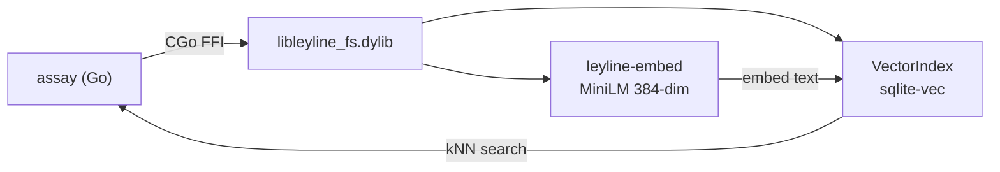

# Ley-line Semantic Embedding Integration

## Problem

Assay's 4-layer matching cascade (exact, Jaccard tokens, Dice trigrams, doc comment bridging) works for name-level matching but can't catch semantic relationships. Example: docs that explain retry logic without ever mentioning `RetryWithBackoff` by name.

The existing scaffold in `internal/embeddings/leyline.go` shells out to the leyline CLI. We want to eliminate that.

## Approach: CGo FFI

Link assay (Go) directly against ley-line's `libleyline_fs.dylib` (Rust, already compiled as cdylib+staticlib). Use existing `leyline_knn_search` for vector search. Add new C FFI for embedding text.



### Why not alternatives?

| Option | Verdict |
|--------|---------|
| UDS socket | Missing embed/search ops, needs daemon running |
| Full Rust rewrite | Throws away working Go code for one layer |
| Shell-out | Vetoed |

## Ley-line Changes

### 1. New feature gate in `leyline-fs`

**`rs/crates/fs/Cargo.toml`**:
```toml
embed-ffi = ["vec", "dep:leyline-embed"]

[dependencies]
leyline-embed = { path = "../embed", optional = true }
```

### 2. Four new FFI functions

**`rs/crates/fs/src/lib.rs`** (behind `#[cfg(feature = "embed-ffi")]`):

```rust
// Open arena with VectorIndex attached
leyline_open_with_vec(path, vec_db_path, dims) -> *LeylineCtx

// Embedder lifecycle
leyline_embedder_new(model_name) -> *Embedder
leyline_embed_text(embedder, text, out_floats, dim) -> i32  // 0=ok, -1=err
leyline_embedder_free(embedder)
```

~80 lines, follows existing FFI patterns. Update `include/leyline_fs.h` to match.

### 3. Build

```bash
cd /path/to/ley-line/rs
cargo build --release -p leyline-fs --features vec,embed-ffi
# produces target/release/libleyline_fs.dylib
```

## Assay Changes

### 4. Replace embeddings package

**Delete** `internal/embeddings/leyline.go` (shell-out scaffold).

**Create** two files with build tags:

`internal/embeddings/leyline_cgo.go` (`//go:build cgo && leyline`):
```go
/*
#cgo LDFLAGS: -L${SRCDIR}/../../lib -lleyline_fs
#cgo CFLAGS: -I${SRCDIR}/../../include
#include "leyline_fs.h"
*/
import "C"

// Open, Close, NewEmbedder, Embed, KNNSearch — thin wrappers around C calls
```

`internal/embeddings/leyline_stub.go` (`//go:build !cgo || !leyline`):
```go
// All functions return errors.New("leyline embeddings not available")
// Available() returns false
```

### 5. Layer 5 in matching cascade

**`internal/coverage/compute.go`**:

```go
type EmbeddingMatcher interface {
    SemanticMatch(refText string, entityNames []string) (string, float64)
}

func ComputeWithEmbeddings(entities, refs, fuzzyThreshold, matcher, semanticThreshold)
```

Layer 5 runs after doc comment bridging for still-unmatched refs:
1. Embed ref text via CGo
2. kNN search against pre-embedded entity names
3. Match if similarity > threshold

**`internal/embeddings/matcher.go`**:
- `LeylineMatcher` holds `Embedder` + `LeylineCtx`
- On init: embeds all entity names (with doc comments) into temp vec.db
- `SemanticMatch`: embed query, kNN search, return best above threshold

### 6. CLI flags

**`cmd/verify.go`**:

```
--semantic              Enable Layer 5 semantic matching (default: false)
--semantic-threshold    Similarity threshold (default: 0.7)
--model                 Embedding model (default: "minilm-q")
```

### 7. Build tasks

**`Taskfile.yml`**:

```yaml
build-leyline:
  desc: Build with leyline semantic embeddings
  cmds:
    - |
      CGO_ENABLED=1 \
      CGO_LDFLAGS="-L../ley-line/rs/target/release" \
      CGO_CFLAGS="-I../ley-line/rs/crates/fs/include" \
      go build -tags leyline -o bin/assay .
```

Existing `build` task unchanged (compiles without leyline).

## Verification

1. `task build && task test` -- stub build, no Rust needed, semantic features disabled
2. `task build-leyline` -- full build with CGo
3. Mock `EmbeddingMatcher` in `compute_test.go` -- unit tests for Layer 5 cascade
4. Integration test (`//go:build integration && leyline`):
   - Embed "creates a new graph cache" -> 384-dim vector
   - kNN search for "NewGraphCache" -> match found
5. Dogfood: `bin/assay verify --source . --docs . --semantic`

## Key Files Reference

### Ley-line
- `rs/crates/fs/src/lib.rs` -- existing C FFI, add new functions here
- `rs/crates/fs/include/leyline_fs.h` -- C header (cbindgen)
- `rs/crates/fs/Cargo.toml` -- add `embed-ffi` feature
- `rs/crates/embed/src/lib.rs` -- `Embedder` public API (Rust-only, no FFI yet)
- `rs/crates/fs/src/vector.rs` -- `VectorIndex` (sqlite-vec backed)

### Assay
- `internal/embeddings/leyline.go` -- current shell-out scaffold (to be replaced)
- `internal/coverage/compute.go` -- matching cascade (add Layer 5)
- `cmd/verify.go` -- CLI wiring (add --semantic flags)
